# 014：无监督与半监督机器学习 2

在本节课中，我们将学习无监督和半监督机器学习中的并行与高性能计算视角。我们将重点关注聚类、降维、计算嵌入（特别是图节点嵌入）以及图神经网络等任务，并探讨它们如何依赖于底层的线性代数运算。

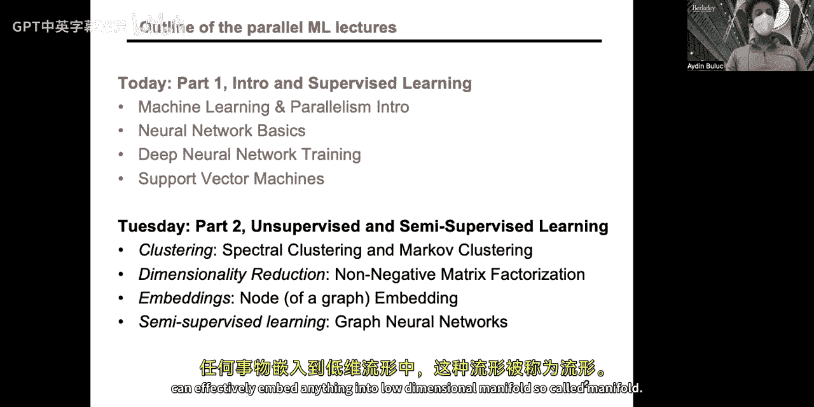

上一节我们回顾了监督学习，本节中我们来看看无监督和半监督学习。需要明确的是，我们并非要在一节课内覆盖所有机器学习知识，而是从并行和高性能计算的角度审视这些方法。

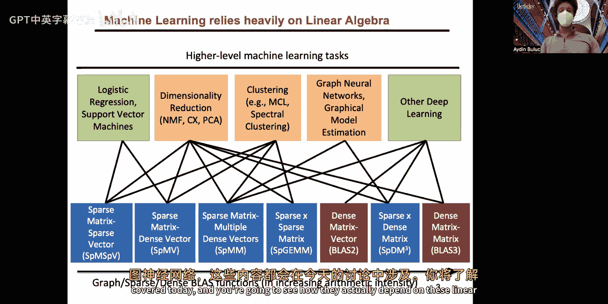

## 核心概念与依赖关系

下图展示了不同机器学习任务和方法对线性代数运算（稀疏或稠密矩阵操作）的依赖关系。本节课将涵盖降维、聚类和图神经网络，并揭示它们如何依赖于底部列出的线性代数运算。

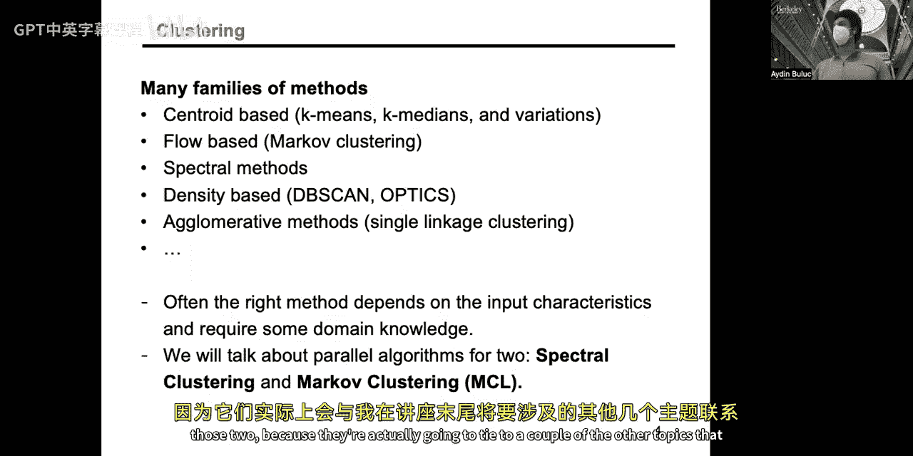

## 🧩 聚类算法概述

聚类算法种类繁多，有时会被戏称为“一毛钱一打”。这是因为数据集特性各异：有些具有真实坐标，有些需要估计；有些结构我们希望揭示的并非基于密度或质心，有时我们希望发现紧密连接的长条状物体。因此，存在多种聚类算法是合理的。

以下是几种常见的聚类算法：
*   谱聚类
*   基于密度的聚类
*   基于质心的聚类
*   基于流的聚类

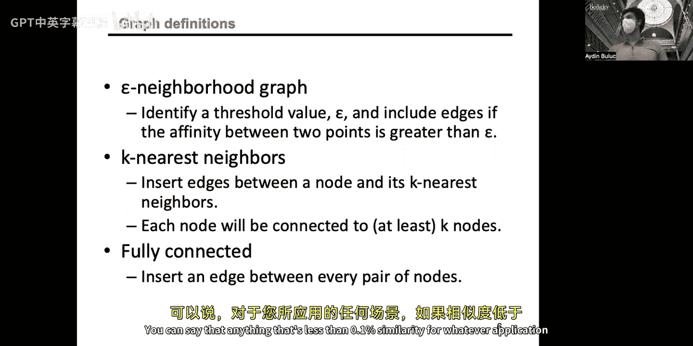

您可能已经在某些应用或先修课程中了解过其中一部分。通常，选择正确的方法确实取决于输入特征和领域知识。我们将重点讨论其中两种算法，因为它们与本课后续的其他主题紧密相关。

## 📊 谱聚类

谱聚类的输入是数据点之间的相似度。如果数据本身不提供相似度，您需要先计算它们。某些领域有定义数据点相似度的特定方法；如果没有，则有一系列公认的相似度矩阵可供选择，如余弦相似度、Jaccard指数、皮尔逊相关性等。应用时需结合数据特性思考，切勿盲目使用。

一旦获得相似度，您可以将数据点之间的关系表示为图。边代表相似度（或其倒数，倒数相似度对于将相似点聚集在一起的情况更有意义，因为距离会缩小）。在计算相似度时或之后，您还可以通过不同方式定义图，以避免得到稠密图（如果比较每对点且相似度度量没有内置阈值，就会得到稠密图）。出于实际考虑，稠密图通常太大而无法存储和处理。

以下是常见的图构建方式：
*   **k最近邻图**：每个节点最多有k个邻居（通常恰好是k个，但若数据本身稀疏，可能不足k个）。
*   **ε邻域图**：设定一个连通性阈值，例如将相似度低于0.1%的边置零。
*   **全连接图**：很少使用，仅出于完整性列出。

### 核心思想与拉普拉斯矩阵

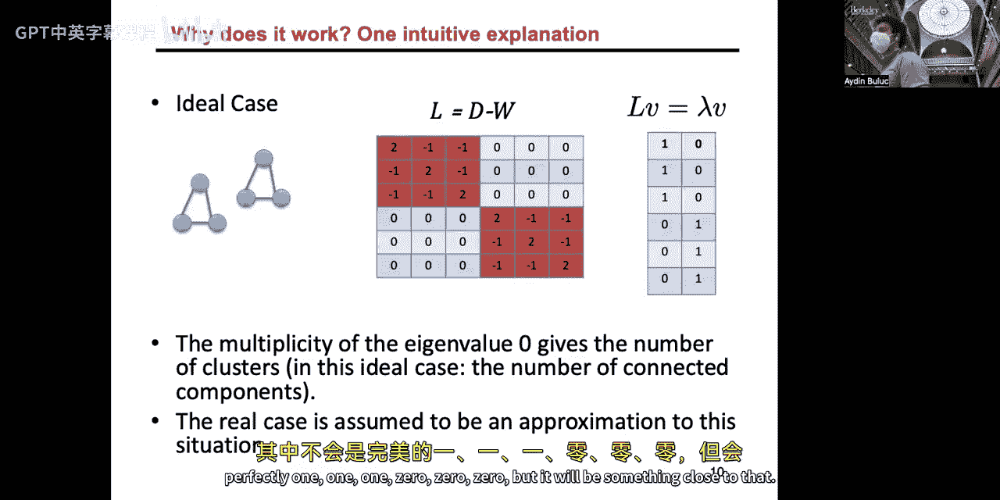

谱聚类的整体思路源于图的**最小割**概念：首先基于最小割将数据集分成两部分，然后递归地进行此步骤。这在理论分析上有用，但并未导出高效算法，因为识别最小割本身并不容易。因此，近似方法来自线性代数，特别是**图拉普拉斯矩阵**这一重要概念。

定义如下：
*   `W`：节点对之间的距离（或相似度）矩阵，是一个 `n x n` 矩阵。
*   `D`：度矩阵，是一个对角矩阵，对角线元素 `D_ii` 是节点 `i` 的度。
*   **非标准化拉普拉斯矩阵**：`L = D - W`。

但非标准化拉普拉斯矩阵由于数值原因并不总是最有用。还有另外两种拉普拉斯矩阵定义：
*   **对称标准化拉普拉斯矩阵**：`L_sym = D^{-1/2} L D^{-1/2}`
*   **随机游走拉普拉斯矩阵**：`L_rw = D^{-1} L`

其中，对称标准化拉普拉斯矩阵具有最佳性质（对称且正定），是最容易求解和处理的矩阵类别之一。

### 算法步骤

计算拉普拉斯矩阵后，获取其**K个最小特征值对应的特征向量**（即特征值最小的K个特征向量）。将它们作为列向量组成一个矩阵，然后对其使用标准聚类算法（如K均值），因为这些特征向量现在成为了数据的坐标。

直观上，这之所以有效，可以考虑理想情况：假设图中的簇是连通分量。在这种情况下，特征值0的重数将等于簇的数量，并且每个特征向量将类似于指示向量（在簇成员位置为1，其余为0）。可以验证确实如此。因此，在此向量数据上运行K均值聚类将很容易找到簇。在实际的“混乱”图中，假设它是理想情况的近似，特征向量不会是完全的1/0模式，但会接近于此，K均值仍能发现簇。

### 并行实现与求解特征向量

那么如何找到这些特征向量呢？这需要标准的科学计算工具。最常用的算法是**Lanczos算法**，其核心运算是稀疏矩阵-向量乘法。算法迭代地进行此操作并收缩值，直到获得所需数量的特征向量。

近年来一种流行的替代方案是**块局部优化预条件共轭梯度法**。它将稀疏矩阵-向量乘法替换为稀疏矩阵-多向量乘法，从而一次性尝试提取由多个向量张成的整个子空间。人们现在更偏好这种方法，因为稀疏矩阵-向量乘法几乎没有数据复用，无法接近机器峰值性能；而稀疏矩阵-多向量乘法随着向量数量的增加，能获得更高的利用率和算术强度。

当然，这些只是底层算法的运算。您可能不想自己实现这些复杂算法来获取特征向量，可以使用现有的软件包（如ARPACK和PRP）。这些库采用反向通信接口设计，您只需基于GPU（或任何最佳实现）提供稀疏矩阵-向量（或多向量）乘法例程，库本身处理外层迭代逻辑以确保正确性。

据我所知，一个并行的谱聚类实现使用了`ParTC`。谱聚类在某些数据集上仍然被广泛使用，并且与许多其他谱方法（如谱划分）有联系。

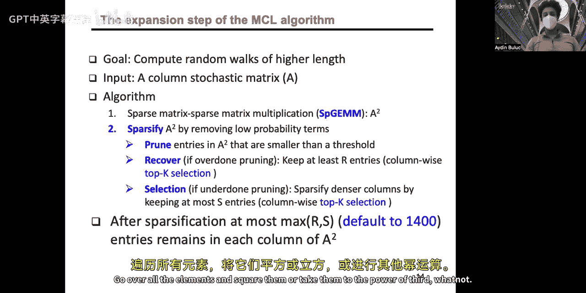

## 🌊 基于流的聚类（马尔可夫聚类，MCL）

接下来我们看另一种聚类算法：基于流的聚类（也称为随机游走聚类）。其哲学思想如下：假设有一个图，其中包含几个近似团状的结构，彼此松散连接。如果从任何点开始随机游走，通常，从红色簇内节点开始的游走，其停留在该红色簇内的概率会高于到达其他地方的概率。这就是随机游走的思想：你将被“困”在自己所属的簇中，如果图结构连接良好。

那么，为什么不从每个顶点同时开始随机游走，然后汇总到达图中特定位置的所有概率呢？这就是MCL的基本思想。我们需要做一些处理以确保收敛，因为如果不进行任何正则化（即不削减小概率），游走最终会到达所有地方，这无法用于簇提取。我们需要在每次迭代中进行某种“锐化”。

迭代过程如下：
1.  **扩展**：对矩阵进行平方（矩阵是图的邻接矩阵或其标准化版本）。通常使用标准化版本（双随机化）以确保每个节点在每一步随机游走中能分配给邻居的概率质量相同。
2.  **膨胀**：对矩阵中的每个元素进行乘方运算（例如平方），然后重新标准化。
3.  **修剪**：通过阈值化或选择每个节点最重要的K个邻居（类似K最近邻）来削减小概率边。
4.  重复上述步骤。

膨胀步骤的作用：由于矩阵是随机的，元素和为一，每个元素都小于1。对元素进行乘方（如平方）后，很小的值会迅速趋近于零。例如，0.9和0.1相差9倍，平方并重新标准化后，差异会放大到81倍。这样，小条目更容易被修剪掉。膨胀步骤在并行环境中是令人尴尬的并行操作。

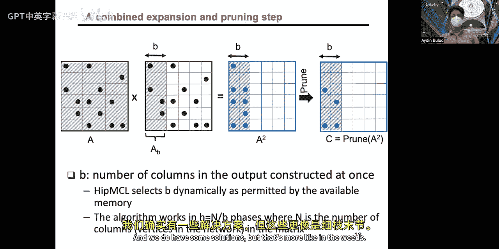

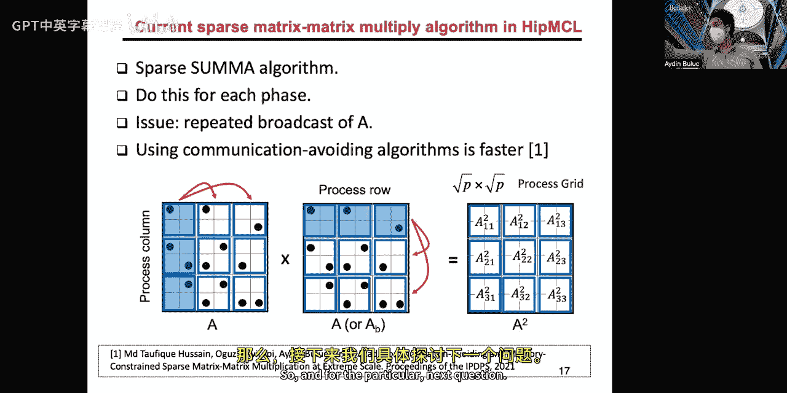

### 大规模实现挑战

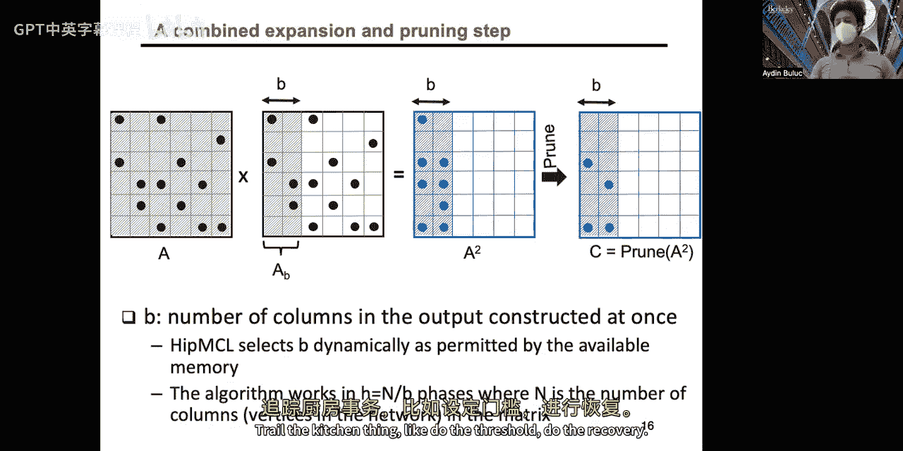

如何实现呢？我提到了矩阵平方，但对于想要进行聚类的大型图邻接矩阵，平方操作通常是不可能的。例如，一个拥有5亿节点、每个节点有1000条边的图，平方后每个节点可能产生约100万条边。存储这样的矩阵即使使用超级计算机也无法实现。

如何解决这个问题？这属于一类通用问题，即输出矩阵的条目并不完全相互依赖。思考下一步操作：我需要进行列随机标准化，因此需要整列数据。但在进入下一步之前，每个列的处理可以相对独立，因为我将在列内部进行修剪（例如，从500万条边中只保留1000条）。因此，我可以一次只计算一列输出。这是串行MCL的实现方式，但无法获得太多并行性。

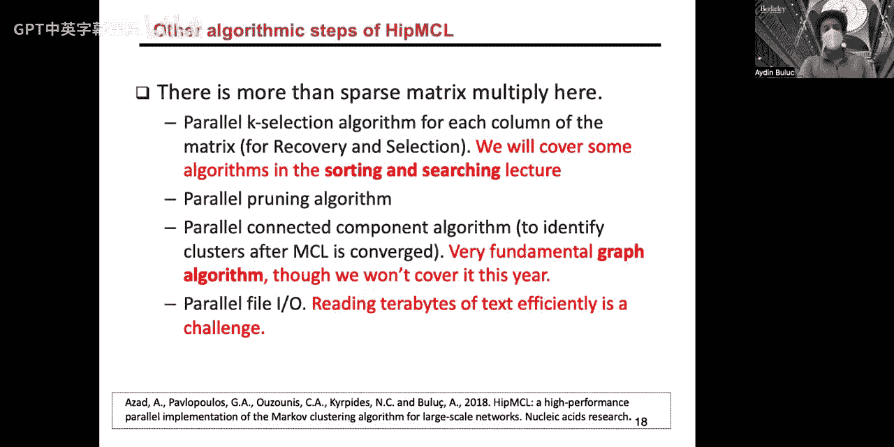

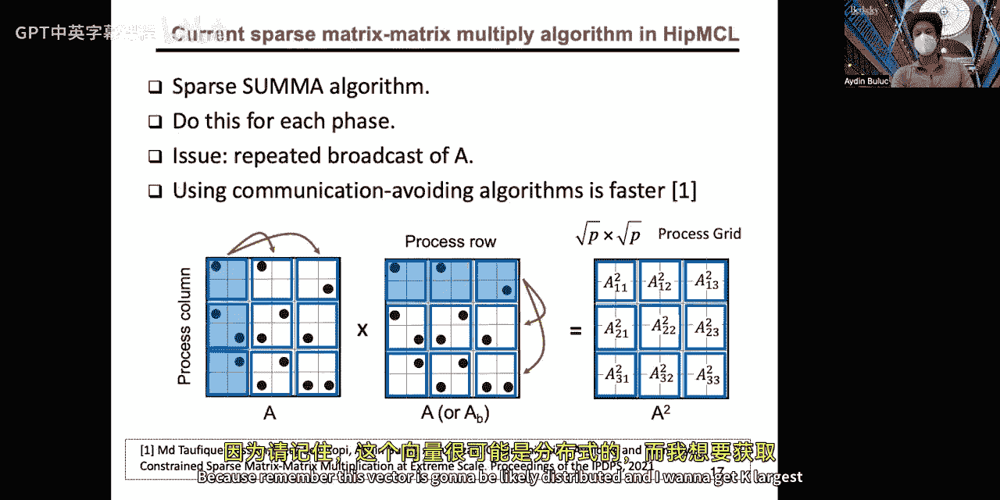

权衡点在于：根据内存预算，一次可以生成的最大列数是多少？这就是在不耗尽内存的情况下能从问题中提取的最大并行度。我们正是这样做的：一次生成B列，修剪后每列的非零元数量从百万级降到K，减少了三个数量级，然后处理下一批B列。这带来一些权衡：算法可能需要重复通信第一个矩阵A，因为即使只生成B列输出，也需要整个A矩阵。除非能找到有效的缓存方案，否则A可能需要反复广播。

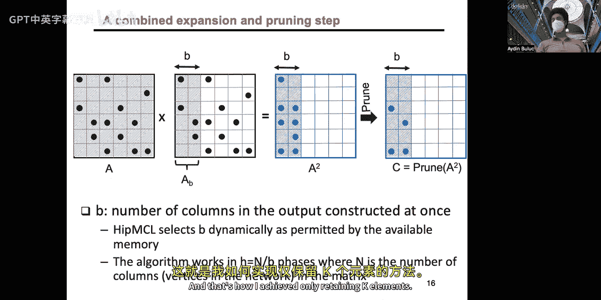

### 关于修剪的讨论

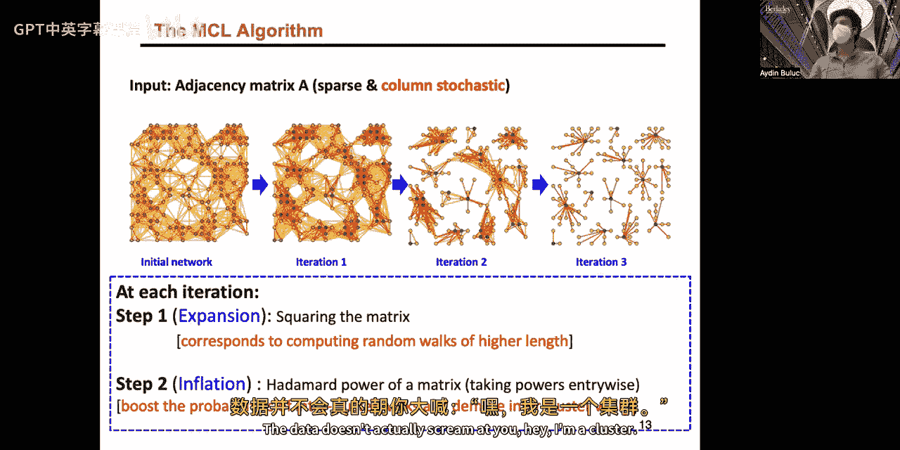

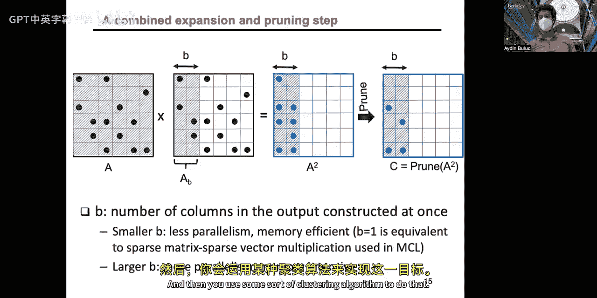

修剪条目是否会损失精度？实际上，如果不进行修剪，反复进行平方操作最终将得到完全稠密的矩阵，这既无法用于提取簇，也不可能存储。因此，修剪是一种正则化手段，旨在只保留强连接，将弱连接置零。实现方式几乎是任意的（阈值化或保留前K个）。实际上，使用MCL的领域科学家希望这些参数尽可能高，因为确实能获得更好的精度，但这受到计算资源的限制。

### 并行算法与性能

计算矩阵乘法本身可以使用任何算法。我们使用了SUMMA算法的一个变体（稀疏SUMMA）。实际上，自本幻灯片制作以来，我们已转向更复杂的通信避免算法。美妙之处在于，一旦将问题映射到矩阵代数，就可以重用课程中已讲过的通信避免算法或分布式矩阵算法。

其他方面也很有趣。例如，如何在分布式向量中选择最大的K个条目？这是一个常见问题，可以归结为寻找第K大元素（顺序统计量）。一旦知道这个值，就可以广播到所有处理器，让每个处理器删除小于该值的元素。我们将在排序和搜索的课程中讨论这个问题。

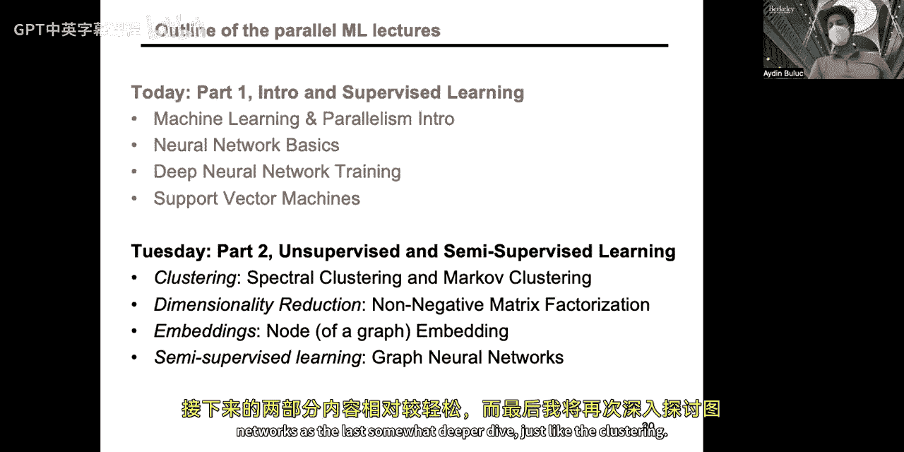

收敛后，我们仍未完成。通常经过10到20次迭代后，矩阵会收敛为不连通的星形结构，这些就是簇。但仍需识别它们，这需要用到连通分量查找等基本图算法。该领域的研究至今仍非常活跃。

另一个挑战是并行I/O。当输入数据达到TB级时，您不希望将所有时间花在读取数据上。如何高效处理？这是一个有趣的问题。

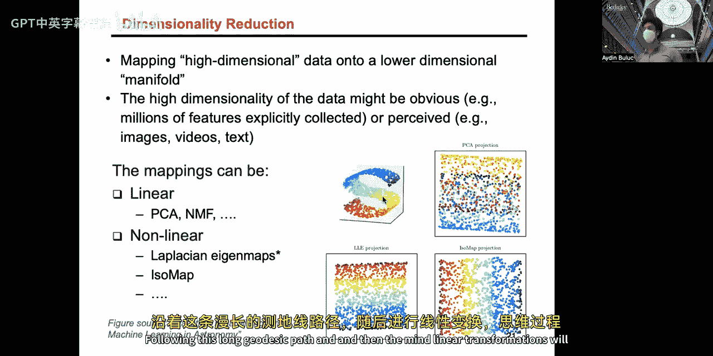

### 扩展性分析

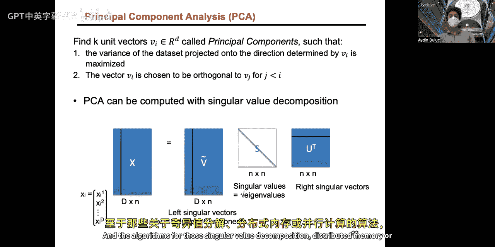

MCL的扩展性如何？下图展示了从256节点扩展到10000节点时，不同计算部分的加速情况。有趣的是，当节点数增加4倍时：
*   本地乘法速度提升4倍（符合预期）。
*   P的广播速度提升3倍（也合理，理论本就不期望完美线性扩展）。
*   但A的广播速度提升了超过4倍？这有点奇怪。

这实际上回到了Jim可能讲过的使用通信避免算法实现完美强扩展的技巧。当进行强扩展（问题规模固定，增加计算资源）时，如果拥有更多聚合内存，可以增加复制因子来减少通信，从而可能获得完美的强扩展。MCL虽然不是使用通信避免算法，但利用了类似的原理：我选择批量处理的列数B是一个基于内存的参数。当进行强扩展时，我可以选择更大的B，从而减少需要重复广播A的次数。因此，如果算法足够灵活以利用增加的内存，确实可以带来性能提升。

## 📉 降维

降维是指给定一个具有许多特征的数据集，你认为其中一些特征无用或相关，数据实际上存在于一个维度低得多的空间中（通常称为“流形”）。与聚类类似，降维也有无数种方法。

线性降维方法假设数据流形已经是线性的，例如主成分分析（PCA）和非负矩阵分解（NMF）。非线性方法则尝试先将输入转换为某种线性形式，再进行操作。我们只看最常用的几种。

例如，等距特征映射（Isomap）通过计算最短路径来处理非线性。它构建一个K最近邻图，计算数据点之间的最短路径，然后进行降维。如果你的数据呈“瑞士卷”形状，Isomap可以“展开”它，确保卷上相距较远但欧氏距离近的点之间的真实测地距离得以保持。

### 主成分分析（PCA）

最古老的降维算法是PCA。它选择向量方向，使得将数据集投影到该方向时方差最大。然后选择下一个向量，约束条件是与前一个正交。熟悉线性代数的同学会注意到，这可以通过奇异值分解（SVD）计算。右奇异向量成为主成分，奇异值缩放与右奇异向量的乘积构成其余部分。从某种意义上说，PCA将这个三矩阵问题转化为两矩阵问题。分布式内存或并行的SVD算法我们不再赘述，我们将以非负矩阵分解（NMF）作为降维的演示案例。

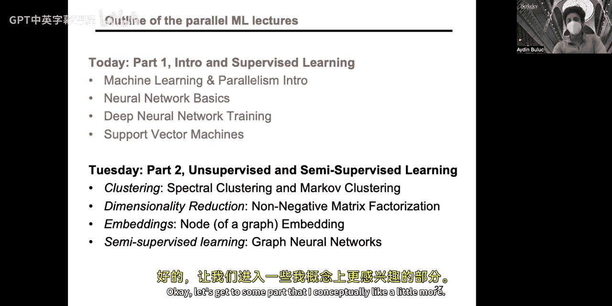

### 非负矩阵分解（NMF）

NMF问题近似于矩阵分解，但略有不同。传统的分解（如LU、QR）是精确的，而NMF的目标是最小化输入矩阵A与因子矩阵W和H乘积之间的距离（通常使用Frobenius范数），并约束W和H的元素为非负。NMF因可解释性而流行：在许多应用中（如人口统计），负值条目没有意义。

有许多方法可以求解NMF。我们关注一种通用框架：**交替更新框架**。观察矩阵，我们有一个输入A和两个未知矩阵W和H。无法同时求解两个未知数，因此可以：
1.  选择一个好的初始化（例如随机初始化，或先运行PCA并将负值置零）。
2.  固定一个矩阵（如H），求解另一个矩阵（W）。
3.  固定W，求解H。
4.  重复直到满足收敛条件。

框架内的变化在于如何求解每个子问题。至少有三种方法：
*   **乘法更新**：最早提出的方法。
*   **交替最小二乘法（ALS）**：随后出现。
*   **交替非负最小二乘法（ANLS）**：目前最先进的方法。

这些方法在确保非负性的粗暴程度上有所不同。例如，ALS求解最小二乘问题，但解中可能出现负值，然后强制将其置零。ANLS则使用特殊算法确保解从一开始就是非负的。当然，你也可以使用标准的随机梯度下降来求解NMF，因为这是一个有目标函数的优化问题。

### NMF的并行方面

交替更新的主要计算变成了矩阵乘法。H和W在大多数应用中是稠密的，A可以是稠密或稀疏的。计算涉及`W^T W`、`H H^T`等内积，这些通常较便宜，因为因子矩阵较小。大部分时间将花在计算`A H^T`或`W^T A`上，其中A是大矩阵。

因此，性能优化的重点应放在这些大规模矩阵乘法上。你可以使用Jim在稠密线性代数课程中讲过的相同技巧，或我在各种应用（包括上一讲）中讨论过的机制。

结论是：对于稠密情况，**永远不要通信大矩阵A**，因为如果有一个大的稠密输入和小因子，最佳算法是保持大矩阵静止，移动其他所有东西。当A变得稀疏时，问题取决于稀疏程度和规模，你可以使用我们已经研究过的几乎相同的算法。

## 🧬 嵌入

“嵌入”一词经常被提及。从图的角度来理解：假设你有一个图，其中节点代表实体，边代表它们之间的连接。直接将节点输入标准的机器学习管道（如PyTorch监督学习管道）是没有意义的，因为它们需要向量作为输入。那么如何从图中获得向量呢？这就是嵌入的目标之一。

嵌入的目标是将考虑的实体映射到一个低维空间（例如64维或256维），使得在这个新空间中的相似度能够近似我们心中基于图结构定义的相似度（如节点接近程度、共享邻居数量等）。当然，你可以嵌入任何可以用计算机表示的东西。一些著名的嵌入包括：
*   Node2Vec：用于图节点。
*   Word2Vec：用于文本。
*   Sequence2Vec：用于基因组序列。
*   Graph2Vec：将整个图映射为一个向量（适用于分子数据集等小图集合）。

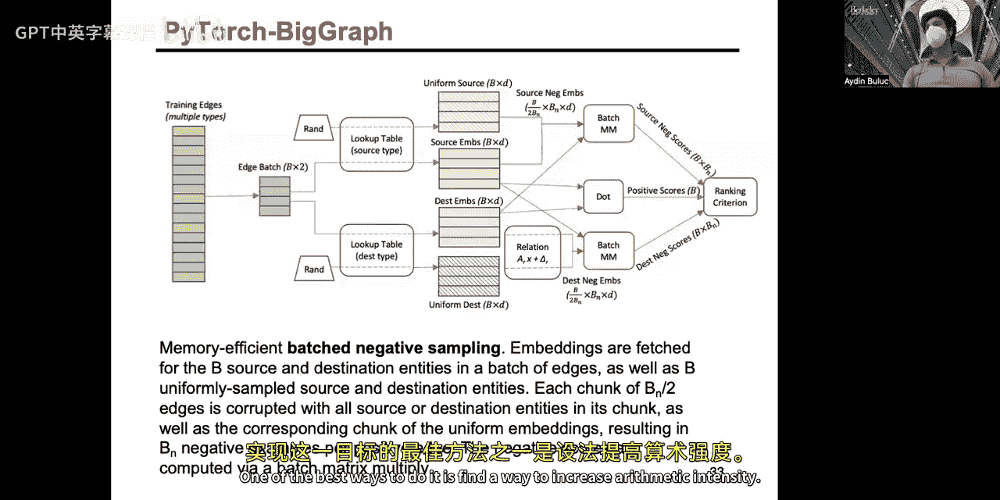

### 浅层嵌入方法

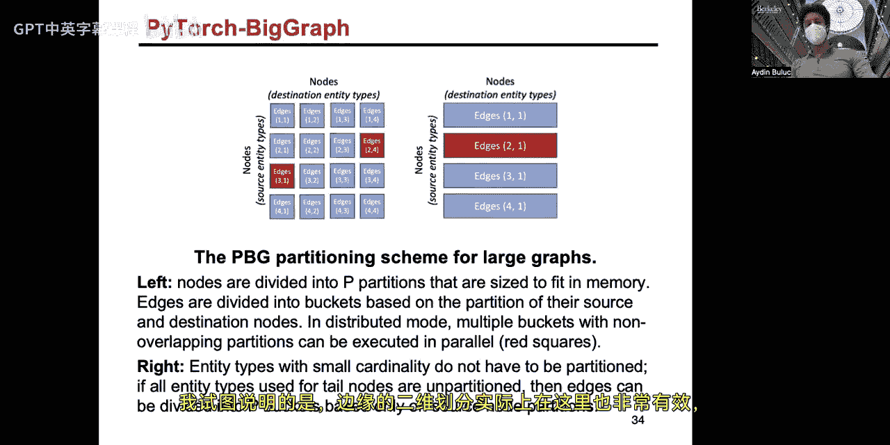

首先谈谈**浅层嵌入**（与“深度”相对，不涉及深度神经网络）：
*   **拉普拉斯特征映射**：就是我们描述的谱聚类去掉最后一步。我们不进行聚类，只是计算相似度矩阵的K个最小特征值对应的特征向量，这就是嵌入。完成了。
*   **图分解**：其目标函数看起来也像非负矩阵分解（但没有非负约束），可能有不同的范数或正则化器。可以使用相同的技术求解，如SGD或交替最小二乘框架。

这里的要点是，许多思想是相通的，我们在其他部分解决的技术可以跨领域应用。这些基于分解的嵌入的问题是它们是“直推式”的。一旦嵌入完成，遇到新的输入，除了从头开始整个操作外，没有好办法处理。而“归纳式”方法可以快速更新或预测。

在工程层面，你可以获取这些嵌入并将其作为许多聚类算法的输入。这应该不足为奇，因为我们说过拉普拉斯特征映射（嵌入）加上某种聚类算法就是谱聚类。因此，你可以将任何其他嵌入输入你喜欢的聚类算法。

### Node2Vec与性能优化

我想讨论一个特定的图节点嵌入框架（Node2Vec），不是因为要学习其所有工程细节，而是因为它的设计者充分利用了本课程中反复出现的主题。

另一种嵌入方法是基于随机游走：如果两个节点在随机游走中经常同时出现，它们必定相似。Node2Vec就使用了这种思想。问题在于，一旦写出计算这个的公式，你会发现需要生成“负样本”。图中存在的边只是数据中的一小部分，大多数节点对之间没有边，这些就是“负样本”。为了准确性，不能仅从正样本中学习，需要生成一些负样本。

通常的做法是随机扰动一条边的源节点或目标节点，并希望这个新对不在图中，以此作为负样本。但如果一次处理一条边，速度非常慢。PyTorch BigGraph的初始实现就是反复进行这种操作，导致性能低下。他们的结论是：为了使其可扩展，必须进行批处理。这会改变准确性，但可以接受（就像我们在上一讲的迷你批量SGD中看到的那样）。他们进行批量负采样，创建可以执行矩阵乘法的小矩阵，从而确保性能可接受。

这再次体现了本课程思想的适用性：要提高性能，最好的方法之一是找到提高算术强度的途径。

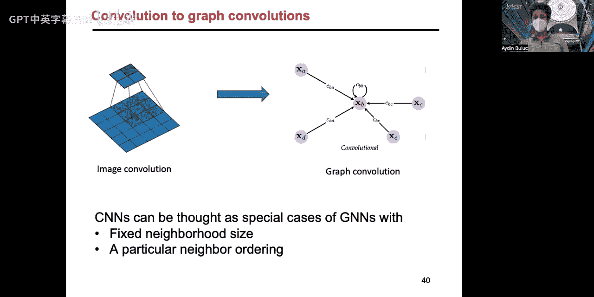

## 🧠 图神经网络（GNN）

图或节点嵌入的问题在于，它们虽然很好，可以将图、序列等奇怪形状的数据转换为向量，然后进行其他操作，但大多数这些操作是任务无关的，无法通过这些算法反向传播误差。如何使它们成为监督或半监督学习器呢？这就是图神经网络要讨论的。

图神经网络的初始用例是半监督学习。例如，在一个社交网络中，有些用户填写了个人标签（如政治倾向、性别），有些则没有。公司希望推断未填写用户的特征，这就产生了半监督学习：已知一些标签，想预测其他标签。这在科学中也很常见。

最古老的算法是**标签传播**，它本质上是一种“同辈压力”方法：如果我的大多数邻居都有标签A，我也声称自己有标签A。图神经网络则以一种完整的管道方式区分开来，可以反向传播误差、调整参数并反复进行。它可以应用于任何能表示为图的事物：蛋白质数据、电网、材料、交通网络、粒子物理等。

GNN可以回答多种问题：
1.  **节点分类**：例如，预测未声明政治倾向用户的政党、序列所属物种等。
2.  **图分类**：例如，分子图分类。每个分子是一个图，已知许多分子的性质，可以判断新分子图是否与已知分子相似，从而推断性质。这需要改变“读出”方式。
3.  **链接预测**：可以设计网络使其同时具有节点和边的嵌入，然后组合进行预测。

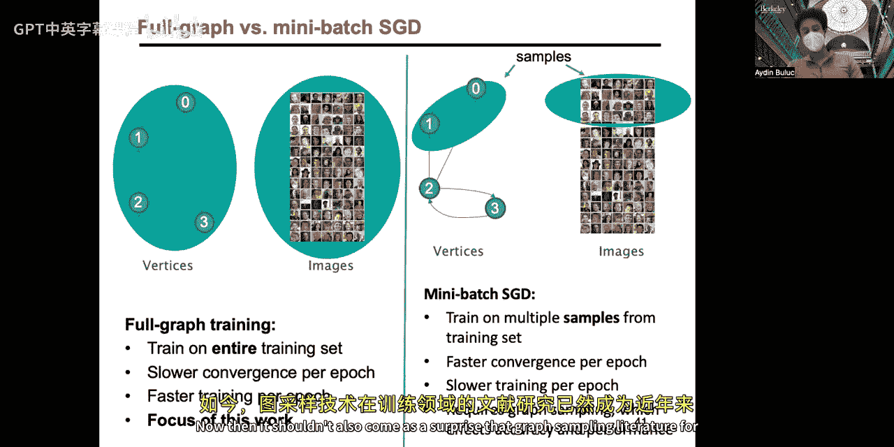

### 从图像卷积到图卷积

我们研究GNN并行计算的原因不仅是它们规模很大，还因为训练过程本身可能超出内存。即使图能放入内存，训练也可能不行。

让我们从与图像卷积的关联开始。在图像卷积中，你在图像上滑动卷积滤波器，得到潜在表示。如何将其推广到图呢？图没有固定大小的邻域，有些节点有百万邻居，有些只有十个。我们可以将其推广为：无论邻域大小如何，只需聚集邻居信息到中心节点。每个节点都可以作为中心节点同时进行此操作。你可以从一小批节点开始，也可以使用全SGD一次处理一个节点。相同的思路反复适用。

因此，GNN实际上是卷积神经网络的推广，更通用，可以处理任意邻域，并且是置换不变的（将邻居视为无序集合）。

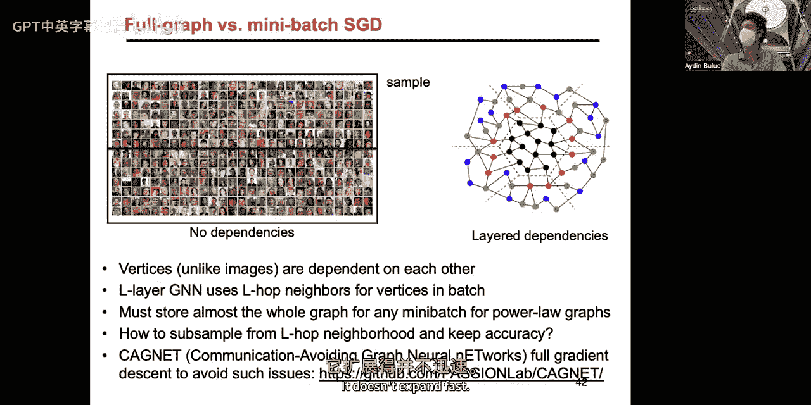

### 全图训练与采样挑战

我想强调的另一点是：能否像在CNN中那样从迷你批量SGD中获得相同的好处？答案似乎令人惊讶：至少对于节点分类，**不能**。当你有一个大图并想进行节点或链接分类时，如果你有许多小图，也许可以应用相同的思想，但这里存在特定问题。

假设在图像数据集中，我只想一次在一张图像上计算SGD，也许并行度不够，那我就增加到一次1000张图像。图像之间没有依赖关系。但直接应用于图时，假设我一次从两个节点开始作为迷你批量。这两个节点依赖于它们的邻居，邻居又依赖于其他邻居。如果网络有五六层深，我的小批量将依赖于图中的几乎所有节点。因此，即使只在一小部分节点上训练，我也已经触及了整个输入。这带来了几个问题：尽管我知道随机SGD和迷你批量可以加速收敛，但如果使用它，由于无论如何都会触及所有节点，训练1%的节点可能与训练每个节点花费相同的时间。

因此，人们试图通过**图采样**来解决这个问题。如果你有一百万个邻居，不要试图从所有邻居那里聚合信息，因为这一百万个邻居在下一层将集体产生十亿个连接。如何确保只依赖于可控数量的邻居呢？进行采样。你可以说每次迭代只想要10%的邻居，甚至可以固定为一个常数。这与我们在构建谱聚类图时使用的技巧相同，它允许我们在牺牲一些精度的情况下控制内存和计算需求。

图采样训练文献在过去几年变得非常热门，但在尘埃落定之前我不会深入讨论，因为任何内容明年都可能过时。因此，我们将讨论**全图训练**，即同时在所有节点上执行全梯度下降，而不是迷你批量。因为目前，在我们找到在分布式内存或任何并行环境中也能很好扩展的采样算法之前，全图训练在端到端解决方案中表现更好。

下图说明了我们讨论的问题：选择黑色节点作为迷你批量，网络有三层深。这些黑色节点需要整个图来聚合信息，因为图神经网络的每一层都从一跳远的邻居聚合信息，三层就意味着到达三跳远，这会呈指数级快速增长。

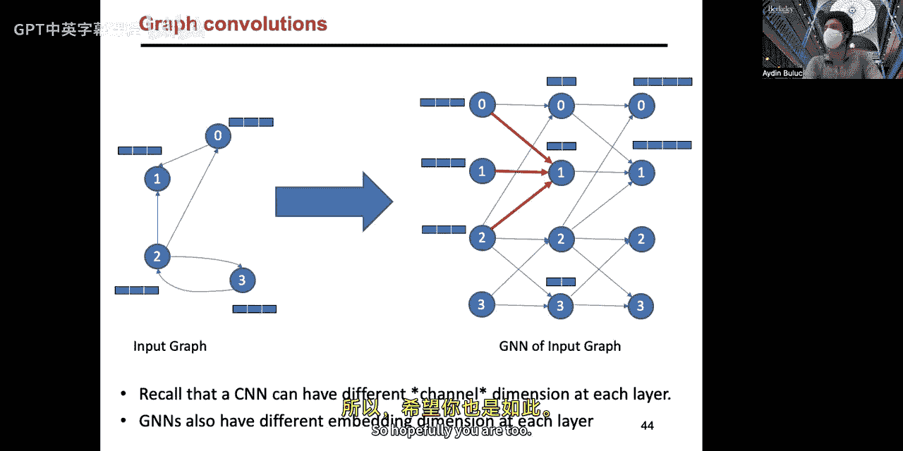

### 图卷积的矩阵形式与并行训练

让我们看看图卷积在矩阵形式下是什么样子。将每个人的特征向量堆叠成一个高瘦矩阵，其中行数是实体数量，列数是特征维度。从节点V6的角度看，它是这个稀疏矩阵的某一行与这个稠密高瘦矩阵的乘法，实际上是在组合V6的三个邻居的特征向量。每个节点都在同时从其邻居聚合特征。

当进行多层操作时，可以这样理解：在第0层，你有输入特征。然后每个人同时从邻居聚合，形成不同的潜在向量（类似于CNN中的通道）。初始特征向量长度可能是128，然后可能缩小以创建信息瓶颈，之后在输出层再扩展。因此，网络中间层的隐藏维度（嵌入）可能不同。

从数学角度看，公式如下：
`H^{(l)} = σ( A H^{(l-1)} W^{(l)} )`
其中，`A`是表示图的稀疏矩阵，`H`是输入特征或上一层的嵌入，`W`是可学习的混合矩阵（`F x F‘`，例如从3维到2维，`W`是3x2矩阵）。`W`在所有节点间共享，这使得深度神经网络在参数上相对节俭。

反向传播的公式也可以通过链式法则写出，但核心运算也是稀疏矩阵与高瘦稠密矩阵的乘法。因此，训练这些网络时，大部分时间将花在稀疏矩阵乘以高瘦稠密矩阵上。

### 全图训练的并行算法

如果我们写出全图训练的维度，会得到一个大的稀疏矩阵乘以高瘦稠密矩阵，以及一个相对较小的`W`。因此，如果使用全图训练，大部分时间将花在这里。如何高效执行这个大型稀疏矩阵乘以高瘦稠密矩阵的操作呢？我们可以回到通信避免算法集合：1D、2D、3D算法以及它们的插值（如0.5D是1D和2D的插值）。

标准的2D算法将每个矩阵以二维形式划分，两个矩阵移动，一个保持静止。通常输出是静止的，但也可以让稀疏矩阵A静止，如果A更大的话。由于稀疏性，算法决策更丰富：如果A更稀疏，移动A更便宜；如果相对稠密，则保持A静止并使用不同算法。2D算法是内存最优的，不进行复制，步骤数通常是P的函数（标准2D算法至少需要sqrt(P)步）。

1.5D算法以不同方式划分：将稀疏矩阵A二维划分，但将稠密矩阵B和C一维划分（实际上是两级一维划分）。这种算法会在一次乘法中计算输出，因此会进行复制。从拥有A部分数据的蓝色处理器角度看，它需要从B获取灰色部分，沿处理器列进行All-Gather，然后每个处理器进行本地矩阵乘，最后通过Reduce-Scatter输出。

与2D算法相比，1.5D算法的好处是：它不进行多阶段操作，只需一个阶段，减少了延迟；并且它在更大的矩阵块上操作，可能获得更高的算术强度。缺点是：在进行All-Gather后、Reduce-Scatter前，会复制B的数据块，复制因子最高可达sqrt(P)。3D算法也进行类似复制。

主要权衡是内存与通信。分析起来并不直观，但结果更有趣。我们在Summit超级计算机（每个节点一个GPU）上运行实验，比较纯1D算法与1.5D算法。增加复制因子C，运行时间确实下降。如果不使用复制，16个节点需要1.5秒，100个节点仍然需要差不多时间，扩展性不好。但增加C后，我可以在这些数据集上获得某种程度的扩展。

2D和3D的比较则更模糊，在这些输入规模上可能难以看出3D的好处，但在更大规模上差异可能更明显。

### 总结

总结GNN的并行训练：这正在改变科学。许多图上的深度学习问题由于内存占用大，需要进行分布式训练。我们刚刚讨论了如何在全梯度下降中进行全图训练。即使你的图能放入内存，训练也可能不行。原因在于，对于神经网络的每一层，所有节点嵌入都是活跃的。如果有1亿个节点，特征长度几百，就需要存储这个矩阵，因为反向传播需要它们。下一层同样需要。因此，存储需求是`节点数 × 层数 × 平均特征维度`，这通常远大于图本身。这就是为什么我们通常需要分布式训练，而且训练本身也很昂贵。

## 课程总结

本节课我们一起学习了无监督和半监督机器学习中的并行计算，重点涵盖了：
1.  **谱聚类**：基于图拉普拉斯矩阵的特征向量，核心运算是稀疏特征值求解。
2.  **马尔可夫聚类（MCL）**：基于随机游走和矩阵操作的流式聚类，涉及稀疏矩阵乘法与修剪。
3.  **降维**：特别是非负矩阵分解（NMF）及其交替更新框架，核心是矩阵乘法。
4.  **嵌入**：将图节点等实体映射为向量的方法，如拉普拉斯特征映射和Node2Vec。
5.  **图神经网络（GNN）**：用于半监督学习的强大工具，其训练核心是稀疏矩阵与高瘦稠密矩阵的乘法，我们讨论了全图训练下的并行算法（如1.5D算法）及其内存-通信权衡。

我们看到了这些不同的机器学习任务如何归结为相似的线性代数核心运算（稀疏/稠密矩阵乘法），以及如何应用本课程中学习的并行算法和优化思想（如通信避免、提高算术强度、采样与批处理权衡）来高效解决它们。