# 015：Ray - 一个通用的分布式计算框架 🚀

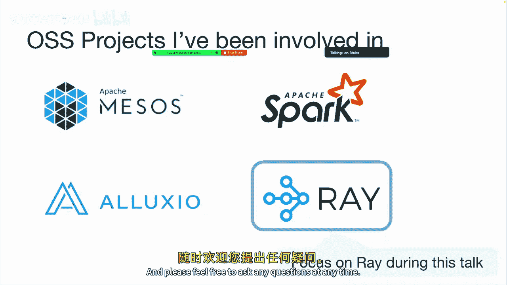

在本节课中，我们将要学习 Ray，这是一个由伯克利开发的通用分布式计算框架。我们将探讨其产生的背景、核心设计理念、基本使用方法、应用案例以及开发过程中的经验教训。

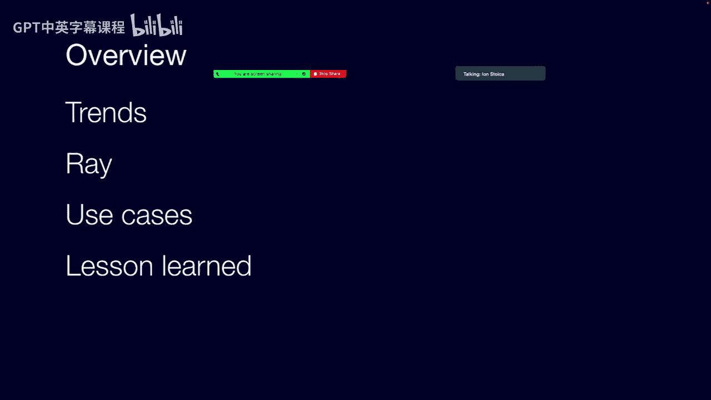

## 概述 📖

Ray 旨在应对一个核心挑战：随着人工智能应用需求的爆炸式增长，单个处理器或芯片的计算和内存能力已无法满足需求，唯一的出路是进行分布式计算。然而，传统的分布式系统通常针对特定任务（如数据处理、模型训练）设计，构建端到端的复杂应用（如包含数据预处理、训练、调参、服务的机器学习流水线）需要组合多个框架，这带来了开发、部署、管理和延迟方面的巨大挑战。Ray 的目标是成为一个统一的分布式计算框架，在其之上构建丰富的库生态系统，从而简化分布式应用的开发。

## 趋势与动机 📈

上一节我们介绍了课程背景，本节中我们来看看驱动 Ray 发展的几个长期趋势。

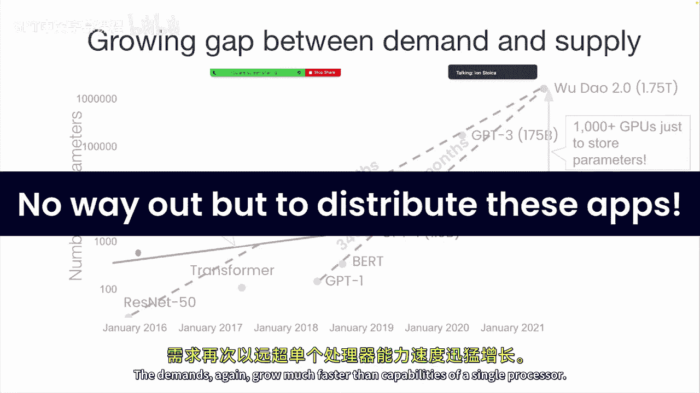

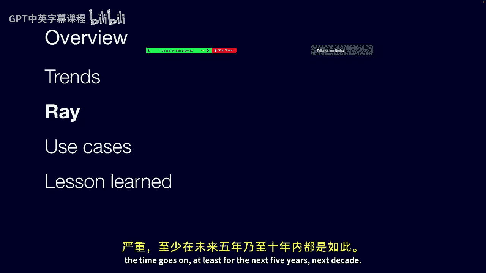

*   **AI 的普及**：人工智能正在渗透几乎所有行业，从金融、制造到医疗保健和游戏。
*   **AI 计算需求的爆炸**：训练最先进机器学习模型所需的计算量每18个月增长约35倍。例如，GPT-3（2020年）需要巨大的计算资源，而后续模型如“悟道”的参数规模更是其十倍。
*   **硬件能力的瓶颈**：即使摩尔定律（性能每18个月翻倍）仍在延续，其增长速度也远低于AI需求的指数级增长。GPU等专用硬件的性能增长也大致遵循此规律，无法填补需求缺口。
*   **内存/存储的挑战**：模型参数数量每18个月增长约40倍，内存需求同样严苛。几年前最大的模型还能放入单个GPU，现在则需要成百上千个GPU。

**结论**：为了支持未来的AI工作负载，**分布式计算是唯一可行的途径**。

## Ray 简介：核心理念与架构 🏗️

了解了驱动因素后，我们来看看 Ray 如何应对这些挑战。Ray 的核心思想是提供一个**通用**的分布式计算框架，取代针对不同任务使用不同框架的“拼凑”方式。

### 从“多框架拼接”到“统一框架+多库”

传统构建复杂应用（如推荐系统）的方式是：
1.  **数据摄取/特征化**：使用 Flink 等流处理框架。
2.  **模型训练**：使用 TensorFlow Distributed 等分布式训练框架。
3.  **模型服务**：使用自研或其他服务框架。

这种方式的问题在于：
*   **构建困难**：需要整合不同API的框架。
*   **部署和管理复杂**：需维护多个分布式系统。
*   **端到端延迟高**：数据在不同框架间移动通常需要序列化/反序列化并写入外部存储（如分布式文件系统）。

Ray 的方案是：
*   **一个统一的分布式计算框架 (Ray Core)**：提供基础分布式原语。
*   **多个针对特定工作负载的库**：在 Ray Core 之上构建，例如 `RLlib`（强化学习）、`Ray Tune`（超参数调优）、`Ray Serve`（模型服务）。这些库共享同一个底层框架，数据可以通过内存对象存储高效传递。

### 核心编程模型

Ray 扩展了通用编程语言（如 Python）中的两个核心结构：**函数**和**类**。

*   **任务**：远程执行的函数。使用 `@ray.remote` 装饰器修饰一个普通函数，它就变成了一个可以远程异步执行的任务。
*   **参与者**：远程实例化的类。同样使用 `@ray.remote` 装饰器修饰一个类，实例化后便成为一个有状态的、可远程调用其方法的参与者。
*   **分布式未来对象**：当调用一个远程函数或参与者方法时，它会立即返回一个“未来对象”（引用），代表尚未计算完成的结果。这允许提交多个任务并行执行。
*   **内存对象存储**：用于在任务和参与者之间**通过引用传递数据**，避免不必要的数据复制。

#### 代码示例：任务与参与者

```python
import ray
import numpy as np

# 初始化 Ray
ray.init()

# 1. 定义远程函数（任务）
@ray.remote
def read_array(file_path):
    # 模拟从文件读取数组
    return np.random.rand(100, 100)  # 示例数据

@ray.remote
def add_arrays(arr1, arr2):
    return arr1 + arr2

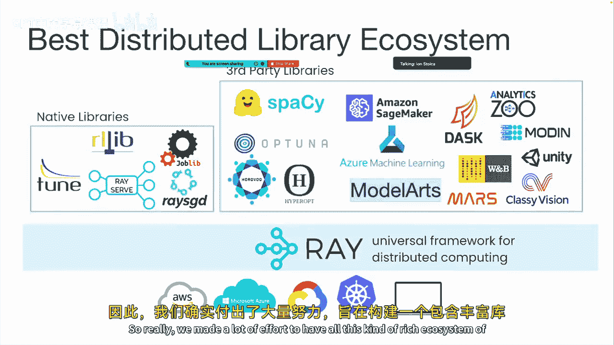

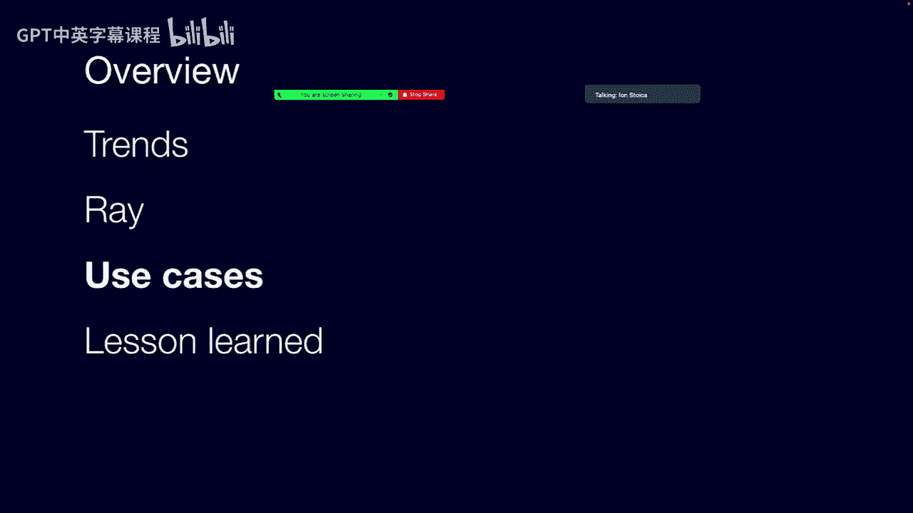

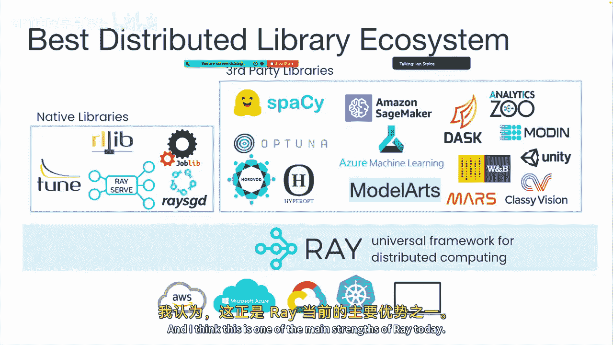


# 2. 定义远程类（参与者）
@ray.remote
class Counter:
    def __init__(self):
        self.value = 0
    def increment(self):
        self.value += 1
        return self.value

# 使用任务
future1 = read_array.remote("file1.txt")  # 立即返回未来对象，不阻塞
future2 = read_array.remote("file2.txt")
# 将未来对象作为参数传递，Ray 会解析依赖
future_sum = add_arrays.remote(future1, future2)
# 获取最终结果（此时会阻塞，等待计算完成）
result = ray.get(future_sum)
print(result)

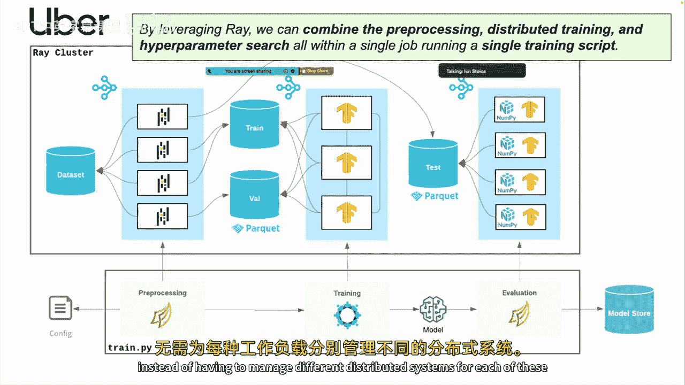

# 使用参与者
counter_actor = Counter.remote()  # 远程实例化
future_val1 = counter_actor.increment.remote()  # 远程调用方法
future_val2 = counter_actor.increment.remote()
print(ray.get(future_val1), ray.get(future_val2))  # 输出 1, 2
```

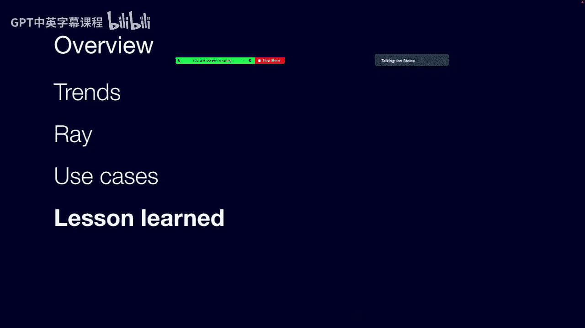

### 内存对象存储与数据传递

这是 Ray 实现高效的关键。通过对象存储，数据可以**通过引用**在任务间传递，而非值拷贝。

考虑一个场景：在节点1创建矩阵X，在节点2计算其逆矩阵Y，在节点3计算Y的平方。
*   **传统RPC方式**：需要将X从节点1传到节点2，Y从节点2传回节点1，再从节点1传到节点3。**Y被传输了两次**。
*   **Ray 方式**：
    1.  X 存入对象存储，获得引用 `X_ref`。
    2.  将 `X_ref` 传递给节点2的逆矩阵任务。该任务需要X时，从对象存储拉取。
    3.  逆矩阵任务产生结果Y，Y存入节点2的对象存储，返回引用 `Y_ref`。
    4.  将 `Y_ref` 传递给节点3的平方任务。该任务需要Y时，**直接从节点2的对象存储拉取**。
    5.  **Y只从节点2传输到节点3一次**，避免了到驱动节点的冗余传输。

### 系统架构概览

Ray 的架构设计注重可扩展性：
*   **驱动节点**：运行用户程序（脚本），提交初始任务。
*   **工作节点**：执行任务和参与者方法。
*   **分布式调度器**：将任务调度到合适的节点执行。它是分布式的，避免了单点瓶颈。
*   **内存对象存储**：每个节点都有，存储任务输入输出数据。
*   **全局控制存储**：维护系统的元数据，如对象引用表、参与者位置等。其内容可以被分片。
*   **关键特性**：
    *   **可扩展调度**：不仅驱动节点，工作节点和参与者也能提交任务，支持极高的任务提交速率。
    *   **基于血统的容错**：类似于 Spark，通过记录计算的血统图，在数据丢失时重新计算。对于有状态的参与者，容错更复杂，通常由应用层管理检查点和恢复。

## Ray 的应用案例 🌍

Ray 的灵活性和统一性使其在多个领域成功应用。

以下是几个典型案例：

*   **蚂蚁集团**：在其“融合引擎”AI技术栈中全面采用 Ray，支撑了推荐、反欺诈等50-60个内部应用。基于Ray的流处理、服务和交互式计算方案，已稳定支持了多年的“双十一”、“双十二”大促。
*   **Uber**：在其第二代机器学习平台“Canvas”中选用 Ray 作为基础架构。Uber 认为 Ray 提供了“生产机器学习生态系统急需的公共基础设施和标准化”，能够将预处理、分布式训练和超参数搜索统一在单个作业中。
*   **美洲杯帆船赛**：新西兰队及其技术合作伙伴（麦肯锡的QuantumBlack）使用 Ray 和强化学习来设计赛船和训练船员，并最终赢得了比赛。

## 经验教训与设计权衡 ⚖️

在 Ray 的开发过程中，团队积累了许多宝贵经验。

1.  **功能与性能 vs. 容错与可调试性**：
    *   **初期设计**：只支持无状态任务，容错和调试简单。
    *   **现实需求**：为支持GPU上保持状态（避免数据频繁进出GPU）和某些无法导出状态的模拟器（如强化学习环境），必须引入有状态的**参与者**，这增加了复杂性。
    *   **容错演进**：曾尝试为参与者做透明检查点，但面临**确定性重放**（多线程、非确定性计算）和**死锁**（如分布式训练中一个节点失败导致资源不足）的挑战。最终方案是：Ray 负责自动重启参与者，而将检查点和恢复逻辑交给应用程序处理。

2.  **所有权模型**：
    *   **初期问题**：分布式未来对象创建后，其最终位置未知。将所有元数据集中存储在全局控制存储中，存在延迟和故障恢复的竞态条件问题。
    *   **解决方案**：引入**所有权**概念。创建未来对象的**工作者**成为其“所有者”，负责跟踪该对象的状态和必要的重建。这简化了元数据管理和故障恢复。

3.  **灵活调度策略**：
    *   **挑战**：不同应用（如强化学习、分布式训练）对调度有不同需求（亲和性、反亲和性、组调度、数据本地性等）。
    *   **解决方案**：**临时资源**。核心调度器只处理物理资源约束。应用可以动态创建逻辑资源（如 `resource_X_available`），并在提交任务时将其作为约束条件。调度器会像处理物理资源一样对待它们。例如，要实现数据本地性，可以在创建数据对象的节点上创建一个特定的逻辑资源，然后要求消费该数据的任务必须调度到拥有此逻辑资源的节点上。

4.  **其他洞见**：
    *   **API 稳定性**：核心 API 在引入参与者句柄传递后，保持了惊人的稳定。
    *   **简单 API 不等于简单编程**：Ray 暴露了并行性，这比 Spark 等高级抽象更灵活，但也要求开发者显式处理并发，难度更高。
    *   **集群管理仍是痛点**：尽管有 Kubernetes，管理分布式系统集群依然复杂。Ray 的 `Ray Cluster` 和 AnyScale 公司提供的托管服务正是为了缓解此问题。

## 总结 🎯

本节课中我们一起学习了 Ray 分布式计算框架。
*   **背景**：AI 计算需求远超单机能力，分布式成为必然，但多框架拼接方案存在诸多弊端。
*   **核心理念**：Ray 作为一个**通用分布式框架**，通过**任务**、**参与者**、**未来对象**和**内存对象存储**等核心抽象，提供灵活的并行编程模型。在其之上构建丰富的**领域专用库**，形成强大生态系统。
*   **优势**：统一框架简化了开发部署，内存数据传递降低了延迟，分布式架构保证了可扩展性。
*   **应用**：在蚂蚁集团、Uber、美洲杯帆船赛等实际场景中证明了其价值。
*   **设计权衡**：在追求功能、性能与保障容错、可调试性之间需要不断权衡，所有权模型和临时资源等设计是应对复杂性的关键。

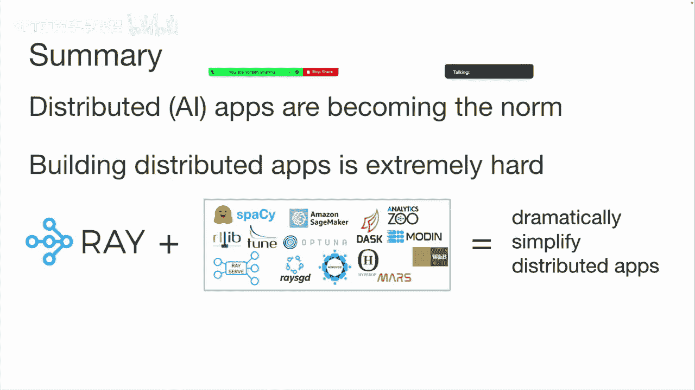

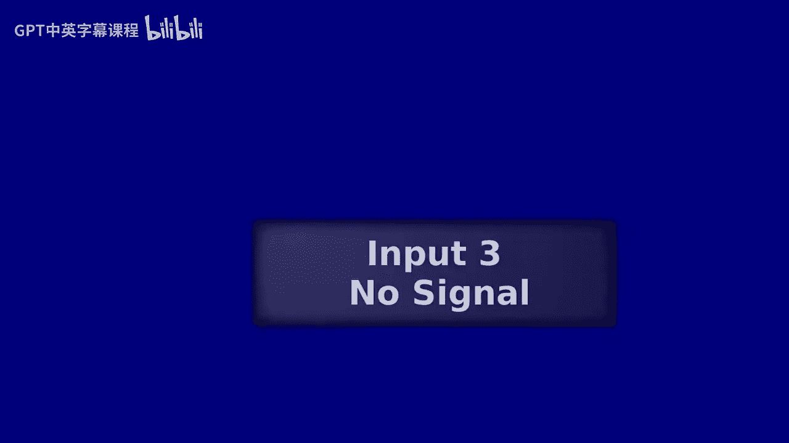

Ray 代表了简化分布式应用开发，特别是AI应用开发的一个重要方向。