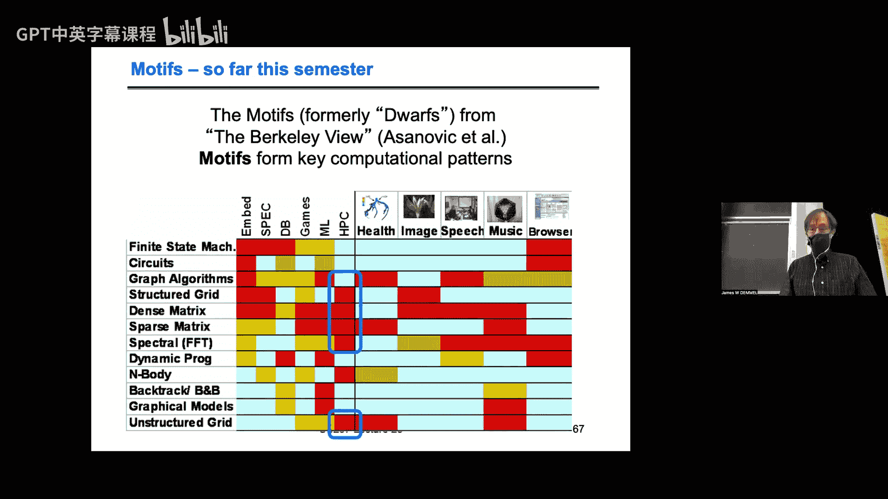

# 016：快速傅里叶变换


## 概述
在本节课中，我们将学习快速傅里叶变换（FFT）。我们将从基本定义开始，回顾其应用，推导顺序算法，并探讨如何并行化一维和三维FFT。我们还将介绍自动调优库FFTW，并了解如何通过优化通信与计算的重叠来提升性能。

---

## 1. FFT的基本定义与应用

上一节我们概述了课程内容，本节中我们来看看FFT的基本定义和一些关键应用。

FFT是一种特殊的矩阵向量乘法。对于一个长度为 `m` 的向量 `v`，其一维FFT定义为：
`y = F * v`
其中，`F` 是一个 `m x m` 的稠密矩阵，其 `(j, k)` 项为 `ω^(j*k)`。这里，`ω` 是单位根，定义为 `ω = e^(2πi / m)`。单位根的性质是 `ω^m = 1`。

二维FFT可以应用于矩阵。对于一个 `m x m` 的矩阵 `V`，其二维FFT定义为：
`Y = F * V * F`
这相当于先对矩阵的每一列做一维FFT，再对结果的每一行做一维FFT（顺序可互换）。高维FFT是类似的。

以下是FFT的一些重要应用领域：
*   **信号处理**：用于滤波，例如从含噪声信号中提取特定频率分量。
*   **图像处理与压缩**：JPEG图像压缩的核心算法就使用了离散余弦变换（DCT），这是FFT的一种变体。
*   **求解泊松方程**：FFT可以提供近乎最优的求解方法，复杂度为 `O(n log n)`。
*   **大整数乘法**：FFT被用于实现超快的大整数乘法算法。

---

## 2. 利用FFT求解泊松方程

上一节我们介绍了FFT的应用，本节中我们来看看它如何高效求解泊松方程。

泊松方程 `∇²u = f` 在离散后可以表示为一个线性系统。以一维为例，离散算子 `L1` 是一个三对角矩阵（`[ -1, 2, -1 ]` 模板）。

关键点在于，`L1` 矩阵的特征向量恰好是FFT矩阵的列。因此，`L1` 可以进行特征分解：
`L1 = (Imag(F)) * Λ * (Imag(F))^T`
其中 `Imag(F)` 是FFT的虚部（称为快速正弦变换），`Λ` 是由特征值组成的对角矩阵。

对于二维泊松方程，我们可以将其写为：
`(I ⊗ L1 + L1 ⊗ I) * x = b`
通过代入 `L1` 的特征分解并进行代数运算，可以将求解过程简化为：
1.  对右端项 `b` 执行二维FFT。
2.  求解一个对角系统（非常快速）。
3.  对结果执行逆二维FFT，得到解 `x`。

总计算成本约为 `O(n log n)`。在理想的并行机器上，甚至可以达到 `O(log n)` 的时间。

---

## 3. 顺序FFT算法推导

上一节我们看到了FFT如何用于求解方程，本节中我们来推导其核心的顺序算法。

FFT的本质是多项式求值。计算 `F * v` 的第 `j` 项等价于在点 `ω^j` 处求值一个系数为 `v` 的多项式。因此，问题转化为在 `m` 个不同点（单位根的幂）上求值一个 `m-1` 次多项式。

快速算法的核心是分治策略。我们将多项式 `P(x)` 根据系数奇偶性拆分为两个较小的多项式：
`P(x) = P_even(x²) + x * P_odd(x²)`
这里，`P_even` 和 `P_odd` 的度数约为原多项式的一半。关键在于，当 `x` 取遍所有 `m` 次单位根时，`x²` 只会取到 `m/2` 个不同的值。因此，原问题被转化为两个规模减半的子问题。

以下是递归算法的伪代码框架：
```python
def FFT(v, ω, m):
    if m == 1:
        return [v[0]]
    v_even = FFT(v[偶数索引], ω², m/2)
    v_odd = FFT(v[奇数索引], ω², m/2)
    for k in range(m/2):
        t = ω^k * v_odd[k]
        结果[k] = v_even[k] + t
        结果[k + m/2] = v_even[k] - t
    return 结果
```
该算法的计算复杂度为 `O(m log m)`。一个有趣的历史注脚是，这个算法虽然早在高斯时代就已存在，但在20世纪60年代由Cooley和Tukey重新发现并推广，从而引发了革命。

---

## 4. 一维FFT的并行化

上一节我们推导了顺序算法，本节中我们来看看如何将其并行化。

分析FFT的计算依赖图（一种蝶形网络），我们可以考虑两种基本的数据分布方式：
1.  **块划分**：每个处理器负责连续的一段数据。
2.  **循环划分**：每个处理器负责间隔分布的数据。

在并行执行过程中：
*   采用**块划分**时，前 `log P` 步需要通信，后 `log (m/P)` 步是局部计算。
*   采用**循环划分**时，情况正好相反：前 `log (m/P)` 步是局部计算，后 `log P` 步需要通信。

两种方式的通信总量（字数和消息数）理论上是相同的。为了获得最佳性能，我们可以结合两者：**开始时采用循环布局以利用局部性，在计算中间执行一次全局转置操作，将数据变为块布局，然后继续利用局部性完成计算**。这个转置操作在通信上对应于所有处理器之间的全交换。

并行FFT的通信下界是每个处理器需要移动 `Ω((m/P) * log(m/P))` 个字。上述“转置”算法在问题规模 `m` 远大于处理器数 `P` 的平方时，可以达到这个下界。

---

## 5. 三维FFT与通信/计算重叠优化

上一节我们讨论了一维FFT的并行化，本节中我们将其扩展到更实际的三维FFT，并探讨关键的优化技术。

三维FFT需要对一个 `Nx × Ny × Nz` 的数据立方体依次进行x, y, z三个方向的一维FFT。假设使用 `P` 个处理器，一种自然的数据分布是“板条”划分：每个处理器获得 `(Nx × Ny × Nz)/P` 的数据，即所有z方向的一层或几层。

计算流程通常为：
1.  局部完成所有x和y方向的FFT（无通信）。
2.  通过转置操作，重新分布数据，使得每个处理器拥有完整的z方向“铅笔”数据。
3.  局部完成所有z方向的FFT。

整个性能瓶颈在于第2步的全局转置通信。为了优化，核心思想是**将通信与计算重叠**。我们可以将待转置的大数据块分解成更小的单元进行发送，从而在发送一个小单元的同时，计算下一个单元。

以下是三种数据分解策略：
*   **大块**：发送尽可能大的消息，消息数量少，但重叠机会有限。
*   **板**：将数据沿一个维度切片发送，增加了消息数量，提供了更多重叠机会。
*   **铅笔**：将数据分解为单个一维FFT所需的数据条发送，消息数量最多，重叠潜力最大。

选择哪种策略取决于底层硬件和通信库（如MPI vs. Gasnet）对小消息带宽的支持程度。实验表明，在使用支持高效小消息通信的库（如Gasnet）时，采用“铅笔”策略、最大化通信计算重叠，能获得最佳的整体性能，有时可比简单实现提速近一倍。

---

## 6. 自动调优库FFTW

上一节我们深入探讨了手工优化策略，本节中我们介绍被广泛使用的自动调优库FFTW。

FFTW（“Fastest Fourier Transform in the West”）是一个能自动生成高性能FFT代码的库。其核心思想是**在运行时根据具体问题规模、硬件架构等因素，通过测量不同算法变体的性能，自动选择最优的执行计划**。

使用FFTW的基本步骤：
1.  **创建计划**：调用规划器，传入变换规模、类型（前向/逆向、实数/复数等）等参数。规划器会执行一系列基准测试。
    ```c
    fftw_plan plan = fftw_plan_dft_1d(n, in, out, FFTW_FORWARD, FFTW_MEASURE);
    ```
2.  **执行变换**：使用创建好的计划执行实际的FFT计算，此步骤速度极快。
    ```c
    fftw_execute(plan);
    ```
3.  **销毁计划**：释放资源。
    ```c
    fftw_destroy_plan(plan);
    ```

FFTW的优势包括：
*   **支持任意规模**：不仅是2的幂次。
*   **缓存无关算法**：使用递归分治，自动优化内存层次访问，无需知道缓存具体大小。
*   **利用SIMD指令**：能自动生成使用处理器向量指令的代码。
*   **持续维护**：支持并行计算和新架构。

一个有趣的轶事是，MATLAB曾集成FFTW，但一些用户抱怨首次运行FFT时速度慢（因为规划阶段耗时），而未意识到后续相同规模变换的加速效益，这体现了自动调优对用户透明度的挑战。

除了FFTW，还有像SPIRAL这样的项目，旨在将自动调优和代码生成技术扩展到更广泛的数字信号处理领域乃至硬件设计。

---



## 总结
本节课中我们一起学习了快速傅里叶变换。我们从定义和经典应用出发，推导了其分治算法。然后，我们深入探讨了并行化策略，特别是一维FFT的“转置”算法和三维FFT中通过分解数据（大块、板、铅笔）来重叠通信与计算的关键优化技术。最后，我们介绍了自动调优库FFTW，它通过运行时规划为用户隐藏了复杂的优化细节，提供了便捷的高性能FFT实现。FFT作为科学计算的核心构件之一，其优化体现了算法理论、并行编程和体系结构知识的深度融合。