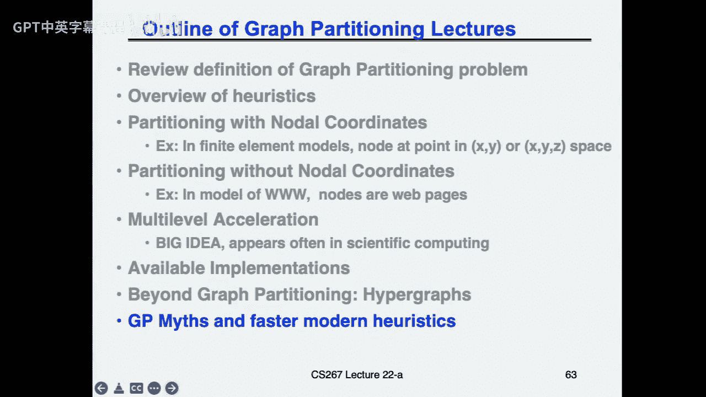
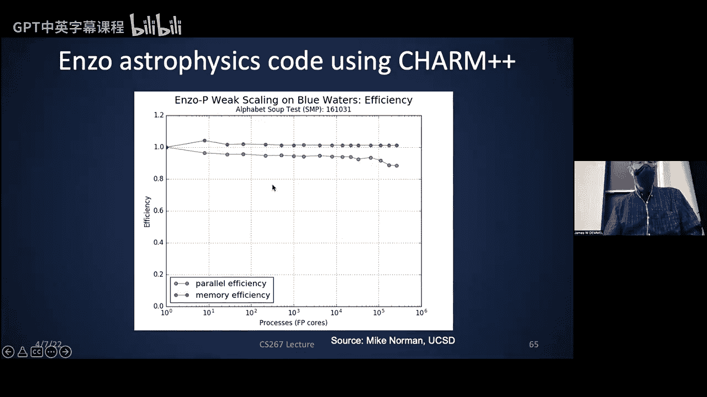

# 017：图划分与动态负载平衡 🧩⚖️

在本节课中，我们将学习两种关键的负载平衡技术：静态的图划分和动态的负载平衡。图划分适用于任务信息已知的场景，而动态负载平衡则用于任务信息未知或动态变化的场景。我们将探讨这些问题的定义、核心算法以及实际应用。

## 图划分：静态负载平衡 📊

上一节我们概述了课程内容，本节中我们来看看图划分的具体定义。图划分的目标是将一个图（代表计算任务）的节点分配给多个处理器，使得每个处理器的工作负载大致相等，同时最小化处理器之间的通信开销（即跨越分区的边权重之和）。

**核心问题定义**：给定一个图 `G = (V, E)`，其中每个顶点 `v` 有工作权重 `w(v)`，每条边 `e` 有通信权重 `c(e)`。目标是找到 `P` 个分区，最小化跨分区的边权重和，同时保持各分区顶点权重之和平衡。

### 应用场景 🛠️

以下是图划分的一些主要应用领域：

*   **稀疏矩阵向量乘法**：将矩阵的行分配给处理器，平衡计算量并最小化数据交换。
*   **VLSI布局**：节点代表芯片单元，边代表连接线，划分以优化布局。
*   **稀疏高斯消元**：用于最小化填充元（fill-in）。
*   **网络设计**：如最初的电话网络设计。

### 划分方法概述 🧠

由于精确求解图划分是NP难问题，我们使用启发式算法。主要分为两类：

1.  **基于几何坐标的方法**：当节点具有物理坐标（如来自网格）且边仅连接邻近节点时，可以忽略边结构，直接根据坐标空间进行划分（例如，使用平面分隔定理）。
2.  **基于图结构的方法**：考虑边的具体连接关系，适用于一般图（如网页链接图）。我们将重点讨论此类方法。

### 核心启发式算法 ⚙️

#### 1. Kernighan-Lin 算法 🔄

这是一种迭代改进算法。从一个初始划分开始，通过系统地交换两个分区中的顶点对来尝试减少割边权重。

**算法核心思想**：
1.  计算所有未标记顶点对的交换增益。
2.  选择增益最大的顶点对进行交换（即使增益为负），并标记它们。
3.  重复步骤1和2，直到所有顶点都被标记。
4.  在生成的所有交换序列中，选择使割边权重减少最多的那个前缀序列执行交换。
5.  重复整个过程直到无法改进。

该算法原始复杂度为 `O(n^3)`，但可通过优化实现 `O(|E|)` 的复杂度。

#### 2. 谱划分法 🌊

该方法受物理振动模型启发。将图的拉普拉斯矩阵的第二小特征值对应的特征向量（称为费德勒向量）用于划分。

**拉普拉斯矩阵 `L` 定义**：
*   `L[i][i] = degree(i)` （节点 i 的度）
*   `L[i][j] = -1` 如果节点 i 和 j 之间有边
*   其他位置为 0

**算法步骤**：
1.  构建图的拉普拉斯矩阵 `L`。
2.  计算 `L` 的第二小特征值及其对应的特征向量。
3.  根据特征向量中元素的正负号将顶点划分为两个集合。

**理论保证**：该划分通常能产生两个连通的分区，且第二特征值的大小反映了图的连通程度。

### 多级加速法 🚀

对于大型图，直接应用上述算法成本过高。多级方法通过递归地粗化、划分、然后再细化和改进来解决这个问题。

**多级划分流程**：
1.  **粗化**：将原图 `G0` 通过“最大匹配”或“最大独立集”等方法，合并顶点，生成一个更小的近似图 `G1`。
2.  **递归**：如果 `G1` 仍然很大，继续粗化，得到 `G2`, `G3`, ... 直到图足够小 (`Gk`)。
3.  **初始划分**：在最小的粗化图 `Gk` 上应用划分算法（如 Kernighan-Lin 或谱划分）。
4.  **细化与投影**：将 `Gk` 上的划分结果投影回 `G_{k-1}`，作为其初始划分，然后使用迭代改进算法（如 Kernighan-Lin）进行局部优化。
5.  **递归回代**：重复步骤4，逐级向上投影并优化，直到得到原图 `G0` 的最终划分。

### 超图划分 🎯

对于某些问题（尤其是非对称稀疏矩阵），标准图划分模型会高估通信开销。超图划分提供了更精确的模型。

**超图模型**：
*   在稀疏矩阵乘法中，为每一行创建一个顶点，为每一列创建一个“超边”（net）。
*   超边连接所有该列非零元所在行对应的顶点。
*   划分目标变为：平衡顶点权重，并最小化被切割的超边数量（每个被切割的超边仅贡献一次通信，无论它连接多少顶点）。

超图划分比图划分更精确，但计算成本也更高。

---

## 动态负载平衡 ⚡

上一节我们介绍了静态的图划分，本节中我们来看看当任务信息未知或动态变化时，如何进行动态负载平衡。

动态负载平衡的核心挑战是在减少负载不平衡开销和负载平衡操作本身的开销之间取得权衡。

### 性能测量 📏

首先，需要有效测量负载不平衡。不能只测量总运行时间，因为屏障同步或锁等待也可能导致延迟。需要测量：
*   每个任务的实际运行时间。
*   制作运行时间的直方图。
*   计算最大时间与平均时间的比值。

许多工具（如 Cray 的 HPC 工具包）可以自动收集这些数据。但需注意“海森堡效应”——测量行为本身可能会影响性能。

### 负载不平衡的来源 🕵️

负载不平衡可能源于：
1.  **任务本身**：任务大小可变、任务数量可变、任务间存在依赖关系（如树或DAG）。
2.  **硬件与系统**：操作系统守护进程、硬件错误纠正、在云环境中共享资源导致的性能波动和长尾延迟。

### 独立任务的负载平衡 🧺

对于循环迭代等独立任务，最简单的方法是使用**集中式任务队列**（自调度）。

**自调度优化**：
*   **块大小 `K`**：每次从队列中获取 `K` 个任务，而非1个，以减少队列访问冲突。
    *   `K` 大：队列竞争少，但负载平衡可能变差。
    *   `K` 小：负载平衡好，但队列竞争激烈。
*   **指导性自调度**：动态调整 `K`，例如每次取剩余任务数除以处理器数的量。

**分布式任务窃取**：
*   每个处理器维护本地任务队列。
*   处理器优先执行本地队列中的任务（LIFO顺序，利于局部性）。
*   当本地队列为空时，随机选择另一个处理器并“窃取”其任务（从该队列头部FIFO窃取，可能窃取到更大的工作块）。
*   窃取目标的选择：窃取邻近处理器利于局部性；窃取随机处理器利于快速平衡负载。

**理论保证（球与箱子模型）**：将任务随机分配给 `P` 个处理器，若任务数 `n > P log P`，则最大负载与平均负载的差有高概率很小。若每次随机选择 `d` 个处理器并将任务放入当前负载最轻的那个，性能会指数级提升。

### 依赖任务的负载平衡 🌳

当任务间存在依赖关系（如树形搜索、DAG）时，负载平衡更具挑战性。

**树搜索的负载平衡**：
*   **深度优先搜索**：并行度低，但内存占用少。
*   **广度优先搜索**：并行度高，但内存占用可能爆炸。
*   **迭代深化**：结合两者优点。
*   **随机化分配**：在树中随机将子树分配给不同处理器，可证明能以高概率实现良好的负载平衡。
*   **工作窃取 vs. 工作推送**：
    *   **窃取**：处理器空闲时才从别处窃取工作。利于局部性，但平衡速度慢。
    *   **推送**：主动将多余工作推送给随机选择的其他处理器。平衡速度快，但不利于局部性。

**DAG调度**：
*   对于已知的DAG（如线性代数运算），可以预先或动态生成任务图并进行调度。
*   关键是将任务分解为合适大小的块（`B x B`），以平衡调度开销和并行度。
*   现代编程模型（如 OpenMP 4.0+）支持任务依赖注解，可自动进行DAG调度。

### 考虑通信的动态负载平衡 📡

对于任务间需要通信的场景，有专门的框架如 **Charm++**。

**Charm++ 运行时系统**：
1.  将计算分解为“恰尔对象”。
2.  在程序迭代执行过程中，系统自动测量每个对象的计算时间和通信模式。
3.  周期性地进行负载重平衡，将对象迁移到不同处理器，以优化负载和通信。
4.  由于程序行为在迭代间变化缓慢，重平衡开销可以被分摊。

**层次化负载平衡**：在树形结构计算中，负载平衡可以层次化进行。子节点解决其子树的平衡问题，若无法解决则向上级父节点求助。

---

## 总结 🎓

本节课中我们一起学习了负载平衡的两个核心领域：

1.  **静态图划分**：用于任务信息已知的场景。我们探讨了 Kernighan-Lin 算法、谱划分法、多级加速以及更精确的超图划分模型。这些方法的核心是在平衡计算负载的同时，最小化处理器间的通信开销。

2.  **动态负载平衡**：用于任务信息未知或动态变化的场景。我们分析了性能测量方法、负载不平衡的来源，并介绍了针对独立任务的自调度和任务窃取算法，以及针对依赖任务（树和DAG）的调度策略。最后，我们了解了 Charm++ 这类考虑通信的运行时负载平衡系统。

关键权衡始终存在于**局部性**（将相关任务放在一起以减少通信）和**负载平衡**（均匀分配工作以充分利用所有处理器）之间，同时也存在于**平衡质量**和**平衡操作开销**之间。选择何种策略取决于具体问题（共享/分布式内存、任务依赖、成本可知性、通信计算比）和运行环境（特别是云环境的不可预测性）。幸运的是，存在大量成熟的算法和软件库可供利用，无需从头发明。