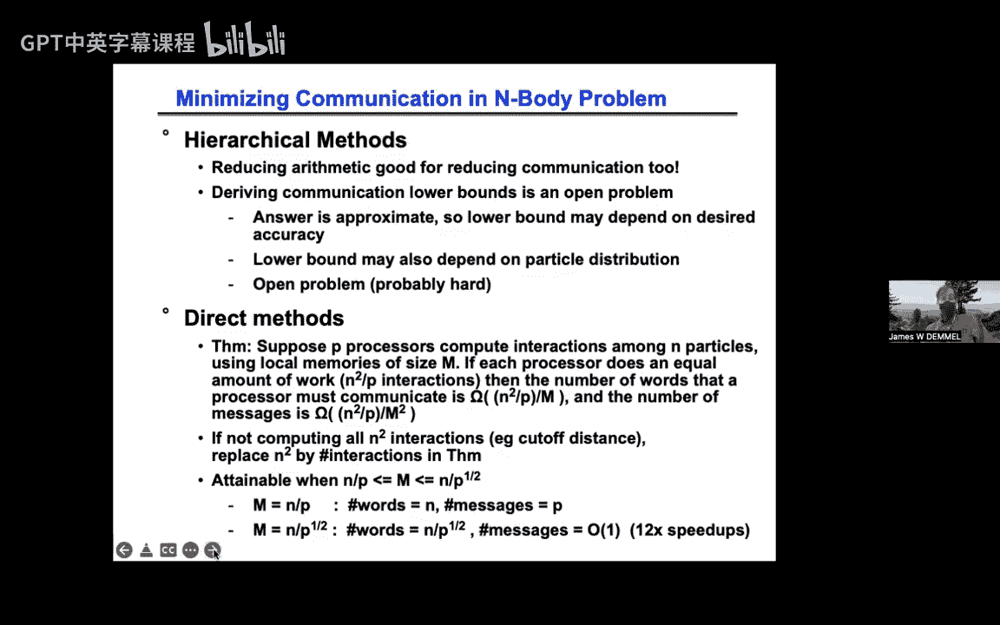

# 018：N体问题的分层方法 🪐


在本节课中，我们将学习用于解决N体问题的分层方法。N体问题的一个典型例子是引力模拟，其中每个粒子受到的力取决于所有其他粒子。直接计算这种相互作用需要O(n²)的复杂度，对于大规模模拟来说代价过高。我们将介绍两种核心算法——Barnes-Hut算法和快速多极子法，它们通过巧妙地压缩远距离相互作用的信息，将复杂度降低到O(n log n)甚至O(n)。我们将从基本概念、数据结构入手，逐步讲解算法原理，并探讨其并行化策略。

## 动机与应用实例 🚀

上一节我们介绍了N体问题的基本挑战。本节中，我们来看看这类问题在现实世界中的广泛应用。

以下是N体问题分层方法的一些重要应用领域：
*   **天体物理模拟**：例如，1992年戈登·贝尔奖获奖工作，在512个处理器上模拟了1.7亿个粒子。
*   **分子动力学**：用于化学、生物学等领域，模拟分子间的相互作用力。
*   **等离子体模拟**：对于设计托卡马克等核聚变反应堆至关重要。
*   **电子束光刻**：在芯片制造中用于模拟电子间的相互作用。
*   **计算机图形学**：例如，皮克斯动画电影《勇敢传说》中，通过模拟发丝上带正电的粒子间的排斥力，来生成逼真的头发摆动效果。

所有这些应用的共同点是，计算任意一点的状态（如受力）依赖于所有其他点的数据。直接计算需要O(n²)的工作量和通信量。

## 核心思想：压缩远场信息 🧠

上一节我们看到了N体问题的广泛应用。本节中，我们来探讨降低其计算复杂度的核心思想。

关键在于观察到**远处的信息可以被压缩**。远处的物体对本地的影响往往更平滑、更简单。例如，计算地球受到的引力时，可以将遥远的仙女座星系视为位于其质心、具有其总质量的一个点。这能提供我们所需的所有精度。

更一般地，我们将空间划分为许多小盒子（后续会介绍四叉树、八叉树等数据结构）。对于盒子外的一个粒子，我们判断是否可以用盒子的总体信息（如总质量和质心）来近似计算盒子内所有粒子对该粒子的影响。判断标准是一个比值公式：`D / R < θ`。其中，`D`是盒子的尺寸，`R`是粒子到盒子（或盒子质心）的距离，`θ`是一个用户设定的精度阈值参数。

这个思想可以递归应用。从仙女座星系的角度看，银河系是一个点质量；从仙女座内部一颗行星的角度看，远处的一个恒星系也可以被视为一个点质量。通过递归地构建空间划分树并应用此判断，我们可以将复杂度从O(n²)降至O(n log n)或O(n)。

## 数据结构：四叉树与八叉树 🌳

上一节我们介绍了压缩远场信息的核心思想。本节中，我们来看看实现这一思想所需的关键数据结构。

为了高效地组织空间和粒子，我们使用树形数据结构。在二维空间中，我们使用**四叉树**；在三维空间中，我们使用**八叉树**。为了使讲解和数学推导更简单，本教程将主要集中于二维情况。

一个完整的四叉树根节点代表整个空间区域。每个非叶子节点被均匀地划分为四个子区域（如西北、东北、西南、东南），对应四个子节点。这个过程递归进行，直到满足停止条件（例如，一个盒子内的粒子数少于某个阈值`q`）。

在实际模拟中，粒子分布通常不均匀。因此，我们构建**自适应四叉树**，只细分那些包含粒子的区域，避免为空白区域浪费内存和计算时间。树中节点的空间顺序通常采用**Morton序**（一种“倒C形”空间填充曲线），这有利于保持数据的空间局部性。

构建这样一棵树的开销是多少？插入一个粒子需要沿着树向下走到达其所属的叶子节点。因此，构建整棵树的总成本是`O(n * h)`，其中`h`是树的最大深度。对于均匀分布，深度为`O(log n)`；在最坏情况下，深度受限于粒子坐标的位数，是一个常数。因此，构建过程是`O(n log n)`或`O(n)`的。

## 算法一：Barnes-Hut 算法 (O(n log n)) ⚙️

有了四叉树数据结构的基础，现在我们来看第一个分层算法——Barnes-Hut算法。它由Barnes和Hut于1986年提出，能将计算复杂度降至O(n log n)，并提供约1%的精度。

Barnes-Hut算法的工作流程如下：
1.  **构建四叉树**：将所有粒子插入到自适应四叉树中。
2.  **计算节点摘要**：通过后序遍历（先子节点后父节点）计算每个树节点的总质量和质心。对于叶子节点，直接计算其内粒子的总质量和质心；对于父节点，合并其子节点的摘要信息即可。
3.  **计算受力**：对于每个目标粒子，调用一个递归函数`tree_force`来计算其受力。该函数以当前树节点为参数，逻辑如下：
    *   **基础情况**：如果当前节点是叶子节点（或粒子数少于`q`），则直接计算其内所有粒子对目标粒子的力（使用O(k²)的直接方法，k很小）。
    *   **近似判断**：否则，计算目标粒子到该节点包围盒的距离`R`和节点尺寸`D`。如果`D/R < θ`（θ是精度参数），则认为该节点“足够远”，直接使用该节点的总质量和质心来近似计算其内所有粒子对目标粒子的合力。
    *   **递归细分**：如果`D/R >= θ`，则认为该节点“不够远”，需要递归地对其所有子节点调用`tree_force`函数，并将结果相加。

以下是该算法的核心递归函数伪代码：
```python
def tree_force(particle, node):
    force = 0
    if node.is_leaf():
        # 直接计算节点内所有粒子对目标粒子的力
        for p in node.particles:
            force += compute_direct_force(particle, p)
    else:
        D = node.size
        R = distance(particle, node)
        if D / R < theta:
            # 使用节点的总质量和质心进行近似计算
            force += compute_approx_force(particle, node.mass, node.center_of_mass)
        else:
            # 递归处理子节点
            for child in node.children:
                force += tree_force(particle, child)
    return force
```
该算法的复杂度取决于精度参数`θ`。若`θ`很小（要求高精度），则递归会深入到树的底部，趋近于O(n²)。典型的1%精度设置下，算法复杂度为O(n log n)。

## 算法二：快速多极子法 (O(n)) 🚀

上一节介绍的Barnes-Hut算法达到了O(n log n)的复杂度。本节中，我们来看一个更强大、理论上可达O(n)复杂度的算法——快速多极子法。它于1987年（Barnes-Hut算法提出一年后）出现，能提供任意所需的精度（直至机器精度）。

快速多极子法与Barnes-Hut的主要区别在于：
1.  **计算势而非力**：它先计算势函数（在2D中为`log(r)`，在3D中为`-1/r`），然后通过求梯度得到力。这简化了数学处理。
2.  **使用多极展开而非仅质心**：它使用**多极展开**（一种泰勒展开）来更精确地描述一个盒子内粒子对远处的影响。Barnes-Hut使用的总质量和质心只是该展开的前两项。通过保留更多展开项，可以获得任意高的精度。
3.  **固定的交互模式**：算法的数据访问模式由树结构本身决定（如“表亲”节点间的交互），而不依赖于`D/R`的实时计算，这更利于优化和并行。

在二维情况下，使用复数`z`表示位置可以简化数学。一个位于`z_k`、质量为`m_k`的粒子在点`z`产生的势为`m_k * log(|z - z_k|)`。对于一簇靠近原点（或某个中心`z_n`）的粒子，它们对远处点`z`产生的总势可以进行多极展开。展开后的形式为：`Φ(z) ≈ M * log(z - z_n) + Σ_{l=1}^{p} (α_l / (z - z_n)^l)`。其中，`M`是总质量（零阶项），`α_1`与质心相关（一阶项），更高的`α_l`项提供了更多细节。`p`是展开阶数，决定精度。

快速多极子法需要两种展开：
*   **外展开**：描述一个盒子内粒子对**盒子外部**点的影响（用于向上传递信息）。
*   **内展开**：描述**所有远处粒子**对一个盒子**内部**点的影响（这是我们最终需要的）。

算法主要包含三次树遍历：
1.  **向上遍历（构建外展开）**：从叶子到根，后序遍历。计算每个节点的外展开系数。合并子节点信息时，需要将子节点的外展开“平移”到父节点中心再相加。
2.  **向下遍历（构建内展开）**：从根到叶子，前序遍历。将父节点的内展开“平移”到子节点中心。同时，对于每个节点，将其“交互列表”（树结构中定义的一组特定邻近节点）中节点的外展开转换为对该节点有效的内展开，并累加起来。
3.  **直接计算**：在叶子节点，对于非常邻近的粒子（不在交互列表中的邻居），使用直接法计算相互作用。

通过这种方式，每个粒子最终的势由其所在叶子的内展开（描述所有远场作用）加上与邻近粒子的直接作用给出。整个算法的复杂度为O(n)。

## 并行化策略 🖥️

上一节我们讲解了快速多极子法的核心原理。本节中，我们探讨如何将这些分层算法高效地并行化。

Barnes-Hut和快速多极子法具有相似的计算结构，其并行化策略也相通。主要分为以下几个阶段：
1.  **构建负载均衡的四叉树**：目标是将粒子空间区域分配给各个处理器，使得每个处理器拥有大致相同数量的粒子（负载均衡），同时区域尽量连续（保持局部性，减少通信）。常用方法有“正交递归二分”或更有效的“成本区域”法。“成本区域”法基于空间填充曲线对叶子节点排序，然后按粒子数均分。
2.  **构建局部必需树**：为了让每个处理器能独立计算其分配粒子的受力，它需要拥有计算所需的所有树节点信息。这不仅仅是它本地粒子所在的叶子节点，还包括从这些叶子到根路径上的所有祖先节点（以避免从根遍历时的串行瓶颈），以及邻近区域的部分节点（用于直接计算）。这个子集称为**局部必需树**。
3.  **并行执行树遍历**：在拥有了局部必需树之后，各个处理器可以独立地、无需通信地执行上一节所述的向上、向下遍历和力计算阶段。

关键挑战在于如何高效地确定并组装每个处理器所需的局部必需树。这通常涉及一个预处理阶段，处理器之间交换采样数据以构建全局树视图，然后根据几何关系确定需要交换哪些节点的摘要信息（对于Barnes-Hut，基于`D/R`准则；对于快速多极子法，基于固定的交互列表），最后进行点对点通信来交换数据。

## 性能分析与调优 📊

上一节我们讨论了并行化策略。本节中，我们通过一些历史数据和现代优化案例来看看这些算法的实际性能表现。

早期的成功案例如1992年的戈登·贝尔奖，使用512个处理器模拟1.7亿个粒子，相比直接O(n²)算法获得了6570倍的加速。在共享内存机器上，由于缓存容量随处理器数增加，甚至能观察到超线性加速。

现代的优化工作关注于在CPU/GPU混合架构上实现内核无关的快速多极子法。以下是一些关键的优化手段：
*   **SIMD向量化**：利用如倒数平方根等特殊指令，并结合牛顿迭代快速提升精度。
*   **数据结构重组**：在“结构体数组”和“数组结构体”之间选择更适合内存访问的模式。
*   **矩阵无关计算**：在展开系数转换时，选择在运行时重新计算变换矩阵元素，而非从内存读取预存矩阵，以减少内存访问。
*   **FFT加速**：在内核无关方法中，使用FFTW库来加速某些计算。
*   **调优叶子大小**：叶子节点中粒子数`q`是一个重要参数。调优发现，在并行化和GPU加速背景下，较大的`q`值（如250）可能更优，因为在叶子节点使用高度优化的直接计算核函数可能更快。

一项2010年的研究显示，通过综合运用上述优化，在多种多核CPU和GPU平台上，对于均匀和非均匀粒子分布，均获得了显著的性能提升（数十倍加速）。

## 与直接法的通信下界对比 📉

在本课程中，我们一起学习了用于N体问题的分层方法。作为结尾，我们将其与直接计算法的通信复杂度进行简要对比。

分层方法（Barnes-Hut, FMM）主要致力于减少计算量，这同样有利于减少通信。然而，为其建立通信下界理论非常困难。有趣的是，一旦构建好“局部必需树”，后续的力计算阶段可以完全无通信地进行。

相比之下，对于直接计算所有粒子对相互作用的O(n²)算法，我们有更完整的通信下界理论。假设有`P`个处理器，每个处理器有本地内存`M`，需要计算`I`次相互作用（对于完全N体问题，`I = n²`；对于有截断的问题，`I`更小）。在负载均衡的前提下，通信字移动量的下界约为 `Ω(I / (P * M))`，消息数的下界约为 `Ω(I / (P * M^{2/3}))`。当内存充足时，存在算法可以达到这些下界，并已在实践中带来了显著的加速（如12倍）。

总结来说，本节课我们一起学习了：
1.  N体问题的挑战及其在多个领域的应用。
2.  通过压缩远场信息来降低复杂度的核心思想。
3.  四叉树/八叉树这一关键数据结构。
4.  **Barnes-Hut算法**：使用质心近似，达到O(n log n)复杂度，精度约1%。
5.  **快速多极子法**：使用多极展开，达到O(n)复杂度，可获得任意高精度。
6.  这些算法的并行化策略，特别是构建“局部必需树”以实现计算阶段的完全并行。
7.  实际的性能表现和针对现代硬件架构的优化技巧。
8.  与直接法在通信复杂度上的简要对比。



分层方法是解决长程相互作用问题的强大工具，其思想深刻影响了从科学计算到计算机图形学的众多领域。