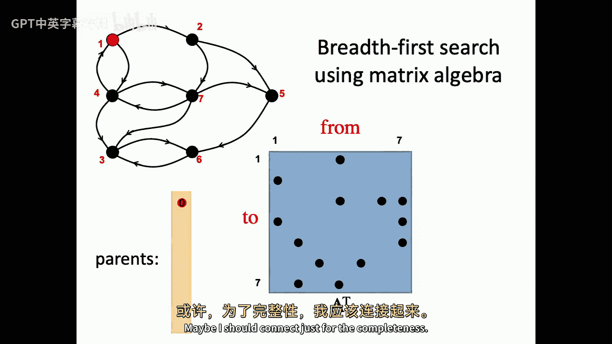
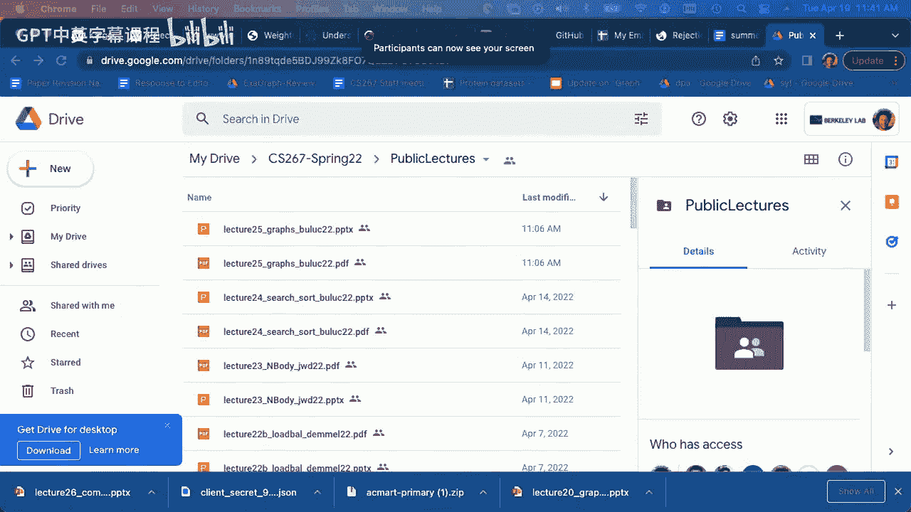
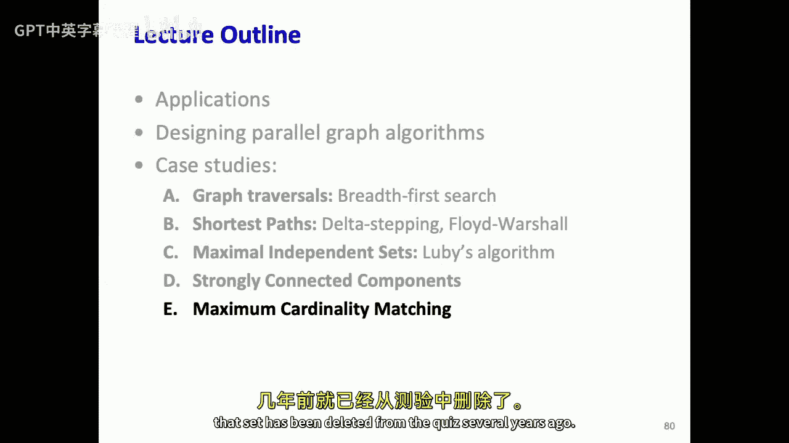

# 020：并行图算法 📊

在本节课中，我们将要学习并行图算法的基础知识、核心概念以及几种关键算法的并行实现策略。图算法是许多科学计算和工程应用的核心，理解其并行化方法对于处理大规模图数据至关重要。

## 概述 📋

图是一种抽象的数学模型，用于表示实体及其之间的连接关系。它由两个集合组成：顶点集（Vertices）和边集（Edges）。在并行计算中，高效地处理大规模图数据是一个重要挑战。本节课将介绍图的基本表示方法、并行遍历策略，并通过几个经典案例（如广度优先搜索、最短路径、最大独立集和强连通分量）来探讨并行图算法的设计思想。

## 图的基本概念与表示 🧮

上一节我们概述了课程内容，本节中我们来看看图的基本数学定义和如何在计算机中高效地表示它。

一个图 `G` 可以形式化地定义为 `G = (V, E)`，其中：
*   `V` 是顶点的集合。
*   `E` 是边的集合，每条边连接一对顶点。

图的一个重要度量是**直径**，即图中任意两个顶点之间最短路径的最大长度（以跳数计）。许多并行图算法的运行时间与图的直径有关。

对于静态图（图结构在算法执行期间不变），最高效的存储方式是**压缩稀疏行**格式。这与稀疏矩阵的存储方式相同，它避免了指针追逐，提高了缓存利用率。

在分布式内存系统中，图需要被分配到多个处理器上。主要有两种分区方式：
*   **一维分区**：将顶点集划分给处理器，每个处理器获得其分配顶点的所有出边（或入边）。这在邻接矩阵视图中表现为按行或按列划分。
*   **二维分区**：将邻接矩阵划分为棋盘格状，边被分配给一个处理器网格。这有助于在处理极高度数顶点或使用大量处理器时改善负载均衡和通信开销。

## 图遍历：广度优先搜索 🚀

了解了图的表示方法后，我们进入图算法的基础——图遍历。本节重点介绍最常用的并行遍历方法：广度优先搜索。

广度优先搜索是许多图算法的构建模块。其核心思想是逐层探索：先访问源顶点的所有邻居，再访问邻居的邻居，依此类推。

在共享内存或单机环境中，BFS的串行实现时间复杂度为 `O(|V| + |E|)`。其并行化的经典方法是**层级同步**策略：
1.  所有处理器并行探索当前层（前沿）的所有顶点。
2.  将新发现的顶点集合作为下一层的前沿。
3.  重复此过程，直到所有可达顶点都被访问。

这种方法的并行步数等于从源点出发的图的直径。对于社交网络等小直径图非常有效，但对于网格等大直径图则可能效率不高。

BFS的运算可以巧妙地用稀疏矩阵-向量乘法来表示。设 `A` 为图的邻接矩阵（布尔型），`frontier` 为一个稀疏向量，表示当前前沿顶点。那么下一层前沿可以通过 `frontier_next = A * frontier` 计算，再通过掩码操作去除已访问的顶点。

在并行实现中，根据采用一维或二维分区，通信模式不同：
*   **一维分区**：需要一次**全局All-to-All通信**来交换边界顶点信息。
*   **二维分区**：通信分为两步——首先在处理器列内通信以获取必要的向量元素，然后在处理器行内通信以归约结果。虽然步数增加，但在处理器数极多时，可扩展性更好。

此外，还有一种**方向优化**策略，在搜索过程中动态切换“推”和“拉”的模式：
*   **自上而下（推）**：当前前沿顶点主动探查其邻居。
*   **自下而上（拉）**：未访问顶点主动检查其邻居是否在前沿中。当未访问顶点集合变小时，此方法能显著减少边探查次数，提升性能。

## 单源最短路径 🛣️

掌握了图遍历，我们来看一个更具体的问题：单源最短路径。本节将探讨如何在并行环境中高效计算从单个源点到所有其他顶点的最短距离。

最著名的串行算法有迪杰斯特拉算法（适用于非负权边）和贝尔曼-福特算法（适用于通用权边）。迪杰斯特拉算法使用优先级队列，本质上是顺序的，难以并行。

**Δ-Stepping算法** 提供了一个折衷方案，通过一个参数 `Δ` 在迪杰斯特拉和贝尔曼-福特算法之间插值。其核心思想是将顶点按与源点的当前距离放入不同的“桶”中，每个桶的宽度为 `Δ`。

算法步骤如下：
1.  将距离小于 `Δ` 的边视为“轻边”，大于等于 `Δ` 的视为“重边”。
2.  处理当前桶：并行松弛所有从桶内顶点出发的轻边。这可能将其他顶点加入当前桶或后续桶。
3.  处理完当前桶的所有轻边后，并行松弛从本轮被删除顶点出发的重边，将顶点放入对应的桶中。
4.  移动到下一个非空桶，重复上述过程。

通过调整 `Δ`，可以控制并行粒度。`Δ` 越小，算法越像迪杰斯特拉，顺序性越强；`Δ` 越大，算法越像贝尔曼-福特，并行性越高，但总工作量可能增加。

## 最大独立集 🎲

解决了最短路径问题，我们来看一个利用随机化获得并行性的经典例子：寻找最大独立集。

一个图的**独立集**是顶点的一个子集，其中任意两个顶点都不相邻。**最大独立集**是指不能再添加任何顶点而不破坏独立集性质的集合（注意不是顶点数最多的“最大”独立集，那是NP难问题）。

串行算法很简单：遍历顶点，如果当前顶点及其邻居都不在独立集中，则将其加入。但这是顺序的。

**Luby算法** 提供了一个优雅的并行随机化方案：
1.  每个顶点随机生成一个权重。
2.  每个顶点与邻居比较权重。
3.  如果某个顶点的权重小于其所有邻居的权重，则将该顶点加入独立集。
4.  将已加入独立集的顶点及其所有邻居从图中移除。
5.  在剩余图上重复步骤1-4，直到图为空。

该算法以高概率在 `O(log |V|)` 轮内结束，每轮可以高度并行。虽然其总工作量略高于线性串行算法，但在实践中非常高效。

## 强连通分量 🔄

最后，我们探讨一个基于分治策略的并行算法：在有向图中寻找强连通分量。

在有向图中，如果一个子集内的任意两个顶点都可以通过有向路径互相到达，则该子集构成一个**强连通分量**。

串行算法（如Kosaraju或Tarjan算法）基于深度优先搜索，难以并行。

**FHP算法** 的核心思想是递归分治：
1.  随机选取一个“枢轴”顶点 `v`。
2.  从 `v` 出发执行**正向BFS**，得到可到达的顶点集 `F(v)`。
3.  在反向图上从 `v` 出发执行**反向BFS**，得到可到达 `v` 的顶点集 `B(v)`。
4.  交集 `S = F(v) ∩ B(v)` 构成一个强连通分量（包含 `v` 的那个）。
5.  根据引理，图中其他任何强连通分量必定完全位于以下三个不相交集合之一：
    *   `A = F(v) \ B(v)` （可自 `v` 到达但不可到达 `v`）
    *   `B = B(v) \ F(v)` （可到达 `v` 但不可自 `v` 到达）
    *   `C = V \ (F(v) ∪ B(v))` （与 `v` 互不可达）
6.  递归地在集合 `A`, `B`, `C` 上应用此算法。

为了使该算法高效并行，需要将步骤2和3中的BFS并行化（可使用之前讨论的并行BFS技术），并精心处理递归过程中出现的许多小分量，以避免串行瓶颈。

## 总结 📝

本节课中我们一起学习了并行图算法的基础知识和几个关键案例：
*   我们了解了图的压缩稀疏行表示法以及一维和二维分区策略。
*   我们深入探讨了**广度优先搜索**的并行实现，包括层级同步、矩阵表示、方向优化等核心思想。
*   我们学习了**Δ-Stepping算法**，它通过桶的机制在最短路径问题的并行效率和渐进复杂度之间取得平衡。
*   我们分析了**Luby算法**，这是一个利用随机化来获得并行性的经典范例，用于求解最大独立集。
*   最后，我们研究了基于分治的**强连通分量算法**，展示了如何将问题分解为可并行处理的子问题。

这些算法涵盖了并行算法设计中的不同策略：基础遍历、权衡设计、随机化应用和分治递归。理解这些模式对于设计和实现高效的大规模并行图应用至关重要。