# 021：计算生物学 🧬

在本节课中，我们将学习计算生物学中的核心问题与算法，特别是基因组组装、序列比对和蛋白质家族识别等任务。我们将看到，尽管这些生物学问题看似不同，但它们背后都依赖于一组通用的计算模式，如哈希表、稀疏矩阵和图算法。

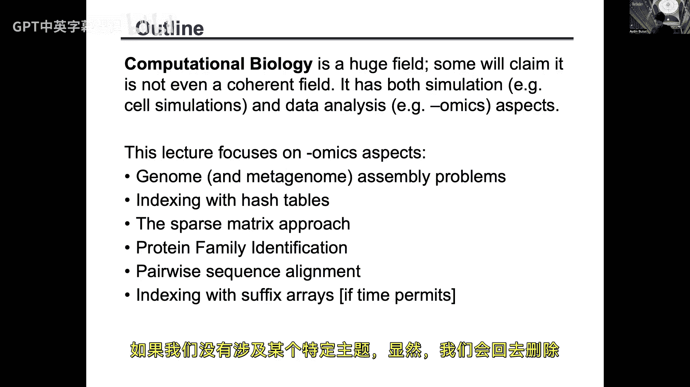

---

## 概述：计算生物学中的计算模式

计算生物学是一个广泛的领域，它利用计算方法解决生物学中的各种问题。本节课我们将聚焦于“组学”问题，如基因组学、转录组学等。这些问题的解决方案通常可以映射到一些可重用的计算模式上，例如排序、图算法、序列比对、稀疏矩阵和哈希表。理解这些模式是高效解决大规模生物学计算问题的关键。

---

## 基因组组装问题 🧩

上一节我们介绍了计算生物学中的通用模式，本节中我们来看看一个具体且核心的问题：基因组组装。

基因组组装可以类比为拼图游戏。想象你有一本书，它被撕成了无数碎片，并且你拥有这本书的多个副本。你的任务就是利用这些碎片之间的重叠部分，将这本书重新拼凑完整。在基因组学中，这本书就是生物体的完整DNA序列（基因组），而碎片则是测序仪读出的短DNA片段（称为“读段”）。

*   **无参考组装**：我们通常不知道“书”的原貌，这意味着组装必须从头开始（De novo assembly）。
*   **读段短且有错误**：测序产生的读段长度远小于整个基因组，并且可能包含测序错误。
*   **重复区域**：基因组中存在大量重复序列，这是组装中最具挑战性的部分之一，因为很难判断一个读段来自哪个重复副本。

值得注意的是，基因组大小并不与生物复杂性直接相关。例如，某些蝾螈或小麦的基因组比人类基因组大得多，且重复性更高。

---

## 一个基因组组装流水线示例

接下来，我们深入一个具体的基因组组装流水线（以HipMer为例），看看计算是如何介入的。该流水线主要分为三个阶段：

1.  **K-mer分析**：处理输入读段，统计短序列片段。
2.  **重叠群生成**：构建并遍历德布鲁因图，生成较长的、明确的序列片段。
3.  **支架构建**：确定这些长片段之间的相对位置和方向。

这三个阶段对计算资源的需求各不相同：K-mer分析是I/O和内存密集型；重叠群生成受延迟限制；支架构建则对计算和I/O都有高要求。

---

### K-mer分析阶段

这个阶段的目标是从海量读段中提取并分析所有长度为K的短序列（K-mer）。

**并行读取**：首先，我们可以将数TB的读段数据文件并行分配给多个处理器进行读取和解析。这是一个“令人尴尬的并行”任务。

**基数估计**：在开始正式计数前，我们需要估计数据集中有多少个**不同的**K-mer。这有助于我们预先分配数据结构（如哈希表）的大小，避免动态调整带来的开销。我们使用一种称为**HyperLogLog**的算法，它可以用极少的内存（如几千字节）高精度地估计不同元素的数量，并且其结果可以轻松地在处理器间合并。

**精确计数与布隆过滤器**：接下来是精确统计每个K-mer的出现次数。简单的“本地计数后合并”策略不可行，因为本地哈希表可能过大，且合并通信成本极高。因此，我们采用“所有者计算”模式：通过一个统一的哈希函数，每个K-mer被分配给一个特定的处理器进行计数。

然而，测序错误会产生大量仅出现一次的K-mer（单例）。为它们分配内存和通信是巨大的浪费。这里我们引入**布隆过滤器**。布隆过滤器是一种概率数据结构，用于测试一个元素是否在集合中。它可能有误报（即说某个元素在集合中，但实际上不在），但绝无漏报。我们首先用布隆过滤器过滤掉大部分单例K-mer，只将那些可能重复出现的K-mer插入哈希表进行精确计数，从而大幅节省内存和通信开销。

**处理高频K-mer**：在某些高度重复的基因组（如小麦）中，会出现一些出现次数极高的K-mer（“高频项”）。如果所有这类K-mer都被哈希到同一个处理器，会导致严重的负载不均衡和网络拥堵。解决方案是使用**Heavy Hitter检测**算法，在流式数据中识别出这些高频项。对于它们，我们改用“每个处理器本地计数，然后合并结果”的策略，从而将计算和通信负载分散开。

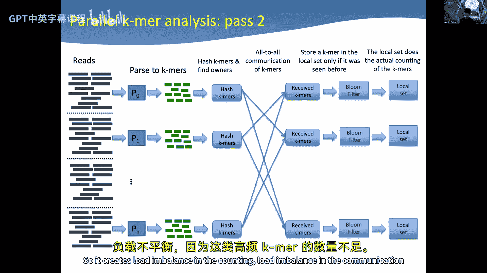

---

### 重叠群生成阶段

在获得K-mer及其前后连接信息后，我们进入组装的核心——构建德布鲁因图。

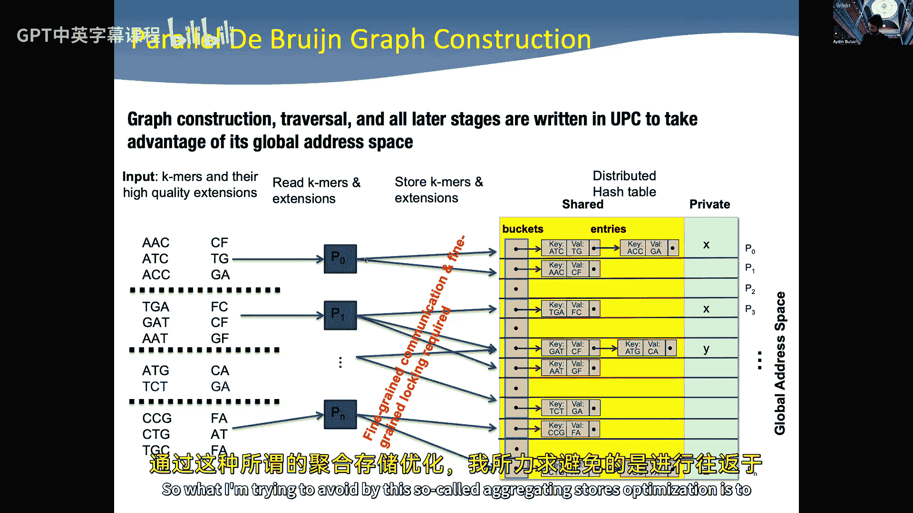

**德布鲁因图**：在此图中，节点是K-mer。如果两个K-mer有K-1长度的重叠（即一个K-mer的后缀与另一个K-mer的前缀相同），则它们之间有一条边。我们的目标是找出图中那些没有分支的线性路径，这些路径就是我们可以确信无误组装出的长片段，称为“重叠群”。

**并行图构建**：我们使用一个分布式哈希表来表示这个图。每个处理器负责将自己拥有的K-mer信息插入到哈希表中。关键优化在于**聚合存储**：由于在构建完成前我们不需要读取哈希表，因此处理器可以先将大量更新缓存在本地缓冲区，然后一次性批量发送到目标处理器。这些更新操作（如原子递增计数）可以通过网络接口卡的远程原子操作高效完成，无需细粒度的锁操作。

**并行图遍历**：图构建完成后，需要遍历它以找出所有线性路径（重叠群）。处理器从哈希表中随机选择一个K-mer作为起点，然后通过连续查询哈希表（“这个K-mer的下一个延伸是什么？”）来遍历路径。由于图是分布式的，大多数查询需要访问远程内存。

这里会出现**冲突**：多个处理器可能同时遍历同一条路径的不同部分。我们需要一个同步协议来处理这种情况：当处理器检测到冲突时，其中一个会放弃已完成的工作，让另一个处理器继续，而自己则去寻找新的、未被探索的路径起点。

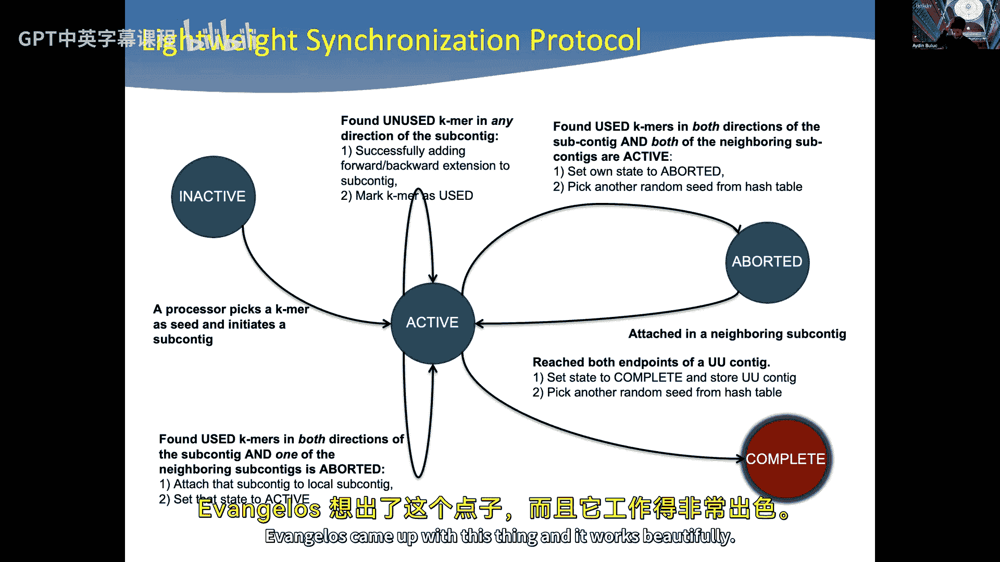

---

## 宏基因组组装 🌍

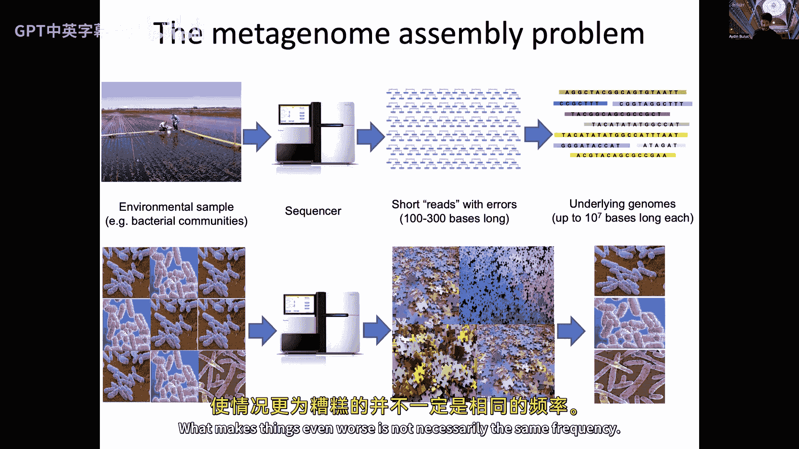

上一节我们讨论了单个基因组的组装，本节中我们来看看一个更复杂的问题：宏基因组组装。

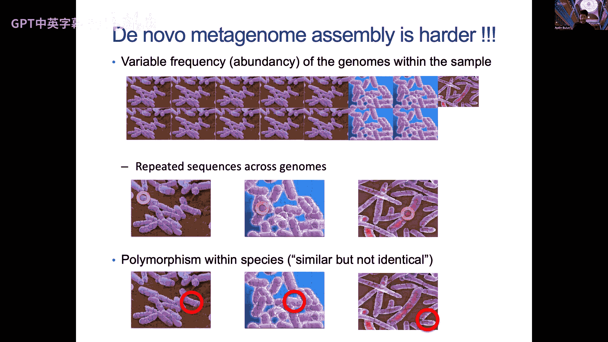

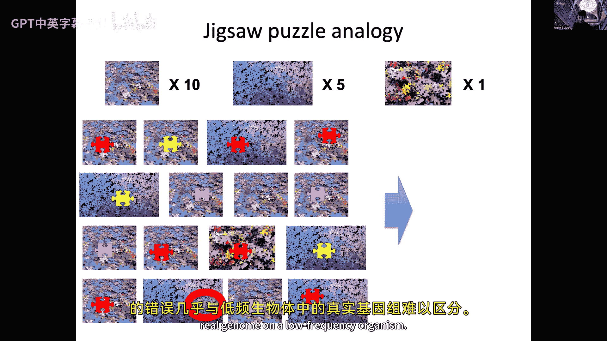

宏基因组样本包含来自环境中多种生物的遗传物质。这就好比将多个不同拼图的碎片全部混在一起，而且每个拼图的副本数量（即物种在样本中的丰度）还各不相同。此外，样本中可能存在亲缘关系很近的菌株，它们的基因组序列高度相似。

这使得组装变得极其困难。我们采用的策略与单基因组组装类似，但需要**迭代执行**。通过使用不同的K-mer大小或频率阈值进行多次组装，我们可以从混合数据中逐步分离和提取出不同生物的基因组草图。其并行化策略（基于分布式哈希表）与单基因组组装是相同的。

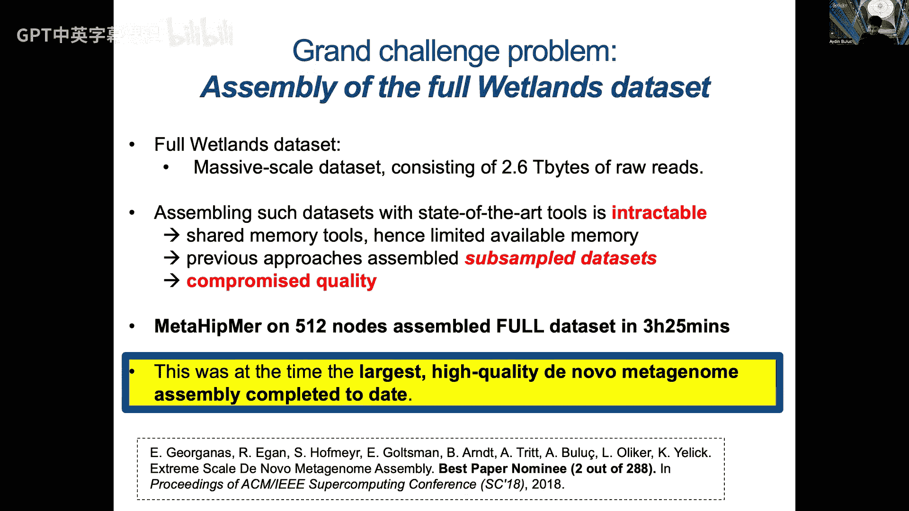

---

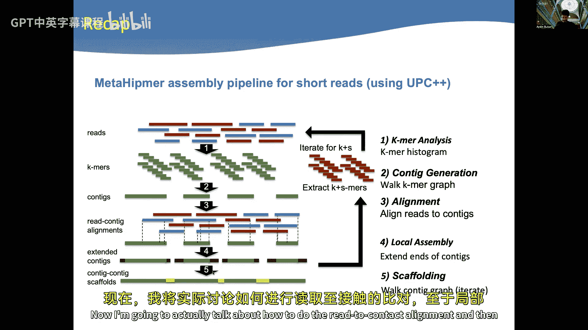

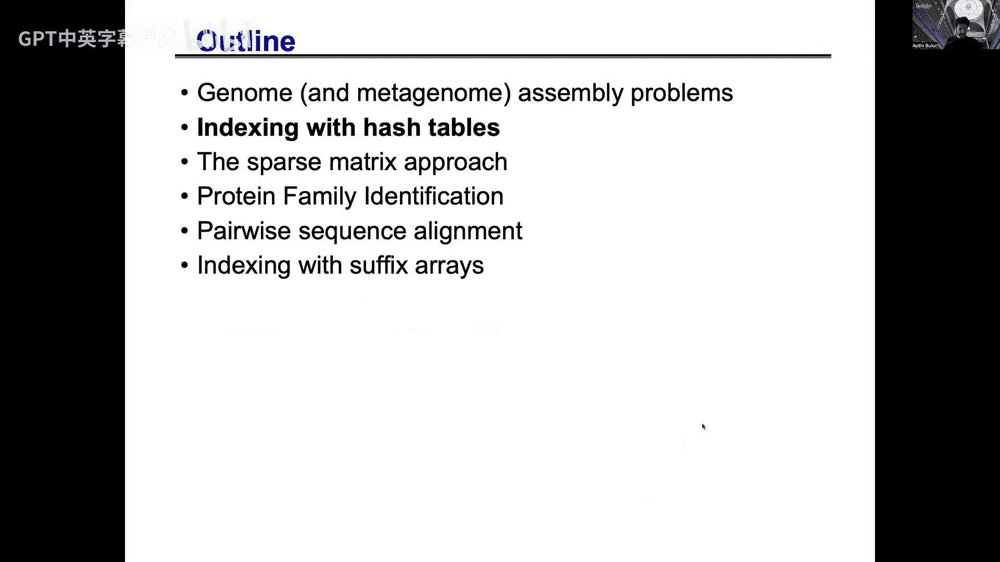

## 序列比对与候选查找 🧬

无论是基因组组装中的“读段-重叠群”比对，还是蛋白质分析中的相似性查找，我们常常面临一个共同的核心子问题：**海量序列之间的比对**。即，如何快速地从数百万条查询序列中，找出哪些与数百万条目标序列可能匹配？

以下是两种主要的并行化方法：

**方法一：基于分布式哈希表（种子索引）**
1.  遍历所有目标序列，将其切分为K-mer（种子），并插入一个分布式哈希表（种子索引表），同时记录种子在目标序列中的位置。
2.  对于每条查询序列，同样将其切分为K-mer，并用这些K-mer去查询种子索引表。
3.  如果查询序列的某个K-mer在索引表中找到，则意味着它与某个目标序列有一个精确匹配的片段，这对序列即成为一个需要进一步进行**精确比对的候选对**。

这种方法在基于PGAS编程模型（如UPC++）的基因组组装器中很常见。

**方法二：基于稀疏矩阵乘法**
这种方法在长读段组装的重叠检测中尤为有效。
1.  构建一个稀疏矩阵 **A**，其行代表读段，列代表K-mer。如果读段 `i` 包含K-mer `j`，则 `A(i, j)` 为非零值（并可存储位置信息）。
2.  计算矩阵 **A** 与其转置 **A^T** 的乘积，得到矩阵 **S = A * A^T**。**S(i, k)** 的值表示了读段 `i` 和读段 `k` 之间共享的K-mer数量（或加权分数）。
3.  **S** 中的非零元素就指示了哪些读段对可能具有重叠，需要进行后续的精确比对。

利用高度优化的稀疏矩阵乘法库，这种方法可以实现极佳的扩展性，且通信模式更优（二维分解）。

---

## 蛋白质家族识别 🧪

现在，让我们看另一个看似不同但计算模式相似的问题：蛋白质家族识别。目标是发现一组具有共同祖先、执行相似功能的蛋白质。

**流水线**：
1.  **构建相似性网络**：首先在所有蛋白质序列间计算序列相似性。由于同源蛋白可能相似度很低（如40%），直接进行全对全精确比对成本太高。因此，我们通常先以较高阈值找到强相似性对，构建一个初始网络。
2.  **聚类**：然后使用聚类算法（如马尔可夫聚类算法MCL）对这个网络进行分析。通过网络的传递性，可以发现那些不直接相似但通过中间蛋白相连的蛋白质属于同一个家族。

**网络构建的并行化**：
这里的挑战是如何高效地发现蛋白质之间的弱相似性信号。我们采用与序列重叠检测类似的“种子-扩展”策略，但进行了增强：
*   **替代K-mer**：对于每个K-mer，我们不仅查找完全相同的匹配，还根据氨基酸替换打分矩阵（如BLOSUM），查找一系列相似的“替代K-mer”。
*   **稀疏矩阵运算**：我们可以构建一个包含原始K-mer和替代K-mer的扩展稀疏矩阵，然后通过稀疏矩阵乘法来快速计算蛋白质对之间的相似性得分。这同样复用了高性能计算中成熟的稀疏矩阵运算库。

这个例子再次表明，通过将生物学问题抽象为通用的计算模式（稀疏矩阵乘法、哈希表），我们可以复用高性能计算领域的先进成果，并轻松地将计算映射到新的硬件架构（如GPU）上。

---

## 序列比对算法：动态规划 ⚙️

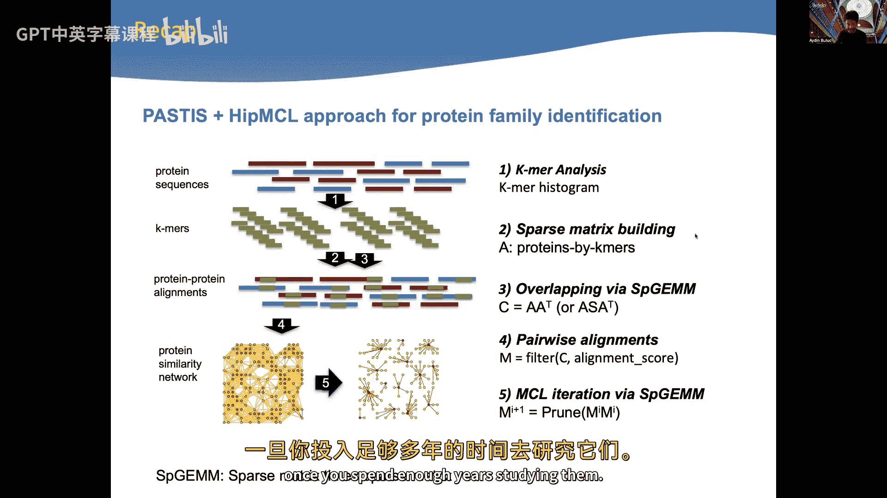

在前面的所有流水线中，一旦我们通过快速方法找到了需要比对的候选序列对，最后一步就是执行计算代价高昂的**精确序列比对**。最经典的算法是基于动态规划的成对比对算法。

**全局比对**：目标是将一条序列完整地转变成另一条序列。我们定义一个打分矩阵（如匹配得+1，错配或缺口罚-1）。通过填充一个大小为 `m*n` 的动态规划矩阵（其中m和n是序列长度），我们可以找到最优比对路径。递推公式如下：
`score(i, j) = max( score(i-1, j) - gap_penalty, score(i, j-1) - gap_penalty, score(i-1, j-1) + match/mismatch_score(seq1[i], seq2[j]) )`

**局部比对**：用于寻找一条序列中与另一条序列的某个子区域最优匹配。算法与全局比对类似，但在递推公式中加入了与0的比较（`score(i, j) = max(0, ...上述三项...)`），并且回溯从矩阵中的最大值开始，而不是右下角。这允许比对在序列内部开始和结束。

**并行化**：动态规划矩阵的填充存在数据依赖。常见的并行方法包括按对角线、按行或按块进行填充。更高级的算法（如Hirschberg算法）可以在线性空间内完成比对，并启发了更多并行策略。

---

## 总结 🎯

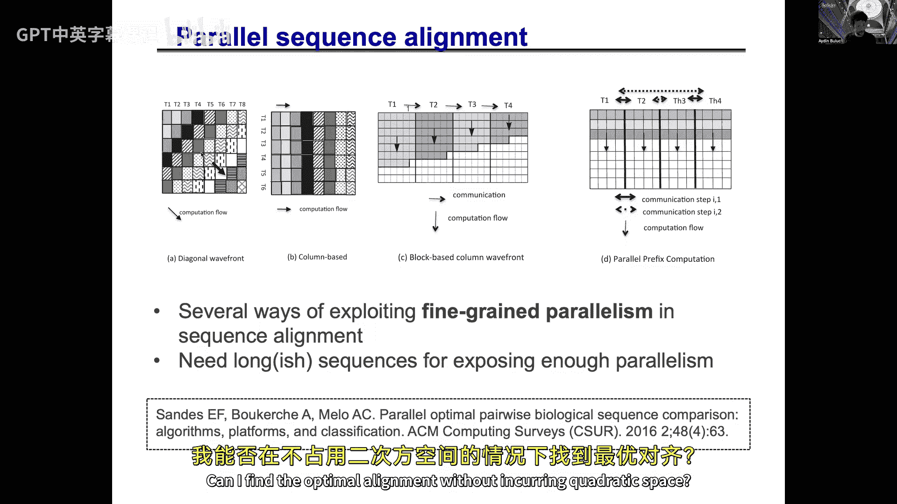

本节课我们一起探索了计算生物学中的几个核心问题：
1.  **基因组组装**：我们将它分解为K-mer分析、德布鲁因图构建和遍历等步骤，并看到了如何用哈希表、布隆过滤器、远程原子操作和并行图遍历来解决。
2.  **宏基因组组装**：这是单基因组组装的扩展，通过迭代策略处理混合样本，复用相同的并行计算模式。
3.  **海量序列比对**：我们学习了两种并行候选查找方法——基于分布式哈希表的种子索引法和基于稀疏矩阵乘法的重叠检测法。
4.  **蛋白质家族识别**：我们看到了如何将蛋白质相似性计算转化为稀疏矩阵运算问题，并复用聚类算法。
5.  **精确序列比对**：我们回顾了动态规划的基础，它是许多生物学比较分析的最终步骤。

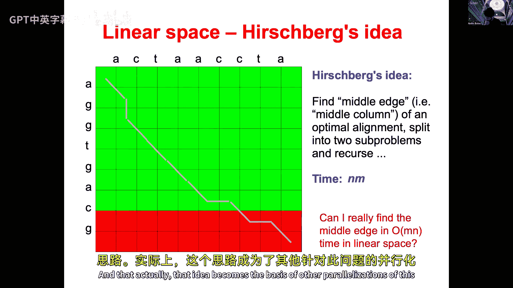

贯穿始终的主题是，许多复杂的生物学计算问题，都可以被分解并映射到一组数量有限但强大的**计算模式**上，例如哈希表、稀疏矩阵、图算法和动态规划。理解这些模式及其高效并行实现，是构建可扩展计算生物学应用的关键。