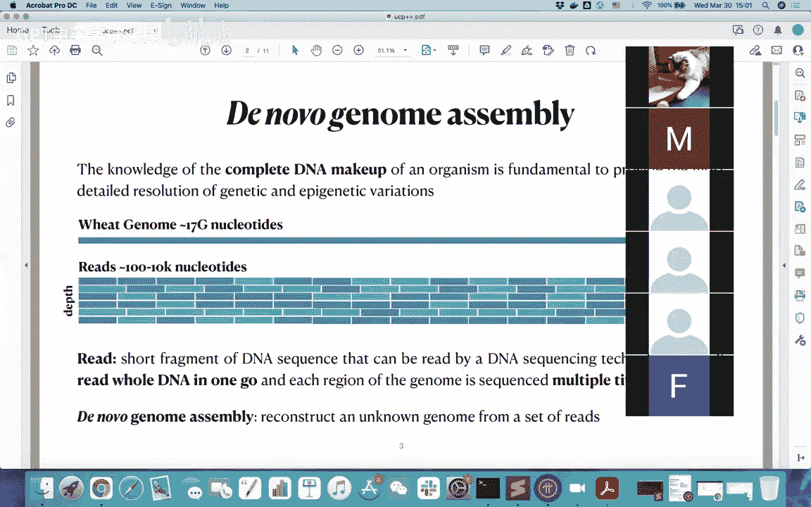
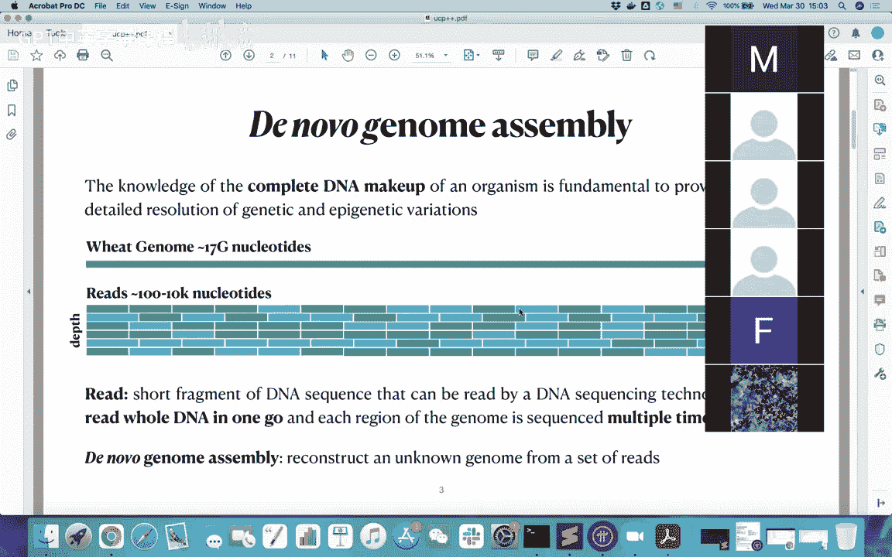
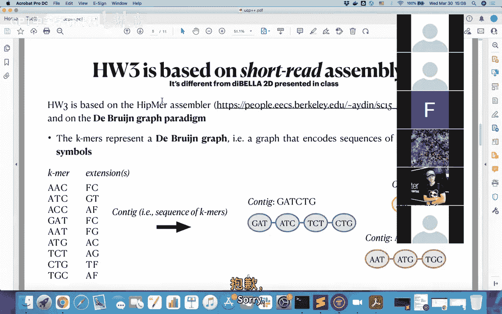
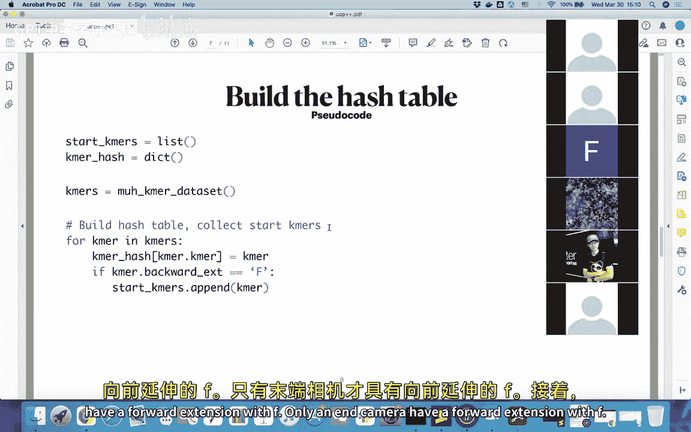
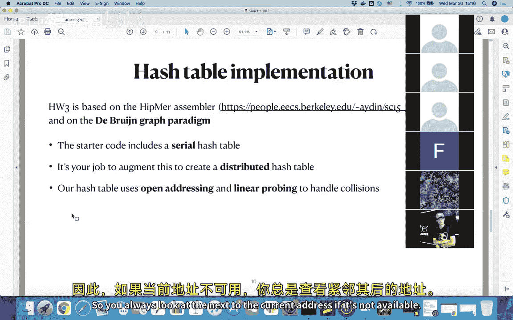

# 023：基因组组装背景与实现概述 🧬




在本节课中，我们将学习作业3（HW3）的背景知识。作业3基于UPCC++实现一个简化的基因组组装流程。我们将了解什么是从头基因组组装、什么是k-mer、如何构建De Bruijn图，以及如何通过遍历该图来组装出更长的序列（contigs）。核心任务是使用UPC++实现一个分布式哈希表来高效处理海量的k-mer数据。



---

## 基因组组装背景 🧬

上一节我们介绍了作业3的总体目标，本节中我们来看看其背后的生物学和计算背景。

我们知道，了解一个生物体完整的DNA构成是解析其遗传和表观遗传变异的基础。基因组通常非常长，如上图所示。在以往的研究中，研究人员开发了一套处理基因组的系统。

这套系统首先将长基因组分解成许多较短的片段，称为“读段”（reads）。每个读段包含一定数量的核苷酸（通常为100到10k个）。基于这些读段，我们可以用更高效的方式处理基因组。

作业3基于一种称为“短读段组装”的简化方法。具体来说，我们处理的是“k-mer”。

---



## 理解K-mer与De Bruijn图 🧩

上一节我们提到了读段，本节中我们来看看组装过程中的核心数据结构：k-mer和De Bruijn图。

在作业3中，我们得到一系列k-mer。k-mer是长度为K的短DNA序列。在我们的作业中，人类基因组的k-mer长度K为51，而测试版本中K为19。



所有这些k-mer可以用来构建一个De Bruijn图。每个k-mer都有一个“向后扩展”和一个“向前扩展”，这是k-mer的基本特性。

例如，假设一个k-mer是“ACG”。如果它的向后扩展包含特殊字符‘F’（表示‘前导’），则说明这个k-mer没有前驱k-mer，因此它是一个“起始k-mer”。同样，如果向前扩展包含‘F’，则它是一个“终止k-mer”。

基于这些k-mer，我们可以通过遍历De Bruijn图来生成更长的连续序列，即“contigs”。具体方法是定位重叠的k-mer序列，然后将它们连接起来。

在我们的作业中，目标是高效地遍历De Bruijn图，以发现其中的连通分量（即各个contig）。为了实现这一点，我们将使用UPC++编写的哈希表。

这个分布式哈希表非常重要，因为通常k-mer的数量极其庞大，如果没有并行计算，串行版本将需要非常长的时间来处理。

---

## 算法伪代码与哈希表构建 💻

上一节我们介绍了De Bruijn图，本节中我们来看看组装过程的核心算法以及如何构建哈希表。



以下是构建哈希表和组装contigs的伪代码概述。首先，我们需要构建哈希表并找到所有起始k-mer。

**构建哈希表与起始k-mer列表的伪代码：**
```python
start_kmers = []
kmer_hash = {} # 这将是一个分布式哈希表

for kmer in all_kmers:
    if kmer.backward_extension == 'F':
        start_kmers.append(kmer)
    # 同时，将kmer插入到分布式哈希表kmer_hash中
    kmer_hash.insert(kmer, its_value)
```

**遍历哈希表生成Contigs的伪代码：**
```python
contigs = []
for start_kmer in start_kmers:
    current_kmer = start_kmer
    contig = [current_kmer]
    while current_kmer.forward_extension != 'F':
        # 根据当前kmer计算下一个kmer（例如，取后K-1个字符加上向前扩展的字符）
        next_kmer = calculate_next_kmer(current_kmer)
        # 在哈希表中查找或验证next_kmer
        # ...
        contig.append(next_kmer)
        current_kmer = next_kmer
    contigs.append(contig)
```

在作业3的要求中，我们只需要修改`kmer_hash`映射的实现（即将其改为分布式哈希表），并保持其他文件不变。

关于实现，作业3基于HipMer汇编器（一篇发表在Supercomputing 2015上的论文）。起始代码是串行版本。如果你直接使用串行哈希表运行测试命令，会报错提示没有多进程或分布式实现。因此，你的任务是创建一个分布式哈希表。

最后，我们的哈希表使用**开放寻址**和**线性探测**来处理冲突。其基本思想是：首先对键（key）调用哈希函数，得到一个地址。检查该地址是否已被占用。如果未被占用，则在此存储值。如果已被占用，则查看下一个地址（即当前地址加一），直到找到空位为止。

---

## 并行化策略与作业说明 ⚙️

上一节我们讨论了核心算法，本节中我们来看看如何将其并行化，并明确作业的具体要求。

首先讨论通用策略。我们可以将哈希表分布在UPC++的各个进程中。为了实现逻辑上的共享内存（尽管物理上可能不连续），我们需要分配并传递一些全局指针。在UPC++中，这通过`upcxx::global_ptr`来实现。

另一个需要注意的问题是插入操作时的协调。当多个进程同时向哈希表插入值时，我们需要某种协调机制（例如原子操作或锁）来避免冲突。在实现中，UPC++的原子操作（`upcxx::atomic`）可能非常有用。

为了进一步优化，可以将多个插入操作聚合到一次通信操作中。这种方法在相关论文中有所提及。但这是一个可选优化。

作业3的评分分为两部分：
1.  **正确性**：我们将运行自动评分器来测试你的实现是否正确。
2.  **性能与报告**：我们将使用自动评分器检查你**节点内**实现的并行性能。另一部分评分将基于你的作业报告。报告需要讨论你实现了哪些优化，在运行UPC++代码时遇到了什么问题以及如何解决。由于我们不测试**节点间**版本，你需要在报告中汇报节点间的性能表现，并进行观察和分析。

---

## 重要说明与总结 📝

上一节我们明确了作业要求，本节中我们来做一些最后的澄清和总结。

首先需要澄清的是，我们的作业是HipMer汇编器或相关论文（如《Parallel De Bruijn Graph Construction and Traversal for De Novo Genome Assembly》）的一个非常简化的版本。你不需要深入理解所有生物学背景，只需关注UPC++和哈希函数的实现即可。

其次，关于编译环境。作业代码现在需要使用GNU编译器在KNL节点上编译，请确保你的环境配置正确。

最后，关于作业提交命令中的不同属性（如`-N`、`-n`、`-c`等）。请注意，你不应该在一条命令中同时使用所有属性。例如，`-N`（节点数）和`--ntasks-per-node`（每节点任务数）可以一起使用。而`-n`（总任务数）和`-c`（每个进程的逻辑核心数）是另一对可以搭配使用的属性。


**本节课总结：**
在本节课中，我们一起学习了作业3的背景知识。我们了解了基因组组装的基本概念、k-mer和De Bruijn图的作用，以及通过遍历图来组装contigs的算法。核心任务是使用UPC++实现一个分布式哈希表来加速这一过程。我们讨论了哈希表的基本原理（开放寻址、线性探测）、并行化策略，并明确了作业的实现要点和评分标准。请记住，重点是正确实现分布式哈希表，并在报告中清晰阐述你的设计和优化。