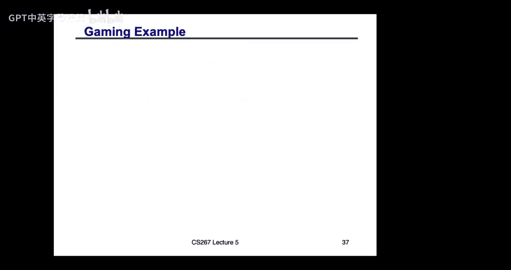
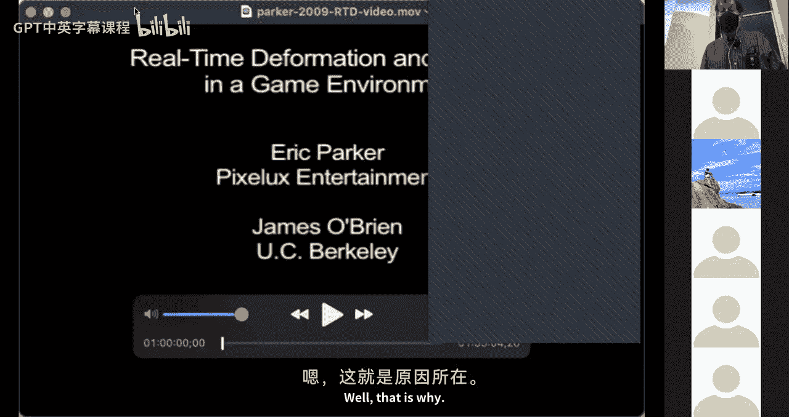
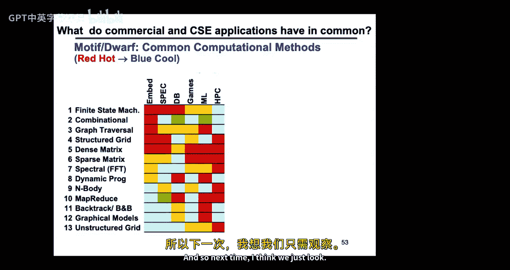
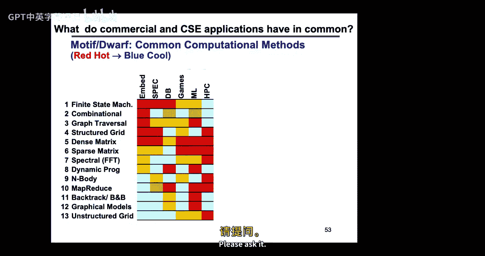

# 024：模拟中的并行性与局部性来源

在本节课中，我们将学习模拟计算中常见的并行性与局部性模式。理解这些模式对于设计高效的并行算法至关重要，因为它们不仅揭示了哪些部分可以并行化，还指导我们如何组织数据以最小化处理器间的通信开销。

## 硬件模型回顾

上一节我们介绍了并行计算的基本概念，本节中我们来看看三种基础的硬件模型，我们将基于这些模型来讨论并行模式和通信。

以下是三种主要的硬件模型：

*   **共享内存机器**：所有处理器通过互联网络访问一个公共的共享内存。数据共享容易，但存在竞态条件等问题。
*   **分布式内存机器**：每个处理器拥有与其紧耦合的本地内存。处理器间通过发送消息进行通信。
*   **单指令多数据机器**：一个主处理器控制多个工作处理器，所有工作处理器在同一时间执行相同的操作（如加法、乘法），通常通过共享内存进行数据交换。

在这些模型中，我们使用简化的成本模型：读写内存的成本是常数；发送消息的时间与消息大小（带宽）成正比，与网络拓扑无关；执行并行向量指令的时间假设有无限多的算术单元。

## 并行性与局部性的来源

许多现实世界的问题天然具有并行性和局部性。物体通常独立运作，并且更依赖于邻近物体而非远处物体。对远处物体的依赖有时可以简化，例如在重力计算中，遥远的星系群可以用其质心来近似。

科学模型也可能引入更多并行性。例如，将连续时间问题离散化为时间步进，信息在每个时间步内只能传播有限距离，因此通常只需与最近邻通信。

许多问题在多个层次上展现出并行性。

## 模拟的类型与模式

我们将讨论四种基本的模拟类型及其产生的不同模式。

### 1. 离散事件模拟

在离散事件模拟中，时间和空间都是离散的。系统状态由一组有限变量的值定义，并通过一个转移函数在离散时间步上进行更新。

离散事件模拟分为两类：

*   **同步模拟**：所有实体在每个全局时间步同时更新。例如“生命游戏”，每个网格细胞根据其邻居的状态更新自身。
*   **异步（事件驱动）模拟**：实体仅在特定事件发生时更新，例如电路仿真中的门切换或交通模拟中的车辆变道。这更高效，但并行化更复杂。

对于同步模拟（如“生命游戏”），一种标准的并行化方法是**区域分解**。我们将计算域（如网格）划分为子区域分配给不同处理器。每个处理器计算其内部点的更新（无需通信），然后通过边界交换数据，最后更新边界点。这种方法通过使用较大的子区域来最大化局部性，并通过最小化子区域边界（表面积与体积比）来减少通信。

对于不规则问题（如电路图），区域分解问题转化为**图划分**问题：将图的节点（计算工作）分配给处理器，目标是负载均衡（每个处理器获得大致相等数量的节点）并最小化切割边数（代表通信开销）。图划分是NP难问题，但有成熟的近似算法和软件工具。

异步模拟的并行化更具挑战性，主要有两种方法：

*   **保守方法**：处理器只模拟到所有邻居的最小已知安全时间，确保正确性，但可能导致死锁。
*   **乐观（投机）方法**：处理器持续向前模拟，如果收到过去时间的消息，则回滚到正确状态重新计算。需要在性能和状态保存开销之间权衡。

### 2. 粒子系统模拟

在粒子系统模拟中，粒子数量有限，但它们在空间中的位置和时间是连续的，通常遵循牛顿定律等物理规律。并行化的核心挑战是计算作用在所有粒子上的力。

根据力的作用范围，有三种并行化方式：

1.  **外力**：力仅取决于粒子自身位置（如洋流）。计算是**令人尴尬的并行**，每个粒子独立计算。偶尔需要全局归约操作（如计算最大速度以调整时间步长）。
2.  **近程力**：力仅作用于最近邻之间（如台球碰撞、范德华力）。我们再次使用**区域分解**。将空间划分给处理器，每个处理器负责其区域内粒子的力和运动更新。需要与相邻处理器交换边界区域（“晕区”）内粒子的信息。为了处理粒子分布不均的情况，可以使用**四叉树（2D）或八叉树（3D）** 自适应地细分空间，确保每个处理器负责的区域内粒子数大致相等。
3.  **远程力**：每个粒子都受到所有其他粒子的影响（如重力、静电力）。朴素的全对相互作用算法复杂度为 O(N²)。简单的并行化（如循环移位）通信量仍为 O(N)。有更聪明的近似算法可以显著降低计算和通信成本：
    *   **粒子网格法**：将粒子分配到规则网格上，在网格上求解泊松方程（使用FFT或多重网格法）来近似计算力，复杂度可降至 O(N log N) 或 O(N)。
    *   **树形算法**：使用四叉树/八叉树组织粒子。如果远处的一个粒子组足够小且足够远，可以用其质心（或更高阶矩）来近似其对目标粒子的力。例如**Barnes-Hut算法**（O(N log N)）和**快速多极子法**（O(N)），后者能提供任意精度的近似。

### 3. 集总参数系统模拟（常微分方程）

这类系统通常由常微分方程描述，连续参数通常是时间。例子包括电路仿真（SPICE）、结构力学（地震模拟）等。这些系统通常导出一个大型的、稀疏的线性方程组。

模拟这类系统主要涉及两种时间积分方法：

*   **显式方法**：例如前向欧拉法。更新公式为 `x_{i+1} = x_i + Δt * A * x_i`。其核心计算是**稀疏矩阵向量乘法**。这种方法实现简单，并行性好，但为了稳定性可能要求时间步长非常小（刚性系统问题）。
*   **隐式方法**：例如后向欧拉法。更新公式为 `(I - Δt * A) * x_{i+1} = x_i`。这需要在每个时间步求解一个大型稀疏线性系统。虽然允许更大的时间步长，但计算更复杂。

此外，模态分析（如计算建筑物的固有频率）需要求解稀疏特征值问题，其核心也依赖于稀疏矩阵向量乘法。

因此，并行化ODE求解的关键在于并行化**稀疏矩阵向量乘法**和**稀疏线性系统求解**。

### 4. 连续系统模拟（偏微分方程）

连续系统中时间和空间都是连续的，通常由偏微分方程描述，例如热传导、结构力学、流体动力学等。我们将在下一讲详细讨论。

## 稀疏矩阵向量乘法

稀疏矩阵向量乘法是许多科学计算的核心。其目标是 `y = y + A * x`，且只对非零元进行存储和计算。

最常用的存储格式是**CSR**：
*   `val`：按行顺序存储所有非零元的值。
*   `col_ind`：存储每个非零元所在的列索引。
*   `row_ptr`：存储每行第一个非零元在`val`中的起始位置。

并行化SPMV时，通常按行划分矩阵。每个处理器获得一组行，以及对应的`y`的分量和`x`的分量。计算时，处理器需要其负责的每行中所有非零元对应的`x`值。如果某个`x`值不在本地，则需要进行通信。

优化目标包括：
1.  **负载均衡**：使每个处理器拥有大致相等数量的非零元。
2.  **最小化通信**：通过重新排列矩阵的行和列（图划分），使非零元尽可能集中在对角线附近的块中，从而减少处理器需要从别处获取的`x`值的数量。

图划分问题与稀疏矩阵划分问题在数学上是等价的。矩阵的行/列对应图的节点，非零元对应边。划分矩阵行对应于划分图节点，切割边数对应于所需的通信量。

## 总结与模式回顾

本节课我们一起学习了模拟计算中并行性与局部性的主要来源。

我们回顾了被称为“七个小矮人”的七种常见计算模式，在本讲中我们涉及了其中几种：
*   **稠密线性代数**：在粒子系统等地方出现。
*   **稀疏线性代数**：ODE、PDE求解的核心。
*   **谱方法**：与FFT相关（粒子网格法）。
*   **N体问题**：粒子系统的远程力计算。
*   **结构化网格**：将在PDE中讨论。
*   **非结构化网格**：将在PDE中讨论。
*   **MapReduce**：令人尴尬的并行计算（外部力计算）。

这些模式广泛出现在科学计算、机器学习、数据分析等众多领域。理解这些模式是设计高效、可扩展并行应用的基础。

下一讲，我们将深入探讨偏微分方程的并行化。