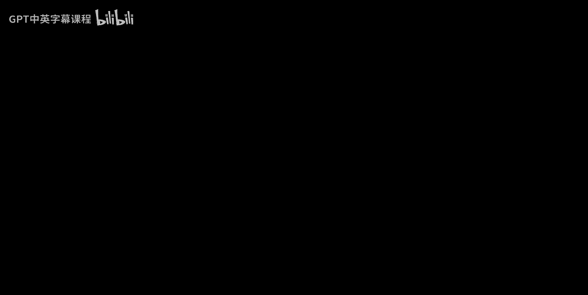
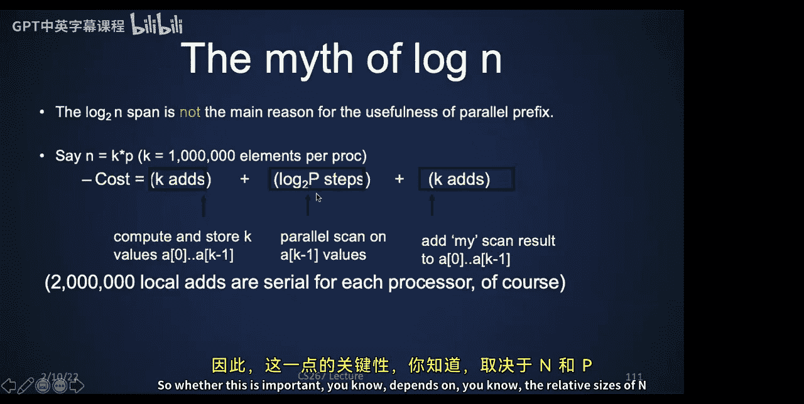

# 025：数据并行算法




在本节课中，我们将学习数据并行算法。这些算法不仅适用于GPU，也适用于各种并行架构。我们将从基础的数据并行操作开始，逐步深入到更复杂的算法，包括扫描（并行前缀）、排序、链表遍历，甚至矩阵求逆等。这些算法都基于一个核心思想：同时对大量数据执行相同的操作。

---

## 数据并行基础操作 🧱

上一节我们介绍了GPU的并行编程模型。本节中，我们来看看构成数据并行算法的基础操作。这些操作是构建更复杂算法的基石。

### 一元与二元操作

最简单的数据并行操作是一元操作，即对数组中的每个元素应用相同的单参数函数。

**公式**：`B[i] = f(A[i])`，例如 `B[i] = A[i] * A[i]`

二元操作则对两个数组的对应元素进行操作。

**代码**：
```python
# 假设A和B是数组
C = A - B  # 对每个i并行执行 C[i] = A[i] - B[i]
```

### 广播与掩码

广播操作将一个标量值复制到整个数组。

**用途**：例如，执行 `y = a * x + y` 这样的线性代数运算（AXPY），其中 `a` 是标量，`x` 和 `y` 是向量。

掩码操作允许我们根据条件数组（由0和1组成）选择性地执行操作。

**代码逻辑**：
```
如果 M[i] == 1，则 C[i] = A[i] + B[i]
否则，C[i] 保持不变。
```
这可以用于实现条件分支。

### 规约操作

规约操作将整个数组缩减为一个标量值，例如求和、求最大值。

**公式**：`result = sum(A)` 或 `result = max(A)`

**重要前提**：所使用的操作符必须满足**结合律**。有些系统还假设操作符满足交换律，但像矩阵乘法这样的操作是结合但不交换的，使用时需注意。

### 间接访问：聚集与散播

聚集操作使用一个索引数组，从源数组中间接收集数据到目标数组。

**公式**：`A[i] = B[X[i]]`

散播操作则将数据从源数组根据索引数组分散到目标数组的不同位置。

**公式**：`A[X[i]] = B[i]`
**注意**：索引必须唯一，否则会导致写冲突（竞态条件），这是编程错误。

---

## 扫描（并行前缀）算法 🔄

上一节我们介绍了规约操作。本节中，我们来看看一个看似顺序执行，实则可以高度并行的强大操作：扫描（又称并行前缀）。

扫描操作给定一个数组和一个满足结合律的操作（如加法），计算所有“前缀”的结果。
*   **包含性扫描**：`B[i] = A[0] op A[1] op ... op A[i]`
*   **排他性扫描**：`B[i] = A[0] op A[1] op ... op A[i-1]` （`B[0]` 是单位元，如0）

**关键洞察**：尽管计算每个 `B[i]` 似乎依赖于前一个结果，但通过巧妙的算法，可以在 `O(log n)` 时间内完成，且只进行大约 `2n` 次操作，是“工作高效”的。

以下是称为“上扫-下扫”的高效原地算法概要：

1.  **上扫**：以树状结构自底向上计算相邻元素对的和，将部分和存储在数组中。
2.  **下扫**：自顶向下传播这些部分和，结合原始数据，最终得到完整的前缀和结果。

该算法仅需约 `2n` 次操作和 `O(log n)` 步，且无需额外存储空间。

---

## 并行算法应用实例 🚀

掌握了扫描等基础操作后，我们可以构建许多令人惊讶的并行算法。

### 1. 流压缩
**问题**：根据一个标志数组，从数据数组中筛选出需要的元素。
**算法**：
1.  对标志数组进行排他性前缀和扫描，得到每个待保留元素在输出数组中的目标位置。
2.  使用散播操作，将数据根据目标位置写入新数组。

### 2. 基数排序
**问题**：对一组二进制数进行排序。
**算法思路**：从最低位到最高位，每次根据当前比特位进行稳定排序。
**并行实现**（单比特排序步骤）：
1.  计算哪些元素当前位为0（偶数）或1（奇数）。
2.  对偶数标志进行排他性前缀和，确定偶数元素的目标位置。
3.  计算奇数元素的目标位置（位置 = 偶数总数 + 索引 - 偶数前缀和）。
4.  根据合并后的目标位置索引，使用散播操作重排数组。
对每个比特位重复此过程。

### 3. 链表遍历（指针跳转）
**问题**：计算链表中每个节点到链表末尾的距离。
**算法**：
*   初始时，每个节点保存指向下一个节点的指针和距离值（初始为1）。
*   并行地，每个节点同时查看其邻居节点指向的节点，并将自己的指针更新为邻居的指针（即跳过一个节点），同时将距离值更新为 `自身距离 + 邻居距离`。
*   重复此过程，每次跳跃的距离指数级增长（1, 2, 4, 8...），在 `O(log n)` 步内所有节点都能知道到末尾的距离。

### 4. 计算线性递推（如斐波那契数列）
**问题**：计算 `F[n] = F[n-1] + F[n-2]`。
**并行化**：
*   将状态表示为向量 `[F[n], F[n-1]]^T`。
*   递推关系可以写为矩阵乘法：`[F[n+1], F[n]]^T = M * [F[n], F[n-1]]^T`，其中 `M` 是 `[[1,1], [1,0]]`。
*   计算第 `n` 项需要计算 `M^n`。这等价于对矩阵序列 `[M, M, M...]` 进行前缀积操作。
*   使用并行前缀算法在 `O(log n)` 时间内计算出所有需要的矩阵幂，然后与初始状态向量相乘即可。

### 5. 进位前瞻加法器
**问题**：快速计算两个 `n` 位二进制数的加法。
**算法**：这是并行前缀在硬件中的经典应用。
*   定义“传播”位 `P[i] = A[i] xor B[i]` 和“生成”位 `G[i] = A[i] and B[i]`。
*   进位 `C[i]` 的传递可以表示为：`(C[i], 1) = M[i] * (C[i-1], 1)`，其中 `M[i]` 是一个 `2x2` 布尔矩阵 `[[P[i], G[i]], [0, 1]]`，矩阵乘法使用 `AND` 和 `OR`。
*   计算所有进位需要计算矩阵 `M[0]` 到 `M[n-1]` 的前缀积。这正是一个并行前缀问题！
*   得到所有进位后，和位 `S[i] = P[i] xor C[i-1]` 可以快速算出。

### 6. 矩阵求逆（理论算法）
**分治求逆三角矩阵**：
*   利用分块矩阵求逆公式，将大矩阵求逆递归分解为两个更小矩阵的求逆和矩阵乘法。
*   矩阵乘法可在 `O(log n)` 时间完成，递归树深度为 `O(log n)`，故总时间为 `O(log² n)`。

**求逆一般稠密矩阵**（理论有趣，数值不稳定）：
*   根据凯莱-哈密顿定理，矩阵的逆可表示为该矩阵的一个多项式。
*   多项式系数可通过求解一个三角线性方程组得到，该方程组的系数是矩阵各次幂的迹。
*   计算矩阵幂 `A, A², A³...` 是一个并行前缀问题（操作是矩阵乘法）。
*   后续步骤（求迹、解三角系统、求多项式值）都可在 `O(log n)` 或 `O(log² n)` 时间内完成。
*   最终得到一个 `O(log² n)` 的矩阵求逆理论算法，但因其数值稳定性差，不适用于实际浮点计算。

---

## 硬件映射与现实考量 💻

数据并行思想历史悠久，从早期的连接机、向量处理器到现代的GPU，都体现了这一理念。

*   **向量指令**：允许程序员以向量为单位操作，硬件自动将其映射到并行单元上。
*   **GPU**：通过大量线程和SIMT（单指令多线程）架构天然支持数据并行。
*   **分布式内存系统**：当数据分布在多个处理器上时，算法需要结合本地计算和处理器间的通信。
    *   对于规约和广播，先进行本地规约，再在处理器间进行树形通信，总时间约为 `O(n/p + log p)`。
    *   对于扫描，先进行本地扫描，再对处理器间的部分和进行全局扫描，最后修正本地结果。

**编程建议**：
*   尽量使用掩码而非分支，以保持所有处理单元忙碌。
*   注意非连续内存访问的开销更高。
*   需要足够的并行度来隐藏内存访问延迟。

---

## 总结 📚

本节课中，我们一起学习了数据并行算法的核心思想与一系列经典算法。

我们从基础的**一元/二元操作、广播、掩码、规约、聚集/散播**开始，理解了数据并行的基本构件。然后，我们深入探讨了强大的**扫描（并行前缀）** 算法，它能在 `O(log n)` 时间内完成看似顺序的工作。

利用这些基础，我们看到了数据并行如何应用于**流压缩、基数排序、链表遍历、线性递推求解、二进制加法（进位前瞻）** 等实际问题，甚至触及了**矩阵求逆**的理论极限。最后，我们讨论了这些算法在不同硬件架构（特别是分布式内存系统）上的映射和实际考量。



数据并行的优势在于其清晰的语义——想象对所有数据同时执行相同操作，这使得算法设计、正确性验证和调试都相对简单。尽管实际性能会受到处理器数量、内存层次和通信开销的影响，但掌握这些算法范式对于编写高效并行程序至关重要。