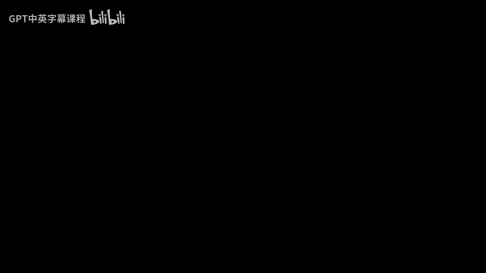
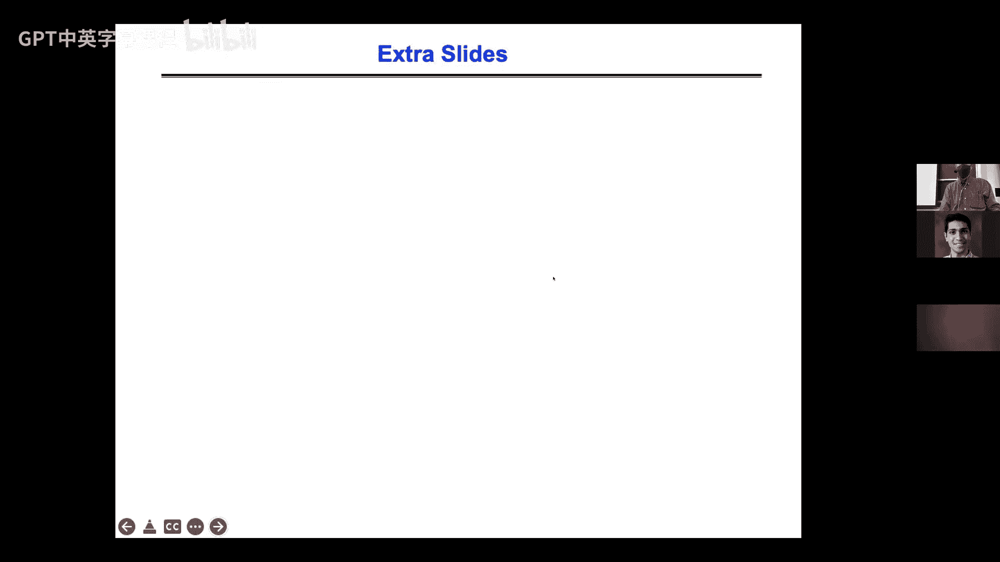
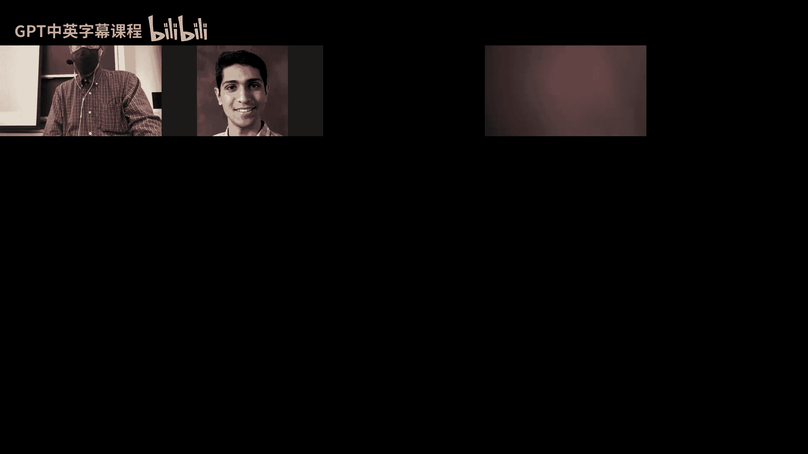

# 026：结构化网格 🧮

在本节课中，我们将学习并行计算中的一个核心模式：**结构化网格**。我们将以求解泊松方程为例，探讨如何并行化和优化结构化网格上的算法。结构化网格广泛应用于科学计算和图像处理等领域，理解其并行化策略至关重要。

## 结构化网格与泊松方程

上一节我们介绍了并行计算的13种常见模式，结构化网格是其中之一。它之所以重要，是因为它出现在许多不同的场景中，例如求解偏微分方程或处理图像（图像本质上就是一个二维像素矩阵）。

为了具体说明，我们将以求解泊松方程为例。泊松方程可以写成一个线性方程组 **T * u = f**。其中，矩阵 **T** 具有特殊的结构：在二维网格上，对于每个内部网格点，其方程涉及该点及其四个最近邻（上、下、左、右）的值。这种操作模式被称为**模板**或**卷积核**。在三维中，则会涉及六个最近邻。

## 求解泊松方程的算法概述

有多种算法可用于求解此类线性系统。我们将重点讨论其中四种基于结构化网格的算法，它们按从最通用/最慢到最专用/最快的顺序排列：

1.  **雅可比迭代法**：时间复杂度为 **O(N²)**（对于N个未知数的二维网格）。
2.  **逐次超松弛迭代法**：时间复杂度为 **O(N^(3/2))**。
3.  **共轭梯度法**：时间复杂度同样为 **O(N^(3/2))**，但适用于更广泛的对称正定矩阵。
4.  **多重网格法**：最优算法，时间复杂度为 **O(N)**。

接下来，我们将逐一深入探讨这些算法及其并行化策略。

## 雅可比迭代法及其并行化

雅可比方法是最简单的迭代求解器。对于二维泊松方程，每个网格点的新值通过其四个最近邻旧值的平均来计算，公式如下：
`u_{i,j}^{(m+1)} = (u_{i-1,j}^{(m)} + u_{i+1,j}^{(m)} + u_{i,j-1}^{(m)} + u_{i,j+1}^{(m)} + f_{i,j}) / 4`
其中 `(m)` 表示迭代次数。

这种方法收敛缓慢，因为信息每步只能传播到相邻网格点。对于 `n x n` 的网格，需要大约 `n` 步迭代信息才能从中心传播到边界，因此总计算量为 **O(n²) = O(N)**。

### 如何并行化雅可比迭代

并行化的关键在于将网格划分给多个处理器。最直观的方法是将二维网格划分为大小大致相等的子块（例如正方形）。每个处理器负责更新其子块内部的点。对于边界上的点，处理器需要从相邻处理器获取数据。

这种划分方式下，每个处理器需要通信的数据量与其子块的周长成正比。优化通信的一个高级技巧是进行**时间分块**：一次性计算多个迭代步，并交错更新网格的不同部分，从而将多次迭代的通信开销合并为一次，显著减少消息传递次数（即降低延迟成本）。这种优化在稀疏矩阵计算中具有通用性。

## 从雅可比到逐次超松弛迭代法

为了加速收敛，我们可以对雅可比方法进行两处改进：
1.  **使用最新数据**：在计算新值时，使用已更新的邻居值（而非全部旧值）。
2.  **超松弛**：将更新步长乘以一个大于1的因子 `ω`，以更快地逼近解。

然而，直接按顺序（如从左到右、从上到下）更新会引入数据依赖，阻碍并行化。解决方法是采用**红黑排序**。

### 红黑排序与图着色

我们将网格点交替标记为“红色”和“黑色”。观察发现，每个红点的所有邻居都是黑点，反之亦然。因此，我们可以：
1.  并行更新所有黑点（仅依赖红点的旧值）。
2.  并行更新所有红点（依赖刚更新完的黑点的新值）。

这样，每轮迭代只需两次并行步骤。对于更复杂的模板（依赖更多邻居），问题转化为**图着色**问题：为图中每个节点分配一种颜色，使得相邻节点颜色不同。然后按颜色顺序进行更新。著名的四色定理指出，任何平面图最多只需四种颜色。

结合超松弛后，SOR方法的收敛步数从 **O(n²)** 减少到 **O(n)**，从而使总计算量降至 **O(N^(3/2))**。

## 共轭梯度法简介

共轭梯度法是一种更通用的迭代法，适用于任何对称正定矩阵。其核心操作包括稀疏矩阵-向量乘法和向量点积。虽然其渐近复杂度与SOR相同，但通用性更强。同样，可以采用类似时间分块的技术来优化其通信开销。

## 多重网格法：最优求解器 🚀

前述方法（雅可比、SOR）的收敛速度受限于信息通过最近邻传播的速度。为了达到 **O(N)** 的线性时间复杂度，我们需要一种能让信息在网格上快速传播的方法。多重网格法正是这样的算法。

### 核心思想：分层求解

多重网格的关键思想是使用**一系列由粗到细的网格**。基本观察是：平滑的误差分量（低频误差）在细网格上收敛慢，但在粗网格上可以快速消除；而粗糙的误差分量（高频误差）在细网格上可以通过类似雅可比的“平滑器”快速消除。

算法采用递归的 **V循环**：
1.  **预平滑**：在细网格上执行几步加权雅可比迭代，消除高频误差。
2.  **限制**：将细网格上的残差（当前解与精确解的差距）传递到更粗的网格上。
3.  **粗网格求解**：在粗网格上递归求解残差方程（或近似求解）。
4.  **插值**：将粗网格上的修正值插值回细网格。
5.  **后平滑**：在细网格上再进行几步平滑迭代。

通过在不同尺度的网格上工作，多重网格能在与未知数数量 **N** 成正比的运算量内求解问题，且迭代次数与问题规模无关。

### 多重网格的并行化

并行化多重网格时，我们同样将最细网格划分为子域分配给处理器。当算法递归到较粗的网格时，网格点数减少，可能导致部分处理器空闲。通信主要发生在每个网格层上处理器子域边界的数据交换。尽管在极粗的网格上并行效率会下降，但由于大部分计算集中在最细网格上，总体并行效率仍然很高。

与另一种快速算法FFT相比，多重网格在通信量（尤其是通信字数）上通常更具优势。

### 扩展到非结构化网格

多重网格的思想也可以推广到非结构化网格（如有限元网格）。挑战在于如何定义粗网格、限制算子和插值算子。通常使用**图粗化**技术（如最大独立集算法）来生成粗网格序列。尽管更复杂，但这使得多重网格成为求解大规模科学计算问题的强大工具。

## 总结

本节课我们一起学习了结构化网格上的并行计算。我们从最简单的雅可比迭代法开始，探讨了其并行划分和通信优化技巧。接着，我们介绍了通过红黑排序实现并行化的逐次超松弛迭代法。最后，我们深入探讨了最优的多重网格算法，它通过在不同尺度的网格上协同工作，实现了线性时间复杂度和高效的并行化。这些算法和优化思想是科学计算和高性能计算的基石。