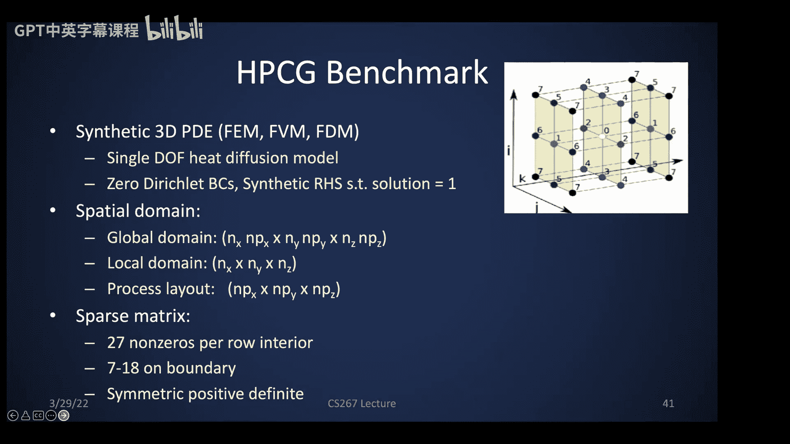
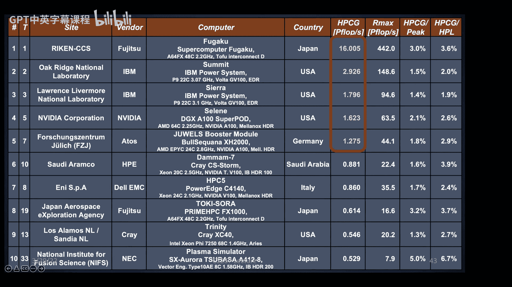
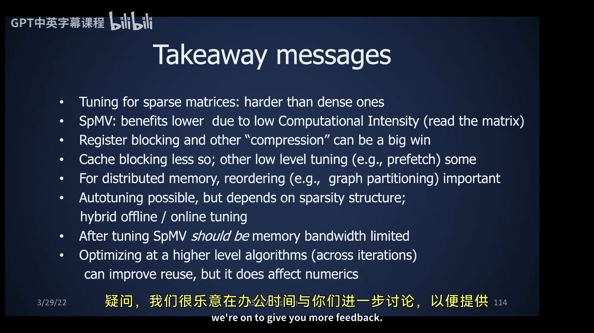

# 027：稀疏矩阵向量乘与迭代求解器

## 概述
在本节课中，我们将要学习稀疏矩阵向量乘（SpMV）及其在迭代求解器中的应用。我们将探讨稀疏矩阵的定义、常见的数据结构、并行化策略、性能优化技巧，以及如何通过算法层面的改进来突破SpMV的性能瓶颈。

---

## 稀疏矩阵简介

稀疏矩阵是指矩阵中大部分元素为零的矩阵。如果使用稠密矩阵格式存储，会浪费大量内存和计算时间。稀疏矩阵在气候模拟、图像分析、网页排名、图神经网络等众多领域都有广泛应用。

MATLAB中的`spy`函数可以生成“间谍图”，直观展示稀疏矩阵的非零元分布。

以下是几种常见的稀疏矩阵模式：
*   **对角矩阵**：最简单的稀疏模式。
*   **三对角矩阵**：在特征值问题中很常见。
*   **不规则模式**：非零元位置不规则，需要存储每个非零元的位置。
*   **分块模式**：非零元聚集在密集的小块中，常见于有限元问题。
*   **对称矩阵**：可以利用对称性只存储一半数据。

## 稀疏矩阵的应用实例

以下是稀疏矩阵在不同领域的应用示例：

*   **互联网连接**：矩阵元素 `A(i, j)` 非零表示网页 `i` 到网页 `j` 有链接。通过分析矩阵结构可以发现社群。
*   **结构设计（有限元）**：矩阵更容易可视化。
*   **线性规划**：矩阵可以是矩形的。
*   **推荐系统**：行代表用户，列代表产品，矩阵元素表示购买次数。目标是预测缺失值（问号处）。
*   **图像分割**：每个像素对应矩阵的一行和一列。`A(i, j)` 表示像素 `i` 和 `j` 属于图像同一区域的可能性。分割边界问题可以转化为该稀疏矩阵的特征值问题。
*   **谷歌PageRank**：核心是寻找一个巨大稀疏矩阵的主特征值和特征向量，通过重复的矩阵向量乘法实现。
*   **文本分析（潜在语义索引）**：行代表文档，列代表词。对矩阵进行低秩近似（如SVD）可以用于文档分类。
*   **科学与工程**：在求解ODE和PDE时，经常会产生稀疏矩阵。

## 稀疏矩阵的存储格式

稀疏矩阵和图在数学上是等价的。我们将从图的数据结构开始，然后过渡到稀疏矩阵的数据结构。

### 压缩稀疏行格式

压缩稀疏行（CSR）格式是我们讨论的第一个数据结构。对于一个有向加权图，我们可以用链表表示，但遍历效率低。CSR格式使用三个数组来静态高效地存储矩阵：
1.  `val`: 按行顺序存储所有非零元的值。
2.  `col_ind`: 存储每个非零元所在的列索引。
3.  `row_ptr`: 存储每一行第一个非零元在`val`和`col_ind`数组中的起始位置。

对于无向图（对称矩阵），只需存储矩阵的上三角部分即可。

### 其他存储格式

除了CSR，还有其他多种存储格式：
*   **压缩稀疏列（CSC）**：与CSR类似，但按列存储。
*   **坐标格式（COO）**：存储`(行索引i, 列索引j, 值A(i,j))`三元组，顺序任意。
*   **对角格式（DIA）**：当矩阵的非零元集中在几条对角线上时使用。
*   **分块格式**：当矩阵具有密集子块时（如有限元中的8x8块），可以显著减少索引存储开销。
*   **寄存器分块与缓存分块**：针对不同层次内存的优化。

## 稀疏矩阵向量乘

我们假设使用CSR格式，计算 `y = A * x`。

### 串行算法

串行代码循环遍历每一行，对于每一行中的每个非零元 `A(i, j)`，执行 `y(i) += A(i, j) * x(j)`。这里的关键是，获取 `x(j)` 需要间接寻址，这是一个不规则的内存访问，是主要开销来源。

SpMV是一个带宽受限的BLAS-2级操作，每个非零元只进行一次乘加运算，数据复用率极低。其性能上限是稠密矩阵向量乘的速度。

### 并行化策略

SpMV可以方便地并行化，因为每个输出元素 `y(i)` 的计算是独立的，不存在竞态条件。

以下是几种并行化方法：
*   **OpenMP**：在最外层的行循环前添加并行指令。使用`static`调度可能导致负载不均（各行非零元数量不同），使用`dynamic`调度可以改善负载均衡，但会引入额外开销。
*   **SIMD向量化**：如果处理器支持宽SIMD单元（如AVX2），可以一次获取多个连续的非零元及其对应的`x`元素，进行向量化乘加。这要求每行有足够多的非零元。
*   **CUDA**：在GPU上，可以将不同的行块分配给不同的线程块。每个线程负责计算一部分行的结果。
*   **GPU上的分段扫描**：另一种GPU策略是使用分段前缀和（扫描）。首先计算所有 `A(i,j)*x(j)` 的乘积，然后利用一个标志数组指示每行的起始位置，通过分段扫描一次性求出每行的累加和，即结果`y`。

### 针对不同格式的并行化

如果矩阵按对角线存储（如DIA格式），并行化方式会不同。此时，可以按对角线进行并行化，每条对角线的计算涉及连续的`x`和`y`元素访问，没有间接寻址，效率更高。这种格式在GPU上也有应用，称为锯齿状对角格式。

## 分布式内存并行

首先回顾稠密矩阵向量乘的分布式算法：
1.  **行划分**：每个处理器拥有连续的行块。需要广播整个`x`向量，然后进行本地乘加，无归约。
2.  **列划分**：每个处理器拥有连续的列块。无需通信即可计算本地贡献，但需要对结果`y`进行全局归约。
3.  **二维块划分**：处理器网格状分布。需要两个通信阶段：广播`x`的子块和归约`y`的子块。

对于稀疏矩阵，直接应用上述方法可能面临负载不均的问题。例如，在二维划分中，如果非零元集中在对角线，很多处理器可能没有工作。

理想情况是通过图划分/矩阵重排序，使矩阵近似于分块对角形式，从而实现完美的负载均衡和无通信。图划分将在后续课程中详细讨论。

## 性能基准与瓶颈

HPCG（高性能共轭梯度）基准测试用于衡量超级计算机的稀疏线性代数性能。其核心是SpMV。数据显示，即使是顶级机器，其HPCG性能（稀疏）也远低于HPL性能（稠密），通常只有峰值性能的很小百分比。这凸显了稀疏计算的带宽受限特性。

## SpMV性能调优

优化SpMV的核心是减少通信（内存访问）。

### 寄存器分块

对于具有密集子块结构的矩阵（如NASA结构分析问题中的8x8块），使用分块存储格式可以大幅减少索引存储和间接寻址。实验表明，最佳分块大小（R x C）并非总是直观的最大值（如8x8），它依赖于硬件架构（如寄存器数量）。这是一个需要自动调优的问题。

### 自动调优工具OSKI

OSKI（优化稀疏核接口）是一个自动调优库。它包含离线和运行时两部分：
*   **离线阶段**：在目标机器上，对不同分块大小（R x C）的稠密矩阵进行SpMV性能基准测试。
*   **运行时阶段**：对输入矩阵进行随机采样，估算采用不同分块大小时需要填充的零元素数量（填充因子）。结合离线性能数据，选择能使“性能/填充因子”最大化的分块大小。

这种方法能以较低开销（约10次SpMV）为多次迭代的算法找到接近最优的参数。

### 缓存分块

缓存分块旨在重用向量`x`的元素。将矩阵按列分块，使得处理一个列块时所需的所有`x`元素能装入缓存。这对于非常“矮胖”的矩阵（如潜在语义索引矩阵）特别有效。

### 其他优化技术汇总

多种优化技术可以结合使用，获得累积加速：
*   **变长分块**：针对矩阵中不同大小的密集块使用不同分块格式。
*   **对角线优化**：利用对角线格式获得2倍加速。
*   **矩阵重排序**：局部重排非零元以创建更密集的块。
*   **对称性利用**：只存储一半矩阵，获得近2倍加速。
*   **多向量乘法**：计算 `A * X`（X是多列矩阵），数据复用率高，可获得显著加速。
*   **组合操作**：如同时计算 `A*x` 和 `A^T*x`，只需读取一次矩阵`A`。
*   **高阶核**：计算 `{x, Ax, A^2x, ..., A^{k-1}x}`，只需读取一次矩阵`A`，可用于加速迭代算法。

屋顶线模型分析证实，经过充分优化（如分块、预取、NUMA感知），SpMV性能可以接近机器的内存带宽上限。

## 超越SpMV：算法层面的优化

仅优化单次SpMV无法突破其固有的带宽限制。我们需要在更高算法层次上寻求改进，减少对矩阵`A`的访问次数。

### 结构化网格的启示

对于三对角矩阵（来自一维网格），要计算 `{x, Ax, A^2x, A^3x}`，可以利用依赖关系图。通过巧妙的计算顺序（在串行情况下按“梯形”区域计算，在并行情况下让处理器冗余计算重叠部分），可以将k步SpMV的通信成本降低到相当于1步SpMV的水平。

### 推广到一般稀疏矩阵

对于任意稀疏矩阵，可以将其视为图。通过图划分将顶点分配给不同处理器。要计算k步SpMV，每个处理器不仅需要其直接邻居的数据（第1步），还需要邻居的邻居的数据（第2步），依此类推。通过一次性交换所需的所有边界数据（而不是每步交换一次），可以大幅减少通信次数。在串行情况下，类似地可以组织计算以重用缓存中的向量数据。

### 算法修改示例：GMRES

标准GMRES算法每步进行一次SpMV和正交化。新的“通信避免”算法一次性生成Krylov子空间基 `{x, Ax, A^2x, ..., A^{k-1}x}`，然后通过Tall-Skinny QR进行正交化，并求解相同的子问题。在精确算术下，结果相同，但通信和矩阵访问次数减少为原来的约`1/k`。

然而，由于舍入误差，直接使用 `A^j x` 作为基会导致数值不稳定。需要通过选择不同的多项式基并进行数值分析来修正算法，使其收敛。修正后的算法能带来显著的加速。

## 总结

本节课我们一起学习了稀疏矩阵向量乘的核心知识：
1.  **稀疏矩阵**广泛存在于科学计算和数据分析中，需要特殊的数据结构（如CSR）来高效存储。
2.  **SpMV**是迭代求解器的核心，但其性能受限于内存带宽，数据复用率低。
3.  **并行化**SpMV相对直接，但负载均衡是关键挑战。
4.  **性能调优**空间巨大，包括寄存器分块、缓存分块、格式选择等，高度依赖于硬件和矩阵结构，通常需要自动调优工具（如OSKI）。
5.  **根本性加速**需要通过修改上层迭代算法（如通信避免Krylov子空间方法），减少对矩阵`A`的整体访问次数和处理器间通信次数，从而突破单次SpMV的性能瓶颈。这需要计算机科学和数值分析的结合。