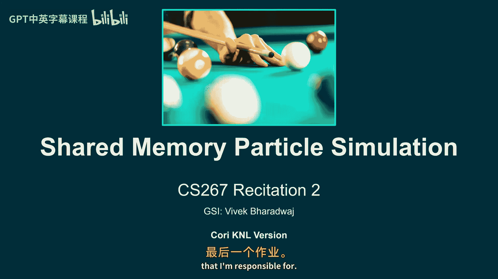

# 028： 共享内存粒子模拟教程 🧮




在本节课中，我们将学习如何优化一个粒子模拟程序。我们将从编写高效的串行代码开始，然后使用 OpenMP 将其并行化，以充分利用共享内存多核处理器的计算能力。

---

## 概述 📋

本次作业的目标是实现一个粒子模拟。粒子在近距离内会产生排斥力，超过一个特定的“截止半径”后则没有相互作用力。我们将利用这一特性来优化计算。首先，你需要编写最快的串行（单核）版本。然后，你将使用 OpenMP 在一个节点上（使用 68 个线程）并行化这个模拟。核心挑战在于将算法复杂度从 O(n²) 降低到接近 O(n)，并高效地管理多线程间的数据共享与同步。

---

## 理解初始代码 🧑‍💻

初始代码结构清晰，主要包含三个部分：模拟初始化、单步模拟和粒子移动。

上一节我们介绍了作业的整体目标，本节中我们来看看具体的代码实现。

**模拟初始化 (`simulation_init`)**
这个函数用于初始化任何需要在模拟开始前设置的数据结构。它不执行实际的粒子计算。

**单步模拟 (`simulate_one_step`)**
这是核心计算函数。初始版本使用了两层嵌套循环来遍历所有粒子对，计算它们之间的作用力。其时间复杂度为 O(n²)，这是我们首要需要优化的部分。

**粒子移动 (`move`)**
在计算完所有粒子受到的作用力后，此函数根据牛顿第二定律（F=ma）更新每个粒子的速度和位置，实现时间步进。

让我们深入看一下作用力计算函数 `apply_force`。

```cpp
void apply_force(particle_t& particle, particle_t& neighbor) {
    // 计算两个粒子间的距离
    double dx = neighbor.x - particle.x;
    double dy = neighbor.y - particle.y;
    double r2 = dx * dx + dy * dy;

    // 检查距离是否大于截止半径
    if (r2 > cutoff * cutoff)
        return;

    // 防止距离过近导致力过大
    r2 = fmax(r2, min_r * min_r);

    // 计算并累加作用力（加速度）
    double r = sqrt(r2);
    double coef = (1 - cutoff / r) / r2 / mass;
    particle.ax += coef * dx;
    particle.ay += coef * dy;
}
```
该函数计算两个粒子间的力。如果距离超过截止半径，则直接返回。`min_r` 是一个安全距离，用于防止粒子过于接近时产生巨大的力，导致模拟不稳定。计算得到的加速度会累加到粒子的 `ax` 和 `ay` 变量中。

---

## 核心优化策略：粒子分箱 📦

为了将计算复杂度从 O(n²) 降下来，我们需要利用“截止半径”这一特性。一个粒子只与一定距离内的其他粒子发生相互作用。

上一节我们分析了初始代码的低效之处，本节中我们来看看如何通过“分箱”算法来优化它。

**分箱原理**
我们将整个模拟空间划分成许多大小相等的网格（称为“箱”）。每个粒子根据其坐标被分配到对应的箱中。对于一个给定的粒子，我们只需要检查其所在箱及其相邻箱（总共9个箱）中的粒子，来计算相互作用力，而无需遍历所有粒子。

**算法复杂度**
假设粒子密度恒定（即增加粒子数量时，模拟空间也同比增大），那么每个粒子周围在“截止半径”内的粒子数量在期望上是一个常数。因此，算法的平均时间复杂度从 O(n²) 降低到了 O(n)。

**实现注意事项**
以下是实现分箱算法时需要考虑的几个关键点：
*   **箱的大小**：箱的边长应与截止半径相关，以确保能捕获所有可能的相互作用。太小会漏算，太大会引入不必要的计算。
*   **动态更新**：粒子会移动，因此每个模拟步长都需要重新计算粒子所属的箱。
*   **数据结构**：你需要设计一个高效的数据结构来存储每个箱中的粒子列表（例如，使用 `std::vector` 的数组）。

---

## 使用 OpenMP 进行并行化 ⚡

在优化好串行版本后，下一步是使用 OpenMP 引入共享内存并行。

上一节我们通过分箱优化了串行算法，本节中我们来看看如何将计算任务分配到多个线程上。

**并行区域与工作共享**
初始代码的 `main.cpp` 中已经设置了一个 OpenMP 并行区域。关键点在于，`simulate_one_step` 函数在这个并行区域内被所有线程调用。我们在这个函数内部使用 `#pragma omp for` 等指令来划分工作。

```cpp
// 在 simulate_one_step 函数内部
#pragma omp for
for (int i = 0; i < num_bins; ++i) {
    // 处理第 i 个箱子的工作
}
```
这个指令会让循环的迭代在不同的线程间分配。

**需要并行化的部分**
你的并行化工作应集中在以下几个环节：
1.  **粒子分箱**：将粒子分配到各个箱中。
2.  **作用力计算**：遍历箱子，计算粒子间的作用力。
3.  **粒子移动**：根据计算出的加速度更新粒子的位置和速度。

**数据竞争与同步**
以下是并行编程中常见的挑战及应对策略：
*   **数据竞争**：当多个线程同时写同一个粒子的加速度 (`ax`, `ay`) 时会发生。可以使用 **归约子句** 或 **原子操作** 来避免。
*   **伪共享**：多个线程频繁写入同一缓存行上的不同变量，会导致缓存一致性开销激增。可以通过调整数据布局（例如，让每个线程处理连续的内存块）来缓解。
*   **负载均衡**：由于粒子分布均匀，且所有线程都能访问所有数据，使用 OpenMP 默认的循环调度策略通常就能获得较好的负载均衡。

---

## 性能评估与缩放测试 📊

完成并行化后，我们需要科学地评估其性能。主要使用两种缩放测试：强缩放和弱缩放。

上一节我们讨论了并行化的实现，本节中我们来看看如何衡量并行程序的效率。

**强缩放**
强缩放测试**保持问题规模（粒子总数）不变**，增加处理器（线程）数量，观察运行时间的变化。
*   **理想情况**：运行时间随线程数增加而成比例减少。
*   **实际衡量**：**强缩放效率** = (单线程时间 / (P线程数 * P线程运行时间))。它反映了并行化对固定大小问题的加速效果。
*   **阿姆达尔定律**：它指出，由于程序中存在不可并行部分，强缩放效率会随着线程数增加而逐渐降低，最终趋于0。

**弱缩放**
弱缩放测试**使每个处理器上的问题规模保持不变**，即同时增加处理器数量和总问题规模。
*   **理想情况**：运行时间保持恒定。
*   **实际衡量**：**弱缩放效率** = (单线程处理N个粒子的时间 / P线程处理N*P个粒子的时间)。它反映了并行系统处理更大规模问题的能力。

在你的报告中，需要展示并分析在不同粒子数量和不同线程数下的强缩放和弱缩放效率曲线。

---

## 总结 🎯

本节课中我们一起学习了共享内存粒子模拟的完整实现流程。

我们首先分析了初始的 O(n²) 复杂度代码，然后引入了**粒子分箱**算法，将复杂度优化至接近 O(n)。接着，我们探讨了如何使用 **OpenMP** 对分箱后的算法进行并行化，涵盖了并行区域、工作共享、以及如何处理数据竞争和伪共享等问题。最后，我们介绍了**强缩放**和**弱缩放**这两个关键的性能评估指标，用于科学地衡量并行程序的效率。


记住，先优化串行版本，再实施并行化，并始终以性能测试数据来指导你的优化方向。祝你编程顺利！