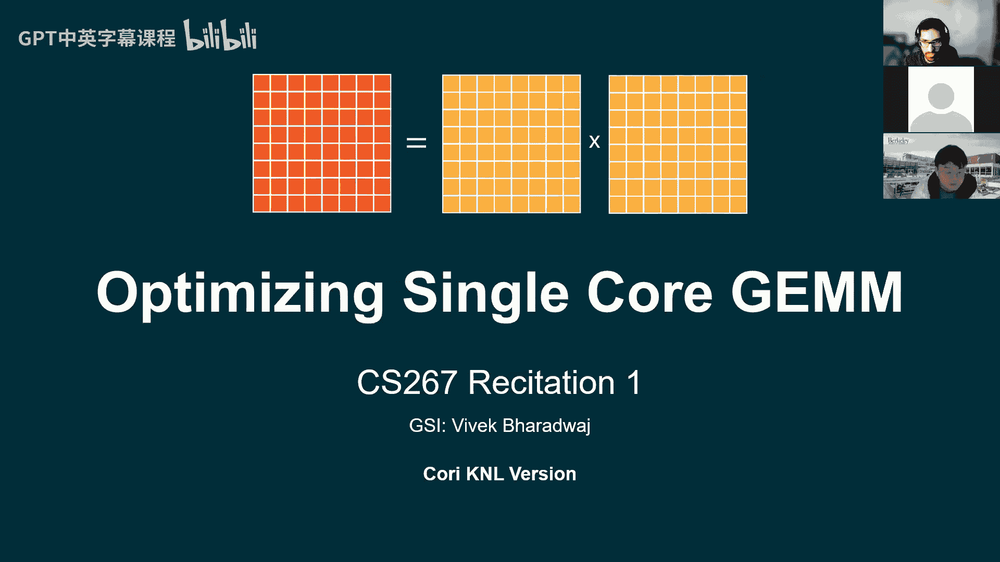

# 029：作业一优化策略教程




在本节课中，我们将学习如何为单核矩阵乘法（GEMM）编写高性能代码。这是CS267课程作业一的核心内容，我们将探讨一系列优化技术，从基础的循环分块到高级的SIMD（单指令多数据）和微内核编写。

## 概述

你的任务是优化一个简单的方阵乘法代码，使其在单核上达到尽可能高的性能。这意味着不能使用OpenMP、Cilk等多核并行技术，但可以利用单指令多数据（SIMD）和指令级并行（ILP）。我们将从最简单的三重循环开始，逐步应用多种优化策略。

## 1. 单级循环分块 🧱

上一节我们介绍了任务目标，本节中我们来看看第一个优化策略：循环分块。这个策略已经包含在提供的初始代码中。

其核心思想是将大的矩阵乘法分解为一系列小的矩阵块乘法。这样做可以增加数据的时间局部性，让数据块更有可能留在缓存中，从而减少访问主内存的延迟。

以下是选择分块参数的基本公式：假设目标缓存级别（如L1或L2）可以容纳 `C` 个数据字（例如双精度浮点数）。你需要选择分块参数 `m`、`n`、`k`，使得这三个矩阵块所占用的总数据量不超过缓存容量。一个实用的建议是使用比理论最大值稍小的 `C` 值作为缓冲因子。

```
m * k + k * n + m * n <= C
```

初始代码已经实现了外层循环按分块大小步进，内层调用一个类似朴素GEMM的函数。你的工作是尝试不同的分块形状（例如 64x64, 128x128），通过基准测试找到性能最佳的组合。

## 2. 多级循环分块 🏗️

在掌握了单级分块后，我们可以将这一思想递归地应用到更多缓存级别上，例如在针对L2缓存分块后，再针对L1缓存或寄存器进行第二级分块。

这意味着你需要创建更多层的嵌套循环。需要注意的是，不同分块层级的最优循环顺序（`i`、`j`、`k` 的排列）可能不同。例如，外层分块可能适合 `i, j, k` 的顺序，而针对寄存器的微内核可能需要 `k, i, j` 的顺序。你需要通过实验来确定。

当进行多级分块时，为寄存器级分块编写的特定计算核心通常被称为 **微内核**，这是我们后续要深入讨论的内容。

## 3. 矩阵重排与内存对齐 📦

矩阵乘法性能的一个主要瓶颈是不连续的内存访问。由于输入矩阵是按列主序存储的，访问一行数据时内存地址是不连续的，这无法利用硬件的预取机制，速度较慢。

解决方案是：在计算之前，将矩阵复制到新的内存区域，并按照你的算法最需要的顺序（例如行主序）重新打包。虽然复制本身有 `O(n²)` 的开销，但相比于 `O(n³)` 的计算成本，收益是显著的。

以下是进行内存对齐的方法：使用 `_mm_malloc` 替代标准的 `malloc`，并指定对齐边界（例如64字节）。这能确保内存块的起始地址是缓存行大小的整数倍，使得某些SIMD指令能运行得更快。

```c
// 分配对齐到64字节边界的内存
double* aligned_A = (double*)_mm_malloc(size * sizeof(double), 64);
```

此外，编写正确的分块重排公式可能很复杂。一个有用的技巧是编写一个递归的打包过程，或者使用代码生成工具来辅助。

## 4. 优化循环顺序 🔄

矩阵乘法可以有两种解释：一系列点积的和，或者一系列外积的和。将循环顺序从 `i, j, k` 改为 `k, i, j`，就对应了外积的视角。

为什么这有帮助？这有助于提高**指令级并行**。在 `i, j, k` 顺序中，最内层循环不断累加到同一个 `C[i][j]` 位置，产生了数据依赖，限制了处理器同时执行多条指令的能力。而在 `k, i, j` 顺序中，内层两层循环写入的是不同的 `C` 矩阵位置，依赖更少，为处理器提供了更多并行执行指令的机会。

虽然这个改动本身带来的提升可能有限，但它是为后续编写显式微内核、最大化ILP效果的重要准备。

## 5. 编写微内核 ⚙️

上一节我们通过调整循环顺序为ILP创造了潜力，本节我们通过编写微内核来真正释放这种潜力。循环中的索引递增和边界检查等“簿记”工作会干扰处理器的指令流。

微内核是一个执行极小规模矩阵乘法的函数，其小到所有操作数都能放入处理器寄存器中。它由一长串显式的、无循环的算术指令组成。

以下是一个向量加法的微内核示例（虽然GEMM的微内核更复杂，但结构类似）：
```c
// 一个简单的8元素向量加法微内核
void micro_kernel_add(const double* a, const double* b, double* c) {
    // 1. 声明寄存器变量（编译器会尽力将其放入真实寄存器）
    double a0 = a[0], a1 = a[1], /* ... */ a7 = a[7];
    double b0 = b[0], b1 = b[1], /* ... */ b7 = b[7];
    double c0, c1, /* ... */ c7;

    // 2. 执行计算（一系列显式指令）
    c0 = a0 + b0;
    c1 = a1 + b1;
    // ...
    c7 = a7 + b7;

    // 3. 存回结果
    c[0] = c0; c[1] = c1; /* ... */ c[7] = c7;
}
```
对于GEMM，你需要为一个小矩阵块（如8x8）编写这样的微内核。由于代码非常重复，强烈建议使用Python等脚本语言自动生成C代码。

## 6. 使用SIMD指令集 🚀

单指令多数据允许一条指令同时操作多个数据元素。对于AVX-512，一条指令可以处理8个双精度浮点数。

编译器有时能自动向量化简单循环，但对于复杂的GEMM，手动使用内部函数通常能获得更大提升。内部函数看起来像函数，但实际上是内联汇编指令的包装，开销极小。

以下是使用AVX-512内部函数重写上述向量加法微内核的方法：
```c
#include <immintrin.h>

void micro_kernel_add_avx512(const double* a, const double* b, double* c) {
    // 1. 声明向量寄存器变量
    __m512d vec_a, vec_b, vec_c;

    // 2. 从对齐的内存加载数据
    vec_a = _mm512_load_pd(a); // 加载8个双精度数
    vec_b = _mm512_load_pd(b);

    // 3. 执行向量加法
    vec_c = _mm512_add_pd(vec_a, vec_b);

    // 4. 将结果存回内存
    _mm512_store_pd(c, vec_c);
}
```
你需要查阅Intel内部函数指南来找到合适的指令，例如融合乘加 `_mm512_fmadd_pd` 和广播 `_mm512_set1_pd`。结合微内核技术和SIMD，是提升性能的关键。

## 7. 软件预取 💾

当你的计算速度已经很快，内存带宽成为瓶颈时，可以考虑使用软件预取。这允许你提示处理器提前将数据从主内存加载到缓存中。

使用 `_mm_prefetch` 内部函数。你需要指定要预取的内存地址以及目标缓存级别（如L1或L2）。
```c
_mm_prefetch((char*)(a + prefetch_distance), _MM_HINT_T0); // 预取到L1缓存
```
关键的参数是**预取距离**，即提前多少元素进行预取。太近则数据来不及加载，太远则数据可能在被使用前就被挤出缓存。你需要通过参数搜索来找到最佳值。

请注意，预取通常只在其他优化（如分块、微内核、SIMD）都已就位，且代码处于内存瓶颈时才有明显效果。

## 8. 内联汇编（高级可选）⚡

这是一个非常特定且高级的优化。在作业指定的GCC 8.3编译器上，对于某些AVX-512操作（如融合乘加与广播的组合）的代码生成存在一个已知问题，可能导致性能只有理论值的一半。

解决方法是绕过编译器，直接编写正确的内联汇编指令。这需要你确保代码正确性，并且编译稳定。
```c
// 示例：内联汇编实现向量加（概念性示例）
asm volatile (
    "vmovapd %[src], %[dst]\n\t"
    "vaddpd %[src2], %[dst], %[dst]"
    : [dst] "=v"(vec_c)
    : [src] "v"(vec_a), [src2] "v"(vec_b)
    :
);
```
**除非你已用尽其他优化手段，否则不建议优先尝试此方法。** 它主要用于解决一个特定的编译器限制。

## 总结

本节课中我们一起学习了优化单核矩阵乘法的多种策略。我们从**循环分块**开始以改善缓存利用率，然后探讨了**矩阵重排与对齐**来优化内存访问模式。接着，我们通过**调整循环顺序**和**编写微内核**来最大化指令级并行。利用**SIMD指令集**是提升计算吞吐量的核心。最后，我们简要介绍了**软件预取**和**内联汇编**这两种更高级的调优手段。


记住，这些优化技术的效果通常是叠加且相互影响的。你的实验报告应该详细记录尝试过的技术、参数搜索的过程、性能图表以及对其背后原理的分析。祝你优化顺利，挑战成功！