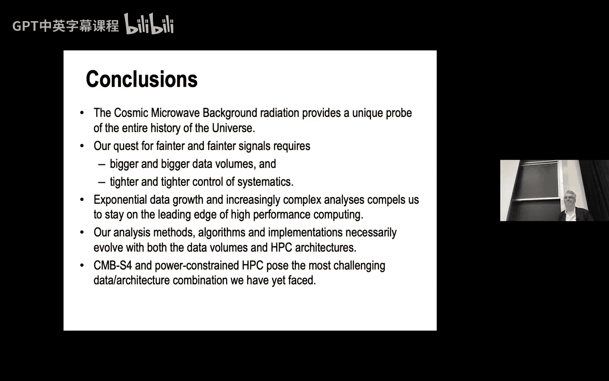

# 030：宇宙微波背景、大数据与大计算

在本节课中，我们将跟随Julian Borrill博士的讲座，探索宇宙学、大数据与高性能计算交汇的奇妙领域。我们将了解宇宙微波背景辐射如何成为揭示宇宙历史的“宇宙化石”，以及科学家们如何利用日益庞大的数据和不断演进的超级计算技术来解读其中的信息。

## 概述：宇宙学简史

上一节我们介绍了课程背景，本节中我们来看看宇宙学这门年轻科学的发展脉络。宇宙学真正始于1916年爱因斯坦的广义相对论，其核心方程 `G_μν + Λg_μν = 8πG T_μν` 描述了物质与时空的相互影响。然而，当时人们认为宇宙是静态的，这与方程隐含的动态宇宙相矛盾，因此爱因斯坦引入了宇宙常数Λ来维持静态。

1929年，哈勃通过观测发现星系退行速度与距离成正比，即 `v = H₀ * d`，这证明宇宙正在膨胀。爱因斯坦后来称引入Λ是他“最大的失误”。

关于宇宙起源，出现了两种主要理论：
*   **稳恒态理论**：宇宙在膨胀，但新物质不断产生以保持平均密度恒定。
*   **大爆炸理论**：宇宙始于一个炽热致密的奇点，并不断膨胀冷却。

1948年，阿尔弗和赫尔曼预言，如果大爆炸理论正确，宇宙中应充满一种来自早期炽热状态的残余辐射，即**宇宙微波背景辐射**。1964年，彭齐亚斯和威尔逊意外发现了这种均匀的微波噪声，并因此获得诺贝尔奖，这为**大爆炸理论**提供了关键证据。

## CMB：宇宙的“墙纸”与信息宝库

上一节我们了解了CMB的发现，本节中我们来看看它为何如此重要。CMB是宇宙大爆炸后约38万年时，宇宙冷却到足以让原子形成，光子得以自由传播时留下的“余晖”。这些光子携带了宇宙早期状态的印记，并记录了在抵达我们之前所经历的一切。

CMB的均匀性曾是一个谜题：天空上相隔超过1度的区域，在光子最后散射时不可能有因果联系，为何温度却如此一致？**暴胀理论**解决了这个问题，它认为宇宙在极早期经历了一次指数级膨胀，将一个微小的、处于热平衡的区域拉伸到了可观测宇宙的尺度。

然而，均匀中必须有“涟漪”，宇宙中观测到的结构（星系、星系团等）需要最初的密度扰动作为种子。经过约20年的搜寻，COBE卫星终于在1992年探测到了CMB中十万分之一的温度涨落。乔治·斯穆特和约翰·马瑟因此分享了2006年诺贝尔物理学奖。

## 从减速到加速：暗能量登场

上一节我们看到了宇宙早期的“涟漪”，本节中我们来看看宇宙近期的演化。20世纪90年代末，通过观测遥远的Ia型超新星，科学家们震惊地发现宇宙的膨胀**正在加速**，而非减速。这推翻了之前基于物质引力作用的宇宙命运图景。

这一发现可以通过重新引入爱因斯坦的宇宙常数Λ来解释，但符号需翻转，使其表现为一种排斥性的“**暗能量**”。索尔·珀尔马特、布莱恩·施密特和亚当·里斯因这一发现获得了2011年诺贝尔物理学奖。

结合CMB测量（揭示宇宙几何）和超新星测量（揭示宇宙动力学），科学家们构建了“**协和宇宙学模型**”，量化了宇宙的组成：
*   **暗能量**（Λ）：~70%
*   **暗物质**：~25%
*   **普通重子物质**：~5%

这意味着我们对其95%的宇宙成分几乎一无所知，CMB研究成为探索这些未知“暗 sector”物理的关键窗口。

## 解读CMB：从天空图到功率谱

上一节我们量化了宇宙成分，本节中我们来看看如何从观测数据中提取这些信息。我们通过CMB测量主要研究三类信息：
1.  **原初各向异性**：源于极早期宇宙的物理过程。
2.  **次级各向异性**：例如，光子被星系团引力透镜效应或热气体散射所影响，这有助于绘制宇宙物质分布图。
3.  **毫米波遗留巡天**：对宇宙学家来说是“污染”的银河系前景辐射，却是其他天文研究的宝贵数据。

单个观测者看到的CMB温度图是某个高斯随机过程的一次实现。为了进行理论预测和比较，我们需要一个对所有观测者都相同的统计描述。

以下是分析CMB天空图的关键步骤：
*   利用**球谐函数**对全天温度图进行分解。
*   计算**角功率谱** `C_l`，它描述了不同角尺度上的涨落功率。
*   功率谱上的峰谷结构对应着不同的宇宙学参数，例如：
    *   第一个峰的位置 → 宇宙空间曲率（平坦/开放/闭合）。
    *   峰值的相对高度 → 重子物质密度。
    *   再电离“驼峰” → 第一代恒星形成时间。
    *   小尺度上的透镜化B模信号 → 中微子总质量。
    *   原初B模信号 → 暴胀的能量尺度。

测量这些信号极具挑战性，例如，探测暴胀产生的原初引力波B模信号，需要测量**十亿分之一**级别的温度涨落。

## 数据分析挑战：从时间流到科学发现

上一节我们了解了CMB蕴含的信息，本节中我们来看看如何从海量观测数据中提取它们。数据分析面临两大挑战：**统计不确定性**和**系统效应**。基本流程是一个在多个数据域中不断“清洗”系统效应并压缩数据的过程：

1.  **时间流数据**：去除探测器瞬变信号、宇宙射线击中、航天器特征等。
2.  **天空图**：利用多频率观测数据，根据CMB与前景辐射频率依赖性的不同，分离出干净的CMB图。
3.  **角功率谱**：从天空图计算功率谱，并移除次级效应（如引力透镜效应）的污染。

在整个链条中，我们不仅需要追踪数据本身，还需要追踪数据的**协方差矩阵**，以理解误差和关联性的传播。此外，**数据合成**（生成模拟数据）至关重要，用于实验设计、分析流程验证以及替代无法直接计算的协方差矩阵（采用蒙特卡洛方法）。

## 计算演进：从Boomerang到Planck

上一节我们概述了数据分析流程，本节中我们通过具体实验来看看计算需求的爆炸式增长。

**Boomerang气球实验（约2000年）**：
*   数据量较小，可采用精确的线性代数方法（如最大似然估计）进行分析。
*   计算核心是稠密矩阵运算，复杂度为 `O(N_pix³)`。
*   在900核的Cray T3E上运行，得益于高度优化的BLAS库，获得了接近峰值的性能。

**Planck卫星任务（2009-2013年）**：
*   数据量激增：从4个频率到9个频率，从仅温度到温度+偏振，从部分天区到全天，像素数从约10万增至约10亿。
*   精确方法（`O(N_pix³)`）的计算需求达到 `10^27` 次操作，变得不可行。
*   解决方案是转向**近似迭代算法**和**蒙特卡洛方法**：
    *   **制图**：使用预条件共轭梯度法。
    *   **功率谱估计**：使用“伪谱”方法，通过大量模拟数据来校准部分天区观测带来的偏差。
*   计算成本转变为与时间样本数成线性关系，并严重受限于**I/O**和**通信开销**。
*   通过代码优化（合并模拟与制图步骤、缓存公共数据、优化MPI通信）将性能提升了两个数量级以上。

## 未来挑战：CMB-S4与异构计算

上一节我们看到了Planck任务的计算挑战，本节中我们展望下一代实验CMB-S4将带来的更大挑战。

**CMB-S4实验**：
*   目标：探测暴胀能标，测量中微子质量。
*   规模：55万个探测器（Planck为72个），在两个站点（智利阿塔卡马、南极极点）进行7年观测。
*   挑战汇总：
    *   系统效应控制需提升约 `1000` 倍。
    *   信号灵敏度需提升约 `100` 倍。
    *   数据量将增加约 `1000` 倍。
    *   每瓦特性能（FLOPS/W）可能只有过去的 `1/100`。
*   粗略估算，总体计算效率需要提升约 `10^10` 倍。

新的系统效应挑战包括**大气噪声**（需要集成大气模拟）和**未知的仪器效应**。

同时，**高性能计算架构**正经历剧变。我们从多核CPU（如Intel Xeon Phi）转向了**GPU加速的异构计算**。这要求我们彻底重构代码：
*   目标：尽可能将数据保留在GPU显存中，最小化数据移动。
*   方法：开发定制GPU内核，利用CUDA、OpenMP offload等工具。
*   早期测试表明，单个GPU的性能已超过32个CPU核。

## 总结

本节课中我们一起学习了宇宙微波背景辐射如何作为宇宙历史的独特探针。从大爆炸理论的验证到暗能量的发现，CMB研究不断推动着宇宙学的前沿。然而，为了探测更微弱的信号（如原初引力波），我们需要CMB-S4这样规模空前的实验，产生指数级增长的数据量。

这使我们不得不依赖于高性能计算的最前沿技术。数据分析从精确的线性代数方法，演变为基于蒙特卡洛和迭代方法的近似计算。同时，计算架构正从同构多核系统转向GPU加速的异构系统，迫使科研人员不断重构和优化其代码。

CMB科学正处于一个关键时刻：科学目标驱动着数据量和计算复杂度的爆炸式增长，而计算技术本身也正处于架构转型的阵痛期。应对这一“大数据”与“异构计算”的双重挑战，将是未来从CMB中提取宇宙终极奥秘的关键。