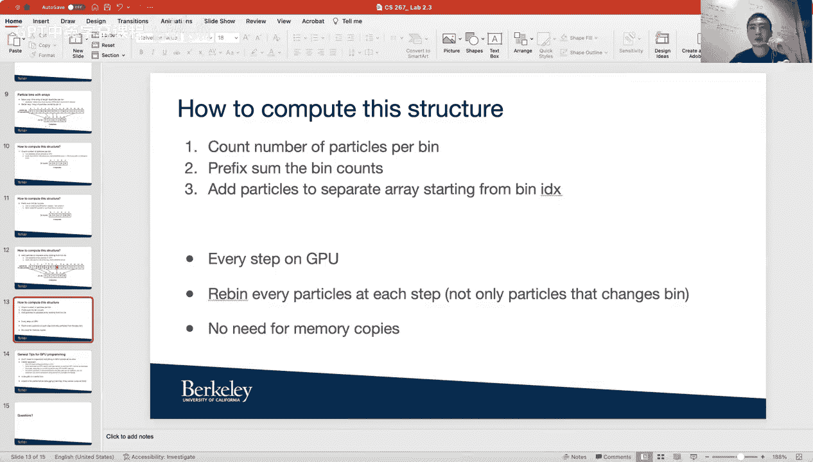

# 031：CUDA粒子模拟教程 🚀

在本教程中，我们将学习如何在GPU上使用CUDA进行粒子模拟。我们将回顾GPU的基本概念，并探讨如何在不使用标准模板库（STL）的情况下，高效地管理和操作粒子数据。课程将涵盖粒子计数、前缀和计算以及粒子在“箱子”间的移动等核心操作。

---

## GPU基础回顾 💻

上一节我们介绍了GPU的基本概念，本节中我们来看看GPU编程的具体细节。

GPU是与CPU分离的设备。我们通常称CPU为“主机”，称GPU为“设备”或“加速器”。GPU是一种众核架构，这意味着单个芯片内包含大量核心。例如，KNL处理器有67-68个核心，可以同时启动272个线程。最新的NVIDIA V100 GPU拥有5120个CUDA核心。

然而，GPU的每个核心功能相对较弱。例如，无法在GPU核心上执行分支预测等复杂操作。CUDA是GPU编程的语言，类似于CPU编程中的C语言。

在GPU编程中，通常无法直接使用像`std::vector`这样的标准库数据结构，因为GPU不支持其添加、删除或排序等操作。虽然CUDA提供了类似功能的Thrust库，但这些操作通常仍在CPU端执行，然后通过PCIe总线将更新后的数据传输到GPU。由于PCIe带宽有限（约3GB/s），这种内存拷贝会成为性能瓶颈。因此，我们建议避免在GPU端频繁使用Thrust库进行数据传输。

---

## 粒子数据结构设计 🧱

上一节我们讨论了GPU编程的局限性，本节中我们来看看如何设计适合GPU的粒子数据结构。

不使用STL向量，我们可以使用数组来存储粒子。一种简单的方法是分配一个长度为“粒子总数 × 箱子数”的数组。但这种方法通常需要过多内存，GPU可能无法支持（通常GPU内存为16或32GB）。

因此，我们需要一个更好的方法：使用两个全局数组。
*   一个全局数组存储所有粒子。
*   另一个全局数组存储每个“箱子”的信息。

以下是具体步骤：

1.  **初始化数组**：假设有15个粒子。粒子数组的索引从0到14，每个索引位置存储一个粒子的ID。
2.  **按箱子ID排序粒子**：根据粒子所属的箱子ID对粒子数组进行排序。
3.  **建立箱子指针**：在箱子数组中，每个箱子存储一个指针，指向该箱子中第一个粒子在粒子数组中的起始位置。

例如，箱子0可能指向粒子索引0，表示粒子0、1、2、3属于箱子0。箱子1则指向粒子索引4，表示粒子4和5属于箱子1，依此类推。

这种方法只需两个数组，内存使用效率高，适合GPU处理。

---

## 并行操作实现 ⚙️

上一节我们设计了数据结构，本节中我们来看看如何在GPU上并行执行核心操作。

以下是三个可以在GPU上并行执行的核心操作：

### 1. 计算每个箱子的粒子数量

此操作可以跨粒子并行化。我们需要使用原子操作（如`atomicAdd`或`atomicInc`）来确保对箱子计数的更新是线程安全的。原子操作类似于C语言中的`fetch_and_add`，我们不建议使用锁，因为锁会导致阻塞和同步开销。

**操作示例**：
假设有多个线程并行处理粒子。线程1处理粒子ID 0、1、2，它们都属于箱子0。因此，线程1会使用原子操作将箱子0的计数加3。线程2处理粒子ID 3、4、5，其中粒子3属于箱子0，粒子4和5属于箱子1。因此，线程2会使用原子操作将箱子0的计数加1，将箱子1的计数加2。所有线程完成后，即可得到每个箱子的最终粒子数量。

### 2. 计算箱子计数的前缀和

计算前缀和是为了确定每个箱子在粒子数组中的起始位置。我们可以使用并行前缀和算法（在Lecture 8中介绍）。你可以自己实现，也可以使用Thrust库，但自定义实现通常性能更优。

**操作示例**：
首先，为每个箱子分配一个“权重”。第一个箱子的权重为0，其余箱子的权重为其粒子数量。然后，对这些权重进行并行前缀和计算。得到的结果就是每个箱子在排序后粒子数组中的起始索引。例如，箱子1的起始索引可能是4，表示从粒子数组索引4开始存储箱子1的粒子。

### 3. 将粒子移动到另一个箱子

在计算粒子间的作用力后，粒子可能需要移动到另一个箱子。此操作也可以跨粒子并行化，并需要使用原子操作来更新箱子指针，避免竞态条件。

**操作示例**：
假设粒子1需要从箱子0移动到箱子1。
1.  首先，根据新的箱子ID对所有粒子重新排序。
2.  然后，使用原子操作更新箱子1的起始指针。例如，箱子1的原指针指向索引4，现在需要将其更新为指向索引3（因为粒子1插入了箱子1的起始位置）。
3.  同时，箱子0的结束位置也需要相应调整。

类似地，如果粒子8需要移动到箱子2，则使用原子操作更新箱子2的指针，将其从6改为5。

**重要提示**：在每个模拟步骤中，建议对所有粒子重新排序，而不仅仅是移动了箱子的粒子，以确保数据结构的正确性。

---

## GPU编程实用建议 🛠️

上一节我们介绍了核心操作的实现，本节中我们来看看一些GPU编程的实用技巧。

以下是一些GPU编程的建议：

*   **逐步迁移代码**：如果不熟悉CUDA，不要试图一次性将所有代码移植到GPU内核。可以设置多个“婴儿步骤”，逐步将CPU代码（C/C++）迁移到CUDA代码。首先在CPU上实现所有功能，然后逐步将部分函数移至GPU内核，并相应地在CPU和GPU之间拷贝数组数据。最终目标是所有操作都在GPU内核中完成，无需主机与设备间的内存拷贝。
*   **自定义原子操作**：如果CUDA提供的原子操作（如加、减、递增、递减、最小值、最大值）不满足需求，可以使用`atomicCAS`（比较并交换）原语实现自己的原子操作。
*   **性能调试工具**：
    *   **CUDA-GDB**：类似于C语言的GDB，可以单步调试内核代码，检查变量值。
    *   **Nsight Compute / Nsight Systems**：使用`nvprof`或`ncu`生成性能分析文件，然后在NVIDIA提供的图形界面中分析内存拷贝时间和内核计算时间。示例命令：`ncu -o profile_output ./your_cuda_program`。
*   **工作负载划分**：根据粒子（而非箱子）来划分工作负载，可以更有效地利用GPU的数千个核心，尤其是当粒子数量达到百万级时。
*   **内存管理**：在GPU端，最大内存使用量是维护两个全局粒子数组（一个用于上一步状态，一个用于更新排序后的状态）和一个箱子数组。应尽量减少主机与设备间的数据拷贝。计算粒子间作用力时，数据会自动从全局内存加载到共享内存（SM的本地内存），只需传递正确的起始地址和偏移量即可。

---

## 总结 📚

本节课我们一起学习了在GPU上使用CUDA进行粒子模拟的关键技术。

我们回顾了GPU作为众核设备的特点及其编程模型。重点在于设计适合GPU的数据结构，即使用两个全局数组（粒子数组和箱子数组）来替代STL向量，以避免昂贵的主机-设备内存拷贝。

我们详细讲解了三个核心的并行操作：
1.  使用原子操作并行计算每个箱子的粒子数量。
2.  使用并行前缀和算法确定每个箱子在粒子数组中的起始位置。
3.  使用原子操作安全地将粒子在箱子间移动，并在每一步对所有粒子重新排序。

最后，我们提供了一系列GPU编程的实用建议，包括代码的逐步迁移、原子操作的使用、性能调试工具（CUDA-GDB, Nsight）的应用，以及高效的内存管理和工作负载划分策略。

掌握这些概念和技术，你将能够有效地在GPU上实现高性能的粒子模拟。