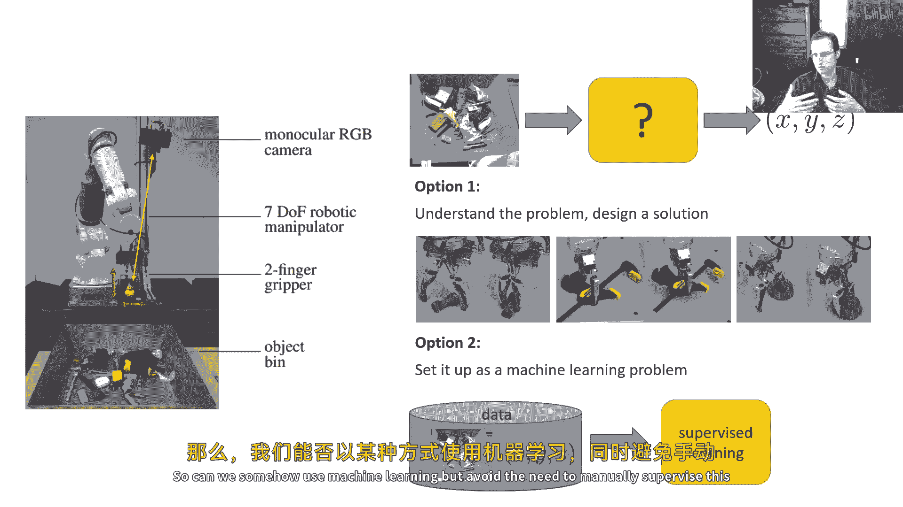
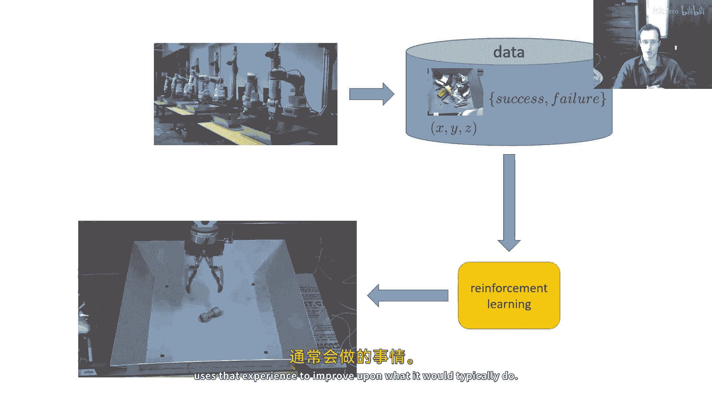
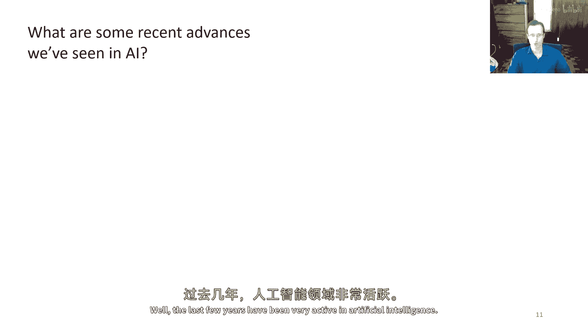
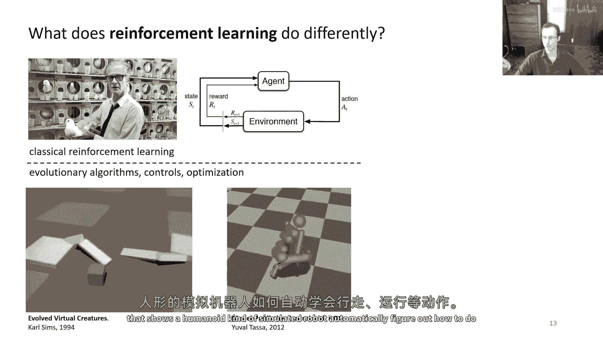
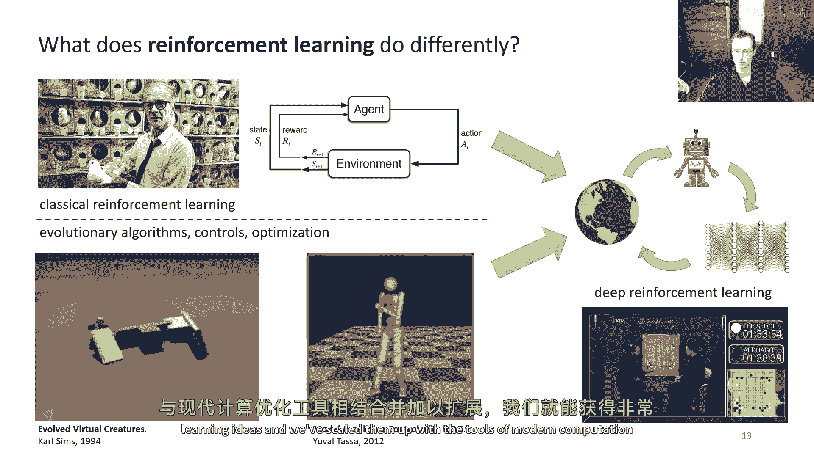
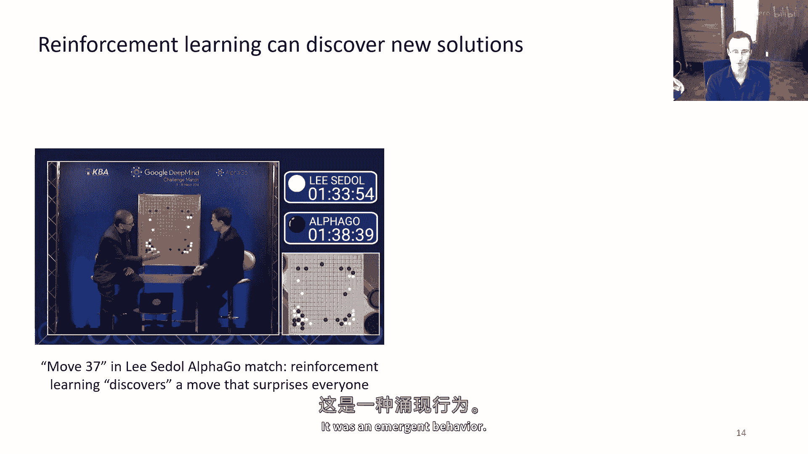
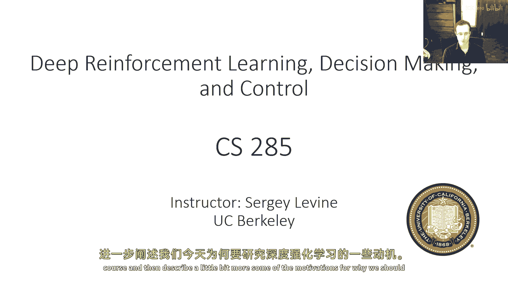

# P1：p1 CS 285： Lecture 1, Introduction. Part 1 - 加加zero - BV1NjH4eYEyZ

让我们假设你想要构建一个系统，使用这种机器人能够拾取物体，所以，这是机器人看到的，它从相机中看到图像，目标是输出，嗯，空间中的坐标，使用你将要构建的某种机器，这将允许它成功拾取物体，实际上。

这是一个相当棘手的问题来解决，因为，虽然你可能认为只需要在图中定位物体，并输出它们的位置，但实际上，正确地拾取一个物体的方法实际上有很多特殊情况和例外，你需要考虑。

如果你想真正理解问题并手动设计解决方案，也许刚性物体是，你知道的，相对直接拾取，你只需要将手指放在两侧，但如果物体形状怪异，质心分布复杂，你需要确保你更接近质心来拾取它，以防它从抓握器中掉出。

如果物体柔软可变形，那么可能需要一套完全不同的策略，如夹住它，每当我们有一个情况有许多特殊情况，例外和小细节，它使使用机器学习变得非常吸引人，所以，把它设置为一个机器学习问题会很好。

而不是手动工程所有这些小例外，你可以运行一种一般的机器学习程序，也许使用卷积神经网络自动从图像中提取适合的抓握位置，问题是我们在监督学习中的标准工具，并不使这很容易。

因为它们需要我们在某种程度上获取一个数据集，由图像和适合的抓握位置组成的对，问题是，甚至人类也不能必然确定抓握位置很好，因为它们是机器人与其环境之间的物理交互属性，并非完全由人类的直觉所决定。

我们没有很多使用机器人手指拾取东西的经验，我们能否 somehow使用机器学习。

但避免需要手动监督这个过程，嗯，如果我们实际上让机器人自己收集大量的尝试，尝试不同的抓握并看哪些工作，哪些不工作，这实质上是强化学习的主要思想，并且在本课程中我们将讨论的方法，在某些方面。

我们将尝试解决这个问题的不同方法，因此，在强化学习设置中，我们不会尝试手动指定，在这种情况下，机器人应该抓取物体，相反，机器本身将收集一个不一定由好例子组成的数据集，但是由我们的结果标记的示例。

所以它将是机器人做了什么的图像，以及这是否导致了失败或成功，更一般地，我们将此称为奖励函数，机器人将为成功而受到奖励，而不是失败，然后这将与强化学习算法结合使用，强化学习算法与监督学习算法有很大的不同。

它不仅仅是试图复制数据中的所有内容，它试图使用这些成功失败标签，这些奖励标签，以便找出它应该做什么，以最大化成功的数量，或者最大化奖励，然后。

也许我们可以得到一个比机器人在收集数据时实际执行的平均行为更好的政策，而这个政策实际上使用那个经验来改进它。

它通常做什么，好的，所以这就是大致的情况，但现在让我们，让我们将这个放在近期人工智能发生的背景下，我们在人工智能方面看到了哪些最近的进步，过去的几年在人工智能方面非常活跃。

我们看到了相当显著的进步，例如，在AI系统能够根据文本提示生成图片的能力上，你可以，例如，获取一个扩散模型，嗯，让你能够告诉它，请提供一个充满活力的萨尔瓦多·达利的肖像画，面部一半是机器人。

然后我们实际上会生成一幅看起来可能的图片，显示嗯，我们可以获取能够进行对话的语言模型，嗯，这些模型可以告诉你关于牛去哈佛学习牛科学专业的笑话，你可以获取能够作为助手的大型语言模型。

这些模型可以解释甚至回答复杂的编码提示的笑话。

而且，甚至在标准的类型之外，生成模型应用中，我们已经看到了许多有趣的结果，例如，在生物科学中，你可以获取生成模型，这些模型会产生能够绑定于某种病毒的蛋白质，因此，数据驱动的AI已经取得了巨大的进步。

我们从图像生成到文本等方面都看到了许多进步，对所有其他可能的领域，许多这些在过去的几年中已经取得的进步，嗯，非常在许多新闻报道中都有提到的，是基于，在某种意义上，一个非常相似的想法于监督学习方法，嗯。

我作为稻草人提出的那种，在我讨论机器人示例时，从图像生成模型背后的原理之前，语言模型，以及许多其他可能的设置，是基于本质上一种密度估计，估计x的p值或给定x的条件密度估计y的p值，所以对于语言模型。

通常估计自然语言句子的分布，图像生成模型可能是图像的条件分布，基于那个提示，但它是一种非常相似的想法，并且在两种情况下，这些实际上只是密度估计的大规模扩展版本，我们在统计课程中学到的那种，并且，当然。

当你在做密度估计时，一个非常重要的事情是要记住，当你在进行本质上的监督学习时，你学习的是关于数据分布的事情吗，而且这使您非常重视考虑数据实际上来自哪里，所以，嗯，如果数据由从网络上挖掘的大量图像组成。

例如，并且这些图像被标记为文本提示，那么你实际上学习的是关于人们在网上上传的图像种类，照片种类，例如，在你学习到的文本情况下，他们可能会拍照，人们在键盘上通常输入的内容。

这些都是你从中可以学习的很好东西，如果你的目标是生成与人类生成的内容相似的内容，如果你的目标是生成人类可能会在画布上绘制的类型的画作，人类可能会写的类型的文本，这可以给你一个非常强大的能力，当然。

这不是我们想要自动机系统唯一的东西，所以在我们讨论这一点之前，让我们先看看强化学习如何做得更好，以及它来自哪里，实际上，现代强化学习可以追溯到两个之前的学科，第一个就是我们实际上叫做强化学习的那个。

实际上有它的根在心理学，特别是在动物行为的研究上，所以这是斯金纳的照片，他是一个非常著名的，嗯，研究者，他研究了动物对各种奖励反应的行为，并且从那条研究路线产生的工作。

构成了我们今天在计算机科学中做的强化学习的基础，它模型化了代理与其环境的交互，并响应奖励来适应其环境，但是，有一种不同的，嗯，血统也对现代强化学习产生了重大影响，这与控制有关，优化。

并且有进化算法等根和东西，这是一九九四年由卡尔·辛姆斯制作的一段视频，这显示了一种优化程序，模拟器没有调用强化学习，他称之为进化，但具有类似的原则，这种被用来优化这些虚拟生物的形式和行为，所以嗯。

并且这些虚拟生物会做像走路、跑步这样的事情，它们甚至会互相战斗，他们的行为会被优化，它们会融合，所以这与我们今天所想的机器学习有很大的不同，目标是复制人类的行为，在这里。

目标是实际产生不需要由人类设计就能实现的行为，嗯，如果我们快进几十年，我们可以看到更复杂的算法，在这种情况下，自动化优化和控制，这是utoso的结果，展示了一种类人型的模拟机器人。

自动找出如何做像走路和跑步这样的事情。

所以这两门学科实际上影响了现代深度强化学习的研究，这可以被视为大规模优化的组合，基于古典强化学习的算法思想和基础，实际上非常强大，因为我们一旦接受了那些古典强化学习的想法。

然后用现代计算和优化工具来放大它们。

那么我们就可以得到非常强大的涌现行为，你们中许多人可能听说过阿尔法狗，在阿尔法狗冠军赛中有一个非常痛苦的时刻，有时被称为第三步七，在那里，阿尔法狗系统执行了一个专家在看比赛时非常惊讶的移动。

这是令人惊讶的，因为这不是人类玩家可能会做出的移动类型，在这种情况下，这是涌现行为。

现在，我们近年来看到的生成式人工智能结果非常令人印象深刻，正是因为它们看起来像是一个人可能会产生的东西，图片，看起来像是一个人可能会画的图片，强化学习的最令人印象深刻的结果实际上非常令人印象深刻。

正是因为没有人想过它，我们之所以对alphago的结果感到兴趣，是因为其出现的新现象，一个自动化算法能够发现超越人类所做出的解决方案的事实，如果我们要严肃对待ai的研究，那么这个是非常非常重要的，嗯。

因为如果我们仅仅复制人类，那么我们可能不会得到，嗯，我们与人类相关联的那种灵活的智能，如果我们仅仅复制人类，那么我们就必须找出如何让算法发现解决方案的方法，那是完成任务的最佳解决方案。

而不是一个人可能会采取的解决方案，因为当放在 novel 的情况下，它们实际上能够智能地反应，所以嗯，这就是我们要讨论的动机，并且在这个讲座的其余部分，我将带你了解课程的结构。

然后稍微描述一些更多的动机。

