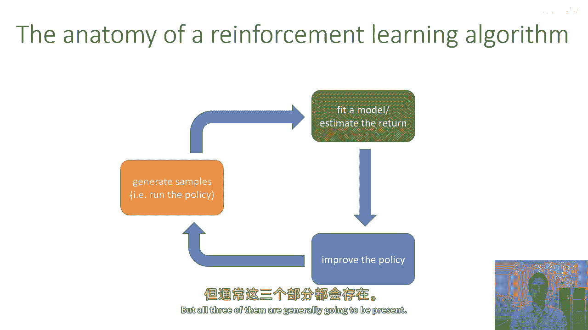
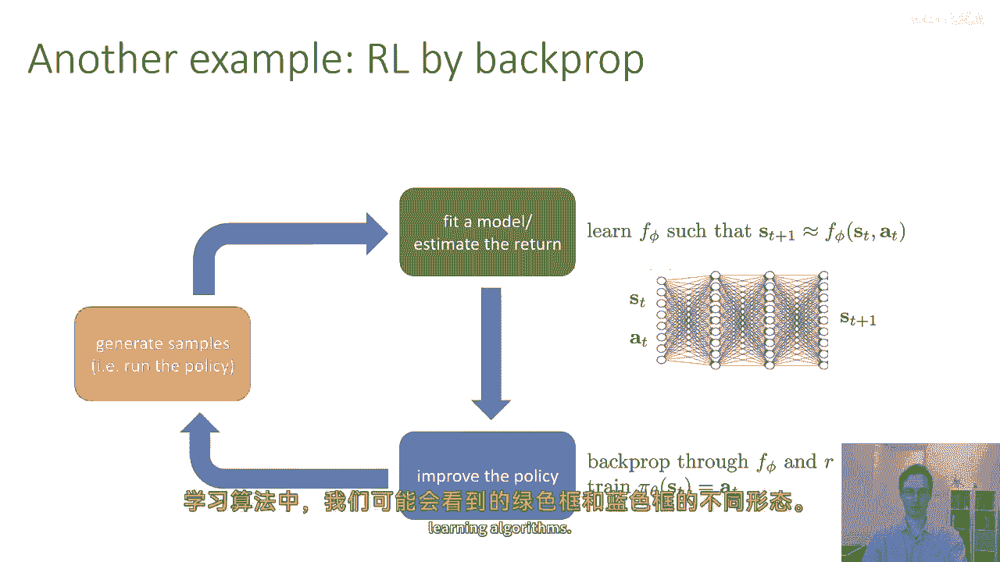

# P10：p10 CS 285： Lecture 4, Part 2 - 加加zero - BV1NjH4eYEyZ

好的，接下来，让我们开始讨论一些强化学习算法，在这个课程中，我们将覆盖许多强化学习算法，从高层次来看，所有这些算法都将共享或多或少的高层次解剖结构，它们将包括三个基本部分，第一部分，我总是用橙色画。

是生成样本，因此，强化学习是通过试错来学习的，在某种意义上和试错，试错法的试验部分意味着在实际环境中尝试运行你的策略，让它与你的马可夫决策过程交互并收集样本，什么是样本，嗯，样本是轨迹。

所以你将与你的马可夫决策过程交互，并且通常你会做什么，你将从轨迹分布中采样轨迹，通常由你的策略诱导的，尽管当我们谈论探索时，有时候，"我们可能会选择从稍微不同的路径分布中采样"。

"比我们的政策所定义的那个还要"，"但是，目前"，"让我们假设生成样本意味着从轨迹分布中采样轨迹"，"由你的政策定义"，这仅仅意味着在你的环境中运行你的政策。

这可能是基于一个基于模型的强化学习算法中动态的模型。或者它是一种更为隐含的模型，例如，价值函数，然后嗯，这个绿色盒子基本上对应于估计关于你当前政策的某些事情，关于你的政策如何表现，它表现如何。

你获得的奖励类型，它获得的，然后我们会有蓝色盒子，这是在哪里你实际上改变你的政策使它更好，然后你重复这个过程，我们即将讨论的大多数算法都将具有三部分，在某些情况下，其中的一部分可能会非常非常简单。

在某些情况下，其中的一些部分可能会非常复杂，但是，所有的三部分通常都会存在。

所以嗯，这里是一些简单的例子，嗯，假设我们，将运行我们的政策，并生成表示为黑色线的样本轨迹，然后我们会评估它们，看看它们是好是坏，所以评估就只是加总他们的奖励，加总他们的奖励就是在绿色框中发生的事情。

然后当我们改进策略时，我们可能会尝试使好的路径，使得绿色勾号更可能，和坏的路径，红色的更少可能，所以现在是改进步骤，我在这里描述的是政策梯度算法的基本高级方案，我们在下一堂课中将详细学习这一点，所以。

在政策梯度算法中，绿色框，我们估计关于政策的东西所在的盒子，嗯，我们估计关于政策的东西是非常非常简单的，它仅仅由我们采样的轨迹上奖励的总和组成，这告诉我们我们的政策有多好，所以，绿色框只是求和，嗯。

蓝色框可能涉及计算你政策的奖励梯度，然后我们将在下一堂课中讨论如何做到这一点，并将这个梯度应用到策略参数theta上，所以这是一个非常简单的试错式强化学习算法，运行你的策略，获取一些轨迹。

测量这些轨迹的好坏，然后修改策略，使更好的轨迹有更高的概率，你也可以想象进行基于模型的rl程序，你可以把这种方法看作是反向传播的rl，所以可能在绿色框中学习一个模型，你学习了一些，另一个神经网络。

存在F phi，使得s t + 1大约等于f，我初始化了s t a t，然后你训练它，F i在橙色框中生成的数据上使用监督学习，所以也许你有一个完全不同的神经网络，它从s t a t到sd + 1。

现在，这个绿色框比之前的滑块复杂得多，在之前的滑块上，我们只是求和奖励，在我们的轨迹中，实际上我们在这里正在为整个另一个神经网络拟合，求和可能需要毫秒，这可能需要几分钟来训练，或者甚至几个小时。

如果是使用图像的，然后在蓝色框中，我们可能会通过f和uh和r反向传播来训练，策略πθ，所以如果我们想要计算策略的奖励，我们可以基本上将策略与f组合，实际上使用我们的自动微分软件来计算奖励并反向传播。

通过所有这些来优化政策，我们将覆盖一些变体这种方法的方法，当我们在后续的课程中谈论基于模型的强化学习时，如果这些细节目前还不清楚，不要害怕，这个幻灯片的唯一点是解释给您不同绿色盒子的化身。

以及我们在一些非常不同的强化学习算法中可能看到的蓝色盒子。

好的现在，在这个过程中，哪些部分是昂贵的，嗯，以及哪些部分可能很便宜，橙色盒子，以时间和计算为代价，很大程度上取决于你正在解决的问题，如果你通过运行真实的世界系统来收集样本，比如真实的机器人。

真实的汽车，真实的电力网，真实的化学工厂，橙色盒子可能极其昂贵，因为必须实时收集数据，至少直到我们发明时间旅行，如果你需要数千个样本，每次迭代你的强化学习算法，这可能非常非常昂贵，另一方面。

如果你在穆焦科模拟器中收集样本，那是你们为作业一使用的所有，然后你知道佩德罗模拟器可以运行它到实时的十倍，所以橙色盒子的成本可能实际上非常微不足道，因此，取决于您处于哪个阶段或光谱上。

您可能更或较少关心橙色盒子中需要的样本数量，这将影响您选择强化学习算法的选择，因此，这可以从极其昂贵到极其便宜不等，取决于您的学习方式，绿色盒子也可能从极其便宜到极其昂贵不等。

所以如果您只是在估计政策的回报，通过汇总您获得的奖励，这非常非常便宜，它只是一个求和运算符，如果您在学习整个模型，通过训练另一个神经网络，这可能非常昂贵，它可能需要，你知道。

在强化学习算法的内部循环中进行一个大规模的监督学习运行，同样在蓝色盒子中，如果您只是取一个梯度步，这可能相对便宜，如果您需要反向传播通过您的模式和政策，如我在基于模型的幻灯片中讨论的，这可能非常昂贵。

并且会有落在光谱不同点的算法，对于不同的盒子，例如，一个Q学习算法，我们下周会讨论几个，基本上把所有的努力都花在绿色盒子上。

