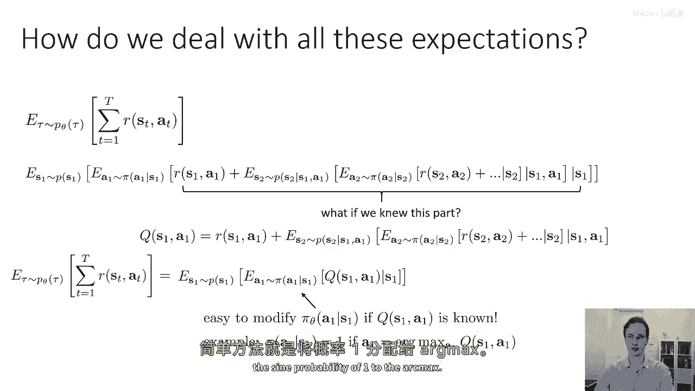
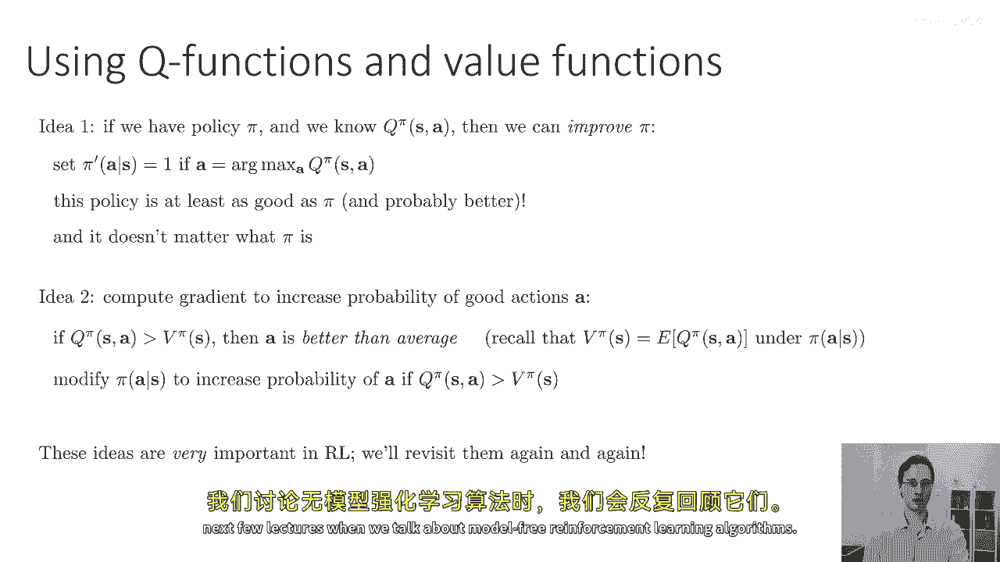
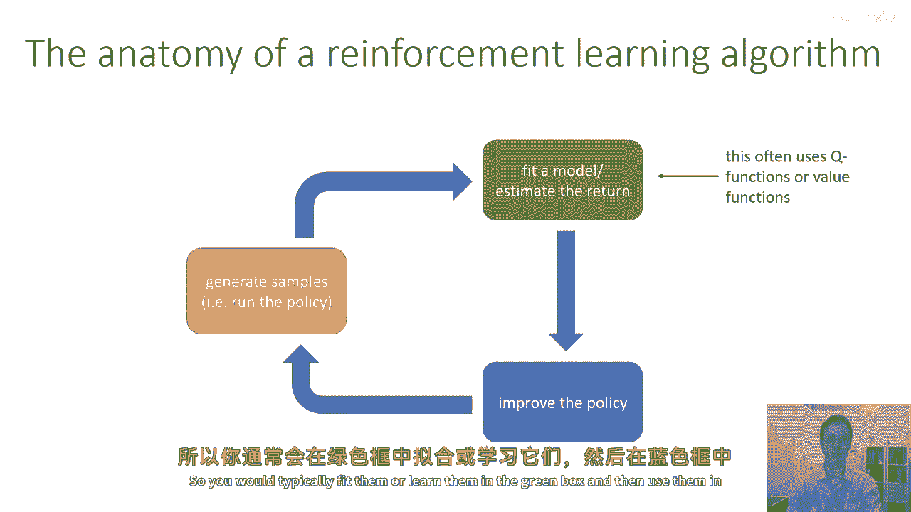
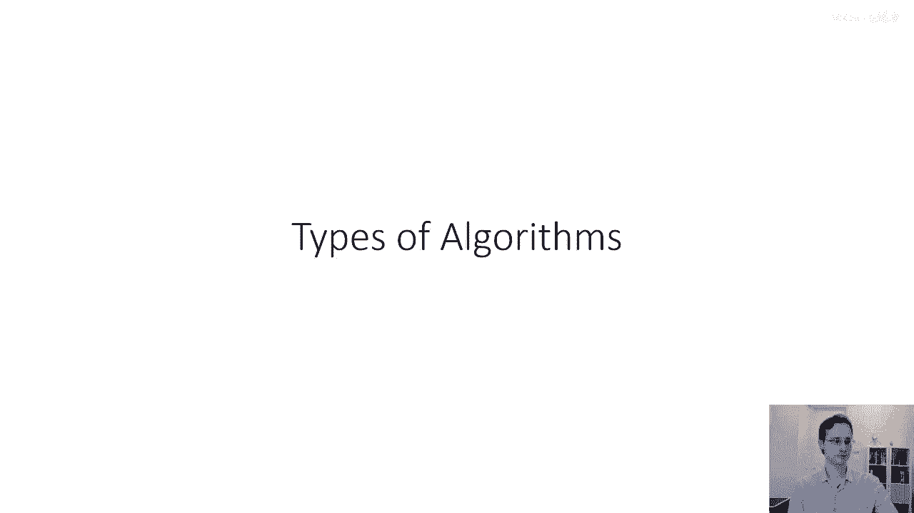

# P11：p11 CS 285： Lecture 4, Part 3 - 加加zero - BV1NjH4eYEyZ

好的，"在接下来的讲座部分中"，"我将介绍并介绍价值函数的概念。"，"哪些是在设计强化学习算法时非常有用的马克思主义对象"，"对于思考强化学习目标的概念性方式"，所以正如我之前提到的。

"强化学习的目标可以定义为一个期望值"，"这是对轨迹分布相关奖励总和的预期"，或者等价于对每个状态动作的预期奖励的时域求和，"边缘的"，现在，我们可以用这一概念做很多事情，实际上，我们可以递归地写出它。

所以你知道我们如何将概率链规则应用于轨迹分布的因子化，作为许多分布的乘积，同样地，我们可以应用概率链规则并写出与该分布相关的期望值，作为一系列嵌套的期望值，所以。

这里最外面的期望值将是对p(s1)的期望，在它的内部，我们有一个关于s1按照pi(a1|s1)分布的期望值，现在既然我们对s one和a one都有期待，我们可以输入第一个奖励。

R of s one comma a one并注意到这个内部期待，a one上的期望依赖于s one，我在这里有一些空白，因为我需要输入所有其他奖励，但我们已经有了r of s one a one。

现在我们将所有其他奖励添加到那，但这些需要输入另一个期待，现在关于s two的分布式查询给定s one a one，因此，这个期望依赖于s1和a1，"并且在那个里面。

我们对一个按照给定圆周率的二分分布还有一个期望。"，"S两"，"现在我们都有两个二"，"我们可以将s的值设置为r的两倍"，"一个二"，"然后，我们将对s的三个期望值进行添加"。

其中包含对未来三期的预期值，"在它里面是3个s"，"三加三再加三，无穷无尽"，而且我们有这些嵌套的期望，现在，一开始，它好像只是写了一个非常简洁的轨迹期望值，作为一个非常混乱的嵌套期望集，但是嗯。

我们可以考虑的一件事是嗯，如果我们有一些，一些函数，告诉我们里面的东西，第二个期望里面的东西，如果我们有一些函数，告诉我们r of s一加逗号a一，再加上在s的两个期望值加上等等等等等等。

那么如果我们知道这一部分，那么让我们，为这一部分定义一个符号，让我们说q of s one comma a one，等于r of s one comma a one，再加上对s二的期望值。

对a二的期望值对r of s two a two的期望值的期望值等等，所以基本上就是这一部分，进入第二个方括号的部分，我就把那个q of s叫做一个逗号一个a。

然后我们可以简单地把我们的原始rl目标写成对于一个逗号一个s的期望值，对于一个逗号一个a的期望值对于一个逗号一个s一个的q，逗号一个a，所以这只是一点符号的操纵，一点定义。

但这一点定义关于这个定义的重要之处是，如果你知道一个逗号一个s一个逗号一个a，那么优化在第一步的政策将会非常容易，所以如果你有访问一个逗号一个s一个逗号一个a的能力。

并且你需要根据一个逗号一个s选择一个政策pi一个给定一个逗号一个s，你只需要选择预期值最大的政策，你可以简单地测试每个动作，并仅将最优的一个分配百分之百的概率，具有最大q值的一个，所以。

这个基本概念可以扩展到一个更一般的概念，所以，这就是我说过的简单规则，你知道，在这里获取π的一个简单方法是仅将弧最大分配概率为一。

所以，我们即将要叫的这个更一般的原则是q函数，所以，q函数可以在其他时间步定义，不仅仅是时间步一，并且定义是这样的，q π of s t，逗号 a t。我说 q π 因为它依赖于 π。

Q π of s t。逗号 a t 等于对所有时间步长从 t 直到结束的求和。期望奖励的大写的 t 的值。在那个未来时间步长，条件于开始时在 st，逗号 a t。所以这意味着基本上如果你开始一个 sd。

逗号 a t，然后然后推出你的策略，剩下的时间将是奖励期望的总和。我们也可以定义一个与这个密切相关的量，叫做价值函数，价值函数被定义为大致相同的方式，只不过它是一个状态，而不是一个在行动中的状态。

所以价值函数说如果你从状态st开始，然后按照你的策略滚动，你预期的总价值将是什么，价值函数也可以写成对q函数的行动期望值，因为如果q函数告诉你他们预期总奖励，如果你从st，a开始。

然后以a t为条件对其期望，会给你开始从st时预期的总奖励，所以现在我们可以观察到的一个观察是状态st处的价值函数期望，如果一个是强化学习的目标，那么它就是整个目标的全部。

与s one相关的期望值就是q的一个值，在上一滑片中，s one a one是强化学习的目标，好的，所以到现在，我希望大家暂停一分钟，并思考这些q函数和价值函数的定义，你可能想要翻回去看上一张滑片。

如果这里有不清楚的地方，花一点时间来思考那个，嗯，如果对这些定义有任何不清楚的地方，请在评论中写下问题，好的，让我们继续，所以，q函数和价值函数是什么，对于好的事情很有用。

我在前几页提供了对这个的一些直觉，当我谈论到你至少为第一步有一个q函数时，你可以恢复出第一步的更好策略，所以有一个想法是，如果我们有一个策略π，并且如果我们能够找出它的完整Q函数，Qπ(s， a)。

那么我们就可以改进π，例如，我们可以选择一个新的策略π'，它为给定的动作分配概率1，如果这个动作是qπ(s， a)的弧度最大值，而且我们可以这样做不仅限于第一个时间步，但在所有时间步，实际上。

我们可以证明这项政策至少与π一样好，可能更好，不要担心，如果这不是，如果你现在无法立即看出，为什么这是真的，我们将在后续的详细讨论中覆盖这一点，但这是一类被称为策略迭代算法的方法的基础。

它们本身可以用于导出Q学习算法，而且关键地，π是什么并不重要，你可以这样改进它，在下一讲当我们讨论策略梯度时，我们将使用这个想法，你可以使用这个来计算增加好动作a概率的梯度，所以，直觉是。

如果q pi s a大于v of s，那么a比平均值好，因为记住，v pi of s只是q pi s在pi下的平均值，A在pi下给定s的情况，根据这个定义。

V pi of s是你从状态s使用你的策略时平均表现的方式，所以，如果你能比平均值做得更好，如果你可以选择行动a，这样q pi s a就会比v pi of s大，那么你就会做得更好，在你的旧政策下。

你将比平均水平做得更好，所以你可以做的事情之一，你可以修改给定s的pi，以增加行动的概率，其价值在q函数下大于在该状态下的值，你可以实际上使用这个来获取基于梯度的更新规则pi，这些想法在rl中非常重要。

在接下来的几堂课中，我们将一次又一次地回顾它们，当我们谈论无模型强化学习算法时。

好的，嗯，所以强化学习算法的解剖结构中，绿色盒子通常是你将使用u的地方，或者你将学习q函数或价值函数，q函数和价值函数本质上是评估你当前政策有多好的对象，所以你通常会在那里拟合它们或学习它们。

