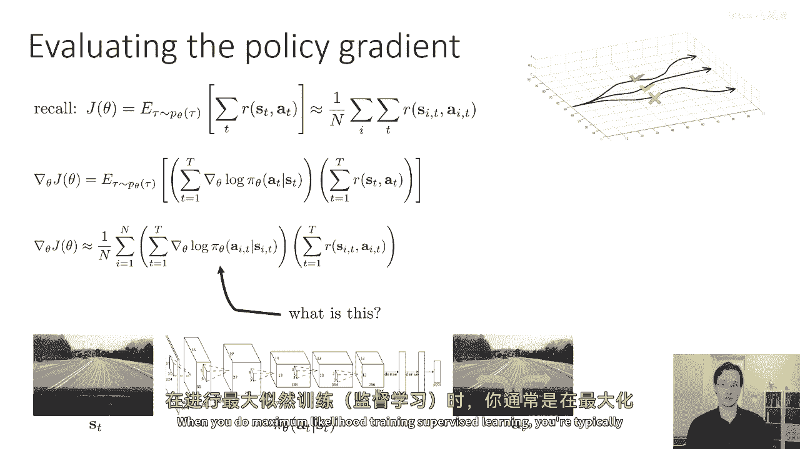
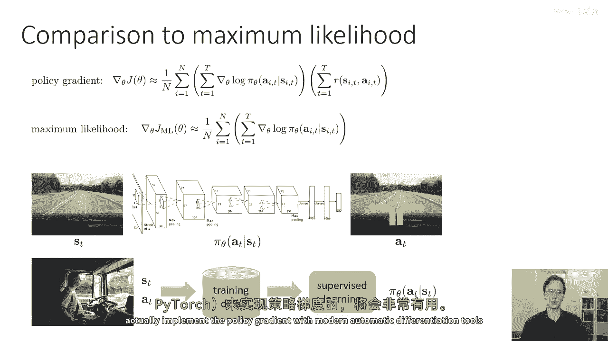
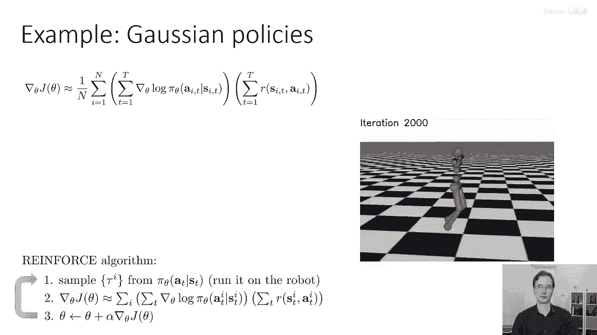
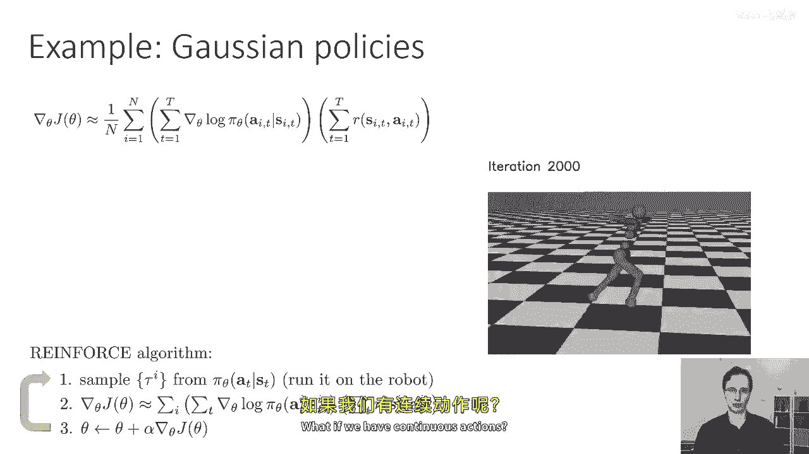
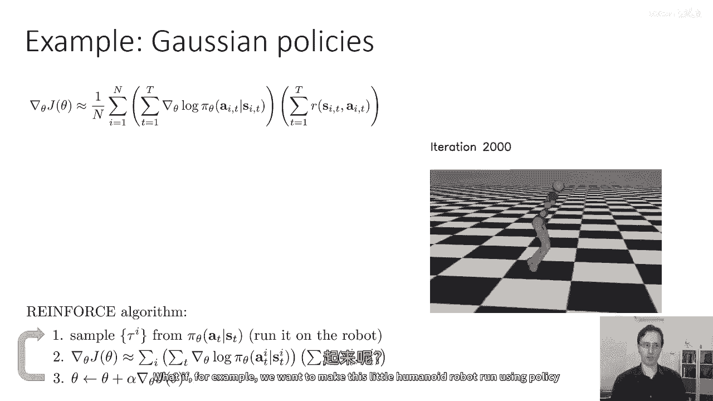
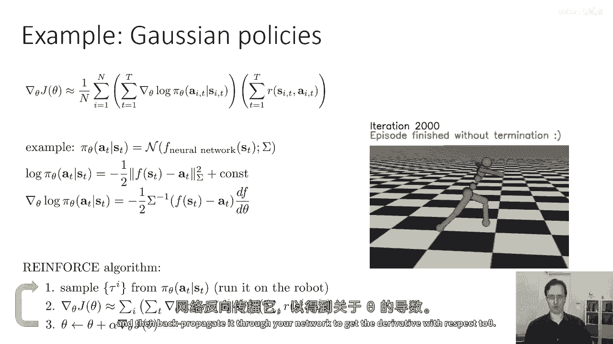
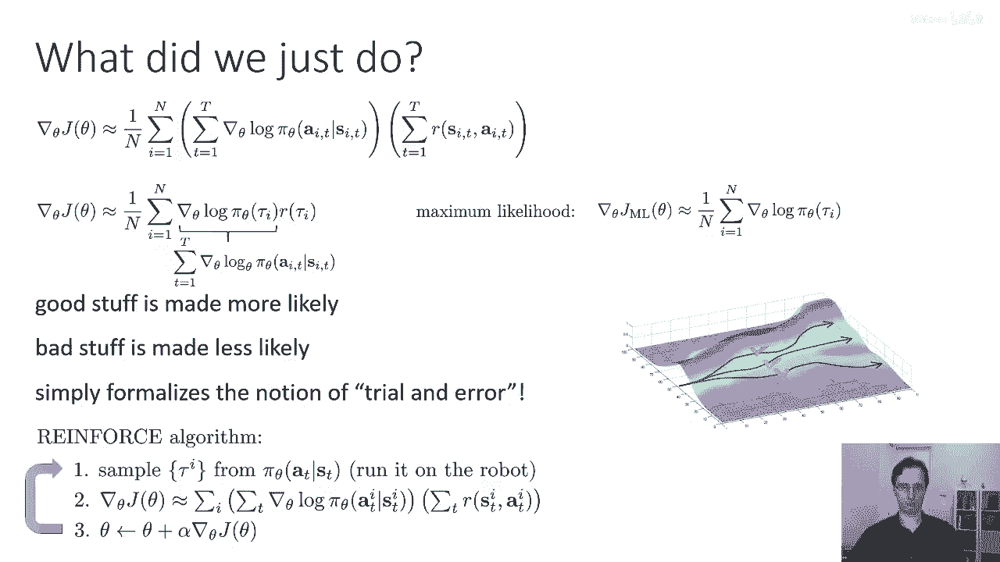
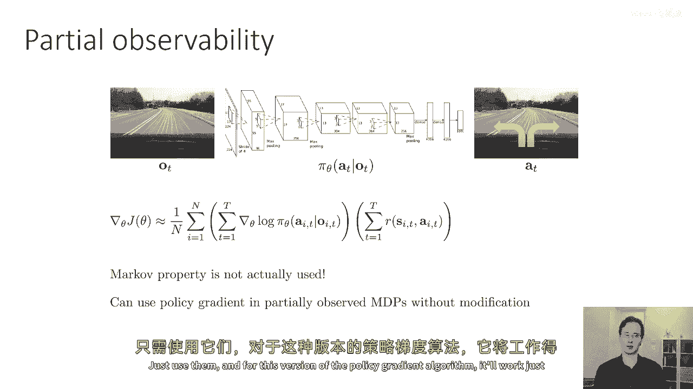
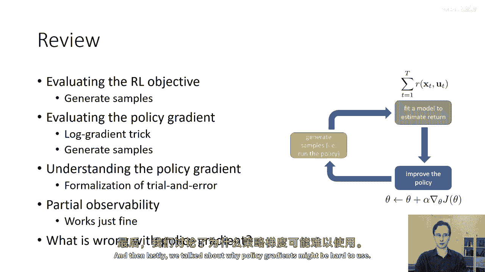

# P16：p16 CS 285： Lecture 5, Part 2 - 加加zero - BV1NjH4eYEyZ

现在，我们已经覆盖了政策梯度的数学推导，让我们花一点时间来发展一些直觉，政策梯度实际上在做什么，所以这是我们之前看到的方程，我们有J theta的近似表达式的导数，这是一个对所有样本的求和。

沿着样本轨迹的grad log p的求和乘以，那个轨迹的总奖励，grad log pi这个东西实际上是什么，哦，嗯，让我们假设我们的政策目前只是一个离散的，让我们假设它只是一个从图像到离散动作的映射。

也许这些是驾驶图像到离散动作的，然后log pi只是政策分配给这两个动作之一的log概率，然后log pi的梯度是该log概率的导数，所以神经网络将输出这些概率，当你进行最大似然训练时。

你可以取那个概率的对数，并且神经网络将输出这些概率，并且当你进行最大似然训练时，你可以取那个概率的对数，监督学习，你通常在最大化观察到的标签的日志概率。

所以，有指导性，也许为了比较政策梯度在做什么与最大似然在做什么，在最大似然，就像在模仿学习中，例如，我们将收集一些人类选择动作的数据，然后，我们将在 that 数据上运行监督学习。

那就是会给出一个给定状态st的政策πθat，最大似然目标，或者监督学习目标，就是最大化分配给观察行动的对数概率，所以那个的梯度由所有你的样本和时间的和给出，现在，给定状态si和时刻ti。

grad log πait的梯度是，当然，当我们做最大似然时，我们假设在我们的数据中的动作ait是按照政策梯度采取的好动作，这并不是必然的因为我们是通过运行我们自己之前的政策来生成那些动作的。

这可能并不是很好，所以最大似然梯度的简单增加所有动作的日志概率，而策略梯度可能会根据它们奖励值的值增加或减少它们，所以直觉上，高奖励轨迹的日志概率会增加，低奖励轨迹的日志概率会减少。

所以你可以认为它是一种权重的梯度版本，对于最大似然目标，实际上，这个解释在实施策略梯度时将会非常有用，使用像PyTorch这样的现代自动微分工具，我们可以实现政策梯度方法。

现在，让我们来看一个包含离散动作的例子。如果我们有连续动作呢？

假设，例如，我们想要使用这个小型人型机器人使用政策梯度方法行走。

那么，在这种情况下，我们需要选择一种表示π的形式，它可以输出对连续值动作的分布。例如，我们可能会表示πθat作为多维正态分布。或者高斯分布，其中均值由神经网络给出。所以，神经网络输出均值，然后。

你有一些方差，这可能是被学习到的还是固定的，然后，你想要训练这个神经网络，在这种情况下，你可以写日志概率，因为你知道，基本上使用多维正态分布的日志概率公式，这仅仅是均值和动作下协方差之差，逆协方差矩阵。

所以，这是一种写多维正态分布日志概率的方式，然后，你可以计算这个东西关于均值的导数，你只是得到这个方程，所以，你的多维正态的导数只是负一半时，逆协方差乘以ft-at乘以dft/dθ，在实际中。

你计算这个量的方法是，你计算负一半sigma的逆t-at，然后，通过网络反向传播来获取关于θ的导数。

好的，这可能给我们一些关于这些grad log π项实际上在做什么的直觉，无论是在离散动作还是连续动作的情况下，在两种情况下，它们都对应于一种加权版本的最大似然梯度，如果你觉得这样想有帮助。

你可以通过基本上，使用你选择的分布类的日志概率公式来计算它们，政策梯度实际上在做什么，嗯，我会收集一些术语，并使用稍微更简洁的符号来使它更清楚，你可以等价地写为grad log πθτ乘以rτ。

并且这个grad log πθτ是sum over individual grad log πθτ的，嗯，最大似然梯度在这里给出，所以，它是相同的，只是没有r项，所以，直觉上。

这意味着如果你滚动出一些轨迹，并计算它们的奖励，一些有巨大的正奖励，表示为绿色的检查标记，一些有巨大的负奖励，表示为红色的叉，还有一些是中性的，就像那个中间的，你想要做的事情是。

你想要沿着好的路径取对数概率，并将它们升高，并沿着坏的路径取对数概率，并将它们降低，所以政策梯度使好的东西更有可能，使坏的东西更不可能，所以从某种意义上说，你可以把政策梯度看作是一种对试错学习的正式化。

如果强化学习指的是通过试错学习，那么政策梯度只是 formalize 这个概念为一种梯度下降算法。

现在我想简要提及下一个是关于部分可观察性的短插曲，所以如果我们想要学习依赖于观察而不是状态的策略，主要的区别在于，状态满足马尔科夫性质，而一般观察值不满足，正如我们所知，一般的观察值并不满足，作为提醒。

马尔科夫性质仅仅意味着未来的状态条件上独立于过去的状态，给定当前状态，状态满足这个，而一般的观察值并不满足，现在，有趣的是，当我们推导策略梯度时，在任何一点，我们实际上并没有使用马尔科夫性质，这意味着。

如果你想要推导部分可观察系统的策略梯度，你可以这样做，你现在将为部分观察的系统得到相同的方程，现在的轨迹分布将是一个状态分布，动作和观察，并且你必须边缘化出状态，所以对于这个的推导稍微有些复杂。

但你可以在家做，然而，如果你遵循那个推导，你将得到与我们之前得到的相同的方程，只是s's将被替换为，这意思是你可以在部分可观察的马尔科夫决策过程（MDPs）中使用政策梯度，没有任何修改，只需要使用它们。

对于这版本的政策梯度算法，只要常规政策梯度工作，它就能正常工作。

好的，我之前说过，也许政策梯度，按照我所描述的那样，不一定能工作得很好，如果你实际上尝试实现它们，那么，政策梯度有什么不对吗？嗯，嗯，我们来看一个例子，嗯，我们可以考虑的一个问题是。

假设这里的横轴表示轨迹，我知道轨迹一般来说不是一维的，但是让我们假装它是，而纵轴代表奖励，所以这里我们有一个奖励，它大致是这个钟形曲线的形状，这里有一个峰值，让我们假设我们有三个样本。

并且这里的条形图的高度，嗯代表嗯，这些样本的奖励，所以蓝色曲线显示政策下的概率，这就是钟形曲线，绿色条形图显示奖励，所以我在这里道歉，y轴实际上有些过度加载，它显示奖励和概率，蓝色的东西是概率。

它总是积极的，绿色的东西是奖励，它可能积极或消极，好的，所以有了这三个样本，我们现在可以想象当我们计算政策梯度时，蓝色的政策分布将如何移动，轨迹分布将如何移动，所以花一点时间来思考这个问题。

现在政策梯度，你可以把它想成基本上是加权最大似然梯度，所以我们将取这些三个点，并计算每个点处的log pi，然后我们将其乘以奖励的值，左边的样本有一个非常负的奖励，所以我们将尝试减少那里的log概率。

右边的两个样本有小但积极的奖励，所以它们会稍微增加它们的概率，这意味着政策分布将向右移动，它将主要尝试避免那个很大的负样本，我们现在知道如果我们在mdp中取奖励函数，并偏移一个常数。

意味着我们在所有地方都添加相同的常数，结果最优的政策不会改变，对吧，这是因为如果你有一个最大化问题，让我们说你在最大化f(x)，f(x)的最大值是一样的，即使你有一个常数，所以f(x)的最大值是相同的。

作为f(x)加上一百，这是同样的f(x)加上一千，所以让我们给奖励添加常数，所以让我们说奖励现在是由这些条形图给出的，现在相对奖励完全相同，所以右边的样本仍然比左边的样本好，但现在我给它们添加了成本。

所以它们都是积极的，现在花一点时间来想象当我们使用这些奖励时，政策将如何改变，使用这些奖励，当然，政策想要增加所有三个样本的日志概率，尽管它想要增加右边的样本稍微更多，所以可能政策会改变成这样。

你现在可以想象更多的病理性奖励变化，如果我，例如，改变奖励使得右边的两个样本实际上全部去零，或者左边的样本去零，这个问题实际上是高方差情况的一个实例，本质上，我们之前描述的政策梯度估计具有非常高的方差。

从你获得的样本来看，随机地，你可能最终会得到不同的值的政策梯度，对于任何有限的样本大小，你可能会得到非常不同的政策梯度值，当样本数量趋向无穷大时，政策梯度估计器总会给出正确的答案，因此。

将常数添加到奖励中不会使任何问题，但对于有限的样本大小，它们会，这使得政策梯度非常难以使用，这意味着在实际应用中，为了使政策梯度成为强化学习的有效工具，我们必须以某种方式降低这种非常高的方差，而且。

政策梯度算法的大部分进步基本上围绕着不同的方法，来减少他们的方差，我们今天的讲座将覆盖一些这些，所以你可以想象这个问题的一个更病理学的版本，如果一些样本的奖励为零，那么他们的梯度基本上一点也不重要。

总的来说，随着样本数量的增加，这个问题并没有完全消失，但是，最终它被大大缓解了，所以，让我们回顾一下我们已经覆盖的内容，我们讨论了使用样本评估rl目标，我们讨论了评估政策梯度，在这里。

我们必须使用这个对数梯度技巧来去除我们不知道的术语，即初始状态概率和转移概率，然后，我们可以再次使用样本评估政策梯度，我们讨论了如何我们能更好地理解政策梯度，直觉上，通过把它视为正式化的。

将试错学习正式化为一个梯度下降算法，我们简要讨论了政策梯度如何也能处理部分可观察性，然后最后我们讨论了为什么政策梯度可能难以使用。

所以讲座的下一部分。

