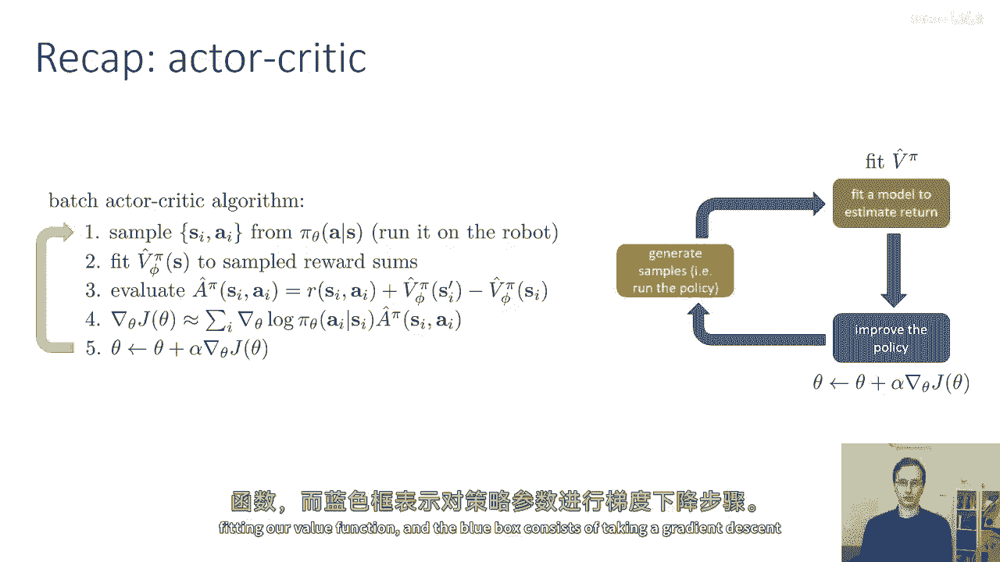
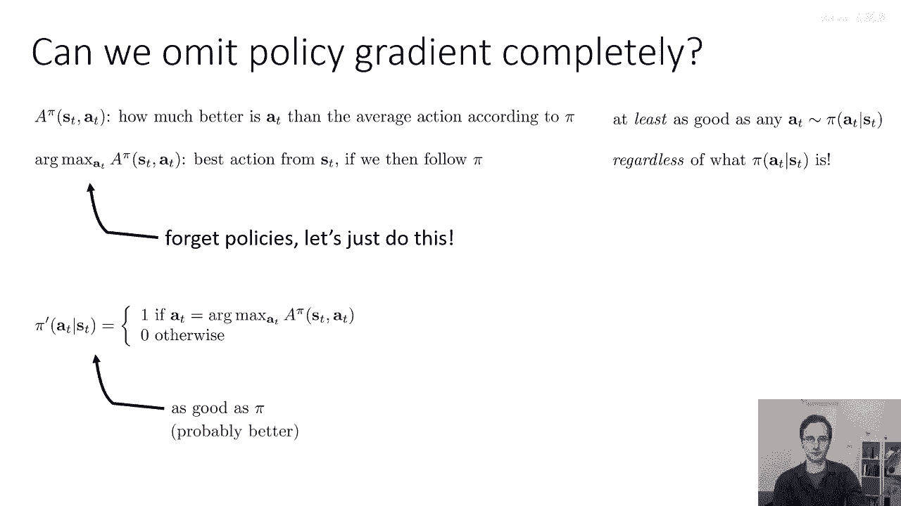
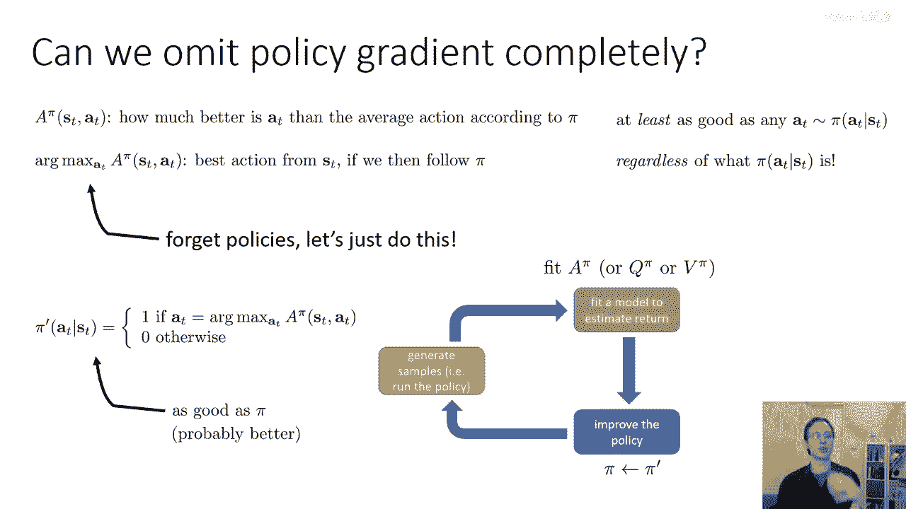
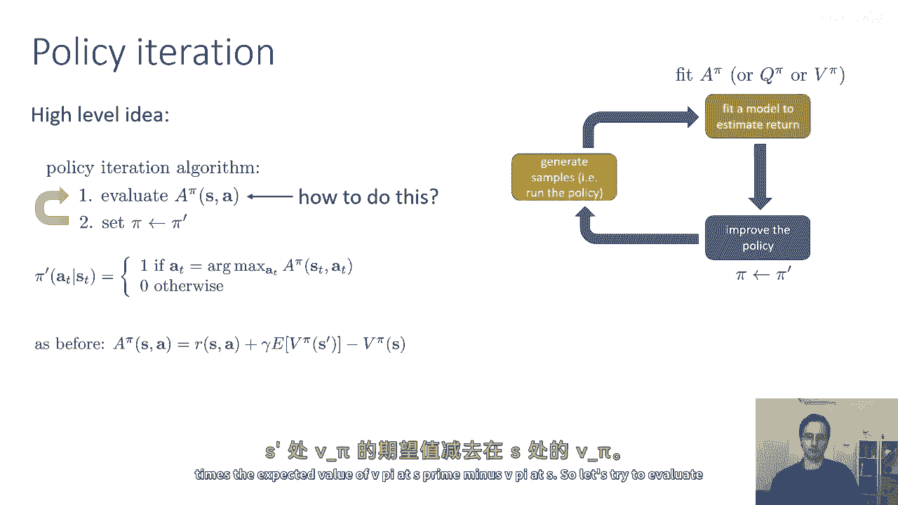
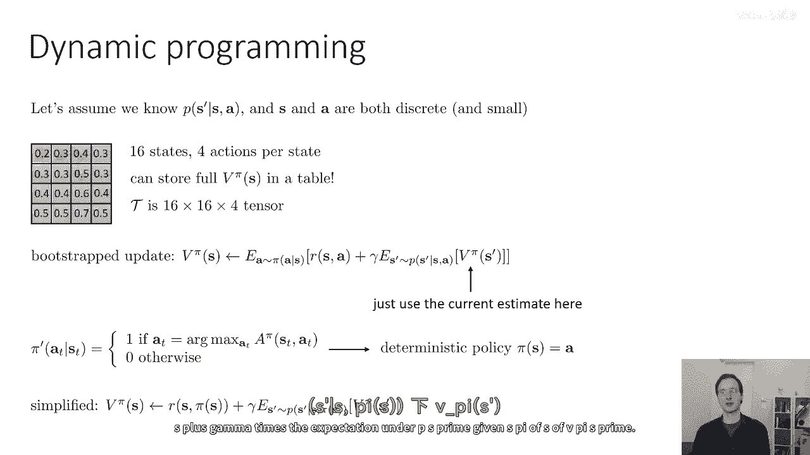
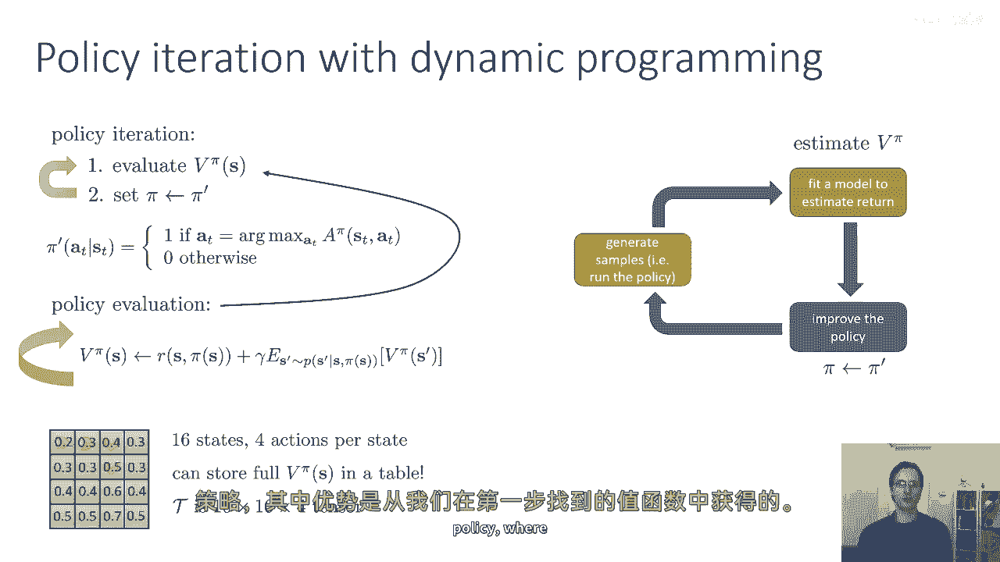
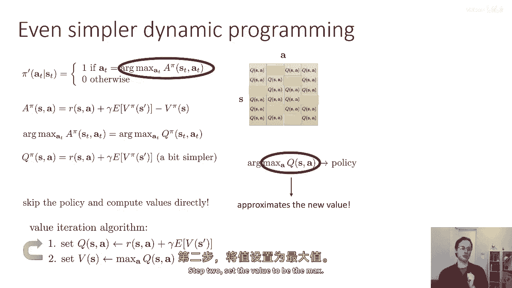
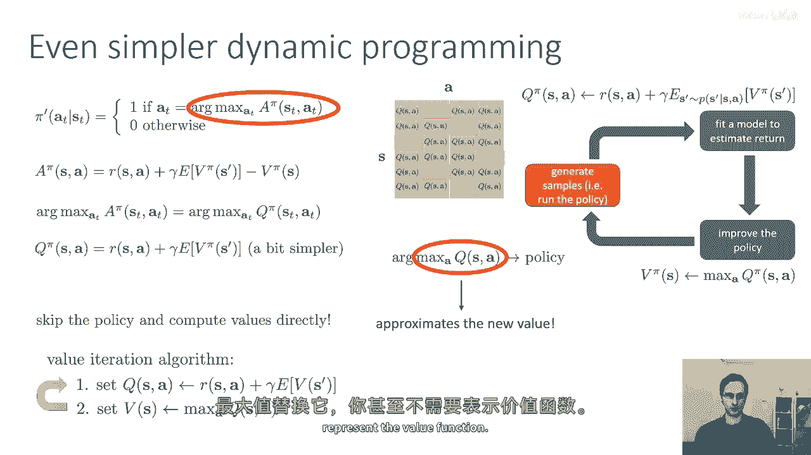
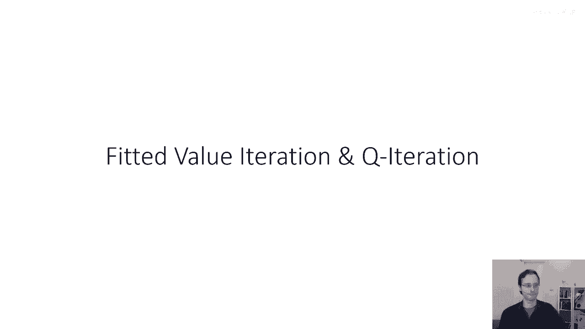

# P26：p26 CS 285： Lecture 7, Part 1 - 加加zero - BV1NjH4eYEyZ

好的，欢迎参加今天的cs two eighty五第七堂课，我们将讨论价值函数方法。

当我们讨论演员批评算法时，首先看到了使用价值函数的算法，为了回顾基本的批处理模式，我们讨论的演员批评算法将政策评估算法扩展到引入价值函数，在上一堂课中我们覆盖的演员批评算法中。

我们将通过运行政策在机器人上生成一些样本来生成我们的当前政策，我们将对这些样本拟合一个价值函数，这是一个神经网络，在之前的课堂上，这个映射将状态映射到标量值。

然后我们将使用那个价值函数来估计每个状态动作的优势，我们采样的元组si ai，我们通过取当前奖励加上下一个价值减去当前价值来生成这些优势估计，我们还可以在下一个价值前面插入一个折扣因子，那就是第三条线。

然后然后我们将使用这些估计的优势来估计第四行的政策梯度，使用我们在前一堂课中学到的同一政策梯度公式，然后我们将对政策参数进行梯度下降，所以嗯，在这个方案中，它再次遵循我们讨论过的强化学习算法的常规食谱。

所以橙色的盒子包含生成样本，绿色的盒子包含拟合我们的价值函数，并且蓝色的盒子包含在政策参数上执行梯度下降步骤。

我们可以否完全省略政策评分，如果我们只学习价值函数，然后尝试使用那个价值函数来确定如何行动，这种应该可能的直觉，是价值函数告诉我们哪些状态比其他状态好，所以如果我们仅仅选择进入大的状态的行动。

更好的状态，也许我们不再需要一个明确的，嗯，策略神经网络了，所以这里是使用这种直觉更加正式的方法，π状态是我们的优势，这是我们的q值和我们的值之间的差异，直觉上，优势说一个t比平均动作有多好。

根据策略π，其中π是我们计算这个优势的策略，所以然后对于a的arg max是一个π，"如果我们遵循π之后，'状态'就是我们可以采取的最佳行动"，这意味着相对于a，优势的arg max。

"至少将与我们曾经采样的行动一样好"，"从我们的当前政策"，我们知道至少因为它实际上是最好的，所以，如果是从最佳行动中，如果我们然后跟随π，那么，至少和派选择的任何行动一样好，"有趣的是。

无论派实际上等于多少，这个都是真实的。"，所以这就意味着这个嗯，arg max应该立即告诉我们，无论我们以前有什么政策，即使它是一个非常糟糕的随机政策，我们应当能够通过选择动作来改善它。

根据优势的arg max，所以也许我们可以忘记明确表示政策，我们可以只使用arc max来选择我们的动作，这就是价值基于方法的基础，所以我们将隐式构建新的政策，所以每次迭代，我们可以构建一个新的政策。

π'是一个将动作a在时间t的概率分配为1的π函数，如果它是优势的最大值，一个π's t a t，其中π是前一个隐含政策的优势，关键地，我们不需要另一个神经网络来代表这个政策。

这个政策被隐式地表示为这个r max，所以，我们实际上只需要学习优势，然后，我们将，当然，重新估计π'的优势函数，然后构建一个新的政策，它是相对于那个的arg max。

所以每次我们创建隐含的pi prime，我们知道那至少与pi一样好，在大多数情况下更好。

我们仍然有一个具有常规三个盒子的算法，在哪里橙色盒子中我们生成了样本，在绿色盒子中，我们将拟合某种价值函数，要么是q pi，要么是v pi，我们将使用它来估计优势，然后，在蓝色盒子中。

而不是在显式的策略上执行梯度上升步骤，我们将构建这个隐式策略作为弧度最大，所以蓝色框中不再发生实际的学习，只是设置策略为这个弧度最大策略。

所以这就是被称为策略迭代的高级想法，所以在策略迭代中，第一步是评估你当前策略pi的优点，然后第二步是构建一个新的策略，它将是这个pi prime，其中pi prime以概率一采取行动。

如果它是优点的弧度最大，然后，我们交替执行这两步，这叫做策略迭代，因为我们在步骤一迭代评估策略，并在步骤二更新策略，所以，步骤二如果我们，特别是如果我们有一个离散动作空间，计算弧最大。

是 something that is not hard to do by simply checking the advantage value of every possible action。

如果你有连续值动作，事情会变得稍微复杂，我们将在随后的讲座中覆盖这个案例，但是，让我们暂时假设我们已经有了离散动作，大谜团实际上是如何做第一步的，如何评估特定状态动作的π优势，给定前一个策略π的元组。

这也将是一个隐含的策略，但我们现在不太关心那个，所以像以前，我们可以表达优势，πs a等于奖励s a加上γ乘以，在s'处的vπ的预期值减去在s处的vπ。

所以让我们尝试评估vπ在s处的值，一种评估vπ在s处的方法，为了然后估计这些优势以进行策略迭代，我们可以使用动态规划，所以目前让我们假设我们知道给定s a的s'的概率p(s'|s a)。

让我们假设我们知道转移概率，并且进一步假设s和a都是小的、离散的，所以这是大致的动态设置，这不是我们在模型自由RL中通常操作的设置，但我们会假设那是我们的设置现在。

只是为了我们能够导出简单的动态规划算法，然后将其转换为模型自由的算法 later，所以如果我们有一个小而离散的s和a，我们可以想象我们可以基本上枚举我们的整个状态和动作空间，我们可以用它来表示一个表。

例如，你可能有这个网格世界，在这个网格世界中，你的行动对应于向左、向右、向上和向下的步骤，所以这里你有十六个状态，在每个状态中你有四个动作，向左、向右、向上和向下的动作，在这种小的状态空间中。

你可以实际上存储整个价值函数vπ在一个表中 right，你可以实际上构造一个包含十六个数字的表，并写下vπ对于每个这十六个数字的值，你不需要神经网络来做这个。

所以这里在这里是一个可能的包含十六个成员的表，而你的转移概率t是由一个十六乘以十六乘以四个张量表示的，当我们说我们做表式强化学习或表式动态规划时，我们实际上是在谈论一种像这样的设置，现在。

我们可以写下在讲座六中看到的价值函数的自回归更新，以这些明确的概率来表述，如果我们想要更新vπ在s处的值，我们可以将其设置为预期的值，与从策略π采样的动作a相关的奖励。

s a加上γ乘以在s'处的vπ的预期值，从给定s a的s'处的p(s'|s a)采样的vπ s'，如果你有一个表式MDP，意味着你有，你有一个较小的离散状态空间，并且你知道转移概率。

这个备份可以精确计算，所以，每个预期的值都可以通过对所有该随机变量值的求和来计算，并乘以括号内的值乘以其概率，然后，当然，我们需要知道v pi s prime。

所以我们只是简单地使用我们对该值的当前估计值函数，我们将从表中获取那个数字，然后，当我们用这种方式计算价值函数v π时，然后，我们可以构建一个更好的策略π'，如我之前提到的，通过为动作分配概率1。

那就是我们从这个价值函数中获得的优势的最大值，这也意味着我们的策略将是确定性的，所以，相对于π的期望值将很容易计算，所以，我们可以通过删除相对于π的期望来简化我们的自回归更新。

并直接插入唯一有非零概率的行动，那么，我们就得到了简化的备份，其中s的v'被设置为s的r，逗号，s的π加上γ乘以，在p's prime条件下，给定s的π，s's prime的期望值。

好的，所以现在我们可以将这个程序插入到我们的政策迭代算法中，作为提醒，我们的政策迭代算法，第一步是评估我们的优势，我们可以从价值函数中获得，所以，第一步实际上是评估价值函数，然后。

第二步将你的新政策设置为通过这个arg max获得的π'政策，然后重复，所以这就是我们之前有过的政策迭代算法，我们现在要学习的是价值函数，目前我们将其表示为表格形式，作为一个包含十六个数字的表。

如果你有十六个状态，所以策略评估是步骤一的内容，我们可以通过反复应用递归来执行策略评估，通过反复为每个状态设置价值，对于我们表中的每个条目，使其成为那个状态的奖励，再加上下一个状态的值期望值。

然后我们只是重复这个过程多次，你可以证明重复这个递归最终会收敛到一个固定点，并且这个固定点是真正的值函数v pi，对于数学功底稍微深厚的人来说。

我还会指出如果你写v pi of s等于r of s i s，再加上这个期望实际上代表了描述值函数v pi的系统线性方程，然后系统线性方程就可以用任何线性方程求解器来解决。

所以可以作为一个作业来理解这个，稍微深入理解一些是实际上写下系统线性方程并计算出其解，这做起来相当直接，但是，确保你真正理解动态规划和策略评估是一个良好的练习，好的，所以我们有了我们的表格型mdp。

十六个状态，每个状态有四个动作，我们可以在一个表中存储完整的价值函数，我们可以使用策略评估来计算价值函数，通过反复使用这个递归，我们在我们的策略迭代程序的内部循环中进行此操作。

它只是交替进行策略评估和更新策略，成为这种arg max策略，在步骤一中我们找到的价值函数的优势中获取优势。

现在，有一个甚至更简单的动态规划过程，嗯，你可以设计一种短路类型的策略，这种策略迭代，过程，所以来看这个，让我们来看看以下我们需要的步骤，所以首先注意，我们在优势函数中取arg max，当你计算策略时。

优势是奖励加上预期的下一个值，减去当前值，如果你去掉了减去v pi s的项，你只是得到q函数，因为你是以a为参数的arg max，任何不依赖于a的项实际上不会影响arc max。

所以优势的arg max实际上等于q函数的arg max，所以我们可以等价地写新的策略为q的arg max，这稍微简单因为我们去掉了一个项。

嗯，我们可以这样思考这个问题，图形上，q函数是一个包含每个状态和每个动作一个入口的表格，所以这里有不同的行或状态和不同的列或动作，当我们计算arg max时，我们实际上是在每行中找到值最大的入口。

然后我们选择对应的索引作为我们的策略，当我们后来去实际评估那个策略时，我们将那个索引插回q函数中以获取其值，所以arg max给我们提供了策略，但是，最大值实际上给我们提供了那个政策的新值。

所以我们可以做的就是我们可以短路这个，我们可以实际上跳过这一步骤，我们在哪里恢复索引，就直接取值，所以我们可以跳过政策，直接计算值，这给我们带来了一个新的算法，被称为值迭代，在步骤一中，我们设置q值。

基本上，这个表中的s条目被设置为奖励，加上下一个时间步的价值函数预期的值，然后在步骤二，我们将价值函数设置为在这个q函数表中的最大值，所以我们基本上取q函数表中的每一行。

并选择其中的最大值作为该状态的值，所以这里明确政策计算被跳过，我们永远不会实际呈现政策，但你可以认为它在第二步中出现了，因为将值设置为所有动作的最大值，嗯，在q值表中设置值等于弧度最大值相当于。

然后将弧度最大值的索引插入表来恢复值，但由于取弧度最大值，然后，将插头插入表格与仅仅取最大值相同，我们可以基本上跳过这一步骤，得到该程序，所以，第一步是通过将其设置为奖励来构建你的q值表。

加上下一次时间步的预期值，第二步，将值设置为最大。

因此，这产生了，嗯，稍作修改和简化的程序，其中在绿色框中构建你的q值表，在蓝色框中，通过取最大值构建价值函数，现在，如果这个步骤二你真的执行并插入到步骤一，那么这个程序甚至可以进一步简化，所以你会发现。

s中的v只在一个地方出现，那就是步骤一中的那个期望，所以如果你仅仅将这个替换为一个对q中的a的最大值，S a，甚至你不需要代表价值函数。

