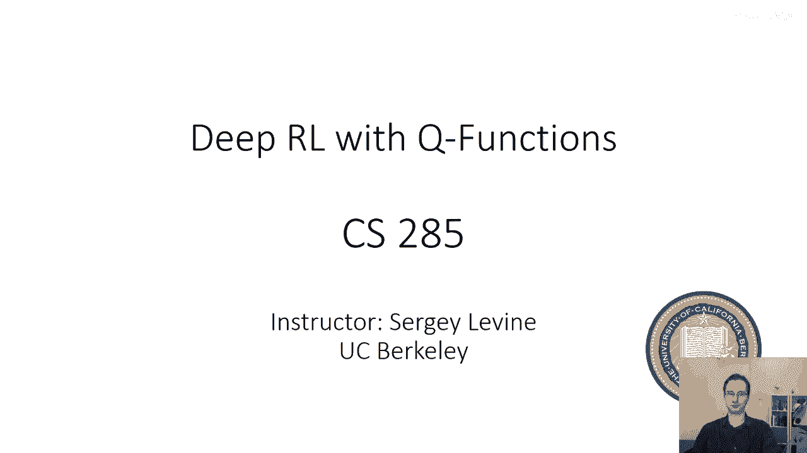
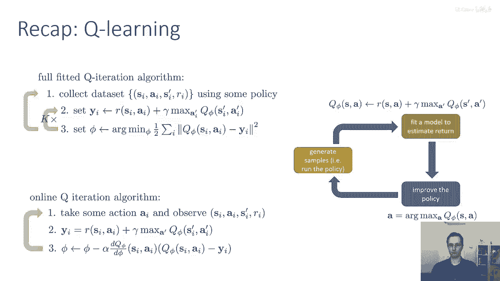
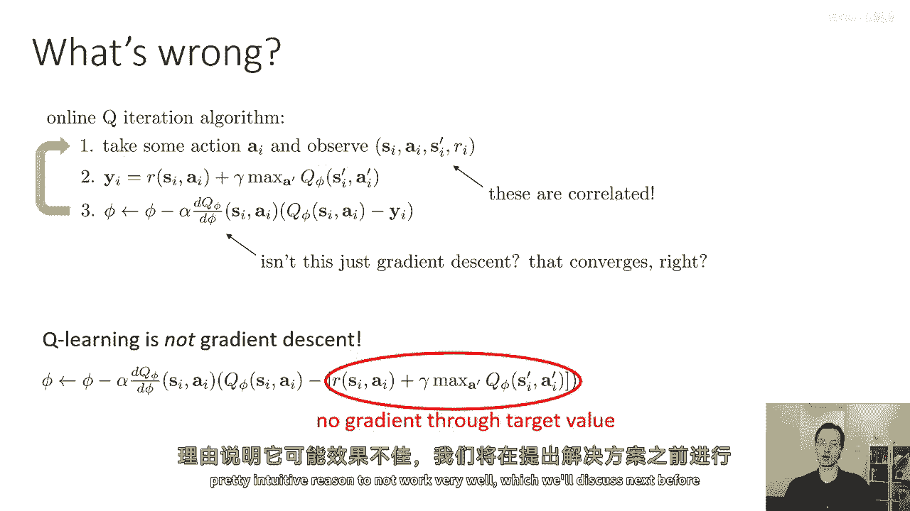
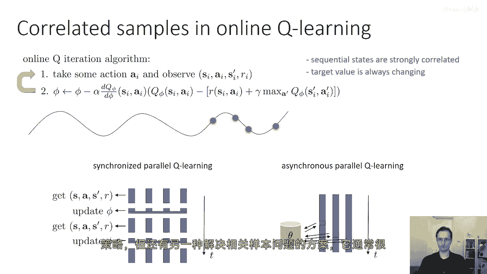
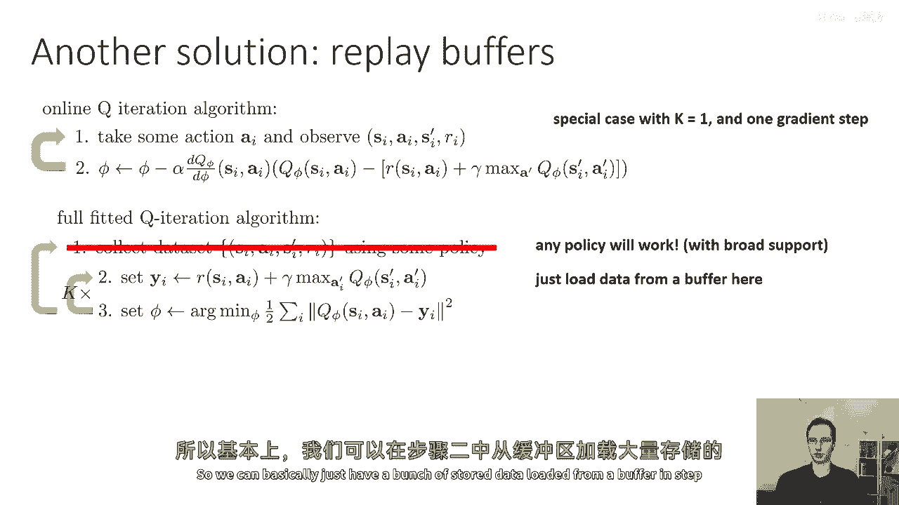
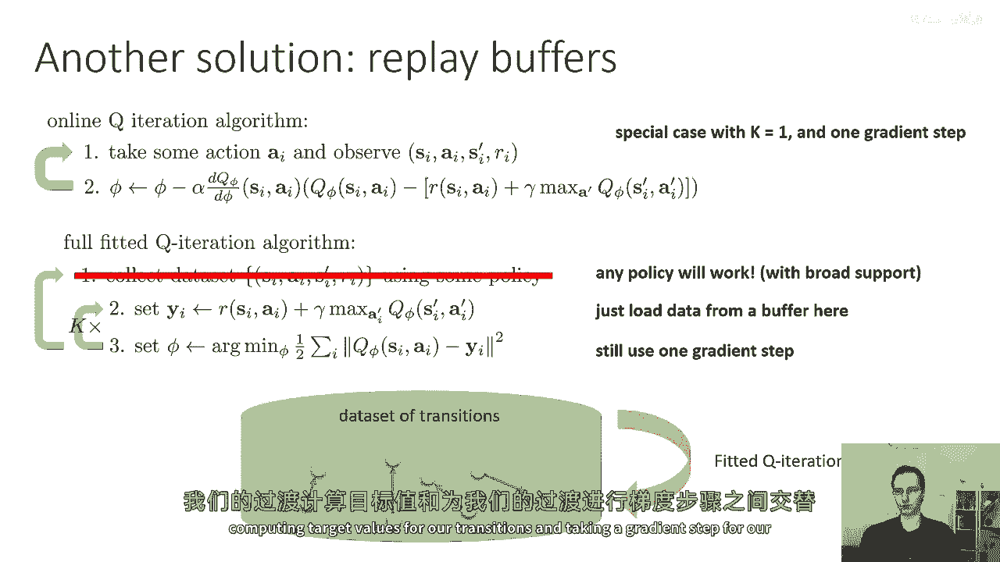
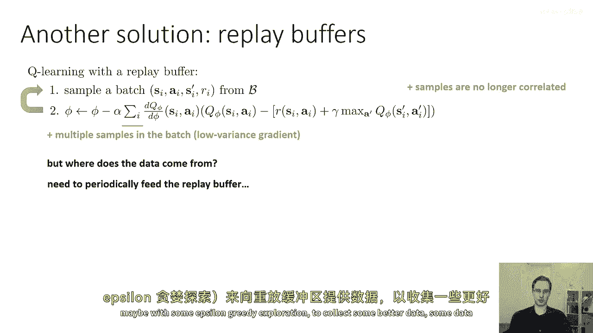
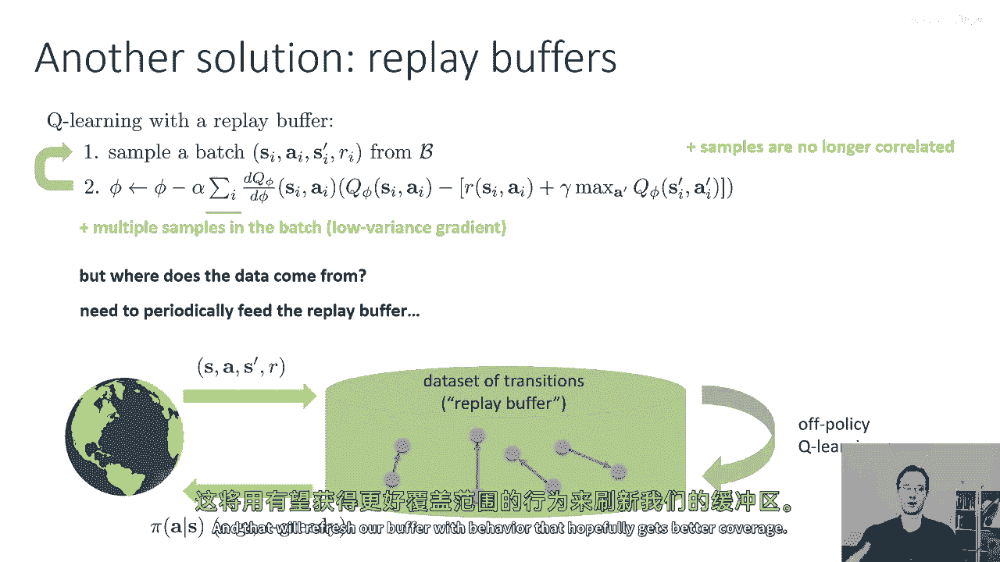
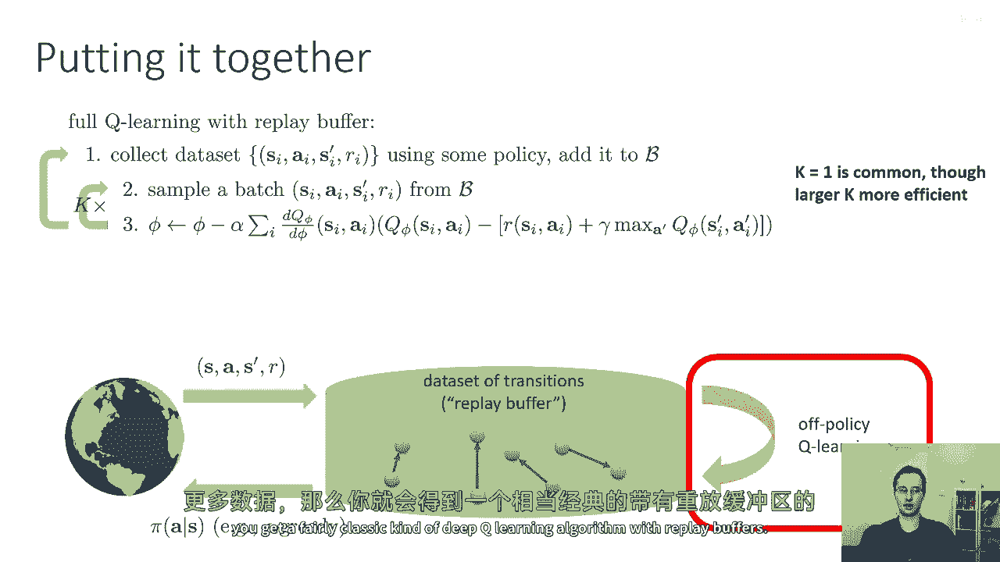
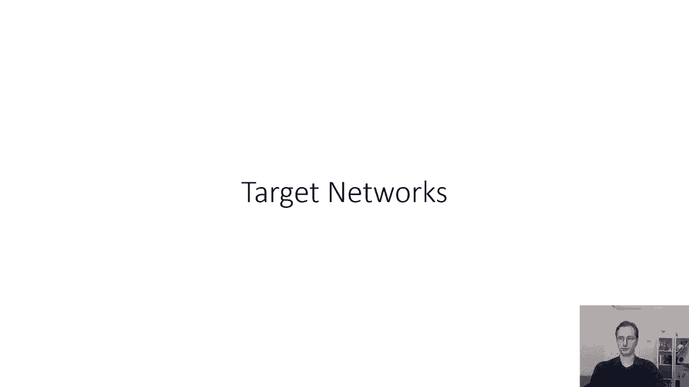

# P30：p30 CS 285： Lecture 8, Part 1 - 加加zero - BV1NjH4eYEyZ

好的，在今天的讲座中，我们将继续讨论上次讨论的价值驱动方法，我们还将讨论一些可以利用Q函数的实际深度强化学习算法，所以，尽管我们学习了价值，基于方法的一般性并不保证在实践中收敛，实际上。

我们可以从这些方法中获取一些非常强大和非常有用的反馈学习算法，这就是我们今天要讨论的。

所以，首先让我们回顾一下上次，我们称之为拟合q持续时间算法，这些算法不需要知道转换概率，也不需要我们明确表示策略，因此，这种方法类中有三个基本步骤，第一步我们使用某种策略收集一个数据集。

我们学习到这些是离线算法，这意味着它们可以使用一系列不同的策略来收集他们的数据集，它们可以聚合来自先前迭代的数据，并且可以使用各种探索规则，如epsilon，贪婪和玻尔兹曼探索，然后，在步骤二中。

对于我们数据集中的每个过渡，当我说过渡，我意味着s i a i s i prime和ri元组对于每个过渡，我们计算我们称为的目标，我标记为y i，它等于当前奖励。

加上gamma乘以下一个时间步的长期最大值，我们学到了这个最大值是什么使我们能够使用这个算法离策略，所以，这个最大值基本上，解释你正在隐式地计算一个贪婪的argmax策略，使用你当前的q函数q phi。

然后通过将该argmax策略插入到q phi中来评估其值，当然，arc max的值仅仅是最大，因此，这就是我们的目标y i，然后在第三步，我们更新我们的q函数近似器，该近似器由phi参数化。

通过找到arg min参数，参数，最小化q phi的输出与目标y i之间的差异，我们刚刚计算的，步骤二和三通常可以在收集更多数据之前重复一些次数，所以，这是拟合q迭代算法的一般食谱。

它具有我们可以做出的一些选择，我们在步骤一可以选择收集多少个转换，我们在步骤三可以选择走多少个梯度步，当我们优化phi时，我们可以选择在收集更多数据之前，如何交替执行步骤二和步骤三。

如果我们选择所有这些超参数都是一的话，意味着一次数据收集，一次梯度步，并且只在收集更多数据之前执行步骤二和三一次，然后，我们得到被称为在线Q学习算法的东西，我听说我称之为在线Q迭代，这实际上就是Q学习。

所以，如果你听到有人说Q学习，他们实际上意味着这种方法，步骤一，AI执行一个动作并观察结果转换，SIAISIRI'，步骤二，计算目标值，Yi对于该转换，步骤三，执行一次梯度步。

在Q函数输出和您刚刚计算的值之间的差异上，当然，像往常一样，这个算法符合我们强化学习方法的解剖结构，橙色的盒子是步骤一，绿色的盒子是我们将Q函数插入的地方，在这里的蓝色盒子有些退化。

它仅仅涉及选择动作为cu弧度的最大值。

好的，所以，这个一般程序中有哪些问题，我们上次学到了一些事情，例如，我们学到了步骤三的更新，尽管它看起来像是一个梯度更新，它看起来像是在应用链规则，但它实际上不是任何定义良好的目标的梯度，所以。

Q学习不是梯度下降，如果你将yi的方程代入，你将看到qphi出现在两个地方，但在第二个术语中，没有梯度，所以这不是正确地应用链规则，我们可以正确地应用链规则，然后，我们得到一类被称为残差梯度算法的方法。

不幸的是，这样的方法在实践中往往工作得很差，因为存在非常严重的数值条件问题，在线Q学习算法的另一个问题是，当你一次采样一个转换时，序列转换高度相关，所以，我在时间步t看到的状态。

可能是在时间步t+1看到的状态非常相似，这意味着当我在第三步中对这些样本进行梯度步时，我正在对高度相关的转换进行梯度步，这违反了随机梯度方法通常持有的假设，并且它有一个直观的原因不会很好工作。

我们将在下一个部分讨论这个问题，然后在呈现解决方案之前。

所以，让我们谈谈相关性问题，这里我只是简化了算法，我简单地将目标值的方程插入到梯度更新中，所以，只有两个步骤，而不是三个，但是，过程是一样的，所以，你看到的一系列连续的状态将会非常相关。

这意味着在时间t+1的状态，它可能类似于时间步t的状态，即使它不相似，它可能与其有非常密切的关系，因为你的目标值总是在变化，所以，尽管你的最优化过程看起来像监督回归，在某种意义上，它像是在追自己的尾巴。

它试图赶上自己，然后从自己下面改变出来，而且，梯度没有考虑到这种变化，所以这可能成为一个问题的原因在于，如果你想象这是你的轨迹，并且你经历了几个转换，你会对这种转换局部过拟合。

因为你看到的是一系列非常相似的转换，一个接一个，然后你会遇到一些其他转换，然后你对这些转换稍微过拟合，然后你看到一些其他转换，你对这些转换过拟合，就这样一直下去，然后当你开始一个新的轨迹。

你的功能逼近器会在它过拟合到前一个轨迹的末尾的地方停止，再次会变得不好，所以，如果它一次性看到了所有的转变，它可能实际上能够准确拟合所有这些转变，但是因为它正在看到非常局部，高度相关的窗口。

它只有足够的时间来过度拟合每个窗口，而没有足够的更广泛的上下文来准确拟合整个函数，现在我们可以借用我们之前讨论的演员批评者的想法，当我们谈论演员批评者算法时，我们实际上讨论了解决同一个精确问题的方法。

当我们讨论在线演员批评者时，我们讨论的特定解决方案是并行化，目标是有多个工人，每个工人收集不同的状态转换，s是素数r，收集包含所有这些工人样本的批次，更新该批次并重复，原则上。

这个程序可以解决序列状态高度相关的问题，序列状态仍然相关，但现在你从不同的工作者和工人之间获得不同的状态转换的批次，他们希望不相关，所以它没有完全解决这个问题，但它可以减轻它，当然。

就像我们学习到的角色批评一样，你可以有这个食谱的异步版本，其中，单个工人，不需要等待同步点更新参数，而是查询参数服务器获取最新的参数，然后按照自己的节奏进行，实际上，在Q学习中，这个食谱应该。

理论上工作得更好，因为在Q学习中，你甚至不需要工人使用最新的策略，所以，你可能有一个稍微旧的策略，这个策略在一些工人上被执行是，理论上不是个大问题。

然而，有一种解决相关样本问题的方法，通常相当容易使用，并且在实践中效果很好，那就是使用被称为回放缓冲区的东西，回放缓冲器是强化学习中一种比较老的想法，它们早在九十年代就被引入了，这里是。

这里是它们如何工作的，所以让我们回到我们的完整拟合Q迭代算法，在完整拟合Q迭代算法中，我们将收集一个使用我们想要使用的任何策略的数据集，然后，我们将在那个数据集上进行多次更新，所以。

我们将标记所有过渡状态为目标值，然后，我们可能会对目标值进行大量的梯度步骤，进行回归，甚至可能在收集更多数据之前计算出新的目标值，所以我们可能会在步骤二和步骤三之间来回k次，如果k大于1。

我们可能会在同一组过渡状态上进行大量的学习，所以，在线Q学习算法仅仅是这个的特例，当k被设置为1时，并在步骤三中进行一步梯度，当然，任何用于收集的策略都工作，只要它有广泛的支持，所以，我们，实际上。

甚至可以省略步骤一，所以，我们可以只是加载缓冲区中的数据，所以，我们可以在步骤二中基本上有一个包含从缓冲区加载的大量数据的数据集。

然后迭代步骤三，所以，这是我们对Q学习或拟合Q迭代的视图，作为一种数据驱动的方法，我们有一个大桶的过渡状态，我们并不真正关心这些过渡状态来自哪里，只要它们覆盖所有可能性的空间相当好，我们就会一直工作。

对这些过渡状态进行更多的更新，交替计算目标值和对这些目标值的回归，如果我们想要，我们可以在步骤三中仍然取一步梯度，然后我们会得到看起来像在线Q学习，但没有数据收集的东西，如果我们取一步梯度。

那么我们基本上就是在交替计算我们的过渡状态的目标值。

和取我们的过渡状态的梯度步，所以，这是我们Q学习算法的修改版本，在步骤一中使用回放缓冲区，而不是在真实世界中实际取步，我们只是采样一个批次，多个过渡状态。

S i a i s i 是从我们的缓冲区中提取的质数，我将其称为b，然后在第二步中，我们对该批中的所有条目求和，因此，每次循环中，我们可能会采样不同的批，我们从缓冲区中独立、一致地采样。

这意味着我们的样本不再相关，然后，我只需要回答一个问题，我们从哪里获取缓冲区，所以我们在批中有多个样本，所以我们有低方差梯度，我们的样本不再相关，满足随机梯度方法的假设的是哪些，遗憾的是。

我们还没有真正的梯度，因为我们没有通过第二个项计算导数，至少样本之间没有相关性，那么数据从哪里来呢，我们需要做的就是我们需要定期向回放缓冲器中喂入数据，因为最初我们的政策会很差。

也许我们的初始非常差的政策仅仅不会访问空间的所有有趣区域，所以我们仍然想偶尔使用我们的最新政策来喂入回放缓冲器，也许使用一些epsilon-greedy探索来收集一些更好的数据。

一些我应该使用更好覆盖的数据，所以然后你可能想到的图表可能看起来像这样，我们有我们的过渡缓冲区，我们在这个缓冲区上全力以赴，在做我们的离线策略Q学习，然后定期我们将一些策略部署回世界，例如。

贪婪策略与epsilon-greedy探索相结合，以收集一些更多的数据，并带回一些更多的过渡，以添加到我们的缓冲区中，这将刷新我们的缓冲区，以希望获得更好的数据覆盖。

好的，那么，将所有这些部分结合起来，我们可以制定一种完整的Q学习食谱，包括回放缓冲器，第一步，使用某种策略收集过渡数据集，也许最初只是随机策略，后来，它将是epsilon-greedy探索的最大值策略。

并将这个数据添加到你的缓冲器b中，这就是这一部分，第二步，从b中采样一个批次，然后，在该批次上进行学习，通过将批次求和，这是一次Q学习伪梯度，所以我们将计算批处理中的每个条目的目标值，然后。

我们将进行当前Q值减去目标值，乘以导数，然后，我们将其对所有样本进行求和，因为我们对所有样本进行求和，所以我们得到具有更多样本的梯度方差更低，并且因为我们从缓冲区中独立且无偏地采样样本。

我们的样本只要缓冲区足够大，就会是不相关的，然后我们可以重复这个过程，k乘以k等于一非常常见，但更大的k可能更有效，所以如果你重复这个k等于一次，然后出去收集更多的数据。

