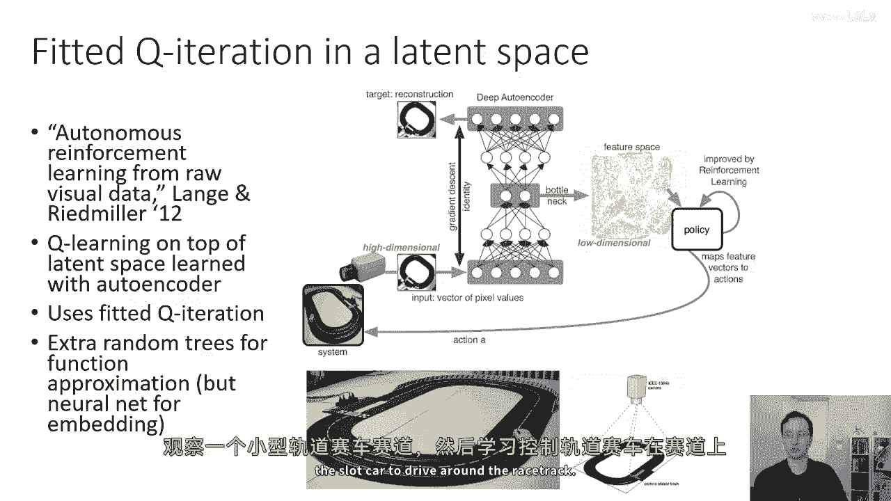
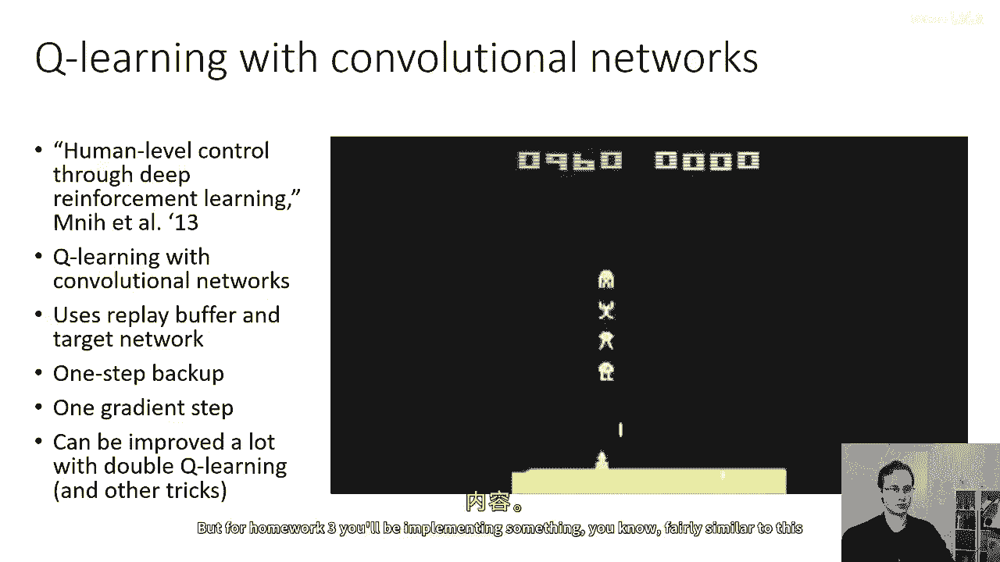
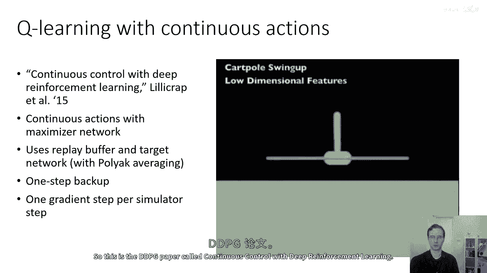
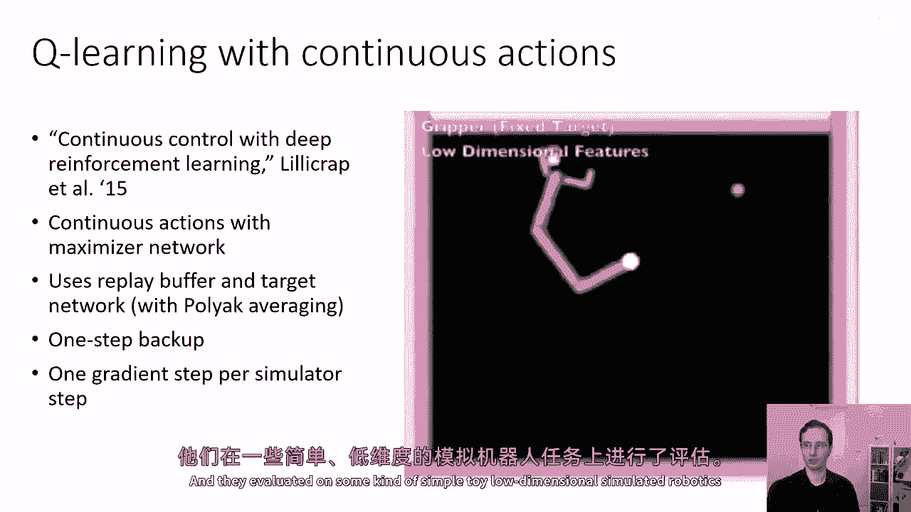
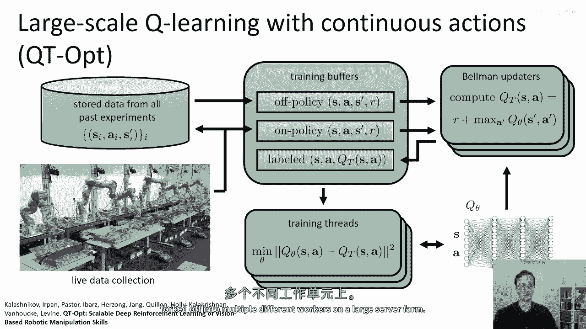
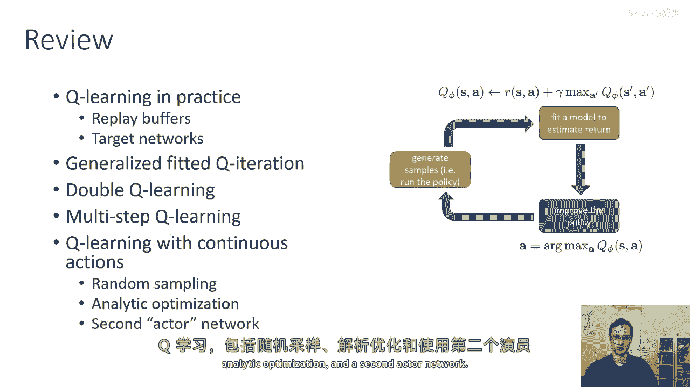

# P35：p35 CS 285： Lecture 8, Part 6 - 加加zero - BV1NjH4eYEyZ

好的，"在今天讲座的最后一部分"，"我将介绍一些实施Q学习算法的提示和技巧"，这可能对第三份作业有用，"然后，我会给出一些使用这些方法的论文的例子。"，"我在这次讲座中描述的方法的变体"。

"所以首先一些实用的提示"，"Q学习方法通常比策略梯度方法使用起来要精细得多"，因此，他们通常需要更多的小心谨慎来正确使用，"稳定Q学习算法需要一些细心"，"嗯，而且"，我推荐的是。

首先在你的算法上测试一些简单可靠的问题，"确保你的实现正确的地方，就是你知道你的算法应该工作的地方"，"因为本质上，你必须经历几个不同的阶段来调试问题。"，首先，你需要确保你没有任何错误。"然后。

你需要确保你调优超参数"，"然后让它在你的实际问题上发挥作用"，"所以你想在超参数调优之前进行调试"，这意思是你想要在非常容易的问题上做，"基本上，任何正确的实现都应该真正工作"。

Q学习在不同的问题上表现差异极大，嗯，所以这些是一些，嗯，DQN类型的实验在各种不同的阿塔里游戏上的图表，你可能注意到的是，这些方法的稳定性有很大的差异，对于PM，你的奖励基本上稳步上升，然后对于破出。

则是平线，它先是上升，然后摇晃了一大堆，对于像视频这样更难的游戏，有些，弹球和冒险，它完全到处乱飞，这里的不同颜色线条仅仅代表使用不同随机种子运行同一精确算法的不同结果，你可以看到在乒乓球中。

pong的随机种子基本上对于弹球相同，它们从定性上看是相似的，但使用不同噪声工作对于冒险来说会有所不同，一些运行成功，而一些完全失败，较大的回放缓冲区确实可以帮助提高稳定性很多。

所以使用大约一亿的回放缓冲区可以是一个相当好的选择，在那一刻，算法开始看起来更像fit a q迭代，这可能是其稳定性改善的部分原因，最后，Q学习需要很长时间，所以请耐心等待。

可能在很长一段时间内都不会比随机更好，而随机探索找到了好过渡，然后一旦找到了这些好过渡，它可能会起飞，许多你们可能会在作业三中遇到这种情况，当你们在手掌视频游戏中训练时，从高探索开始。

以大的值开始epsilon，然后随着你的前进逐渐减少探索，因为最初你的q函数是垃圾的，所以大部分重活我们会在做随机探索，然后当你的q函数变得更好时，然后你可以减少epsilon。

所以把它安排在一个时间表上往往有帮助，关于q学习贝尔曼误差的一些高级技巧，这样贝尔曼错误的梯度可以非常大，所以它有点像最小二乘回归，所以这些平方误差量可以很大，这意味着它们的梯度可以非常大。

有一点麻烦的是，如果你有一个非常糟糕的动作，你真的不关心那个动作的价值，但你的平方误差目标真的很关心找出它到底有多坏，如果你有一些好的动作，像加十，加九，加八，和一些坏的动作，像减一百万。

这个减一百万会创建一个巨大的梯度，尽管你真的不关心它是减一百万，比如如果你被猜测到猜减九十万，它将导致相同的政策，但你的q函数目标真的很关心这个，这将导致大梯度，所以你可以做的是。

你可以要么剪切你的梯度，或者使用被称为Huber损失的东西，Huber损失，你可以把它想成是一种插值，在远离最小值的地方，介于平方误差损失和绝对值损失之间，从最小值，Huber损失看起来像绝对值。

靠近最小值，因为绝对值是一个不可导的尖峰，Huber损失实际上用二次函数平滑它，所以 uh，这里右侧的绿色曲线显示了Huber损失，而蓝色曲线显示了二次损失。

Huber损失集的行为实际上与剪切梯度非常相似，但它可能更容易实现，双q学习在实践中帮助很多，它非常容易实现，基本上没有任何缺点，所以使用双q学习并分离回报可能是个好主意，尤其是在训练的早期阶段。

但他们也有一些缺点，因为n步回报会系统地偏差你的目标，尤其是对于较大的n，所以小心n步回报，但请记住，他们可以在训练的早期阶段改善事情，安排探索和预定的学习率，像原子这样的适应性优化规则也可以帮助很多。

所以一些早期的工作使用了像我们的rms prop这样的东西，但这并不像最新的适应性优化器如adam那样有效，所以使用adam是个好主意，而且在调试你的算法时，确保运行多个随机种子。

因为你会看到随机种子之间有很多变化，你看到算法在运行之间非常不一致，所以你应该运行几个不同的随机种子以确保事情真正在工作，你预期的方式，并且你没有得到偶然的结果，偶然的结果可以是非常坏的。

也可以是非常好的，所以记住这一点，所以在讲座的最后一部分，我要做的就是，我将通过一些以前使用与我在这堂讲座中覆盖的算法的先前论文的例子来，这些算法与这些算法有关，我想简要谈论的第一篇论文。

是这篇叫做自主强化学习的论文，由兰格和里德·米勒或兰格和雷姆米勒从原始视觉数据中学习，实际上这是一篇来自二零一二年的论文，这是一篇相当古老的论文，并且它是最早使用深度学习与物理迭代方法的论文中的一篇。

这篇论文所使用的特定程序，尽管，与在本次讲座中覆盖的方法有所不同，实际上它更类似于稍后将讨论的一些基于模型的算法，所以在这篇论文中，作者的做法是，他们实际上通过自编码器学习一种图像的潜在空间表示。

"然后，他们实际上运行fit a q迭代"，"在这个自编码器的潜在空间中"，"在特征空间中"，"但是，他们实际使用的特定紧密的急性迭代并不使用神经网络。"，它使用了一种叫做随机树的东西。

所以他们使用浅层，"但是，仍然可以在深度神经网络学习到的代表性上拟合一个q迭代过程。"，"所以这是在潜伏空间上的Q学习"，使用自编码器进行学习，迭代次数为fit a q。

"并且有一种叫做额外随机树的函数逼近方法"，你可以把额外的随机树看作是基本上非常类似于随机森林的，并且在这篇论文中他们展示的，这相当酷，是用一个俯视摄像头来看这个微型卡丁车赛道。

然后学习控制卡丁车在赛道上驾驶。

这里有一篇使用卷积神经网络与Q学习的论文，这是深度Q学习，所以这是一篇叫做通过深度深度强化学习实现人类水平的控制，并且这篇论文使用Q学习与卷积网，嗯，使用重放缓冲器和目标网络。

以及我之前提到的这种简单的一步备份，以及一步梯度用于玩阿塔里游戏，这可以大大改进，因此，使用双Q学习可以大大改进，本论文中的原始方法实际上也可以通过使用原子来大大改进，因此。

这个单独的方法实际上可以获得大大提高的性能，嗯，但是嗯，对于作业三，你将实现一些东西，嗯，你知道，相当类似于这篇论文。

这里有一篇关于连续动作Q学习用于机器人控制应用的论文，或类似于模拟控制应用的论文，所以这是嗯，被称为连续控制与深度强化学习的GDPG论文。

使用连续动作与最大化网络，并使用重放缓冲器和目标网络的多臂机器人，以一步备份和一步梯度步作为模拟步，他们在某种简单的玩具上进行评估，嗯。

低维的，嗯，模拟器，机器人任务，这里有一篇实际上使用深度Q学习算法的论文，用于真实世界机器人控制的连续动作，这实际上利用了我之前讨论的一些并行性想法，在这里，有多个机器人并行学习以打开门。

这是一篇名为'深度强化学习中的机器人操纵'的论文，以及异步的政策更新，这使用了NAF表示法，所以这是一个关于动作的二次函数形式的Q函数，使最大化更容易，您使用重放缓冲器和目标网络，一步备份。

这个实际上使用四个梯度步作为模拟步以提高效率，因为从机器人收集数据，我想甚至不是模拟，实际上，从机器人收集数据是昂贵的，所以你希望尽可能少地使用数据进行计算，并在多个机器人之间进一步并行化以提高效率。

嗯，我在讲座一中展示的方法实际上也是深度Q学习算法，它接受了这个，嗯，对极端拟合Q迭代的并行解释，所以这里有多个机器人都在并行学习抓取，实际上有多个工人都在计算目标值，多个工人都在执行回归。

并且有一个单独的工作者正在管理重放缓冲区，所以这就是实际上使用过程一之前展示的系统，过程二和过程三，在这种情况下，每个这些过程都在大型服务器农场中被fork成多个不同的工作者。

好的，如果你想了解更多关于q学习的知识，经典论文，这是watkins的q学习论文，它于1989年引入了q学习算法，这篇论文叫做神经拟合q迭代，引入了批处理模式，带有神经网络的q学习。

一些深度rl论文对于q学习，我之前提到的lang和reed miller的论文，也就是dqn的论文，这是引入双q学习的论文，这是引入近似最大化与新theta的论文，这是引入af的论文。

这是一篇介绍叫做dueling网络架构的论文，这是非常，非常类似于nnaf架构，但是为离散动作空间进行了适应，我在讲座中没有覆盖这个，但它也是一个非常有用的技巧，可以使q学习工作得更好，好的。

你可以在幻灯片中找到他们，如果你想了解更多，我强烈建议你去看看，总结一下我们今天的讲座，我们讨论了q学习在实际中的应用，我们如何使用重放缓冲区和目标网络来稳定它。

我们讨论了从三个过程的角度来看拟合q迭代的通用视图，我们讨论了双q学习如何使q学习算法工作得更好，我们如何做多步q学习，我们如何做q学习与连续动作，包括随机采样，分析优化和第二个演员网络。

