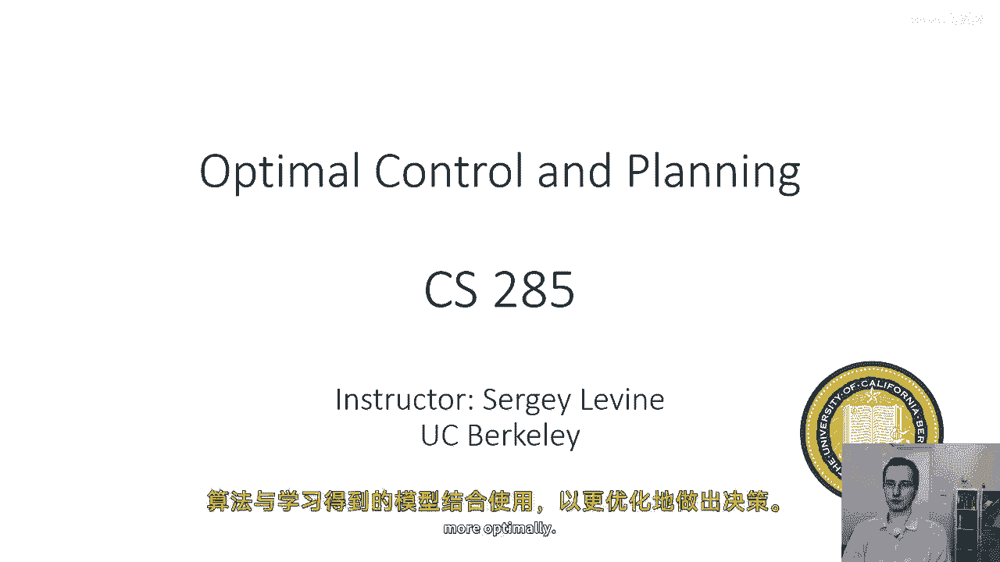
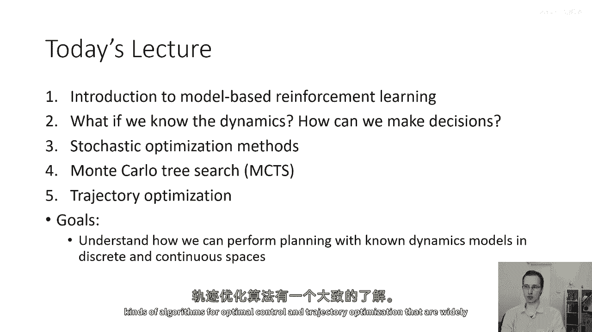
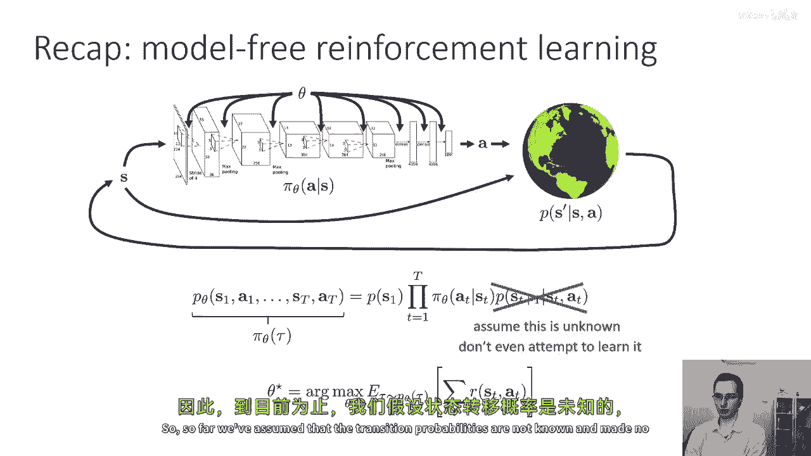
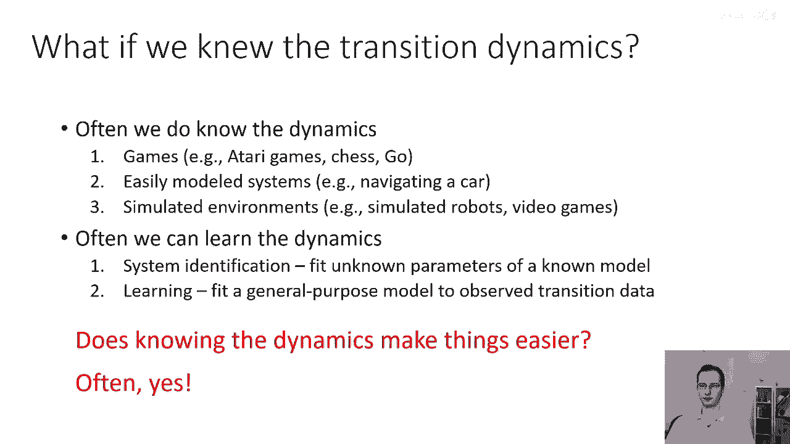
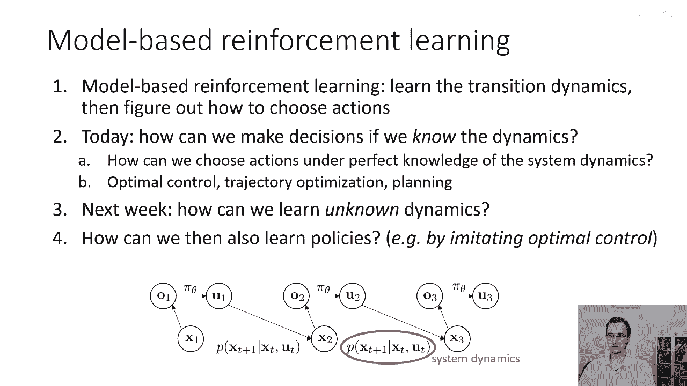
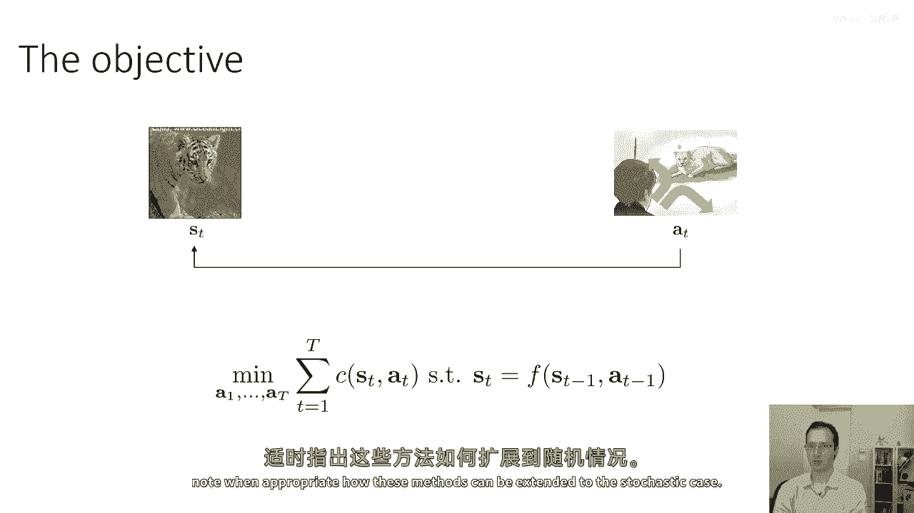
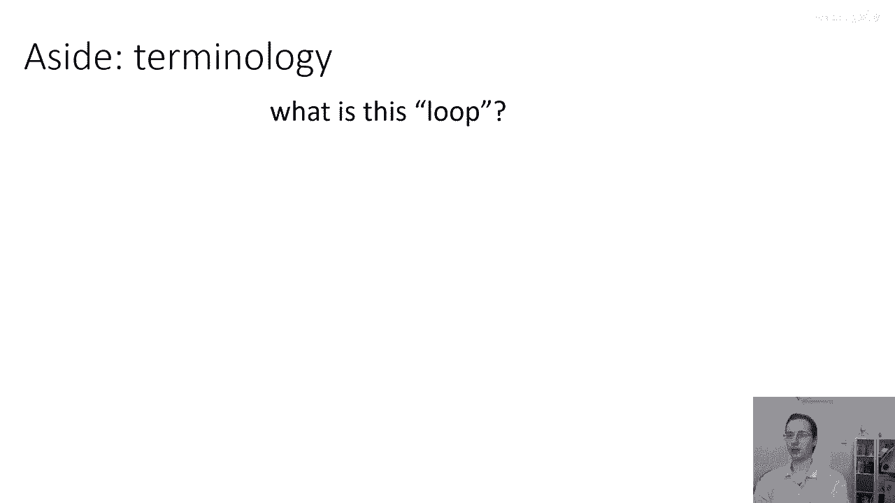
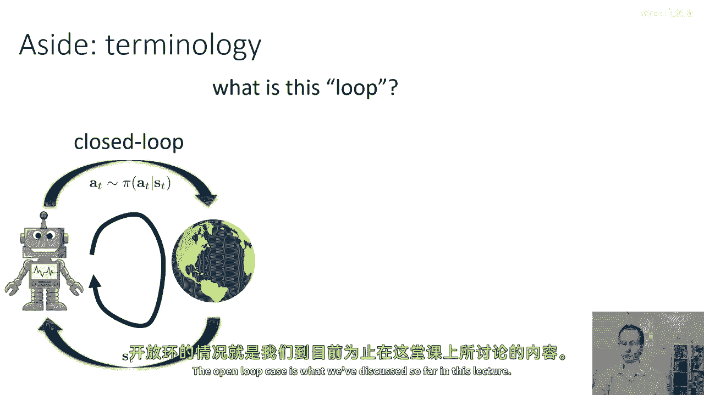
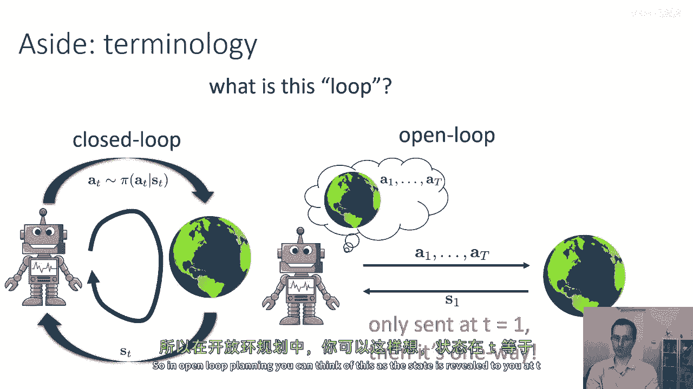
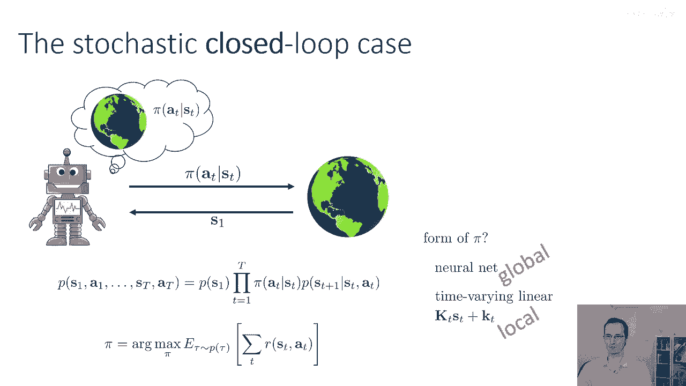

# P40：p40 CS 285： Lecture 10, Part 1 - 加加zero - BV1NjH4eYEyZ

好的，欢迎来到讲座，今天我们将讨论cs285的十号课程，我们将改变话题，我们将从讨论无模型强化学习算法开始，转向实际使用模型的算法，但在我们详细讨论基于模型的强化学习之前，我们需要理解一点。

模型如何实际被用来做决策，无论这些模型是学习得到的还是手动预先指定的，所以在今天的讲座中，我们将讨论最优控制和规划的算法，这些是假设系统模型已知的方法，并且使用那个模型来做决策。

这些算法将与模型有很大的不同，我们在课程前九讲中学习的自由强化学习算法，所以，在今天的讲座中实际上不会有任何学习，但是在后续的讲座中，我们将看到如何使用一些最优控制和规划算法。

在与学习到的模式结合使用时，来做出更优化的决策。

好的，所以，在今天的讲座中，我们将，嗯，了解基于模型的强化学习，我们将讨论我们可以做什么，如果我们知道动态和如何做出决策，我们将讨论一些随机黑箱优化方法，这些方法非常简单，因为其简单性而广泛使用。

我们将谈论蒙特卡洛树搜索，然后，我们将谈论轨迹优化，特别是线性二次调节器和其非线性扩展，所以，今天讲座的目标将是理解我们如何进行规划，已知离散和连续空间的动力学模型，并了解用于最优控制的算法种类。

以及广泛使用的轨迹优化算法。

好的，所以让我们从前面的讲座中回顾一下，我们学习了优化强化学习目标的算法，强化学习目标在这里的幻灯片上给出，目标是在轨迹分布下的最大预期值，由你的政策πθ诱导的轨迹分布θτ的总奖励。

我们学习了这个基本食谱的许多变体，包括使用折扣的方法，轨迹分布由初始状态概率乘以一起形成，在状态t和时刻t的条件下，策略概率pi theta a t为s t，以及状态d和时刻t的条件下。

转移概率p sd plus one为s d a t，我将使用p theta of tau，或者交替使用pi theta of tau来表示轨迹分布，并明确指出它取决于theta，所以在我们讨论的算法中。

我们假设了一种无模型形式，这意味着我们假设我们不知道p of s t plus one给定s d a t，而且不仅如此，但我们甚至不尝试去学习，所以这些都是能够逃脱的算法。

只是从给定状态st的p(s t+1)中采样，沿着完整的轨迹，而不需要实际上知道概率是什么，也不需要做出预测，例如，如果你从同一个状态采取了不同的行动，那么会发生什么，实际上，如果你记得我们讨论的q学习。

我们通过从值函数切换到Q函数成功地避免了这个问题，到目前为止，我们已将策略迭代从值函数切换到Q函数，我们假设过渡概率是未知的。

并且没有尝试实际学习它们，但如果我们知道过渡概率，作为术语，我将说，过渡概率，过渡动力学，动力学或模型，所有这些东西基本上意味着同样的意思，它们都指的是p of s t，再加上一个给定的s t a t。

尽管在一些情况下，那些过渡动态可能会实际上被确定，这意味着只有一个状态有一个概率为1，而且所有其他状态都是概率为0，所以希望从上下文中可以看出来，我指的是哪一个，对吧，所以实际上在许多实际问题中。

我们确实知道过渡动态，例如，如果你在玩像雅达利游戏或象棋这样的游戏，或者在所有这些设置中，你真的了解控制游戏的规则，或者是因为它是由人手编写的，或者是像棋类游戏一样，因为规则是已知的，并且它们在一个。

在一个规则书中被指定，在某个地方，一些系统可以很容易地用手动建模，所以如果你有一个物理系统，嗯，"可能在那里，真正的过渡动力学并不完全清楚"，这可能仍然是一个易于手动建模的系统，所以，例如。

"在黑暗的道路上，车辆的物理属性非常难以建模"，"但是，一辆在道路上行驶的汽车的动力学属性是"，在光滑干净的道路上，没有滑脱，实际上相当容易建模。"你可以写下一些运动方程"。

"这就在实际操作中提供了一个相当不错的模型"，"和"，当然，我们想要解决的问题中，许多我们已经模拟了环境，对这些任务的模拟类似物，在这种情况下，我们也实际上知道过渡动态。

尽管我们可能无法以封闭形式表达一些方便的量，如导数，如果我们有一个非常复杂的模拟器，现在好了，在许多其他情况下，即使我们不知道动态，它们可能会相当容易学习机器人中的一种非常大型的子领域，例如，系统识别。

"系统识别涉及到将未知模型参数的问题与已知模型相匹配"，所以例如，"如果你知道你的机器人有四条腿，并且你知道大致这些腿有多长"，"但你可能不知道它们的质量和转动矩"。

"系统识别涉及到将那些未知的量与你已知的和良好的量进行匹配的问题。"，"模式化支架"，"你也可以将通用目的模型拟合到观察过渡数据的数据上"，"那就是许多模型的焦点"。

"我们将在本课程中覆盖的基于规则的算法"，知道动态也是如此，过渡动态，模型，等等，这是否使事情更容易呢，常常，是的，常常，如果我们知道动态，在我们的工具箱中，我们有一系列的算法可供选择。

我们在模型自由设置中无法使用的，而且许多这些算法都可以极其强大，就像我今天讲座的结尾我将向你展示的那样。

好的，所以让我们总结一下，嗯，这些基于模型的方法怎么了，基于模型的强化学习是指一种解决rl问题的方法，其中我们首先学习状态转移动态，然后使用这些学习到的状态转移动态来确定如何选择动作。

今天我们要讨论我们如何做出决定，如果我们知道动态，那么如何在完全了解模型知识的情况下选择行动，所以模型知识的完美意味着你知道这个边在pudp中的精确值，图形模型是，你知道对应cbt的所有条目。

或者在连续情况下，你知道对应cpd的分布形式，所以这是算法的领域，这些算法被称为最优控制，轨迹优化和规划，这些之间的区别有些模糊，但一般来说，"轨迹优化是指选择一系列状态的特定问题"。

"并优化某些结果的行动"，"规划通常指的是那个问题的离散模拟"，"尽管'规划'也可以指其持续版本"，在这种情况下，规划轨迹优化本质上是相同的事情，尽管通常，被称为规划的算法，在类似离散分支的设置中。

考虑多种可能性，"然而，轨迹优化算法通常执行基于光滑梯度的优化。"，"最优控制是指选择能够优化某些奖励的控制的一般问题"，或者最小化一些成本，所以轨迹优化可以被视为解决最优控制问题的一种方法，实际上。

可以说，所有的强化学习实际上都是从学习的角度在处理最优控制问题，好的，然后下周我们将讨论当我们有未知动态时发生了什么，所以在今天的讲座中，我们完全处于假设动态已经被给我们设定的环境中。

下周我们将讨论当它们没有被给予时我们应该做什么，然后稍后我们也会讨论如何我们也可以学习策略，所以今天的讲座我们只关心如何找出没有策略的最优行动，但稍后我们也会讨论如果你学习一个模型。

你也可以用它来学习策略。

好的，那么这些规划或控制方法的目标是什么，没有策略了，只有状态和动作，如果你在这个目标环境中，一个相当合理的规划目标形式是规划一个动作序列，那将最小化你被老虎吃掉的概率，这基本上是一个规划问题。

如果你只关心选择那些行动，你不关心产生的政策，那么你在连续空间中进行规划或轨迹优化，所以你可以将这个问题表达为选择一系列行动的问题，以最小化成本的总和或最大化奖励的总和。

但如果我们简单地形成一个无约束的问题，那就是选择一系列行动以最小化c s d a t，那么我们实际上没有考虑到未来状态受到过去行动的影响，所以，为了将这个转化为优化问题。

你需要实际上将其写成一个受限优化问题，以t到1的某个变量为目标函数最小化，从时间t到t+1的总成本，步骤从t到t+1，受限于约束，即每个后续状态等于在行动下对前一个状态的动态应用的结果。

这是确定动态情况的公式，我们也可以将其扩展到随机动态情况，通过将事情表达为分布和期望，那么，在本次讲座中，我们将通常使用符号来表示确定性的情况，但我会在适当的时候说明这些方法如何扩展到随机的情况。

好的，所以，确定性的情况实际上相对简单，你有一个代理，并且你有一个环境，环境告诉您的代理他们处于什么状态，所以，环境告诉他们您处于状态s1，然后，代理进行优化，给他们处于状态s1的情况下。

他们能想象一个动作序列吗，一个从a到T的大写字母的序列，会最小化总成本，然后他们将这些动作发送回世界，这些动作被执行，所以这些从a到T的动作，代表代理的计划，所以如果你想用奖励来写东西。

你可以制定这个优化，就像我之前在幻灯片上做的，其中，从a到T被选择为奖励的最大值，受制于约束s_t+1等于f(s_t，a_t)，我道歉，那是幻灯片上的一个小错误，那a_t+1应该等于s_t+1，好的。

所以，在确定性的情况下，这都很好，但在随机性的情况下会发生什么，所以，在随机性的情况下，现在，你可以定义一个序列状态基于序列动作的分布，所以你可以说得很好，从s1到St的概率为。

给定从s1到St的概率为s1的概率乘以，sT加上1给定sT和aT项的概率积，注意，给定sT的aT概率在这里不会出现，因为我们是在所有事情上都有条件的，我们正在在所有事情上都有条件于一个序列。

所以在这种情况下，我们可以选择我们的行动序列作为序列，一个从s1到St，最大化给定条件下的奖励期望的行动序列，那个在顶部显示的分布下，期望被取为的行动序列，这是一种在随机环境中处理规划问题的合理方法。

但我要声称在某些情况下这并不是一个非常好的想法，所以前一张幻灯片上的确定性情况是良好的，你可以那样得到最优的行为，但这实际上可能会非常次优，在某些情况下，花一点时间来思考这个问题，在什么情况下。

规划一系列行动，在这种方式在随机情况下将极其次优，试着想一个具体的例子，试着想一下这种情况下这种计划的情况，当你去执行时，它可能会导致非常糟糕的结果，所以这种计划是坏主意的情况。

是那些在未来你将会得到信息的情况，这将对你采取更好的行动有用，这是一个许多你们可能熟悉的随机规划问题，假设我告诉你我将给你一个数学考试，并且这是一个非常容易的数学考试，让我们假设它只是测试算术。

你知道一加一等于四或者什么，那就是一个长长的问题列表，我不会提前告诉你问题，因为那是考试，而且我会在你当前的状态下告诉你状态，在我即将给你考试的地方，但你还没有看到问题，告诉我你将采取的序列行动。

以最大化你的奖励，这个情况的问题是，你可能知道如何回答那个考试中的所有可能问题，如果不知道考试的问题，你现在无法告诉我，所以你的行为会是什么样的，如果我要求你解决这个开放环路规划问题。

你可能想象可能的结果，如果你写不同的答案，但如果不知道问题，试图想象写答案，你可能只会想出奖励非常差的结果，因为对于你可能写的几乎每一种答案序列，可能存在一些有高可能性考试的情况，在这些答案错误的地方。

所以你可能会选择一种极其不优的行动，换句话说，我不想参加考试，因为我知道我做得不好，你知道，明天带点别的来，但如果你有一种方式可以做闭环规划，如果你有一些方式可以观察s two，其中问题被揭示给你。

那么你可以获得更高的奖励。

顺便说一下术语，什么是所有这些关于循环的麻烦，其中一些似乎开放，而其他的一些似乎关闭得很好。

当我们说封闭循环时，我们意味着一个代理观察一个状态，采取一个行动，通常根据一些政策，并且这个过程重复重复，所以代理实际上可以在采取行动之前看到状态，这样他们就可以关闭感知和控制之间的循环。

开放循环的情况就是我们到目前为止讨论的情况。

在这堂讲座中，在开放环路情况下，你被给予一个状态，然后，你需要承诺一系列的行动，你会执行这些行动，而不实际查看新状态被揭示给你，所以这叫做开放环路情况，因为你承诺一系列的行动。

而这些行动是在开放环路中执行的，它们是在没有考虑世界正在发生的事情的情况下执行的，在随后的状态中，在简单的确定性设置中，开放环路规划可能是最优的，但是一般来说，在随机设置中。

即在一些新信息向你揭示的情况下，以你观察到的新状态形式，开环时间通常不是最优的，我们更喜欢通常做闭环规划，好的，所以，在开环规划中，你可以这么想，当t等于一时，状态被揭示给你。

然后它是一种单向通信，好的，所以如果有这个封闭循环的情况和开放循环的情况，到目前为止，我们谈论了开放循环的情况，一个显而易见的问题我们可以问的是，在封闭循环的情况下，封闭循环的情况看起来什么样子。

每次时间步，代理观察一个状态，然后以行动响应，你也可以把它想成观察第一个状态，然后承诺一个封闭循环策略，所以不像发送一系列行动，你发送状态和行动之间的关系，一个告诉世界对于每个状态的映射。

代理可能在哪些行动中采取行动，所以强化学习通常解决封闭循环问题，所以在封闭循环的情况下，你创建一个策略，Pi在给定s和t的情况下，现在你不再基于固定的政策集进行条件，但你基于固定的动作集。

但你基于整个策略进行条件，然后你的目标与以前的强化学习目标完全相同，现在，我们有许多不同的选择可以作为我们对pi形式的选择，到目前为止，课程进展如何，我们已经讨论了像神经网络这样非常表达性强的政策类。

但你可以使用表达力较弱的政策类进行接近最优的闭环规划，所以你可以认为神经网是一种全球政策，它告诉代理在可能遇到的任何状态下应做什么，但你也可以想象一种非常局部的政策，所以你可以看初始状态s一和说，嗯。

我打算在一个相对狭窄的状态区域停留，如果我从状态开始，所以我可以生成一种本地政策，像，例如，一种时间变化的线性政策，这在最优控制应用中更为常见，例如，如果你在控制火箭以飞过一条技术上属于随机设置的轨迹。

因为火箭可能偏离预定的轨迹，由于空气流中随机干扰，风和发动机属性，然而，它不会偏离得太远，如果你能快速纠正这些偏差，你的大部分时间都将保持在预定的轨迹附近，所以你可以接受一个非常简单的，非常局部的政策。

例如，一个仅提供状态线性反馈的政策，它将说，随着你的状态偏离，你应用在相反方向的动作，与偏差的量成比例，因此，这种控制控制器在优化控制领域更为常见，并且轨迹优化。

好的。