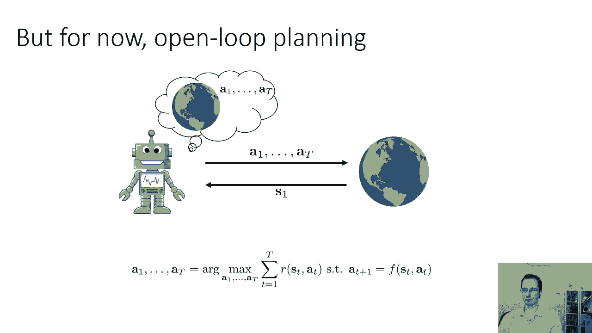
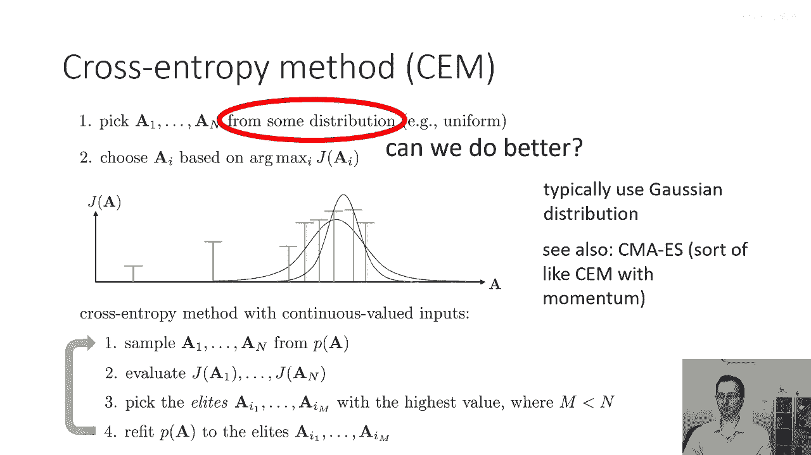
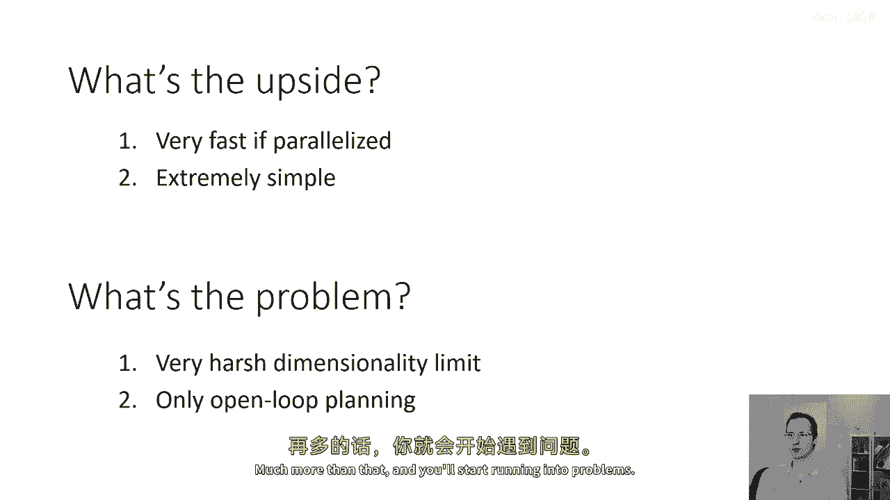
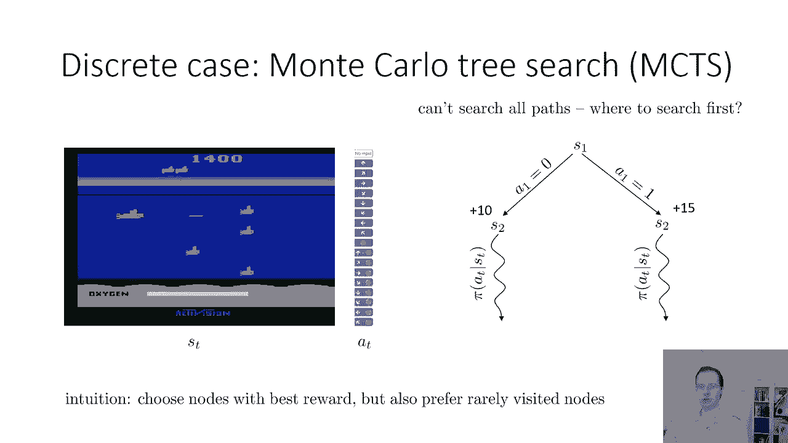
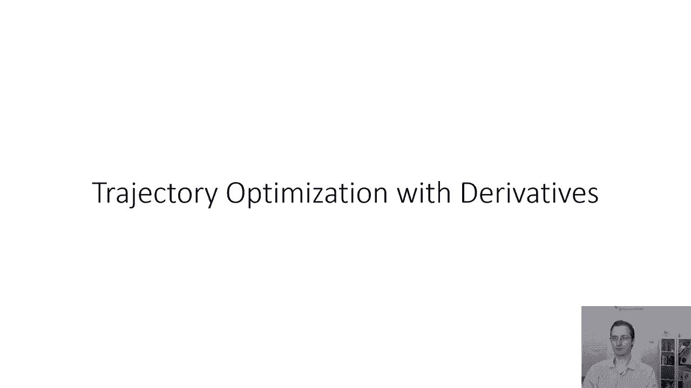

# P41：p41 CS 285： Lecture 10, Part 2 - 加加zero - BV1NjH4eYEyZ

好的，那么在讲座的下一部分，我将讨论一些关于开放环路规划的算法，这些算法对动力学模型的假设相当有限，因此，它们需要你知道动力学模型，但是，否则，它们不假设它是连续的还是离散的，是随机的还是确定的。

或者是否甚至可微，所以目前，我们将专注于开放环路规划问题，你在那里被给予一个状态，并且你需要生成一系列动作，这些动作将最大化你的回报，当你从那个状态开始，所以对于这个数学考试来说，这个想法并不是很好。

但对于许多其他有实际应用的问题来说，这个想法可能是很好的。

好的，所以我们将从一个方法类开始，嗯，这些方法可以被广泛地考虑为随机优化方法，这些方法有时也被称为黑箱优化方法，所以我们要做的就是，我们将首先抽象掉时间结构和最优控制器规划，所以这些方法都是黑箱。

这意味着对它们来说，你正在解决的问题是一个黑箱，所以它们不关心你的时间步长不同，你有一个随时间分布的轨迹，它们只关心你有一个最大化或最小化问题，所以我们将这样抽象这个问题。

我们将说我们只是在解决一些变量上的问题，从一至大写字母的t，有一个目标我将其标记为j，所以j度量预期的奖励，但对于这些算法来说，他们实际上并不在意那个，而且实际上他们甚至不在意动作是序列的。

所以我们将整个动作序列表示为大写字母a，所以你可以把大写字母a看作是基本上，就是a1到aT的拼接，所以这就是一个任意无约束的优化问题，解决这个问题的一种非常简单的方法，这可能一开始看起来真的很愚蠢。

基本上是猜和检查，所以你就从某个分布中随机选择一组动作序列，可能甚至均匀随机，所以只选择从一到大写的一个，嗯，然后您选择您的行动序列，您根据哪个是最大值选择一些ai，以j的索引为准。

我基本上选择最佳的行动序列，而不是最大化过，让我们说，一个值或连续值序列的行动，您只是最大化从一个到n的离散索引，那非常非常容易做到，只需要检查所有这些动作序列，然后选择奖励最大的一个。

因此得到一些检查，这种方法有时被称为随机射击方法，嗯，射击因为你可以，你可以把这一过程想象为，你选择这个动作序列，就像是随机向环境射击，你说，哦，如果我仅仅尝试用新的序列动作来执行，我会得到什么。

这可能看起来是一种非常糟糕的控制方法，但在实践中，对于低维系统和短时域，这种方法实际上可以工作得非常好，并且它有一些非常吸引人的优势，花一点时间来思考这些优势可能包括什么，所以。

这种方法的一个主要优势是它非常非常容易实现，编写这个只需要几分钟，在现代硬件上，它通常也非常高效，因为你知道当我们讨论学习模型时，后来的事情，当你的模型被表示为像神经网络这样的东西时。

实际上可以相当不错，能够评估多个不同行动序列的价值，并行，你可以基本上将1到n视为一种小型徽章，并通过你的神经网络模型评估回报，同时进行，然后arg max是max减少，所以通常非常。

在現代GPU和現代深度學習框架上實現這些方法的非常快速的方式，這種方法的缺點是什麼，好吧，你可能不會選擇很好的行動，因為你基本上在依賴於运气，你依賴於隨機樣本行動序列中的一個是非常好的。

我們有一種方法可以大大改善這個隨機射擊方法，同時保持其許多優勢的是什麼叫做交叉熵方法或CDM，交叉熵方法是一個很好的選擇，如果你想要為這些類型的控制問題設計一個黑盒優化算法，在低到中等維度。

低到中等時間視野，所以，我们的原始随机射击食谱是，从某个分布中选择一系列动作，就像均匀分布，然后选择arg max，所以在交叉对称方法中，我们将要做的是，我们将更聪明地选择这个分布。

而不是从所有有效的动作中完全随机采样，让我们说，在所有有效动作上的均匀分布，将选择这个分布来专注于我们可能认为好动作所在的区域，这将是一个迭代过程，所以，我们要更直观地做得更好的方式将是这样的。

假设我们生成了四个样本，这些样本看起来像这样，所以，横轴是垂直轴j的，我们即将做的东西的一个什么，我们将在新的区域（那里似乎更好样本位于）拟合一个新的分布，然后，我们将从那个新的分布中生成更多的样本。

再次拟合分布并重复，在做这个过程中反复，我们期望能够到达一个更好的解决方案，因为每次我们生成更多的样本，我们正在专注于似乎含有优质样本的区域，所以，我们可以通过以下方式实现这个想法，例如。

对于具有连续值动作的作物，我们可以迭代重复以下步骤，从某些分布中采样你的行动，P(a)的初始值可能只是均匀分布，然后评估每个行动序列的回报，然后选择被称为精英的东西，所以，精英是你n样本的子集。

所以你从那些样本中挑选m个，其中m小于n，且值最高，一种常见的选择是挑选你样本中值最好的10%，然后我们将重新拟合分布p，只针对精英，所以，例如，如果你选择你的分布为一个正态分布。

你将简单地拟合正态分布，找到对最佳m个样本（从n个样本中产生的）的最大似然拟合，然后你重复这个过程，然后你从拟合的分布中生成n更多的样本，评估他们的回报，选取他们的精英，找到一种新的分布，希望更好。

交叉进入方法有许多非常吸引人的保证，如果你选择一个足够大的原始分布，并且你生成足够的样本，交叉进入方法通常实际上会找到全局最优解，当然，对于复杂的问题，那个数量样本和那个数量迭代可能过于庞大。

但在实践中，压榨py可以工作得很好，并且它具有许多优势，所以因为你正在并行评估你所有的行动序列的返回，这对现代类型的深度学习框架非常友好，这些框架可以容纳小批量，方法不需要你的行动。

你的模式需要对行动进行微分，而且，它可以实际上被扩展到像离散行动这样的东西，使用其他分布类，所以通常你会使用高斯分布来处理连续行动，尽管其他类也可以使用，并且你可以使cem变得相当复杂，所以。

如果你想在这个类别中查看更复杂的方法，查看cm maes cm，它代表协方差矩阵适应进化策略，是cm的一种扩展，它包括一种动量风格的术语，如果你打算进行许多迭代。

然后cma es可以用较小的种群大小产生更好的解决方案。

好的，所以，这些方法的优点是什么，总结得很好，它们非常快，如果他们瘫痪，他们通常极其容易实现，嗯，什么问题，问题是他们通常有一个相当严厉的维度限制，你真的依赖于这个随机采样程序。

以获取你对潜在行动的良好覆盖，而且在重新拟合时，重新拟合你的分布，像我们在cm所做的那样可以帮助这种情况，它仍然构成一个主要挑战，而且这些方法只能产生开环规划，所以维度限制，嗯，如果你想要一种规则。

显然它取决于你问题的细节，但通常如果你有超过约三十到六十个维度，这些方法的机会可能会遇到困难，你偶尔可以忍受更长的序列，所以如果你有，假设我们有一个十维的问题，并且你有十五步的时间。

你实际上有一个一百五十维的空间，但是，连续的时间步是相互强烈相关的，所以这可能仍然有效，但是，一般来说，嗯，你知道，三十到六十维的工作效果非常好，如果你在做规划，经验法则，十维空间，超过那个。

你可能能做得更多。

然后你会开始遇到问题，好的，嗯，接下来我们将讨论另一种我们可以做计划的方法，实际上确实考虑了，嗯，你知道，封闭回路反馈，这是蒙特卡洛树搜索，蒙特卡洛树搜索可以同时处理离散和连续状态。

尽管它在离散状态中更常用，而且在棋类游戏中特别受欢迎，所以像阿尔法狗实际上使用了蒙特卡洛树搜索的变种，蒙特卡洛树搜索是机会型游戏的很好选择，所以扑克，例如，是蒙特卡洛树搜索的常见应用。

所以让我们这样思考蒙特卡洛树搜索，假设你想要玩一个阿塔里游戏，假设你想要玩这个游戏叫做seququest，你需要用鱼雷攻击一些鱼，我不知道你为什么要攻击鱼，这似乎是不道德的，但这是游戏要求的你做的。

游戏要求你从一个离散的动作集中选择来控制你的小型潜艇，你可以想象，如果你有一个模型，你可以从起始状态开始，看看会发生什么，如果你采取行动a1等于0，看看会发生什么，如果你采取行动a1等于1。

也许你只有兩個行動，并且你们都知道，每个行动都将把你置于不同的状态，每次你采取那个行动，你可能处于不同的状态，所以真正的动态可能是随机的，没关系，我们只需要多次采取行动，看看会发生什么。

然后对于你可能落在的每个状态，你可以尝试每个可能的值a2，等等，如果你实际上可以做到这一点，你将最终找到最佳的行动要采取，但这是不幸的是一个指数级的昂贵过程，所以没有额外的技巧，这个一般无约束的。

无约束的树搜索在每个层次需要指数级的扩展，这意味着如果你想控制你的系统t时间步，你需要的步骤是指数级的t，这对我们来说不好，我们不想要那样，那么如何可以近似一个状态的价值而不扩展整个树，嗯。

你可以想象当你到达某个节点时，让我们说选择深度，让我们说深度是3，我会扩展树到深度3，在3步后，我会做，我只会运行一些基础策略，也许这只是一个随机的政策，现在，我获得的值，当我运行那个基线政策时。

并不是真正地等于采取那些行动后的真实值，但如果我扩大足够的动作，尤其是如果我有一个像折扣因子这样的东西，那么，使用随机政策滚动可能会仍然给我一种关于这些状态的合理想法，本质上。

如果我降落在一个非常糟糕的状态，随机策略可能会做得很糟糕，如果我降落在一个非常好的状态，假设我降落在一个即将赢得游戏的状态，基本上任何动作都可能给我一个相当好的价值，所以它不是一个最优策略。

它不会给你精确的价值，但如果你足够扩大树并使用合理的回滚策略，那么它可能会很好，实际上，在实际操作中，蒙特卡洛树搜索实际上是一种非常好的算法，对于这种离散随机的设置，当你真正想要考虑闭环情况时，好的。

所以这可能一开始看起来有点奇怪，有点矛盾，但事实证明基本理念实际上工作得非常好，好的，我们现在不能，当然，搜索所有可能的路径，因此，我们需要用哪种路径来回答我们通常的问题。

蒙特卡洛树搜索首先搜索哪种路径，所以我们从根开始，我们有动作，一个a等于零，一个a等于一，我们首先从哪个开始呢，让我们嗯，让我们假设我们选择了a等于零，我们一开始对这些动作一无所知。

所以我们不得不任意或随机地做出那个选择，我们选择了一个等于零的动作，我们现在得到了一个奖励，值为加十，这里的加十指的是那个回滚的全部价值，所以它指的是我们从执行动作等于零中获取的东西。

然后现在我们运行我们的基准策略，到这个时候，我们并不知道加十是好是坏，它只是一个数字，所以我们必须采取其他行动，我们对其他行动一无所知，所以我们实际上无法真正权衡哪条路径更有可能探索。

让我们假设我们采取其他行动，然后我们将获得加十五的回报，记住，这个加十五指的是你从采取行动a等于1中获得的总奖励，再加上运行你的基础策略，然后，我们现在必须记住一个非常重要的事情。

我们在一个随机系统中规划，这意味着如果我们再次采取a等于0并再次运行那个随机策略，我们可能不会再次获得加十，我们可能会得到其他东西，我们可能会得到其他东西，因为我们的政策是随机的，而且。

因为相等的结果为一的结果也是随机的，所以这些值应该被视为基于样本的估计值，以真实值为准，嗯，采取行动的值，好的，所以，到这个时候如果我们看到这两个结果，我们可以得出的一个合理结论是。

行动一比行动零稍微好一点，我们并不确定，我们可能会犯错误，但是我们只采取了一次这两种行动，其中一种行动最终产生了更好的结果，所以如果你真的需要选择探索哪个方向，也许我们应该探索产生更好回报的那个方向。

所以直觉是你选择回报最好的节点，但是你更喜欢很少被访问的节点，所以如果一个节点以前从未被访问过，你真的需要尝试它，因为你没有任何方法知道它的回报是好是坏，但是现在我们可能想要探索正确的子树。

好的，那么让我们尝试将这个形式化为实际的算法，这里是一个通用的mts方法概述，首先，我们将当前的树拿过来，找到一颗叶节点sl，使用一些树策略，术语'树策略'并不指的是你在世界上运行的实际策略。

它指的是一种查看树的策略，选择哪个叶节点进行扩展，第二步，你扩展那个叶节点，使用你的默认策略，在这里，'默认策略'实际上指的是一个真实策略，"就像我之前的那个随机政策"，"你怎么让叶子展开得好"，记住。

树的节点对应于动作序列，"实际上执行多次的同一动作序列可能会导致不同的状态"，"所以，评估一片叶子的方法是"，"你是否从初始状态开始"，"一"，"然后，你在道路上采取所有行动。"，"从那片叶子到根部"。

"然后按照"，嗯，这就是默认策略，所以你不会直接传送到一个任意的状态，你也可以做传送的事情，这也会给你真正一个明确的算法，但通常你会实际上执行相同的行动序列再次，以实际上给他们机会导致不同随机的结果。

因为记住你想要的预期最佳的行动，然后步骤三，更新树中从s1到sl的所有值，然后重复这个过程，然后一旦你完成，你从根节点选择最佳行动，在mts中，通常，每次实际运行规划过程时，你都会重新运行整个过程。

每一步，所以你将从根节点选择最佳行动，然后世界会随机向你呈现一个不同的状态，然后你将再次从头开始规划，好的，所以，我们的树政策最初无法做任何事情聪明，如果我们没有扩大任何动作，你只需要尝试动作零，然后。

你用默认策略评估它，然后，然后，你在s1和sl之间的树中更新所有价值，这里是s2，在这里，我们看到我们收集了一个返回值，它是10，我们还记录了我们访问该节点的次数，它是1，现在我们必须扩大其他，嗯。

我们不能执行的动作，在没有进一步扩展的情况下，我们不能对它说任何有意义的事情，所以我们去扩展动作一，在那里我们得到了返回值十二，n等于一，因为我们只访问了一次，所以对于树策略来说。

这是一个非常常见的选择，嗯，这是ut树策略，基本上遵循以下食谱，如果某个状态还没有完全扩展，在该状态中选择一个新的动作，否则选择该状态的最佳子状态，得分将稍后定义，然后您递归应用这个，所以本质上。

这个树策略从根节点s one开始，如果根节点的某个动作没有扩展它，那么您扩展它，否则，您选择得分最高的子节点，然后递归，所以这里，您知道，对于任何合理的分数值，我们都会选择s two。

因为他们都被访问相同的次数，但是s二的值更大，因此我们将去为s二扩展一个新的动作，也许我们现在可以得到返回，即在那个叶子节点的n值现在是一，但是记住mct的第三步是将所有值传播回根，因此我们也更新s二。

给它，嗯，n等于二，q等于二二，所以本质上每次我们更新一个节点，我们将新值添加到其旧值中，并且我们将其计数加一，我们可以总是通过将q除以n来恢复某个节点的平均值，我可能会提到当你看到这些索引时，s一。

s二，s三，这些数字只是引用时间步，记住这些节点并不唯一索引状态，如果你采取相同的动作序列两次，你可能得到一个不同的状态，但我仍然指的是s二或s三，因为它是时间步二的状态，或三的状态。

所以实际的状态是随机的，好的，所以现在我们有一个选择要做 uh，我们有两个可能的，嗯，从根的选择，一个导致q等于十，n等于一的节点，另一个导致q等于二二，n等于二的节点，所以行动一仍然导致更高的平均值。

是十一，但行动零导致另一个被访问较少的节点，所以这里选择得分的非常非 trivial，在mts中，有许多可能的得分选择，但一个非常常见的选择，是这个uct规则，基本上是根据节点的平均值选择节点。

所以q over n加上对较少访问节点的奖励，所以一个常用的奖励在这里被写为，它是两倍，一个常数的平方根的两倍，自然对数的当前节点的计数，除以目标节点的计数。

所以分母基本上指的是当前节点的每个子节点的访问次数，直觉是，子节点访问的次数越少，你就越想采取相应的行动，所以这里行动零的节点有一个分母为一，行动一的节点有一个分母为二，所以a一等于零有一个更大的奖励。

分子是两倍，自然对数的当前节点的访问次数，并且这主要是为了考虑到如果你只访问了一些节点，嗯，一个非常小的次数，那么你想要优先考虑新颖性，更多，如果你访问了一个节点一个非常大的数量。

那么然后你可能对一个节点的值有一个更自信的估计，好的，所以在这种情况下，我们可能实际上会选择访问这个节点，一个等于零，尽管它的平均值更低，它的n值也较低，所以它会得到一个更大的奖励，这可能超过值差异。

如果常数c足够大，然后当我们访问那个节点时，我们必须只是扩展一个任意的新动作，因为我们不知道其他任何事情的值，然后这里我们记录q等于十二，N等于一，我们再次将其传播回根节点，所以到最后，到和，到父节点。

在队列中，到父节点的q，现在我们有两个具有相同值的节点，他们都是十一，所以我们必须以某种方式打破这个平衡，我们到这里来，我们得到q等于八和n等于一，现在，这个节点的值变为三十，分母是三，现在。

花一点时间来思考mts将如何行动，是的，它必须向右走，因为然后对应于动作的节点，一个等于一，具有更大的值和更低的访问次数，这就是我们要做的，然后如此等等，所以然后这个过程将递归进行一些步骤。

你需要根据你的计算预算来选择你的步骤，一旦你的计算预算耗尽，然后您将采取导致具有最佳平均回报节点的动作，好的，如果你想要了解更多关于mts的信息，我强烈推荐这篇论文《蒙特卡罗树搜索方法的综述》。

它提供了一种一般的高级概述，mct方法很难从理论上分析，实际上，它们只有很少的保证，但它们在实践中工作得非常好，如果你有一种某种类型的游戏机会，那么你可能会有一种某种类型的游戏机会，在存在随机性的地方。

这种算法通常被认为是一个非常好的选择，当然，有很多方法可以使mts更加聪明，例如，通过实际学习你的默认策略，使用你最好的策略，你可以使用价值函数来评估终端节点和如此等等，如果你将这个推向极端。

你会得到类似的东西，嗯，例如，阿尔法狗实际上做了什么，这是一种结合了mts和强化学习的组合。

