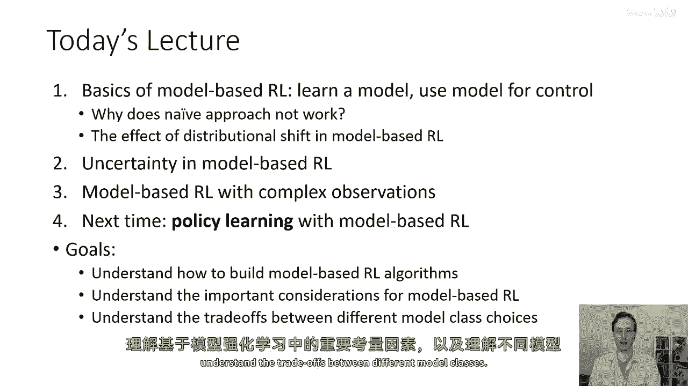
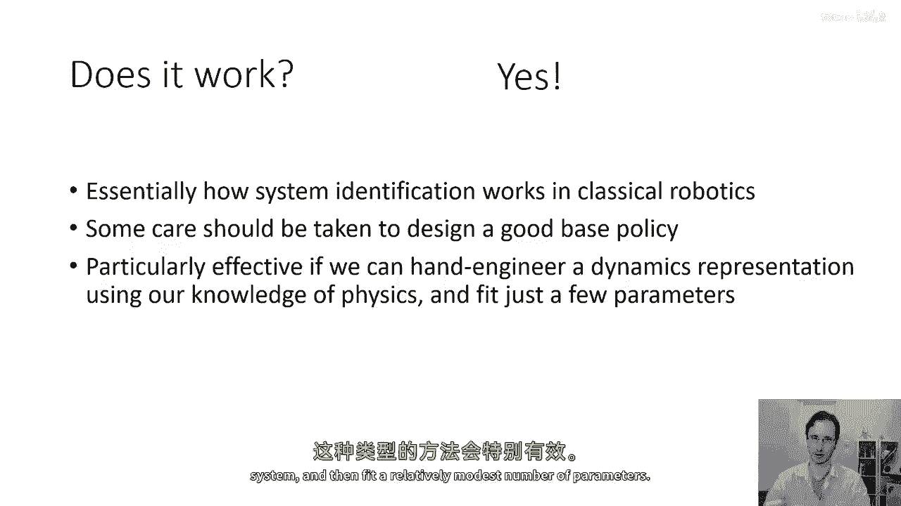
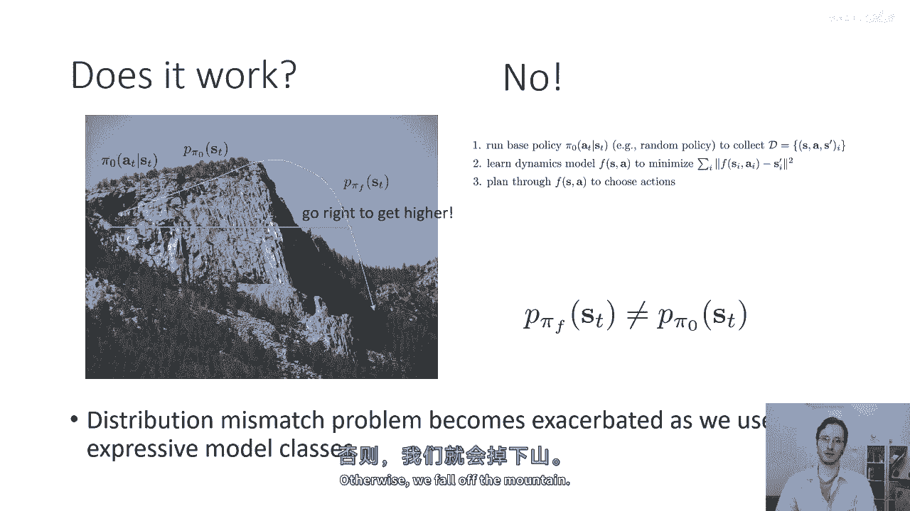
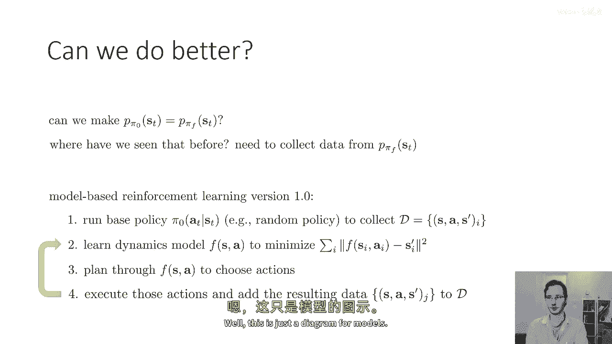
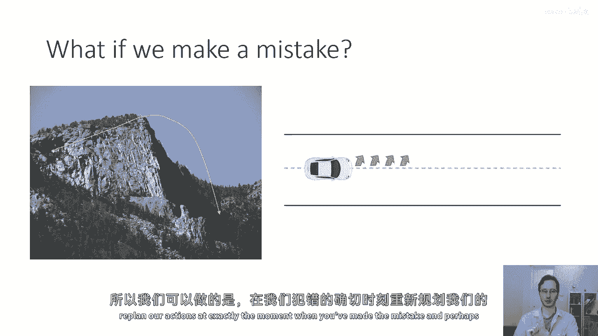
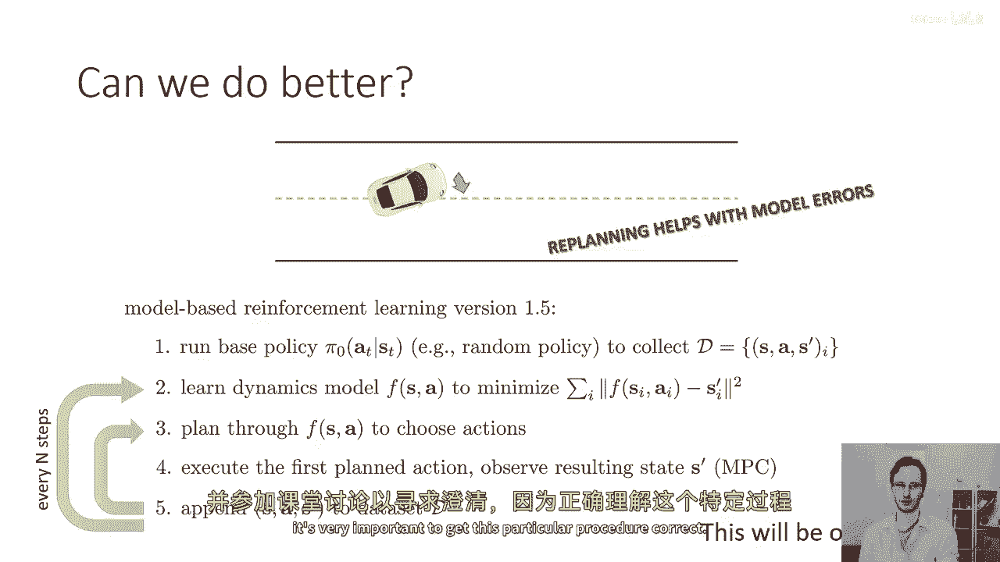
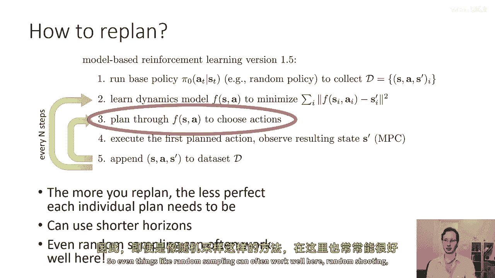
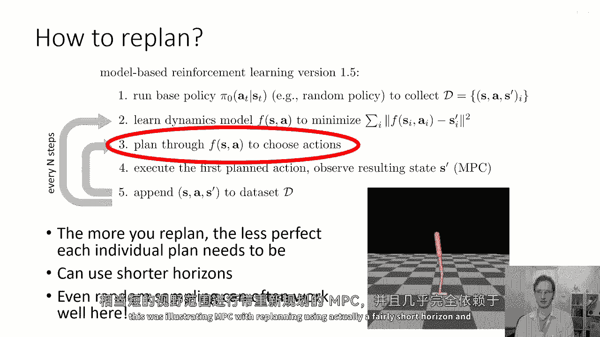
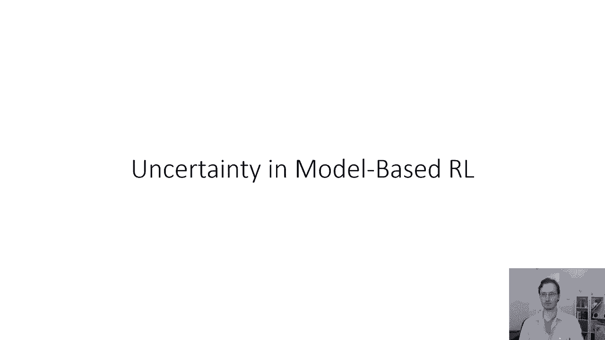

# P45：p45 CS 285： Lecture 11, Part 1 - 加加zero - BV1NjH4eYEyZ

欢迎参加今天的计算机科学285课程第十一讲，我们将讨论基于模型的强化学习算法，首先，我们将讨论基于模型的强化学习的基本概念，我们如何学习模型，然后，我们将使用此模型进行控制。

我们将讨论解决这个问题的一种朴素方法，我们将讨论几个候选算法，然后，我们将讨论这些算法的一些问题，我们将讨论基于模型的强化学习中分布漂移的影响，然后，我们将讨论基于模型的强化学习中的不确定性。

了解不确定性如何对算法性能产生重大影响，然后我们将讨论基于模型的强化学习，观察复杂，然后下一次我们将讨论如何使用基于模型的强化学习来学习策略，所以今天讲座中我们将讨论的所有算法，只学习模型。

然后他们使用前一次讲座中算法等来规划通过这个模型，而下一次我们将讨论我们如何也能使用模型来学习策略，所以今天讲座的目标是理解，如何构建基于模型的强化学习算法，理解基于模型的强化学习的重要考虑因素。

并理解不同模型类之间的权衡。

那么我们应该如何让模型学得好，如果我们有一些动态估计，例如，一个函数f(s， t， a， t)返回s， t加一，然后，我们可以简单地使用上周的所有工具来控制我们的系统，而不是必须处理，嗯。

在随机情况下的无模型强化学习算法，我们将学习一个随机模型，其形式为p(s， t加一)，给定s， t， a，在今天的讲座中，我将讨论的大部分算法，我将以确定性模型来呈现它们，形式为f(s， t， a。

 t)等于s， t加1的算法，但是，几乎所有这些想法都可以同样地使用，与学习下一个状态分布为概率模型的模型，当这个区别显著时，我会明确指出，所以，让我们思考如何从数据中学习f(s， t， a， t)。

然后通过它来规划我们的行动，我们可以想象一个非常简单的基于模型的强化学习算法原型，我将将其命名为版本零点五，它并不是版本一点零，它并不是你想要使用的东西，但它可能是我们开始思考最明显的事情。

在这个基于模型的强化学习版本零点五算法中，第一步将是运行一些基本的探索策略来收集一些数据，并且这个探索策略可能只是一个完全随机的策略，所以它不是神经网络或任何类似的东西。

它只是随机选择动作并收集一个过渡数据的集，所以这里一个过渡是一个元组s， comma，一个逗号后的首项，我们看到了状态s，我们采取了行动a，然后我们到达了状态s的首项，这就给了我们我们的过渡。

我们将有一个包含这些过渡的数据集，我们可以使用这个数据集来，然后使用监督学习来训练我们的模型，所以我们将学习一个动力模型，F(s， a)，那最小化我们数据集中的所有点的平均值。

f_s_i_i和si的首项之间的差异，如果你的状态是离散的，那么你可能使用交叉熵损失，如果你的状态是连续的，你可以使用像平方误差损失这样的东西，最一般地，你将使用负对数似然损失。

其中平方误差是正态似然损失的特例，然后一旦你训练了你的动力模型，你将使用你的模式来去选择行动使用，例如，我们上周覆盖的任何算法，所以，这个基本食谱在很大程度上是否工作，是的，所以，在某些情况下。

这个基本食谱将工作得非常好，实际上，有许多先前提出的方法已经利用此食谱，这基本上是经典机器人中的系统识别工作方式，所以，如果你如果有机器人背景，如果你听说过系统识别。

系统识别基本上指的是从一些数据中提取未知参数的问题，并使用这些数据来识别动力模型的未知参数，通常，在这种方式中被识别的参数，并不是像神经网络中的权重那样，它们可能 是已知物理模型的未知参数，所以。

你可能有你机器人的方程式，但你不知道不同部分的质量或摩擦系数，你会识别这些，这就是为什么这个被称为系统识别而不是系统学习，所以你实际上对系统知道很多，只是识别几个未知数，当你使用这种程序时。

你需要在设计一个好的基础策略时小心，因为那个良好的基础策略需要探索系统的不同模式，如果你的系统可以对不同的状态做出不同的反应，你需要看到所有可能引发不同反应的状态的代表性例子，所以。

如果你没有访问过大的区域，你可能会得到一个关于你参数的错误识别，它不会很好地模型那个区域，但这种方法如果可以手工工程一个动力表示，可能会特别有效，也许使用你对物理的知识，或者使用你对系统的知识，然后。

拟合一个相对较小的参数数量。

一般来说，然而，这种方法实际上不能与大型高容量模型很好地工作，比如深度神经网络，并且要理解为什么那是这样，让我们考虑一个简单的例子，假设我正在试图在这座山上行走，我想要到达山顶，所以。

我的过程将是首先运行一个基础策略π零，就像随机收集我的数据集一样，所以也许我实际上在山上做随机行走，然后我将使用这次随机行走的结果来学习我的动力学模型，所以这是我的策略π0。

也许只是一个产生了一些数据的随机策略，我将使用它来学习f，我想要到达山顶的最高点，所以我将问f预测我将有多高，如果我采取某些行动，然后我现在将为我走过的这部分山脉规划，看起来往右走会让我升高。

所以从我从这个π零政策得到的随机数据中，我的模型可能会发现你走得越右，你的海拔就越高，这是基于那个数据的一个非常合理的推断，所以当我然后通过那个模型来规划我的行动时，嗯，你认为接下来会发生什么。

所以我要陷入困境，我要陷入困境，由于我们实际上见过类似的原因，所以我用来训练我模型的数据来自由策略诱导的状态分布，π零，我们可以称这个为p π零 s t，花一点时间来思考为什么。

使用基于p π零 s t的训练模型可能会导致一些非常糟糕的结果，然后，我们使用那个模型来规划作为提示，嗯，这个问题的答案是我们在之前的几次讲座中见过的，所以，问题基本上如下，问题是当我们通过模型规划时。

你可以把那个规划看作是执行另一个政策，我们可以叫它pi f，因为f是模型，pi f是由那个模型诱导的政策，Pi f不是一个神经网络，Pi f只是在模型f上运行的规划算法，所以pi f完全由f决定。

它有自己的状态分布，它的状态分布是p pi f of st和uh，在这种情况下，那个分布涉及到走向非常右边并从山上滑落，问题发生的原因在于p，p pi st不等于p pi zero st。

所以我们正在经历分布的偏移，这种分布偏移的问题如何表现出来，是我们的模型适用于估计在数据收集期间访问的区域的行动结果，意味着对于p pi zero st概率高的状态，但是当我们根据那个模型规划时。

当我们为模型产生最高奖励状态的行动选择时，那些上升最多的行动，就是那些最成功的，在我们的规划过程中，我们将最终去一些州，几乎那些在p pi zero下概率非常低的州，并且在那些州。

我们的模型将做出错误的预测，并且在那些州，它做出错误的预测的内容是什么，然后，它将在那个错误的预测状态下选择最佳的行动，将那个反馈输入到自己中，然后，对于下一个状态，它将做出甚至更错误的预测。

这基本上就是我们之前谈论的模仿学习中看到的现象，实际上，两者有着非常密切的对应性，因为你可以将完整的轨迹分布视为政策时间的乘积，动态时间，政策时间，动态时间，政策等等等等。

所以如果你可以通过调整政策来体验分布变化，你可以，当然，也可以通过调整模型来体验分布变化，所以随着我们使用更表达性强的模型类，分布不匹配现象会加剧，因为。

更表达性强的模型类将更紧密地适应训练数据中看到的特定分布，在前一滑片中的系统识别例子中，如果我们有，让我们假设一架飞机，我们在拟合，你知道，三个数字，如某些阻力系数，升力系数等等，而且。

我们可以实际上过度拟合到训练数据的狭窄区域，但是只有3个数字，而且那些数字只有这么多种方式可以被选择来适应训练数据，到目前为止，模型，如果真实的模型在我们的学习模型类别中。

那么我们可能会正确地得到那3个参数，这就是为什么系统识别在机器人中基本上起作用，但是当我们使用高容量模型类如深度神经网络，然后这种分布变化就变成了一个真正的大问题，我们必须做些什么来处理它。

否则我们就会掉下山坡。

那么我们能否做得更好，花一点时间来想象我们如何根据强化学习算法修改模型，版本零点五以减轻分布性偏移问题，所以我们可以做到这一点，嗯，是嗯，我们可以借鉴我们之前谈论的dagger中类似的想法。

在dagger中，我们也提出了这个问题，我们可以使一个政策的状态分布等于另一个政策的状态分布吗，我们为dagger回答这个问题的方式是通过收集更多的数据，并请求对该数据的真实标签，现在用匕首。

这是因为获取真实标签需要，要求人类专家告诉我们在基于模型的强化学习中的最佳行动是什么，这在基于模型的强化学习中实际上要容易得多，你不需要问任何人类专家下一个状态是什么。

你可以简单地在一个特定状态下采取一个特定行动，然后观察自然中的下一个状态，这意味着收集更多的数据，因此，我们可以得到一种基于模型的强化学习版本1。0，我称这个为1。0，这是因为从理论上讲。

这种基于强化学习的方法可能是最简单的模型，它通常工作，至少在概念上，尽管这句话后面附有许多星号，在实现它方面，以便它能够良好工作，所以程序是这样的，第一项，运行你的基本色略来收集数据，就像以前那样。

第二项，从数据中学习你的动力学模型，就像以前那样，第三项，通过你的动力学模型来规划选择动作，并且第四步是执行这些动作，将结果数据添加到你的数据集中，然后返回第二步。

所以主循环包括使用所有现有数据训练动力学模型，通过它规划以收集更多数据，将那个数据添加到你的数据集中并重新训练，它本质上就像dagger，只是为模型，尽管有一些陈述有些过时。

因为这个程序实际上在dagger出现之前就存在于文献中，但在这个课堂上我们以相反的顺序呈现它，所以你可以认为它是基于模型的dagger，所以，这个食谱从原则上来说是可行的，实际上。

它确实可以减轻分布性偏移，从原则上，你应该得到一个工作良好的模型，所以，我们在哪里以前见过这种情况。

这只是对模型的匕首，好的，所以，到这个阶段，你已经有了版本1。0，这是一个可行的算法，你可以实际上使用那个算法，但我们还可以做得更好，所以首先让我们问这个问题，如果我们在正确的时候犯了错误怎么办。

所以从悬崖上掉下来，它相当突然，所以如果你从悬崖上掉下来，你意识到你犯了错误，但当那时已经太晚了，而且你没有什么可以做的了，但许多实际问题并不像那样，让我们说，你是在驾驶一辆车，并且你的模式有一些错误。

所以，你的模式预测你会直行，但如果你的方向盘指向直行，但如果你的方向盘稍微向左偏，所以，模型只是稍微有点偏差，它说，如果你像两度向左偏转，那么，你将以相当无辜的错误在一个复杂的动态系统中直行，所以。

如果你这样做，那么，当你实际上执行你的模式时，你将稍微向左偏转，而不是直行，然后，你将再次向左偏转，一次又一次，随着你收集更多的数据，这种迭代的数据收集应该修复这个问题，所以，最终。

这种方法仍然会做正确的事情，然而，我们可以做得更好，并且我们可以通过立即纠正错误来使它学习得更快，当他们发生时，而不是等待整个模型更新，所以，我们可以做。

我们可以在您犯错误的那一刻精确地重新规划我们的行动。

并可能纠正它，所以，你可以做得更好的方法是看看你实际上从采取那个行动后的状态结果，然后问你的模型在这个新状态下你应该采取什么行动，而不是继续执行你的计划，这就是我们要叫的模型驱动强化学习版本1。5。

这在文献中经常被称为模型预测控制或NBC，这是我在之前的讲座中短暂提到的，所以，这里的想法就像以前，运行你的基线政策，训练你的动态模型，通过你的动态模型规划一系列的行动，但然后只执行第一个计划的行动。

观察从采取那个行动后的实际真实状态，嗯，然后计划再次，所以你将那个过渡添加到你的数据集中，而不是等待那个整个行动序列完成，你立即重新规划现在，这比每次时间步都要计算上更昂贵，因为你必须重复规划，但是。

通过这种方法，你可以，嗯，用更差的模型做得更好，因为你的模型可能没有意识到，你知道稍微向左打方向盘不会让它走直线，但是一旦它实际上已经向左偏了，到那个点，错误那么大，它可能可以理解到，好的。

现在我真的需要向右打方向盘才能从这里出来，这种模型预测控制过程可以更加 robust，到模型中的误差，嗯，而不是我之前在幻灯片上展示的简单一点零程序，然后当然，每个外部循环步骤n。

你重复这个过程并重新训练你的模式，在这里，n可能是你轨迹长度的一些倍数，所以，实际上，这个版本一点五的程序基本上总是比前一个版本更好工作，主要的考虑因素是它大大增加了计算成本。

所以重新规划基本上帮助避免模型错误，嗯，你的家庭作业基本上涉及实现一个算法，它基本上做这件事，所以，如果这个程序对你来说还不清楚，请确保在评论中提出问题，并来课堂讨论中提问，询问澄清。

因为正确执行这个特定程序非常重要。

好的，所以，我们现在可以问一个问题是，我们应该如何重新规划，所以，我们通过f(a)如何选择行动，直觉是，你重新规划的次数越多，"每个个体的计划越不完美，就越需要"，"在实际应用中。

重新规划的计算成本可能会非常高"，"因为你要重新规划和修复你的错误"，"在这个重新规划过程中，你可以稍微容忍更多的错误"，"所以，当人们实际实施这个程序时，他们会做一件非常普遍的事情"。

"他们对第三步的视野是否更短"，"如果他们在制定一个标准的开环计划，就不会这样"，"他们仅仅依赖重新规划来修复那些错误"，"所以，甚至连像随机抽样这样的东西在这里往往也能很好地工作"。

"随机射击"，尽管它们可能不适合构建一个长期的开放循环计划。

如果你还记得上周末课堂上展示的演示，这是用实际较短的时间范围来演示NBC的再规划。

