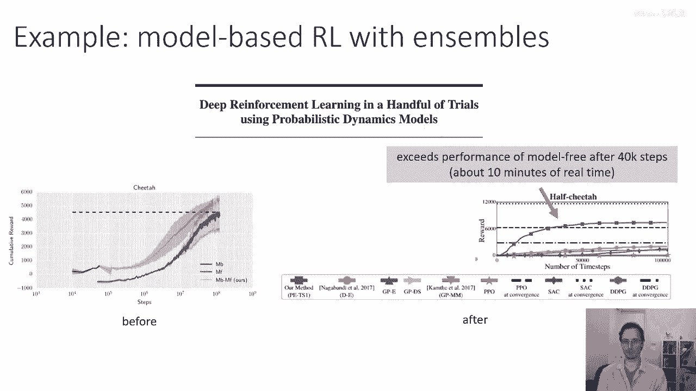
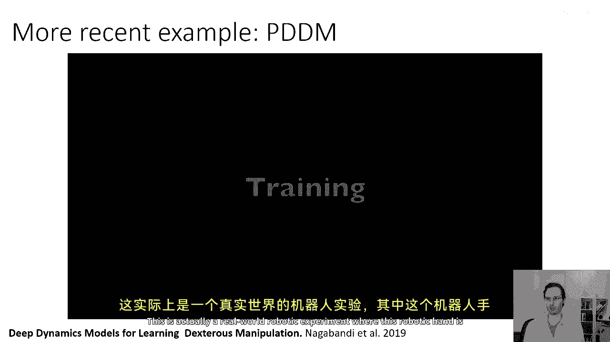
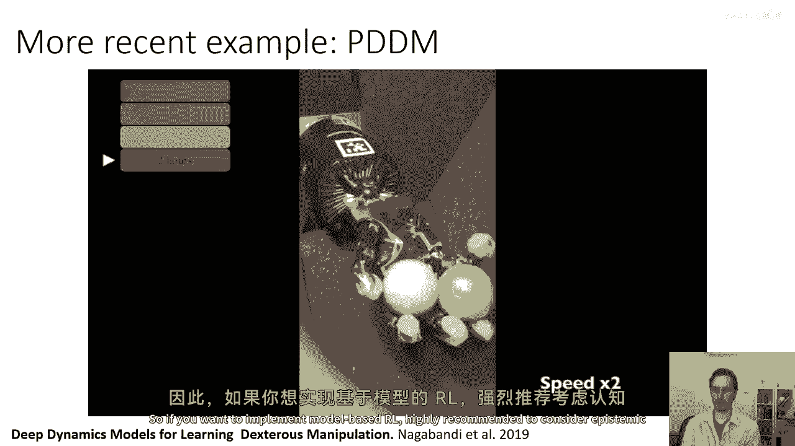
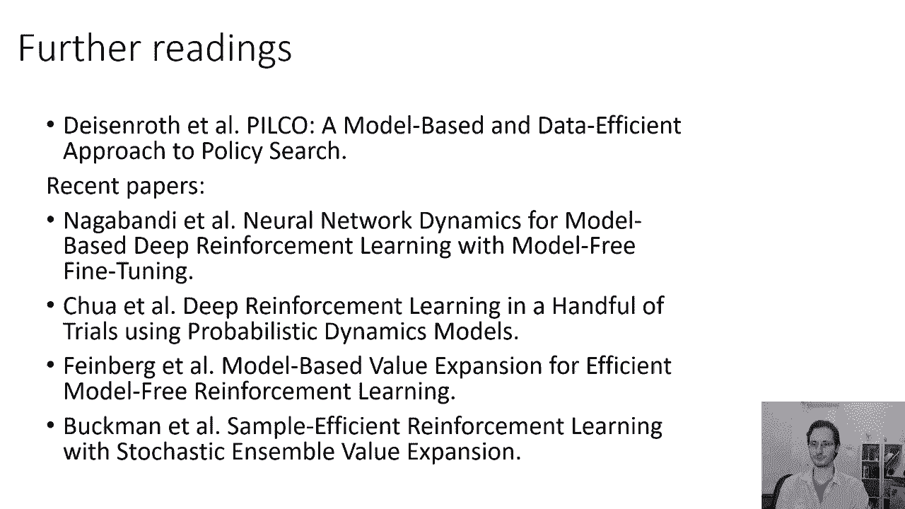

# P48：p48 CS 285： Lecture 11, Part 4 - 加加zero - BV1NjH4eYEyZ

好的，接下来，让我们简要讨论一下如何使用这些考虑不确定性的模型进行控制，然后，让我们通过一些例子来了解一些，嗯，已经有一些实际使用类似东西的论文，好的，所以假设我们已经训练了我们的考虑不确定性的模型。

也许通过使用Bootstrap集成，现在我们想在我们的基于模型的强化学习版本中使用它，1。5算法来实际做出决策，当我们在规划之前，我们实际上在，优化以下目标，我们正在优化从t等于一到h的奖励和。

在状态s t a t处的奖励和，其中s t plus one等于f of s t a t，所以无论你使用随机射击cm，无论，这实际上是你在解决的问题，现在我们有uh n可能的模型。

"我们想要干的事情是选择一系列的行动"，"一个通过h的参数，它能在所有模型上平均最大化奖励"，"所以现在我们的目标是对模型进行求和"，"时间一次除以n的和时间求和的和"。

"根据该模型预测的州的奖励步骤"，"其中，逗号'，'i'由模型的动力学给出"，我，"所以，如果我们学习到一个确定性模型的分布，这就是这种情况。"，"如果你有随机模型"，然后嗯，对于每个模型。

你有对其分布预期的期望，因此，一般来说，对于一些候选动作序列，从1到h，第一步是从给定d的条件下，从p(θ)中采样一个模型，如果你有一个Bootstrap集成，这就意味着随机选择n个模型中的一个。

第二步在每个时间步采样st，再加上从p(st)和给定sdat的条件下采样的一个，以及你从后验中采样的那个参数向量，步骤三是，计算奖励为所有时间步的总和，嗯，对于预测的状态，然后步骤四是重复步骤一到三。

以积累必要的平均奖励，所以这将是任何一般表示给定d的后验b theta的食谱，如果你有一个Bootstrap集成，你也可以对所有模型进行求和，而不是采样它们，这对于你有少数模型的情况可能会更简单。

如果你用如贝叶斯神经网等其他方法估计你的后验，然后你可以采样多个不同随机参数向量，并估计每个的奖励，现在这不是 uh，你唯一能有的选择，这是一种采样程序，用于评估奖励，你可以想象其他程序，例如。

你可以在每个时间步长从每个模型中评估可能的下一个状态，然后进行类似于时刻的操作，匹配近似来确定实际状态的估计，实际状态分布p(s_t+1)的分布，例如，通过估计其均值和方差，其他方法也做了类似的事情。

但是，一个简单的方法是使用这个，嗯，嗯，这个我在这个幻灯片上的过程，来评估每个候选动作序列的总奖励，从一到h，然后，使用您喜欢的优化方法优化动作序列，如随机射击或交叉熵方法，也是可能的适应 uh。

连续优化方法如lqr到这个设置，那么在这种情况下，有一种叫做重新参数化技巧的方法非常有用，我们将会讨论这个，下周，好的，所以花一点时间来浏览幻灯片，确保这真的对你来说有意义。

这是一张非常重要的幻灯片需要理解，如果你想知道如何实现基于模型的强化学习，带有知识不确定性，好的，这个基本方案是否起作用，嗯，好吧，嗯，这里有一些图表，我要展示。

这些来自一篇叫做深度强化学习和几轮试验的论文，所以在我们看到在半马赫猎豹任务中，这个基于模型的强化学习版本，1。5算法可以使我们从奖励为零达到约500。

如果我们实际上使用Bootstrap集成来实施知识不确定性，然后我们可以使用基于模型的强化学习来获得过六千以上的奖励，与一个五算法的时间大致相同，所以尤其是在数据量少的情况下。

这些知识不确定性估计确实在性能上产生了很大的影响。

这里是一个使用模型基于强化学习方法的更 recent 示例，其中包含一个模型的ensemble，这实际上是一个真实的机器人实验。

在这个实验中，这个机器人手在掌心操纵物体，这实际上是使用基于模型的强化学习版本的一个点五，一个特别复杂的模型和一个用于不确定性估计的ensemble，嗯，这一手通过直接与这些物体交互来学习，大约三小时。

它们可以使用两只物体在手掌中完成完整的旋转，所以这是一点，五小时，有两个小时，它可以完成完整的一百八十度旋转，然后，四个小时后，它可以做得相当可靠，所以关于不确定性估计似乎确实起作用。

它似乎对于这些基于模型的rl方法来说非常重要，所以，如果你想实现基于模型的rl，强烈推荐考虑知识不确定性估计。

如果你想要了解更多关于知识不确定性和基于模型的强化学习，马克·迪恩罗斯的这篇论文，被称为皮尔科，这是一篇来自大约二一一年的较旧的论文，这篇论文使用高斯过程而不是神经网络进行模型学习。

但这是建立知识不确定性估计在基于模型的强化学习中重要性的一种基础性论文，并讨论了为什么它重要，有一些关于它重要性的好讨论，所以我鼓励你阅读这篇文章，如果你对这个主题感兴趣，最新的论文。

这是基于模型的强化学习版本，我之前提到的1。5篇论文，它做得还可以，但在半人马座上表现不佳，这是引入了，基于模型的强化学习集成和成功地获得了与模型自由强化学习类似的结果，这是一篇我鼓励你查看的论文。

如果你特别对基于模型的和基于模型的强化学习（RL）的交叉点感兴趣，这种方法使用模型来估计价值函数，这是另一个，嗯。

