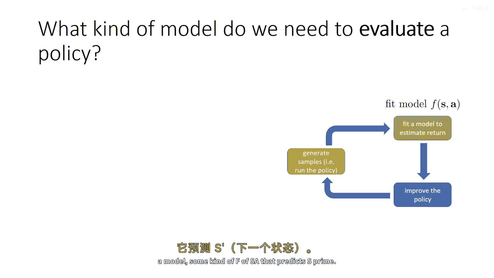
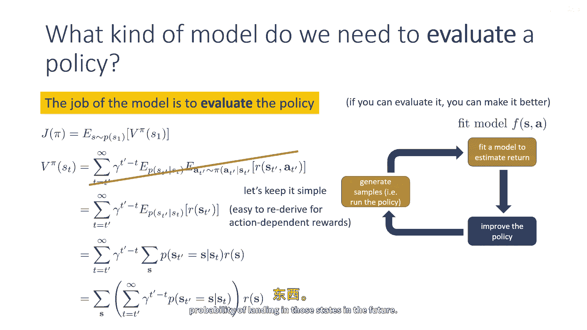
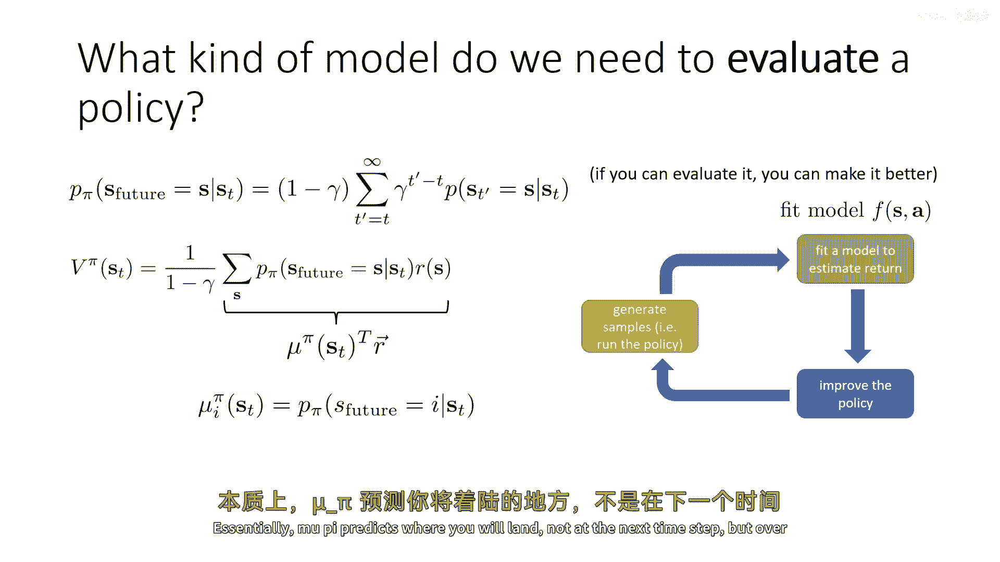
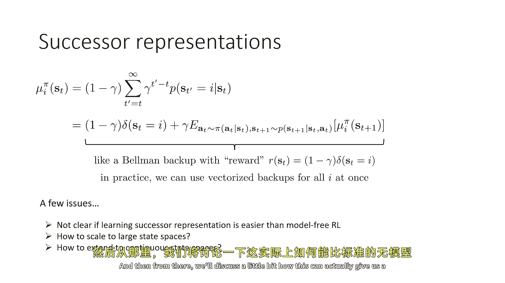
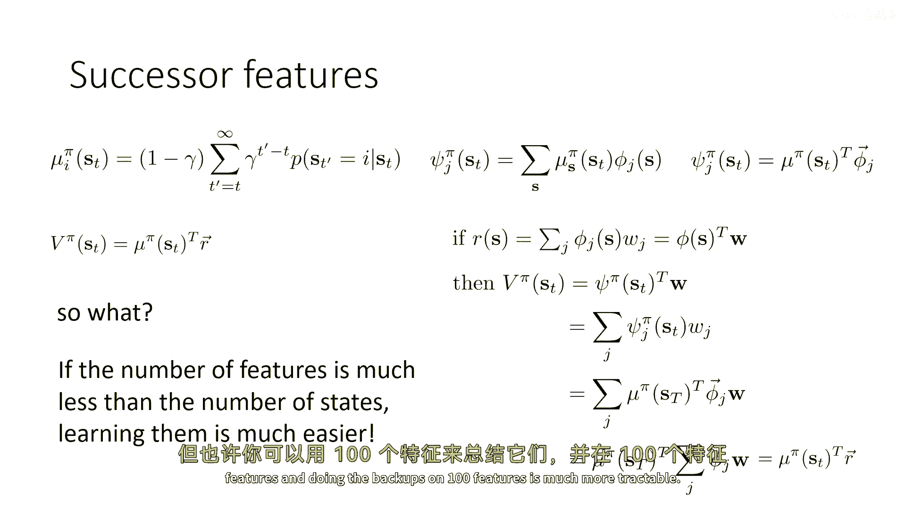
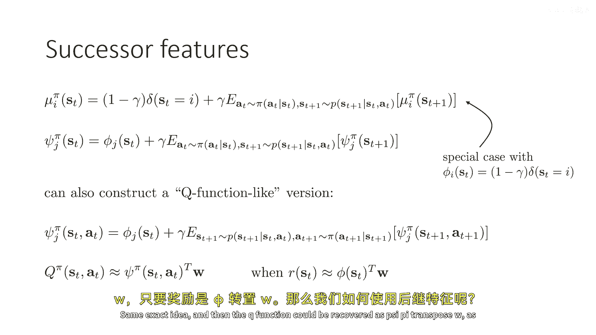
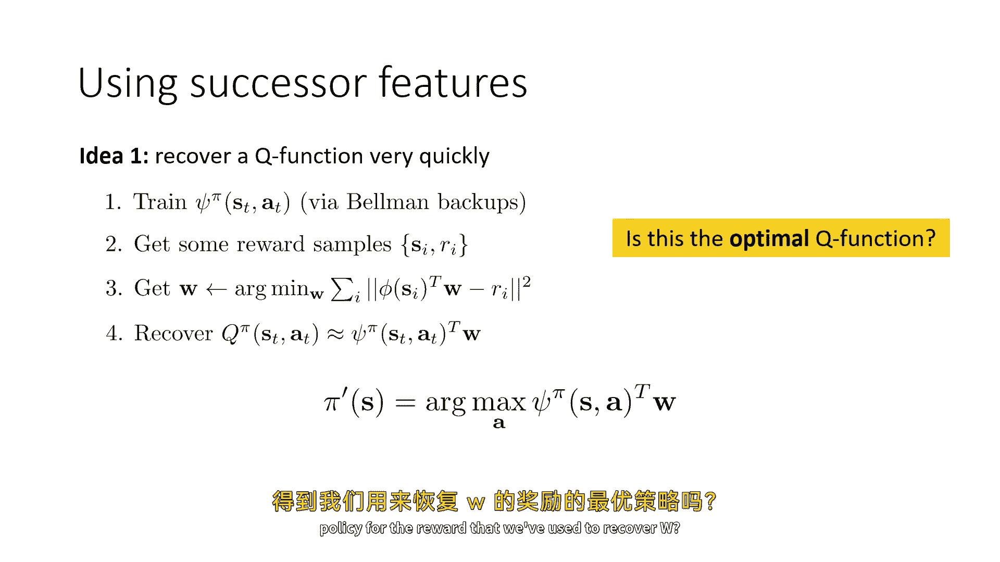
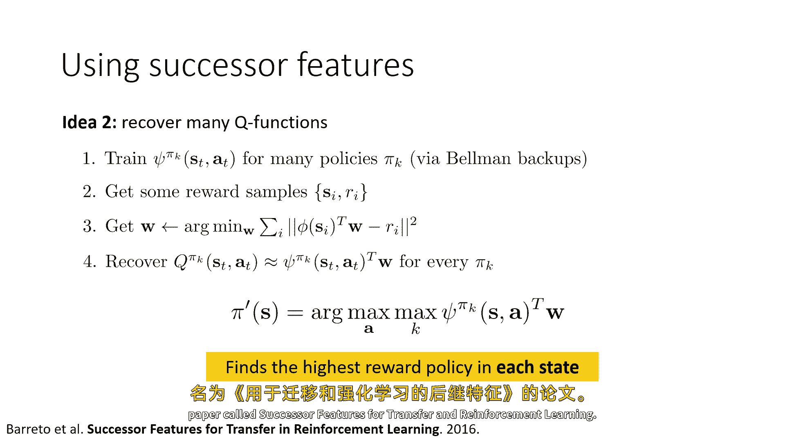
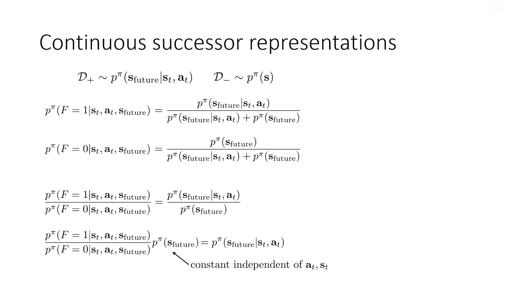
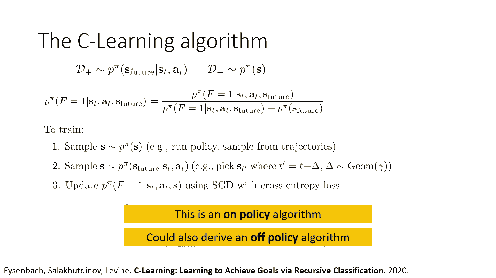

# P53：p53 CS 285： Lecture 12, Part 4： Model-Based RL with Policies - 加加zero - BV1NjH4eYEyZ

好的，在今天讲座的最后一部分，我们将讨论一些不同的东西，我们将远离这些经典的模型，这些模型试图代表下一个状态的概率，这个讲座的部分有点先进，它确实与主流的基于模型的强化学习有些偏离。

但我想告诉你这些想法，因为我确实认为它们很有趣，他们可能会给你一些关于最终项目的想法或者，更广泛地说，关于未来模型驱动强化学习可能发展的方向，但是请记住，当我讨论这些时，这已经深深地涉及到了，嗯。

当前的研究状态和一些尚未完全形成的事情，基于模型的强化学习算法，但是只是一些关于在强化学习中可能有用的概念和想法，也许在未来，所以让我们从这个问题开始，我们需要评估哪种模型来评估政策，到目前为止。

我们只是假设当我们进行基于模型的强化学习时，我们学习的模型预测下一个状态，给定当前状态和动作，从某种角度来看，考虑模型这种方式是有意义的，因为那基本上是，你大致期望MDP中的转换操作如何工作。

这基本上是你期望物理如何工作的方式，就像你期望一个好的物理模型能告诉你接下来会发生什么，给定当前状态和动作，但是让我们回到RL算法的这个图表，记住，RL算法将包括三个部分，橙色的盒子，用于生成样本。

绿色的盒子，适合某种模型，和蓝色的盒子，改进策略和我们在绿色盒子中做的事情，其基本目的是允许我们理解我们的策略有多好，因为我们如果理解我们的策略有多好，那么我们就可以改进它，我知道这有点抽象。

但我将在下一秒使这更具体，"所以如果我们在谈论基于模型的强化学习类ically"，"在绿色的盒子中，我们将放置一个模型"，"一种预测素数的算法"。

"然后，在蓝色的盒子里"，"我们将使用计划或者我们在前面的部分讨论的算法来改进政策。"，所以实际上这使它，我认为非常清楚，模型的角色确实主要是评估政策，"模型是你应该能够模拟你政策的东西"。

"并获取关于政策预期回报的估计"，"预期回报是一个数字"，那就是那个，这就是模型需要的全部，因为如果你能用模型来评估它，那么你就可以使它更好对吧，所以有各种各样的方法可以使其更好，但在最后。

只要你有一种方法可以评估政策的好坏，那就是从那里主要的事情，你可以找出如何得到更好的政策，如何很好地评估政策意味着什么，这实际上意味着计算这个量，在政策在这些状态下的价值分布的预期值。

并且价值可以被定义，嗯我在这里有定义它，它是总和，在某个状态下的价值，St是所有未来时间步骤的求和，从gamma到t'减去t，在政策下下一个状态的预期值，乘以下一个时间步动作的预期值。

在那个下一个状态下在动作中的奖励步，并且为了简单起见，在这段讨论中，我将完全转向只依赖于状态的奖励，所以我将所有与状态依赖的奖励的推导都做，只依赖于状态，而不依赖于动作，这只是为了简单起见。

所以符号不会变得过于混乱，在末尾添加依赖于动作的奖励非常容易，因为动作总是直接从策略中获得，但只是为了保持简单，让我们简单地说，我们正在谈论完全依赖于状态的奖励，在这种情况下，价值函数可以写成这样。

作为一个对未来时间的所有步骤的总和，将gamma乘以从t到t'的预期时间步长，减去在得到st的概率下，st'的期望值，给定你开始在st，t'的概率，然后按照你的政策获取奖励，记住。

这个概率p(s_t' | s_t)，这个概率取决于你的政策，所以，那是在所有从t到t'的时间步长中，你按照你的政策行动的概率，你始终按照你的政策行动，然后降落在首府，好的，简单来说。

如果我们能评估这个量，我们就可以评估我们的政策，所以，我们在这个讲座的一部分中采取的视角是，我们将问，什么样的基本模型，将允许我们评估这个量，嗯，所以我们会保持简单，我可以为我将要讨论的一切推导出它。

我们可以重新推导出依赖于分数的奖励，但现在我们将使它们与动作独立，好的，所以让我们做一些，嗯，在这里的操纵，对于st prime的期望，我只会写它作为对所有可能状态的和，假设处于离散状态。

所以我只是替换了期望的定义，一些总体的未来时间步骤，对所有状态的求和，在时间t'到达那个状态的概率，假设你开始时在st，那个状态的奖励，现在我要做的是，我会稍微重新排列一下术语。

我会把对s的求和放在外面，所以现在我有对所有可能状态的求和，然后，我在括号里写了对所有未来时间步骤的和，乘以你落在那个状态时的概率，再乘以折扣，好的，所以这是因为奖励只取决于状态。

它不取决于你从哪里开始，所以这只是一些代数运算，我做了，我我只是取了和，我只是换了求和的顺序，但这清楚地表明价值函数实际上是对所有的，那些状态的奖励状态集合，乘以某个东西。

看起来像是未来落在那些状态的概率。

好的，这就是我们要构建的理念，所以让我们拿这个方程，让我们对它进行一些调整，我想要做的就是把这个观念明确化，我，我想要构建一个我将要称为的分布，嗯，对未来状态的分布，并且这是一种依赖于π的分布。

这就是我为什么要写成p的原因，π的未来等于给定的s，所以s的未来是一个随机变量，这里的分布基本上，在未来某个点的概率，你会结束在那个状态，随着未来点的不同，γ被赋予不同的重量，以不同的色彩。

作为一个小细节，那里的括号内的数量实际上并不总和为1，为了它总和为1，你需要在前面乘以一减去伽马，嗯，如果你想对p(s未来)有一个直观的理解，你可以这样想。

从参数为伽马的几何分布中随机选择一个未来时间步，然后评估p(s't)，等于在时间步t'上给定st的s，这就是一种完全有效的解释方式，嗯，s未来的概率，所以，这就是你未来在某个地方着陆的概率，嗯。

'未来'的意思是这个伽马折现的，嗯，时间戳上的分布，另一种思考方式，嗯，实际上等于，是在每个时间步你都有一个终止概率为一减伽马的可能性，而未来s的概率等于，S是您在状态终止的概率，S这是一种等效的解读。

所以，如果您更喜欢将其视为一种更从上到下的过程，您可以将其视为从几何分布中采样一步时间，并评估在那个时间步中落在s的概率，如果您想要一种更动态的解读。

您可以将其视为每次步骤都有一减去gamma的概率退出，您在状态退出的概率是多少，S这些是等效的，它们导致完全相同的方程，所以，这个关于s未来p的方程与括号内的数量不同，只是由这个常数一减伽马在前面。

那就是为了确保所有事情都等于s分之一，好的，所以我构建了这个分布，这意味着如果我有这个分布，P pi s future等于s给定st，那么我可以计算我在状态st的值仅为一除以一减伽马。

以消除那个常数乘以，对所有状态的p pi u的和等于给定时间t的s乘以r of s，如果我们定义向量μπ和St，我们可以使用一些线性代数，St是一个长度等于状态数字的向量，其中每个μπ的条目。

St只是未来s等于对应条目的状态的概率，所以这就是，第i个条目的定义，所以μπiSt是当St给定时，s未来等于i的概率，然后，你可以定义一个向量uh，R，它包含一个长度等于。

等于每个状态包含奖励的州数字的向量，然后，价值函数就是1除以1减去gamma乘以，缪pi t和r的内积，好的，所以我们以非常简洁的方式写出了价值函数，而且这暗示给我们的是，如果我们想要评估一个策略。

我们实际上只需要构建这个缪pi向量，你可以把这个u pi看作是一种模型，u pi与奖励无关，但是，这也是非常重要的，它并不等于策略无关，这就是我为什么总是将策略作为上标，U π依赖于策略。

与一步模型不同，但它不依赖于奖励，所以你可以认为它是一种模型，一种多步模型，本质上，μ π预测你将落在哪个时间步，但不是下一个时间步，但在这个折扣的未来时间步分布上。

并且它是在这个论文中首先介绍的，被称为改进时间差学习中的一般化，你可以把它看作是一种介于价值函数和模型之间的混合体，因为就像模型一样，它预测未来状态，但像价值函数一样，它是一个，嗯，一个折扣平均。

所以它不是下一个状态，实际上，这是一个对状态的分布，在这个几何折扣的未来上，所以它与奖励无关，但与策略无关，你可以通过内积将特定奖励的价值函数恢复为继任特征，继任表示向量和奖励向量。

实际上，继任表示最终遵守贝尔曼方程，这实际上相当容易注意到，只是从看定义来看，很明显，你在特定状态下落地的概率，基本上等于一减去gamma乘以，你现在在那个状态下的概率，就是等于一。

如果你在z状态下或者在其他状态下，因为sst不是随机的，Sd作为输入gamma乘以，你从下一个状态未来落地进入它的概率，所以这里的期望是对，你现在要采取的行动，在时间t+1时，你的状态将变为什么。

在期望中，它只是mui在t+1时的相同值，所以，这是一种贝尔曼方程，你可以把它看作是一种带有伪奖励的贝尔曼备份，这个伪奖励由这个delta函数给出，所以，伪奖励是1减去gamma乘以。

delta s等于i，记住1减去gamma只是一个常数在前面，所以，真正重要的是奖励只是针对状态的1，我基本上对于你正在学习的mu的维度是1，其他地方是0，在实际中，因为你想要学习你的所有条目。

你将使用向量化的备份，所以，对于熵的零，delta s等于0，对于条目1，它将是delta t等于1，等等等等，所以你将学习整个向量一次，所以你将有这些向量值贝尔曼备份，你可以用这种方式进行值迭代。

并恢复这些mu，这是一个你可以训练的对象，它是一种模型，如果你可以训练它，那么你可以恢复任何你想要的奖励对于该政策的价值函数，如果可以恢复特定政策的价值函数，你可以改进该政策。

但在讨论所有这些如何工作之前，我们需要解决一些问题，所以，一个问题是，它并不一定清楚，稍后我会讨论一下，在某些情况下，你可以获得一些好处，但这是一个大问题，一般来说。

我们已经在某种程度上简化了我们需要的模型，嗯，但我们可能已经将自己陷入一个情况，训练，这种模型可能不比直接运行模型免费rl更容易，如果我们已经知道奖励函数，第二个问题是不清楚如何将此扩展到大状态空间。

正如我所描述的，这个向量mu需要一个条目对于每个可能的状态，如果你的状态像Atari游戏中的图像，可能的状态数量可能巨大，甚至不清楚这是否在连续状态空间中是定义良好的，因为对于连续状态空间。

delta函数s t als i总是为零，因为你随机落在特定状态的概率总是为零，这就是为什么你使用密度而不是概率对于连续变量，所以，对于连续状态空间，我们需要有一种密度版本的，而不是概率版本的。

这将也会稍微复杂一些，但我们首先谈谈如何将此扩展到大状态空间，然后从那里我们将讨论一点，这如何实际上可以给我们带来一点利益于标准模型无监督rl。

好的，如果你能学习这些向量mu pi作为st的函数，然后你可以恢复你的价值函数作为内积，取向量mu pi s st，基本上到达所有可能的未来状态的概率，给你在st开始并取其与所有奖励向量的点积，但是。

这些向量可能会非常大，所以，你可能不想构建它们，所以，而不是构建这些向量，如果我们构建它们对这些基底的投影会怎样，所以，假设我们已经给了一些特征，也许我们的特征是phi，你知道，i代表什么被描述得很好。

也许i代表一些图像的基础，也许它代表一些手工设计的特征，无论它是什么，它是一种特征，所以你有特征，我们将它们索引为phi j，所以phi js是一个数字，你可以认为phi one s。

Phi two s，Phi three s，Five four s，等等，Phi n s，那就是n个特征，所以每个特征都是一个在s上的函数，并且有n个，那么我们可以构造被称为后继特征的psi uh。

St和后继特征本质上是将mu投影到phi上，所以第j个后继特征在st上是对所有s的求和，mu st by j，S，加权于那些状态的特征值，它是在那个特征在状态上的期望值，你也可以用线性代数来写。

如果你将mu表示为向量，然后，时间t处的psi j就是mu s与向量phi j的点积，其中，向量phi j的长度，等于具有每个特征值phi j的状态的数量，每个值对应于该状态的特征值phi j，所以。

phi j几乎就像一个伪奖励，而psi j是其伪价值函数，好的，你将会构建许多这样的东西，所以，这里有一个有趣的性质，如果我们可以将奖励函数表示为特征phi的加权组合，所以。

如果r(s)等于对s中的每个j的phi_j(s)的求和，乘以一些权重w_j，换句话说，如果r(s)是状态j的特征向量与状态s的特征向量的点积，在状态s和一些权重w下，那么实际上。

价值函数可以用那些相同的权重w来恢复，实际上，v_pi(st)是psi_pi(st)与相同的w的点积，这实际上是很容易证明的，所以我们所要做的就是首先写下这个，将这个点积写成求和。

所以这是一个对所有特征j的psi j的求和，乘以s和w j的次数，然后，我们将pi j的上述定义代入，所以i j只是mu和phi j的内积，现在phi j在这里是，嗯，现在，矩阵将具有，嗯。

一行对于所有可能的状态，和一列对于所有特征，好的，嗯，抱歉，"菲将会有那个所以菲菲j然后只是一个"，"这是一个对应于'uh'的向量"，"该矩阵的行"，所以，我就在上述方程中替换了i的值，"现在"，当然。

"嗯，μπ并不等于j，所以我可以取μπ"，"嗯，出去"，所以它是μπ的转置，j对phi j w的和，但在上面，这就是我们定义奖励的方式，所以，这个phi和w的乘积就是奖励向量，所以。

这就是mu usc的转置乘以奖励向量，所以，这基本上表明，而不是直接工作于成功表示本身，在这种情况下，基由特征phi定义，只要你的奖励函数位于同一基上，意味着你有一些权重w。

使得奖励等于s的转置phi w，然后你可以构建而不是后继表示，这些后继特征psi，并且对于相同的权重w将恢复价值函数，当然，这个的关键是，phi和psi的维度可以比可能的状态数低得多。

这可以给你一个更可处理的算法，对，所以如果特征的数量远少于状态数量学习这个就会更容易，所以如果你有，让我们假设你知道，有一百万个状态，也许在mu上进行向量值备份，维度为十百万，是不现实的。

但是也许你可以用一百个特征来概括他们，在一百个特征上进行备份要容易得多。

所以这是mu的贝尔曼备份方程，psi的贝尔曼备份方程基本上与mu的相同，现在唯一的区别是，而不是这个delta函数s等于，我们只是放入特征phi j，你可以几乎认为mu是一个特殊案例。

其中phi是delta函数，其中恰好是标准向量，在特定状态下为一，在其他地方为零的向量，但是一般来说，我们可以构建其他基，包括许多较小的基和恢复更易于处理的继任特征，你也可以构建一个q函数版本的。

所以这些继任特征是仅依赖于状态的函数，并且可以用于恢复状态价值函数，你也可以构建继任特征，它们依赖于状态和动作，以相同的方式，只是使用q备份而不是价值备份，所以这里，嗯，动作是输入。

然后对下一个状态和下一个动作的期望被取，同样的想法，然后q函数可以恢复为psi pi transpose w，只要奖励是phi transpose w。

那么我们如何有效地使用继任特征，这里有一个想法，如果我们用它来快速恢复q函数，所以第一步是训练pi pi s t a t for a特定的策略，使用贝尔曼备份的pi。

所以这实际上意味着某人指定一个基phi，我们还没有定义如何指定这个基，那是一个设计选择你必须做出，但是让我们假设你可以指定一个基，某种方式，也许你手动定义了一百二十八个特征。

你可以学习它们的对应边pie，仅仅使用这些贝尔曼备份，与一些数据，你可以运行你的策略，或者只是使用离线数据来恢复i pi，基本上一些状态和奖励的元组，也许你通过运行你的策略收集这些，这不重要。

但是某种方式你获得了状态和奖励的配对，解出向量w，以最小化phi si乘以w与采样奖励之间的差异为目标，所以本质上，要对这些奖励进行最小二乘回归。

这就是为什么你的特征phi需要有一个足够表达性的基底的重要性，以便你可以实际上准确地近似奖励，然后，你可以恢复q函数，仅仅通过将这些相同的w乘以你的pi，现在，这个方案的优雅之处在于，理论上。

你可以为许多不同奖励重用相同的后继特征pi pi，所以你只需要交易一次i pi，然后，使用它来评估许多不同奖励函数的q函数，然后，如果你想采取行动。

你可以选择根据这个近似的q函数来选择arg max动作，现在，到这个点，我们可能会问，这实际上是否是最优的q函数，意味着如果我们以这种方式选择动作，我们会实际上得到用于恢复w的奖励的最优策略，嗯。

就是我们用来恢复w的那个。

不幸的是，一般来说答案是否，因为记住，你在这里得到的q函数不是最优的q函数，这是策略π的q函数，所以这里的一切都针对特定的策略，所以当你在这里取arg max时，你实际上在做策略迭代的一步。

所以π'会比π对于这个奖励有一个更好的策略，但它不会是最优的，因为它只是策略迭代的一步，它比什么都没有好，所以从这个中你会得到一个更好的策略，但它不是最优的，嗯，一般来说，这是继任特性面临的一大挑战。

是因为它们不能直接用来直接恢复最优的q函数。

但你可以做得比这好一点，所以还有一种想法，它工作得稍微好一点，我们可以做的，实际上，我们可以从许多策略开始，假设有人给你特性，假设有人给你一百二十八个手动设计的特性，和一千个策略，那些策略从哪里来呢。

我不知道，也许它们是随机的政策，也许它们是从某些演示中获取的，只是一堆不同的可选政策，你可以通过改变不同的政策来玩，对每个政策，πk，你将学习到一个不同的后继特征，ππk，然后像以前一样。

你将获得某些奖励，你将解决解决w，然后你将恢复一个qπk对每个政策，πk，然后当选择行动的时候，我们将做的事情是，实际上，我们将在动作上取最大值，然后对政策取最大值，对于每个单个状态。

所以对于不同的状态，我们可能会选择不同的政策，这里的直觉是，你在每个状态中找到最高的奖励政策，而且事实证明，当你这样做时，你实际上会改善，嗯，一般来说，你将做得与pi k中最佳政策一样好或更好。

所以你能做得更好的原因，这是因为在不同的州，你可能会选择不同的政策，所以，你不仅仅是在改进最佳的πk，你实际上是在改进最佳的π组合，所以，为什么这个旋转有点微妙，所以嗯，你知道，作为一个在家的练习。

你可以稍微思考一下为什么这个对k的最大化实际上有意义，但从高层次来看，直觉是我们只是选择了具有最高q值的政策，记住，q值是您从运行该政策时预期获得的奖励值，所以，如果你选择具有最大q值的政策。

你将选择获得最大奖励的政策，我们选择在每个状态下独立获得最大奖励的政策，所以，如果你想了解更多关于这个，我鼓励你去阅读一篇叫做继任特征的论文，用于转移和强化学习。

但是，我现在要谈论最后一个主题，那就是如何将所有这些扩展到连续状态空间，所以，当然在连续状态空间中，你面临的问题是，这个delta函数对于任何采样状态总是为零，基本上，落在任何状态下的概率变为零。

因为状态变得越来越多，这就是为什么对于连续变量，我们倾向于谈论概率密度，而不是概率，所以这里有一个想法，所以，我们将有一个非常有趣的对象，它是一个分类器，嗯，其中存在二进制决策。

决策是s的未来是否从s_t_a_t状态跟随，所以它是一个二进制分类器，其中f等于1，意味着s的未来是s_t_a_t状态的未来状态，更具体地说，这是一个正例集，从几何分布中采样的未来时间步的积极示例集。

所以这就是，我们通过从几何分布中采样未来时间步来获得的分布，然后从那个时间步落在特定状态上的概率中采样状态，所以这就是积极集，而负例集是从所有可能的状态中随机采样的，政策可能访问任何地方，好的。

所以这就像背景，嗯，分布，现在，我们知道贝叶斯最优分类器由特定元组的概率给出，来自正例集，除以其在正例集中的概率，加上其在负例集中的概率，所以将这些定义代入正例和负例的分布。

最优分类器是未来给定d和a时的概率，除以未来给定d和a时的概率，再加上从状态边缘得到的那个未来状态的概率，"好的"，"这就是基础最优分类器的定义"，所以，我们将使用的洞察是。

"训练这个分类器要容易得多"，"那么它比直接学习未来给定的p pi s d a t要容易"，"但是如果我们能够训练这个分类器，使得我们能够恢复 uh"，"P π 的未来由该分类器给出"，"所以。

这里是贝叶斯最优分类器的分类器，当f等于一时。"，"当f等于零时"，这是那同一数量的减一，所以只是为了完整性，我们可以这样写对吧，所以f的p等于0就是s未来概率除以相同的分母。

所以如果你取这两个分类器的比值，分母会抵消，然后你只会得到给定d t的s未来概率除以s未来的概率，所以如果你取比值并乘以p pi s未来，那么你就会得到我们想要p pi作为未来给定s t a t的量。

对于连续状态，这将给你一个概率密度，再次，这个概率密度的定义就像以前一样，从几何分布中采样一个随机的未来时间步，然后评估在那个时间步未来击中状态s的密度现在。

如果我们要使用这些量来恢复像q函数这样的东西，对我们来说最重要的事情是这个量的依赖性s t a t，这个未来p pas是一个难以计算的量，但它是一个与a和st无关的常数，所以只要我们能训练这些分类器。

我们可以基本上恢复我们想要恢复的所有东西，前面会有一些我们难以处理的常数，但是，那个常数并不重要，例如，如果你在时间t上最大化，以选择达到某个状态的最佳行动，或者最大化某些奖励的最佳行动。

那么我们如何实际训练这个分类器得很好，实际上相当简单，如果你可以生成策略数据，我们有我们对积极分布的定义，并且负分布d+的p pi s特性给出，s d a t d-的p pi s，因此。

我们可以简单地从p pi s中采样一个状态，通过运行策略，并只选择策略访问过的随机状态，我们可以从p pi中采样未来，给定s t a t，通过选择一些时间步t，然后从几何分布中随机选择未来时间步。

并选择轨迹中对应的时间步，然后，我们可以用交叉熵损失来训练这个分类器，现在，这是一个在线策略算法，在实际中，你通常想要一个离线策略算法，因为它可能更有效地利用数据，离线策略算法实际上是这个的简单扩展。

我今天的讲座不会深入探讨它，因为讲座已经变得很长了，但如果你想了解那个，我推荐阅读一篇叫做c学习的论文。

