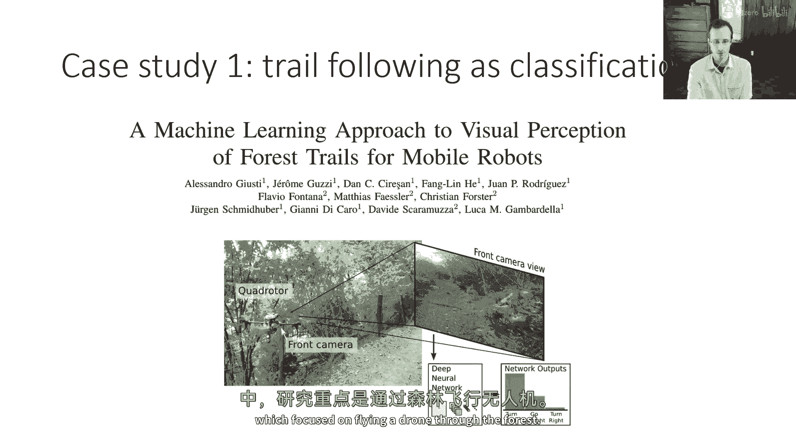
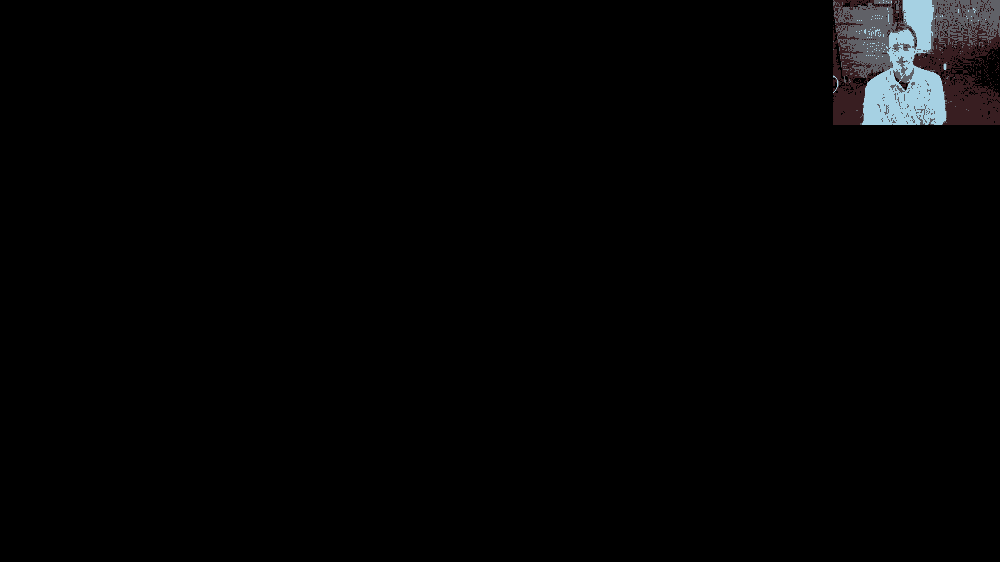
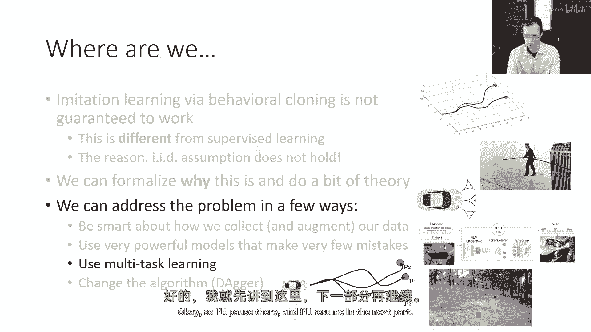

# P6：p6 CS 285： Lecture 2, Imitation Learning. Part 3 - 加加zero - BV1NjH4eYEyZ

好的，今天的讲座剩余部分将专注于更实用的方法，这些方法可以使行为克隆工作，以及一些，嗯，其他可能我们使用的算法，所以我们稍微谈了一些理论，但现在我们将讨论这个问题可以通过几种方式得到解决。

通过聪明地收集你的数据，通过使用非常强大的模型，使，与错误较少的情况相比，通过使用多任务学习，并且通过改变算法，我会快速地走过这些，所以，我对这些的意图是，对于讲座的这一部分，并不是真的。

不是要详细解释如何实际实施一些这些方法，只是想给你一种人们对于方法论的感觉，你在作业中要实现的一种方法是dagger，我会详细介绍那个，嗯，稍微更精确地说，好的，那么使行为克隆容易的原因是什么。

以及使它困难的原因，嗯，正如我在讲座的前一部分提到的，如果你有非常完美的数据，那么这些累积的错误就是一个大问题，因为只要你犯哪怕是一个小错误，你的数据不在完美的分布范围内，但是如果你。

如果你实际上已经在你的数据集中已经有了一堆错误，并且对这些错误的更正，那么当你犯一个小错误时，你将处于一种状态，与其他数据集中的错误有些相似，是你在数据集中看到的错误，以及那部分数据集中的标签。

我们将告诉你如何纠正那个错误，所以，你有几种方式可以利用这种洞察，实际上，你可以在数据收集过程中故意添加错误和更正，这并不是一个完全疯狂的想法，所以，错误会造成伤害，意味着它会稀释训练集，但是。

更正会帮助，而且，往往更正比错误造成伤害更有帮助，其原因是，如果错误有些随机，它们往往会平均线，意味着最优的行动仍然最有可能，但是，在数据收集过程中犯错误，你迫使专家提供更多的多样状态示例。

那样将教会政策如何进行更正，这个想法的最简单版本是，如果你迫使专家犯错误，在某种概率下，这与他们处于哪个状态无关，那么错误将与状态大部分无关，而最佳行动将与状态相关。

所以当你的神经网络学习与状态相关的行动时，实际上，大多数状态都将倾向于学习最佳行动并避免错误，但是，看到那些修正仍然会有好处，嗯，最差的状态，我们还可以做的一件事是使用一些形式的数据增强。

并且之前那个相机技巧可以被视为一种数据增强，本质上是一种方法，它添加一些假数据来说明修正，比如那些侧面摄像头，并且可以做到这一点，通过利用你对你要解决的问题的一些领域知识，来创建一些额外的假数据，并且。

大致来说，这两个技巧的效果大致相同，在两种情况下，目标是提供专家不太可能访问的状态的例子，但政策可能会最终落在这些状态，现在，这种方法并没有太多其他的内容，所以，在讨论这些技巧时。

我将只展示两篇以前使用类似技巧的以前的论文，效果良好，所以首先我要提到的是一种基于数据增强的方法，嗯，在这篇专注于在森林中驾驶无人机的论文中。

所以输出动作空间是离散的，就是向左走，直走或向右转，这是他们的工作视频。

所以他们打算在这些瑞士的徒步道上驾驶这些无人机，这个嗯，从嗯，苏黎世大学，嗯，而且想法相当直接，所以他们有一个大陆，而且他们对图像的评论看图像，并预测三种离散标签之一，左，右和直，嗯。

这些都是来自训练集的例子，所以他们被标记，他们从哪里得到标签，他们从哪里获取标签，嗯，通过，当然，使用大量的机器学习，使用大量的徒步旅行路线，但实际上，数据收集过程非常直接。

他们实际上没有让人类驾驶四旋翼无人机，他们取而代之的是让一个人走徒步旅行路线，并且这个人让我快进这里，戴着一个滑稽的帽子，他们的帽子上有三个摄像头，一个前方摄像头，一个左向摄像头和一个右向摄像头。

他们的方法实际上比驾驶示例更简单，他们仅仅假设人总是朝正确的方向走，他们将左向摄像头标记为向右行动，并将右向摄像头标记为向左行动，并将前方摄像头标记为直行，这就是全部，这就是方法的全部，因此。

没有尝试记录人类的动作，实际上，这个方法工作得很好，我认为这是一个非常 nice 的示例，展示了如何，这种数据增强方法可以使模仿学习工作良好，一点也不惊讶，如果他们实际上让四旋翼无人机通过力场飞行。

如果他们只使用前方摄像头，如果他们的结果实际上有些差。

这与手持摄像头类似，这里是他们的无人机，这里有一个有趣的例子，这是一个机器人操作示例，在这里，这篇论文的作者正在使用一个非常便宜的，非常便宜且相对不准确的臂和一个非常简单的遥控系统。

基于某种手部运动检测器，他们在教机器人各种技能，如使用抹布擦拭螺丝刀箱，拿起和推动物体，像这样的东西，他们在这里使用游戏控制器，他们做的一件事是，他们展示了许多他们在演示中的错误，不可避免地。

因为他们的操作系统如此便宜且不完美，因为他们展示了许多错误，他们实际上陷入一个情况，机器人，当它犯错误时，实际上从错误中恢复，他们有一些例子，它们捡起物体，有时它们捡起它们错误，有时人类实际上干扰它。

但机器人实际上很好地从干扰中恢复，包括由这个人引入的，所以这里这个人在捣蛋，但是机器人只是不在意那个，并继续尝试完成任务，嗯，所以这里它必须将扳手滑入特定的位置。

所以有时不完美的数据收集实际上可能比高度完美的数据收集更好，好的，现在使行为克隆工作这个技巧是嗯，不太可靠的，而且，需要一些领域的特定专业知识，尽管它提供了在任何时候收集数据进行模仿学习的指导，记住。

系统有方法可以进入专家可以演示的状态，更正可能是一件非常好的事情，而且，值得考虑数据增强卡车，但现在让我们谈谈一些更多的技术解决方案，你为什么可能无法拟合专家的行为。

因为如果你可以最小化那个值epsilon，甚至epsilon的平方可能仍然很小，所以，如果你能理解你可能无法拟合专家行为的原因，也许你可以得到一个如此强大的模型，以至于它的概率性，错误如此低。

以至于即使是那个二次成本也实际上不会让人担心，你太多了，所以，你为什么可能无法很好地拟合专家，一个原因是我将提到的非马尔科夫行为。

非马尔科夫行为意味着专家并不 necessarily基于当前状态来选择行动，仅基于当前状态，第二个原因是多模态行为，这意味着专家随机采取行动，并且他们的行动分布非常复杂，可能具有多个模式。

让我们先谈谈正常的马尔科夫行为，所以当我们训练一个依赖于当前观察的政策时，这个政策是马尔科夫的，在意义上，它假设当前观察是唯一重要的事情，它基本上假设观察是状态，这并不是一个问题。

如果专家也仅基于当前观察选择了行动，但人类很少那样做，人类实际上无法完全在瞬间做出决定，完全忘记他们以前看到的一切，所以如果我们看到同样的事情两次，如果我们是完美的马尔科夫代理，我们会做同样的事情两次。

无论之前发生了什么，而且这看起来很不自然，人们常常会根据他们所看到的所有过去事情来做出决定，例如，如果人类驾驶员注意到他们的盲点中有什么东西，然后回头看路，他们仍然记得他们在盲点中看到的东西。

或者可能更麻烦，如果有人突然切过他们，他们可能会有些慌乱，也许在接下来的几秒钟里，他们的驾驶方式会有所不同，总的来说，人类实际上是非常非马尔科夫的，从某种意义上说。

人类的人类行为非常强烈地受到时间上下文的影响，如果我们在训练一个只考虑当前图像的政策，它不知道所有的上下文，并且它可能无法学习到一个准确地捕获人类行为的单一分布，因为人类的行为不仅仅取决于当前的观察。

那么如何利用整个历史，嗯，实际上相当直接，我们只需要一种政策表示形式，它可以读取观察历史的历史，所以我们可能会有一个变量数量的帧，如果我们只是简单地将所有帧组合成一个包含三千个通道的巨大图像。

这可能很难，因为你可能有太多的权重，所以我们通常会使用某种序列模型，所以让我们，假设，如果我们使用图像，我们将有我们的卷积编码器，如果你不使用图像，你将有其他种类的编码器，你将编码所有过去的帧。

然后将它们通过序列模型传递，例如，lstm或transformer，然后仅基于整个序列预测当前动作，设置这些模型需要一些工作，但是实际上，没有任何在这里是模仿学习特定的，所以同样。

然后您可能会构建一个序列模型来处理，让我们说，视频在监督学习中，确实，在这里可以使用相同的方法，无论是lstm还是transformer，或者是完全不同的时间卷积再次，我不会详细讨论这些架构细节。

因为它们实际上不是模仿学习特定的，所以任何您以前学到的，对于序列建模的知识，都可以在模仿学习那里使用，然而，我想提到的一个重要警告，那就是使用观察历史的方法并不总是使事情更好。

并且它可能偶尔使事情变得更坏，这是因为它可能会加剧您数据中出现的关联性，这是一个小插曲，我并不一定期望你们对此有详细的了解，但我认为它是一个有趣的插曲，并且可能是激发像最终项目这样想法的灵感。

为什么这可能会失败，这里有一个场景，假设您有一辆奇怪的车，有一个仪表板指示器，指示您是否正在踩刹车，所以每当你踩刹车时，驾驶舱内部会有一个灯泡亮起，以及正在记录你数据的摄像头，发酵学习在驾驶舱内部。

所以摄像头可以从车窗外看到，它也可以看到刹车指示灯，所以当人踩刹车时，现在灯泡亮了起来，在这种情况下有一个人站在车前，驾驶员踩了刹车，因为那里有一个人，但在训练数据中政策看到的是，它会看到一个帧。

其中人可见，但刹车指示灯没有亮起，刹车被按下，然后我们会看到许多步之后，刹车指示灯被按下，嗯，它是亮的，刹车被表达，所以，刹车指示灯和刹车被按下之间有很强的关联，如果你有，如果你在阅读历史。

情况要糟糕得多，因为在阅读历史时，甚至不需要刹车指示灯，在阅读历史时，仅仅因为以前刹车被按下的事实，从连续的图像中可以看出步骤，你看到汽车减速，你知道刹车被按下，所以。

要点是动作本身与未来该动作的实例相关联，如果信息被隐藏，当然，政策被迫关注重要的线索，那就是有人的事实，但如果这些辅助线索存在，即使它们不是导致行动的真实线索，它们服务于混淆政策作为虚假相关性。

作为一种因果关系的混淆，当你看历史时看到的减速是由刹车引起的，但政策可能不意识到这可能是，每当你看到汽车减速时，这表明你应该以与刹车指示灯相同的方式刹车，效果不是刹车的原因。

但当你看到许多包含这种关联的图像时，你可能会混淆，所以，你可以叫这为因果关系的混淆，如本论文所述，我们可以对这个问题提出一些问题，历史是否能减轻因果关系的混淆，还是使它更糟，嗯。

我会把这个留作你在家额外思考的机会，本讲座的结尾将有另一组练习，我们将讨论一种叫做dagger的方法，在我们讨论完那个之后，我希望你能回到这个点上，并思考dagger方法是否实际上解决了这个问题。

还是使它更糟，所以我会把这个问题留作你的练习，嗯，去思考，好的，所以这就是非马尔科夫行为，你可以通过使用历史记录来处理它，请记住，这并不是总是好事的，但如果你担心的是非马尔科夫行为。

这就是你现在应该做的事情，让我们谈谈另一个，多模态行为，这是一种微妙的行为，假设你想要在树中导航，也许你在驾驶四旋翼无人机，你可以飞向左边的树，或者你可以飞向右边的树，两者都是有效的解决方案。

问题是当你站在树前的那个时候，一些专家轨迹可能涉及到向左走，也可能涉及到向右走，所以总的来说在你的训练数据中，你会看到对于非常相似的状态，非常不同的行动，现在，这不是一个问题，如果你在做那样的事情。

那就是那个苏黎世论文，他们在其中使用了一个离散动作空间，左，右和直行，因为你可以很容易地表示一个分布，其中左的概率很高，高概率为右，低概率为直，因为你直接输出了三个数字来指示每个动作的概率，然而。

如果你输出连续的动作，嗯，也许高斯分布的均值和方差，现在我们有一个问题，因为高斯只有一个模式，实际上，如果你看到左的例子和右的例子，并将它们平均起来，那就是非常，非常糟糕。

那么我们如何很好地解决这个问题，我们有几个选择，我们可以使用更表达性强的连续分布，所以，而不是输出单个高斯分布的均值和方差，我们可以输出更复杂的东西，或者我们可以实际上使用离散化，但是要使它可行，嗯。

在高维动作空间中，我会稍微谈谈这两种解决方案，那么首先让我们谈谈一些我们可以使用的连续分布例子，再次，我不会对每个方法进行详细的解释，所以关于如何实际实现它们，我会有一些提示和参考。

我鼓励你自己去查找这些信息，如果你想要实际尝试，我的主要目标是提供一种概述级别的覆盖，以便你知道不同技术的基本知识，这样你就可以知道正确的关键词和正确的想法，好的。

所以我们的目标是找到一个方法来设置一个神经网络，以便它可以输出多个节点，例如，向左移动的高概率，向右移动的高概率，以及直行的低概率，所以我们有一些选择。

一个非常简单但可能不那么强大的选项是使用高斯混合的组合，我会谈谈如何使用神经网络来设置这一点，一个更复杂的选项是我们使用关联变量模型，然后，最近变得非常流行的一种使用扩散模型的方法。

因为扩散模型在最近几年中变得更加有效，训练也更加容易，但我们先从高斯混合的开始，因为那很可能是最容易实现的，尽管它不如其他方法强大，所以这里的想法是，高斯混合是，嗯，可以被描述为一组均值，协方差和权重。

好的，假设你有n个不同的，嗯，高斯分布，你想要输出，假设可能n等于十，假设你将输出，十意味着，十协方差和一个在每个这十个混合元素上的权重，来指示它们的大小，所以你可能在像聚类这样的背景下学习高斯混合物。

这里的均值和方差只是向量和矩阵，是你在这里学习的，一切都依赖于观察，所以，你的神经网络实际上是输出均值和方差，所以它们不是你存储的数字，它们是你神经网的实际输出，以前我们的输出只是均值，也许只是一个。

协方差矩阵，现在可能会是十个均值向量，和十个协方差矩阵，并且对于每个这十个，都有一个标量权重来指示它们的大小，但在实现上，实际上相当直接，我们所需要做的就是编写我们的神经网络，所以它有所有这些输出。

写下混合的高斯分布的方程，将其对数作为我们的，嗯，训练，嗯，目标，并以相同的方式优化它，就像我们以前做的一样，所以，你在这里实现这个的方式是，让我们说，PyTorch。

你将实际上实现混合的高斯分布的方程，取其对数，并将其用作你的训练目标，不要忘记在前面加上一个负号，如果你在最小化它，所以这就是基本想法，你的神经网输出意味着协方差和权重。

而且现代的自动微分工具如PyTorch实际上使实现这个相当容易，当然，混合的高斯的问题在于你选择混合的元素数量，这就是你有多少模式，所以如果你有十个混合的元素，并且你想要十个模式，那很好。

但如果你有一百个模式，如果你有非常高维的动作空间，也许你不是在驾驶汽车，但你在控制一个具有五十个自由度的人型机器人，并且你想要一千个不同的模式，现在你需要做一些更聪明的事情。

潜在变量模型为我们提供了一个通往更广泛分布类别的方法，实际上，你可以证明潜在变量模型可以表示任何分布，只要神经网络足够大，潜在变量模型的想法是，神经网的输出仍然是高斯，但在图像之外，它还接收另一个输入。

是从某个先验分布中采样的，比如零均值单位方差高斯，所以你可以想它几乎就像一个随机种子，随机种子被传递给网络，对于不同随机种子，它将输出不同的模式，例如，如果我们增加，如果我们有一个三维的随机向量。

我们输入它，如果我们输入这个随机向量，我们得到这个模式，如果我们输入这个随机向量，然后，我们得到另一种模式，我们需要训练网络，以便对于不同的随机向量，它输出不同的模式，现在，不幸的是。

你不能简单地天真地取网络并输入随机数字，并期望它能这样做，因为如果你给它随机数字，那些随机数字实际上并不与输入或输出中的任何事物相关，所以如果你只是按照最明显的方式做，神经网络实际上会忽略那些数字。

所以，训练潜在变量模型的技巧是使那些数字在训练期间有用，对于这个目的，最广泛使用的方法类型是，被称为条件变分自编码器的方法，我们将详细讨论条件变分自编码器在后续的课程中，在课程的后半部分。

所以我实际上不会在现在描述如何使这工作，但是高级直觉是在训练期间，那些进入网络的随机向量的值实际上并不是随机选择的，相反，它们是以聪明的方式选择的，以与您应该输出的模式相关联，所以，想法是在你训练时。

找出，这个特定的训练示例具有左模式，这个训练示例具有右模式，并给它们分配不同随机向量，以便神经网络学习可以关注那些随机向量，因为它们告诉它应该输出哪个模式，这就是直觉。

使这工作具体实现的特定技术方法是稍微复杂一些，需要更多的技术背景，所以我们将在课程的后半部分讨论这个问题，但潜在变量模型的基本想法是，你有一个额外的输入进入模型。

并且这个额外的输入告诉它应该输出哪个模式，然后当然，在测试时间，如果你想要实际使用这个工作，你可以随机选择那个随机变量，然后您将随机选择在左树或右树上移动，好的，嗯，第三类分布。

我将讨论近年来得到了很多关注的一种，因为这些类型的模型开始工作得非常好，是扩散模型，扩散模型与潜在变量模型有些相似，但有些不同，所以有些人可能听说过扩散模型作为一种生成图像的方法。

所以像dali稳定扩散这样的东西，这些都是使用扩散模型进行图像生成的方法，扩散模型如何用于图像生成，这就是一个非常高级的概述，所以如果你觉得这很模糊，这是因为它确实可以教一个完整的课程关于扩散模型，嗯。

从原则上讲，但是为了在两个幻灯片中覆盖，我将提供一个非常高级的概述，假设我们有一个特定的训练图像，我将表示训练图像为x零，这里的下标不表示时间，它实际上表示图像的腐蚀，所以x零是最少的腐蚀。

Xt是最多的腐蚀，所以x零在扩散模型中是真实图像，你构建一个假训练集，其中你在图像上添加噪声，然后你训练模型来去除那个噪声，所以x1是x0，这是真实图像加噪声x2是x1，哪里有一些噪声出来。

并且它添加了更多的噪声，如果你对一个图像添加这些不同量的噪声，现在你有一个训练集，你可以教神经网络反向传播，所以它将看稍微有噪声的图像x1，并预测x0，它将看稍微更有噪声的图像x2，并预测x1，等等。

实际上，我们通常训练它去全部回溯到零，所以那里有一个选择，但是，为了简单起见，它帮助我们想成只是回溯一步，实际上，我们实际上预测的就是噪声本身，这并不是那么不同，因为如果你预测x i 减1很好。

你可以通过只是预测噪声来实现，并减去xi，所以你可以要么有f(x i)直接输出x i 减1，或者有f(x i)输出噪声，在这种情况下，x i 减1就是x i 减f(x i)，这是一种更常见的选择，好的。

这是图像生成，我们实际上想要生成的不是图像，我们想要，当然生成动作，所以我们可以，我们可以将这个框架扩展来处理动作，现在动作，当然也有一个时间下标，所以我要使用下标t，"在控制过程中表示时间"。

"并且我将使用第二个下标来表示扩散时间步长"，"所以，逗号零是真正的动作"，"与x零一样，真像就是"，"一个逗号后加一个一就是一个一加上噪音"，"就像以前我们一样，我们可以学习一个网络"，"现在。

它包含了当前观察或状态st和ati，并输出i减去一"，或者就像以前我们实际上会让它输出噪音，所以，i减一等于i减f的stati。所以，训练集是通过从所有动作中提取来产生的，向他们添加噪声。

教网络预测这个噪声是什么，同时看图像，然后测试时间，如果我们想要实际确定动作，那么我们输入完全随机的噪声，并运行这个模型许多步骤，使它产生d噪声，所以，将网络翻转过来，它获取输入，它输出ati减去一。

这是一个稍微去噪的行动版本，它还能查看图像，我们从噪声开始，在测试时间，我们将其输入到这个盒子中，作为毛，作为ati的第一个值，然后我们重复这个过程，我们去噪它，再把它放回去噪一些。

然后多次重复这个过程，然后最后出来的是一个干净好的行动，在训练过程中，我们将所有这些噪声添加到真实动作中，我们教网络如何消除噪声，所以这就是扩散模型的基本思想，实际上实现它需要一些额外的设计决策。

在这里我没有时间去深入讨论，但是，我会引用一些论文，你可以在这些论文中查看详细信息，我要讨论的最后一个技巧是离散化，离散化一般来说是一种非常好的方法，可以用来获取复杂的分布，但是在高维中。

直接应用这种方法非常困难，所以记住在那个苏黎世论文中，动作是去左，去右和直走，这个多模态问题基本上不存在，但是当然，那是对于高维中的一维动作，如果你有，让我们说十个维的动作。

对动作空间的离散化是不现实的，因为需要的桶数随着维度的增加以指数速度增加，所以解决方案是逐个维度进行离散化，这就是自动回归离散化的想法，所以这就是我们如何做到的，假设我们的动作是三维向量。

我将使用零来表示维度零，一表示维度一，八十二表示维度二，不要与之前的扩散模型标记混淆，这与那无关，所以第二个数字只是维度，它只是一个标量值对吧，所以这就是我们如何设置我们的网络的。

我们取图像并将其编码为某种编码器，例如，自信的，然后我们将其放入序列模型，这可能是变压器或lstm，所以无论你喜欢哪种序列模型，在序列的第一步中，我们输出维度零，我们可以将维度零离散化为桶对吧。

所以它只有一维，离散一维线是非常容易的，所以我们有一个桶对应于所有可能的值，你可以有十个桶，你可以有一百个桶，因为它是一维的，它非常容易做，然后在序列的第二步中，我们输入a_t零，并输出a_t一以旋转。

然后下一次时间步，我们输出a_t，我们输入a_t一，并输出a_t二，就像在序列模型中一样，和像语言模型一样，你将，嗯，输出下一个标记，这里的下一个字母，你将输出动作空间的下一个维度。

现在每个维度都被离散化，桶的数量不再与维度性有关，实际上，它仍然与维度性成正比，然后在测试时间，如果你想要采样，然后，我们将做与任何其他序列模型相同的事情，而不是将每个维度的真值输入，我们哪里有。

我们将输入前一个时间步的预测再次，这与任何其他序列模型，如语言模型，完全相同，例如，所以一种实现方式实际上是只使用gpt风格的解码器模型，现在，为什么这种方法工作得好。

这是因为这是一种完全有效的方式来表示复杂的分布，是因为你可以通过看每一步实际上预测了什么概率来理解这一点，所以，第一步预测p（t=0）给定st，因为，你输入，你输入st，而你的输出是0。

第二步预测给定st和0的概率，所以st的依赖性来自事实，它通过序列模型传递，在t0时作为输入，在第三次时间步，你给定st0和1，预测2，如果你将这些东西相乘，然后通过概率链规则。

它们的乘积正好是0的概率，给定st的1和2，"给定状态，行动的精确概率是多少"，"所以，这就是如果你在所有时间步骤中都将概率相乘的政策"，"那就是说，如果你采样不同的部分"，"序列的维度"，"然后。

你将从分布p中实际获取一个关于给定st的t的样本"，"所以自回归离散化实际上是一种很好的方法，可以用来获取复杂的分布"，但是，它稍微有点沉重。"从你需要以这些序列模型输出动作的角度来看"，好的，下一个。

"让我来谈谈几篇论文的案例研究"，使用这些种类的表述，我将要讨论的第一个案例研究是一篇论文，嗯，来自2023年的Che et al的论文，它使用扩散模型来表示机器人的政策，所以它基本上按照你的预期工作。

有两种变体，有一种基于大陆的变体和一种基于变换的变体，它们只是在如何读取图像上有所不同，但在两种情况下，它们都读取图像，并且它们执行这种去噪操作，所以这实际上是可视化去噪。

并且去噪过程产生一个短轨迹以实现最终效果，以便接管接下来的几步，并且机器人跟随那个轨迹并执行任务，他们可以用这个来，模仿学习来学习像拿起杯子这样的东西，或者，你知道，在比萨上放一些酱汁。

这可能与一个协作的人一起工作，他们帮助你，确保酱汁不会到处溅落，但是，关键是通过使用这些相对表达性强的多模态扩散，嗯，策略，他们可以从他们的模仿学习系统中实际得到相当好的行为。

这里有一个使用潜伏变量的方法，潜伏变量实际上与变压器一起使用，但它不使用之前的动作化，它只是输出动作的连续u值，所以，变压器只是用于提供更复杂的表示，这里的潜在变量是这个字母z，你可以看到的，嗯。

在输入序列的末尾，并且论文把它视为一种风格变量，以解释人类专家可能在不同试验中以不同风格完成任务的事实，这被用来提高模型的表达性，嗯，在这里，模仿学习使用这二位手动操作装置，这可以然后用于提供演示。

教机器人做如下一些事情，嗯，给一只脚穿上鞋，所以那不是真正的脚，它是假人的脚，嗯，这里是政策，嗯，仅通过在测试时间从先验中随机采样来推断潜在变量，但在训练期间，它本质上在使用条件变分自编码器。

我们将在后续的课程中描述这种方法，所以这里是鞋子，这里是另一个例子，嗯，在给遥控器充电的同时，一个讨厌的研究生通过向背景投掷物体来分散机器人的注意力，嗯，我猜测这是你想要完成的事情，以增加压力。

测试你的政策，以确保它们与干扰物一起表现得很好，这里是我将要呈现的最后一个案例研究，这是一种自回归离散化方法，并且在这项工作中，嗯，被称为rt one，模型实际上是一个变压器模型。

它读取过去的图像历史和语言指令，它实际上输出一个臂和基部运动命令的每个维度离散化，所以它是一个轮式机器人，所以它可以移动基础，而且它可以实际上移动手臂和所有那些维度都被离散化。

这使得整个控制问题成为一种序列到序列的问题，所以它是一系列图像和文本转换为一系列按维度的动作的序列，嗯，因为它是语言条件，它可以，它实际上可以学习执行各种各样的不同任务，当提供足够的数据集时。

当它是语言条件时，你可以实际上做有趣的事情，像将它连接到一个大型语言模型，那个模型然后解析复杂的指令，比如从抽屉里拿对条，然后说为了做那个，你需要首先去抽屉，然后像打开抽屉。

那是然后命令给这个rt one模型，哪个模型然后使用那个动作离散化技巧来选择按维度的动作，当然，这篇论文中还有很多比自动zation更多的事情，剩下的zation，但我只想展示这种方法的一个例子。

在实际工作中真正起作用，好的，所以我会暂停在那里，我会在下一部分继续。

嗯。