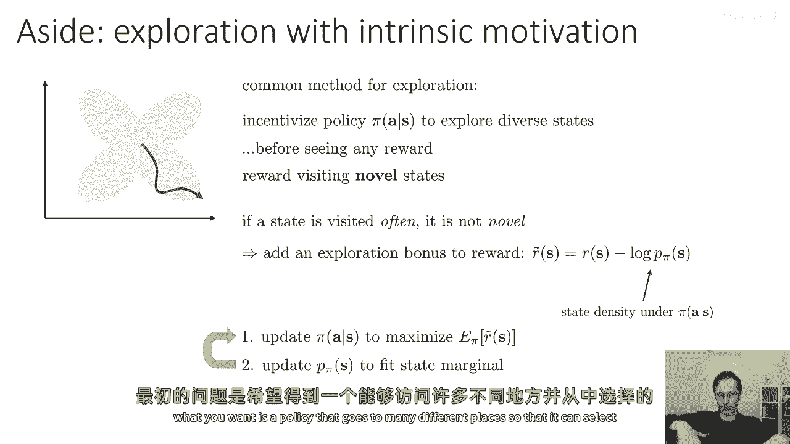
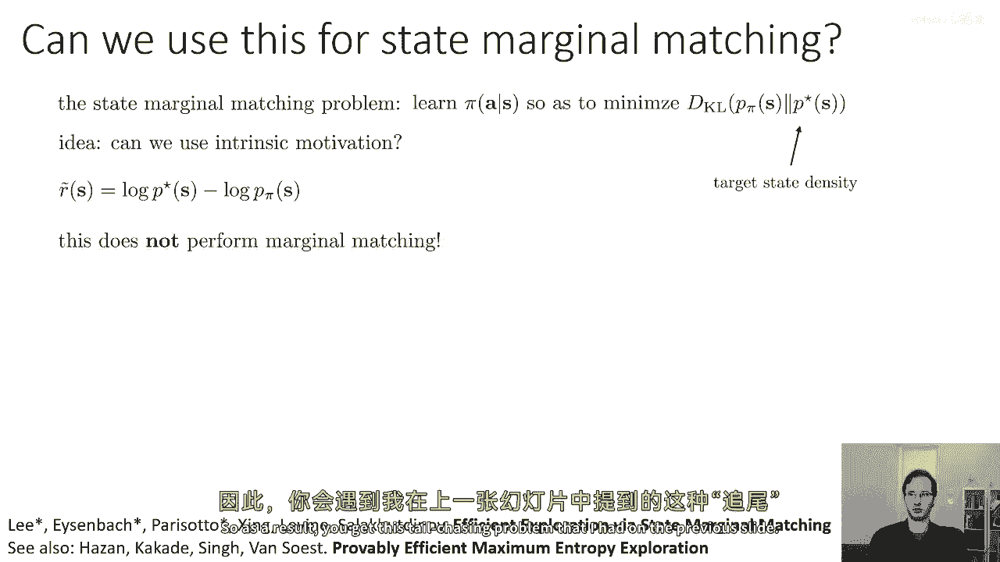
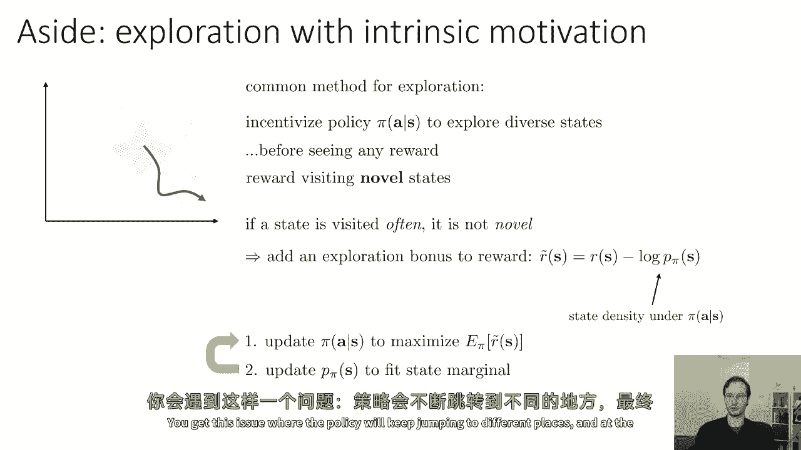
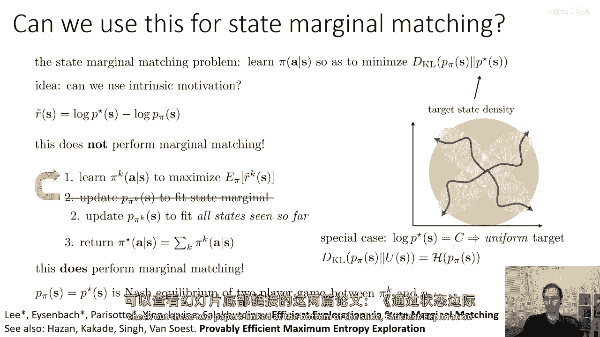
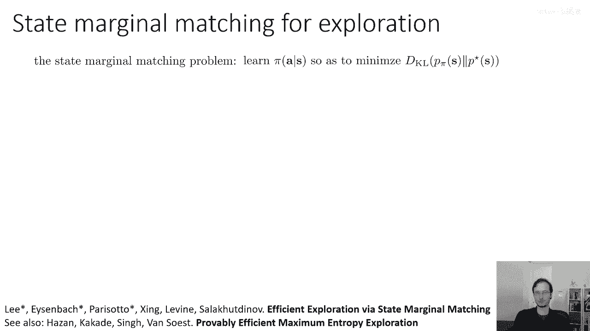
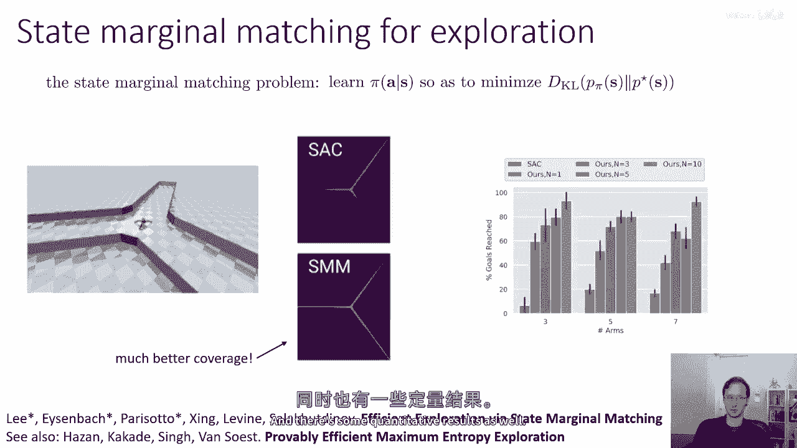
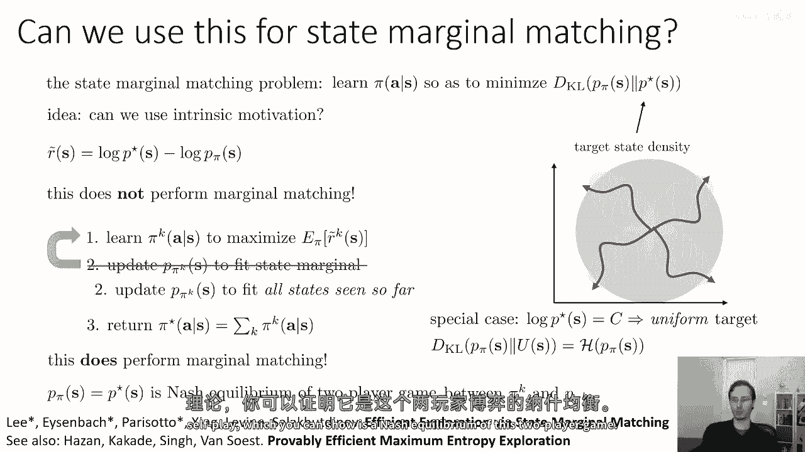
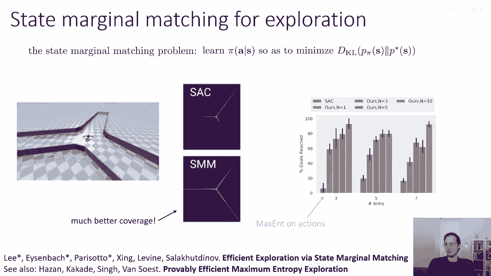
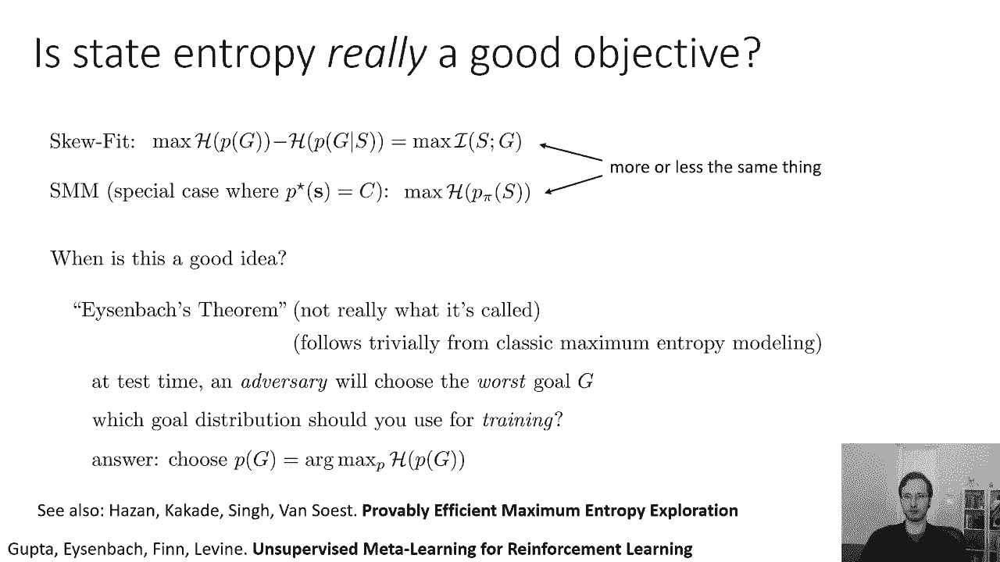

# P62：p62 CS 285： Lecture 14, Part 3 - 加加zero - BV1NjH4eYEyZ

好的，那么在讲座的下一部分，嗯，我们将更深入地探讨这个概念，嗯，状态覆盖和将状态熵最大化的概念更一般化，以匹配一些目标分布过状态，在这个过程中，我认为我们将看到一些有趣的联系。

与本讲座讨论的探索概念之间的联系，并且我们周一讨论的概念类型，好的，嗯，所以让我们从一个小插曲开始，让我们谈谈如何进行无监督探索，使用内在动机目标，所以内在动机是另一个用来指代这种新颖性的词汇。

寻求我们在周一看到的东西，比如伪计数等，所以周一我们看到的探索常见方法，你是否通过某种方式激励你的策略π在给定的状态s中探索多样化的状态，去访问以前很少被访问过的新状态，并且在看到任何奖励之前。

甚至在周一，这是因为奖励非常延迟或非常稀疏，这可能在奖励完全缺席的设置中进行，但如果你完全没有有奖励，你做这个会得到什么呢，如果你奖励访问新状态，你知道基本上，如果一个状态被访问很多次。

那么它就不再是新的，所以你可以添加一种多样的探索奖励，这将这样做，我们了解了像计数这样的东西，我在这里要谈论的是一种非常简单的奖励，那就是负对数p的s，你可以使用，你知道。

加上n分之一的s的负对数p的s，这有时被称为内在动机，这只是同一想法的另一个变体，但我要说的一切也都是对伪计数也适用的，"两个哈希值"，你知道，"哈希探索"，所有这些事情。

所以让我们假设我们主要惩罚密度小于π的情况，所以我们想去人口密度低的州，"所以，你可以想象以下程序"，"更新你的政策以利用此奖励的最大化效果，加上这个奖金"，"然后更新你的状态分布。

以适应你当前的边缘状态"，"然后重复正确的"，非常标准的程序，与周一看到的非常相似，好，你将得到的，如果你这样做，在没有任何奖励的情况下，那是你的政策开始行动并做某事的时候。

然后密度估计器将拟合你的政策所做的任何事情，然后政策将去做其他事情，然后估计器将拟合那个政策所做的事情，然后我们将去做其他事情，以此类推，所以，这个密度估计器s的πp，它最终将具有高覆盖率。

它将为所有状态分配相对较高的概率，但你最终得到的政策将相当随意，政策将最终四处追逐，在整个空间中兜圈子，你实际上不会得到一种政策，它为所有状态提供均匀的覆盖率，最终的政策将是随意的，它将只是去某个地方。

之前的政策倾向于较少地访问，但是，当您这样做时，密度估计器将获得良好的覆盖率，所以，这不是单独的，一种解决原始问题的伟大方法，我提出了一个问题，你想要的政策是去很多地方，以便可以从中选择。

那么，如果你实际上想要一个获得良好覆盖率的政策，所以你不想要一个只具有状态空间均匀覆盖率的密度估计器，但你想要一个实际上会随机去不同状态的政策，我们将有相等的概率落在所有可能的状态上，所以。

状态边缘匹配问题可以定义为学习一个给定s的政策πa，以最小化状态边缘p，Pi of s和目标状态边缘p星 of s之间的KL散度，如果p星 of s是均匀的，那么你只是在最大化状态熵。

但如果它不是均匀的，一般来说，你可能在匹配一些目标状态熵，这些问题非常相似，所以，你可以使用这内在的动机，嗯，我之前提出的想法，你可以基本上使用这些探索性的新奇性目标，所以。

让我们构造我们的奖励类似之前，所以我们将把它构造为log p星，这是所需的状态分布，减去log p pi，这是我们当前的状态分布，现在立即，你可能注意到，如果你，嗯，如果你熟悉你的信息理论定义，是。

那么RL目标将是这个在稳定分布下的平均值，所以，它将是p pi of s下r tilde的期望值，所以，它是p pi of s下r tilde的期望值，r tilde的期望值正好是，KL散度在那里。

在上面，所以这有点有趣，看起来RL的目标似乎正是我们想要量的东西，那么这是否意味着RL将优化得很好，不完全如此，因为RL并不了解事实，即奖励本身取决于策略。

所以这不本身不能为一个非常微妙的原因进行状态边缘匹配，尽管目标正是状态边缘匹配的目标，算法，RL算法，并不了解事实，即-log pi pi of s取决于pi，因此你会得到我在上一滑片中提到的尾追问题。

你会得到这个问题，其中策略会不断跳转到不同的地方。

最后不会实际上最小化KL散度，但是让我们尝试大致勾勒出这个算法的样子，然后我们会看到实际上有一个非常简单的修复，这将修复这个问题，所以这里是我们如何勾勒出这个算法的，我将使用有些繁琐的符号，有一个原因。

这个符号在后来会很重要，在每个迭代中，我们将学习一个策略pi k，其中k在这里索引迭代，所以第一个迭代是k等于一，第二个迭代是k等于二，等等，我们将学习一个策略pi k。

以最大化在pi下预期的r tilde k的值，再次，我在r tilde上使用上标k，来denote这个是用迭代k的密度估计器计算的r tilde，然后您将更新密度估计器，可能是变分自编码器。

或者是其他适合当前状态边缘的分布，这个新策略的状态边缘，由k决定，然后您将重复这个过程，所以到最后，嗯，你知道，让我们说这是，嗯，这个橙色的圆圈是我们试图匹配的密度，你知道你的策略会跳来跳去。

所以到最后，您的最终策略，让我们说pi four在这里是去任意地方的，是去右下角的，嗯，绿色圆圈是所有这些策略的密度估计，实际上并不太远离橙色圆圈，所以我们需要修改第二步，稍微一点。

我们需要更新p pi k s以适应到目前为止看到的所有状态，不仅仅是最新的政策状态，而是所有的政策状态，所以然后我们得到绿色圆圈的并集，不仅仅是最后一个绿色圆圈，这基本上是一个非常容易的更改。

将密度估计器更改为您的复用缓冲区，但另一个更改，嗯，我们即将制作的是，而不是返回最新的政策，实际上将返回一种混合政策，所以将返回的最终政策将是一种混合模型，这种模型会平均所有迄今为止看到的政策。

所以最终结果是不是一种政策，实际上是许多政策，你实际上将这样做，你将运行一个随机选择的迭代，一个随机选择的πk，可能会看起来像是一种奇怪的决定，像你会觉得最新的政策是最好的一个。

我们为什么从学习期间看到的所有政策中随机选择，很好，结果发现，这个程序确实进行了边缘匹配，证明这一点需要一些游戏理论，所以，事情是这样的，最后，嗯，状态分布，其中p(pi of s)等于p*(s)。

是两人对决游戏的纳什均衡，这个游戏中的玩家是状态密度估计器和策略，所以这是一个πk和πk的游戏，这里有一个特殊情况，如果s星的p是常数，那么你有一个均匀的目标，也许这样想更容易，在这种情况下，KL发散。

只是熵，现在，结果是，你可以通过以下方式恢复两个玩家游戏的纳什均衡，像这样，只需要让玩家相互对战，意味着每次每个玩家都给出最佳响应，所以密度匹配算法的最佳响应实际上是实际拟合密度。

策略的最佳响应是最大化我们的约化，但仅仅是运行这个最佳迭代最佳响应算法实际上不会产生纳什均衡，结果，你得到一个纳什均衡，如果你做被称为自我玩的事情，在自我玩中，你应做的事情。

是你应该返回你看到过的老eerts的历史平均值，所以最终迭代不是纳什均衡，但是所有迭代的混合就是纳什均衡，而且这是游戏理论中一个非常著名的结果，所以本质上你可以证明我这个步骤三中的pi星。

哪是所有pi k的混合，是这个两人对决游戏的纳什均衡，这意味着它将会，嗯，最小化p pi和p星之间的KL散度，嗯如果你想要，嗯，了解更多关于这个，如果你想对这个有更多的细节。

请查看底部的幻灯片链接的这两篇论文，由状态边缘匹配和证明有效的最大熵探索实现的高效探索。

好的，所以几项实验，这是一点嗯，一种设计有三只翅膀和囊的蚂蚁机器人，应该在这个迷宫中运行，这只是一种标准的rl算法，它并不均匀探索所有的三只翅膀，在这种情况下，它倾向于向顶部右上角倾斜，然而。

状态边际匹配能够平等地覆盖所有它们，因此，它提供了更好的覆盖，而且还有一些定量结果。

所以无论如何，从这一点中我们可以得出的高层次想法是，嗯，当你运行内在动机时得到的个体迭代，不能得到好的状态覆盖，并且它们不匹配目标分布，但如果你平均这些迭代，然后你做。

你证明这一点的方法是通过使用自我对战理论，你可以证明这个两人对战游戏是一个纳什均衡。

好的。

嗯，我想简要谈谈一件事，接下来，我们讨论了这些无监督探索方法如何工作，它们旨在获得良好的覆盖，在目标上是均匀分布的，或者匹配一些状态分布，也许也是一个均匀分布，但是。

其对有效状态的覆盖实际上是一个良好的探索目标，像，我们为什么想要覆盖尽可能多的状态，所以，在偏斜拟合中，我们正在覆盖状态边际匹配的目标空间，如果你有这个特殊情况，其中，p星是一个常数。

那么你是在最大化状态熵，嗯，它们基本上是一样的东西，那么，这是一个好主意吗，嗯，这是这项工作的一个小结果，这是一种显而易见的结果，我将称之为有些幽默地，本后的艾森巴赫定理，艾森巴赫，是哪个学生，嗯。

实际上，你知道，我在纸上写下了这个，在底部链接了，但是它是一个，它不是真正一个定理，它是一种从经典最大熵建模中跟随的相当简单的结果，你可以证明的是，如果测试时间，对手选择了最可能的目标。

G实际上有一个单一的答案告诉你在训练时应该练习什么目标，所以，如果测试时间你将得到最可能的目标，基本上当你晚上回家时，你的机器人已经完成了练习，你故意要给机器人最难的任务，就像你知道的。

你讨厌制造这个机器人的公司，你想要给他们写一个一星评价，你故意给它最难的任务，只是为了看它失败，以便你可以，嗯，你可以事后抱怨，如果你打算给机器人最差的可能目标，而且机器人知道你将给它最差的可能目标。

在训练期间，它应该练习哪些目标，它应该如何构建那个训练分布，花一点时间来思考这个问题，所以，我们发现在训练期间应该使用的最佳分布，如果你相信你将得到一个对抗性选择的目标，实际上是均匀分布，并且它是。

这实际上是从经典最大对称模型结果中得出的一个非常简单的结果，它非常简单，并在此论文的底部链接中描述，被称为无监督金属学习对于强化学习，这意味着在没有关于你将获得什么知识的情况下。

最大化你的目标的熵或你的状态的熵，基本上是你能做的最好的事情，因为你不知道测试时间你将获得什么样的目标，你实际上只能假设它可能是最坏的目标情况，所以如果你想使最坏的情况尽可能好，如果你能。

追求均匀分布的目标，这就是做这种均匀覆盖业务的一种理由。

