# P7：p7 CS 285： Lecture 2, Imitation Learning. Part 4 - 加加zero - BV1NjH4eYEyZ

好的，在讲座的第四部分，我将讨论一些算法性的方法，这些方法也可以使行为克隆工作得很好，我将讨论的第一个方法是使用多任务学习。

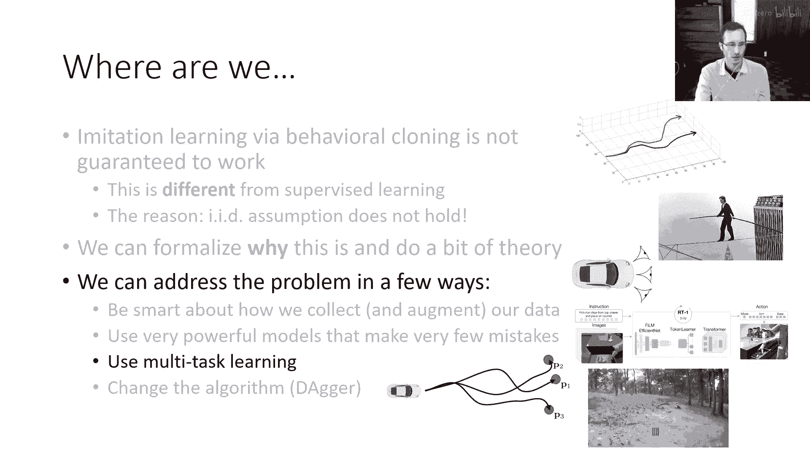

这可能在第一开始看起来有些矛盾，但事实证明，有时同时学习许多任务实际上可以使模仿学习更容易，所以嗯，假设你想要训练你代理，假设你的车辆开往特定的地点，让我们把它叫做地点p一，嗯。

你可能有很多驾驶到地点p一的演示，然后您训练一个给定s的政策，所以这是一件相当直接的事情要做，嗯，但我们之前讨论过，如果你想要训练这样的政策以变得 robust，所以它不会受到太多的复合错误影响。

也许你真的想要，嗯，让专家故意犯一些错误，把它们放入他们可以从那些错误中恢复的状态，那样教你政策，嗯，如果你没有 such 最优秀的专家数据，相反你有专家尝试驾驶到很多不同地点的数据，你可以做的。

你可以实际上训练一个政策，嗯，那就是接收到所需位置的输入的，而你获取所需位置的方法是，仅仅通过查看人类专家最后一次降落到的时间步，然后您将训练一个政策以到达任何p one，这个的有趣之处是，当然。

如果专家试图去许多不同的位置，他们将访问许多不同的状态，所以通过将政策条件于位置，您仍然可以得到您想要达到的位置p one的政策，但你将获得更多的训练数据，也许更重要的是，你从许多不同的状态获取数据。

这些可能是专家没有访问过的，如果他们只是想达到p1，如果他们行为最优，所以在训练时间，你可以做一些叫做目标条件行为克隆的事情，你可能收到一系列轨迹，甚至没有告诉你，Xbox想要干什么。

它们是一系列的状态和动作，你假设专家所做的任何事情都是达到实际达到的状态的好例子，所以你说，好吧，演示一是一个达到州首都的好演示，演示二是一个达到任何达到该州的好州演示，然后。

你将将最后一个状态作为政策额外的输入，并训练政策以采取专家所采取的行动，每当专家试图达到该状态时，这将给您提供许多提供更好覆盖的培训状态，并希望给您提供许多您可能学习更正之处的实例，在这种情况下。

尽管您仍然遭受分布性偏移，您可能仍然犯错误并发现自己处于不熟悉的状态，对于您命令的特定目标，该状态可能对其他目标更熟悉，这个的另一个好处是，您可以实际上利用数据，这可能不是最优的。

因为它可能专家未能达到位置p一，但他们在其他位置成功达到了，您仍然可以从中学习，好的，所以嗯，对于每个演示，您最大化演示中动作的日志概率，给定状态和演示中的最后一个状态，这就是方法的全部。

这是目标条件行为，所以您只输入两个状态而不是一个，这是一个目标条件化的行为，您只输入两个状态而不是一个，这里有一件事我要注意的是，尽管在实际应用中这通常使事情工作更好，在理论上。

这种方法实际上有一些问题，因为我们实际上在两个地方看到了分布性偏移，我们像以前一样看到了分布性偏移，在意义上，我们的状态分布不同，我们的p_train与抱歉，Rp数据与p_pi_theta不同。

但我们也在另一个地方看到了分布性偏移，嗯，当我们这样做标记时，我会将这部分留给读者作为练习，以结束我们在课堂上可以讨论的内容，所以作为一个提示，当我们用这种方式训练时，实际上在两个地方看到了分布性偏移。

嗯，你可以思考第二个分布性偏移的来源是什么，所以，在理论上这可能更差。

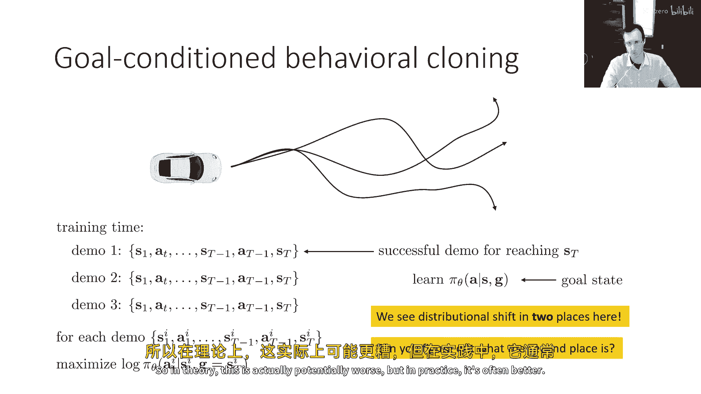

但在实践中它通常更好，让我看看一些已经这样做过的工作，嗯，目标条件行为克隆方法，嗯，可以说由这两篇论文广泛推广的，通过分布规划网络学习玩耍和未监督的视觉运动控制中的隐性计划。

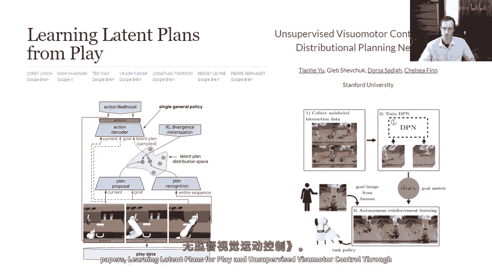

我会先谈谈从玩耍中学习隐性计划的一些事情。

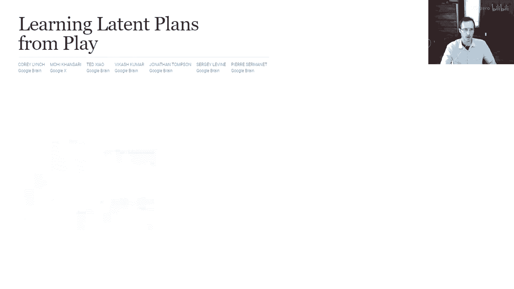

所以那里的概念是收集数据，嗯，与人类一起，他们并没有被特别告知要做任何任务，但他们被告诉在环境中随意玩耍，在这个数据集中，人们使用VR控制器来控制模拟机器人，他们正在执行一些随机的事情。

他们不是随机移动手臂，但他们正在执行随机任务，这当然覆盖了许多不同的状态，在這種數據上訓練政策，將有很難試圖找到離分布的狀態，因為幾乎所有的合理狀態都在這裡見過某處，或者至少與此非常相似。

但當然不清楚每個軌跡正在執行什麼任務，通過這數據並執行這個目標，重新標記每個軌跡，將每個軌跡標記為實際後達到的状态。

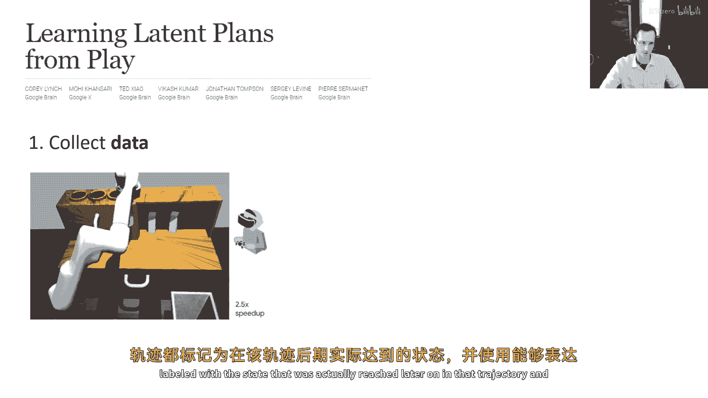

在該軌跡中使用可以表達多模態的隱性變量政策。

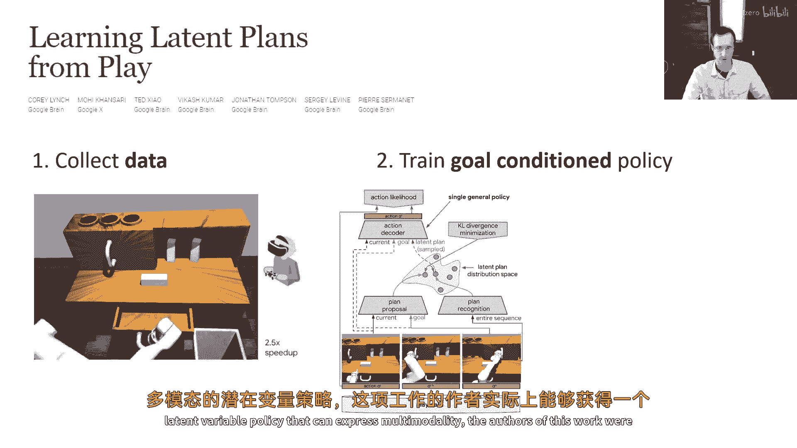

這項工作的作者，實際上能夠得到達到廣泛目標的有效政策，這使用了之前提到的隱性變量模型技巧，並將目標重標記和它們一起使用。

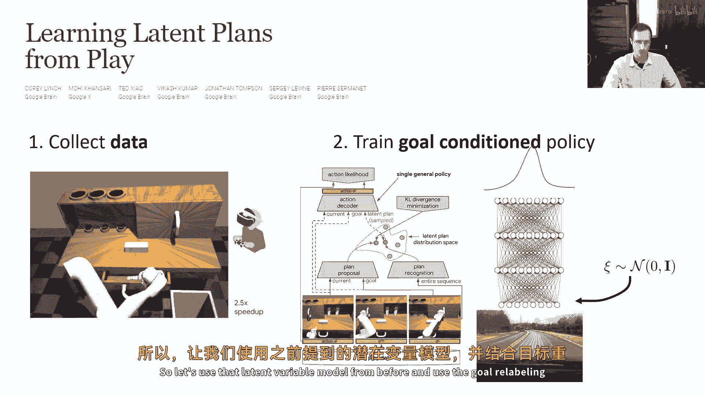

你可以得到一個政策，當你給它一個目標時，比如一個門關閉的狀態，或一個抽屜打開的狀態，機器人臂將自動地去做那件事，所以你可以看到它實際上執行了相當多的行為，在單一政策中。

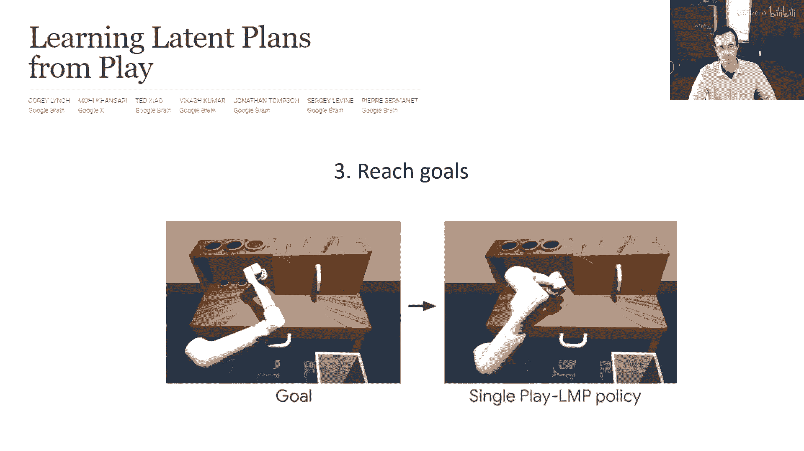

與這些目標條件的行為克隆方法有關的一件有趣的事情是，你可以實際地用它們作為在線自我改善的方法，與RL的精神非常相似，所以這些不是我猜測的真實RL方法，但它們在這方面與RL相似，它們可以通過經驗改善。

所以想法是，你可以從一個隨機的政策開始，將這數據視為達到實際狀態的示範，所以為這些隨機軌跡達到的状态重新標記，使用這來改善政策，然後再運行它，想法是，最初政策主要執行隨機的事情。

然後它學習到導致實際達到狀態的行為，然後在下一次迭代中它可以更為有意識，這方法僅應用這個目標重標記的模仿學習方法，迭代運行的學習方法，目標重標記的模仿學習，然後更多的數據收集，然後更多的重標記。

"然后更多的模仿"，"而且那实际上可以是一种相当不错且简单的方法"。

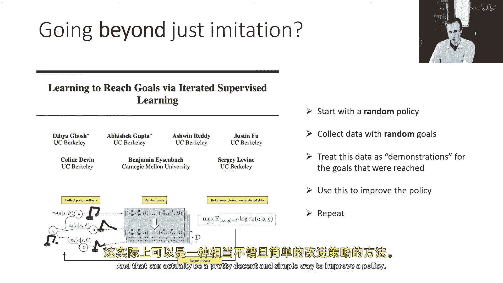

嗯，"改进政策"，"这些目标条件化行为的另一个好地方是"，"克隆方法因为它们相当可扩展而被视为"，所以你们可以在大规模上应用它们，"下一个案例研究"，"我要告诉你，这是由杜鲁夫领导的一篇论文。"。

"肖和杰三人"，他们做的事情是开发了一种驾驶地面机器人的政策，还不是自动驾驶汽车，但是小规模的地面机器人，实际上可以泛化到许多不同类型的机器人，所以它是一种目标条件模仿学习方法，输入当前观察。

和目标图像，实际上还输入历史，嗯，来处理，嗯，那个非马尔科夫问题，嗯，然后它会输出动作，它被训练在大量的机器人数据上，这些数据来自许多不同类型的机器人，从小型遥控车到全尺寸的自动驾驶车辆。

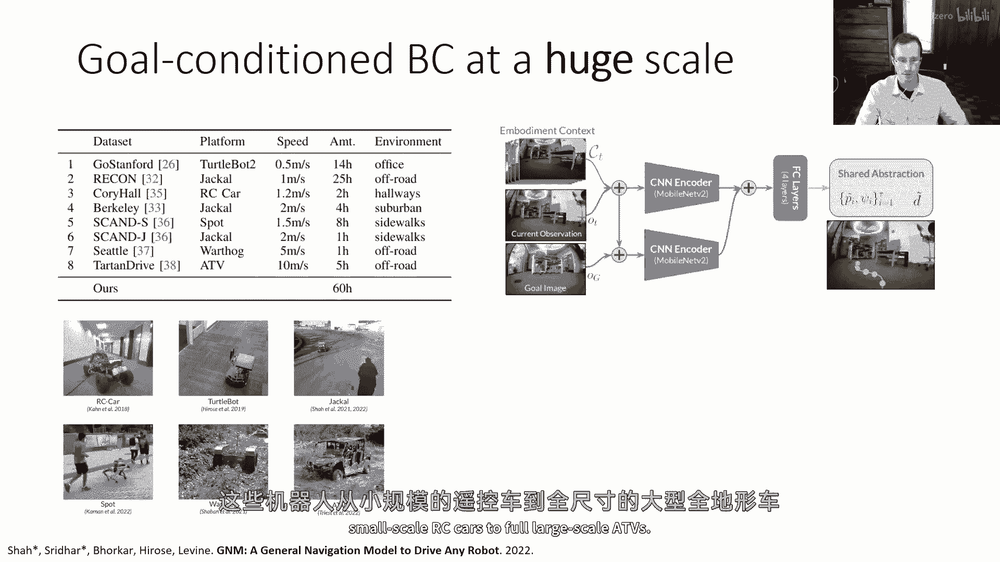

这个政策的酷之处在于，它可以然后达到目标，即使对于它没有训练过的新类型的机器人，例如，例如，视频中左上角的这个无人机，政策从未被训练过无人机，但是实际上，它可以在没有任何训练的情况下控制无人机。

通过从大量的不同车辆上训练，然后泛化到它们，你可以看到它正在使用我们讨论的一些想法，当然，它正在使用这个目标重新标签的技巧，它正在使用一个被写入的历史，在这个情况下，只是通过拼接帧，尽管在后续的工作中。

它也被序列模型变压器读取，我想在这里提到的最后一件事是一篇叫做后视经验回放的论文，它引入了一个非常相似的原则，我们稍后会更详细地讨论离策强化学习，我还没有描述这是什么，但我只是想提到这篇论文。

因为它是这个工作背景下经常出现的东西，它不是在做目标条件行为克隆，但它是在将后视镜重标签方法应用于离策rl，并且演员批评方法，所以我们会讨论离策rl，我们会讨论演员批评方法稍后，嗯，但我想提到这个。

因为它也是一个被广泛使用的想法。

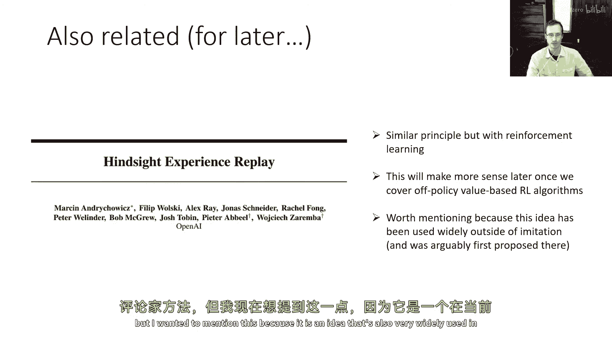

嗯。

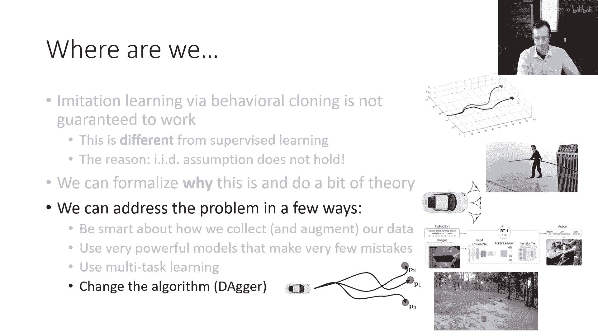