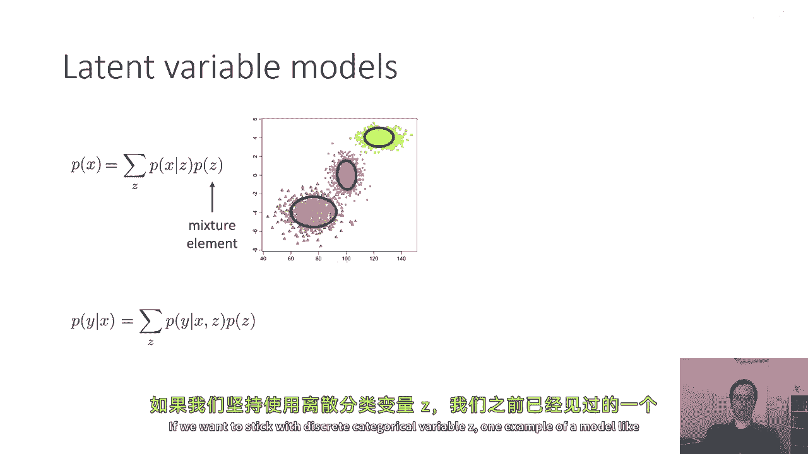
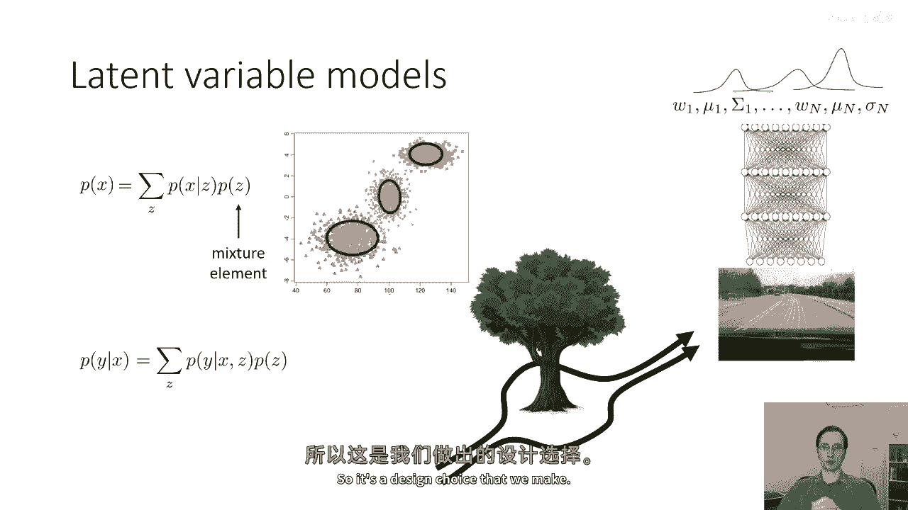
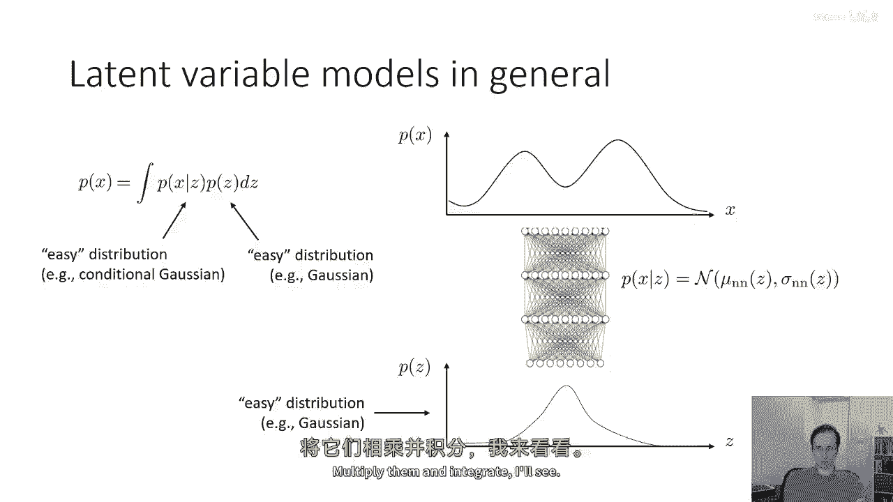
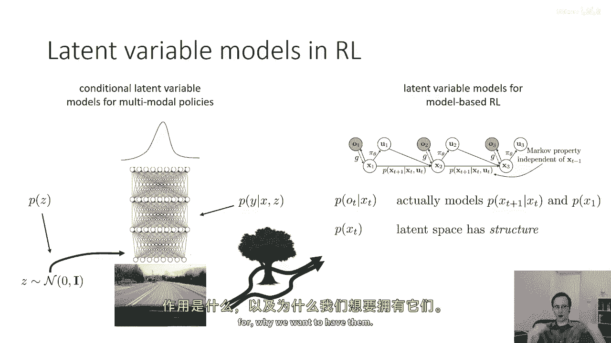
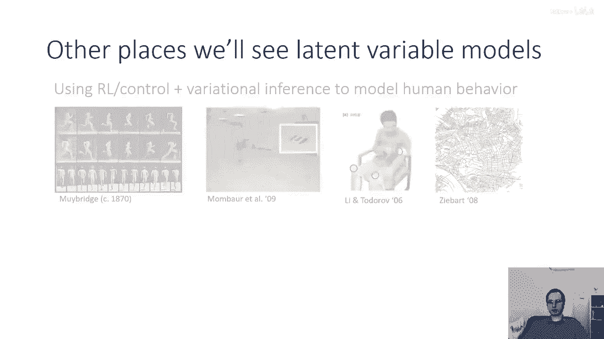
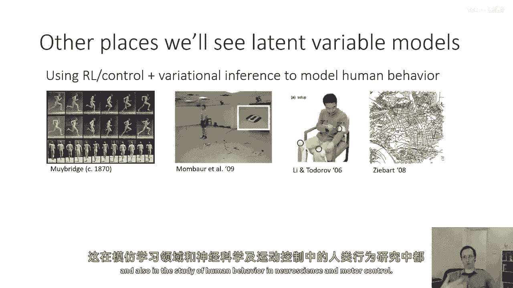
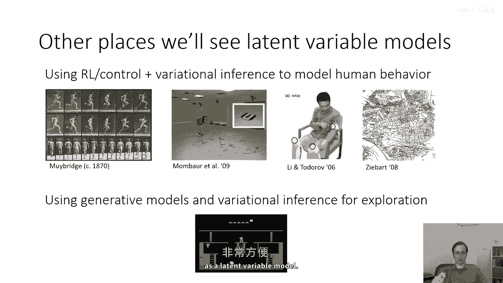
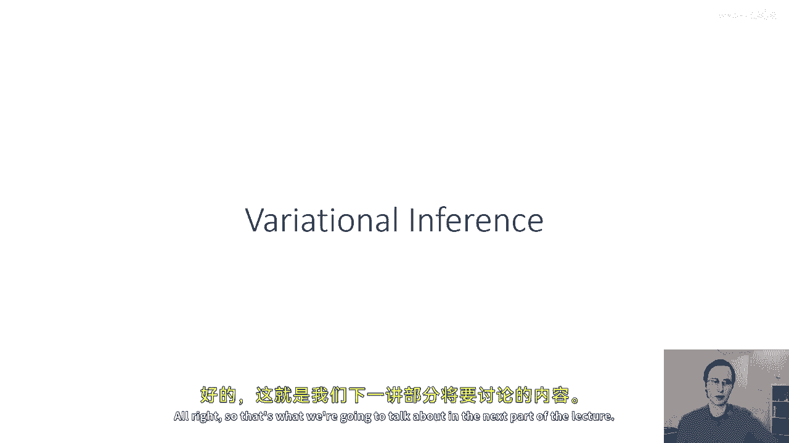

# P73：p73 CS 285： Lecture 18, Variational Inference, Part 1 - 加加zero - BV1NjH4eYEyZ

好的，嗯，欢迎参加今天的cs two eighty五第十八讲，我们今天要做一些与平时不同的事情，而不是覆盖任何新的强化学习算法，实际上，我们将谈论变分推断和生成模型，这是对我们通常材料的一个小突破。

因为我们今天不覆盖任何强化学习算法，但我想在这门课上有一个关于变分推断的全课，因为变分推断的概念一再出现，包括基于模型的强化学习，逆强化学习探索和其他的，更一般地说。

变分推断与强化学习和基于控制的学习有非常深的联系，下周我们将学习这个，所以今天的讲座中，我们将讨论概率潜在变量模型，它们是什么以及它们用于什么，我们将讨论变分推断如何允许我们。

积极地近似概率潜在变量模型的训练，然后我们会讨论一个叫做近似变分推断的东西，这是一个非常有用和强大的工具，用于利用变分推断，与函数近似器如深度神经网络一起使用，然后我们将以讨论一些示例模型结束。

我们可以使用近似vi来训练这些模型，包括变分自编码器和在各种序列级别模型，这些模型在基于模型的rl中有用，所以今天讲座的目标将是理解深度学习中的潜在变量模型，并理解如何使用近似变分推断来训练它们，对吗。

所以让我们从一种非常基本的概述开始，嗯，对于已经熟悉这些材料的人来说，可能想要跳过这部分，"但我想要确保从最一开始就开始"，"以确保每个人都在某种程度上在记号上处于同一水平"，"术语等"，"那么。

什么是概率模型？"，"概率模型是一个非常通用的术语，用于描述一个概率分布的模型。"，所以，如果你有一些随机变量x，"然后，x的p可以由一个概率模型表示"，"花一点时间来思考我们已经遇到的概率模型类型"。

在这门课程中，我们已经见过一些例子，所以如果你有一个随机变量x，并且你想要模型x的p，也许你有一些数据，所以那些橙色的点代表你实际上观察到的x，模型x的p意味着为他们拟合一些分布，例如。

你可能拟合一个多元正态分布来尝试代表这个数据，现在概率模型也可能是条件模型，所以，例如，你可以有一个模型p，表示给定x时y的分布，在这种情况下，也许你不关心对x分布的建模。

但你关心给定x时y的条件分布建模，所以如果你有一些在x轴上的输入x，和一些在y轴上的输出y，你可能拟合一个条件高斯模型，一个代表y的模型，就像这种情况，一个关于x的线性函数，带有一些加性高斯噪声。

现在我们肯定见过这样的模型，花一点时间回想一下，在这个课程中我们见过条件概率模型，所以，嗯，这种模型的一个例子，当然，是政策，政策是条件概率模型，他们给我们提供了一个关于给定s的条件分布，好的。

所以现在，今天讲座的主要主题实际上是一种叫做潜在变量模型的东西，潜在变量模型是一种特定的概率模型，正式上，潜在变量模型只是一个模型，其中存在一些变量，除了作为证据或查询的变量之外，所以在p(x)中。

没有证据，查询是x，在p(y|x)中，证据是x，查询是y，如果你有一个潜变量模型，这意味着模型中有一些其他变量，既没有证据也没有查询，因此需要将它们整合出来以评估你想要的概率。

一个非常经典的潜变量模型例子，人们用来表示，P(x)是一个混合模型，所以在这张图中，我们有组织成三个非常清晰簇的数据，现在事先我们没有被告知这些簇是什么，所以这里的簇被着色，但是。

数据实际上并没有被颜色编码，数据只是一组点，你想要准确地代表符合这个数据的分布，现在，我们来看看，发现用这种方式来代表这个分布非常方便，一个由三个多元正态分布组成的混合模型，这是一种隐含变量模型。

花一点时间来思考这里的隐含变量是什么，所以，在这种情况下，隐含变量实际上是一个类别，一个离散变量，可以取三个对应于三个簇身份的值，并且，我们可以将这个潜在变量模型表示为一个和，对所有可能的潜在变量值。

条件分布的和，对于我们正在模型的变量，即给定潜在变量z时，x的概率是z的概率乘以x给定z的概率，所以这里，P(x)由z的和给出，p(x|z)乘以p(z)，Z是一个分类变量，可以取三个值，对应于簇的身份。

并且x是一个对应于点实际位置的二维连续变量，对于条件模型，我们可以做同样的事情，我们可以说，给定x，y的条件概率由我们的潜在变量的求和给出，p(y|x，z)等于z次p(z)的求和，现在。

还有其他方法来创建这种分解，你可以，例如，说p(z)也取决于x，所以，你可以有p(y|x，z)等于p(c|x)z次，甚至，y的条件可能不依赖于x，所以，如果你有z给定p的y，你也有x给定p的z。

这些都是有效的分解，而且，这是一个设计选择，是你做出的，如果我们想要坚持使用离散类别变量z，一个像这样的模型的例子是我们之前已经见过的混合密度网络。

这是我们在讨论模仿学习时讨论的模型，以及我们可能想要如何做多模态模仿学习，为了处理如驾驶树木周围的多模态情况，所以，在第二堂课程的第二节，我们学习了如何让神经网络输出uh，由高斯混合的分布表示。

所以神经网络的输出是多个均值和标准差，一个对应于混合物元素的一个，和多个w的，好的，假设网络的输入是x，输出是y，并且隐变量再次是簇的身份，花一点时间来思考这个图片的概率模型，在幻灯片的右侧实际上。

所以它代表给定x的y概率为y的和的，"给定某物后，p的z次方"，"Z给定了某物"，"那是什么"，"在这种情况下"，"我们的神经网络实际上正在输出高斯分布的均值和协方差"。

"并且还输出每个混合物元素的概率"，所以实际上，这个模型由对z的求和给出，其中p表示给定x时y的概率。"逗号 z 次 p 的 z 给定 x"，所以实际上这与我在这里写的方程有点不同，嗯，在图片里，嗯。

就在那里，z的p实际上取决于x，所以这是我们做出的设计选择。

好的，所以总的来说，如果你有一个潜在变量模型，嗯，你可以这样想，你有一个由这张图片表示的关于x的复杂分布，所以x的p是一些复杂的事情，你有关于z的先验p(z)，通常我们会选择这个先验为一个更简单的分布。

也许它 是，也许z是类别的，所以z的p是一个离散分布，或者z是连续的，但z的p是一类非常简单的分布，比如高斯分布，然后可能我们代表从z到x的映射，z给定x的p作为某个简单的条件分布。

所以z给定x的p可能可以是一个神经网络，其中均值由z的神经网络函数给出，方差由z的神经网络函数给出，这些函数可能非常复杂，但给定z的分布x可能非常简单，它可能，例如，高斯，正态分布。

所以z的p是一个简单的分布，z给定x的p也是一个简单的分布，那个简单分布的参数可能很复杂，但分布本身是简单的，例如，嗯，可以明确参数化的东西，这是一个非常重要的点要理解。

尤其是我意味着这里的'简单'这个词，x的p不是简单的，因为它非常难找到一个单一的参数化，像高斯分布或贝塔分布那样完美地捕获x的p，z的p是简单的，因为简单的分布，像高斯可以完美地捕获它。

z给定x的p也是简单的，因为你可以用高斯分布来表示它，尽管那个高斯分布的参数可能非常复杂，现在，当然，我正在使用高斯分布作为示例，这里这些可以是不同类型的分布，不同的参数化，它们可以是离散的或连续的。

所以这只是一个示例，嗯，但一般来说，P(x)将由 uh 给出，对 z 所有可能值的一些和或积分，p(x|z)乘以p(z)给出 p(x)，所以，这里的情况是，给定z，z的p和x的p关于z都是简单的。

但当你积分出z时，它们的乘积可能是一个非常复杂的分布，这是一个非常强大的想法，因为它允许我们将复杂的分布表示为简单分布的乘积，这些分布我们可以学习和参数化，好的，嗯，所以我们有一个容易的，太容易的分布。

将它们相乘，所以在条件情况下，同样的事情也可以发生。

所以嗯，在例子中，我之前有过条件潜伏变量模型用于多模态政策，你可以在输出上有一个高斯混合物，或者更一般地，你可以有一些潜伏变量，让我们叫它z，它作为额外的输入进入模型，你有一些先验p(z)。

你有你的给定x，z的条件p(y)，嗯，与前一张幻灯片相同的逻辑将适用，所以z的p将简单，给定x，y的p，逗号z将简单，但是，消除c的结果，这意味着给定x，y的结果分布p可能极其复杂。

这些类型的事情在基于模型的强化学习中经常出现，所以在基于模型的强化学习中，你可以有潜伏变量模型，当我们谈论基于模型的rl时，我们已经看到了一个例子，所以我们看到了这些潜伏状态模型的例子。

你在其中观察图像o，你想要学习依赖于动作u的潜伏状态x，而且实际上，我们有一个更复杂的潜在空间，所以我们有我们的观察分布，P(o|x)和先验P(x)实际上模型，嗯。

它实际上模型p(x_t+1|xt)和p(x_1)，所以，先验x的结构更加复杂和复杂，这些模型的潜在空间有结构，我们将在讲座的末尾再次讨论这个问题，所以，如果这个部分不完全清楚，不要害怕那个。

我们稍后会回来讨论这个问题，所以现在我们已经了解了什么是潜在变量模型，它们用于什么。

我们为什么想要拥有它们，我们将在其他地方看到潜在变量模型。

所以下周我们还将讨论如何使用强化学习，与变分推断一起，实际上建模人类行为，所以不再说给定奖励函数，什么是最佳的行动方式，你可以说，一个人的行动日期，我们能否反向工程这个人想要干什么。

我们能否推断出他们的目标函数，推断出他们的思考过程，这在模仿学习领域很常见，也在神经科学和运动控制中研究人类行为中。

我们还看到潜在变量模型和生成模型在探索中，当我们谈论探索时，我们实际上简要提到了这个，我们讨论了如何使用变分推断技术来进行如信息增益计算的事情。

我们如何使用生成模型和密度模型来分配伪计数并考虑基于账户的奖励，所以这种生成模型和潜在变量模型经常出现，在强化学习的研究中，顺便说一句，当我使用术语生成模型时，只是为了澄清术语，有一点。

生成模型是一种生成x的模型，所以p(x)是生成模型，潜在变量模型是一种具有潜在变量的模型，并非所有的生成模型都是潜在变量模型，同样，并非所有的潜在变量模型都是生成模型，然而。

通常将生成模型表示为潜在变量模型要容易得多，因为生成模型通常需要代表一个非常复杂的概率分布，而且，代表一个复杂的概率分布要容易得多，作为一个多个简单概率分布的乘积，因此。

尽管生成模型不一定是潜在变量模型，常常，当我们有一个复杂的生成模型时，将其建模是非常方便的，作为一个潜在变量模型。

好的，那么现在让我们来谈谈讲座的实质，让我们谈谈我们如何训练潜在变量模型，并且为什么这很难，好的，假设我们有我们的模型p theta(x)，所以这里theta代表模型的参数。

我们有数据x1 x2 x3等等到xn，当我们想要拟合数据，我们通常想要的是最大似然拟合，所以，最自然的生成模型目标就是设置theta等于arg的最大值，"n次最大值除以所有数据点的和。

乘以对参数θ的log p x i的值"，所以，如果你能找到最大化所有数据点对数概率的theta，"你将找到被称为最大似然拟合的结果"，"哪个"，在某种程度上，"基本上是你数据最好的模型"。

"并且你关于x的p分布的给定是由在z上的p(x)的积分得到的。"，"假设z乘以p等于z"，所以如果我将这个方程替换为x中的p，并将其代入最大似然拟合中，我会得到这个训练目标，现在，当然。

这个训练目标的第一个你可能注意到的特点是非常难以计算，如果z是连续变量，计算这个积分，每次你想要取梯度步时，都会变得非常难以处理，所以我们不能真正地在一些非常简单的情况下这样做，例如。

如果我们有一个高斯混合模型，实际上，我们可以对所有混合元素进行求和，结果发现，该算法仍然不是很好，因为它最终具有非常糟糕的数值属性，所以，即使在我们可以估计这个积分的情况下，我们往往不想。

因为结果优化的地形非常糟糕，但对于连续变量，我们甚至可能没有那个选择，我们可能无法准确估计那个积分，即使我们想要，那么，如何估计对数似然和该对数似然的梯度，以一种可处理的方式。

这就是训练这些潜在变量模型的关键，嗯，一种替代方法是使用被称为预期对数似然度的目标函数，我将在这里陈述目标函数，我不会证明它，但当我们 later 讨论变分推断时，我们将看到为什么这个目标函数是合理的。

所以目前，就简单地接受这个目标函数是我们要使用的事实，但后来我们将看到为什么这个目标函数是首选的选择，所以，预期的对数似然直觉上等于，大致猜测隐含变量模型是什么，所以。

你可以把隐含变量看作是基本上对数据的部分观察，所以，数据实际上由x的和z的组成，但你只能观察到x的，但不能观察到z的，所以，你可以做，你可以基本上猜测z的值，你可以说，给定数据点在这里。

它可能属于这个簇，然后构建一种假标签，说是这个xi实际上有这个值z，然后对这个值x和z进行最大似然估计，当然，现实中你并不知道与特定xi对应的z确切值，但你可能对它有一个分布，所以。

而不是只取z的一个值，那是最可能的，你将取所有z的分布并平均，按那个z的概率加权，这就是给我们提供预期对数似然计算的，所以，我们将使用的目标是对所有数据的和，给定x_i，关于z的期望点。

对log p(theta|x_i，z)的分布，所以直觉是，如果你猜测给定x_i最可能的z，并假设它是正确的，尽管，当然在现实中，你不实际上只猜一个z，你实际上对所有疾病进行求和。

它们的权重是根据它们成为正确z的概率，嗯，所以有許多可能的z值，所以你使用z给定x_i的分布p，好的，那么首先，为什么主观的，嗯，更易于处理，嗯，因为预期值可以通过样本来估计，所以所以那个预期值。

如果你，如果你想要得到一个无偏的预期值估计，你不需要实际上考虑所有这些，你可以直接从给定x i的z后验p中采样，然后平均起来，那些样本的日志概率，你不能在之前的幻灯片上做那个把戏，你不能做那个把戏。

如果你有积分的日志，因为对积分或和的对数的分解不线性，但是，和可以这样做，你可以用样本来估计它，所以，估计这个的可行的算法是，就像与，嗯，我们看到政策梯度就是采样从z给定x_i，然后平均起来，对数概率。

你可以做，当然，对于梯度，也是一样的，所以如果你能得到这个后验p给定x_i的z，那么你就可以以可处理的方式计算预期的对数似然，并以可处理的方式计算其梯度，但是。

然后大挑战就变成了我们如何计算给定x_i的z的p，如果我们能只计算那个量，然后我们就可以估计预期的对数似然，所以这就是下一部分讲座的主题，所以当你想要估计给定x_i的z的p时。

你实际上是在说给定x的一些点，将它映射回z分布的一个分布，这可能是一个相当复杂的分布，然后计算在那个分布下的对数似然，好的。

