# P76：p76 CS 285： Lecture 18, Variational Inference, Part 4 - 加加zero - BV1NjH4eYEyZ

今天的讲座最后部分，我们将讨论如何实际实例化实用的深度学习模型，基于我们在其他部分讨论的原则，并且，我们将简要讨论一些例子，说明如何，这些类型的模型可以在深度强化学习中应用，现在。

我们将讨论变分推断在深度强化学习中的角色，更广泛地在后来的讲座中，但是今天，我们将只专注于生成模型的直接应用，使用 amortized 变异推断进行训练，所以让我们首先从。

使用 arguably 最具基础的 amortized 变异推断模型开始，那就是变分自编码器，所以在变分自编码器中，我们将建模某种输入 x，它通常使用潜伏变量或潜伏向量 z 来表示图像。

我们将有一个编码器和解码器，如以前，所以这将是大约，我们概述原则的最直接实例，我们的编码器是一个深度神经网络，它接受输入x，并产生关于z的均值和方差，所以编码器定义了给定输入x时z高斯分布的峰值q。

其中均值和方差由神经网络的输出给出，解码器是一个神经网络，它要接受z，并产生关于观察的均值和方差，观察变量x，想法是如果我们想要采样，我们将从先验分布中生成一个z，这通常被固定为一个零均值单位方差高斯。

然后，我们将使用给定z的解码器p theta x来解码它，这基本上意味着将其通过解码神经网络运行，然后，从输入的gaussian分布中采样结果，例如，这可以用于构建图像的生成模型，在这里。

你可以看到一些从变分自编码器中抽取的样本，训练在面部图片上，所以这里x的是像素图像，所以有像素数组的数组，并且z将是一些具有维度的潜在向量，比如六十四或一二八。

变分自编码器的架构基本上遵循我们在前面几节讨论的内容，所以如果我们想要设置这个作为训练的计算图，并且那个神经网络将输出xi的均值mu phi，和方差sigma phi的xi。

然后我们从零均值单位方差分布中采样一些噪声，然后我们将形成结果z，由均值和噪声epsilon乘以形成，标准差sigma，这给我们z，然后，我们可以将z传递给给定z的解码器p theta x。

这将产生图像，训练过程使用重参数化技巧训练整个东西，所以它被训练以最大化变分下界，相对于解码器theta的参数，和编码器phi的参数，所以目标最终就是整个数据集的平均值。

来自解码器的图像对数概率的整个数据集，其中，z的均值和标准差来自编码器，所以我们使用重参数化技巧来反向，传播这个第一个对数概率项的错误，全部从解码器传播回编码器，从而训练theta和phi，当然。

我们还必须减去KL散度正则化项，这基本上会计算为先验和KL散度，在这里是编码器分布q phi给定x i的z与先验p的z之间的KL散度，因为q phi给定x i的z是正态的。

并且先验p的z按照惯例是一个零均值单位方差正态，这个KL散度实际上可以计算在封闭形式，使用两个正态分布之间的KL散度的解析公式，所以这是非常直接的可以做的，所以这就是变分自编码器。

变分自编码器允许我们做什么，是它允许我们训练一个潜在变量模型，表示通常被视为图像的输入，所以如何使用变分自编码器，嗯，我们可以通过训练大量的图像来使用变分自编码器，并获取潜在变量表示。

嗯我们可以从它采样，嗯例如，从先验p的z生成样本，然后使用给定z的解码器p x给定z来解码那个样本，为什么这实际上起作用，所以数学是之前的所有部分。

直觉 behind why this works is that the evidence lower bound，变分下界，试图使数据集中的图像尽可能可能，给定我们从编码器获得的z。

但是编码器也被训练以保持接近先验，这意味着如果编码器产生z的，与从零均值单位方差先验分布z的采样中获取到的z太不同，那么编码器将为此付出非常重的代价，所以编码器有很强的动机产生这些。

看起来像是从先验分布z的采样，如果它不这样做，那么编码器将为此付出非常重的代价，所以编码器有很强的动机产生这些，看起来像是从先验分布z的采样，因为如果它不这样做，然后，卡莱分歧项将会非常大。

这将会导致一个大的惩罚，现在，这解释了为什么编码器的样本将位于那个单位方差先验中，它本身并不解释，为什么来自均方差先验的任何样本都将接近正在被编码的东西，这个论据与效率有关，问题是。

编码器也希望有很高的方差，希望有接近一的方差，因为那是先验的，所以，编码器希望在其使用潜在空间的方式上很节俭，这意味着它实际上很想使用潜在空间的每一部分，如果潜在空间的某个部分未被使用，对于编码器来说。

扩展到那些空间并增加其方差将是更好的，以便其方差可以更接近一，因此，你最终会得到一个将这些z和x映射的函数，其中，几乎你从单位方差先验采样的每个z，嗯，先验都将映射到一个有效的解码。

这意味着你可以同时处理图像和代码，编码它们并获取其表示z，你可以实际上从优先代码中采样并获取合理的采样图像，这实际上在幻灯片上的动画中已经显示了。

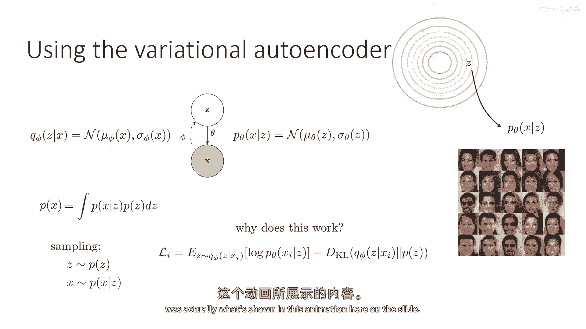

让我们谈谈深度强化学习中的应用，这种变分自编码器通常已被用于深度强化学习，为了目的代表学习，现在，这并不是处理部分可观察性的混淆，我们将稍后更详细地谈论部分可观察性，目前。

我们只是在谈论z作为单个状态的表示，所以我们仍然假设一切都被完全观察，在意义上，状态包含所有必要的信息来推断，动作是马尔科夫的，所有的好东西，但状态观察在某种程度上是复杂的，例如。

它们可能对应于Atari游戏中的图像，在这种情况下，使用变分自编码器可能确实有益，不是要采样额外的图像，但只是获取这些图像的更好表示，所以，我们的解码器现在将被训练以生成给定这些的州，但如果状态是图像。

它基本上与以前看到的模型相同，所以，例如，我们可以做，我们可以训练一个vae在所有我们的回放缓冲区中的州上，让我们说，我们的Atari游戏，然后，当我们运行RL时。

我们将使用z代替原始状态s作为RL的状态表示，然后，我们将重复这个过程现在，为什么这是一个好主意，我们可能期待这些z比状态本身更好地表示状态，很好，想法是变分自编码器，因为它学习到这些z表示。

满足独立的高斯先验，这意味着z的每个维度都独立于其他维度，应该导致比图像本身更好的变异因素解耦，想象一下，嗯，顶部右上角来自蒙太古的复仇的图像，对应于那个角色的单个像素，玩家角色，与其他像素高度相关。

在意义上，虽然玩家角色由许多像素组成，那些像素一起移动，所以对于下游的rl，这并不是那么重要，每个像素在玩家角色上的颜色，重要的是，是那个像素块的整体位置和可能速度，所以有构成图像的一些变异因素。

在这种情况下，位置，方向和速度玩家角色，以及骷髅和钥匙等，它们代表比图像本身更简洁和有用的表示，像素本身，这些是变异因素，我们直觉上想做的，是将这个图像解耦变异因素，使得每个相对独立的变异因素。

如玩家角色的位置和骷髅构成新的学習状态表示的维度，这是大约变分自编码器试图做的事情，我在左下角展示的图片，这些来自希金斯等人的工作，于2017年。

当不同类型的变分自编码器被训练在具有已知变异因素的数据上时，所以在左边，你可以看到家具项目不同的形状、大小和方向，在中间，你可以看到面向不同照明方向的面孔，面部表情和面部方向的变化。

在右侧是来自celeb的数据集的自然面孔图像，它们根据年龄、种族、发型等差异，作者在这些图中所做的是在每个行中，他们正在图像之间插值，在左边和右边，如果你在像素空间插值图像。

它们实际上不沿着自然的变异因素插值，例如，左边的椅子，如果你在图像之间插值像素，它们并不真正沿着变异因素插值，所以例如，左边的椅子，第一行通过从面向右的椅子到面向左的椅子插值其方向。

如果你实际上插值像素颜色，你不会得到这个结果，所以这意味着底层表示z实际上捕获环境变化的因素，这就是我们现在期望好va能做的，我会说在实际应用中，这当然是有争议的。

va们实际上捕获这些图像中真变因素的程度，但这是他们正在尝试做的，所以这是这个想法的实践实例，例如，就像作业中的一个，这可能看起来像这样，就像在常规Q学习中一样，你从环境中收集一个转换，使用你探索策略。

并将其添加到你的回放缓冲区，然后，你用变分下界更新解码器和编码器，使用回放缓冲区的批样本，这改善了表示z，然后，你用回放缓冲区的批更新你的Q函数，但是，Q函数现在以编码器产生的潜在表示z作为输入。

不是原始图片，我们期待这个过程会更容易，因为现在，q函数的表示比原始图片更好，然后我们再次进行这个过程，值得注意的是，这为我们提供了一种使用先验数据的伟大方式，所以我们有关于，嗯。

阿塔里试验的合理先验图片，我们可以使用这个来预训练变分自编码器，这将立即给我们一个良好的表示，我们可以用于rl，或者当然，我们可以在行进过程中学习它，好吗。

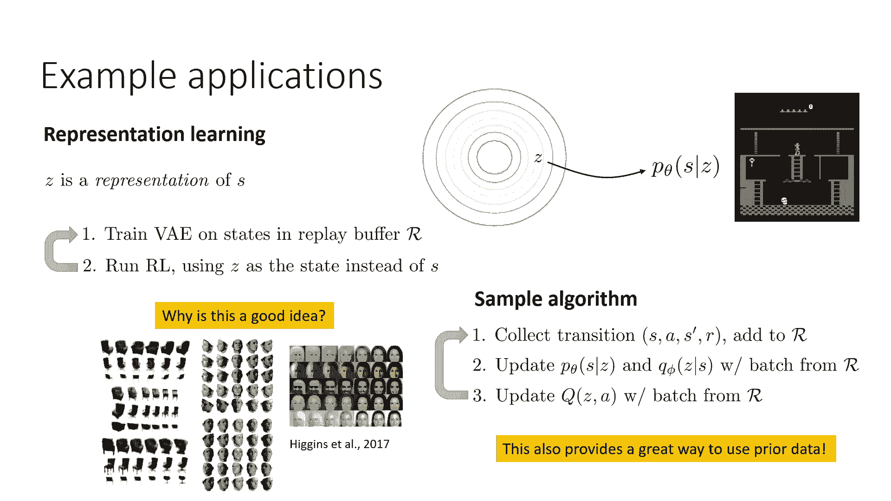

接下来我要讨论的模型类别是条件模型，现在，条件模型就像之前的va一样， except that 现在 我们的目标是不是要建模一个关于图像 x 的分布 p(x)。

 而是要建模一些给定 x 的条件分布 p(y|x)， 并且 想法是 它应该是 p(y|x)， 这可能是复杂的和多模态的， 所以 我们实际上并不在意 x 如何分布，我们只关心给定x时y的分布。

但我们希望给定x时y的分布p非常表达，为了处理这个问题，我们需要简单地将条件信息x放在条件杠的右侧，对于编码器和解码器，我们也可以选择将其放在条件杠的右侧，对于自身的先验也是如此，尽管我们不必。

并且条件模型通常简单地使用无条件先验，所以实际的变化只是，我们仍然有一个编码网络，我们还有一个解码器网络，但现在这两个都接受这个x加上条件信息作为输入，当然，使用这一方式的一个非常经典的方法是为策略。

所以y可能是动作，而x可能是观察，现在你可以认为这是一个策略，Y给定x，此外还接受噪声样本作为输入，所以使它成为p(y给定x，z)，所以现在对每个人都是一个快速的测验，这个p(y给定x。

z)是编码器的那个，或者是解码器需要一点时间来思考这个问题，所以答案，当然就是解码器是对的，因为解码器是接收z并产生变量的东西，所以这里我们建模的变量是y，所以给定x和z，y的条件概率p(y|x。

z)是解码器，基本上一切都和以前相同，除了现在我们在生成y，并且编码器和解码器都接受x的输入，先验可以可选择依赖于x，但是实际上并没有必要这样做，所以现在的架构是你有一个参数化的编码器phi。

它接受x和y，并产生z的平均值和标准差，Mu和sigma，我们还有噪声，我们还将mu加上epsilon乘以sigma来获取我们的z，但现在我们的解码器接受z和x作为输入，并产生给定x。

z的p theta的y概率，就像以前一样，整个东西都使用幻变下界在幻变自编码器的顶部所示进行训练，所以尽管模型非常条件化，但实际上实际上并没有改变多少，然后在测试时间，我们可以简单地从先验中采样z。

然后使用给定x，z的y概率来解码它。

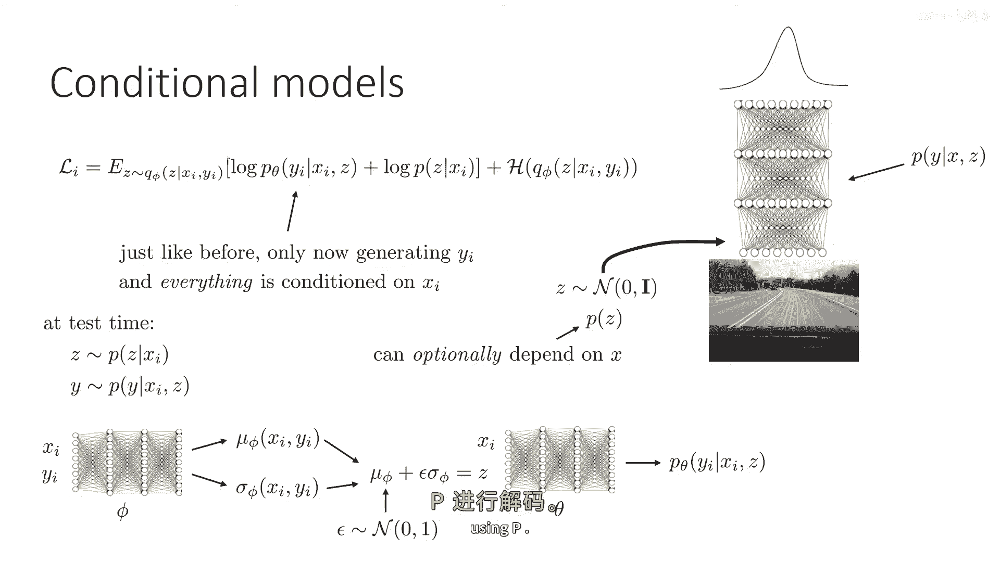

这种条件的，变分自编码器最常用于表示多模态策略，这些多模态策略可以用于强化学习，尽管它们更常用于模仿学习，为什么我们实际上讨论了这个原因在我们的一些以前的rl讲座中。

我们的目标是通常学习一个接近最优的策略，我们知道，完全可观察的MDPs通常具有确定性的最优策略，但在模仿学习中，我们希望你模仿多模态和非马尔科夫的人类行为，在这种情况下，具有多模态策略可能非常重要。

就像课程开始时的树的例子，你可以在树周围走，在左边或右边，但你真的不想平均分配，这意味着如果人类有时去左边，有时去右边，你真的希望有一个多模态策略来代表这个分布，以便你不，你不无意中走中间。

以下是一些使用这些种类的条件的论文示例，变分自编码器来在从游戏中学习隐含计划计划时表示多模态策略，我们之前讨论过a，方法包括一个相当复杂的变分自编码器，它将模型人类自由行为的数据，其中。

人类实际上在与这个机器人环境玩耍，其中，条件vae实际上甚至不甚至不代表单个动作，但动作序列，论文将其称为计划，想法是人类可能会执行许多不同的动作组合，以连接任何两个点。

这里的潜在变量解释了那些选择的差异，即使对于相同的起点和终点。

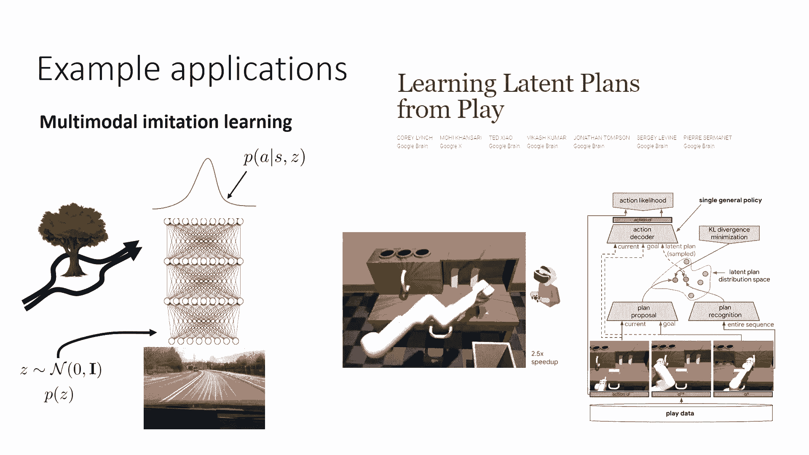

这里是另一个，嗯，使用条件变分自编码器的另一篇论文的视频，这是一个真实的机器人系统。

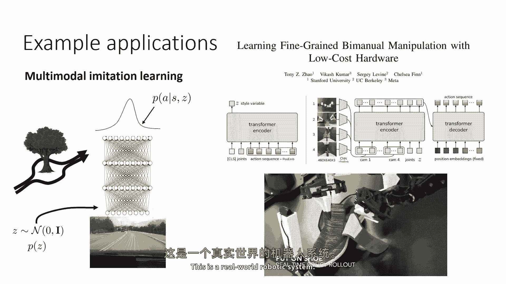

它是一款双手动操纵器，正在学习如何处理像复杂的任务，例如，给脚穿上鞋，这里的变分自编码器是条件性的，而且在这种情况下，编码器和解码器实际上都是由变压器表示的。

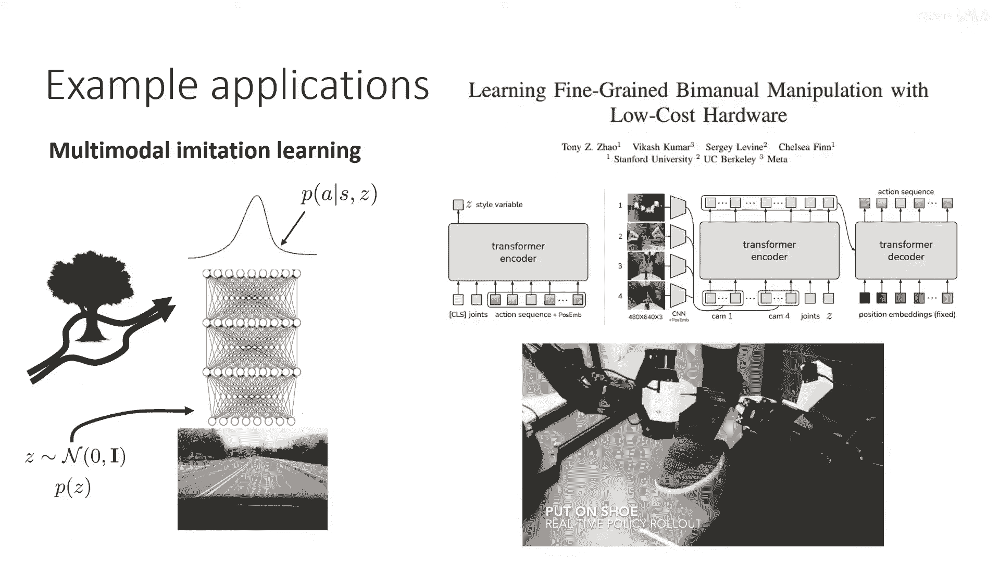

所以架构有点复杂，而且这里的词编码器和解码器有些过度使用，左边的橙色东西是vae编码器，它接受动作，实际上，它接受动作序列以提高建模准确性，但它也可以做单个动作。

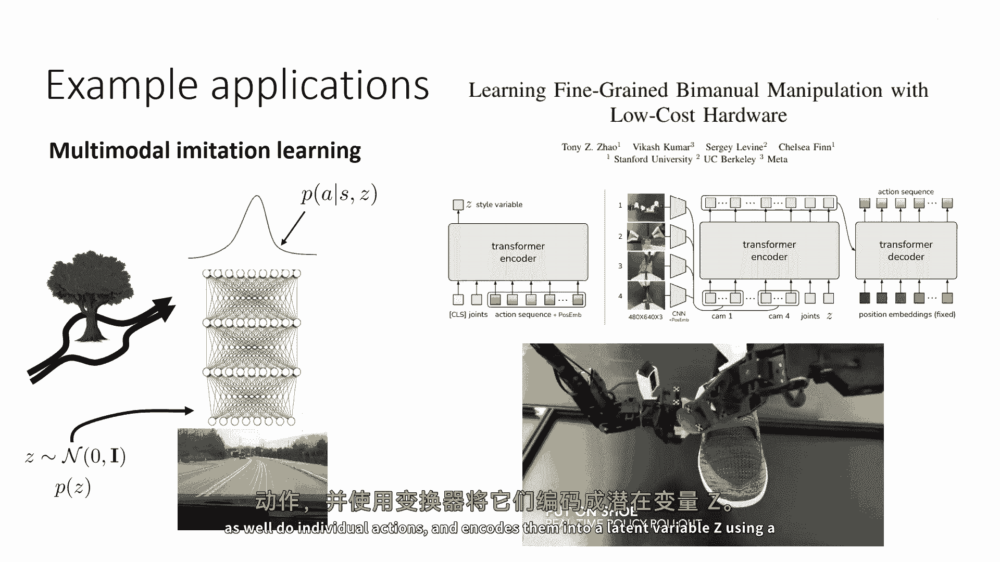

并将它们编码为潜在变量z使用变压器，然后解码器实际上由一个变压器编码器组成，它从机器人上的多个摄像头和潜在变量z中接受输入，然后将它们解码为未来动作的序列，所以它是一个更复杂的模型，结合了条件和变压器。

所以，长话短说，短条件变分自编码器已经在模仿学习中找到了许多应用，能够代表比仅使用常规高斯更复杂的策略。

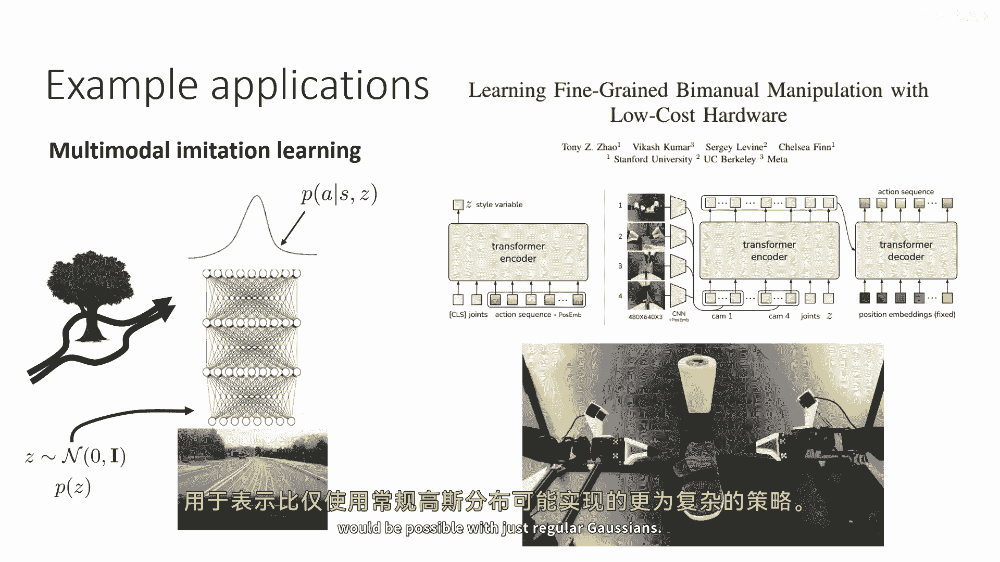

好的，我们将讨论的最后一类模型实际上是我们之前讨论过的模型，在基于模型的rl讲座中，尽管当时我们还不知道关于变分自编码器的知识，所以我们必须以非常高级别的方式描述这些，现在我将更详细地讨论这个问题。

所以这里的目标是处理部分观察的系统，我们并不知道状态，我们反而有观察序列，我们将学习基于状态的模型，其中状态z实际上是潜在状态，在变分自编码器中，所以假设我们有这些图像观察。

我们如何将序列级别的问题转化为变分自编码器，因此我们处于部分观察的设置，这就是我为什么使用o而不是s，我希望在某种程度上强迫序列建模问题，在我有z's和o's的地方，我将它们放入模型。

在我有一个单一的潜在向量z和一个单一的观察向量x的地方，我选择的是z是什么，x是什么，先验的形式是什么，解码器的形式是什么，"编码器的形式是什么？"，所以我不得不将这些部分基本上连接起来。

"而且这实际上非常非 trivial"，"这个模型要比我们之前描述的模型复杂得多"，"因为现在潜伏变量实际上本身就是一个序列"，"这并不是每次时间步长z一z二"，"在三个变量中。

一个不同的潜在变量将被引入。"，"整个z序列都将是潜在的变量"，所以，x表示观察结果是一系列的o，整个轨迹。"z的序列是在每个时间步长上的z的序列"，从z一到zt。

所以变分自编码器现在是一个序列级别的变分自编码器，它有时被称为序列vae，实际上，这个序列v实际上是有条件的，所以它是序列级别的有条件的，它条件于什么，花一点时间来思考这个问题，答案，当然。

这取决于我们未建模的部分，这是动作，所以它实际上是一个有条件的ve，带有条件信息，条件栏右侧的东西是动作序列，观察值x是观察时间步的序列，并且潜在变量z是个体时间步的z序列，我们的先验是什么。

因为我们现在有这些动态，所以先验将更加结构化，因为这些，所以我们不想z的个体维度是独立的，就像他们在常规中一样，我们想要z的不同维度相互关联，我们想要考虑动态，这些都是先验的一部分，所以请注意。

我们的先验现在实际上是有条件的，z的先验p由z一的p的乘积给出，这可能是零，均值为1，方差为1的正态分布乘以，zt加上zt-1给定ztat的pzt+1的乘积，动态部分通常也为序列费学习。

所以它是先验的一部分，但是，首先一步是学习高斯分布，但是，其他步骤并不像，你可以想象，z的值在潜在空间中形成一个轨迹，但是记住，除了z一，z二，z三，z四和如此等等并不像一般按照单位高斯分布。

他们的分布取决于之前的，嗯，我们的解码器将解码z为os，并且解码器通常在每个时间步独立，这是因为我们想要疾病总结所有必要的信息，对于那个时间步，我们想要z构成马尔科夫状态空间。

所以解码器将独立解码每个时间步，所以它只是由所有时间的乘积给出，步p的ot给定zt，那现在关于我们的编码器，我们的编码器也可以独立吗，总的来说，答案，当然不是，因为如果我们在一个部分观察的设置中。

整个要点是，o two 没有足够的信息关于底层状态，z two，所以，我们的序列编码器，ve 通常实际上是最复杂的部分，编码器将给我们 z t 的分布，给定所有之前的 o 的，现在。

有许多不同的方式来表示编码器，编码器也可以考虑之前的z的值，实际上，编码器可以以许多不同的方式结构化，我们讨论了一些编码器如何结构的方式，在基于模型的强化学习讲座和我即将提到的论文中，实际上。

所有这些编码器都有不同的结构，我不会详细讨论所有这些编码器如何结构化，最简单的想象方式是独立的编码器，我在这里，但请注意，这个独立的编码器将所有疾病视为相互独立的，但是将它们视为依赖于整个行动序列的。

所以可以想象产生单个的过程，Z对应于查看os的历史，并推断出z现在应该被设置为什么，实际上这是非常自然的，如果我们想在部分观察的环境中有一个状态估计器。

我们可能会推断出给定观察历史到现在的状态分布的情况，当然我们可以有一个更好的编码器，如果我们也考虑z t-1，所以我们可以有一个编码器q phi z t给定z t-1，并且哦，有一个通过t的，现在。

我们拥有一个更好的编码器，不同的工作已经探索了各种不同的编码器，并且，使用变分推断框架的目的是，我们实际上有很多灵活性，并且应该使用哪种编码器，一些编码器会比其他编码器更好。

因为它们会导致更准确的后验分布，但是，所有这些都构成了有效的变分下界。

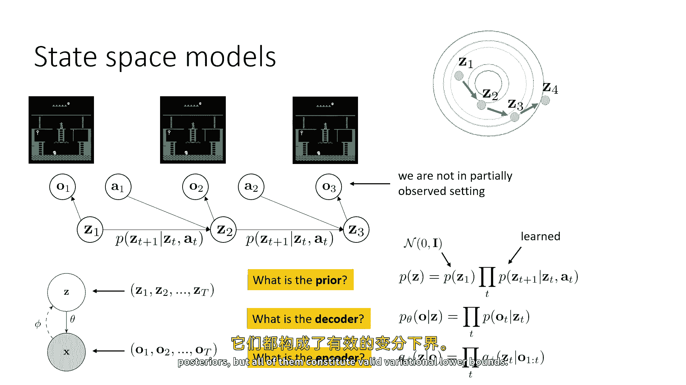

所以，在这个例子中，解码器将是独立的。

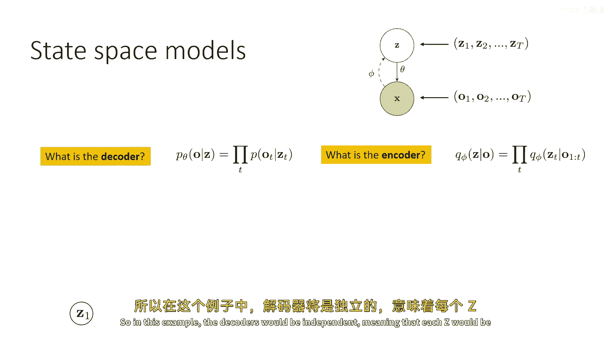

意味着每个c都将被解码为那个时间步的图像，并且给定z的图像是相互独立的，但是，当然，z们都因为先验而紧密相连，编码器将输入一系列图像并产生对货币的分布，并且我们可能会用某种序列模型来表示。

如lstm或transformer，并且你可以看到，一旦我们将编码器表示为序列模型，它也很容易地输入之前的。

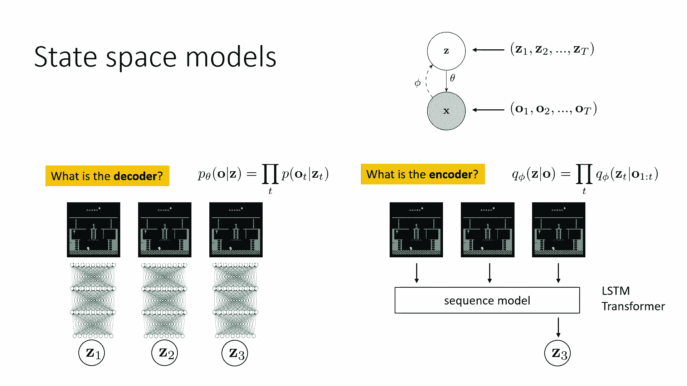

好的，所以，以下是这些序列模型在深度rl中的一些应用，一个应用领域是学习状态空间模型并在状态空间中规划，已经有许多论文做了这个，其中一篇最早的是这篇叫做嵌入到控制的论文。

其中想法是学习各种简单系统的潜在空间嵌入，如推杆和质点，等等，所以他们在这里可视化状态空间，这是一个基于状态的空间对于推杆，在右侧，你可以看到，他们正在可视化训练过程中的几何形状，他们想要强调的是。

真正的状态空间，哪个是算法不知道的，摆锤的真实自由度实际上是由算法推断的，从像素中训练，嗯，这是一个更复杂的任务，这里的潜在空间是三维的，你可以看到它如何展开这些，嗯，图像到潜在空间。

它类似于系统的真实状态空间的几何形状，这里有一些可视化，在右侧是简单的摆锤环境，他们正在可视化生成，在左侧是真实的图像，嗯，这是他们做的一个更复杂的车pool平衡任务，现在，当然，这是一个更早的作品。

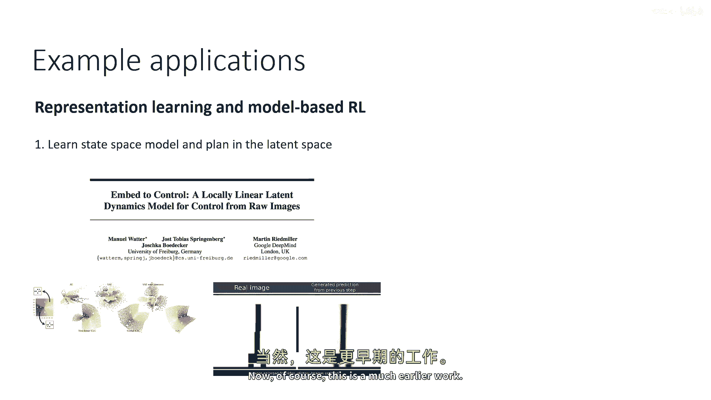

它使用了非常原始的图像，从那以后，事情已经取得了很大的进步，嗯，这是七年前的作品。

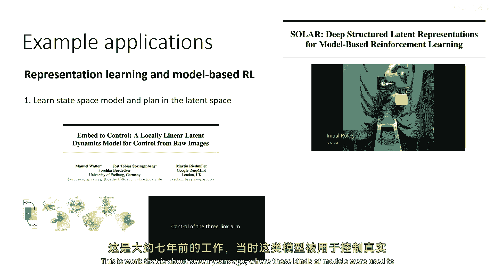

在这些模型被用来控制真实机器人的地方，所以，实际上，序列ve在这里是在预测，嗯，来自机器人的图像，而且，政策并没有控制它来堆叠乐高积木。

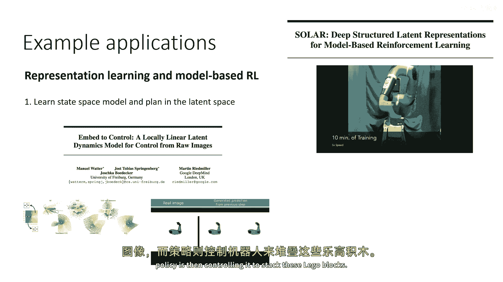

稍后，这些方法也被应用于许多基于像素的基准任务，效果良好，使用各种不同类型的编码器，并且也使用各种规划算法，从lqr到随机采样，以及其他种类的轨迹优化器，一切都包括在内。

使用序列模型的另一类方法使用这个，嗯，使用状态空间模型推断状态空间。

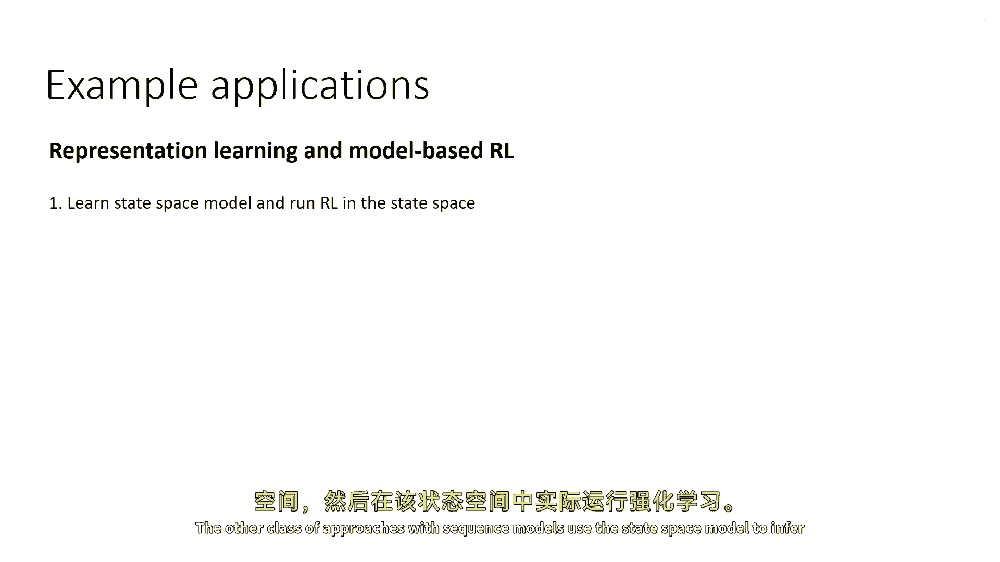

然后在那个状态空间中实际运行rl，这里有一个例子叫做随机潜伏演员批评家，这使用了一个q函数演员批评算法，嗯，软演员批评算法使其能够与图像观察工作，所以这里使用了序列ve来提取演员批评算法的表示，在这里。

你可以看到系统的一些真实滚动，然后一些来自vae的样本，显示vae实际上在学习生成看起来非常像真实系统的视频，嗯，这是另一篇论文，嗯，做了非常类似的事情，使用了演员批评算法，实际上使用了短时步长的回滚。

实际上这是一种规划与强化学习的结合，使用序列v来表示潜在状态。

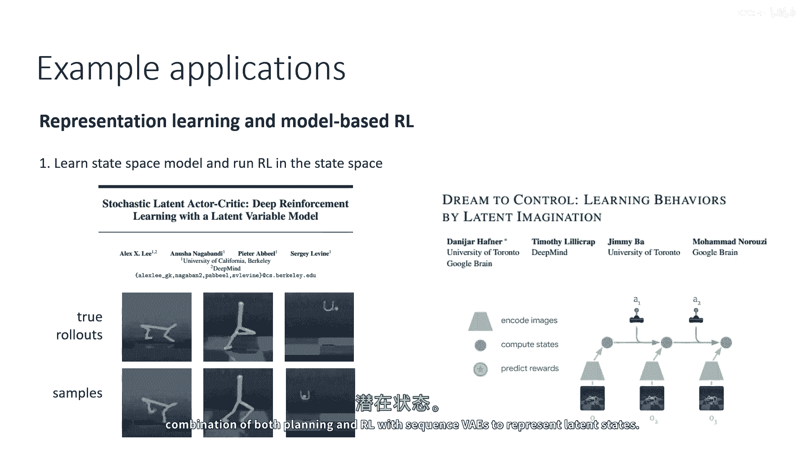

好的。