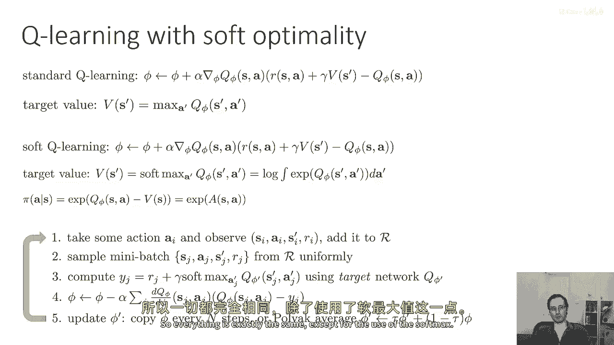
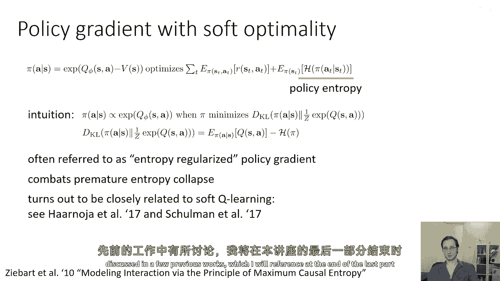
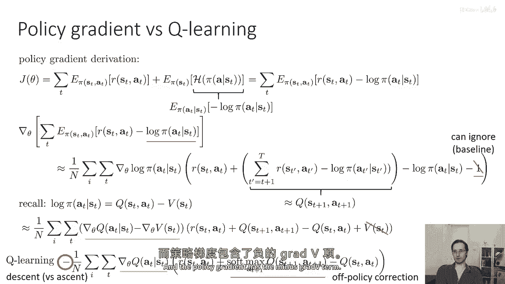
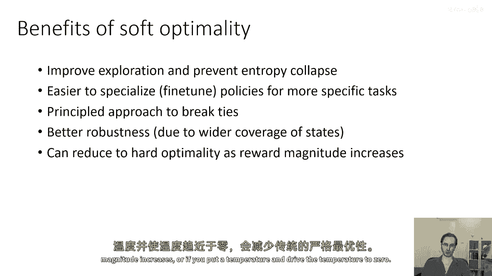
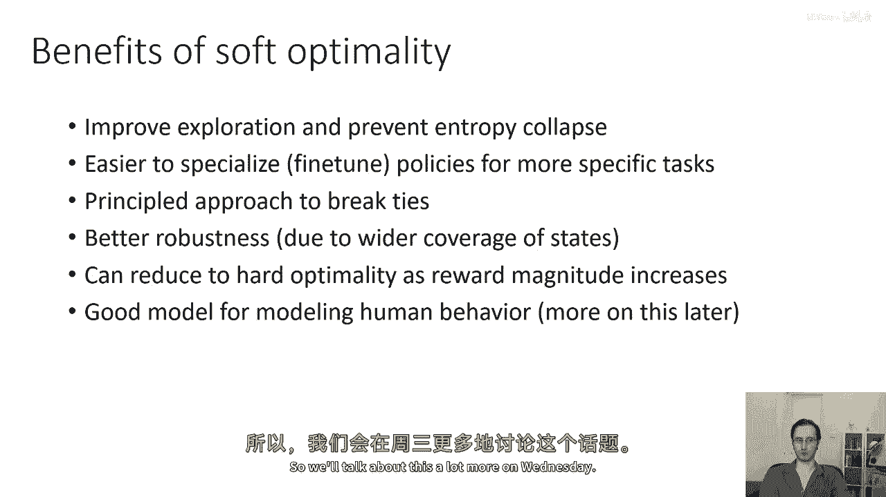
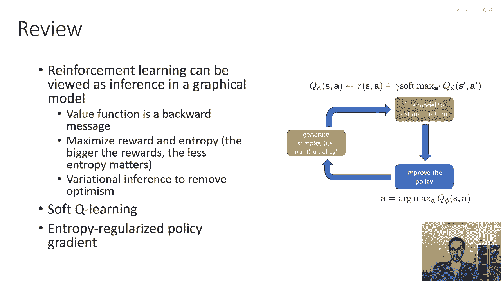

# P80：p80 CS 285： Lecture 19, Control as Inference, Part 4 - 加加zero - BV1NjH4eYEyZ

好的，让我们讨论一些强化学习算法，基于我之前在上一节中提出的想法，以及一些可能更直接的方法，所以首先我们可以想象使用软最优性标准进行Q学习，Q学习使用此更新，所以您将新的5维向量设置为旧的向量。

加上一些学习率乘以，Grad phi q，乘以贝尔曼误差r，加上下一个b减去q，其中您的目标值只是下一个时间步的q值最大，您可以，嗯，按照相同的方式实现软Q学习程序，实际上，Q函数的更新是相同的。

唯一的区别是当您计算目标值时，而不是对下一个动作取硬最大，您取软最大，这是对指数化q值的对数积分，或对指数化值的对数和，如果您有离散动作，所以这非常直接，并且您可以以相同的方式从价值迭代中推导出Q学习。

当我们之前谈论基于价值的方法时，我鼓励您做这项作为练习，如果您想要更熟悉这个材料，在软Q学习中恢复的政策是由指数化优势给出的，而不是贪婪政策，并且这个政策可以证明是相应变分推断问题的解，所以产生的算法。

软Q学习算法的结果看起来，嗯，你知道，与以前我们看到的算法非常相似，我们采取一些行动并观察，S i a i s i prime ri添加到我们的缓冲样本中，从缓冲中提取一个小批量，然后我们计算目标值。

唯一的区别是，不再对下一个时间步的q值取最大，现在，我们取软最大，但就像以前，我们更新我们的Q函数以进行回归步骤，以改善我们对目标值的拟合，我们懒散地更新目标网络的参数，所以一切都相同。

除了使用softmax。

我们也可以不担心动态规划，并返回我从变分推断中获得的原始目标，这是预期的奖励之和，以及熵之和，实际上，导出一个政策梯度算法非常直接，以优化主观的，当然，目标中预期的奖励部分，其评分正是标准的政策梯度。

唯一的新东西是熵，所以嗯，这个程序的直觉是，政策π将与指数化的Q值成正比，或等于指数化的优势，当π最小化π与z分之一时的KL散度时，指数化q，然后嗯，当然，这个KL散度等于一个常数。

等于在π下q的期望减去π的熵，所以实际上这经常被称为熵正则化的政策梯度，并且对于政策梯度来说可能是一个好主意，因为它对抗政策熵过早坍缩，记住，基于策略的政策梯度算法完全探索，由于策略中的随机性。

所以如果策略过早地变得确定，你将得到非常糟糕的结果，所以这是对熵进行了正则化，所以，我们将目标函数添加到策略中可以在实践中非常有帮助，嗯，它实际上也与Q学习算法非常密切相关，这在几篇以前的工作中有讨论。

我将在讲座的最后一部分引用这些工作。

好的，嗯，让我们稍微谈谈政策梯度如何与在这个推断框架中的Q学习相关，嗯，政策梯度如何与Q学习在这个框架中相关联，所以，如果我们写出这里的目标函数，我称之为θ的j，就像在政策梯度讲座中一样。

熵就是π的期望值下负对数π的期望值，所以，这是一种等价的写法，当我们对这个表达式取梯度时，我们可以将这个梯度写为两个术语的和，第一个术语是常规政策梯度，将r减去log log pi视为奖励。

第二个项的评分通过log pi进行，目标函数的一项，现在，嗯，如果你实际上对这个进行计算，这个表达式实际上等于常规政策梯度，奖励为r减去log pi，加上通过log pi的梯度项后，仅仅是减去一。

为什么它是减去一，很好，如果我们应用在政策梯度推导中相同的身份，那么结果将是负一，但是反过来，因为我们有一个grad log pi，嗯，在外面，嗯，括号。

所以负对数pi的导数就是grad log pi乘以负一，所以负一来自这里，这是非常的，非常，非常简单，但是记住，政策梯度在期望上是相等的，如果你对奖励添加或减去任何数量，所以负一实际上没有任何效果。

这导致了一个令人惊讶的结论，如果你想要做熵，正则化的政策梯度，你所需要做的就是从奖励中减去log pi，而且梯度表达式实际上并没有改变，好的，所以这就是那个的来源，你可以忽视它因为它是基于线的，好的。

所以括号内的这个数量，你可以把它看作是下一个时间点的q值，向右走，所以这就是所有奖励的总和，减去从t加一直到结束的所有对数派，记住，策略由q减去v的指数在软最优性给出。

所以我们可以替换替换ent为对数派，然后嗯，我们基本上可以替换log pi处所有的q-v，我们可以将这个表达式写成以下形式，我们可以写成grad q - grad v乘以r。

加上下一个q减去当前q加上当前v，但记住由于基线属性，任何状态依赖的函数，嗯，在括号内的可以删除，所以这个st处的v我们可以简单地去掉它，现在记住Q学习的目标，Q学习的目标是grad Q乘以r。

加上下一个Q的softmax减去当前Q，所以这里我们可以看到，现在，政策梯度实际上在软最优框架下看起来很像Q学习的目标，主要的区别是政策梯度减去了-grad V，而Q学习目标有softmax。

所以Q学习目标有这个离线策略的修正，如果你有一个在线策略的Q学习方法，你可以省略这个，并且政策梯度包含负梯度v项。

但是，否则它们实际上相当相似，好的，所以这可能是一个有趣的小知识，嗯，涉及到在软最优性框架中这两个方法之间的联系，但是，也许从实际角度来看，这种变分推断控制的所有优点是什么，作为推断和软最优性的东西。

好吧，一种好处，至少在政策梯度的情况下，它得到了改进，它提高了探索并防止了过早的熵坍缩，这对于政策梯度来说可能会大大损害探索，它可以更容易地专门化或微调政策以适应更具体的任务。

当你最终得到更随机的政策时，它实际上，它们更适合在任务稍微改变时进行微调，我将在下一部分讲座中展示一些例子来说明这一点，它提供了一种原则性的方法来打破僵局，所以，如果两个动作确实具有相同的确切优势。

它们也将具有相同的确切概率，无需担心如何取最大值，Max，这种方法也提供了更好的鲁棒性，因为你实现了对不同状态的更好覆盖，你可以直观地想象为，如果你学会了以许多可能的方式解决任务，那么。

如果其中一种方式由于环境的变化变得无效，那么你可能仍然有非零的机会成功，并且，当然，这个框架减少了经典的硬最优性，因为奖励的规模增加，或者如果你设置一个温度并驱动温度到零。

它也是一个良好的模型来模拟人类行为，这并不是通常的确定性行为，人类确实倾向于犯错误，这基本上意味着你可以犯错误，但是，错误的可能性随着奖励的减少而呈指数级减少，所以我们将在周三讨论很多这个问题，好吧。

所以，总结一下，我们讨论了如何将强化学习视为推断，在一个图形模型中，我们谈论了价值函数是如何一种向后的消息，我们谈论了如何最大化奖励和熵，并且，奖励越大，熵的重要性就越小，所以我们可以恢复硬最优性。

我们讨论了如何变分推断消除乐观主义问题，并讨论了如何将其实例化为软Q学习或熵，规范化的政策梯度程序。

