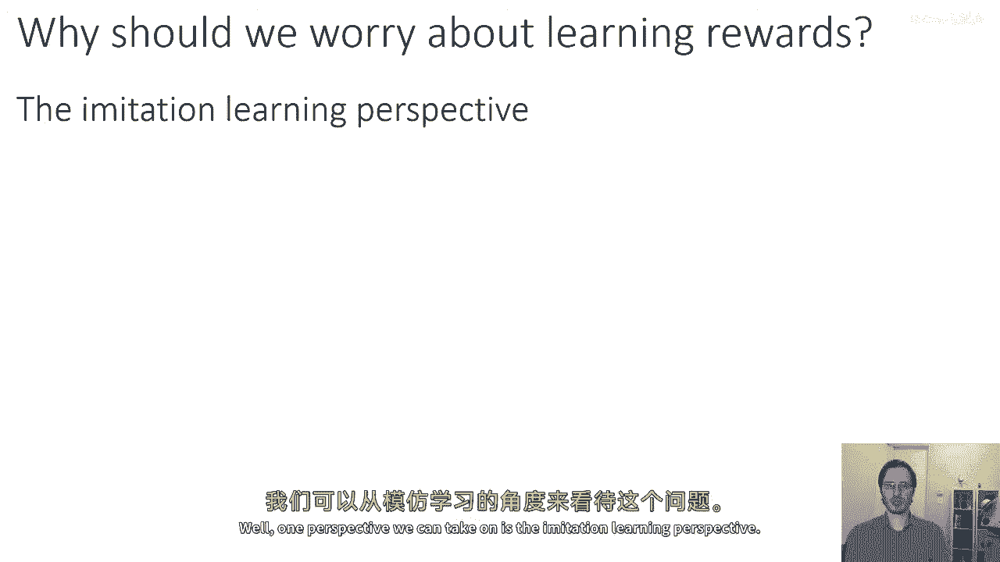
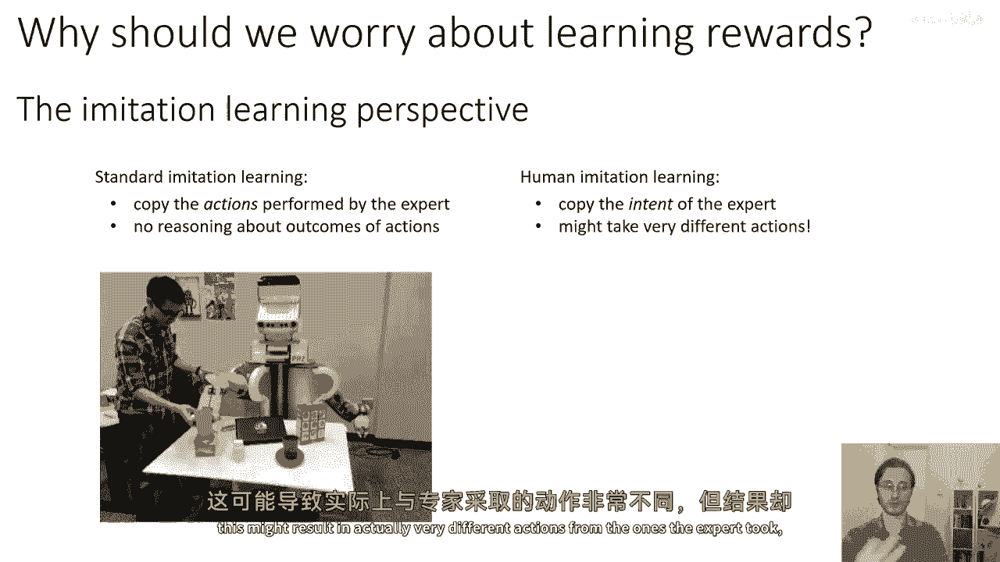
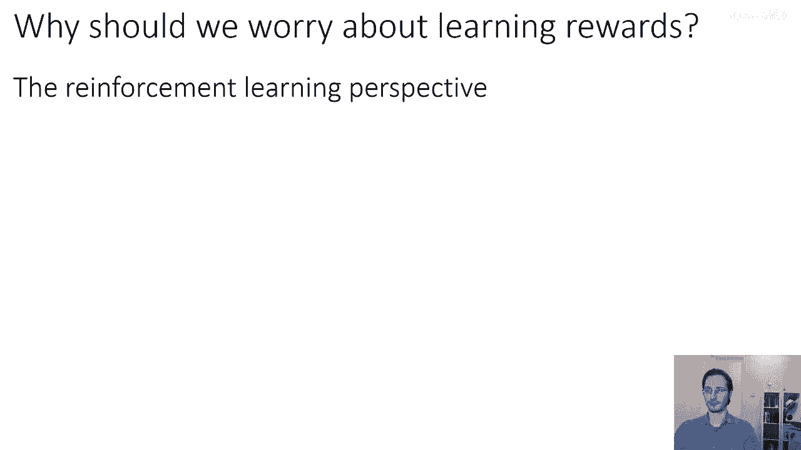
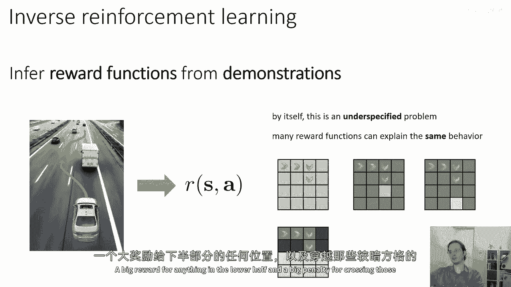
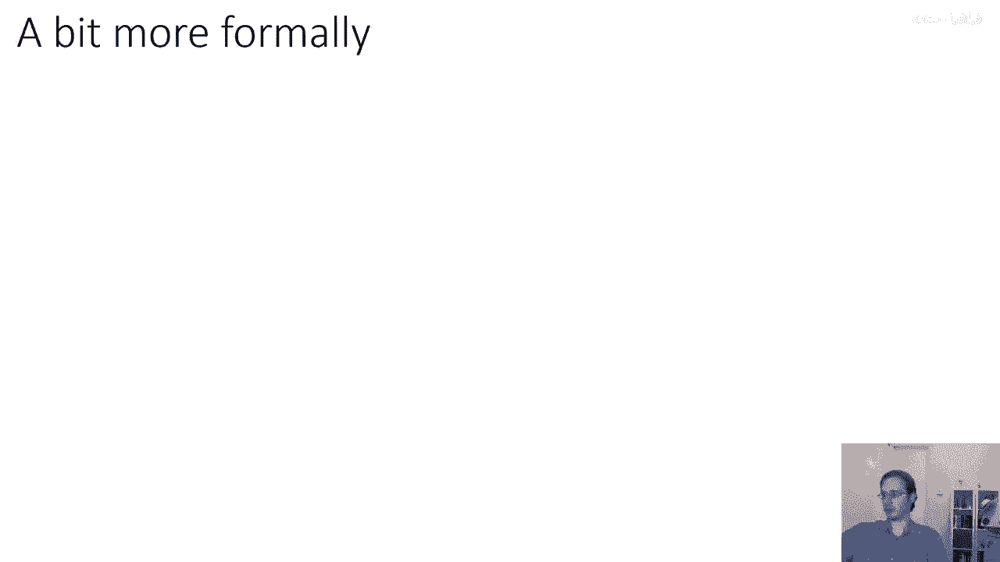
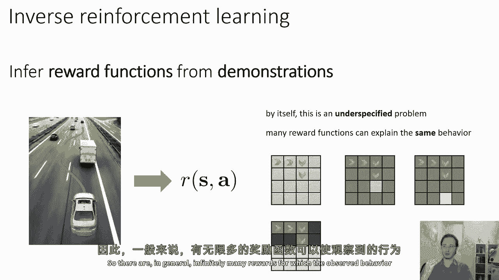
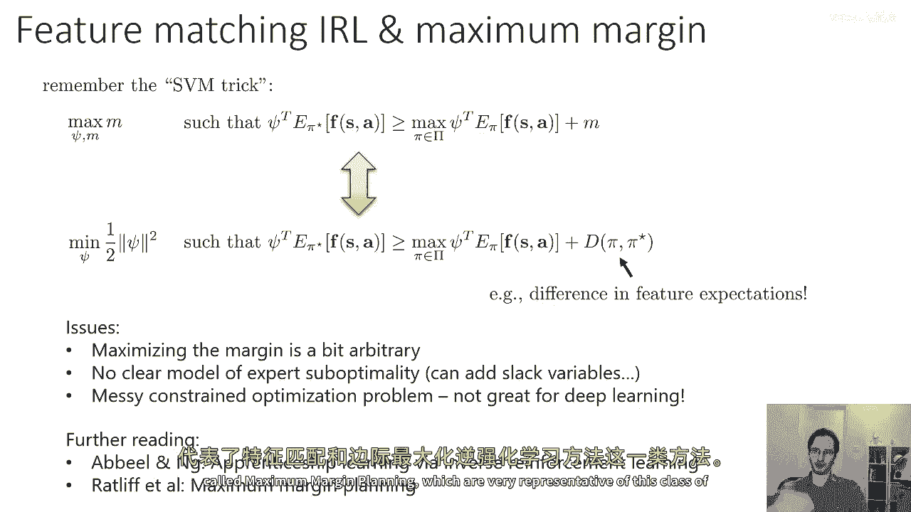
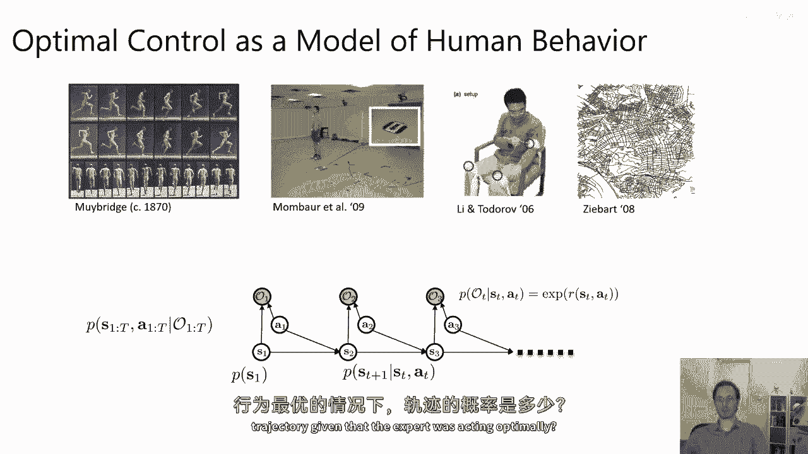
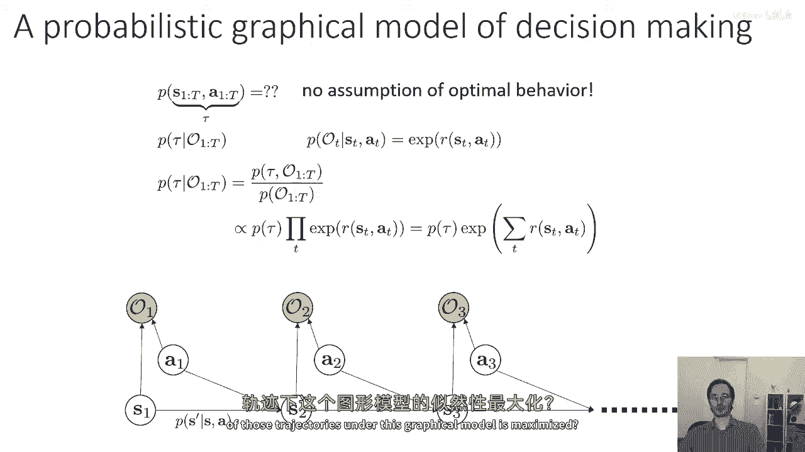

# P82：p82 CS 285： Lecture 20, Inverse Reinforcement Learning, Part 1 - 加加zero - BV1NjH4eYEyZ

 Alright， welcome to Lecture 20 of CS285。 Today we're going to talk about inverse reinforcement learning。

 So， so far， every time that we've had to take on a reinforcement learning problem。

 we also always assumed that a reward function was provided for us。

 And typically if you were to use these reinforcement learning algorithms。

 you would program a reward function by hand manually。

 What if instead you have a task where the reward function is difficult to specify manually？

 But you have access to data of humans or in general some kind of expert。

 performing that task successfully。 Could you back out their reward function from observing their behavior。

 and then re-optimize that reward function with reinforcement learning algorithms？

 What we're going to learn about today is how we can apply this approximate model of optimality。

 formalized as an inference problem from last time to learn a reward function。

 rather than just directly learning a policy from a known reward。

 And this is called the inverse reinforcement learning problem。

 So the goals for today will be to understand the inverse reinforcement learning problem definition。

 understand how probabilistic models of behavior can be used to derive。

 inverse reinforcement learning algorithms and understand a few practical。

 inverse reinforcement learning methods that we can actually use in high-dimensional problems。

 of the sort that we encounter in deep reinforcement learning。 Alright。

 so one of the things that I mentioned in the previous lecture。

 is that optimal control and reinforcement learning could serve as a model of human behavior。

 And there's actually a very long history going back over 100 years of scientists trying to study human motion。

 human decision making and human behavior through the lens of optimal decision making and rationality。

 In fact， one of the definitions of rational behavior is that rational behavior can be framed。

 as maximizing a well-defined utility function。 It turns out that any rational decision making strategy。

 for instance， one where if you prefer A over B， and you prefer B over C， then you prefer A over C。

 Any strategy that is rational in a sense， can be explained with a well-defined set of scalar valued utilities。

 whereas an irrational strategy， such as for instance。

 if you prefer apples over bananas and you prefer bananas over oranges。

 but then you prefer oranges over apples， that is irrational， and then in fact cannot be explained。

 with a well-defined set of scalar valued utilities。 So if we want to explain human motion。

 human decision making and so on through the lens of， optimality。

 what we could do is we could write down the equations that describe optimal decision making。

 either in the deterministic case， as we learned about in the optimal control lecture or in this。

 stochastic case。 And then we could ask， assuming that the human is solving this optimization problem。

 what can we plug in in place of R so that the solution to this optimization problem。

 matches the behavior of the human actually exhibited。 And in fact， studies in neuroscience。

 motor control， psychology， and so on have applied this basic model。

 and although as we discussed last week， the classic model of optimality is sometimes a poor fit for。

 human decision making because humans are often not deterministic and not perfectly optimal。

 A soft model of optimality can explain human behavior quite well in many cases。 And in fact。

 the notion that optimality is a good framework for thinking about human decision making。

 and human motor control has been extremely influential in studies of human behavior and neuroscience。

 All right， that's maybe the kind of more intellectual motivation。

 but we could also ask a practical question。

 why should we worry about learning reward functions？ Well。

 one perspective we can take on it is the imitation learning perspective。

 So a standard way to go about imitation learning problems。

 as we discussed in the beginning of the course， would be to demonstrate a behavior that you want to a robot or to whatever your agent is。

 your autonomous car， your e-commerce agent， whatever it is。

 and have it simply imitate that behavior through behavior or clothing。 However。

 when humans imitate other humans， we don't actually do it this way。 You know。

 if you imagine teaching a robot through imitation learning， you would maybe actually like。

 teleoperate the robot or move its arms through the motions that you want it to perform。

 But when you think of a person imitating somebody， it's not like you need someone to like hold you。

 and move your body in exactly the way that it's needed for you to accomplish the task。 No。

 that's not what you do。 You watch somebody and you figure out what is it that they're trying to do。

 and then you attempt to emulate not their direct motions， but rather their intentions。

 So standard imitation learning deals with copying the actions performed by the expert without reasoning about the purpose of those actions。

 without reasoning about their outcomes。 Human imitation learning is very different。

 When humans imitate， we copy the intent of the expert。

 We might do what they did but differently because we understand why they took the actions they did。

 and what outcome they were seeking。 And this might result in actually very different actions from the ones the expert took。

 but the same outcome。

 Here is a nice video that I think illustrates this point。 This is a psychology experiment。

 The subject of the psychology experiment is the child in the lower right corner of the frame。 Now。

 if you put yourself in the place of a child， imagine what you would do upon seeing this。 Well。

 you would infer the intentions of the experimenter here。

 and you would not perform the action that the experimenter is performing。

 You would instead perform the action that leads to the desired outcome。

 The outcome that you inferred is the outcome that they are going for。 [silence]， So。

 can we figure out how to enable reinforcement learning ages to do things like this？

 There is another perspective we can take to think about why inverse reinforcement learning is important。

 and that is the more reinforcement learning-centric perspective。

 In many of the reinforcement learning tasks that we want to tackle。

 such as the games that you guys have to work with for homework 3， the objective is fairly natural。

 So， if you want to play a game as well as possible。

 it makes sense that your reward function will be the score in the game。

 The score is printed right there on the image。 So。

 it is not a huge stretch to say that is my reward function。 But in many other scenarios。

 the reward function is much less obvious。 Imagine， for instance。

 an autonomous car navigating down the freeway。 Now。

 this autonomous car has to balance a number of different competing factors that has to reach the destination。

 go at a particular speed， it needs to not violate the laws of traffic。

 it needs to not annoy other drivers， and all these different factors have to be balanced against each other to drive appropriately。

 safely， and in a way that is comfortable to the passengers。

 And writing down a single equation that describes that might be very hard。

 but asking a professional driver to demonstrate it is comparatively much easier。 So。

 it is very appealing to think about learning reward functions in these kinds of scenarios。

 Okay， so， in the reinforcement learning refers to the problem of inferring a reward function from demonstrations。

 So， such as， for instance， in this driving scenario where you have a professional driver demonstrate a good driving policy。

 and then you want to figure out what's a good reward function to extract from this to give to your reinforcement learning agent。

 Now， by itself， inverse reinforcement learning， as I've stated it。

 is unfortunately a very underspecified problem。 And the reason for this is that for any given pattern of behavior。

 there are actually infinitely many different reward functions that explain that behavior。

 This is perhaps most obvious if I give you an example。

 Let's consider this really simple grid world with 16 states。 If I have this demonstration。

 and I ask you， what was the reward function of the agent who performed this demonstration？

 What would be your answer？ Now， you might have jacked at this point， you might say， "Well。

 what the heck is going on here？ There's just some arrows drawn on a grid。"。

 In the autonomous driving scenario， the semantics of a task are much richer。 There are other cars。

 stop signs， traffic lights。 But remember， the algorithm doesn't have all of those semantics that you have。

 Just like in the exploration lecture， when we talked about Montezuma's Revenge。

 exploration is hard because we lack the semantics that allows to make sense of the world。

 but the algorithm lacks those semantics。 Similarly， in the case of inverse reinforcement learning。

 to the algorithm， these are all just states and actions。

 It has no way to understand that meaningful reward functions have something to do with the laws of traffic and not with the particular GPS coordinate at which you're looking at。

 So， I want to show you this example because I want to construct a scene where we intentionally divorced the problem of recovering the reward from any of our own prior semantic knowledge。

 Okay， so for this grid world， think about what the reward function might be。 Take a guess。 So。

 one very reasonable guess is that the agent gets a big reward for reaching this particular square and a bad reward everywhere else。

 So， that would definitely explain why they did what they did。 But there's another explanation。

 What if they get a big reward for reaching this square？

 If you only observe a trajectory consisting of four steps。

 both of these rewards explain the expert's behavior equally well。

 What if instead they have this reward function？ A big reward for anything in the lower half and a big penalty for crossing those darker squares。

 That would also explain that behavior。

 Indeed， their behavior could even be explained by the general reward function that just says you have a reward of negative infinity for taking any action。

 other than the ones in the demonstration。 So， they're in general infinitely many rewards for which the observed behavior would be optimal in the traditional sense。

 Okay， so before we talk about how to clear up this ambiguity。

 let's define the inverse reinforcement learning problem more formally。

 To define inverse reinforcement learning more formally， we can do it like this。

 And I'm going to on the left side of the slide， I'm going to present the formalism for regular forward reinforcement learning on the right side。

 the formalism for inverse reinforcement learning so that you can see them side by side and compare。

 So， first， what are we given？ In forward reinforcement learning and inverse reinforcement learning。

 in both cases， we are given a state space and an action space。

 Sometimes we are given the transition probabilities and sometimes not。

 Sometimes we have to infer them from experience。 In forward reinforcement learning。

 we are given a reward function。 And our goal is to learn pi star at the optimal policy for that reward function。

 In inverse reinforcement learning， we are given trajectories tau sampled by running the optimal policy。

 We don't necessarily know what the optimal policy is。

 but we do assume that our sample trajectories came from that policy or some approximation thereof。

 And our goal is to learn the reward function r psi that pi star optimized to produce those taus。

 where psi is a parameter vector that parameterizes the reward。 Now。

 there are many different choices we could make for the reward parameterization。

 In the kind of more classical inverse reinforcement learning literature。

 a very common choice is to use a linear reward function。

 A reward function that is a weighted combination of features。

 You can only write it as an inner product， psi transpose times bold f。

 where bold f is a vector of features。 You could intuitively think of these features as a bunch of things that the agent wants or does not want。

 And then what you are trying to determine is precisely how much do they want or not want each of those things。

 Now， these days in the world of reinforcement learning。

 we might also want to deal with neural network reward functions。

 Reward functions that map states and actions via a deep neural network。

 a nonlinear function to a scalar value reward， and that are parameterized by some parameter vector psi。

 which denotes the parameters of that neural network。

 And then once we've recovered the reward function in inverse reinforcement learning。

 typically what we would want to do is use that reward function to learn the corresponding optimal policy by storm。

 Alright， so first， before I talk about the main topic of today's lecture。

 which is going to be inverse reinforcement learning algorithms based on the probabilistic model that we saw in the previous lecture。

 I want to provide a little bit of historical background to discuss some ways that people have thought about solving the inverse reinforcement learning problem prior to the modern age of deep learning。

 So many of the previous algorithms for inverse reinforcement learning were focused around something called feature matching。

 The main algorithms that I'll discuss today are based around the Maximenschi principle and draw on the graphical model that I presented last lecture。

 And this is different from feature matching。 However。

 I will first describe the feature matching algorithms just to provide some context and just to give you guys a broader overview of the literature。

 So， classically， when people started thinking about the inverse reinforcement learning problem。

 they approached it like this。 They said， "Well， let's say that we have some features and we're going to learn a linear reward function in those features。

"， If the features F are important， what if the way that we disambiguate the inverse reinforcement learning problem is by saying。

 "Let's learn a reward function for which the optimal policy has the same expected values for those features？

"， So the features are functions of states and actions， and you could say。

 "Let's let pi r-side be the optimal policy for our learned reward r-side。"。

 And then we're going to select "side" such that the expected value under pi r-side of our feature vector is equal to its expected value under pi star。

 Now， that's very reasonable。 Let's just say that， well， if you saw that the， let's say。

 the optimal driver driving the car rarely experienced a crash， rarely ran red lights。

 and frequently overtook on the left rather than the right。

 then matching the expected values of those features will probably give you somewhat similar behavior if you were given the right features。

 Now， unfortunately， this formulation is still ambiguous。

 So you can do this fairly easily because you have trajectories sampled from the optimal policy。

 so while you don't know the optimal policy itself。

 you can approximate the right-hand side by averaging the feature vectors in your demonstrated trajectories。

 But it's still ambiguous because multiple different side vectors could still result in the same feature expectations。

 So think back to the example of the grid world that I gave before。

 All of those different reward functions result in the same exact policy。

 which means they would all have the same exact expected values。

 So one way that people thought about disambiguating this further is by using a maximum margin principle。

 So the maximum margin principle for inverse RL is very similar to the maximum margin principle for support vector machines。

 And it states that you should choose psi so as to maximize the margin between the observed policy pi star and all other policies。

 So if the reward is psi transpose F， then the expected reward is psi transpose times the expected value of F。

 meaning the expected reward under pi star is greater than or equal to the expected reward under any other policy。

 plus the largest possible margin。 And you would choose the margin and the psi so as to maximize this。

 So this is basically saying， find a weight vector psi so that the expert's policy is better than all other policies by the same size。

 Now this is a little bit of a heuristic because this doesn't necessarily mean that you will recover the expert's weight vector。

 the expert's true reward function。 But it's a reasonable heuristic。 It's saying， you know。

 if you have two different reward rewards that have the same feature expectations as the expert。

 pick the one that makes the expert look better than all the other policies。

 So don't pick a reward for which the expert is just a little bit better than the alternatives。

 Now the trouble with this formulation still is that if the space of policies is very large and continuous。

 there are likely other policies that are very， very similar to the expert's policy。 In fact。

 there are likely other policies that are almost identical。

 So just maximizing the margin against all other policies is maybe not such a good idea by itself。

 And perhaps you want to weight this by some similarity between pi star and pi。

 Maybe what you want is to maximize the margin more against policies that are more distinct from the expert。

 Whereas the margin against other policies that are very similar to the expert could be pretty small。

 Now fortunately， this is again very similar to the kind of problems that we encounter in support vector machines and much of the literature on this feature matching。

 Or actually borrowed techniques from support vector machines to solve this problem。

 So for those of you that are familiar with SVMs， you'll probably recognize us。

 If you're not familiar with SVMs， don't worry about it too much。 You don't really need to know this。

 But it's a good kind of side note for you to be aware of the literature。

 So the SVMs trick basically takes in a maximum margin problem like this。

 which is generally difficult to solve， and reformulates it as the problem of minimizing the length of the weight vector。

 Where the margin is always one。 It's a little subtle why you can do this。

 It requires a little bit of letter on to duality， but you can take me at my word that these two problems are equivalent。

 And then it turns out that if you want to incorporate the similarity between policies into the second problem。

 all you do is replace that one by some measure of divergence between policies。

 So that means that if you have another policy pi that is identical to pi star。

 then it's okay for the left hand side and right hand side to be equal because d will be zero。

 But as the policies become more and more different。

 then you want to increase the margin to those policies。

 So one good choice for d could be the difference in their feature expectations。

 Another good choice could be their expected KL divergence。

 Now there are still a few issues with this formulation。

 It does lead to some practical inverse reinforcement learning algorithms that we could actually implement and try to use。

 But these inverse reinforcement learning algorithms will have a number of shortcomings。

 One major shortcoming is that maximizing the margin is a bit arbitrary。

 What it basically says is you should find a reward function for which the expert's policy is not just better than the alternatives by a small amount。

 You don't just want to find a reward function， which the expert is like tied with some very different policy。

 You want to find the reward function for which the expert's behavior is very clearly the better choice。

 But this doesn't say why you want to do that。 Presumably the reason you'd want to do that is because you're making some assumption about the expert。

 Maybe one assumption that you're implicitly making is that the expert intentionally demonstrates the things that make it easy to figure out their reward。

 But the notion of maximizing the margin is a heuristic response to that and the assumption about the expert's behavior is not actually made explicit here。

 The other problem is that this formulation doesn't really give us a clear model of expert sub-optimality。

 It doesn't explain why the expert might sometimes do things that are not actually optimal。

 Those of you that are familiar with support vector machines might remember that in the case where the classes are not perfectly separable。

 you can do things like adding slack variables to account for some degree of sub-optimality。

 But adding such slack variables in this setting is still largely a heuristic。

 It's not really a clear model of the expert's behavior。

 It's just heuristically modifying the problem to make it possible to accommodate sub-optimal experts。

 And lastly， this results in kind of a messy constrained optimization problem。

 which is not a big deal if you have linearly parameterized reward functions。

 but it does become a really big problem for deep learning if you want to have reward functions represented by neural networks。

 However， if you want to learn more about these kinds of methods。

 there are a few readings I might suggest。 You can check out， for example。

 a classic paper by a B well-meaning called a premscript learning by inverse reinforcement learning。

 as well as a paper by Radcliffe at all called maximum margin planning。

 which are very representative of this class of feature matching and margin maximizing inverse R-almothons。

 However， the main topic for today's discussion will actually build on probabilistic models of expert behavior。

 So from the previous lecture we saw that we could actually model sub-optimal behavior as inference in a particular graphical model that states actions and these additional optimality variables。

 So the probability distributions in this model are the initial state distribution P of S1。

 the transition probabilities P of S(t) plus 1 given S(t) at and the optimality probabilities。

 which we chose to be equal to the exponential of the reward。

 Now before we were concerned with the problem， what is the probability of a trajectory given that the expert was acting optimally？

 But in this， so this is what we saw before。 We said that， well。

 if you don't assume optimality then any physically consistent trajectory is equally likely。

 But if you make an assumption of optimal behavior then you could say。

 what's the probability of a trajectory given that the expert was optimal？

 And we saw that that had this nice interpretation that the most optimal trajectory was the most likely。

 and then sub-optimal trajectories became exponentially less likely。

 And we talked about how that might be a good model of sub-optimal expert or monkey behavior。

 But now what we're going to be doing is we're actually going to be using this model to learn reward functions。

 So instead of asking what is the probability of a trajectory given a reward。

 which has inference in this model， we'll instead do learning in this model。

 or we'll say given the trajectories， can we learn the parameters of R so that the likelihood of those trajectories under the graphical model is maximized。

 And that's what I'll discuss in the next part of the lecture。

