# P83：p83 CS 285： Lecture 20, Inverse Reinforcement Learning, Part 2 - 加加zero - BV1NjH4eYEyZ

好的，所以，在图形模型中学习奖励函数相当于学习最优性变量。

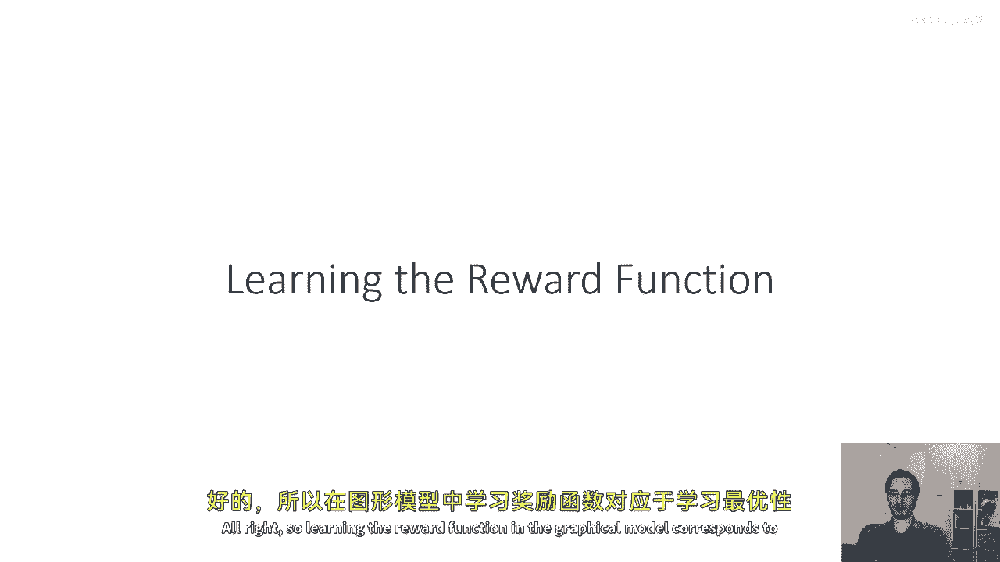

"所以现在p of o t被赋予状态"，"它还将等于奖励的指数"，"但现在是r psi"，"这是一个由参数si参数化的奖励"，"我们的目标是找到清晰度参数，以便找到奖励"。

"我将将其写成p of o t给定s t a t逗号i的形式"，"以强调这个cpd依赖于我们的参数i"，"给定最优性，轨迹的概率"，如果si与轨迹概率的乘积成正比，就像以前那样。

那么奖励和的指数就是si，在逆向强化学习设置中，我们将从未知最优策略中获取样本，我们学习奖励的方式是通过最大似然学习，我们将基本上选择参数i，使得我们观察到的轨迹的日志概率最大化。

所以这与任何其他机器学习设置中的最大似然非常相似。

现在，嗯，当我们在做这个时，结果发现，我们可以实际上忽略tau项的p，因为它与si无关，所以，在执行这个最大似然优化时，真正的挑战实际上是，指数化奖励成分，所以如果我们插入这个，嗯。

轨迹对数概率的表达式，我们得到以下非常直观的表达式，我们想要最大化对psi的尊重，所有过程轨迹的平均奖励，意味着沿τ的奖励和，我减去对数归一化器，现在如果你只是忽略对数归一化器，这似乎既直观又愚蠢。

这仅仅是说找到使轨迹具有高奖励的奖励，但是问题在于如果你只是为所有事情分配巨大的奖励，然后一些没有被采取的其他轨迹，并且有专家策略非常低的概率可能会获得更高的奖励，这就是对数归一化器处理对数的方式。

对数z项，归一化常数说你不能随便为任何事情分配更高的奖励，你需要为奖励分配，这使得你看到的路径看起来比其他你没有看到的路径更有可能，并且实际上是这个对数归一化器使逆向强化学习困难的，好的。

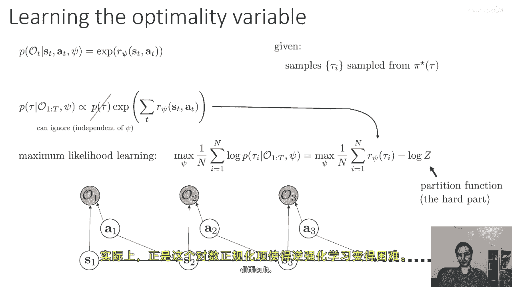

所以让我们谈谈对数归一化器或分部函数，这就是z有时被称为分部函数的，z等于对所有可能轨迹的p的积分的tau，其中，tau是轨迹的长度，r pi的指数乘以tau现在的值，当然，立即，嗯，我们可以说好吧。

让我们只是插入这个方程式为z，取其梯度并优化，这是非常合理的事情，但是，当然，对所有可能轨迹的积分通常将是不可解的，所以，如果你插入z的方程式，然后取关于psi的导数，你会得到这个表达式。

你会得到1/n，"对所有样本的总和"，"轨迹tau i减一奖励的梯度除以z"，"那就是对对数导数的结果"，"τ对p的积分乘以指数奖励乘以r的梯度"，"但是，你可能注意到关于这一点的一些很有趣的事情"。

"那是否可以将第二个术语实际上视为预期值"，"在你的当前psi作用下，轨迹的分布情况为"，"因为表达式z次除以1，p乘以tau，再乘以r的指数。"，"Tau的psi等于给定最优性和psi的tau的p"。

所以，你可以等价地写为梯度等于在最优策略下预期的值，"π在给定当前grad r一侧的p τ条件下，减去在p τ下grad r的期望值"，"第一个术语被样本近似"。

"并且这转化为在tau i上的grad r的和，然后再除以n"，"并且第二个术语转化为那个积分"，"所以那是一个非常吸引人的解释"，"你的梯度就是期望值梯度的差值"，"在专家的政策下"。

"减去你当前奖励下梯度的预期值"，请注意，给定o从1到t，tau的p值为，逗号，Psi仅仅是关于与我们的π软最优轨迹的分布，所以这可能立即建议一种吸引人的算法方法，取你当前的奖励rsi，找到软最优策略。

通过在图形模型中运行推理，我们周一看到的策略样本轨迹，然后进行这种对比性操作，我们增加我们从专家看到的轨迹的奖励，并减少我们为当前奖励采样的轨迹的奖励，所以我们用专家的样本估计第一个术语。

并且第二个术语，嗯，来自当前奖励下的软最优策略，我们可以计算出软，最优策略使用我们在周一讲座中学到的算法。

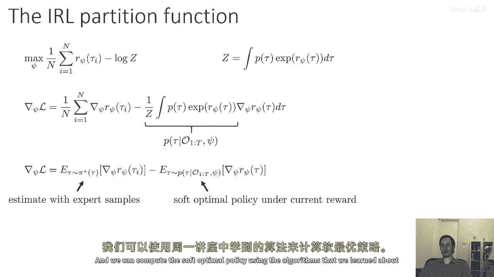

嗯，但让我们实际看看如何估计这个期望，因为我认为这将给我们对IRL方法的最大值有一些澄清，所以如果我们取这个第二个术语，让我来让它更明确，那就是相对于总奖励和的侧边梯度，在所有沿着该轨迹的时间步长上。

这意味着我们可以通过将和移动到期望之外来写它，通过期望的线性性，并写它为从t等于一到资本t的预期值之和，在st边缘下，给定st时刻奖励梯度的最优性，我们取期望值的分布。

是在st时刻行动给定最优性的概率乘以，在优化状态下的状态概率，周一我们学习如何计算这两种量，因为第一个量是我们学习的政策，它是两个向后消息的比值，第二个术语是状态边缘，我们在周一学到的。

可以通过前向和后向消息的乘积获得，对，所以我们在这里见过这个，所以第一个术语只是等于beta s t a t的比值，除以beta s t，如果你不记得如何计算beta，请回到你周一的讲座中，重新复习。

观看第一个推理问题，第二个术语与从st向前的消息和从st向后的消息成正比，再次，如果你不记得我们如何推导出这个，回到你周一的讲座，观看第三个推理问题，现在，在这里。

第一个表达式中的beta st在分母中消去，与第二个表达式中的beta st在分子中相同，我们只是得到答案，这个量与beta d a t成正比，乘以alpha s t，然后。

你需要在状态和动作上对它进行归一化，但在轨迹上不归一化是至关重要的，所以，如果你有一个相对较小的状态空间，那么这个归一化就会更加容易处理。

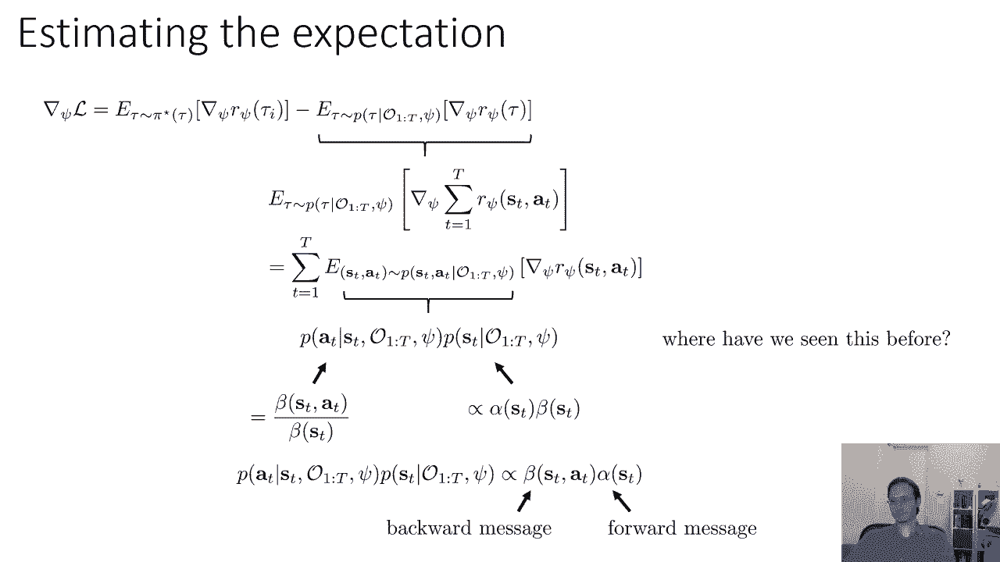

好的，所以现在，我们估计这个第二项的方法是首先计算这个量，我将其称为mu t的状态动作边缘，我们通过乘以向后的消息，乘以向前的消息，然后对整体状态和动作进行归一化来计算它，然后。

我们可以将这个期望表示为在离散空间中的简单和，或者一个在μsda空间中的积分，乘以rsda的梯度，我们也可以将其写为概率向量和奖励在每个状态动作元组的导数向量的内积，μ和，好的，所以。

这是一个对这个梯度的非常优雅的表达，它不需要我们实际上能够计算μ，这意味着我们需要一个小且可数的状态空间，通常，离散状态空间是最好的，当然，我们需要实际上能够计算那些前向和后向消息，这需要了解转换概率。

因此，这不适用于未知的动态，它也不适用于大型或连续的状态动作空间。

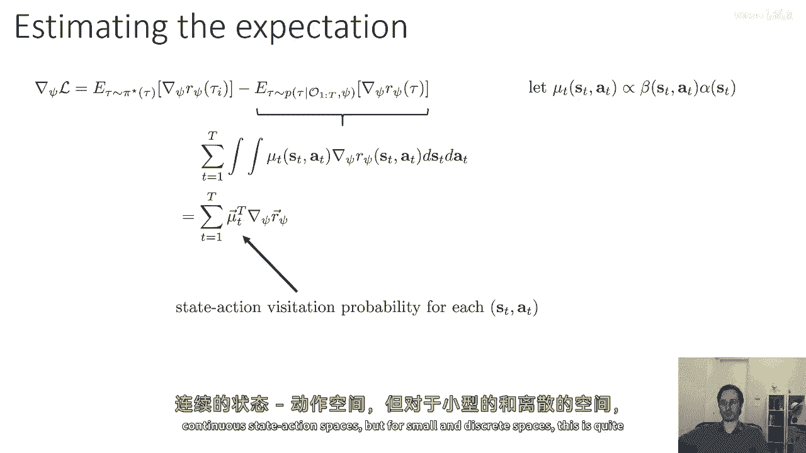

但对于小和离散的空间，这是非常可行的，因此，这导致了经典的最大熵逆强化学习算法，由布莱恩·齐巴特在他的2008年论文中提出，给你当前的向量si，计算你的后向消息，如前所述的讲座，然后计算你的前向消息。

如前所述的讲座，然后计算你的mu通过乘以这些消息并归一化，然后评估轨迹似然度的梯度，作为所有轨迹平均值上的grad pi的差异，R psi减去mu和grad r的内积，然后简单地在侧上进行梯度上升步。

因为你刚刚计算了似然度的梯度，然后重复这个过程直到收敛，所以，这基本上是，一个计算演示轨迹似然度梯度的算法，当收敛时，这将产生最大化这些轨迹似然度的奖励参数，因此，产生解释专家可能非最优行为的最佳奖励。

而且关键地，这种形式消除了我们之前看到的许多不确定性，它消除不确定性的方式，是通过利用那个关于非最优性的概念，它说，嗯，不再像以前那样，非常不同的回报会产生非常相似的政策，如果奖励更高。

那么专家将更加确定，它实际上使用专家的随机性来区分宇宙，强化学习问题，看起来非常直观，如果你看到专家在做非常随机的事情。

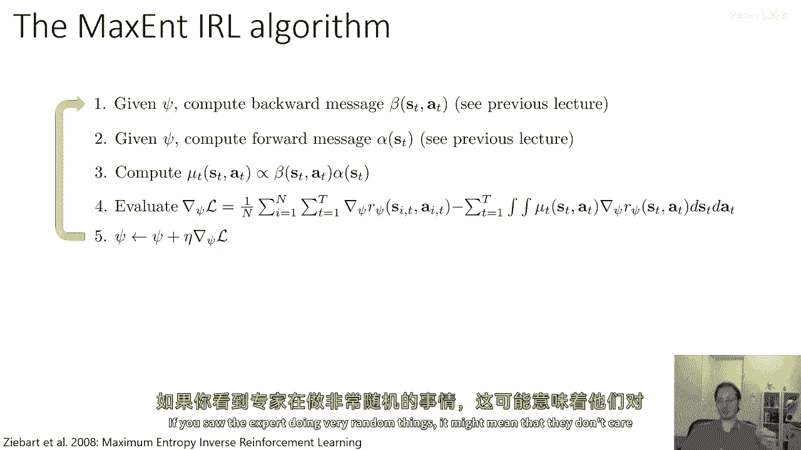

这可能意味着他们不在乎那些不同随机的结果，它可能意味着，尽管所有这些结果对于专家来说都是相等的，同样好，但如果你看到专家反复做某件事，你可能会说，嗯，那件事对专家真的很重要，因此，它有一个更大的奖励。

我们为什么称这个算法为最大熵算法呢，在奖励是参数向量side线性的情况下。

我们可以实际上证明这个算法也优化了一个受限优化问题。

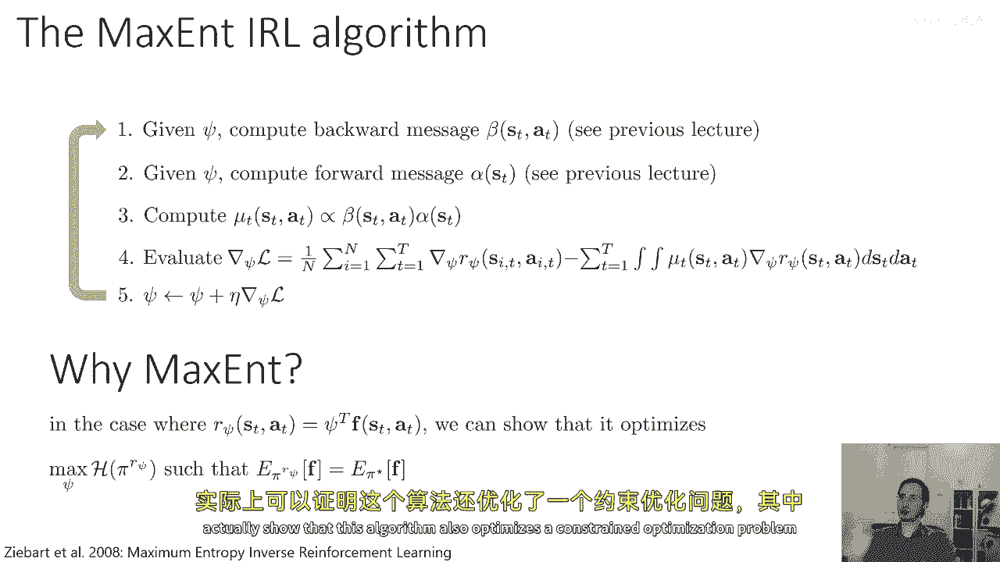

我们最大化学习政策的熵， subject to the constraint that it matches the future expectations of the expert，所以，实际上。

这个算法与以前看到的特征测量方法有深深的联系，他们通过说，你应该匹配特征，特征匹配的模糊性是通过说，你应该匹配特征，但是除了那个，你应该尽可能随机。

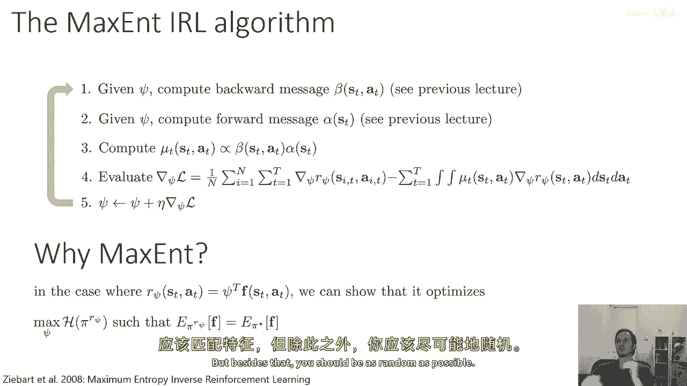

这就是最大熵的原则，它说除了由数据支持的推断之外，你不应该做出任何推断，这是一种对奥卡姆剃刀的统计形式化，这可能是这种方法为什么在逆向强化学习中如此有效的一部分原因，因为它避免了做出假设。

它避免了基于你数据的专家行为推断，除非这些推断得到支持。

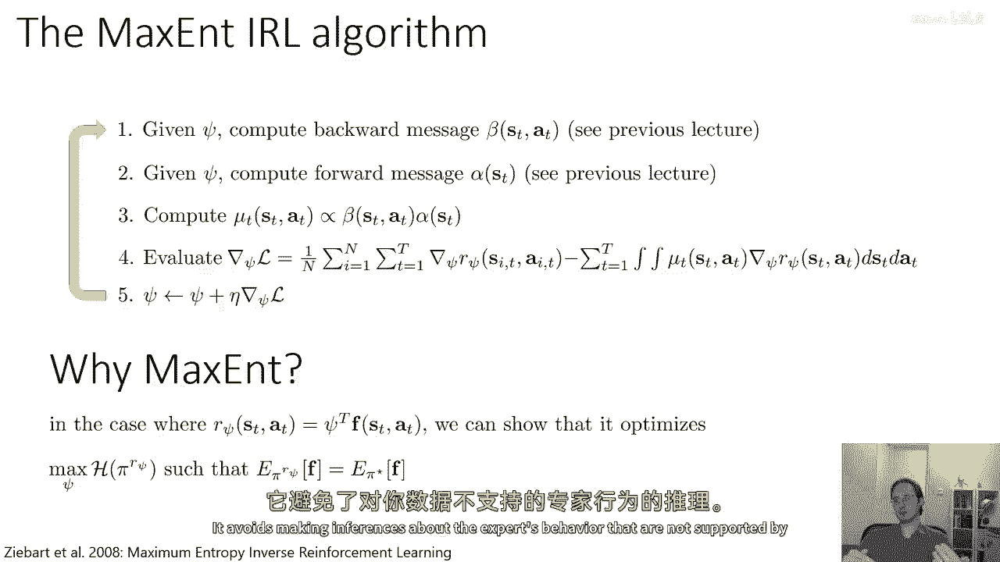

最大熵的原则允许你做到这一点，所以，这个最大，嗯，熵逆向强化学习算法，嗯，已经在，嗯。

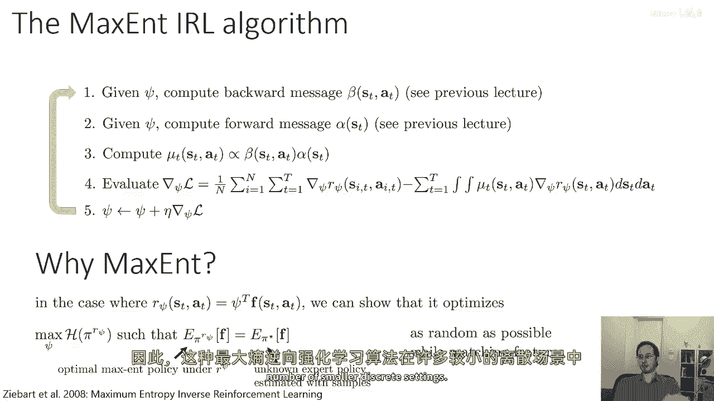

许多较小的离散设置中被有效地使用，所以，例如，Brian z bart在关于这个话题的原始论文中。

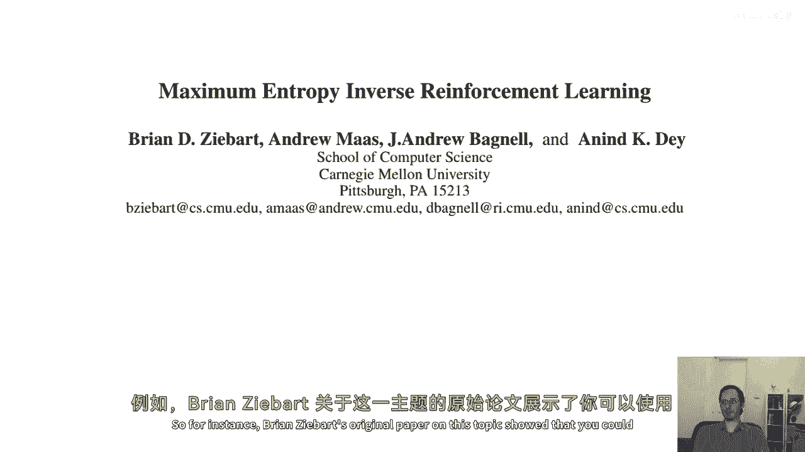

展示了你会使用这个算法来推断地图中的路线。

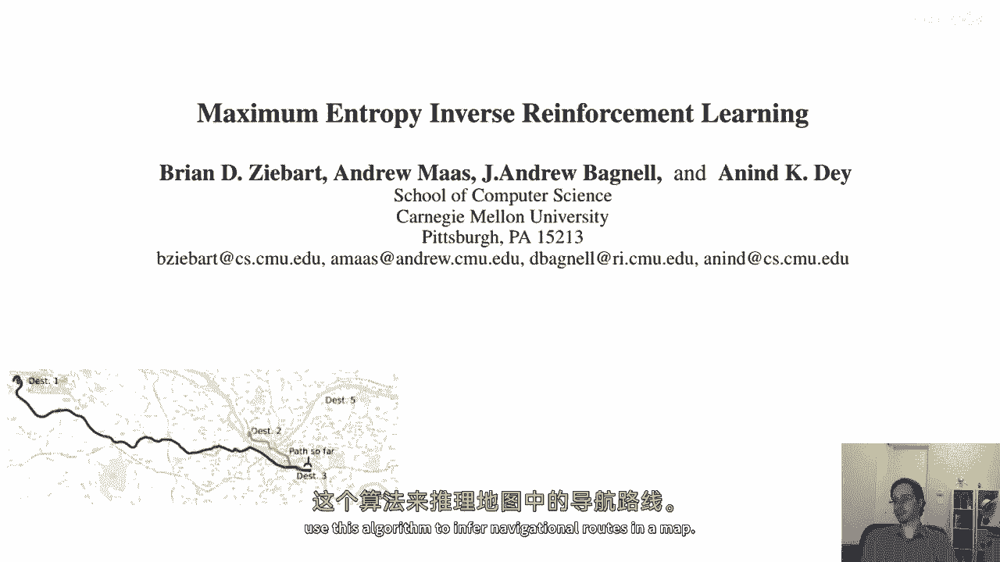

例如，你可以从匹兹堡的出租车司机那里收集数据，推断他们的奖励函数，他们是否更喜欢在城市街道还是高速公路上驾驶，然后得到，一个路线规划软件，以导航出租车司机的方式行驶，这种方法通常工作得很好，然而。

这种方法仍然受限于我们具有相对较小和离散状态空间的设置。

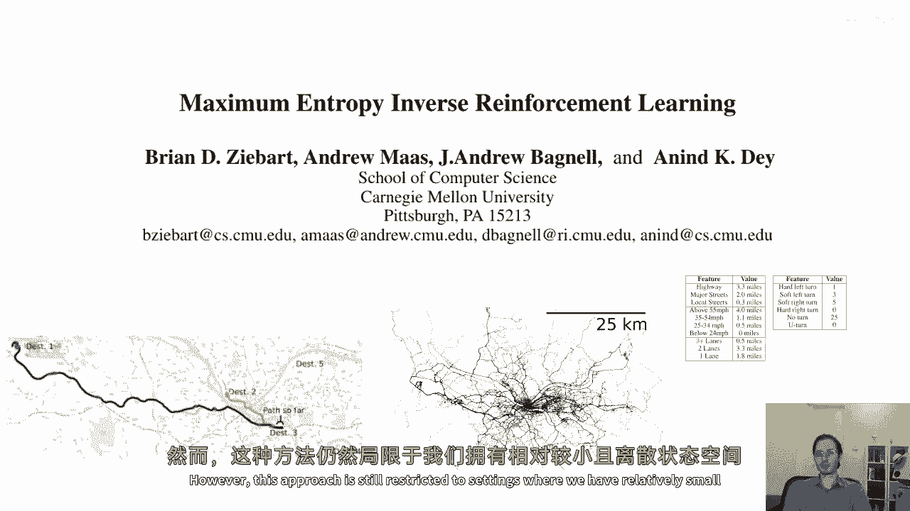

在下一部分讲座中。

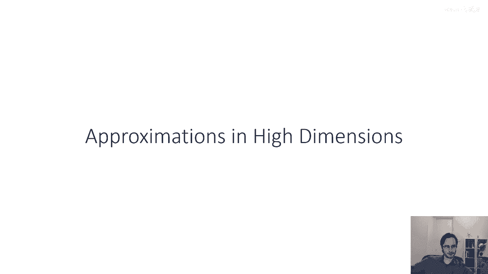