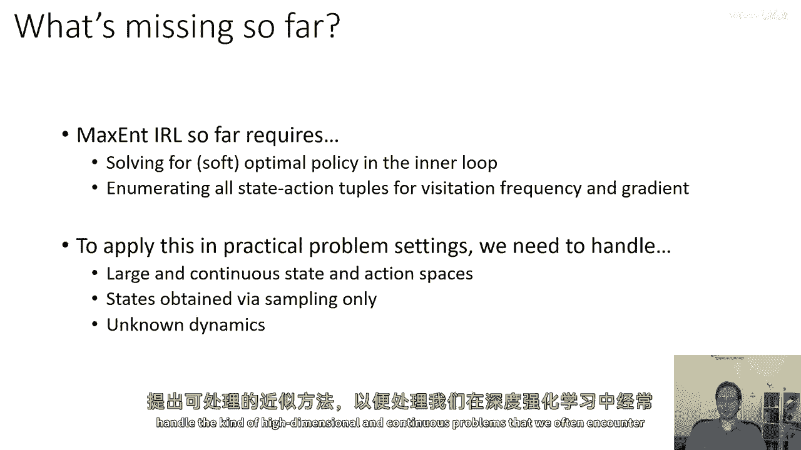
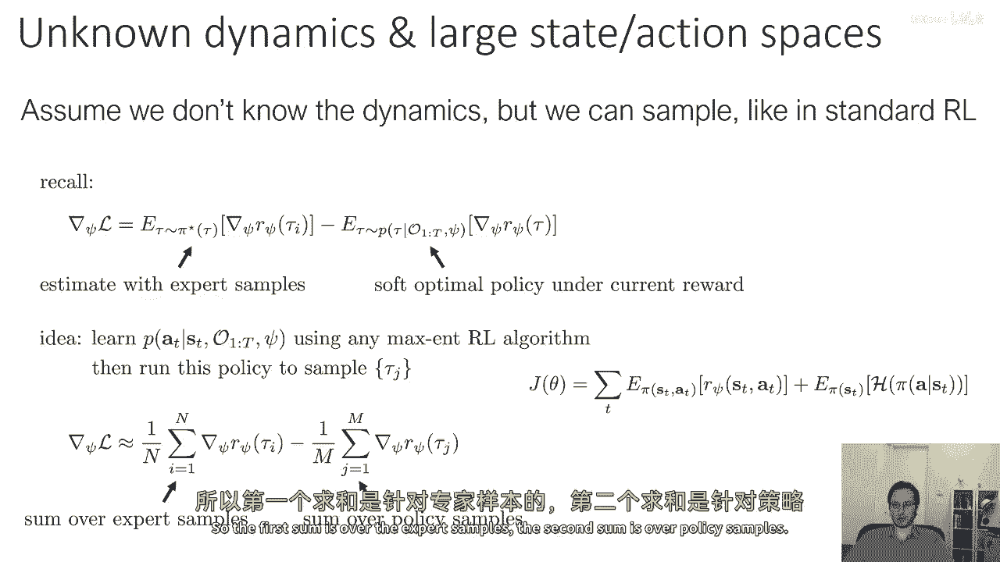
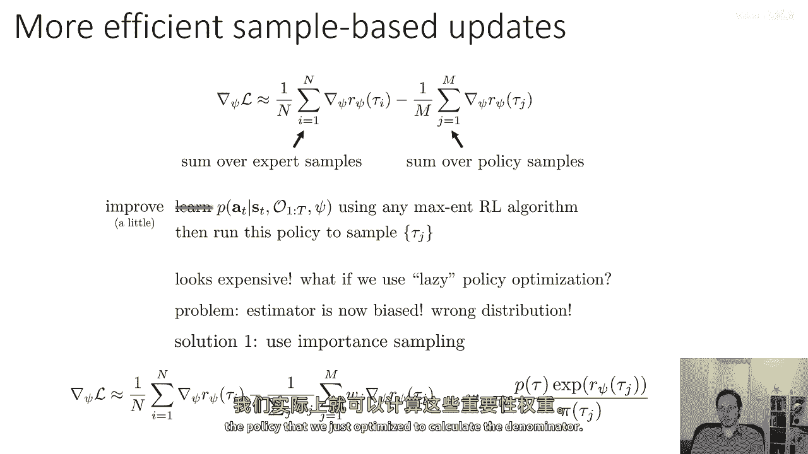
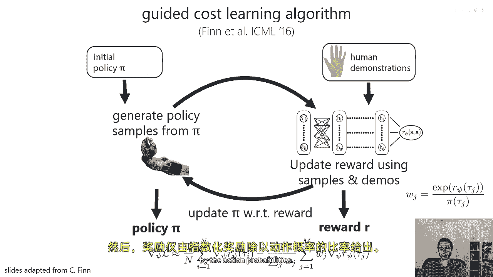
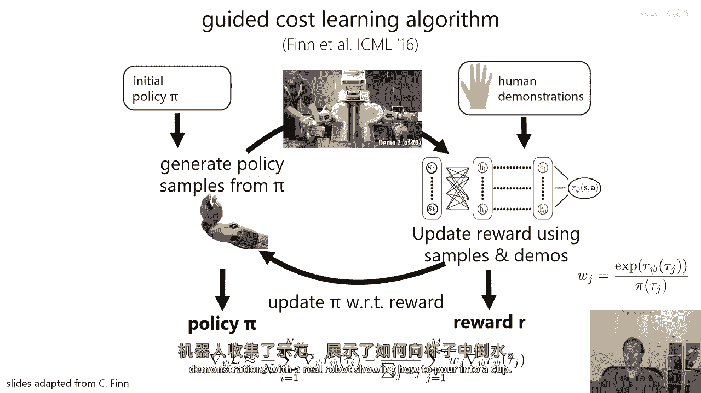
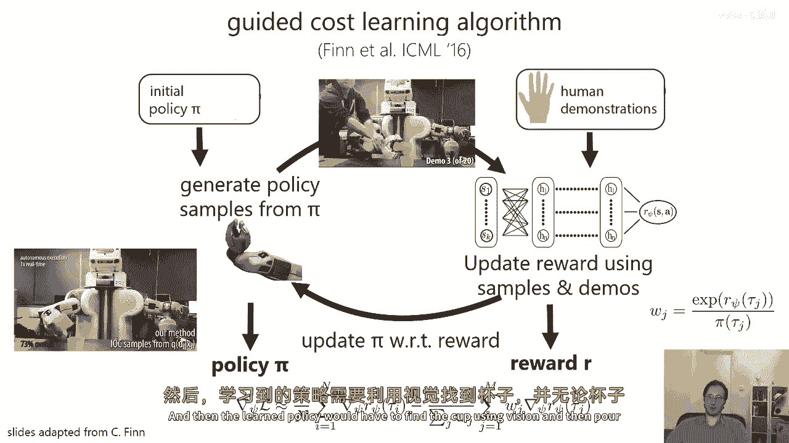
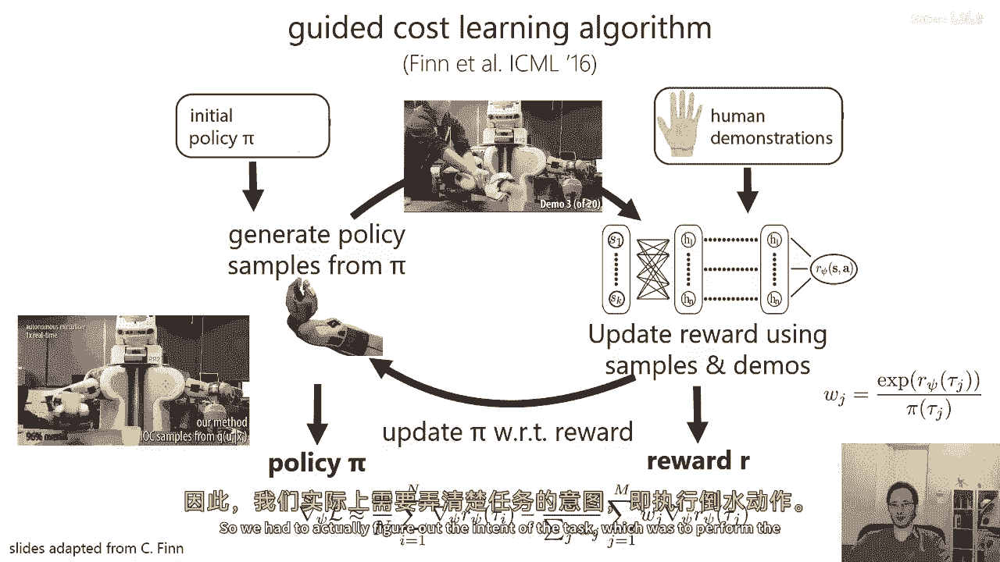
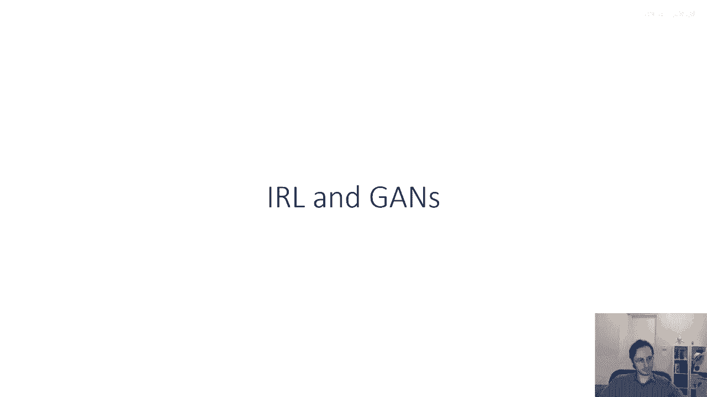

# P84：p84 CS 285： Lecture 20, Inverse Reinforcement Learning, Part 3 - 加加zero - BV1NjH4eYEyZ

好的，"在下一部分讲座中"，"维度空间或连续空间"，"那么，到目前为止我们讨论的方法中缺少什么呢？"，到目前为止，"最大熵逆强化学习需要一些在大规模数据中难以获得的东西"，"实际的问题设置"。

"它需要在内部循环中求解软最优策略"，"为了计算那些向前和向后的消息"，它需要枚举所有可能的状态动作对，为了归一化访问频率并计算梯度，并在实际问题设置中应用此。

愿意处理我们可能具有的大且连续的状态和动作空间，这使得这两件事都变得困难，状态可能仅通过采样获得，这使得枚举所有可能的状态动作对成为不可能的，我们可能不知道动态。

这使得对于计算前向和后向消息的简单方法变得无效，所以最大值和irl算法，"我所讨论的并非完全适用于实际场景"，"和"，"我们需要想出可操作的近似值"，"为了处理这种高度的"。

"我们在深度强化学习中经常遇到的维度和连续问题，没问题吧"。

"那么，为了实现逆向强化学习，我们可以做些什么呢？"，"具有不确定的动力学和大的状态或动作空间"，嗯，"首先"，我们将假设我们不知道动态，"但是，我们能够像样地品尝"。

"类似于标准模型中的自由强化学习"，记住，似然函数的梯度是两个期望值的差，"专家轨迹样本的梯度奖励期望值"，"减去"，"轨迹奖励梯度的期望值"，"来自您当前奖励函数的最优策略的样本"。

"你可以很容易地估计第一个术语，使用专家的轨迹样本"，所以，最大的挑战实际上是第二个学期，"在当前奖励下，需要软最优策略"，所以一个我们可以探索的想法是，让我们尝试学习给定状态s和时间t的软最优策略p。

从t到1，使用psi，使用任何maxcent RL算法，基本上任何周一讲座中提到的算法，如软Q学习或熵，正则化政策梯度，所以基本上任何最大化这个目标的东西，嗯，然后运行那个策略来采样轨迹tau j。

然后，我们将从专家那里获取轨迹tau i，我们将使用这些来估计第一个预期值，然后，我们将从这个口音中获取轨迹tau j，最优策略来估计第二个术语，现在。

这将实际上是一种可行的方法来进行近似的最大化irl，然而，它需要运行max和rl，与奖励函数每个梯度步的收敛对应的前向问题，实际上，这是非常困难的，所以，第一个和是专家样本的和。

第二个和是策略样本的和，所以，这是一个不可处理的程序，使用我们算法的任何max来学习策略，然后运行策略来采样轨迹，如果我们有一个懒散的策略优化程序，如果我们不优化口音，最优策略的收敛。

每次我们取一个梯度步，如果我们只优化它一点点，每次我们取一个梯度步，所以，而不是学习p a t给定s t到t，pi，我们只从之前的psi中改进我们的策略，也许我们改进它一点点。

也许我们甚至只为一个梯度步改进它，现在的问题是，我们的估计器有偏差，我们有错误的分布，所以，我们可以有一个解决方案，我们可以使用重要性采样校正，我们可以基本上说，我们想要最优策略。

但我们得到了一些次优策略，基本上我们没有成功，我们没有训练p a t给定s t到t到收敛，但或许我们可以影响那些样本，使它们看起来像是从最优策略的样本，所以，而不是我们有的方程。

我们在这个幻灯片的顶部有的方程，我们将引入一个重要的方式，W j对于第二个术语，我们将每个样本权重为w j，然后通过w j的和进行归一化，以确保权重的总和等于一，如果我们这样做。

我们可以纠正由于没有完全优化我们的策略而导致的偏差，而且，它 turns out that 重要性权重实际上有一个非常吸引人的形式，因为，我们知道知道，直到一个归一化常数。

最优策略的轨迹概率是由p of tau乘以，奖励的指数，我们知道奖励的，不是真正的奖励，而是我们当前pi的奖励，因此，我们可以实际上计算这些重要性权重，前提是我们有访问我们刚刚优化的政策。

以计算分母的权限。

我们通常这样做，我们可以这样写重要性权重，这与我们在关于重要性加权政策梯度的讲座中之前有过的类似，所以我们有初始状态项，有动力项，在顶部我们有额外的奖励项，在底部我们有额外的政策项。

所以所有未知的项都会取消，然后我们只剩下总奖励的指数比值，在你当前的奖励函数下的那条轨迹，除以所有可能动作的概率乘积，因为你只学习策略π，你通常知道它的概率，你知道在连续空间中，它可能像高斯概率一样。

所以你可以计算这些重要性权重，现在关键地，与我们的ψ相关的每个策略更新都使我们越来越接近目标分布，因此，我们预期优化政策越充分，这些重要的权重就会越接近1，这样的结果就非常吸引人。

我们可以在si上取梯度步，即使政策已经完全优化，但是，优化政策越充分，我们的重要权重就会越好，所以，这个想法是引导成本学习算法的基础。

由finet等人提出，的，哪篇论文，嗯，第一个，你知道，一种能够扩展到高维状态和动作空间的深度逆向强化学习算法，这个算法的设计如下，你有你对政策的初始猜测pi，这可能只是随机的，然后你有一些人类的演示。

然后，你将从当前的政策中采样来生成政策样本，然后，你将使用那些，那些政策样本和人类演示将用于更新奖励，基本上使用你提供的样本和演示，然后更新后的奖励将被用于更新政策，所以嗯，最后。

这将产生一个奖励函数和一个实际有效的政策，如果政策被优化到收敛，政策实际上将是那个奖励函数的好政策，奖励函数应该希望是对专家行为的好解释，奖励函数的更新将基于那个重要的采样表达式。

我在上一张幻灯片上展示了，并且政策更新将基于最大熵学习框架，所以这是奖励梯度的表达式，并且政策梯度只是常规政策梯度加上那个额外的熵项，然后奖励只是由指数奖励的比率给出，除以动作概率。

在原始论文中，切尔西·芬做了什么，她实际上与真实机器人一起收集了演示，展示了如何将水倒入杯中。

然后学习到的政策必须找到杯子使用视觉。

然后将水倒入那个杯中，无论它位于何处，所以我必须实际上找出任务的意图。

