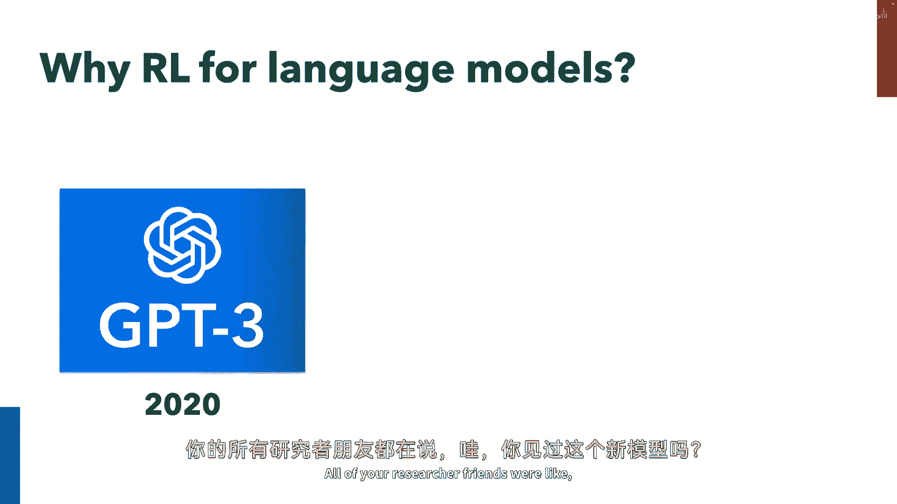
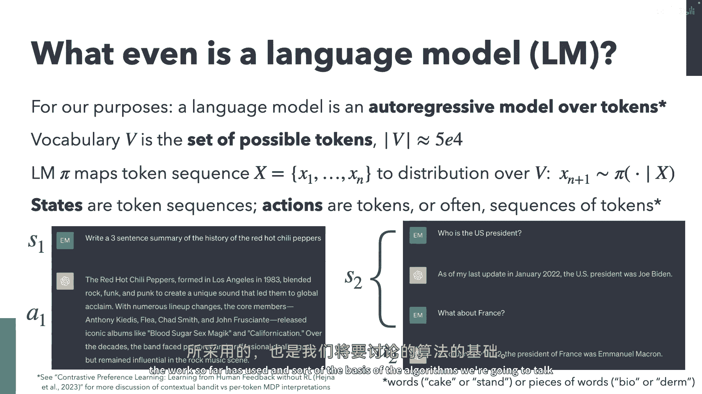
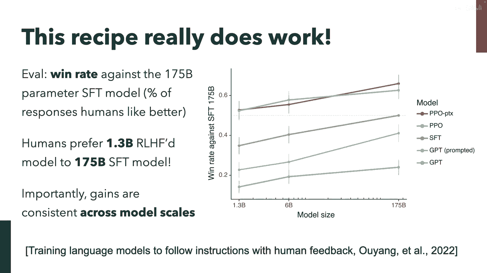
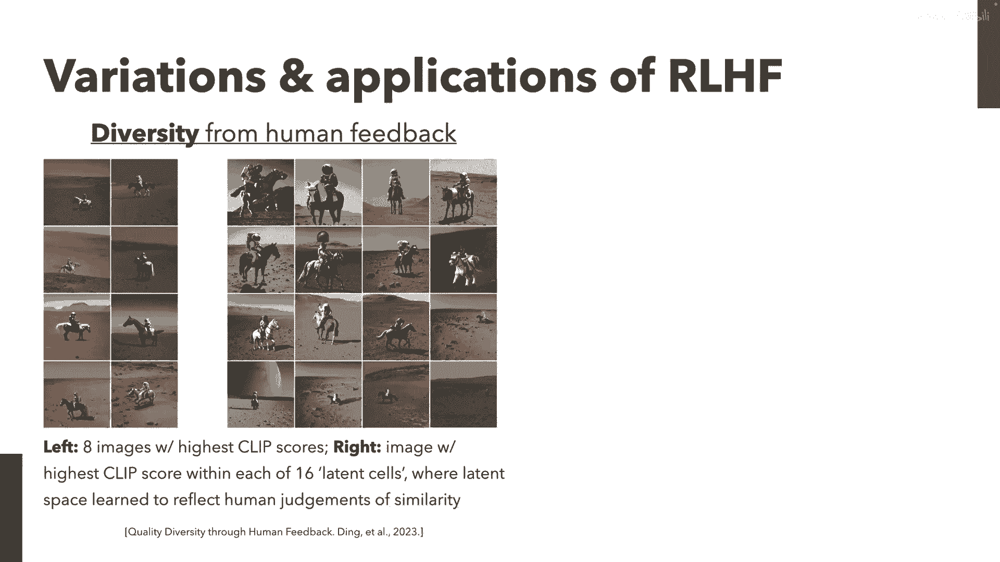
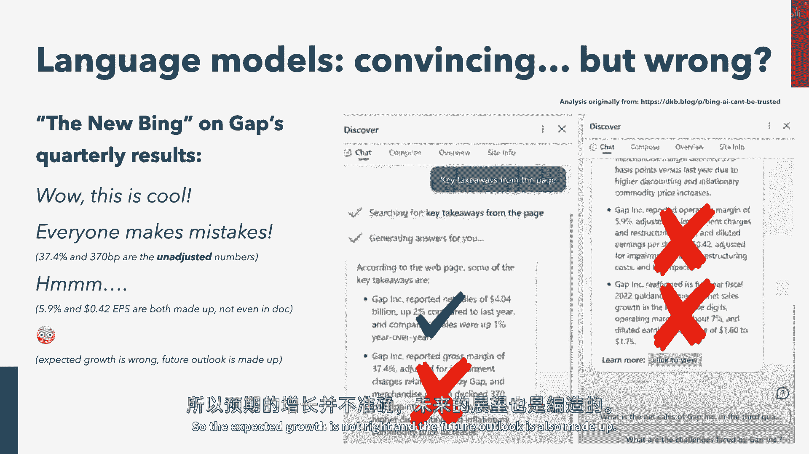
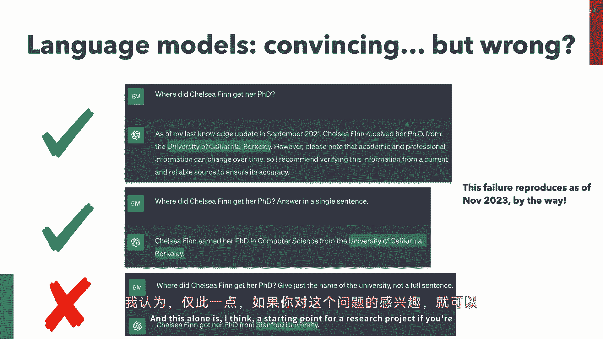
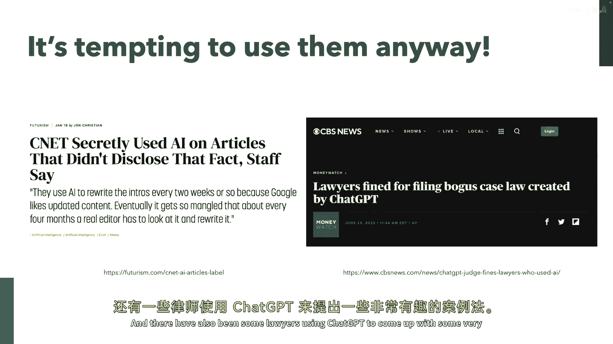
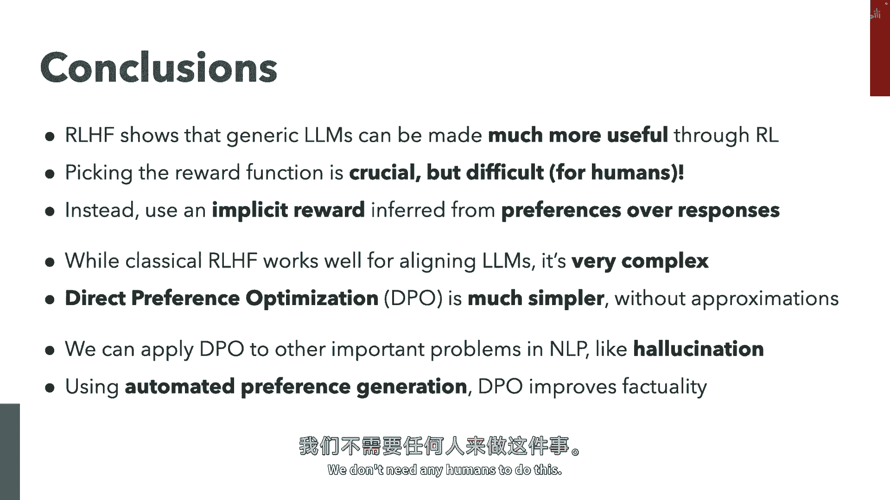
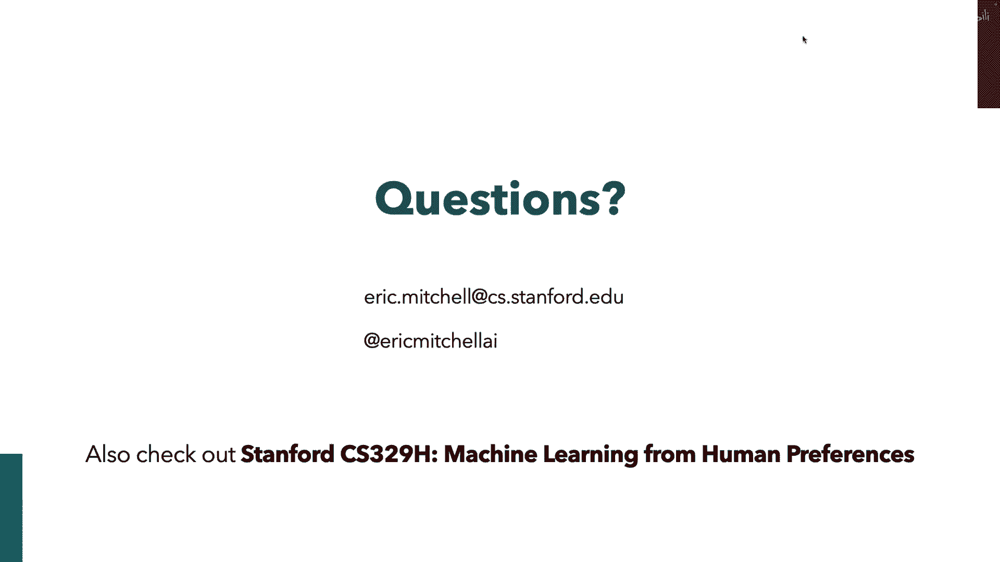

# P86：p86 CS 285： Eric Mitchell： Reinforcement Learning from Human Feedba - 加加zero - BV1NjH4eYEyZ

好的，嗯，还不错，这个麦克风好像有点问题，所以我可能只能大喊，但我想我们拭目以待，嗯，好的，酷，嗯哦，我们现在在哪里，我们好么，好的，我们好，嗯，是的，所以非常感谢你们邀请我来，嗯，在这里感觉很有趣。

就像凯文说的，我是，嗯，来自斯坦福的，我希望你们不会把这个放在心上，嗯，但我成功地赶上了，通过旧金山地区的交通，今天我要谈谈RHF，这可能是大家都比较熟悉的事情，但如果不熟悉，没关系，我们会尽量覆盖。

不是直接从零开始，但但嗯，给一些背景，嗯，我试图留出一些时间回答问题，嗯，你知道，我真的希望人们能从中学习，如果你有问题，告诉我，我可能不得不忽视他们，如果我们时间紧迫，但请随时举手。

我会尽我最大的努力，就这样，不再多说，嗯，再见，所以，好的，如果你在这个课程中，我想很多人可能不在这个课程中，但你可能对强化学习很熟悉，如果你嗯，你知道，现在的人类，你可能听说过语言模型。

但我们为什么谈论强化学习用于语言模型，我认为有很多方法可以做这个幻灯片，我想过做一些像时间线的长图，像lp和rl一样，展示它们收敛，但我真的认为这里的主要思想像，英镑，三很酷，你的所有研究者朋友都像。

哇，你看过这个吗，你知道新模型，然后查奇pi出现了，就像你奶奶一样，哟，你看过这个新模型吗，而且这些都是完全不同的层次，你知道，渗透在种类的，公众意识中，而且嗯，所以所以问题基本上是什么。

这两者之间有什么，什么被添加，它实际上就是这种，或多或少一种奇怪的技巧，"哪一个是从人类反馈中得来的"，"那就是什么嗯"，我们今天要讨论的主题是。

嗯，"作为一个小小的背景信息"，嗯，"以便我们都能更好地理解彼此"，"如果人们对语言模型不熟悉"，嗯，"什么"，对于我们今天的目的，一个语言模型是什么，嗯，你可以简单地把语言模型想象成一个，自回归模型。

针对标记，在标记中，你真的可以只把它想象成单词，有时候可能会有子词或词片，但是，大部分情况下，它基本上就是一个自回归模型，针对单词，我们将有一些词汇，这是一组可能的标记，并且在某种现代大型语言模型中。

这将类似于五万个，但是但是变化范围可以相当大，基本上你的语言模型，在这里，你的政策将标记标记序列映射到一个下一个标记的分布上，嗯，相当简单的东西，嗯，当我们开始考虑强化学习时，嗯，我们将认为状态是。

标记序列和动作可以要么是单个标记，或者是实际上相当常见的，它们也将是标记序列，所以嗯，尽管你可以，你可能自然地认为每个标记都是一个动作，嗯，在许多现有的工作中。

嗯人们实际上倾向于将这个视为一种上下文贝叶斯设置，其中嗯，你获得些上下文，一些提示，一个标记序列，并且你发出一个动作，这是你的响应序列类型，所以你知道如何使这个非常具体，如果你在使用聊天，Gbt um。

你知道在这种带状问题中，你有像你的第一个状态，这是你输入的任何内容，你知道你的行动是，嗯，嗯嗯，模型的回应，那现在如果你有某种程度的对话轮次，你的状态就变为，嗯，你知道的，第一个，嗯，输入的第一个回应。

和下一个输入，而你的行动就是你的下一个回应，这里有一篇论文，我在底部注意到了，这是对比性偏好，在没有rl的情况下，从人类反馈中学习学习，这是非常近的预印本，但如果你对这个话题更感兴趣。

关于上下文带师与标记符的讨论，我们如何做rl和语言模型的mdp类型的表述，那篇论文对这个有一些好讨论，不仅在正文中而且在附录中，所以如果你真的很饿想要更多，我邀请你检查一下，但是。

我会坚持这种强盗式的表述，因为这是大多数工作到目前为止所使用的，并且，这是我们要讨论的算法的基础。

好的，所以，把这些都排除在外，嗯，我们今天要覆盖的主要部分基本上有三大部分，所以我会，对不了解RHF的人做一个概述，这是大致的算法，至少从我们所知道的来看，因为我们真的不太清楚，但是。

至少从我们所知道的你被如何处理来给我们提供聊天的来看，CBT，我要谈谈一种新的算法，这种算法简化了一些这个领域的复杂性，在这个原始形式的强化学习中，从人类对语言模型的反馈中学习。

这种被称为直接偏好优化的方法，然后，我要谈谈一些应用，特别是一种，为了证明来听这个独白是值得的，希望这不是独白，希望我们会有一些好问题，嗯，好的，那么第一部分，嗯，基于人类反馈的强化学习。

我将只给你这个步骤的第一步，这个管道，在大型语言模型上如何做rhf，基本上有四个主要步骤，而且前两个步骤相当直接，所以第一个步骤就是嗯，无监督预训练，而且这实际上就是gpt三。

所以如果你在这里停止在第零步，你会得到gpt三，你从互联网上获取大量的文本，我们谈论的是互联网上的万亿个单词的文本，你只是进行无监督的生成性建模，条件于序列，预测下一个标记，在大量的一百个上做很多事情。

花费大量的时间，然后你会得到这个无监督预训练的模型，这就是这个纯的自回归生成模型，用于文本，嗯，我们做完那个之后，实际上，我们将首先对人类的演示进行有监督的微调，所以，这基本上获取了我们感兴趣的行为。

真正地在模型的分布上进行学习和精炼，嗯，稍后我们可以再谈谈为什么，这是如此重要，但基本上，你可以把这前两步看作是一种学习，步骤零的世界背景知识和步骤一是，我正在对一些人工编写的演示进行一些微调。

你知道如何回应这种示例提示吗，写一首关于爵士乐或什么的诗，因此，我们微调那个原始的无监督预训练模型，我们得到了这个fft模型，然后问题来了，我们接下来做什么，我和我认为这里有一个问题。

也是一个类似的问题，为什么我们要做任何事情的下一步，我的意思是为什么不直接在第一步就停下来，你知道，嗯，监督学习工作得非常好，并且有以下几个原因，嗯，特别是两个，我们将稍后讨论。

将人类的演示注释放大到这种程度有点困难，这真的很耗时，如果你，如果你，你知道想要提出关于，比如，我应该如何回应查询，比如写我，你知道一种俏皮的诗歌风格，模仿Snoop Dogg，关于量子力学的。

比如这将很难，嗯，并且需要时间来收集那些注释，并且，如果你真想在许多这些任务上超越人类性能，嗯，你知道，显然模仿人类行为不太可能给你一个政策，实际上这比人类做得更好，所以这些都是一些原因。

从标注规模扩大的角度来看，而且也就是嗯，得到一个我们可能想要这样做的非常强大的模型，好的，所以所以希望你的，你稍微有些确信，我们想要尝试使用rl来训练这种通用目的的自然语言代理，嗯。

我想你可能知道最明显的问题，那么，好的，比如什么，我们要优化什么，奖励是什么，嗯，什么性质它应该有现在，理想上，我们希望一个奖励能分配，高奖励给填满人类喜欢的东西，低奖励给人类现在不喜欢的东西。

这就是一个大的简化，在我所知道的幻灯片的底部，但重点是，知道什么应该得到高奖励确实需要了解人类，所以，可能不足以使用，并且某种简单且硬编码的，或某种封闭形式的奖励，我们可能确实需要获取某种，你知道。

人类的特定注释或行为，我们可以通过逆向强化学习来学习，类似于一种设置。一种设置。但是，我们可能不是从人类那里获取演示。我们可能会获取其他种类的，从他们那里得到的数据，我们可以使用它来推断这种奖励函数。

实际上，这是值得优化的。所以问题来了，我们从哪里，我们从哪里获取这个神秘的奖励函数，幸运的是，我要告诉你，所以，也许我们首先可能会想，好吧，像，让我们就问人类一个词，奖励，对吧，比如，我会展示模型行为。

如果你真的喜欢它，你会给我一个大数字，如果你不喜欢它，你会给我一个小数字，你可以这样做，嗯，但我好奇，你会给这个响应给多少分，对吧，就像我们可以举手，人们会给出1到5分，我知道我说过1到10分。

1到5分，人们会给出这个多少分，我们得到了5分，我们得到了，我们得到了8。5分，那还不错，嗯，3分，好的，所以是的，我的意思是，这只是一个愚蠢的练习，但我希望它能清楚地表明，嗯，在这里的任务是未明确的。

并且你可能有不同的人可能会对相同的响应给出相同的排名，但他们可能在奖励的单调变换上可能会有所不同，因此，你可能在你的标签之间存在很高的分歧，这变得令人讨厌去建模，所以也许我们可以做一个更简单的任务。

对吧，也许而不是直接给出奖励，说哪个响应更有帮助要更容易，对吧，嗯，比如，谁认为左边的响应更有帮助，对吧，所以我们将看到更多的一致性，大多数时候，至少当我们询问响应时，这样，而且，嗯，很多人举手，对吧。

因为它比给我提供一个数字更容易做出判断，所以这触及了第一个点的一个方面，在用这种方式扩大注释之前，因为它比对一个人说，你更喜欢哪一个更容易，写一个良好的示范响应，或者想出一个你认为捕捉。

这个响应有多好的数量，所以这就是我们将如何收集的，嗯，嗯，来自人类的反馈，为了学习这个奖励函数，所以我们得到的反馈将作为偏好出现，超过模型样本，所以你记得我们做了那个监督微调步骤。

所以模型将大致做我们关心的事情，我们接下来会做，就是我们有一些未标记的提示数据集，我们从每个提示中收集两个模型样本，然后我们把它们放在人类面前，人类说一个更好，然后我们得到了这些数据集。

嗯三元组x y w和y l，其中y w是种偏好的，或获胜的反应，而y l是输家，然后问题是好的，我们有这个数据，它感觉像这对学习奖励有帮助，但是，我们具体如何做到这一点呢。

这就是经济学文献中一些一些较旧的模型，特别是，被广泛使用的那个，这个布拉德利-特瑞模型，它关联一些得分函数或效用函数，也许奖励函数，嗯，到偏好，嗯，所以嗯，特别是，布拉德利-特瑞模型是为离散选择构建的。

特别是在二进制选择设置中，人类必须从两个选择中做出决定，并且我们正在模型他们更可能选择选项a的概率，而不是选项b，我们模型它为这个，嗯，这种博尔兹曼分布，嗯 他们得分的差异。

并且这个得分函数是大致的这种，一种未被观察到的隐含的潜在得分函数，我们认为它存在，但我们只能观察到人类的选择，对吧，所以现在我们有一个概率模型，它关联离散二进制选择。

这就是我们数据中用于某个评分函数的内容，我们可以将这个转换为奖励模型的损失函数，嗯，然后做最大似然估计，所以我们在这里将s替换为我们的phi，这是我们的奖励模型，那就是，这有一些参数。

我们将做最大似然估计，在这里对我们的偏好数据集进行似然估计，嗯，数据，然后弹出来的是，嗯，一个我们可以优化的奖励模型，好的，所以这是人工反馈在rl hf的一部分我们是否好，好的。

所以我们在这里遇到了一点困难，但现在我们想出来了这对我们有好处，所以我们有了这些新的提示，再次，我们将使用人类，但这次，我们将使用人类来给我们提供这些偏好对，超过fft模型从样本，你知道我的一个。

办公室同事告诉我这个数字对于讲座来说过于压倒性，我希望他错了，所以第二步，我们拟合这个奖励模型，对，使用我们在fft样本上的偏好数据来拟合这个模型，所以我们几乎到了，嗯，你知道我们有这种SFP模型。

就像某种，可以做到我们想要的事情，我们现在有这个奖励模型，据说像分配，高奖励给好的东西，低奖励给坏的东西，所以现在你知道我们需要实际上只是微调这个策略，我在这里说据说，因为你知道这有点愚蠢，正确。

就像我们有一个单一的奖励函数，它给你一个输入和一个输出，它给你一个数字，告诉你有多好，如果你稍微想一想这个问题，它完全没有意义对吧，就像人们对什么是好什么是坏有不同的看法，所以从某种角度看。

几乎是令人惊讶的，Rlf能工作得这么好，因为像我们可以假设这个难以置信的限制，那就是像有一个单一的，就像全人类的奖励函数，这就像值得优化的东西，这有点愚蠢，而且这是未来研究的一个有趣方向，所以嗯，请。

请找出来，我们想要代表各种各样的，嗯，各种各样的嗯，价值系统，好的，所以我们有这个奖励函数，现在我们想要学习一个策略，对，那个能获得高奖励的策略，嗯，这就是强化学习对吧，哪，有人告诉我。

你知道一些关于这个的，嗯，现在，嗯，这是显而易见的部分，我的意思是，人们对于如果我们只是优化这个，可能会出什么问题有什么想法吗，我并没有，我，我，我大概浏览了你们有过的讲座，但我好奇。

如果有人对这个有猜测，这不是在提问，如果你有想法，你可以举手说，你不必，但你可以或者不，哦，是的，嗯，我认为他们并不仅仅是训练数据的问题，嗯，数据可能存在偏差，就像子响应，你有一个目的为了那个，是的。

是的，所以那肯定是一个问题，嗯，所以所以你会发现，实际上，如果你在这些奖励模型上拟合数据，在真实数据上，就像这个词melis，基本上就是一个分类器，对吧，如果我有一些数据，比如对响应的二元偏好，对。

如果我我有这样的数据，如果我能调整我的奖励模型，然后测量其准确度，它实际上将更高的奖励分配给人类说更好的东西，那么它将像低于七十 percent，所以这些偏好超级嘈杂，并且这可能是一个问题。

我正在考虑其他事情，尽管这是一个好点，尽管我们得到的任何其他猜测都在后面，是的，所以我的意思是，那就是我不想完全为你的那个功劳负责，因为像，如果在任何机器学习课程中，如果有人说，好的。

所以我们做这件事做得很好，在这里可能会出什么问题，你可以总是说分布偏移，而且它听起来像什么，很遗憾，它就在这里，所以我要给你一些信用，但我想谈谈一种特定的分布变化，那就是嗯，如果你记得，我们 well。

答案，抱歉是我们要在这里添加一个术语来保持我们的政策，我们从sfp模型调整到我们的模型，接近sfp模型，而原因就是这个，我们的奖励模型是在，我们的sfp模型产生的轨迹或响应对，所以，大致上，按定义。

我们的奖励模型可能在，sfd模型分配高概率的事物周围最准确，因此，如果我们没有约束地优化这个，直到遗忘，我们可能会结束在一些动作空间的区域，在那里，我们的奖励模型正给我们提供完全垃圾的奖励。

我们可能会过度优化我们的奖励模型，所以，它看起来我们会得到越来越高和越来越高的奖励，但是当你把这些回应放在人类面前，他们会说那是垃圾，好的，所以这就是，这就是我的意思，所以是的，这是分布偏移。

嗯而且现在我们有了这个整个目标，嗯，我们就会优化整个东西用ppo，我不知道，如果人们熟悉ppo，它是一种rl算法，你不必使用ppo，但那是约翰·舒尔曼决定的，因此这就是我们生活的世界，嗯，它是ppo。

外面是ppo的世界，嗯，所以基本上最后结束了，嗯，我们的RHF管道在这里，对，所以我们进行无监督预训练，我们做SFT，我们拟合这个奖励模型，然后最后我们，我们再次使用只有无标签提示的数据集。

我们可能会有一个新的无标签提示数据集，我们用这个奖励模型做RL，最后我们得到一个策略，嗯，这基本上就是聊天，Gpt很棒，嗯，对这个过程的另一种看法，我已经在这里包括了，因为它比我的图表更复杂。

我认为这使我看起来更好，嗯，因此，所以我在这里包括了它，嗯，但是，这里的关键点，真的，从教育角度来看，这个管道真的很复杂，嗯，你知道，如果你包括所有的PPO的实际部分，我们有，种旧的政策。

我们有从KL约束计算出来的sf模型，我们有一个奖励模型，我们还有一个价值函数，我们在线拟合这种函数，当我们训练模型时，我们还有我们的策略，然后我们还有一个回放缓冲区，它非常复杂，嗯，这就是，你知道。

非 trivial 的，尽管如此，食谱确实起作用，所以这是从引号中的，无指导的GPT论文，当OpenAI发布达芬奇3。0时出来的论文，它是聊天的直接前身，GPT和这里有几件事需要注意，我的意思是首先。

我们在这里评估胜利率，好的，所以y轴基本上是人类更喜欢那个模型的响应频率，相对于175亿参数的FD模型，好的，嗯，这就是为什么在t曲线的右侧，它结束在点五，嗯，而且这里还有什么有趣的地方，右边是嗯。

人类喜欢1。3b的模型，比175bsfc模型更好，如果你没有与语言模型工作过，这些数字只是空中飘过的数字，但1。3b就像，我可以在这个上运行，我的喜欢有二十七台，一百七十五亿就像。

我雇佣一个工程团队来精细调整，这个模型，嗯，而且，那是一个，那是一个非常令人感兴趣的尺度差异，嗯，而且，重要的是，像收益一样，继续显示出来，即使模型变得真的很大，所以这不像那样，只帮助我们。

也许当我们有一个真的很小的模型时能做得更好，即使我们有一个很大的模型，我们有很多能力来处理，嗯这个，这仍然有帮助，嗯而且你知道，Gpt四据说在这里。

那可能是误导信息，所以请带着一点怀疑接受，但是嗯好吧，所以所以嗯我喜欢杰夫工作，嗯我想提一下只有几种快速的变体，我认为在这里有点有趣，所以这是一篇非常最近的论文，它谈论了从人类反馈中的质量多样性。

而且他们做的是，他们使用人类反馈，不是为了学习奖励函数，而是为了学习一种多样性度量，基本上一个捕获人类认为相似或不相似的潜在空间，所以这里他们会给人类展示三张图片，并且他们会说对于图片a。

让我们将这张图片与图片b和c进行比较，你认为哪一张图片与图片a更相似，他们使用这种类型的反馈来学习这个潜在空间，他们这里展示的，然后是他们写的一些提示，比如宇航员骑在马上。

嗯他们使用clip clip是，哦一些点头表示同意，嗯所以clip是一个模型，你，它将文本和图片共同嵌入到一个联合嵌入空间中，所以你可以写一些文本并找到相似的图片，或嵌入图片并添加标题。

所以所以他们嵌入了这个标题，比如宇航员骑在马上，他们在左边找到了，那就是离那个标签最近的八张图片，对，他们都是正确的，但他们都非常相似，他们在右边做的。

这里是他们将从人类反馈中学习的空间划分为16个细胞，然后他们在每个细胞中找到最近的图片，有趣的是，无论你如何限制你的照片，你都可以得到对所有它们的良好匹配，当你明确地通过这种方式限制你的照片时。

多样性将明显提高，好，这是我们可以从人类反馈中学习的另一个事情，不仅仅是学习奖励模型。

另一个需要的是AI反馈，所以这就是，嗯，这就是如何，嗯，嗯，Clade的工作方式，嗯，你知道这是anthropics，在类似聊天机器人的空间中提供，基本上，这里的交易是我们想要学习对话模型。

不仅对它们有帮助，不仅仅是它们会告诉你你想要的任何事情，我们还想要它们有一些护栏，对，我们不想让它们告诉你如何，嗯，你知道，嗯做坏事，我甚至不会提供例子，因为每个人都对，什么是坏事，但你知道有一些问题。

我们想要这些模型拒绝，嗯，一种方法是直接问人类，嗯，比如这里有一对更有害的回应，嗯，但你还可以做另一种事情，你可以仅使用有用的数据来做正常的rlf事情，所以只要你有数据的地方，人类所说的地方。

这就像是一个更好的回应，然后实际上你使用从那里得到的模型，来给你无害性注释，所以不再需要问人类，那么什么是更有害的，你只需要展示这个纯粹有用的模型，响应对，并且它会给你这些标签，而且这起作用，好的。

所以总结rhf，嗯，这里有一个部分，嗯，这里的一个关键点是，人类可以通过比较提供比通过演示更可扩展的反馈，而且这是一个特殊案例于一个更一般的现象或一般问题。

这像是什么是最好的方式对强大的模型进行可扩展的监督，对，看起来好像，嗯，你知道，这是一种有用的方法，我说它是可扩展的，无论是在数据收集方面，还是在质量方面，它可能在可扩展性方面更有优势。

如果我们想要使模型比人类更好，用比较来做这件事会比用演示更容易，因为比较可以更准确地评估模型的性能，下一个大件事是，我们使用理论偏好模型或选择模型来为奖励学习导出这个目标，这就是工作的实质所在。

一旦我们做了那个，我们就用更多的或少的现成的东西进行微调，使用学习到的这个奖励进行rl，我们得到一个伟大的模型，耶，好的，嗯，rf有任何问题吗，好的，所以现在我们要谈谈dpo，所以，哦，对不起，所以。

它只是一个不具攻击性的模型，所以它只是一个，它只是一个语言模型，它需要一个标记序列，它生成一个分布，告诉你下一个标记的可能值，然后当你准备好部署你的策略时，你会得到一个提示，一个标记序列。

你预测下一个标记，你从那个分布中采样，所以像一集就像整个序列，是你想在每一步都采取行动的序列，是的，所以它取决于我们叫什么行动，在这里，你可以将一个动作称为单个标记，或者你也可以称它为动作。

一个完整的输出序列，直到你模型的输出类似于一种特殊的结束序列标记，基本上，嗯，所以是的，要么轨迹要么episode就像是一个单独的动作，如果你持这种观点，或者它是，是的，一系列的行动。

如果你从标记符的角度来看，他们尝试过偏好模型吗，这似乎总是两个选项之间的二选一，他们尝试过相同的排名系统吗，是的，所以，布拉德利·特瑞的排名有一些相当直接的一般化，在许多响应中。

这是一个被称为普拉克特的一般家族，松散的模型，哪个是哪个看起来非常类似于布拉德利·特erry模型，嗯，是的，而且，关于我们选择这个偏好模型的时间也有很多问题，我们实际上假设是什么参数是底层的。

我们大致假设这个偏好模型是将奖励与偏好联系起来的，实际上并不明显，那应该是这样的，它可能是像优势这样的其他东西，而且，最近有人对此进行了深入的研究，就像在那篇论文中提到的，我之前已经说过，对比偏好学习。

他们讨论的是按标记符 versus 按序列，他们进入了这个话题，好的，嗯，让我们谈谈tpp嗯，我爱这些问题，虽然嗯所以RLHF与ppo的不理想之处在哪里，正如我所描述的那样，存在这样一个实现复杂性问题。

有资源需求，所以再次我们有所有这些不同的模式在飞行，我们有奖励模型，价值模型，策略，参考模型，嗯，以及训练稳定性，所以，当我们正确地拟合奖励时，它们实际上具有这种额外的自由度。

因为损失函数只关心奖励之间的差异，所以我可以为特定的提示调整我的奖励，如果我们固定x，我可以通过任意常数调整奖励，并改变规则，而且，常数对于每个提示都可能不同。

所以我们至少概念上可能结束 up with 的是，一种奖励函数，对于特定的提示，相对奖励有意义，但你甚至不能比较输入之间的奖励，所以这将使喜欢它变得真的很难，拟合价值函数，当我们在做我们的l时。

所以让我们消除所有这些问题，我要谈论，嗯这个，这个算法直接偏好优化，基本上简化了，嗯，我们谈论的管道，并且，这里的笑点在于，如果我们以一种特殊的方式参数化奖励模型，如果我们选择一种特定的奖励模型架构。

嗯，我们可以直接提取出那个奖励模型的最优策略，我们实际上不需要做任何URL，嗯，这很好，嗯，这里的主要思想是嗯，存在一种一对一的对应关系，最佳策略和奖励模型之间，所以。

假设我们有一个特定的奖励模型或奖励函数，对于最佳策略，有一个封闭形式的表达式，但这个表达式是不可解的，但我们实际上可以使用它，嗯，至少可以在我们的训练目标中，来使策略的训练变得更加容易，嗯。

我将向您展示如何，好的，所以我们有这个rlf目标，我们已经讨论过这个问题，这不是新的，所以这就是我们的提示数据集，然后，我们对模型响应的期望是这个，我们想要高奖励，我们想要低kl和没有任何新的东西。

并且这适用于任何奖励函数和你可以展示的，这像几行代数，在dpo论文中，并且在许多其他几篇论文中，那是否存在一个封闭形式的最优策略在这里，这个嗯是哪个，我希望它是嗯，实际上有些直观，嗯。

不是你立即会从这个中提取出来的，但是嗯，你知道，基本上我们为特定响应分配的概率，对，是原始像sfp模型，参考模型为该响应分配的概率和指数奖励的乘积，"因此，我们将基本上将高概率分配给事物"。

"我们的参考模型同时赋予了较高的概率和较高的奖励"，"好的"，"有点善良，但不太疯狂"，正确，"因为我们的原始目标是实际上的高奖励"，"低K"，"有点道理"，"我们会看到这样的东西"，我们只有这一个。

Z因为嗯，我们需要归一化，所以这是一个，所以这是一个可能分布，现在再次，这是这个是这个不可解的，因为这个嗯，回到这个想法，即行动是全部的，像反应，这是一个对所有可能性的求和，不是下一个标记。

所有可能的序列都可以计算出这个，但是尽管如此，我们不需要，嗯，并且我们只要做的就是字面上的代数，好的，我们就会取第二行，然后我们只是重新排列它，所以得到奖励函数作为最优策略的函数，这可能像。

"我们为什么要这样做"，嗯，"但你很快就会看到了"，"希望这样稍微有点道理"，"就像我们有基本上这个"，"这个想法"，"现在，我们可以将奖励函数参数化为一个对数概率比的值"，嗯。

"这里的一些政策和参考模型是最优政策"，"但实际上，你可以为任何政策这样做"，当我们将所有这些都放在一起，以显示这实际上让我们能做什么时，因为到目前为止，我们实际上只做了一些愚蠢的代数。

你知道我们的目标，我们写下了一个不可解的封闭形式解决方案，然后我们做了一些似乎并不真的有用的代数，嗯，这有用吗，嗯，嗯，我们最初开始的是奖励函数的损失函数，正确。

这是我们在RHF中使用的布拉德利·特瑞损失，用于将我们的偏好数据转换为没有改变的奖励函数，你知道，我们打算做的事情是，我们将在奖励函数和策略之间添加基本转换。

将之前使用的奖励函数转换为直接针对策略的损失函数，这样我们就可以跳过实际学习奖励模型的阶段，然后将之提炼为策略，我们可以直接训练于偏好数据并优化我们的策略，我们可以直接优化策略。

这就是它被称为直接偏好优化的原因，所以再次，我们有这个奖励函数损失函数，好的，这是从rhf来的，相同的，这只是来自那个布拉德利·特erry模型，我意思是人们记得这个对吗，好的，所以这就是这个损失函数。

我们插入一个奖励，对，对于这个选择的东西和被拒绝的东西，那么，如果这个模型的概率是正确的话，就是它的sigmoid函数与这两个奖励之差的差值，然后我们会训练我们的奖励函数，使得它使得它，嗯。

嗯以最大似然度，嗯所以这个就是相同的损失函数，我们接下来要做的是，我们将使用这一变形，我在上一张幻灯片上已经展示了，正确，因此我们证明了对于特定的政策，对于它是最优的奖励函数，具有以下方式。

所以所以我们可以在这里插入任何政策，然后我们得到，嗯如果我们如果我们计算这个量再次，这是难以处理的，但假设我们能，这是响应奖励的奖励函数，Y um。

Which is you know evaluated by the reward function，That this is the optimal policy for okay。

So so here we have this transformation between policies and reward functions goes both directions。

And this is just from doing algebra on the the form of the optimal policy。

And the key is if we stick this form，So so now we have sort of a reward function。

That is no longer just a general like transformer，That you take a sequence and it gives you a scalar。

Now it has a special form where we we have actually a an auto regressive model，然后我们计算响应的日志概率。

然后我们根据参考模型计算出同一响应的日志概率，或者sfp模型，那里的差异就是奖励，好的，所以这是高奖励的东西，对的，是你们的策略分配给ft模型更高的概率的东西。

低奖励的东西是你们的模型分配给ft模型更低的概率的东西，如果我们将这个奖励的参数化固定下来，所以再次，这基本上就是奖励函数参数化的一种特定选择，"z的取消是正确的"，"因为我们假设我们有相同的提示"。

"对于被选中的和被拒绝的例子"，"因此，当我们将这个难以处理的奖励参数化放入这个中时"，"这就是我们用来学习奖励函数的普通布拉德利·特瑞损失。"，我们实际上得到了这个完全可操作的目标，嗯。

"我们可以用来直接训练我们的策略的"，"那就是DPO"，"所以所以你知道"，这里的损失函数实际上就是奖励模型损失，只是因为我们有一个身份，它关联策略和奖励函数，嗯。

我们可以直接将这个损失函数从奖励函数转换为策略的损失函数，另一种思考方式是，而不是训练奖励模型，然后训练一个策略以在奖励模型下获得高奖励，我们正在训练策略πθ。

它是满足我们现有偏好数据的奖励函数的最优策略，这是关于这个问题的另一个方向思考，好的，所以那有点令人困惑，但是嗯，但是那基本上就是DPO，所以再次，将那个代入，log z项会取消，因此我们最终得到。

一个我们可以简单计算的东西，这只是一个，这只是一个分类目标，我们不需要在训练期间进行任何滚动，嗯嗯我们我们可以，我们可以只是计算这个，然后嗯，有趣的是，我提到，之前我们有一个额外的自由度。

我们在这里失去了一个自由度，因为这个东西被归一化，嗯，但我们实际上并没有在奖励函数集上的表达性上失去任何，我们可以计算对吧，所以之前我们有这个问题，好的，我有一些奖励。

现在让我们假设我已经这样参数化了我的奖励函数，所以假设你知道，我分配xy对奖励5，我们之前有过这个问题，你可以通过增加那个提示的所有奖励的常数来，你知道，来改变你的奖励函数，你的最优策略不会改变任何。

这不再是真的，因为被归一化，这是一个概率分布，所以为了将所有响应的奖励向上移动一些，这意味着我们必须增加所有响应的log概率，我们不能这样做，你不能增加所有可能性的概率，你不能增加所有可能性的概率。

它不再是一个概率分布，它不会添加到1，所以这就是我们大致消除那个额外自由度的方法，在论文中你可以看到它为什么没有失去表达力，但这并不是非常重要的，好的，这是最让人困惑的部分，所以我想要，嗯。

我们感觉如何，担忧，是的，嗯，所以我读了，这就是前一个模型的模型吗，我很抱歉，这很糟糕，嗯，我，这是t模型，所以这永远不会更新，πf在这里是固定的，我们唯一改变的东西在这里，这是πθ，没有。

没有像ppo之前的批处理东西，你可以，你可以从你的脑海中删除那个，永远，我们只学习一个策略，这里没有值函数，没有我们从前一个批处理中的策略所拥有的信任区域，是的，所以你看到预期的是过。

X uh y w y l在数据集中，嗯，它似乎意味着你仍然在做，你，你仍然在训练监督的东西，这是否消除了rl比人类响应更好的优势之前，嗯不不，它没有，嗯，所以首先，嗯为什么w和y是从你的模式中采样的。

所以它们不是那些不是人类写的，嗯，但它们是从t模型采样的，哪个哪个只是训练与人类模仿的，所以所以它们不一定会比人类更好，但想法是当你从那个模型中采样时，你会得到一些探索，因为你是从那个模型中采样的。

我的意思是，这只是，这只是随机的，对吧，你采样就像响应或采样，词词相扣，有噪音，所以，在你的数据集中，你将会遇到一些你的表现不如人类的例子，还有一些例子，你的表现稍微好一点，基本上。

通过获取这种偏好数据，你可以从那些你选择的人中选出，那些被，哦，那个实际上真的很好，所以你是 sort of，嗯，你可以在这个行为空间中进行一些外推到，而且，你可以特别做，你可以迭代这个，对吧。

所以你做一轮这个，你会得到一个比你的模型稍微好一点的模型，然后重复，你从这个模型中采样轨迹，你对这些有偏好，嗯，你再次训练，等等，就这样，所以，用这种方式，你也可以每次进步一点，不断提高你的模型。

可以吗，你知道这不行，我的意思是，我喜欢，我明白为什么那肯定会有帮助嗯，它很奇怪，不再似乎遵循政策，除非我们做那个，嗯，虽然另一方面，找出奖励模型，然后做可能在政策上进行的滚动，这可能会优化，这也可以。

正如你所说，可能会陷入，是的，在奇怪的语言生成领域，所以我确实想要纠正一件事，我认为这真的很微妙，我不想陷入其中，嗯，但是，嗯，尽管我们没有做任何滚动，我不认为说dpos是离政策的是完全正确的。

在意义上说，嗯，我们考虑离线学习或离策学习，因为我们的，我们大约是，我们在使用一些离线数据来调整我们的策略，这并非来自我们的策略，我们期望能够改进它，显然，这意味着我们在离线。

因为我们不从我们的策略中采样，但ppo是在线，在含义上，我们是仅找到对我们奖励模型的近似最优策略，使用策略样本，这里我们，我们保证能够找到奖励模型对应的精确最优策略，那正好符合。

如果我们将这个术语称为这里这个对数比，我们的隐含奖励，我们保证能够得到对于那个奖励的最优事物，在政策的期望下，所以它不是基于政策的，在含义上，我们不是从它采样的。

但是可以很容易地将其视为可能存在的一个缺点，实际上，在这里有优势，不从模型中采样并不失去什么，只是恰好我们有最优策略的封闭形式解，所以如果任何事情，这将比你从ppo那里得到的更好，好的。

我们将尝试继续前进，嗯，但感谢你的问题，嗯，让我们回到这个大图景，嗯，DPO实际上在做什么？嗯，好吧，如果我们看看这个过程的四个主要步骤，实际上就在这个底部右下角，在哪里，行动发生的地方，所以嗯。

与基于ppo的方法相比，我们基本上只是跳过这两个步骤，我们不再需要优化策略了，相反，嗯，我们只需要微调这个奖励的特定参数化，我们做这个微不足道的变换，不需要任何训练就可以得到，对于那个奖励的最优策略。

对，是的，所以如果你完全不使用新的承诺，是的，你能稍微谈谈那个吗，是的，所以嗯，这是，嗯所以所以您完全正确，所以当你看这里这个ppo图时，所以我们有一条线从我们的新提示到政策优化过程。

我们不再那样做更多与dpo，因为我们只使用我们在拟合奖励模型时使用的提示，而且它非常自然要问，如果嗯，ppo通过使用这些未标记的提示得到了什么，你是否会有一个更一般的政策或者像这样，嗯，据我们所知没有。

嗯，因为因为事情的一个循环之处在于，嗯，尽管你在使用新的未标记提示，你仍然受到奖励模型对那些提示响应准确性的瓶颈，对吧，所以如果新的提示要有用，那是因为你的奖励模型给你提供了准确的奖励，但是事情是。

dpo正在使用你正在使用的相同提示，来拟合ppo的奖励模型，所以如果那个奖励模型泛化得好，dpo的政策也应该泛化得好，你可能说，所以这是一个手舞足蹈的论点，但这是大致的思考过程。

至少当我们从实践中进行了一些评估时，它似乎不像ppo明显比dpo泛化得好，如果任何事情，我们所评估的其他模型，所以这是一个非常有趣的问题，它远未得到满足的评估，嗯，但在一些轶事实验中，我会说。

尽管有理由担心，似乎没有像大泛化问题一样，是的，这是一个很好的问题，嗯，好的，这是一个有趣的问题，嗯，好的，那么我们可以删除这张图片，这很好，嗯，我们可以删除很多复杂性，很棒，嗯，我们可以删除这张图片。

这太好了，嗯，我们可以删除很多复杂性，很棒，嗯，有一个我认为很有用的东西我们可以看看，是，DPo损失的梯度是什么，看起来像，因为我认为这基本上告诉你像，它如何工作，嗯，除了这长长的愚蠢的推导，我做了。

所以这个梯度是什么，当我们再次以政策参数进行微分时，这里的π图是固定的，这只是你的冷冻模型，我应该使用sft ref，这就是被使用的，通常，我非常抱歉，嗯，所以所以梯度看起来像这样。

这就是你所知道的全部，那里有很多事情在进行，但是嗯，实际上这并不是那么复杂，如果我们一步一步来 here，所以，实际上这里情况就是这样，再次，我们只对我们的数据集有期望，这不同。

在这里实际上只有两件事在发生，我们有一个术语正在针对选择的东西进行最大似然估计，我们有另一个术语正在执行最小化，对于不受欢迎的东西，它是关于可能性和不可能性的，所以，dpo所做的只是提高首选项。

降低不受欢迎的东西，但我们还有这种例子权重，这个出口在哪里，这个例子权重是这个奖励差异的sigmoid，但它是相反的方向，所以这里是赢家的奖励，输者减去赢家的奖励，这意味着我们得到一个更高的权重。

当偏好对奖励模型错误时，我们可以降低它当它已经正确时，所以这做什么，"基本上我只会训练这些内容"，嗯，"那就是我奖励模型的分配方式是某种程度的"，"响应更好的错误极性"，"而且。

这就是我们的kl约束基本隐含在其中的地方"，"因为我们一旦"，我们已经得到了选择的东西的奖励，"稍微比奖励好一点"，"不被喜欢的事情"，"我们就不再训练那个例子了"，因为缩放因子将趋向于零。

在下一个幻灯片中，我将向您展示仅使用此东西而不使用那个的效果，例如，重量，嗯，使用全DPO损失，这有意义吗，好的，是的，我认为这可能是更直观的方式，看看DPO实际上做了什么，说实话，嗯，这真的很棒，嗯。

嗯，嗯，论文的作者是谁，最初进行了这项分析，我认为这真的很棒和有见解，嗯，是的，所以β出现了，嗯，这就是我们KL约束的强度，嗯，约束，这实际上是学习率，好的，一个快速的实验，然后我们将转向应用，嗯。

所以我们要做的是，我们要看DPO和其他方法如何权衡，奖励和KL，因为再次，我们的目标在这里，我们没有改变目标，我们仍然在做奖励最大化，带有KL约束，所以，我们要知道的事情是，当比较算法时。

它们如何高效地做出这种权衡，如果你有一个特定的KL预算，从那里你可以获得多少奖励，所以我们将在一个相对简单的设置中做这件事，我们将做这种愚蠢的任务，我们要最大化生成模型的情感，所以。

我们将得到一个电影的开始评论，我们只是想以最可能的积极方式完成它，所以我们将生成合成数据集，我们使用GPT-2生成电影评论对，前面附加，像电影的开始评论，所以它生成剩余的部分。

我们将使用真实世界的奖励函数作为基准，但我们通常不会在现实中有它，但是为了做研究，我们将有它，这只是一个情感分类器，我们将有一个，这是电影的开始评论，那么这就是我们用来获取偏好数据的方法。

所以我们只取一对评论，评估情感分类器，哪个人的情感倾向更积极，那就是首选的，然后我们将使用dpo rhf与ppo和其他方法进行训练，然后因为我们有真实的奖励函数，我们可以实际上绘制这条曲线。

其中x轴是kl，y轴是奖励，我们可以看到它看起来什么样子，这是否合理，好的，所以嗯是的，所以一些基础线我们只会看到像实际做的，我们实际上有基础模型，好问题，嗯所以我们会有首选的微调，这就是如果你在。

只选择完成的基础上微调，你可能认为这可能会做些什么，它是我们在那里的，嗯，我们没有可能性，所以这就是你做dpo的地方，但我们没有例如重要性权重，所以你只是在所有偏好的东西上做最大似然。

在所有不偏好的东西上做最小似然，也许这会起作用，嗯，剧透，它不起作用，所以然后我们有dpo，我们使用学习奖励进行了ppo，所以这像是正常的全rhf管道，我们还使用真实奖励函数进行了ppo。

所以如果我们甚至不担心hf部分，我们在哪里学习奖励，我们只是在真实奖励函数上做ppo，会发生什么，这就是会发生的事情，嗯，所以有趣的是，dpo在这里提供了一种较强的奖励kl前沿，嗯嗯，嗯。

ppo实际上并没有实现最佳的奖励，嗯，即使它使用真实奖励函数来优化，嗯嗯，所以这有点有趣且不明显，我的意思是，基于我们参考模型有这个kl约束的事实，我们实际上可能无法实现可能的最大奖励。

但这里有一些差距，嗯嗯嗯，这个偏好的ft，嗯，实际上这种方法真的不太起作用，如果你对此感到担心，还有一种有趣的情况，这个不太可能性的东西对吗，这就是我们要消除的那个地方，例如，dpo中的重要性权重。

你可以在这里得到几个好的政策，哦，我应该说，我很抱歉，我应该一开始就解释这个，这里的每个点都是一个模型检查点，所以我们对每种方法都进行了大量的训练运行，使用不同的超参数，不同如KL约束，嗯。

我们只是评估了在每个检查点中的KL奖励，并将它们全部绘制在一起，向上向左就是我们想要达到的地方，这有意义吗，为什么这里的dpo曲线是好的，非常重要，否则，滑动可能是浪费时间，是的，所以。

一个函数的图表可以给你提供比是的更多的信息，这是随机的开始，是的，所以你知道，你怎么能，是的，这是一个伟大的问题，所以不要，不要，我的意思是，关于地面的事情，在这种情况下，真相奖励函数是稀疏的。

所以你要么得到一个一，要么得到一个零，所以，如果响应类似于上述的一些积极阈值，分类器是完全未校准的，它基本上只给你一个，如果它低于某个阈值，它给你一个零，所以实际上在一些早期的rhf工作中有一些。

在这些方面有一些有趣的结果，其中，通过做人类反馈，通过使用人类反馈来学习奖励函数，你可以实际上得到一个形状更好的奖励函数，比真正的奖励函数更容易学习，嗯，所以从原则上讲，所以从原则上讲。

这就是这种结果的一种可能结局，你可能有真实的地面真理奖励函数，但实际上从它中学习非常困难，所以你最终在人类反馈中处于的情况是更容易的，所以平滑过的噪音偏好是词语的，嗯，我们的偏好并不嘈杂。

只是因为你可能得到一个奖励函数，因为你的模型有点像，有受限的容量，或者它是预先训练的，所以它有一些好的归纳偏差，它可能会结束，你可能不会以一个更平滑的奖励函数结束。

这比总是给你一或零的稀疏东西更容易学习，嗯，好的，我们时间不多了，所以我要加快一点，但是嗯，但是，我认为值得一看的是，在我们的原始损失或原始目标中改变那个系数beta如何影响。

这实际上如何改变我们最终得到的kl，嗯，幸运的是，它改变得非常可预测，嗯，所以这像是四或五次不同的培训运行，我们只是绘制了beta的日志与kl的日志，这真的很值得提及，因为当我们做ppo时，嗯。

beta并没有完全定义我们最终要得到的kl，所以如果你用相同的beta运行ppo两次，你可以获得很不同kl的两种政策，即使它非常嘈杂，有一点不稳定，因此，人们在实践中使用这种像动态贝塔控制器的东西。

他们在训练期间实际测量政策的kl，并实时增加或减少贝塔，以尝试在特定区域获取kl，你知道，只是稍微让你感到困扰，你不必那样做，好的，还有其他一件事，dpo何时失败，嗯，那么让我们来看看这个例子。

所以假设我们有一些输入，我们有像我们选择的和拒绝的反应，这些都是摘要，它们是tlrd，嗯，然后这就是模型样本看起来的样子，从我们的参考模型中，嗯，Dp在这里不会学习生成tldr标记，嗯。

这对我们来说一段时间真的很烦人，当我们在做这个实验时，我会非修辞地问为什么，但我们没有时间，所以我只会非修辞地问为什么，嗯，如果我们看损失的梯度，嗯，我们可以看到为什么我们可以忽略大部分它。

我们只看这两个，这两个损失的最大似然和最小似然项，我们可以将这些分开，因为它只是每个时间步的条件概率的日志和的总和，序列中的步骤，嗯，这里的关键点是选择的和被拒绝的第一个标记是tldr，对吧，所以。

这个与时间相关的项，步骤零对于这两个都将相同，它将被取消，所以你永远不会学习到第一个标记，嗯，真糟糕，你知道，嗯，这就是为什么我们也需要执行这个fft阶段，是的，当你做sf t时，你将学习tldr部分。

然后当你做rhf时，你只是在学习好和坏之间的差异，好的，尽管这是一个有点愚蠢的例子，这就是我们最初如何发现这一点的，而且它确实会让你思考像什么问题的更一般版本，还有其他什么，也许退化的对称性或类似的。

嗯，等价性存在，在我们的选择和拒绝之间，我们可能不会学到的东西，因为我们只关注它们之间的差异，值得思考，好的，Dpo的结论，嗯，我们可以从rhfa中删除rl训练循环，Dpo，简单稳定，而且运行成本更低。

耶，嗯，它确实优化相同的目标，所以所以它不是近似值，这更便宜，是你，你可以大致把它看作是同一件事，这更便宜，嗯，非常小的星号，嗯，而且有很多正在进行的工作，仍然理解dpo，并且一般改善我们的li。

我的意思是，dpo不是这里的结局，对，就像这只是另一个想法，并且会有新的，更好的想法，可能在接下来的六个月内，了解这个领域的发展，好的，所以所以对于我们的最后五分钟，我要简要谈谈dpn的一个应用。

它会去得很快，因为我们只有五分钟，嗯，但我想谈谈事实性短暂地，所以所以我们知道，嗯，语言模型 simply 不能信任，所以有这个著名的酒吧演示，在知道很多欢呼之后，bard，就像所说的。

关于詹姆斯的错误信息，韦伯的太空望远镜，嗯，而且不仅仅是bard，所以在大演示中，虽然备受赞誉，嗯，他们做了一个很好的演示，他们分析了缺口，季度报告，这不是我的分析，这是这位先生的分析，我在上面有链接。

所以我不想声称对这个有责任，但这是一份很棒的分析，所以像，好的，bing首先说很棒，这就像是对的，这真是太真实了，哇，这太聪明了，然后下一个部分就像，好的，嗯，它说它们是调整后的数字。

它们实际上是未经调整的数字，这非常微妙，精细，下一个就像，好的，每股收益肯定，只是，她不在法庭上，你刚刚编造的那个，嗯和嗯，结果最后一段是真的，也，所以预期的增长是错误的，未来展望也是由这些组成的。

所以，所以这真的很让人失望，嗯，还有我导师的另一个例子，这里，嗯，如果你问chad gbt，切尔西在哪里，获得了phd，你会说伯克利，那是真的，嗯如果你说，你在一句话里说她的phd在哪里获得的，伯克利。

那是真的，如果你说，给我只要大学的名字，但不要完整的句子，它会说斯坦福，而且这不是抽样的怪癖，它是可重复的，我今天早上做了，嗯，我像什么鬼一样，像，嗯，你知道这样这样，这仅告诉你，尽管多么奇怪和神秘。

大概，当模型要说真话还是假话时是，而且我认为这只是一个开始的点。

就像一个研究项目，如果你对这个问题感兴趣，但是尽管如此，使用这些模型仍然很有诱惑力，这是有问题的，Cnet因为这个受到了一些伤害，而且也有一些骗子在使用cgbt，来产生一些非常有趣的案例法。

那么我们能否喜欢我们的lhf，我们实现更好事实性的方法，嗯，我的意思是，如果我们回到这个大画面，这就是dpo的画面像，我们从哪里甚至希望事实性来，我会基本上将这些分为两部分，我们有预训练。

在那里我们看到万亿的标记，大量的数据，也许我们可以说这大约是，我们学习真伪的地方，在这些更轻量的微调阶段，我们只会看到数据量减少三个数量级，在这里，我们实际上没有足够的数据来学习，真伪在这里是什么。

但我们可以学习，好的，我只想说真实的东西，好的，嗯，大致上我会这样分解它，实际上，外面有研究表明，这并不是一种完全想象的思考方式，另一个重要的事情是，好的，我们已经在做rlf。

我们实际上为什么需要做任何事情特殊来获取事实性，嗯，答案是，哈雷·杰夫鼓励的行为使人类快乐，对，而且做事实检查并不让人类快乐，让我告诉你，嗯，所以决定，你知道，这 actually 正确吗。

比决定要难得多，我喜欢它吗，我并不仅仅是这么说，因为它听起来好，几个月前，Anthropic 对这个进行了一项很好的研究，而且他们对它们进行了排名，嗯，哪一个嗯，属于一个回应的特性，嗯。

使得这个回应最有可能成为首选的，而且说实话并没有，真正，嗯，嗯，最终登上排行榜的顶端，实际上，如果它与你的信仰相符，惊喜惊喜是预测某人是否会更喜欢某事物的最显著特征，所以我们必须非常小心。

当我们这样做时，我们的大厨，因为甚至不确定，嗯，什么，甚至不清楚，什么奖励，我们最终会优化，好的，所以嗯，我们基本上想要偏好数据，告诉我们哪些比人类更事实，比其他人类在这方面更差，好的。

这对所有接受ai反馈的人都是个好机会，我们在这里时间紧迫，但是关键在于，我们可以基本上做一些真实性，通过使用现有的语言模型自动评分，并使用一些参考如维基百科，并且我们可以得到这个偏好数据集，嗯，嗯。

在我们有一个输入时，然后有两个响应，一个比另一个更事实性，嗯，我们可以用这个来训练dpo，我们可以评估它，我们在生物生成和医疗问题解答上评估它，嗯，结果发现这有效。

所以如果我们与这里右侧的sf t模型进行比较，我对事实性进行了显著的调整，平均减少每条响应的错误事实数量，并增加，嗯，每条响应的正确事实数量，我的意思是，这是唯一的方法，你知道，如果我们看这里RLF。

RLF并不严格提供改进，好的，还有一些不太重要的要点，嗯，在更多的事实性LMS上进行训练，这真的很重要，这真的很难，RLF单独并不能真正解决这个问题，因为人类在这方面做得不好。

而且我们可以在没有人类反馈的情况下做RL，通过DPO和某种AI生成的标签来改善事实性，所以，在这里用我的最后三十秒来总结，杰夫在吗，让这些通用的LMS变得更加有用，嗯，只要我们稍微挑选一下。

奖励函数真的很重要，但对于人类来说，它也真的很难，我们可以使用从偏好标签推断出的隐含奖励，这些这些这些嗯离散选择，嗯，来学习这个奖励，经典的RLF工作得很好，但它非常复杂，DPO要简单得多。

没有任何近似，我们可以使用DPO来减少如幻觉等东西，而且这仅使用自动化的偏好生成，我们不需要任何人来做这个。

有许多其他可能的应用和问题，但我们常常被数据瓶颈，我想对我的合作者们说一声谢谢。

因为这不仅仅是我的工作，这是许多人共同努力的惊人成果，嗯，我也感谢大家今天来，好的，所以我们的，我们时间到了，我会在会后在外面待着，如果如果有人有问题，嗯，这是我的电子邮件和Twitter，嗯。

如果你也想跟我跟进，Seven有一门关于从人类偏好中学习机器学习的课程，幻灯片在网上，所以你可以查看那些，如果你好奇。

哦，是的，我知道，嗯，看起来你，你只需要把录音发给我。