# P88：p88 CS 285： Lecture 21, RL with Sequence Models & Language Models, - 加加zero - BV1NjH4eYEyZ

"好的，今天我们要讨论序列模型的rl。"，让我们从讨论当我们超越常规MTPs时发生的事情开始，"所以，课程开始时我们看到，超越嗯"，"完全观察的MDPs"，"我们可以开始考虑部分可观察的MDPs"。

"我们在环境中只能获取有限的观察数据"，"那就是让我们开始思考序列模型在rl中的应用的起点。"，"所以，观察的问题在于"，与咱们一直在使用的马尔科夫状态不同，例如，我们的基于价值或模型的算法大部分。

观察值不遵守马尔科夫性质，这意味着仅仅从观察当前观察，你不一定拥有足够的信息来推断环境的完整状态，这意味着以前的观察实际上可以给你提供更多的信息，与从不是这种情况的状态相反，如果你观察当前状态。

也知道以前的状态从不能给你提供更多的信息来预测未来，因为当前状态将未来与过去分离，所以嗯，当你，当你在处理部分观察时，状态是未知的，而且实际上在大多数情况下你甚至没有状态的表示。

所以你不知道当前的状态是什么，你甚至不知道状态的数据类型是什么，所以总结一下我们在课程开始时讨论的关于部分可观察性的内容，让我们说嗯，环境是这个猎豹追逐羚羊，但你的观察是场景的图像现在。

那个观察基于某种真实的状态，让我们假设动物的位置、动量和身体配置，现在，那个状态完全描述了系统的配置，在意义上，如果你知道当前状态，它就告诉你一切，这就意味着你可以预测未来，这不意味着未来是确定的。

它可能意味着未来仍然是随机的，它只意味着以前的状态不能有助于你预测那个未来，如果你已经有一个当前状态，但如果嗯，你只有观察，那么观察可能不全面，也许有一辆车在猎豹前面行驶，所以你看不到它。

状态实际上并没有改变，但现在的观察并不包含足够的信息来推断当前状态，如果你看之前的观察，你现在可能会获得更多的信息，问题是大多数现实世界问题都像这样，所以很多我们讨论的算法都假设你有一个完整的状态。

并不是所有的它们，然后我们会在下一秒讨论这个问题，但是，大多数现实世界的问题实际上并没有给你一个完整的状态，在现实中，在现实世界中，实际上是一种程度的部分可观察性，从意义上说，所有问题都是部分可观察的。

而且，你永远不会真正得到完整的，你知道，系统的配置，但是，有时部分可观察性是如此之小，以至于，实际上你可以假装观察是一个状态，所以一切都会顺利的，所以雅达利游戏，例如，是这样的，在许多雅达利游戏中。

即使它们从技术上部分被观察，因为系统的状态就像，雅达利模拟器的RAM，实际上，图像几乎包含了所有必要的信息，但在某些情况下，它们被观察得非常部分。

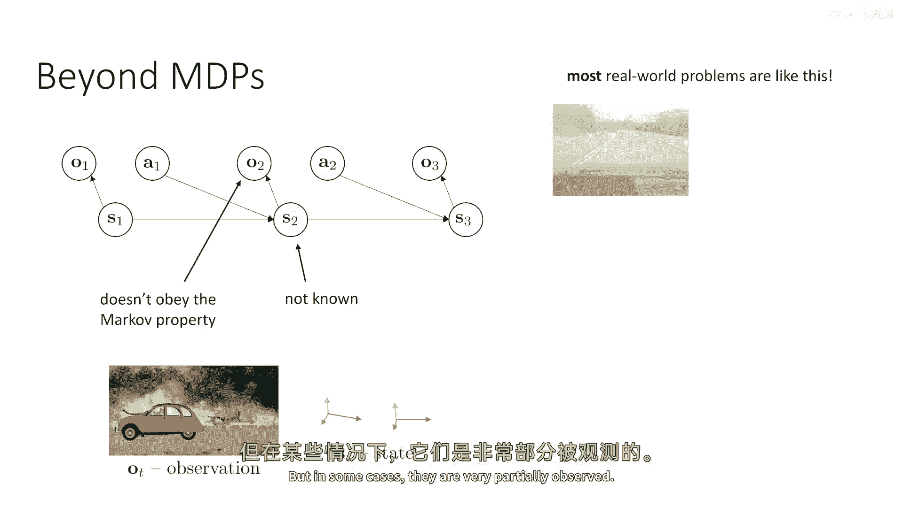

例如，如果你正在驾驶汽车，你可能在你的盲点中有另一辆车辆，例如，对于这辆红色汽车，你可能看不到蓝色汽车或卡车，但它们对它的未来状态非常相关，所以这些是真正意义上的部分可观察性情况。

如果你正在玩一款以第一人称视角的视频游戏，游戏中可能会有很多，那与你过去所见的事物密切相关，为了有效地玩这个游戏，你需要记住的事情非常重要，但在当前的观察中你不能看到。

另一个部分可观察性极其重要的设置例子，是与其他代理互动，如果你有一个应该与人类互动的机器人，人类的心理状态实际上是状态的未观察部分，所以你可能会观察到他们说或做什么，但你不一定能观察到。

他们在心中想的是什么，他们的是什么，嗯，他们的欲望是什么，他们的偏好是什么，他们从交互中想要得到什么，这是一个非常复杂的部分可观察性实例，部分可观察性的另一个例子是对话，嗯，如果你的观察是，嗯。

文本字符串，嗯，这可能是用于人类交互的，它也可能是你在与，让我们假设，一个基于文本的游戏或类似的东西，或者是甚至像Linux日志这样的工具，在这种情况下，交互的历史真的很重要，而且只是当前的短语。

像你最后看到的词，它本身并不能传达出所有的信息，所以现在这些都是部分观察的设置示例。

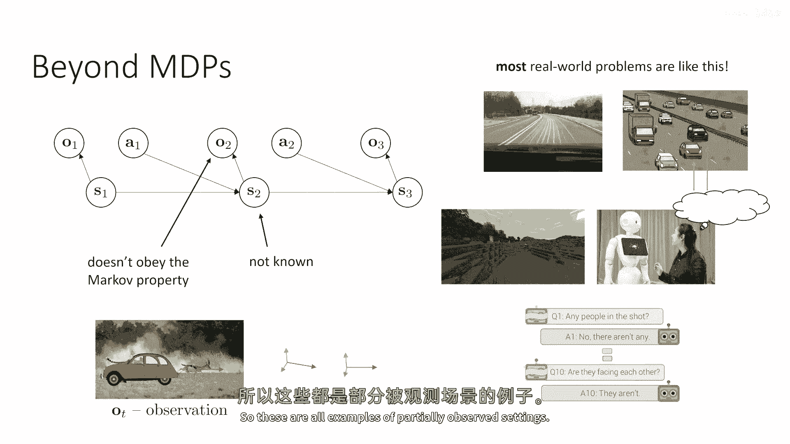

部分观察的MDPs可以真的很奇怪，嗯，我们可以通过简化使它们不那么奇怪，但如果我们只是，嗯，简单地对待它们，在部分观察的MDPs中，有很多事情发生，在完全观察的MTPs中。

这些事情 simply 不能发生，一个例子是信息收集动作，在部分可观察性下，可能最优的是做一些本身不会导致更高奖励的事情，但会给你更多的信息关于奖励可能所在的地方，奖励性的东西可能所在的地方，例如。

如果你正在穿越迷宫，如果你只是嗯，把它当作一个完全可观察的任务，也许你的 uh，状态是迷宫中的位置，然后你只需要在这个迷宫上运行RL，直到你解决这个迷宫，嗯，然后一切都很好，最优的行动总是朝着出口移动。

但如果你想解决一个迷宫的分布，所以你在试图得到一个可以解决任何迷宫的政策，现在是一个部分可观察的问题，如果你看不到整个迷宫从开始，如果你只是得到，让我们假设一个第一人称视图，因为现在，嗯。

未观察到的状态是你所在的迷宫配置，在这种情况下，实际上，可能最优的是像窥视迷宫的顶部一样，并尝试观察哪里，嗯，所有的交叉点，尽管这个信息收集行动本身并没有使你更接近出口，所以。

信息或收集行动是在有效策略中涌现出来的，而在完全观察到的mvp中，永远不会涌现出pudps，mdp，另一种奇怪的属性是，部分观察到的mdp可能会导致随机的，最优策略，而在完全观察到的mdp中。

总是存在一个确定的策略，它是最优的，这不意味着所有有效的策略都是确定的，可能会有一个同样好的策略是随机的，但在完全观察到的mvp，你永远不会陷入只有随机策略最优的情况，而在部分观察的mdp中。

这实际上是可能的，嗯，这里是一个非常简单的例子，假设你有一个三状态mdp，你可以处于状态a，b或c，奖励总是居中，所以状态b的奖励为加1，而你在每个状态开始的概率是0。5在状态a，和在状态c。

所以你有50%的可能性从左边开始，从右边开始，让我们假设你现在进行了部分观察，你观察中不含有任何信息，所以基本上在这种部分可观察的dp中，因为你没有任何观察，你基本上只能承诺采取行动，要么是左边。

要么是右边，一个确定性的策略必须选择，要么是现在总是去左边，要么是总是去右边，如果它选择总是去左边，然后，如果它从状态c开始，它最终会到达好状态b，如果它从状态a开始，它永远不会到达状态b。

如果它承诺总是向右走，然后，如果它从状态a开始，它会得到奖励，但如果它从状态c开始，而且，由于这里的确定性策略必须依赖于观察，而且，观察没有任何信息，唯一确定政策的选择是始终向左走，或者始终向右走。

但如果你有一种左转或右转概率为五十五十的政策，那么无论它从a还是c开始，它最终都会到达b，所以这是一个例子，在这种情况下，随机政策实际上比任何确定政策都要好。

好的，现在，到这个点，我们可以问之前我们学到的rl算法中，哪些实际上能够正确处理部分可观察性，现在我们必须对这个问题非常小心，因为正确处理它的含义是什么，嗯，所以我们会在一会儿讨论这个问题。

但现在但首先让我们回顾不同的方法，嗯然后我们会讨论这个，所以嗯，我会讨论三种方法，三种类方法，真正的策略梯度，我们讨论的第一个方法，哪个构建了策略梯度的估计器，使用某种优势估计。

使用我们之前见过的熟悉grad log pi公式，所以在策略梯度中，我们可以简单地将状态替换为观察，嗯只输入观察，使用相同的梯度估计器，只是政策，这是一个好问题，基于价值的方法，我们能否，嗯简单地取。

让我们说Q学习方程，并简单地替换s为，O这是一个有效的事情可以做，模型基于RL的方法，让我们说最简单的一种模型基于RL的方法，其中我们训练一个模型，该模型预测下一个状态，给定当前状态和动作。

然后通过该模型规划，我们可以简单地替换s为o，在这种情况下，当然这是一个有点技巧的问题，因为在我们开始回答这个问题之前，对于每种方法，我们都必须理解处理实际上意味着什么，处理部分可观察性意味着什么。

正确地处理，现在，花一点时间来思考这个问题，对于这种方法，你想要什么，假设它确实可以简单地替换状态为观察，你希望从这种工作正确的方法中得到什么，与工作不正确的方法可能出现的问题相比，所以。

在所有这些情况下，我们将试图获得一个政策，该政策考虑观察，而不是状态，并产生一个动作，如果我们的方法正在正确工作，我们期望得到的是可能的最佳政策，考虑到我们只能看到现在的观察，例如，在三个状态下。

最佳政策应该是左转或右转，概率各一半，这是现在最佳的反应性政策，当然你不能得到，如果你得到一个不是反应性的政策，你可以做得更好，如果你得到一个有记忆的政策，当然你不能得到。

你可以做得更好如果你得到一个不是反应性的政策，如果你得到一个有记忆的政策，但是现在我们只是提出问题，我们能在不改变意义的代表性约束下，得到最佳政策吗，在约束下，政策只能查看当前观察。

所以它是该类无记忆反应政策的最佳政策，我们无法期望做得更好，除非我们实际上改变政策类，目前我们并没有改变政策类，我们只是在改变，嗯，我们只是在改变算法，并尝试直接替换观察的状态。

所以处理意味着在无记忆政策类中找到最佳政策，好的，所以对于这个处理概念，花一点时间思考我们是否能在无记忆政策类中得到最佳政策，使用观察替换状态来计算政策梯度时，是否正确。

基于价值的方法和基于模型的强化学习，让我们从讨论政策梯度开始，所以非常诱人地说，如果我们想要一个接受观察并输出行动的政策，让我们使用相同的grad log pi方程，并只是简单地替换s行o是否正确，嗯。

有趣的是，我们从课程开始对政策梯度的推导，从未实际上假设马尔科夫性质，它假设分布因子化，这意味着概率链规则的应用是可能的，但这总是真的，实际上并没有假设即将传递给政策的状态，分离过去和未来。

所以使用grad log pi方程是完全可以的，然而，优势估计器需要一些小心，因为有多种方式可以估计政策梯度的优势，其中一些可能会让我们陷入麻烦，而其他的一些是完全可以使用的。

所以关键点是优势是一个状态的函数，St，优势并不一定是观察的函数ot，所以优势不依赖于st减去一，但如果你没有状态，你可能会遇到麻烦，所以使用rt加上下一个值，减去当前值作为你的优势估计器。

使用v的函数逼近器，是完全可以的，因为当你训练v作为状态的函数逼近器时，你基本上是利用每个看到状态s时，我们预期会得到相同值的属性，无论你是如何到达状态s的，所以帽子只需要是当前状态的函数。

它不需要考虑过去的状态，因为马尔科夫性质告诉我们，值只取决于当前状态，马尔科夫性质告诉我们，值只取决于当前状态，所以帽子只需要是当前状态的函数，因为它不需要考虑过去的状态，因为马尔科夫性质。

不依赖于你如何到达那个状态，当然，这对观察来说并不成立，所以你不能简单地替换v hat的论据并替换st为ot，因此，训练ot的v hat是不被允许的，因为值可能取决于过去的观察。

因为当前的陈述可能取决于过去的观察，这意味着，如果你打算使用政策梯度，如果你使用常规蒙特卡罗估计，如果你只是简单地插入奖励的总和，这是可以的，因为那个推导实际上没有使用马尔科夫性质。

但如果你试图插入一个值函数估计器，这不再被允许，因为那个值函数估计器对于优势函数的值函数，嗯是，嗯不是，嗯，是一个观察值的函数，它是一个状态和状态的函数，状态依赖于过去的观察，因此。

这种估计器是不被允许的，现在，作为一个小测验，我可能建议你们花一点时间来思考一件事，在我们开始谈论值函数估计器和基线之前，我们学习了什么，并且我们所学到的所有东西，我们都可以简单地取。

那些乘以grad log pi的奖励，并使用因果关系技巧来乘以grad log pi，与从t到结束的总奖励相乘，而不是从一到结束，所以，当你有部分可观察性时，使用因果关系技巧是否被允许。

花一点时间来思考这个问题，好的，所以嗯，我会透露答案，答案是这实际上是完全可以的，因为因果关系技巧也没有使用马尔科夫性质，它只是使用了未来不会影响过去的属性，现在，未来不会影响过去。

即使你在压力下行动可观察性，所以这实际上是可以做的，而且，实际上，它可以通过证明grad log pi的预期值，乘以过去的时间步奖励实际上平均为零，就像它对待状态一样。

不能做的是使用v hat作为优势估计器，你可能也会考虑是否允许使用v hat作为观察值的函数，作为基线，这也是一个有趣的问题，结果发现，这也实际上是可以的，出于简单的原因。

我们可以使用任何我们想要作为基线，并且估计器仍然是无偏的，这可能是因为使用只依赖于观察作为基线的价值函数，可能不会减少我们想要的方差，但它总是无偏的，仅仅因为所有基线都是无偏的，无论它们是什么，好的。

所以那是政策评估，所以政策梯度的简短版本是它们可以使用，但你必须小心那个优势，估计关于基于价值的方法，我们可以简单地取，例如，Q学习更新规则，天真地替换状态为观察，那样实际上会给你最佳的无记忆策略吗。

嗯，这里的答案遵循与前一张幻灯片相同的逻辑，因为同样的原因，它不能被接受，使价值函数仅依赖于观察，同样的事情使得使q函数仅依赖于观察不被接受，基本上，Q学习依赖于假设每次你访问状态s。

无论你怎么到达那里，你的价值对于所有不同的行动都是一样的，这在你有马尔科夫状态时绝对是真的，但这对于观察并不成立，因为如果你观察到一个给定的观察值o，你为不同行动的价值可能会依赖于之前的观察值。

所以它可能会依赖于你怎么到达那里，而且实际上这使得Q学习规则无效，所以基于价值的方法在没有马尔科夫属性的情况下不工作。

你 simply cannot naively substitute the observation in place of the uh of the state，当然。

如果观察本质上是一个马尔科夫状态，就像大多数雅达利游戏一样，这可以足够接近，结果可能会很好，但在一般情况下，你有越多的部分可观察性，这最多会工作得越差，一个非常明显的方式来看这一点是。

要注意从q函数中提取策略的方式是取行动，与总是确定的策略值最大的行动，但我们之前看到，棕榈dps有时可以有随机最优策略，因为q学习从未产生随机策略，存在一个，没有任何可能它产生最优策略，例如。

在那个包含三个状态的mdp中，随机策略更优，好的，关于基于模型的强化学习方法，我们能否简单地将o替换为s在我们的预测模型中，然后得到正确的答案，结果是非常否定的，嗯。

这就是为什么这个想法如此糟糕的一个例子。

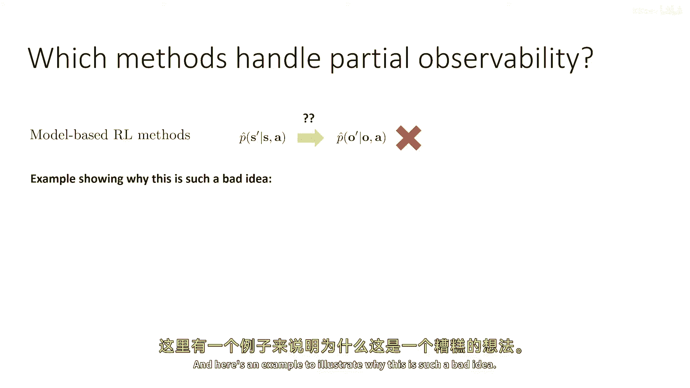

假设我们有以下环境，我们有两扇门，我们开始，嗯，在一个我们将要接近这两扇门的状态中，我们将尝试那扇门，如果它低，我们应该做的，我们应该尝试另一道门，哪扇门是锁的还是开的，将是随机的。

所以状态的一部分是哪扇门是锁的还是开的，你不能观察那个状态，你只看到你站在左边的门前，站在右边的门前，所以它是一个部分观察的问题，你不直到你现在尝试它时才能观察哪扇门是锁的还是开的，这里有一个最佳策略。

甚至是一个无记忆的策略，嗯，如果你站在门前，你应该首先尝试它，然后继续下一个，或者如果你必须无记忆，无记忆的，并且你不允许记住，如果你尝试了门，随机决定是否切换到不同的门，或尝试块。

就像在三个状态示例中一样，所以有实际解决这个问题的方法，即使你不能记住你以前做了什么，也不能记住，也不能观察门是否锁住，假设你有在左边门的观察，从在右边门的观察，当你通过门的观察，然后你想要训练模型。

所以模型将预测，你到达过去观察的概率是多少，你通过门的观察，给定你当前的观察是左边门，你的行动是打开，假设在每个episode中每扇门有50%，百分之五十的机会，所以百分之五十的机会左边是解锁的。

百分之五十的机会右边是解锁的，嗯，它们是互斥的，所以你总是翻一个硬币并解锁左边或右边的门，所以有一半的episode你将通过，如果你没有通过半数的集数，这就意味着如果你试图实际估计这些概率。

如果你试图训练模型，你会得到一个概率为0。5，但是，什么是，什么是一个好的策略，如果开门的概率是0。5，嗯，如果你每次尝试都有50%的概率打开门，这就是这个模型实际上试图要代表的。

那么你只需要反复尝试就能通过门，如果每次独立尝试的成功率都是70%，如果你只是继续尝试门，最终你会通过它，但是，当然这不是世界工作的方式，如果你尝试了左边的门但它没有解锁，这是因为门被锁了。

无论你尝试多少次，它都会保持锁定，但是，这个马尔科夫模型仅仅无法代表这一点，它无法代表如果你之前尝试过门，那么它就不会解锁，如果你再次尝试因为它的概率只与当前观察有关。

而且你当前正在采取的行动并不依赖于这个模型中之前的行动，所以，这个马尔科夫模型 simply 不能直接用于非马尔科夫观察，因为它会导致这些荒谬的结论，如果你一直试图锁门，最终它会解锁。

问题是模型只是模型的结构，仅仅不匹配环境的结构，在现实中，如果你在门打开之前没有尝试过，那么通过的概率实际上是零，但是，你不能用这个模型来表示它，因为模型不输入过去的观察和行动。

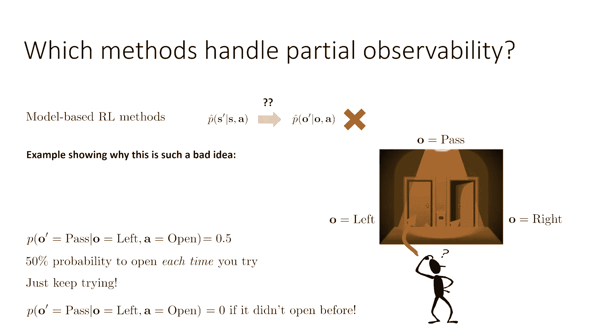

好的，到现在为止，我们谈论了无记忆策略，但是，当然，这是一个相当人为的限制，尤其是门例子，希望在现实中展示了这一点，如果你尝试门，你会记得你以前尝试过它，而且它没有锁定。

所以你知道在未来要做些不同的事情，所以，当然，在实际应用中，如果我们想要解决部分可观察的马尔科夫决策过程，我们确实应该采用非马尔科夫策略，这些策略以观察历史作为输入，我们可能有几种方法来处理这个问题。

处理这个问题的一种简单方法是使用被称为状态空间模型的方法，所以，使用状态空间模型，我们实际上在做的是学习一个马尔科夫状态空间，仅给定观察，我们之前在讨论变分推断时看到过这种情况，所以如果我们训练，例如。

一个序列VAE，其中可观察的序列是观察序列的序列，并且隐藏状态是潜伏状态的序列，其中我们可能有零的潜伏空间动态，初始状态的均值方差先验为1，并且有一些学习到的马可夫转移概率，以及一个观察概率。

它模型观察分布的分布，给定当前隐藏状态，然后有一个编码器，将观察历史的序列编码为当前隐藏状态，这些实际上代表环境的马可夫状态，这可以实际上工作得很好，所以如果你可以学习序列。

就像我们在变分推断讲座中讨论的那样，如果你不记得这是如何工作的，回到你的变分推断讲座中回顾一下，如果你能学习这个，然后你可以实际上直接将z替换为s，所以你不能做s的事情因为你没有状态。

你不能做观察的事情因为这是错误的，但你可以做它以z作为q函数的状态输入，这实际上是有效的因为我们训练模型以遵守马可夫性质，因为它们有马可夫动态，现在，为什么这可能本身不是一个解决所有问题的好方法。

这是正确的，它是有效的，但是为什么可能不够好，因为原因在于在某些情况下，实际上训练这个预测模型是非常困难的，而且，在许多情况下，它并不必要能够完全预测所有有关观察才能使用RL，如果你能预测所有有关观察。

例如，嗯，在，嗯，我们在非常短的推断讲座中讨论的论文中，其中你可以直接预测这些moco环境的图像，然后你可以实际上使用底层的隐藏状态作为马可夫状态空间，但这可能是一个比解决RL问题更难的问题。

实际上生成这些图像，生成所有这些像素可能比恢复最佳策略更难，所以也许我们不需要良好的预测来获得高奖励。

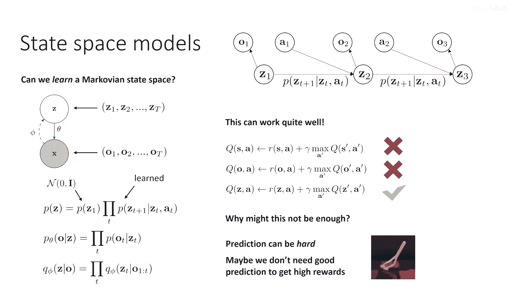

我们可以这样做，我们可以做的事情是，我们可以观察到当状态空间模型运行推断时，实际上，它使用观察历史的序列来推断z。

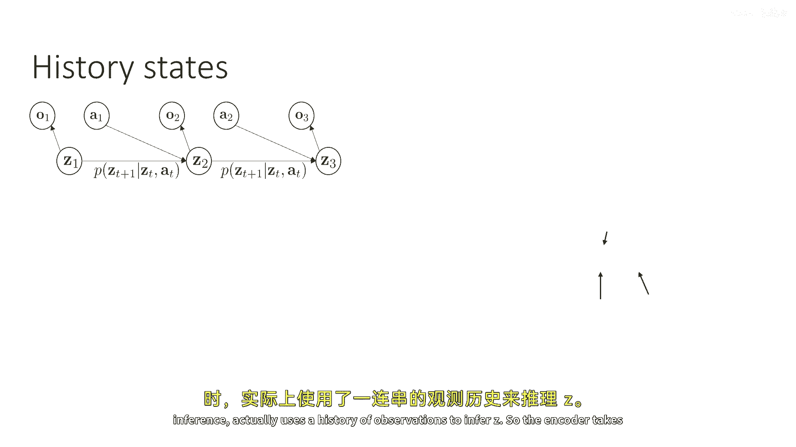

所以编码器，嗯，它将所有过去的观察结果和数据计算出货币分布的概率，这就是序列费用工作良好的方式，如果我们要取观察历史的记录，我们做得好的地方，如果我们只是注意到zt是一个观察历史的函数。

所以它可以包含更多的观察历史信息，所以如果我们使用观察历史本身作为我们的状态表示，它将包含与zt相同的信息，这是我们从序列费用中推断出来的，所以如果我们就这样定义我们的状态，如果我们说。

我们的状态st就是所有有序观察o1到ot，如果在以前不能从o1到ot推断zt，这意味着o1到ot包含了我们需要获取马尔科夫状态的所有信息，这意味着它应该是一个马尔科夫状态本身，所以这工作吗。

这基本上等于问，历史是否遵守马尔科夫性质，马尔科夫性质只是说，状态st加1在当前状态st的条件下是独立的，st-1，给定当前状态st，现在当前状态st是到t的所有观察。

之前的状态st-1是到t-1的所有观察，嗯，这是什么这表明之前的观察告诉我们 nothing，我们不能从sd本身推断，对，因为st包含t-1在里面，观察o1到ot-1包含在序列o1到ot中。

这意味着如果你已经知道st，这意味着你知道从o1到找到st-1，意味着，找出所有过去的观察不告诉我们 anything new，因为那个序列已经包含了所有的先前观察。

这基本上是为什么历史状态遵守马尔科夫性质的论据，这意味着到时间t的观察序列，分离了到时间t plus 1的观察序列，从到时间t minus 1的观察序列。

因为到t minus 1的序列包含在到t的序列中，如果我们在这些历史状态上应用q学习，这意味着我们的q函数是一个关于所有有序观察o1到ot的函数。

这实际上会工作，所以，当然，我们需要设计模型架构，以便利用这些历史状态，那么，我们如何代表一个可以很好地处理整个观察历史序列的q函数，如果我们有一个像您作业中的常规q函数，对于dqn的三个。

它们只接受一个图像，你可以简单地将一堆图像拼接起来，然后喂给q函数，这实际上是一个看起来不太好的想法，但实际上并不是，现在您只能使用固定的短观察历史，假设您将使用四个观察作为输入，那不是全部观察历史。

但在某些情况下，这可能足够启发式，嗯，在意义上，如果前面的四个观察告诉您需要了解的大部分信息，那么它可能足够马尔科夫的以工作，但这是不好的，嗯，这有点不好。

有时候因为你可能会遇到像迷宫例子那样的病理性设置，你在哪里观察迷宫，当你从顶部看过去时，你需要记住整个迷宫，然后记住整个剧集，在这种情况下，简短的历史是不够的，你真的需要记住一切。

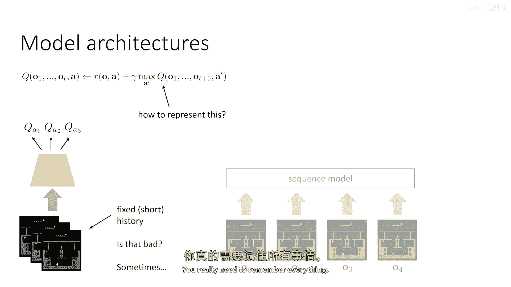

所以在最一般的情况下，我们需要使用一种序列模型，它可以处理一个可变长度的观察历史，作为我们的q函数，然后输出q值在最后，并且这可以用任何序列模型来实现，例如，RNN，LSTM或Transformer。

在这种情况下，我们的q函数，我们的策略或动态模型必须用RNN、LSTM或Transformer来表示，LSTM或Transformer，这是完全合理的一件事，你可以用这种直接的方式训练它。

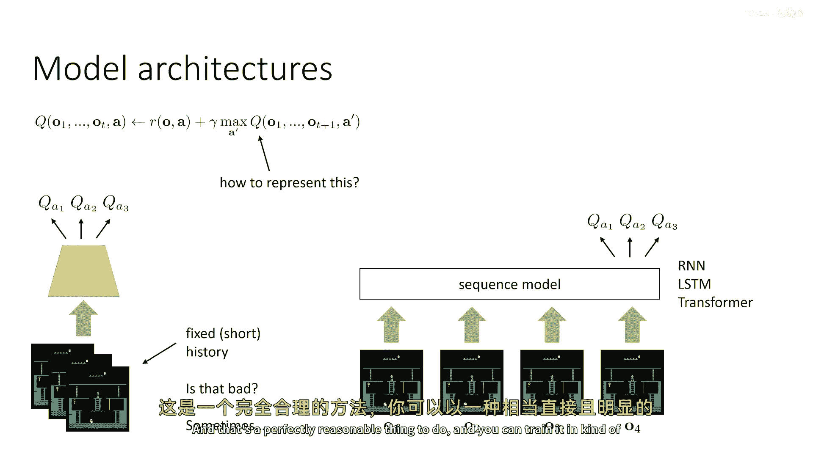

显而易见的方法，与任何其他地方训练序列模型一样，现在，我们需要注意一个与这个相关的实际细节，实际细节是，嗯，与嗯有关，计算效率，所以，让我们通过一个深度Q学习算法的历史示例来工作，常规Q学习。

我们收集一个过渡，将其添加到回放缓冲区，从回放缓冲区中采样一个批次，更新这个批次的q函数，然后重复，如果你想使用历史状态，你将会收集过渡，现在是一个元组，o t a t o t加1。

你将会创建这个时间的历史，通过连接所有过去的观察来步进t和t加1，然后将这些历史添加到你的缓冲区，然后你将会采样一个批次的下一个历史动作历史，然后更新这个批次的q函数，这行代码可以运行。

这是一种有效的方法，可以让我们自己管理历史状态，但是，它非常昂贵，因为现在，实质上，你存储的信息量将随着视界平方的增长而增长，因为对于每个视界，你有，让我们假设你的视界资本为t，你有t个时间步长。

并且每个步长中都有t个观察值在里面，所以，这对我们来说非常昂贵，你在这里会得到一个二次爆炸，内存成本，它还是正确的，它只是计算和内存消耗大，所以嗯，你可以做的事情之一，假设你在使用rnn或lstm。

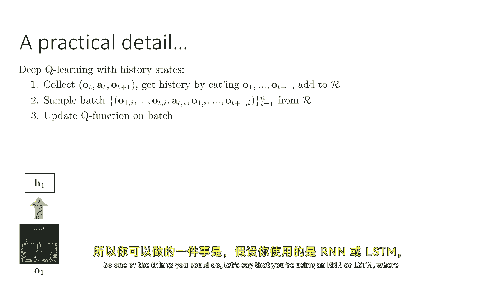

其中，用于q的神经网络，在里面有一些隐藏状态，这些状态被用来读取这些观察，那么，你可以存储rnn状态本身，所以，而不是实际存储整个历史，你可以说，观察一和二的全部信息由RNN的隐藏状态完全总结。

H two，以及观察一零二，零三的全部信息由RNN状态h three完全总结，所以，你可以做的，你可以基本上每次加载历史时重用RNN的隐藏状态，你不加载整个序列，你从某个中间点开始加载它，然后。

你将在那个点实际存储RNN隐藏状态，你可以用RNN和LSTM来做到这一点，我不会对这个方法详细解释，它的基本思想是基本上使用RNN状态，就像它们，嗯，系统自身的马尔科夫状态，它们是，除了一小点例外。

那就是RNN状态随着RNN自身的更新而变化，如果你想了解更多关于这个，查看关于重复经验的论文，在分布式强化学习中重放，你可以用这个技巧与RNN和LSTM一起使用，而且它对获取非常长的历史非常有效。

实际上它实际上表现得非常出色，例如，在Atari游戏中，嗯，不清楚如何用Transformer来做到这一点，因为Transformer没有单个隐藏马尔科夫状态，因此，据我所知。

没有人知道如何使用transformers来实现这个，但对于RNNs和LSTM，这是一种非常有效的策略，所以我鼓励你去检查一下，如果你想了解一些实际细节。

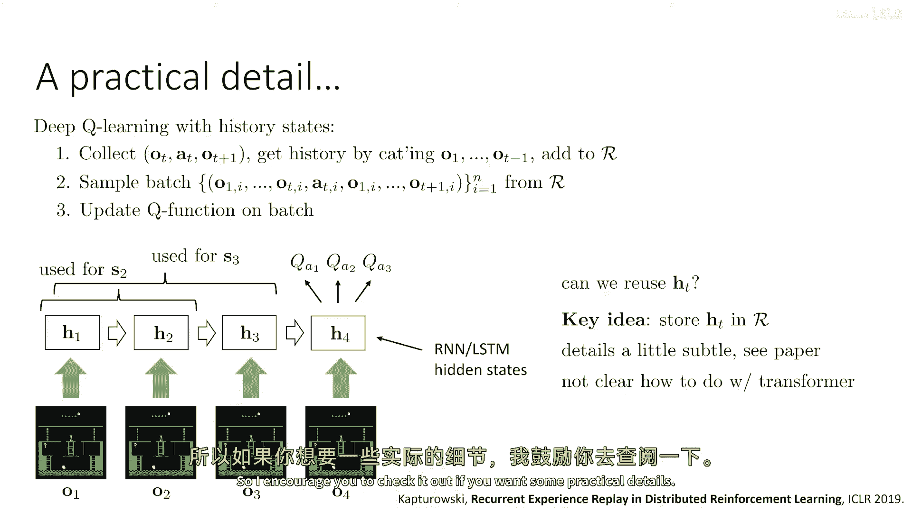

所以总结一下，Puts是奇怪的，嗯，有设置，与MDPs不同，有些与Puts相关的事情永远不会发生，比如随机策略和信息收集动作，嗯，一些方法只是在意义上工作，因为它们恢复了最优的无记忆策略。

但是最有效的方法，如基于价值的方法，不，因为它们需要使用价值函数，即使那些工作的方法，它们仍然得到无记忆策略，这可能不如具有记忆的最优政策好，我们可以学习一个马尔科夫状态空间，使用序列VAEs等模型。

并且这是一件可以做的事情，我们还可以使用历史状态，这仅仅意味着使用序列模型来读取观察历史，这可能是一种高效的方法，但是，如果你需要使用序列模型，那么你就需要用它们来代表你的价值函数。

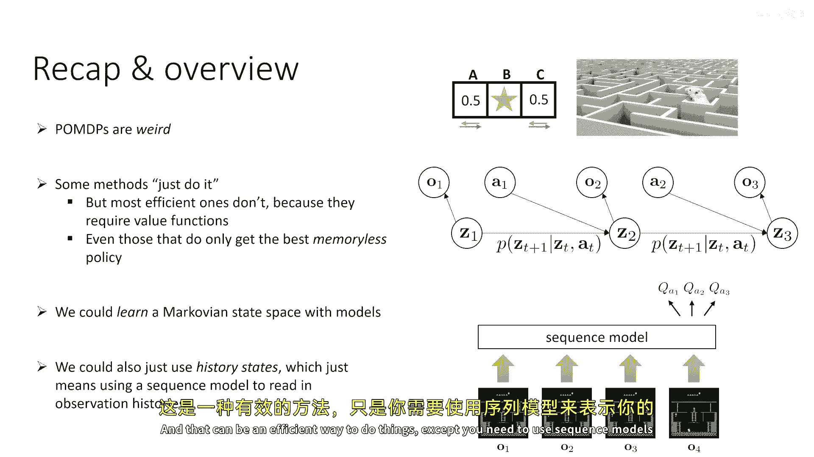