# P9：p9 CS 285： Lecture 4, Part 1 - 加加zero - BV1NjH4eYEyZ

欢迎来到今天的第四堂CS245课程，我们将详细介绍强化学习算法。

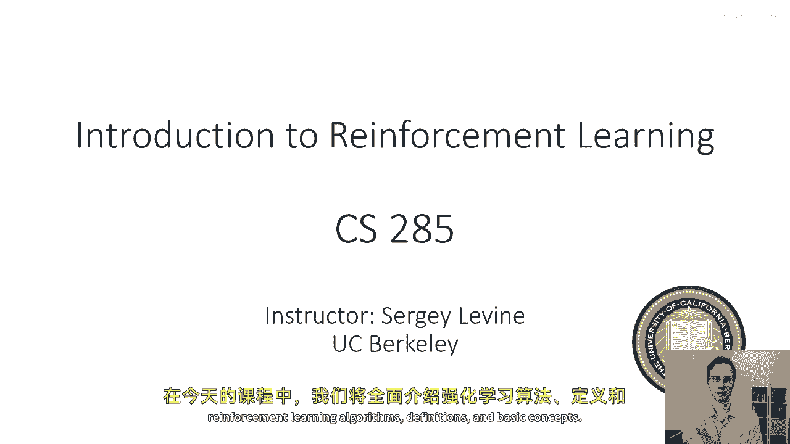

定义和基本概念，让我们从一些定义开始。

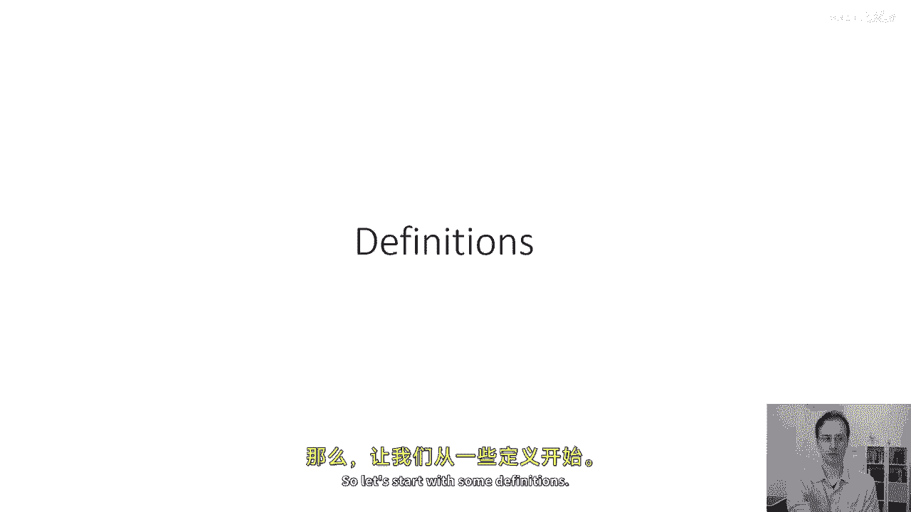

首先，让我们回顾一下上一堂课中覆盖的一些术语，当我们谈论模仿学习时，我们了解到我们可以将策略表示为一种对动作的分布，给定观察，t的条件下，我们将这个策略称为pi，我们经常使用下标θ来表示。

来指示政策依赖于一个参数向量，在我们做深度强化学习时，我们将使用θ来表示，通常，我们将政策表示为一个深度神经网络，尽管，正如我们将在下几堂课中学习到的，取决于强化学习算法的类型。

我们可能会选择直接或间接通过其他对象来表示政策，例如，价值函数，需要了解的重要定义是状态st，观察ot和动作at，我们在模仿学习讲座中学到的，观察和状态可以通过以下图形模型相互关联，其中。

观察和动作之间的边是策略，当前状态和动作与未来状态之间的边是转移概率或动态，并且状态满足马尔科夫性质，这意味着时间t+1的状态与时间t-1的状态独立，关于当前状态s_t的一个条件。

马尔科夫性质是状态与观察的主要区别，状态必须满足马尔科夫性质，而观察并不满足，我们在模仿学习课程中学习到，观察是状态的一些随机函数，这可能或不包含推断完整状态所有必要的信息，所以这就是主要的区别。

我们将讨论完全观察强化学习算法，您可以访问状态，和部分观察强化学习算法，您可以仅访问观察，好的，所以这就是马尔科夫性质，通常我会看到我将政策写成pi theta a t给定ot。

或pi theta a t给定s t，根据我是否在谈论部分观察的还是完全观察的情况，我会有时候变得稍微不严谨，使用st的时候，实际上，你也可以使用ot，但在这种情况下，这种区别很重要。

我在课堂上会做出备注。

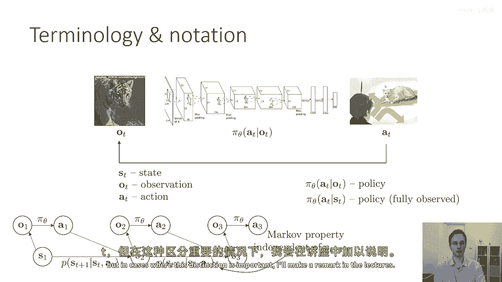

所以，在模仿学习中，我们看到我们可以收集一个数据集。

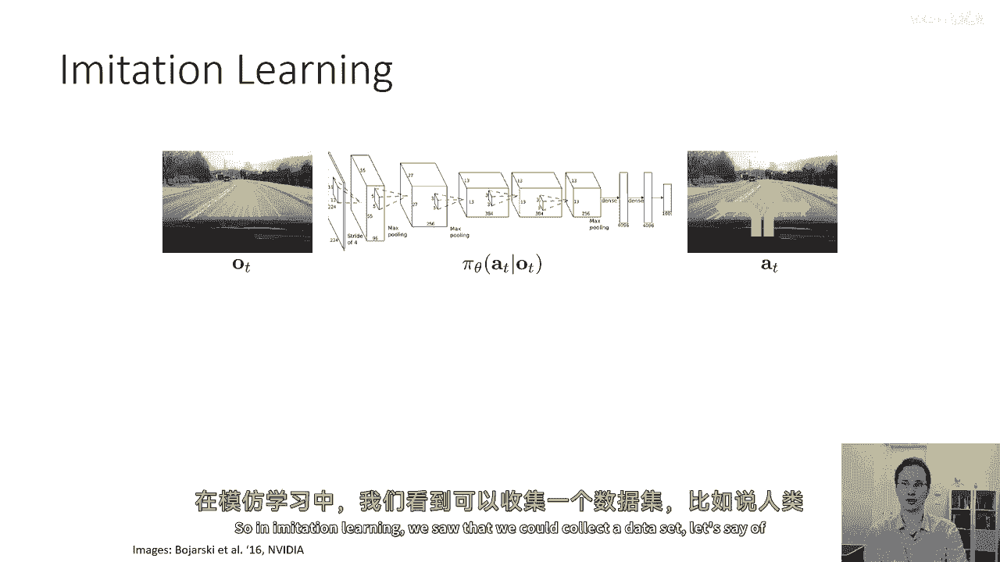

假设是，嗯，人类，驾驶一个由观察动作元组组成的车辆。

然后使用监督学习算法来确定如何训练策略，以采取类似于专家行动的动作，在今天的讲座中，我们将介绍强化学习的正式形式，这允许我们训练这些策略，而无需访问专家数据。

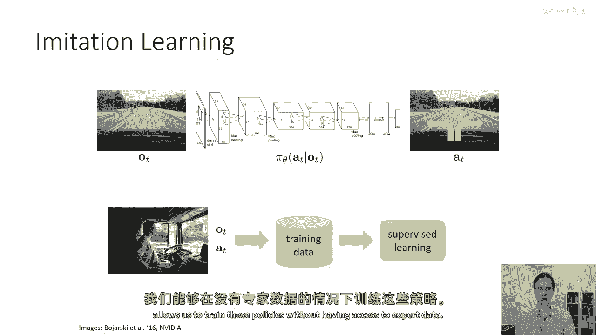

因此，为了做到这一点，当然，我们需要定义我们想要策略做的事情，我们通过所谓的奖励函数来定义目标，所以可以说，哪个动作更好，或更坏，如果你在驾驶这辆车，如果没有任何数据，你怎么能说哪个动作是好的。

哪个动作是坏的，所以，奖励函数本质上告诉你，奖励函数是一个标量，状态和动作的值函数，尽管有时它可能只依赖于状态，最一般地，它可能依赖于状态和动作。

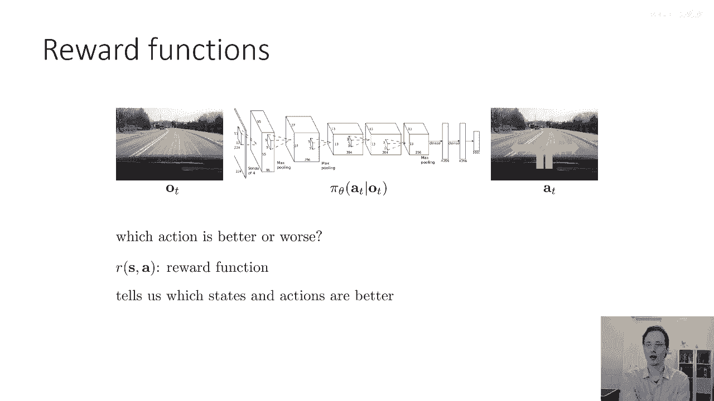

并告诉我们哪些状态和动作更好，所以，例如，如果你在试图驾驶一辆车，你可以说，一个状态，其中汽车在道路上快速行驶是一个高奖励状态，而一个状态，其中汽车与其他汽车相撞是一个低奖励状态，但关键地。

强化学习的目标是不仅仅是立即采取奖励高的动作，而是采取将导致未来更高奖励的动作，所以，如果你在道路上开得太快，你可能得到高奖励，但这可能会导致后来的不可避免碰撞，这将导致低奖励。

所以你在选择当前动作时必须考虑未来奖励，这就是决策制定问题的核心，这就是强化学习问题的核心是，你现在如何选择正确的动作，以在未来收到更高的奖励，好的，所以，状态，动作。

奖励和转移概率定义我们称为马尔科夫决策过程的东西，它是一个在马尔科夫状态下的决策过程。

所以，让我们逐步构建一个完整的马尔科夫决策过程的正式定义。

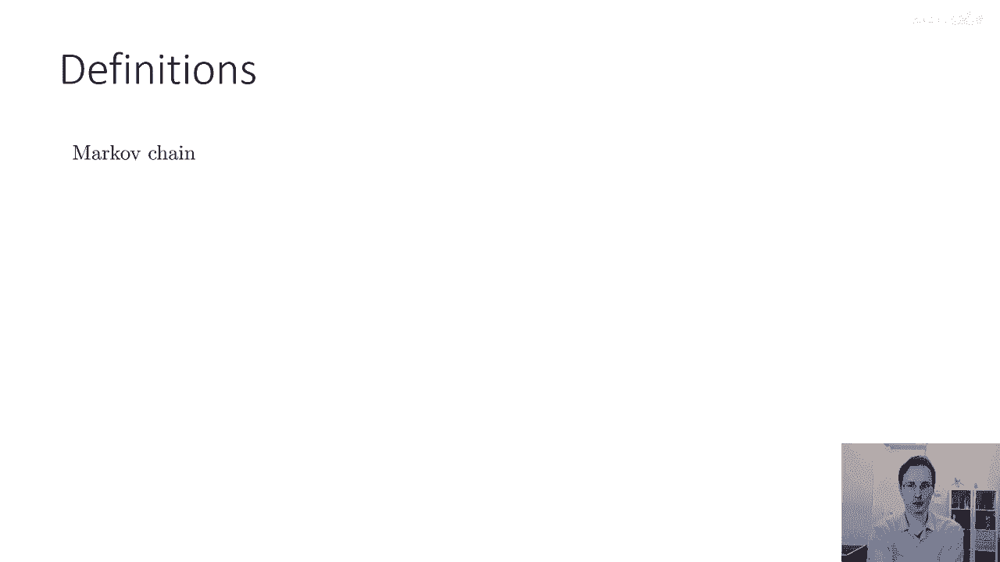

我们将从被称为马尔科夫链的东西开始，马尔科夫链以安德烈·马尔科夫命名，他是一位数学家，开创了随机过程的研究，包括马尔科夫链，马尔科夫链有一个非常简单的定义，它只包含两件事。

一个状态集 s 和一个转移函数 t，状态空间仅仅是一个集合，它可以是离散的，也可以是连续的，所以你可以有一个离散的状态，在这种情况下，每个状态都是一个有限大小集合的离散元素，或者你可以有一个连续的状态。

在这种情况下，也许你的状态对应于 rn 中的实值向量 t 是一个转移算子，它也可以被称为转移概率或动力学函数，它指定一个条件概率分布，所以，在马尔科夫链中，t 表示时间 t 时的状态概率。

在时间t的状态上添加一个条件，它被称为运算符的原因是，如果我们以向量的形式表示时间步t每个状态的概率，假设我们有n个状态，这将成为一个包含n个元素的向量。

我们可以将其称为mu t逗号i表示第i个状态的概率，整个向量将被称为mu t，然后，我们可以将转移概率写成矩阵，其中，ij行表示从状态j转移到状态i的概率，如果你目前处于状态j，"如果我们这样做"。

"然后，我们可以表达下一个时间点的状态概率向量"，"将'Step mu t plus one as simply a matrix'翻译成中文为'将步骤μt+1视为一个简单的矩阵'"。

"概率矩阵t与状态概率向量mu t的向量积"，"这只是一种用线性代数稍微改写的概率链规则方式。"，"但是，在这里你可以看到，t 对 mu mu t 作为线性算符的作用"。

这就是为什么我们称它为过渡算符的原因，"这是一个操作员"，"当应用于当前状态概率向量时"，生成下一个状态概率向量，所以，这里是对应于马尔科夫链的图形模型，这里是表示转移概率的边，当然。

马尔科夫链中的状态表示一个，马尔科夫链中的状态满足马尔科夫性质，这意味着在时间t的状态，加上一个是条件独立于时间t-1的状态，给定时间t的状态，好了现在，马尔科夫链本身不允许我们指定一个决策问题。

因为没有所谓的行动概念。

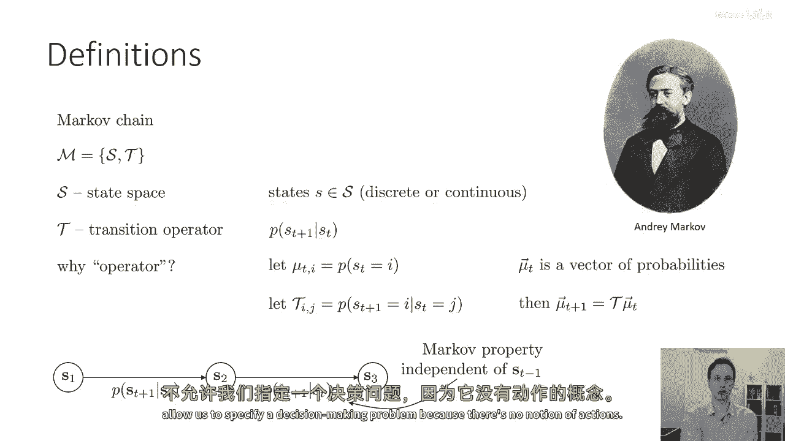

所以为了走向行动的概念，我们需要将马尔科夫链转换为马尔科夫决策过程。

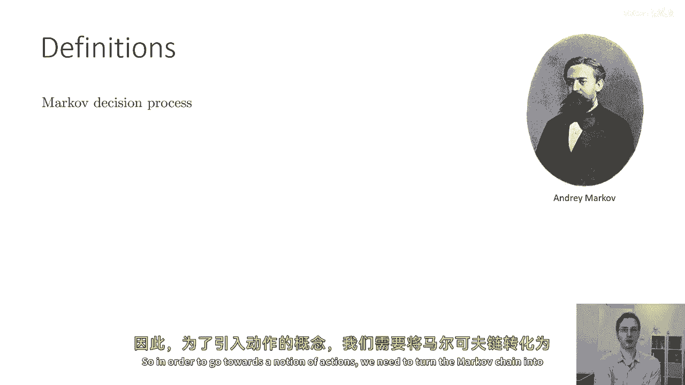

而且这真的是比，嗯，十九五十年代，所以马尔科夫决策过程向马尔科夫链添加了几个额外的对象，它添加了一个动作空间和一个奖励函数，所以现在我们有一个状态空间，它是一个离散或连续的状态集，我们有一个动作空间。

它也是一个离散或连续的集，"所以，图形模型现在包含了状态和动作"，"并且，我们的转移概率现在依赖于状态和动作"，因此，我们给定st，s t的p加1等于st，逗号。"它仍然被称为过渡算符"。

"但它不能再以矩阵的形式表达"，"现在，它实际上是一个张量，因为它有三维"，"当前状态的下一个状态和当前动作"，"但是我们可以做同样的线性代数技巧"，所以如果我们让μ等于t。

"逗号j表示在时间t处于状态j的概率"，我们可以有一个向量来表示采取某些行动的概率，现在，我们可以将t写成张量，所以t_i，J，K表示进入状态i的概率，如果你在状态j并采取动作k。

那么你可以写一个线性形式来描述状态概率mu_t加上一个uh，逗号i在下一个时间步作为当前状态概率的线性函数，当前的动作概率和转移概率，所以这意味着这个转移算子，尽管现在它是一个张量。

但仍然是一个线性操作者，将当前动作和状态概率转化为下一步，状态概率，现在我们也有这个奖励函数，并且奖励函数是一个映射，从状态和动作空间的笛卡尔积映射到实数值，这允许我们定义强化学习的目标。

所以我们称s t逗号a t的r为奖励，我们的目标，我将在接下来的几页中定义，将是最大化总奖励，但在我做这个之前，我只是想扩展这个马尔科夫决策过程的定义。

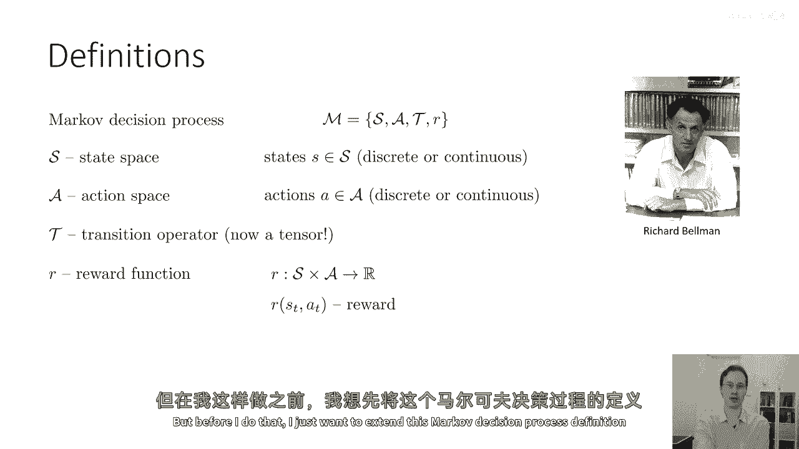

同时也定义部分可观察的马尔科夫决策过程，这就是让我们引入观察概念的方式，所以部分可观察的马尔科夫决策过程通过添加两个额外的对象进一步增强了定义，一个观察空间o和一个发射概率或观察概率e。

所以s仍然是状态空间，A是动作空间，现在o是观察空间，图形模型现在看起来与mdp相同，加上我们有这些观察o，这取决于状态，所以我们有一个与以前相同的转换操作符，现在，我们有了一个发射概率。

给定状态st的p，当然，我们也有奖励函数，奖励函数仍然从状态和动作映射到实数，所以，这是常规的奖励函数，它定义在状态上，不在观察上，但在部分可观察的马尔科夫决策过程或POMDP中。

我们将基于观察做出决策，而无法访问真实状态。

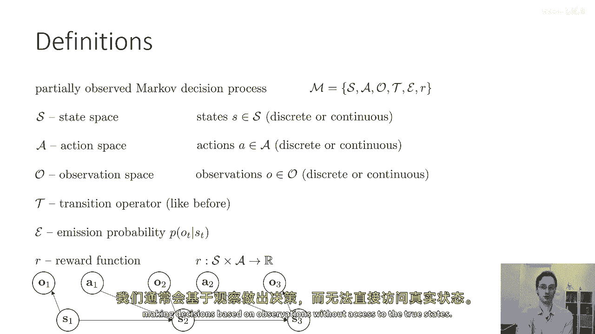

现在，我们已经定义了马尔科夫链的数学对象，马尔科夫决策过程和部分可观察的马尔科夫决策过程，让我们为强化学习定义一个目标，所以在强化学习中，我们将学习定义一个策略的对象。

所以目前让我们假设我们直接学习策略，我们将看到后来有一些其他方法可能隐式地代表策略，但现在我们将明确学习给定s的πθ，我们将稍后再回到来自部分可观察的情况，让我们说，我们的策略依赖于s。

θ对应于策略的参数，所以，如果政策是一个深度神经网络，那么，theta表示那个深度神经网络的参数。

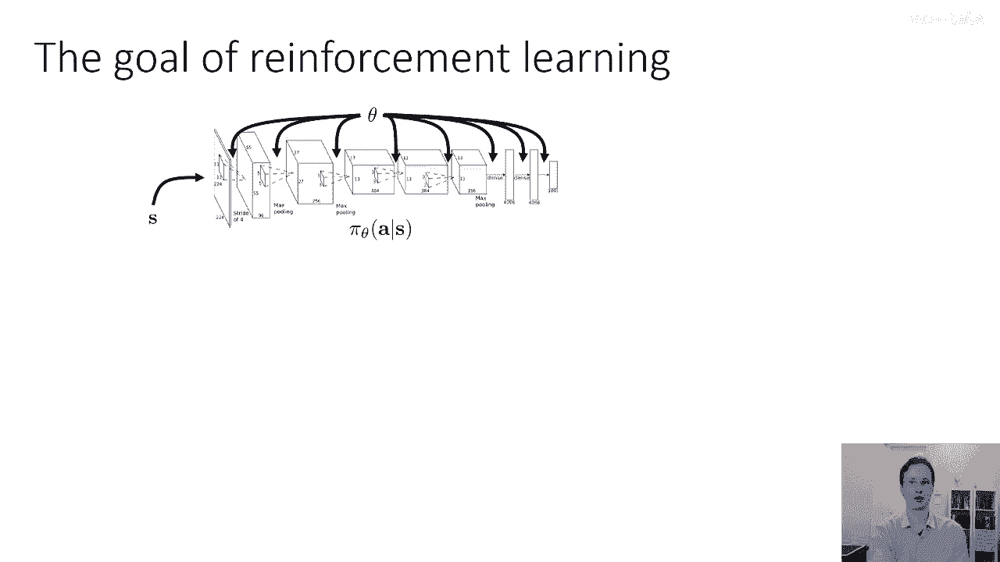

状态进入政策，行动出来，然后，状态和行动进入转换概率，基本上，统治世界的物理规律，产生下一个状态，对，所以，这就是我们正在控制的过程，现在，在这个过程中，我们可以写下一个轨迹的概率分布。

所以轨迹是状态和动作的序列，从s1到s2，再到s3，以此类推，直到你到达st，目前我们假设我们的控制问题是有限时间范围的，这意味着决策任务持续一个固定的时间，步数为t，然后结束。

我们将很快扩展到无限时间范围，但现在我们将写下有限时间范围的版本，因为它要简单得多，所以如果我们写下我们的状态和动作的联合分布，在这里我将在联合分布上添加下标θ，以指示它依赖于策略πθ。

我们可以使用链规则来分解它，以我们已经定义的概率分布来表述，所以我们有一个初始状态分布，P(s1)，我把这个稍微掩盖起来，当我定义马尔科夫链时，MDP和PMDP，但这些也都有一个初始状态分布。

s的一个概率，然后我们有时间上的所有产品的概念，动作概率的步骤，在给定s_t和从t到t+1的过渡概率的情况下，t的条件概率，在给定s_d和a_t的情况下，s_t+1的条件概率。

我说过这是从概率链规则的衍生，但是当然，在概率链规则中，你需要对所有过去的变量进行条件化，但在这里，我们利用马尔科夫性质来消除对t-1的依赖，t-2，等等等等，因为我们知道给定st。

t+1与st-1是条件独立的，所以这就是我们如何定义轨迹分布的方式，为了简洁的表示，我会有时写p(τ)来表示p(s1通过sd在t时的分布)，所以τ只是轨迹的缩写，它只意味着一系列的状态和动作，好的。

所以定义了轨迹分布后，我们可以实际上定义强化学习的目标，"我们可以将那个目标定义为在轨迹分布下预期的值"，"因此，强化学习的目标是找到定义我们策略的参数theta"。

"以便最大化轨迹上奖励总和的预期值"，所以我们想要一种能产生轨迹的政策，"那些预期最高可能奖励和预期的"，当然，这也解释了政策的随机性，"转移概率和初始状态分布"，当然，对于这个问题，有一些变体。

"在接下来的几堂课中，我们将逐步推导出它们。"，但是，这是最基本的版本，所以，到这个点，我希望你们所有人都暂停一下，仔细看看这个目标，真正确保你们理解这是什么意思，理解奖励总和的含义，理解在轨迹分布下。

他们预期的含义，什么是轨迹分布，以及它如何受到我们选择政策参数θ的影响，这反过来影响了政策πθ，因为如果这个部分不清楚，那么接下来的这个讲座的其余部分将很难跟随，所以请花一点时间来思考这个问题。

如果你有任何关于轨迹分布的问题，请在视频中留下评论，好的，让我们这样继续，我们可能会注意到关于这个轨迹分布因子化的一件事是，它实际上，尽管它是个，它是以我们在马尔科夫决策过程中拥有的物体定义的。

它也可以被解释为一个马尔科夫链，并将其解释为一个马尔科夫链，我们需要定义一种增强的状态空间，所以，我们的原始状态空间是s，但我们也有这种动作，并且动作使这成为一个马尔科夫决策过程，但我们知道。

动作取决于状态基于策略，所以，pi theta a t 给定 s t 允许我们获取基于状态的动作分布，所以，我们可以做，我们可以将状态和动作组合成一个种增强的状态，现在。

增强状态实际上形成了一个马尔科夫链，所以，p of s t plus one 逗号 a t plus one 给定 s t 逗号 a t，在这个增强的马可夫链中，转移操作符。

仅仅是mdp的转移操作符和策略的乘积。

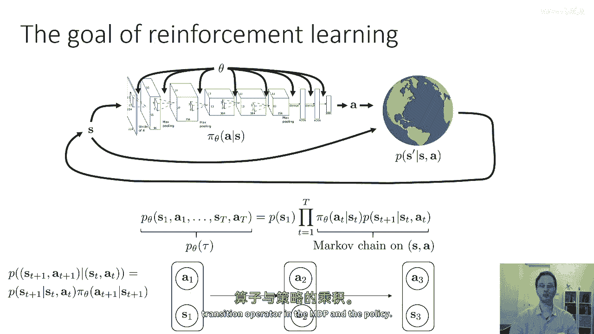

因此，我们可以以稍微不同的方式定义目标，这在我们后来的推导中将会很方便使用，所以到目前为止，我已经将目标定义为期望值，在奖励总和的轨迹分布下，但是记住，我们的分布实际上遵循一个具有增强空间的马可夫链。

并且这个转移操作符是mdp转移和策略的乘积，因此，我们也可以通过线性期望来写目标，"作为状态动作边缘下预期值的时间累积"，"在这个时间步奖励的马可夫链中"，"所以这就是在利用期望的线性性"。

"从期望中提取和值"，所以，你有一个关于t的期望值的和，超过"tau"个字母，包括"r"、"s"、"d"、"a"和"t"，"然后，因为现在期待中的事情只依赖于t"，我们可以将所有其他变量边缘化。

"我们剩下一个关于在参数为 p theta s t 的期望下的和"，"现在这可能看起来像是一种有点无用的小小数学"，嗯，你知道，"有点"，"原目标的重新编写"，但结果是非常有用的。

"如果你想将这个扩展到无限期前景的情况"，所以，这个边缘的p theta s t，给定一个t，在有限的uh中。

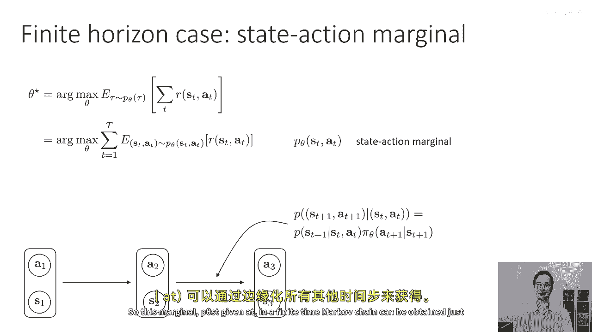

"马尔科夫时间链可以通过消除所有其他时间步来获得"，"但是我们也可以利用这一目标来获取无限期视角的情况"，那么怎么样，如果t等于无穷大，嗯，好的，如果t等于无穷大，首先会发生的事情是，嗯。

你的目标可能会变得模糊不清，例如，如果你的奖励，你的奖励总是积极的，然后，你有一个无限正数之和的总和，这将等于无穷大，因此，我们需要一种方法来使目标变得有限，并且有几种方法可以做到这一点。

其中一种方法是，我现在将使用这种方法以方便，但实际上，并不是最常用的方法是使用被称为的，平均奖励公式，所以你基本上取这个预期的奖励之和，并除以资本t，所以基本上，所有时间步骤的平均奖励除以资本t。

资本t是一个常数，所以总的来说，这不会改变最大值，但是，你可以将t取为无穷大，并得到一种明确的量，稍后我们将学习一个叫做折扣的东西，这是其他获取无限期前景有限数字的一种方式，但是嗯。

所以使这个精细化是非常容易的，但是让我们谈谈我们如何实际上定义无限期目标，所以我们之前有我们的马尔科夫链，和我们的增强马尔科夫链有这个转移操作符，这意味着我们可以写s_t+1。

 a_t+1作为t应用于s_t， a_t的线性操作，这是状态动作转移操作符，并且更一般地，我们可以跳过k个时间步骤，并且我们可以说s_t+k，A_t+k等于t的k次方乘以s_d。

所以一个问题我们可以问的是，状态动作边缘概率p(s_t， a_t)是否收敛到一个稳态分布，基本上，随着k的增加，它收敛到一个单一的分布，如果这是真的，这意味着我们应该能够写稳态分布μ为t乘以μ。

在几个技术假设下，例如城市化和链是非周期的，我们实际上可以证明稳态分布的存在，非周期性仅仅意味着它听起来像什么，那就是马尔科夫链不是周期性的，而可ergodic性意味着，粗略地说。

每个状态都可以从其他状态以非零概率达到，可ergodic性假设很重要，因为它防止了一种情况，如果你开始在一个部分，MDP你可能永远无法达到另一个部分，所以如果你，如果这，如果这是真的。

从开始一个部分可能会导致你永远无法达到另一个部分，那么开始的地方总是重要的，并且稳态分布不存在，但如果这不是这样，如果从任何状态到任何其他状态的可能性甚至存在，那么只要它是非周期的。

最终你就会有一个稳态分布，所以稳态分布必须满足这个方程，μ等于t乘以μ，否则它不是一个稳态分布，所以稳态意味着它在转换前后是一样的，如果它在转换前后是一样的，那么应用它足够的t最终会让你达到它。

你可以通过重新排列这个方程来解出稳态分布，稳态意味着它在转换前后是一样的，如果它在转换前后是一样的，嗯，那么应用它足够的t最终会让你达到它，你可以通过重新排列这个方程来解出稳态分布，看到它等于tau。

tau减去i乘以，嗯，所以它们可以被写成tau减去i乘以mu等于零，记住mu是一个分布，所以它是一个数字向量，所有元素都是正数，并且和等于一，所以你可以找到mu的一种方法是找到特征向量，特征值为一。

对于由t定义的矩阵，所以mu是t的特征向量，特征值为一，并且它总是存在在可分性和周期性假设下，所以如果我们知道如果我们将这个马尔科夫链向前运行足够多次，最终它会收敛到μ，这意味着随着t趋向无穷大。

这个边际期望的总和将由稳定分布项主导，所以你有一些有限的项，最初这些项不在稳定分布中，μ一，μ二，μ三，等等，但是，然后你有无数个非常接近稳定分布的术语，这意味着一旦你将平均奖励情况输入。

所以你会发现并放置一个1除以t，然后取t趋近于无穷大的极限，极限基本上将是在稳定分布下奖励的期望值，这允许我们在无限时间尺度的强化学习中定义一个目标，随着t趋近于无穷大，好的，这可能需要一些时间来理解。

这就是可能很难消化的信息，所以这应该是一个暂停的好地方，思考一下这个幻灯片的推导，如果某件事情不清楚，或者你有任何问题，请确保将它们写在评论中。

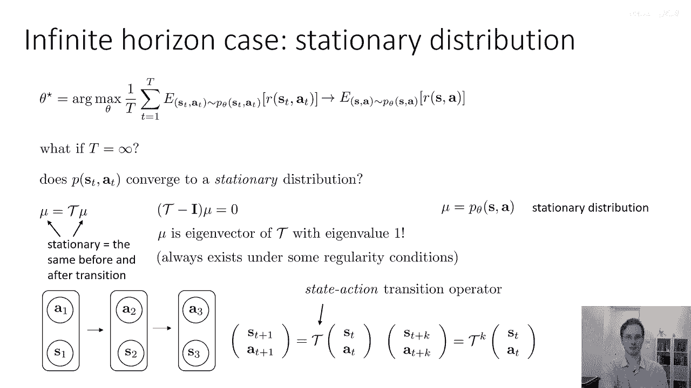

好的，嗯，现在，一个，嗯，我想在这个部分描述的最后一部分，这对于理解许多强化学习方法的基本原理非常重要，那就是强化学习实际上是关于优化期望的，所以虽然我们谈论强化学习时是以选择导致高奖励的行动来描述的。

但我们一直非常关注奖励的期望值，关于期望值的一个有趣事情，是期望值可以在对应分布的参数中连续变化，即使我们正在处理的函数，其期望值本身高度不连续。

这是理解强化学习算法为什么可以使用平滑优化方法如梯度下降的一个非常重要的事实，的关键，优化看似非可微的目标，比如游戏赢得或输得的二进制奖励，让我用一个小的玩具例子来解释。

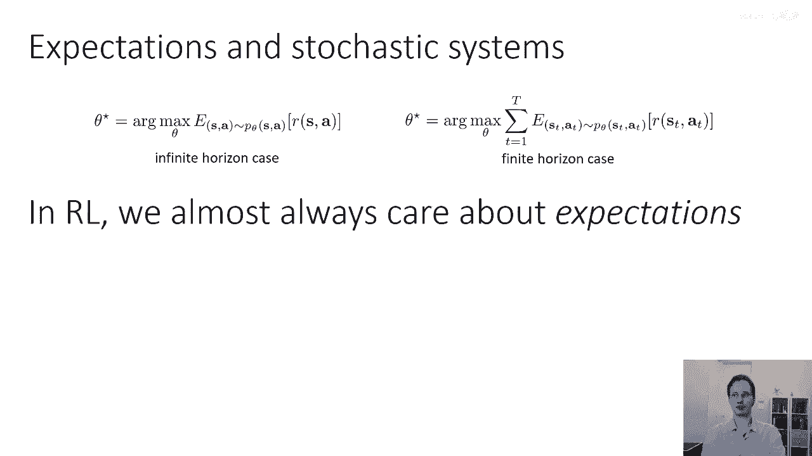

想象一下你在下山的山路上开车，如果你的奖励是如果你保持在路上就加1，如果你掉下来就是0，或者如果你掉出路外就是-1，所以这里的奖励函数看起来似乎是不连续的，在保持在路上和掉出路之间有间断。

如果你试图以 respect to 为例来优化奖励函数，例如，汽车的位置，由于奖励不是连续的，或者你几乎不是一个关于汽车位置的可微函数，所以基于梯度的方法实际上无法解决这个问题，然而。

如果你有一个关于某些动作的概率分布，让我们，让我们假设抽象地说，你就只能选择是否跌倒，所以，你有一个二进制动作，你只能跌倒或者不跌倒，所以你的行动是二进制的，你只能跌倒，你不摔倒，然后嗯。

这是一个伯努利随机变量，其参数为theta，所以以概率theta，你摔倒的概率是1减去theta，你不摔倒，现在，有趣的是，以pi theta为参数的奖励期望值实际上在theta上是平滑的。

因为你有概率theta摔倒，具有奖励为负一的是哪一个，并且停留在道路上的概率是1减去theta，所以奖励是1减去theta加上1减去theta减去theta，并且这在theta上是完美光滑和可微分的。

所以这是这是一个非常重要的属性，它将再次出现，并且它确实解释了为什么强化学习算法可以优化看似非，光滑甚至稀疏的奖励函数，这是因为非。

光滑和不可微分的函数的预期值在可微分和光滑的概率分布下本身也是光滑和可微分的。

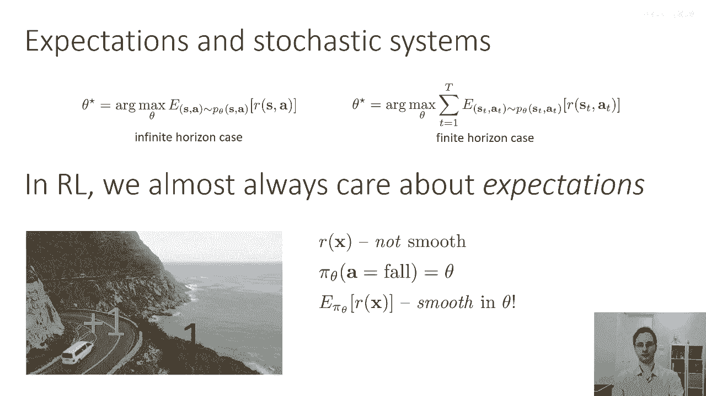

好的。