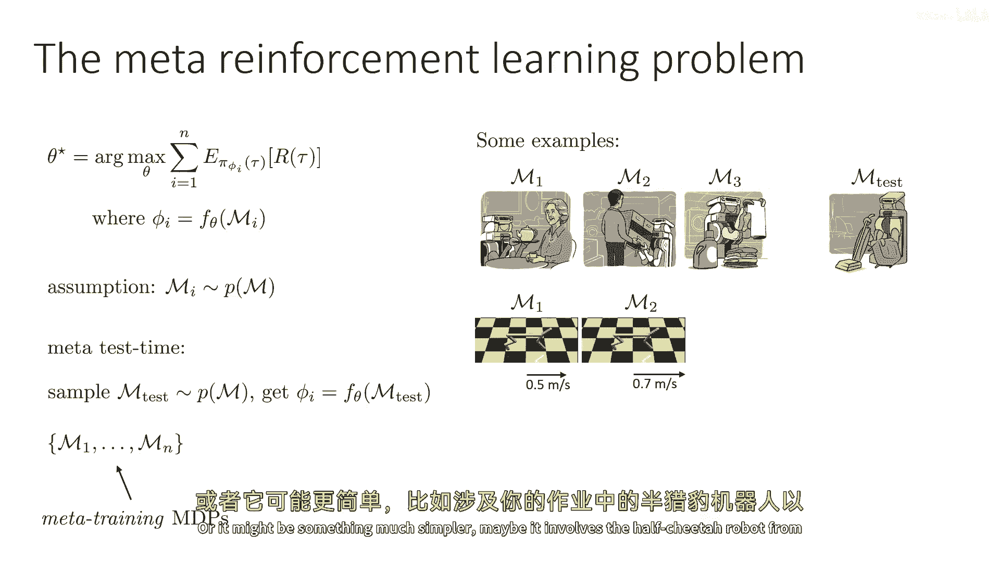
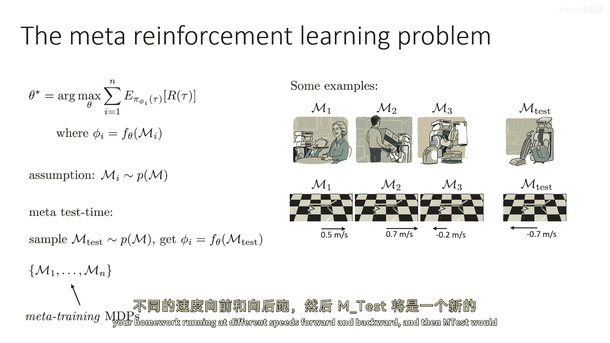
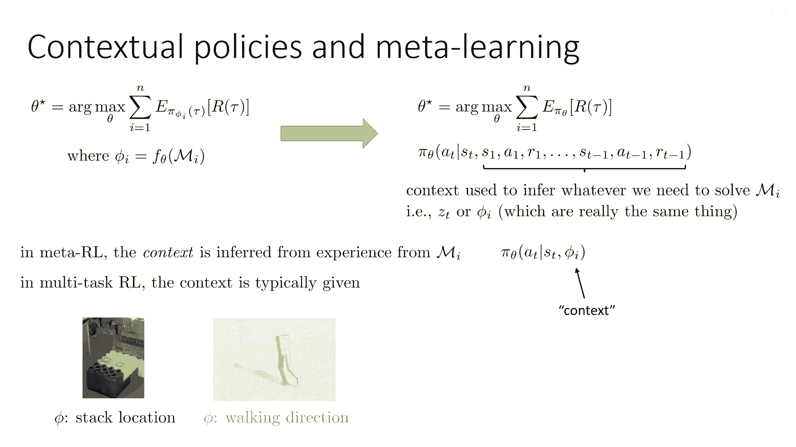
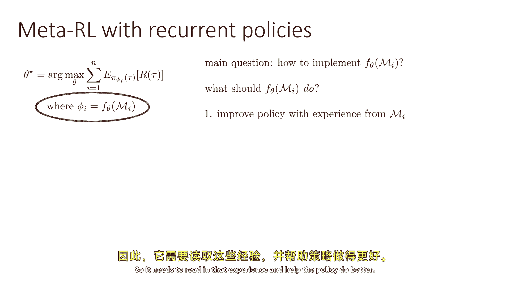
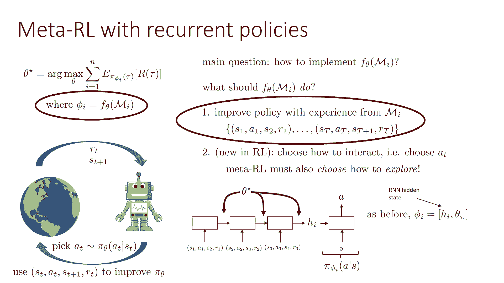
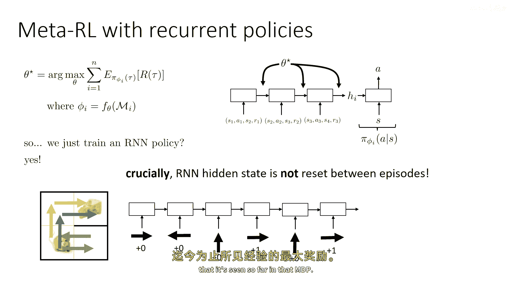
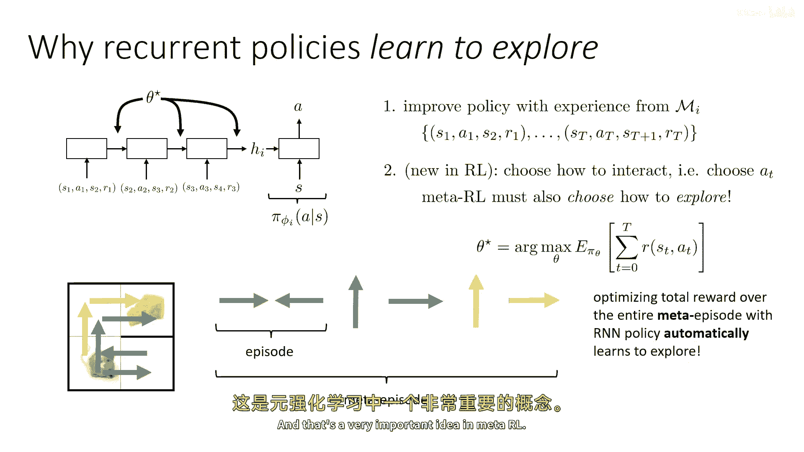
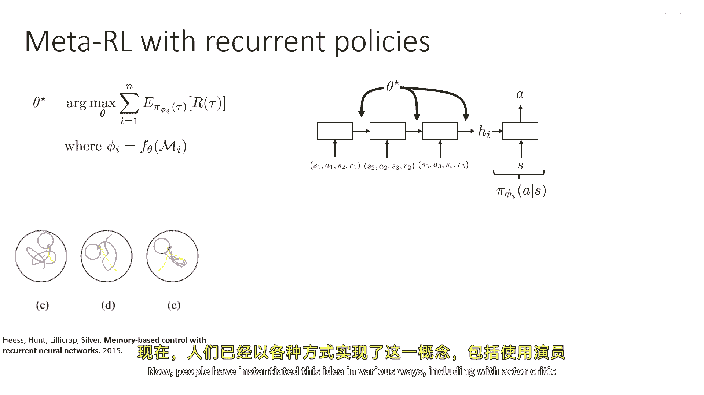
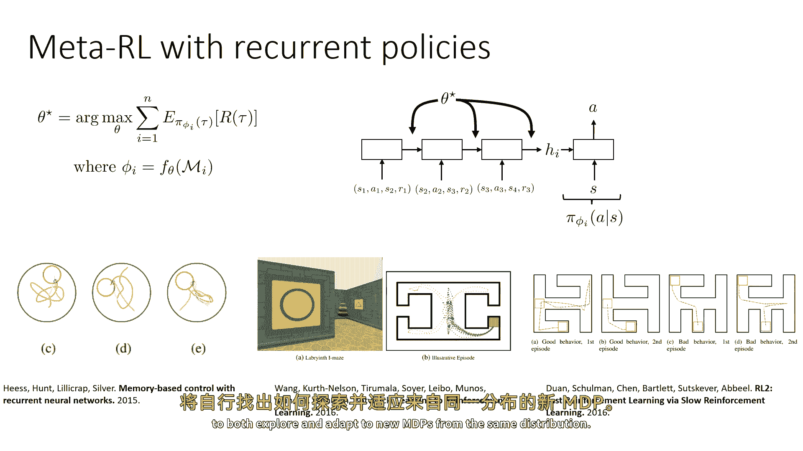
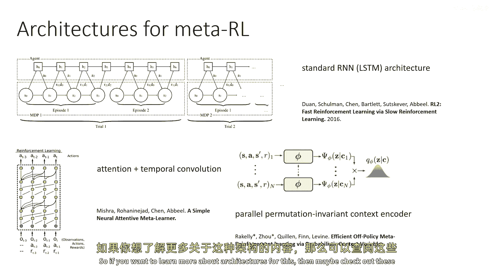

# P93：p93 CS 285： Lecture 22, Part 3： Transfer Learning & Meta-Learning - 加加zero - BV1NjH4eYEyZ

现在好了，让我们谈谈如何将这些元学习理念应用到强化学习中，所以，我们之前有过的通用学习图像是，常规学习，是当你在训练集上取损失函数的论据时，这对应于一种学习函数f learn，它通常是像梯度下降这样的。

通用元学习可以视为在测试集上最小化损失函数，其中进入损失函数的参数由一个学习函数给出，F theta应用到d train，因此，我们可以通过类比将同样的想法应用到强化学习中，我们可以说。

常规强化学习是当你在某种策略下最大化预期奖励时，πθ可以被视为强化学习的学习函数，但是，强化学习不再应用于训练集，它应用到MDP上，好的，因此，强化学习是MDP的函数。

元强化学习然后可以被视为最大化策略的预期奖励，以某些参数φi，其中，参数φi由将学习函数θ应用于MDP得到的学习函数给出，"我 okay"，所以我们只是简单地将同样的定义搬运过来了，嗯。

"进入真实环境"，"所以，元强化学习"，这暗示的是元强化学习将成为一种强化学习过程。"但是它将训练的是这个f theta"，"它本身可以读取MDP并输出某种类型的嗯"，"政策的代表"。

"那么让我们尝试实现这个想法"，所以我们有一个MDP集，这些被称为元训练MDP，"并且为了这能起作用"，我们需要假设这些元训练MDPs来自某种分布p，其中m表示MDPs的维度。"然后到了考试时间。

我们将有一个新的考试。"，"MDP"的中文翻译是"标记决策过程"。"来自同一分布的M测试"，"我们将获取我们的政策参数"，"通过将学习到的功能f theta应用到m个测试中"。

"假设他们来自相同的分布是非常重要的"，"因为就像在监督学习中，只有当训练集和测试集来自相同的分布时，学习才能有效。"，在元学习中，它只有在训练集和测试集来自同一分布时才起作用，所以例如。

不同的MDPs可能对应于机器人执行不同的任务，然后m_test将是机器人学习新任务的过程，或者它可能非常简单，也许它涉及到你作业中的半马赫机器人。

在前后不同的速度下奔跑，然后m_test将是一个新的速度。

元学习和上下文策略非常密切相关，所以，你可以想象一种看待"um"的方式，"元学习是训练策略的问题"，"基于你在测试MDP中所有经验的派他塔"，所以，本质上，f theta 做的事情是。

"这需要测试mdp或地中海mdp的经验"，"无论正在运行的mdp是什么"，"并将其总结为一些摘要统计，然后用于确定你的政策将做什么。"，"那就是基本上等于有一项政策"。

"这依赖于你在mdp中所经历的所有历史"，所以，这个和上下文策略之间的关系是，这个基本上就是一个上下文策略，但是现在，上下文是mdp mi中所有的经验，好的，这可能不是最显而易见的想法，所以。

这将是一个很好，考虑这个想法一段时间是一个很好主意，所以，让我再重复一下左边的程序，新任务phi的参数由运行一些学习程序获得，F theta on mi基本上与部署一个条件于。

测试mdp中所有经验的策略相同，因为那就是f theta真正执行的东西，f theta作为MVP函数的函数，但实际上它是基于你在MDP中收集的经验的函数，所以只要你能把所有这些经验都输入到你的策略中。

那么你就是在进行元学习，也就是说，我们称为z或omega的上下文，或者是类似的东西，嗯，就是我们这里的phi，所以phi基本上就是上下文和上下文策略，主要的区别，当然。

是在当我们在没有提供上下文的情况下谈论多任务学习时，有人会说像，哦，你的工作是洗衣服，你的工作是洗碗，现在，上下文是从我在mi的经验中推断出来的，所以，在元学习中。

多任务学习被赋予的任务是通过推断得出的。

好的，那么让我们试着让这个更加具体一些，让我们尝试实际实现这个想法，实现这个想法基本上等于实现f theta mi，实现一个编码器，它将读取你所有的经验，在mdpmi中告知你的政策如何行动。

那么f theta mi应该做得好，当然，它需要随着mi的经验来改进政策，所以它需要读取那个经验并帮助政策做得更好。

嗯，它也需要选择如何交互，这与监督学习不同，所以在监督元学习中，我们不必处理这个问题，但在元强化学习中，我们还必须聪明地选择如何在mdp mi中探索，如何选择动作，但让我们把那个留到后面。

让我们谈谈第一部分，这将以非常相似的方式工作，就像在监督元学习中，通过经验改进，因此，我们的经验由转换组成，由状态动作组成，下一个状态和奖励，因此，我们可以直接应用监督金属学习的类比。

并简单地设置一种模型，它可以读取我们所有的经验，在mdp mi中，这个最简单的版本仅仅是一个循环神经网络，它读取一个序列的转换，s1 a1 r1 s2 a2 s3 r2 s3，一个三四三等等等等。

我们在这个mdp中经历的所有转换，与依赖于历史的策略相比，这种方式在微妙上有所不同，因为这些转换将跨越期数，所以如果你已经经历过，你知道，五个不同的时期，你将把所有的时期编码在一起，嗯。

然后RNN将以某种形式的隐藏向量来代表这个，那个隐藏的向量将被输入到一个接受状态的策略头中，并产生一个动作，所以这就是一个非常直接的方式来表示f theta，它可以读取所有有关的经验。

并使用这些信息来告知策略应该做什么，然后，当然，参数theta是RNN编码器和策略头末尾的参数，所以像以前一样，phi i只是代表那个小策略头的参数，和RNN的隐藏状态，和RNN的隐藏状态。

在元测试时间，你实际上只在推断一件事，当你适应新的mdp时。

好的，所以这可能看起来有点简单，因为咱们对元学习做了很大的文章，我们引入了很多形式化，但是看起来我们最终得到的只是，我们只需要训练一个rnn政策，这就是我们真的需要做好的全部吗，答案是基本上是的，一。

为了说服自己这是真的，让我们通过一个与这种历史依赖策略类似的元学习小例子来走一遍，假设我们有一只老鼠，它的目标是得到奶酪，在不同的剧集中，奶酪会在不同的地方，或者也许墙壁会在不同的地方。

所以它必须适应不同的多任务策略（MTPs），奶酪和墙壁的位置不同，所以让我们想象在第一步时，老鼠向右走，所以我们给RNN的第一个过渡动作是向右走，并且奖励为零，然后鼠标向左移动，然后我们编码这个然后。

然后一集结束，让我们假设集数只有两步长，好的，所以现在一个新的蓝色集数开始，但我们没有停止rnn，rnn仍然在阅读所有这些经验，现在鼠标向上移动并向右移动，它得到了奶酪，好的，所以现在已经编码了这么多。

内部，RNN应该能够理解奶酪在嗯顶部右上角，所以当新的剧集开始时，记住我们不重置RNN的隐藏状态，所以RNN仍然有这个上下文，它将编码上升的经验，去右并获取加一的经验，所以这里你可以看到。

因为隐藏状态在剧集之间没有重置，RNN实际上可以找出奶酪的位置，你也可以找出如何探索，因为它会以获取最大奖励的方式探索，基于它在mdp中所见的经验。

所以让我们再谈谈探索一些，为什么这种方法能够有效地学习探索，这是我们在适应过程中看到的行动序列，每个颜色代表一个episode，所以之间episode你重置到初始状态。

完整的序列是一种meta episode，所以，一个元集集成了多个不同集的拼接，所以，因为RNN在那个第一个集上没有看到奖励，那么它应该知道是否成功进行了元训练，那么在第二个集上它不应该再次走错。

它应该去其他地方，如果元训练在各种MDPs上进行，那么这些模式将变得对它明显，所以，常规强化学习实际上能够恢复这些种类的探索策略，这是一个小小的技巧，基本上，技巧是一旦你给了政策整个元集，然后。

探索的问题真正变成了解决这种更高级别的mdp的问题，所以然后常规rl，仅仅最大化以这种政策表示形式读取整个元episode的奖励，实际上会解决这个问题。

所以通过rnn政策优化整个元episode的总奖励，实际上最终自动学习到探索，这在mid rl中是一个非常重要的想法。

现在，人们已经以各种方式实现了这个想法。

包括使用actor critic方法，政策梯度方法，和许多其他方法，最近，变压器已经被用作这种表示形式，但是高级原则是一样的，在某种程度上影响你的政策，你与那个mdp的全部经验历史。

它会找出如何同时探索和适应新的mdp的方法。

从相同的分布，当然，当然，有各种各样的架构选择，所以标准的rnn架构只会基本上将所有不同的episode拼接起来，嗯，成为一个长的历史，在中间episode中，也有提议的方法，使用了注意力和时间卷积。

以及并行编码器，我会稍后谈谈这些，以及变压器，所以如果你想了解更多关于这个的架构。

那么可能查看一下这些论文和嗯。