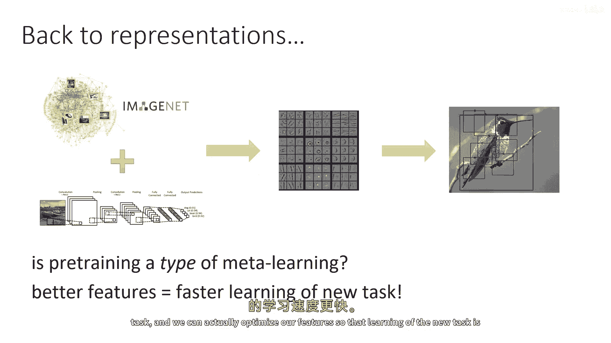
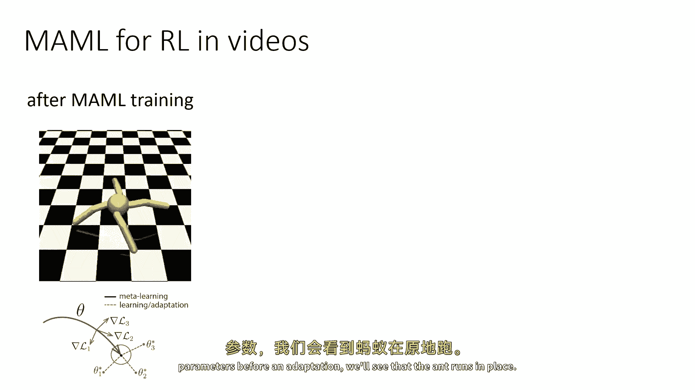
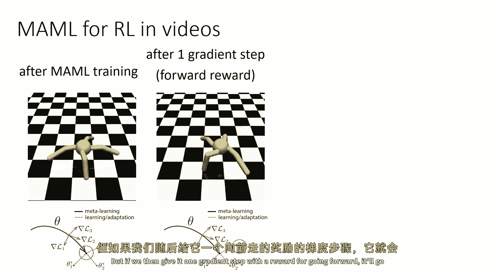
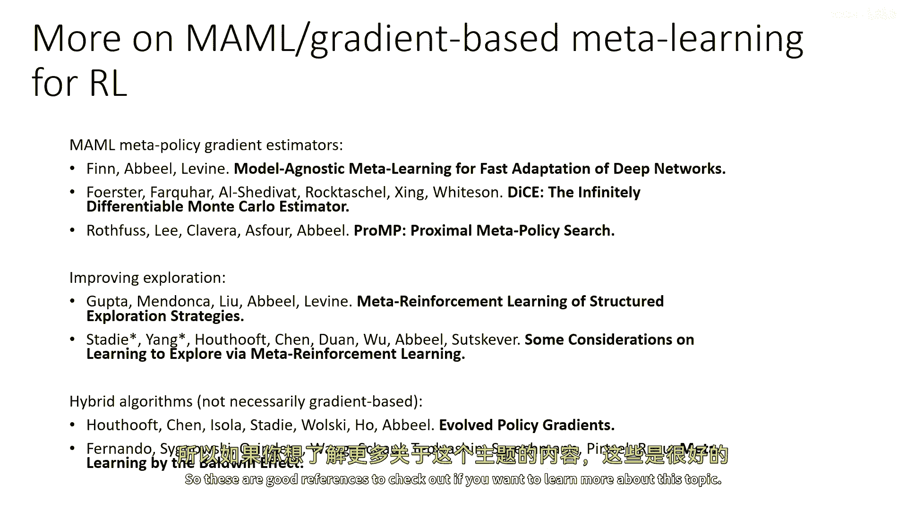

# P94：p94 CS 285： Lecture 22, Part 4： Transfer Learning & Meta-Learning - 加加zero - BV1NjH4eYEyZ

好的，下一个，我要谈谈基于梯度的元学习，强化学习，让我们，稍微回溯一下，想想我们之前讨论过的内容，关于预训练和微调，所以在常规监督学习中，使用预训练的一个非常标准的方式，是简单地学习一些表示。

然后从这些表示中微调为新任务，所以，我们可以问一个问题，预训练和微调是否真的有效，实际上就是一种在某种程度上的金属学习方式，如果那样，我们能否使这变得精确，我们能否以这种方式实际进行元训练。

使得预训练和微调都能很好地工作，这基本上是基于梯度的金属学习的基本思想，如果我们有更好的特征，我们可以更快地学习新的任务，我们可以实际上优化我们的特征，以便新任务的学习更快。

所以，这就是我们如何将这适应的，我们已经开发了一个金属学习框架，所以这就是元学习的观点，嗯，之前的元强化学习，你在那里元训练f theta，为了使此工作。

f theta需要能够使用迄今为止在mdp中看到的经验，以产生此，那么如果f theta本身就是一个rl算法，所以它不是某种只读取所有事件经验的RNN，实际上，它就像一种强化学习算法。

像一种策略评估算法，并且θ的参数化实际上只是策略的初始参数，被输入给它，所以标准rl将取被称为jθ的目标函数，也许我们会做标准rl与策略梯度，所以它将取当前任务，计算j关于参数的梯度，然后更新参数。

所以让我们说θ函数做同样的事情，F_θ(θ) = θ + ∇_ji(θ)，mdp_mi的目标函数，嗯，在θ处评估，所以F_θ等于这个，这是F_θ的定义，这个方程，当然你可以将这个扩展到多个梯度步骤。

但现在让我们只说一个梯度步骤，好的，所以，如果θ更新参数θ为一个梯度步骤，那么是否能找到θ？现在，记住计算j的梯度uh，J_i theta需要与mdpmi交互，实际上，我们可以进行这种优化。

这就是被称为模型无关元学习的方法，所以，模型无关元学习基本上就是一种元学习，其中，f_theta有一个有趣的参数化形式，它与强化学习算法的结构相匹配，或者如果你在做监督学习，它匹配监督学习算法的结构。

基本上，这是一个梯度更新，所以，让我们，想一想，用图片来视觉化，假设你有一个神经网络，它读取状态并输出动作，让我们暂时只考虑政策梯度，以保持简单，而不是在单个任务上进行训练。

并以该任务的政策梯度进行更新，我们将有多种不同的任务，也许对于每个任务，这个蚂蚁都需要在不同的方向运行，然后，对于每个任务，我们将更新政策参数θ，以该任务的θ的梯度进行更新。

在θ加上该任务的θ的梯度处进行评估，所以我们实际上是在优化θ，以便，在任务上应用梯度步时，能够最大化该任务的奖励，所以它是一种二次的东西，找到θ，以便，在任务上应用梯度步时，能够最大化该任务的奖励。

所以它是一种二次的东西，找到θ，以便，在任务上应用梯度步时，能够最大化该任务的奖励，如果你只做一次梯度步，你可以从视觉上这样想，你有一个参数空间，θ，你在那个空间中找到每个任务的最佳解决方案。

θ_one_star，θ_two_star，θ，θ_three_star，等现在是一个梯度步的距离，当然，你不必只做一次梯度步，你可以做多次梯度步，虽然写出代数公式有点麻烦，但是完全可以做到。

计算需要二阶导数，这有点棘手来实施，对于政策梯度，但是完全有可能，所以我会在最后提供一些有参考数学的链接，我不愿意，你知道，对于这个，使用一堵数学墙轰炸是不行的，但是，做那个计算是完全可能的。

这就是基本想法，但是，让我们稍微解包一下这个方法做什么，我们将使用之前讨论过的研究金属学习的同一工具来解包它，监督学习将x映射到y，监督金属学习，将d_train和x映射到y，其中x是测试点模型。

无监督金属学习，至少在监督设置中，也可以被视为d_train和x的函数，只不过函数有一种特殊的结构，所以f_mam将应用于d_train，而x只是f_theta_prime的x。

其中theta_prime是通过取梯度步得到的，所以这使uh清楚，这实际上是另一种计算图，它是对这种的另一种架构，嗯，函数f，尽管它内部包含梯度下降，你可以简单地把那个梯度下降看作是神经网络的一部分。

并且你可以使用自动微分包来实现它，对于策略梯度，稍微复杂一些，对于策略梯度，你需要小心，因为计算策略梯度的二阶导数需要一些小心，并且像tensorflow和pytorch这样的常规自动微分，不能为你做。

但对于监督学习，非常直接，你也可以问，尽管，我们为什么要做这件事，然后，如果这只是另一种架构，而且你之所以可能想做这件事是因为它确实携带一种有利的，归纳偏差，在意义上说。

就象梯度基的方法如策略梯度是良好的学习算法一样，你预期这将导致良好的适应程序，和，实际上，在实际应用中，人们往往会发现与模型相关的一件事，无监督金属学习是，你可以在元测试时取得更多的梯度步骤。

然后你实际上遇到了一个训练集，所以网络倾向于泛化并允许你取得更多的梯度步骤，这不是你使用基于RNN的金属学习者可以做到的，因为使用RNN或Transformer，它只是读取训练集并产生一些答案。

这就是全部，没有更多，没有训练它更长时间在测试任务上的认知，因为学习过程，只有网络的前向传播，所以为了给你一点直觉，在实际中，模型无关的金属学习做什么，嗯，假设我们有这个任务，这是任务分布的任务。

这是为蚂蚁跑前或后的任务，或左或右，如果我们可视化元训练参数政策的话，所以这些是在适应之前参数，我们会看到蚂蚁原地跑。

但如果然后我们给它一个梯度步长，奖励是向前走。

它会向前走，如果我们给它一个梯度步长，奖励是向后走。

那么我们会愉快地向后走，如果你想了解更多关于基于梯度的金属学习，嗯，这些是描述各种政策梯度估计器的论文，这些是谈论如何使用模型无关的金属学习改进探索的论文，这些是几篇描述混合算法的论文。

它们不一定基于梯度，但具有类似的结构，它们在优化初始化方面优化，以便其他优化器可以取得良好进展。

