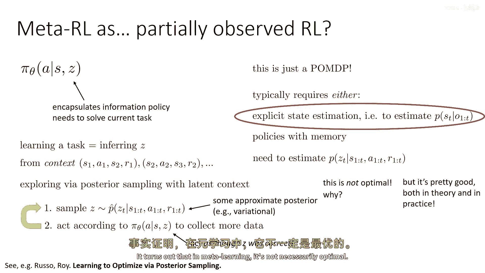
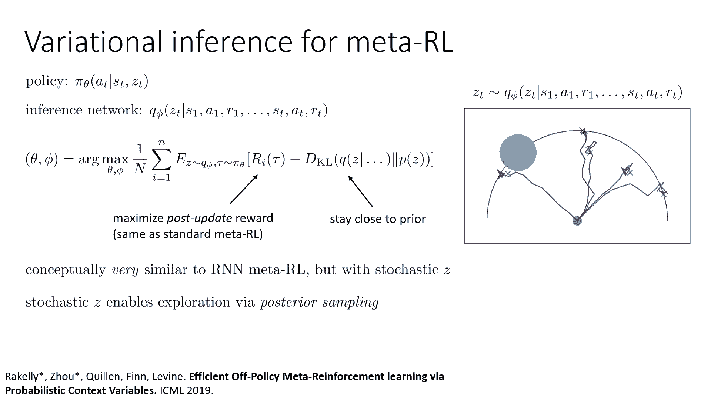
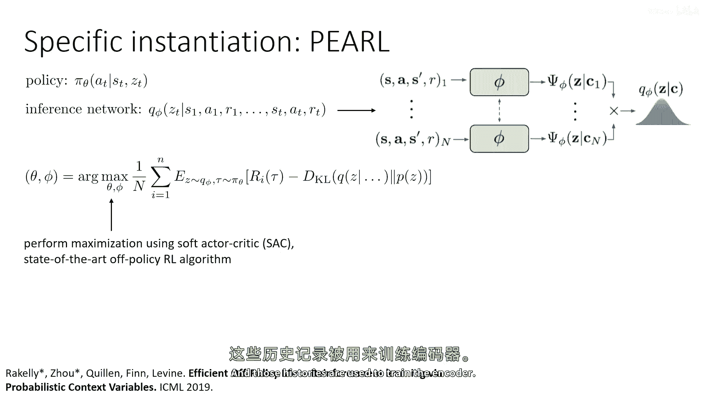
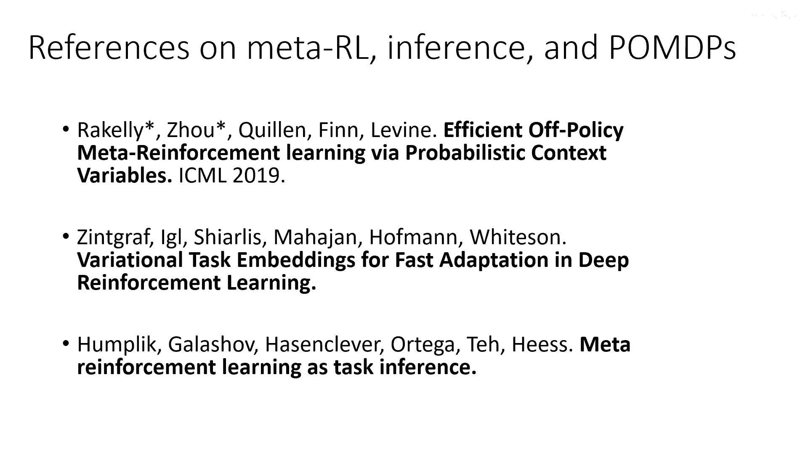
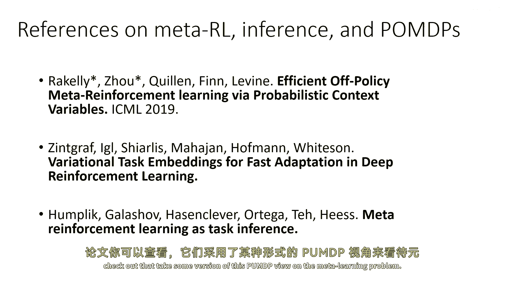
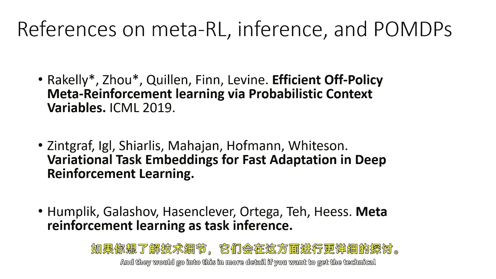
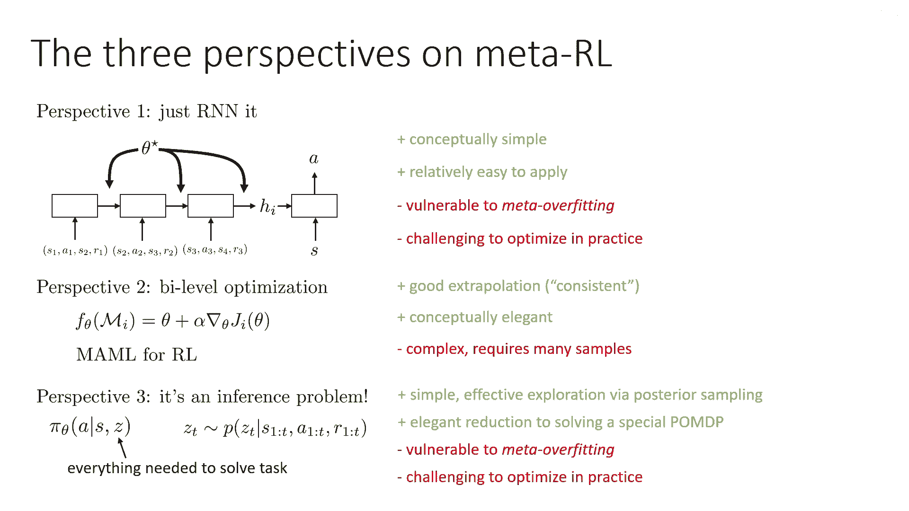
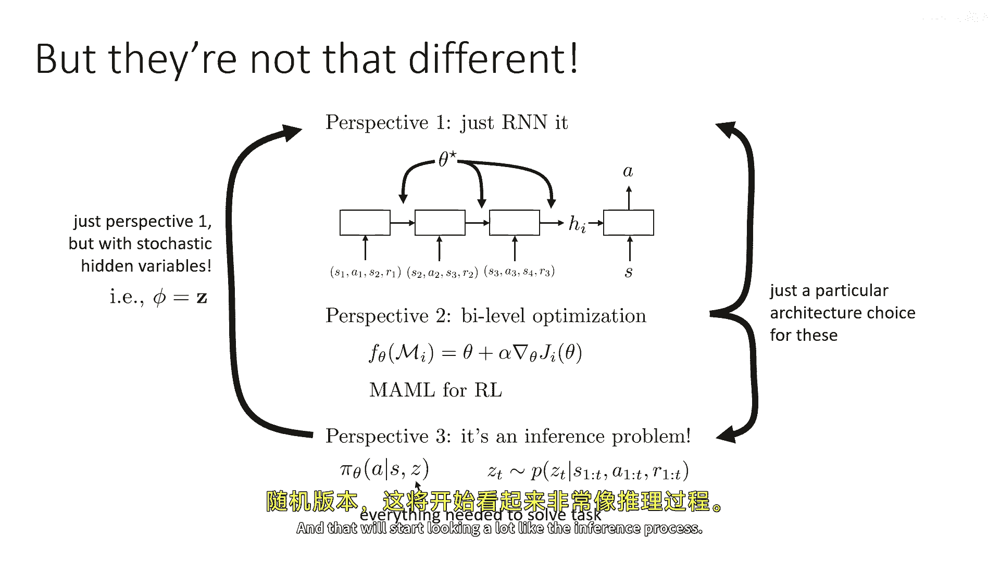
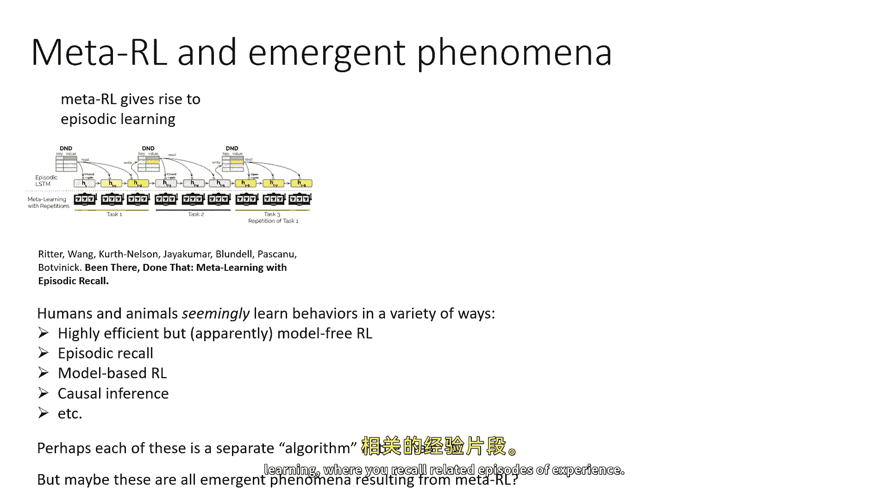
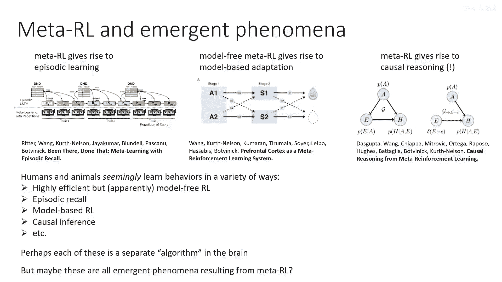

# P95：p95 CS 285： Lecture 22, Part 5： Transfer Learning & Meta-Learning - 加加zero - BV1NjH4eYEyZ

"最后的"，嗯，"元强化学习的讨论将围绕如何进行元"，"Rl实际上可以被视为一个部分观察的马尔科夫决策过程"，"你们中的一些人可能已经猜到了这个"。

"从我关于如何通过条件政策于历史来简单地实现元学习的讨论中"，"但这实际上展示了一些有趣的联系，这将给我们提供一个更好的方法"，"将我们讨论过的不同元学习方法统一起来"，"所以。

一个部分观察的马尔科夫决策过程只是为了提醒所有人"，"是一个具有观察和观察概率的mdp"，除了状态和动作之外，所以它有一个观察空间和接受概率，这是观察到特定观察给定状态的概率。

这是之前部分观察的mdp的图形模型，在部分观察的mdp中，策略必须基于观察行动，这通常需要要么显式的状态估计，意味着一些函数，它将估计给定观察历史或具有记忆的策略的p(st)。

所以让我们假设我们有一个策略pi theta a给定s，z，其中，Z是代表政策需要解决当前任务所需信息的变量，在这个阶段学习任务相当于推断出z是什么，所以回到上下文政策，z可能代表像，哦。

是时候做洗衣服了，是时候做洗碗了，如果你能弄清楚你应该做什么，那么你就能成功地做到它，弄清楚它相当于推断z，在元学习，"你需要从语境中推断出这个，语境是一系列的转变。"，你在新MDP中积累的经验。

"这实际上只是一个部分可观察的马尔科夫决策过程"，所以你有一种你不知道它是什么的z，你需要找出它是什么，"你需要从一系列观察中找出答案"，"一旦你弄清楚了"，"然后。

你可以在你有一个MDP的状态之前完成这项任务。"，"动作a的过渡概率和其他的"，"现在您有一个修改后的部分数据缺失的最有价值球员"，M 带有修改的状态空间，S 带有修改的状态空间。

观察空间 o 带有修改的状态空间和转移，P 带有修改的状态空间，其中，修改的状态空间由原始状态和 z 组成，因此，知道状态意味着知道 s 和知道 z，但当然，你不能观察到 z。

你所观察到的就是 s 以及一般的奖励，所以，关键思想是解决这个泵 dp m 带有修改的状态空间是等价于金属学习的，因为如果你能在这个部分可观察的马尔科夫决策过程中获得非常高的奖励，观察状态在哪里。

但是任务不是，那么从状态的观察中，你就可以解决一个新的任务，并且一般来说，奖励，顺便说一句，我之所以，嗯，省略，我对于奖励被观察的事实有点模糊，是因为你可以总是将奖励拼接起来。

是因为你可以总是将奖励拼接起来，嗯，到达状态，通常这需要，如我之前所说，要么显式状态估计，意味着能够根据观察序列或记忆策略估计p(s_t)，现在，具有记忆的策略，那就是我们之前谈论的RNN金属学习者。

所以，这些都可以视为，嗯，嗯，仅仅是解决Palm DPs的方法，当任务未知，需要从记忆中推断时，但是让我们谈谈PUMDP解决策略的另一个类别，那些执行显式状态估计的。

结果发现这也将导致一种具有某些有趣特性的元学习算法类，所以这些元学习算法将旨在直接估计给定状态历史时z t的p，一个动作的历史和一个奖励的历史，在实际中你并不知道z，z是一种隐变量。

所以我们将以与以前训练隐变量模型类似的方式进行训练，嗯，我们将使用变分推断来获取任务的学习表示，然后一旦我们获得了它，然后我们就可以通过后验采样来探索，使用这一概念的隐含背景，所以。

如果你记得探索讲座中后验采样的讨论，这就相当于从我们的后验信念中采样，然后根据那个信念采取行动，所以我们的采样方式是，我们将实际上随机选择一个z从我们的后验中，然后根据那个z采取行动，这很有道理。

因为最初你并不知道任务是什么，所以你会开始尝试做一些基本的随机任务，当你收集到更多的信息时，你会专注于做正确的任务，程序将涉及从你的历史中采样z，这将使用一些使用变分推断训练的近似后验。

然后根据pi theta行动，给定s，z来收集更多的数据，基本上当作z是正确的行动，然后重复这个过程，元训练将包括训练pi theta和训练你对状态的变分近似，估计器，但这并不是最佳的程序。

这意味着这不是你为探索能做的最好的事情，花一点时间来思考为什么，如果还不清楚，一旦我稍后给出一个例子，这可能会变得更明显，嗯，但在理论和实践中都相当好，所以我们知道后验样本是一个好的探索策略，结果。

在元学习中，它并不总是最佳的。

而且我会很快解释原因，但是首先，让我们谈谈一个这样方法的例子，那样我们就可以更具体地实例化这个，所以，已经提出了一系列技术，这些技术基于这个想法，我今天要谈论的一种叫做珍珠的方法，和。

珍珠训练一个条件于状态的策略，和z，它训练一个推断网络来预测z，基于状态的历史，动作和奖励，整件事情是通过变分推断训练的，与以前我们讨论过的变分推断类似，所以基本上我们最大化预期的奖励值。

在轨迹分布和编码器推断出的z的分布下，我们当然最小化q(z)和先验之间的KL散度，所以这就鼓励z们包含最少的信息，就像在变分自编码器中一样，目标实际上是真正最大化更新后的奖励，意味着甚至更远的奖励。

z与标准元强化学习中的z相同，同时保持与先前的接近，因此，从概念上实际上非常类似于基于RNN的RL，在那里，你读取历史，你预测某种统计，你将该统计传递给您的政策，并最大化给予该统计的政策的奖励。

与这不同的是，您的编码器现在是随机的，并且它推断出这种延迟，您可以通过从编码器中采样来探索，因此，随机z通过后验采样使探索成为可能，所以这里是这个过程的示意图，这也应该能让你清楚，为什么它有些不足。

所以这里我们有一个小型的两点质量物体，目标始终在那个半圆中，蓝色圆圈代表完成此任务的真实目标，哪个在开始时代理人不知道，你可以看到，代理人探索的方式是通过在半圆上随机去地方，然后一旦它击中奖励高的区域。

然后它又会一遍又一遍地去那里，所以这工作得非常好，但是希望这也能清楚地说明为什么这有一点点不够理想，因为，当然，实际上，对于代理来说，可能在一个episode中沿着那个圆圈扫过可能更优，来找到奖励。

然后一遍又一遍地回访奖励，那么这将，当然，工作更好。

好的，所以让我们再谈谈，嗯，程序，我们在实例化时必须做出的一个选择是，这就是我们必须实际上选择编码器的设计，这可能可以通过循环神经网络来完成，但是事实证明，一个非常简单的编码器在这里实际上工作得非常好。

所以一个非常简单的编码器只是简单地将所有转换，状态，动作下一个状态和奖励，特征化它们使用一些特征化器，然后实际上只是平均这些特征，因为它应该足够做这件事，因为转换可以，你知道，可以被视为独立的。

如果你考虑像q学习算法这样的东西，q学习算法不关心转换的顺序，所以这里你的编码器不应该关心它，实际上这是一个非常简单的方法，所以你平均这些特征，然后使用这些来产生z后验的平均值和方差。

在这里的元训练是用离线策略因子进行的，像软necritic这样的批评算法，与一个非常推断的程序非常兼容，嗯，程序，唯一的区别是每次更新时，你都必须更新编码器，你通过从缓冲器加载一些转换来做到这一点。

以及它们的历史，这些历史被用来训练编码器。

因此，从某种意义上说，它实际上非常类似于基于RNN的元学习。

好的，如果你想了解更多关于这个，嗯，这里有几篇你可以查看的论文。

它们采取了某种形式的泵dp视角来处理元学习问题，嗯。

如果你想了解更多细节，他们会深入讨论这个问题，嗯，获取技术细节，但我想以讨论三种视角如何结合结束，我们之前讨论的金属元现实，各种方式都能很好地结合在一起，在所有我们讨论的元现实方法中。

它们可以被表示为某种形式的f(theta)，它接受一个mdp mi作为输入，在现实世界中，这意味着它接受在这个mdp中的经验，并且需要从那经验中改进，并能够选择有效地探索的行动。

我们讨论的第一个视角只是一个黑箱模型，就像一个可以读取整个经验的RNN，然后我们讨论了将其框架为一个基于梯度的金属学习程序，然后，我们讨论了如何也将其框架为一个推断问题，作为一个推断某些上下文的问题。

Z，足够确定任务的上下文，这些东西并不完全不同，RNN从概念上非常简单，它相对容易应用，但它非常容易受到有时被称为元过拟合的影响，意味着嗯，RNN可能不会生成一个非常好的h。

而且基本上没有进一步的解决办法，就像你向前运行RNN，它做它做的事情，你不能在测试任务上进一步改进它，RNN在实际应用中也可能很难优化，尽管最近的序列模型如transformers可以使此稍微更容易。

基于梯度的方法具有良好的外推到期，从你只需要在测试时间继续运行更多的梯度步骤的角度来看，最终你会得到更好的结果，从概念上看，这是非常优雅的，但是，这可能会变得复杂，并且可能需要许多元训练样本。

将这些方法从政策梯度扩展到像演员-批评者方法这样的东西也非常困难，因为我们之前讨论过，时间差学习并不是真正的梯度下降，所以，将基于梯度的元学习应用到这里非常困难，推断方法很简单，嗯。

并提供了一种有效的后采样探索方法，并且可以优雅地减少为解决一种特殊的泵dp问题，但与rnn方法类似，它可能对元过拟合敏感，嗯。

而且优化实践可能稍微有些挑战，但让我们谈谈这些东西实际上如何相似于彼此，推断过程实际上就像rnn过程，但带有随机变量，所以phi基本上等于z，并且基于评分的方法可以实例化为一种或两种方式。

只需要特定的架构选择，实际上，你可以实际上开发出一种模型无关的随机金属学习版本，通过向您的梯度添加噪声，并且那将会开始看起来像推理过程。

所以它们实际上很相似，我想最后留给你们的是几关于我们在自己文献中观察到的有趣观察，所以到目前为止，我谈了很多关于方法的事情，所以我主要谈论了方法，但是，人们已经研究了很多其他的事情。

是如何元强化学习可以导致有趣的涌现现象的，而且这往往发生在强化学习和认知科学的交叉点上，所以观察是这样的，人类和动物似乎以各种方式学习行为，包括高度效率但似乎模型自由的rl，短期回忆。

他们回忆起以前工作过的事情并立即做，和基于模型的rl，当人们研究人类和动物大脑的学习时，看起来所有这些事情都在某个时刻发生，而且大脑如何决定做一件事还是另一件事并不清楚，或者是否运行着不同算法。

所以有一种假设，也许每件事都是某种总体方法的一些涌现特性，这种方法可以学习如何学习，人们已经研究了如何元学习可以导致涌现的学习过程，这些过程与最初用于元学习的过程不同。

所以有论文分析了如何元强化学习可以引发 episodic 学习，其中，你回忆起与经验相关的episode。

模型无关强化学习如何产生基于模型的适应，甚至元强化学习如何产生看起来像因果推理的东西，所以再次，我不会对这些事情详细解释，但如果你想了解更多关于它们。

