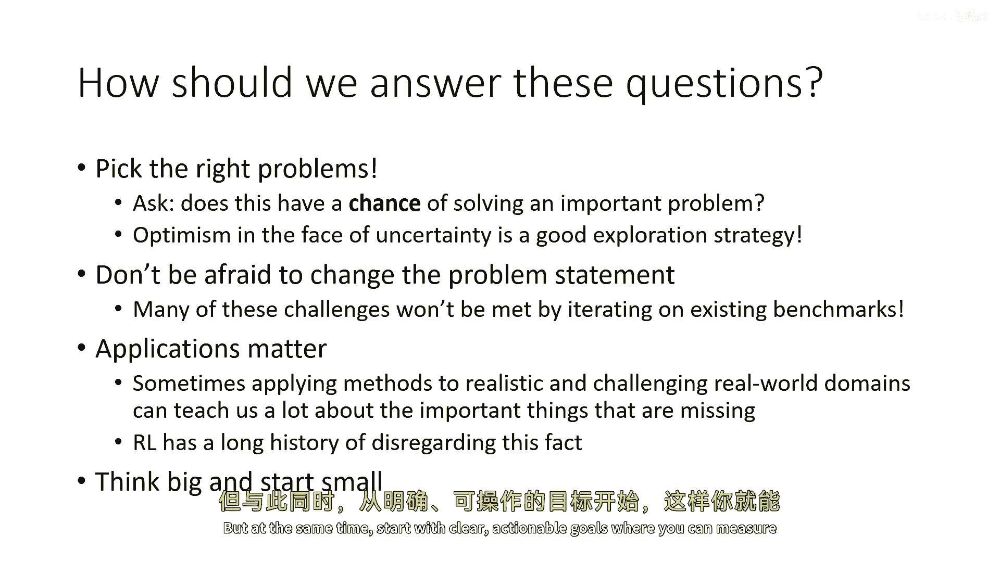

# P97：p97 CS 285： Lecture 23, Part 2： Challenges & Open Problems - 加加zero - BV1NjH4eYEyZ

在接下来的讲座部分，我想提高一个层次，讨论一些关于不同视角的哲学，我们可以讨论深度强化学习实际上到底是什么，我认为这一直是这个课程中隐含的，通过这种方式，我认为我应该明确指出。

强化学习是否真的可以被视为几种非常不同的东西，取决于你如何看待强化学习，一些方法对你来说比其他方法更相关，我将讨论的三个视角，但我相信不止这些，是强化学习在其核心实际上是一个工程工具的视角。

是强化学习是AI代理在现实世界中发现行为的一种方式，然后是我最喜欢的视角，可能是有点奇怪，是强化学习是真正最普遍和基础的学习框架，它包含了所有其他框架，当然，这是我最喜欢的，因为我是强化学习研究者。

所以我将采取最强化学习中心的视角，但我认为讨论其他两个视角非常重要，因为它们可能实际上对你来说更相关，如果你将强化学习视为一种工具，来达成你有的目标，所以让我们从第一个开始，强化学习作为工程工具。

在这个课程的开始，我谈了很多关于有些崇高的哲学理想，关于我们想要普遍学习的方法，这些方法可以获取我们与人类和动物相关联的普遍智能，但现在让我们暂时忘记所有这些，并思考像工程问题一样的事情，你知道。

我们觉得强化学习是代理与世界互动的模型，就像动物通过奖励和惩罚学习一样，也许我们的代理也可以通过奖励和惩罚学习，并有这些非常自然的现实世界学习过程，其中包含了心理学、神经科学和计算机科学的元素。

这很有趣，但让我们考虑一下一些非常实际的，嗯，可以说是日常的工程问题，比如，你可能想要飞火箭，并且想让火箭飞得非常好，沿着最优的轨迹飞行，现在，传统上我们不会将这个问题与强化学习相关联。

我们通常将这个问题与，你知道，复杂的微积分相关联，例如，你可能想要飞火箭，并且想让火箭飞得非常好，沿着最优的轨迹飞行，现在，传统上我们不会将这个问题与强化学习相关联，我们通常将这个问题与，你知道。

复杂的微积分相关联，正确，就像你会写下一堆复杂的方程式，描述你的火箭物理学一样，然后你会解这些方程式，你会得到火箭在每个时间点的解决方案，你会线性化它，你会做所有在线性系统和控制理论中学到的事情。

然后出来的是一个反馈控制器，你会用它来飞那个火箭，这就是我们去月球的方式，这很棒，它与rl无关，然而，我认为从rl的一个角度看，这就是它仅仅为我们提供另一种做这件事的工具吗。

如果我们将传统的控制问题视为仅仅逆转物理的问题，Rl仅仅为我们在工具箱中提供了另一种做 exactly that 的工具，那么我的意思是什么逆转物理，我描述的火箭飞行过程就是这样的。

有人理解系统如何通过时间演化的物理过程吗，写下描述那个物理过程的方程，然后使用那些方程推导出控制法，意味着，一个方程，这描述了火箭应该如何动作和调节其发动机以达到所需的配置，所以你写下物理学，然后。

你将那个物理过程反转，以确定导致所需边界的控制，条件或结果，这极其相似，嗯，到我们所做的事情，嗯，当我们模拟某件事情时，所以ace，通常当我们说运动方程时，我们想象着一个相对更封闭的系统。

在那里我们可以在纸上写下方程，甚至可能解决它们，但是模拟器本质上只是一个非常复杂的版本，我们写下了大量的方程，我们可以数值积分这些方程，以确定一些复杂系统随时间的演化。

飞机翼上的应力和应变如何影响其在空气中的飞行，因此，如果我们在模拟器中运行强化学习，实际上我们在做的事情是我们正在使用机器学习来反转我们的物理模型，所以，而不是与世界互动。

让我们假设我们在与我们对物理学的理解进行互动，这提供了一个非常强大的工程工具，并不是那么不同，嗯，与传统的工程方法相比，所以，在我们会通过写下运动方程来描述我们的系统之前，嗯。

我们会把那个看作是一种模拟器，但是，然后我们会在纸上推导出方程，或者如何控制系统，给定那些方程，现在我们将通过实现模拟器的代码来描述系统，运行那个模拟器，然后使用rl来找出控制法。

rl只是取代了我们以前手动过程的更多部分，在那里，我们将通过做一堆微积分来确定那个火箭的控制器，所以，我们在这里的主要角色实际上是一个更强大的反馈引擎，一种将模拟器转换为控制法的方法，我们以前手动做。

当然，这种观点的主要弱点是，仍然需要有人描述系统，从这个角度看，这甚至算不上一个学习过程，它更多的是一个优化工具，但它是一个非常非常强大的优化工具，而这个非常强大的优化工具已经导致了像，例如。

机器人行为主义，在那里我们有四足机器人可以在崎岖的地形上走得非常有效，通过利用广泛的模拟，我认为总的来说，我们将看到更多的进步在未来，当这种强化学习工具被应用于，为各种控制反向更多的模拟器。

并且我们的方法越来越可靠，越来越有能力，可能在长期内，如果我们想要控制任何系统，像飞机，车辆或行走机器人，如果是我们理解得足够好，以至于可以描述和模拟它，rl将成为标准，去工具来构建对它的控制器。

现在我应该承认，这种视角在某些方面与 uh 的心理学基础有很大的不同，处理这个问题的心理学 RL 根据其更侧重于，作为现实世界中的学习模型，这更多的是一个计算过程，这种方向导致的结果是开发更快的模拟器。

开发可以充分利用广泛模拟的算法，我们可以采取的另一种不同视角，uh 是强化学习作为现实世界中学习工具的视角，这导致一些其他结论，所以 uh，对我来说，一个非常激励的视角是，嗯。

在真实世界中研究rl被称为莫拉克斯悖论，所以，让我们稍微设置一下，嗯，1996年，人工智能取得了一个重大里程碑，这是计算机首次击败世界冠军的国际象棋选手，这是一款叫做深蓝的计算机。

它击败了国际象棋选手加西亚·卡斯帕罗夫，然后，二十年后，又出现了一个重大的人工智能里程碑，这是计算机首次击败人类冠军在围棋游戏中，现在，围棋对AI来说比象棋更加复杂，因为能够掌握象棋的树搜索风格方法。

实际上无法处理围棋，但强化学习方法可以，这太好了，但在这两个图中，我们可以注意到一件事，从这两个，相隔二十年的比赛中，是在两个案例中都没有人工智能在玩游戏，所以。

在两个案例中都有一个其他人坐在棋盘的另一边，来自人类冠军，这个人似乎正在移动棋子，那么电脑在哪里，嗯，电脑在告诉他们如何移动棋子，所以，人类本质上是一个人类机器人，像我们通常认为的那样。

人类控制机器人来告诉操作在这里，是电脑控制人类，这意味着人类只是用于他们的身体移动能力，为什么我们不能让电脑实际上移动棋子，即使电脑能击败人类冠军玩游戏时，这体现了所谓的莫罗克斯悖论，嗯。

莫罗克斯悖论的原始陈述在这里是，嗯，我们都是卓越的奥林匹克运动员，在感知和运动领域，如此优秀，以至于我们使困难的事情看起来容易，抽象思考，虽然它是一项新的技巧，可能还不到一百万年，我们还没有掌握它。

它并不像我们想象的那样难，它只是在我们做的时候看起来如此，让我们解析这个陈述，汉斯·莫拉维克在说什么，这里所说的抽象思考，是你需要成为象棋大师的那种，可能并不难，我们只是不善于它，另一方面。

我们在移动身体和感知世界方面极其出色，因为必须如此，如果我们不善于移动身体和感知世界，我们就会死亡，进化会淘汰我们，并替换我们为其他更能够移动身体和感知世界的生物，所以，也许，移动身体和感知世界。

可能比击败世界冠军在象棋中更难，只是生物学使我们所有人都极其擅长它，因此它感觉毫不费力，史蒂文·平克更简洁地重复了这一点，最近，三号主要教训，五年的人工智能研究表明，困难的问题容易，容易的问题困难。

我们理所当然视为四岁儿童拥有的认知能力，识别面孔，举起铅笔，在房间里行走，回答问题，实际上，解决一些从未构思过的最困难的工程问题，那么这意味着什么，嗯。

可能是获得那些物理能力实际上可能是人工智能问题的更难一端，现在，它的悖论中更多的部分可能会看起来像是关于人工智能在这个中的陈述，比如， literally，它正在说这很难让人工智能做。

这对计算机来说很难做，但实际上，这是一个关于物理宇宙的陈述，所以它在说在我们的物理宇宙中，运动控制和感知是困难的，你可以想象其他可能的宇宙或运动控制或感知，或者，例如，嗯，如果你在玩象棋或驾驶火箭。

在象棋中，没有感知挑战也没有运动控制挑战，一个动作是一个命令，让一个棋子移动到另一个位置，从棋盘上掉下棋子不在象棋游戏的规则之内，那不是象棋世界的一部分，所以那是一个容易的宇宙。

至少在其更多的悖论方面是如此，这并不是说下象棋容易，只是在那个宇宙中，运动控制和感知是容易的，我们居住的是那种困难的宇宙，是混乱的，是有物理的，是有感知的，有许多许多现实世界的多样性和变异性。

也许这就是我们必须在某种方式中学习的东西，那就是人们如何学习到的那样，也许这就是我们通过经验实际需要学习的东西，"因为这些事情对我们来说很难用简单的规则和方程式来写下和描述"。

"那就是真实世界学习的真正动力。"，"也许一个更现实的例子是这个"，"让我们来解决一个复杂的工程问题"，让我们假设，"油轮的获取和起航问题"，"从世界的一端到另一端"，"现在。

这个问题的抽象思考部分就像在海洋中规划一条路线。"，实际上，这对于今天的计算机来说非常容易做，甚至不需要机器学习来做到这一点，例如，使用GPS和基本搜索算法规划路线非常直接，但如果油轮上的某件东西坏了。

如果有人必须下到引擎室去修复某件东西，那么我们当前的AI系统就无法做到这一点，如果你在油轮上有一个船员，他们对于解决意想不到的问题至关重要，他们并非对于实际驾驶油轮至关重要，而且。

真正的关键在于其变化性，你遇到的非常意想不到的情况，使现实世界如此困难，那么这一切都与rl有什么关系呢，也许rl可以回答这个问题，我们如何设计一个可以处理意外的系统。

我声称这个问题实际上是其更多悖论的核心，因为使现实世界如此困难的，是多样性的变异性，以及你训练集之外的意外情况可以随时出现，想象一下罗宾逊·克鲁索的故事，这是一个被困在沙漠岛上的人。

而且使那故事如此引人入胜的是什么，是因为他必须想出所有这些巧妙的想法，以在岛上生存，建造遮蔽所，获取食物，等等想象一个AI代理被放置在那种情况下，它必须即兴发挥并发现解决问题的方法，使用可用的资源。

在手边，在几乎没有外部监督的情况下知道做什么，以及可能需要适应的意外情况，它必须自主地发现解决方案，而且它必须足够长寿以发现它们，所以不像一个整个游戏，你有多个尝试，人类在这方面极其出色。

当然因为我们必须，这就是进化选择的，但我们当前的人工智能系统在这方面非常糟糕，即使是最令人印象深刻的人工智能系统，可以从网上摄入数十亿个文档，并学习回答任何问题，它们无法在沙漠岛上生存。

因为那里你真的必须处理意想不到的情况，仅仅依赖你的训练数据是不够的，我声称原则上，rl实际上可以做到这一点，而且基本上没有什么其他东西可以做，尽管主要是由定义决定的，因为rl是解决这种问题的框架。

就像那样，rl是实时学习去那个世界的框架，体验发生的事情，从做得好或做得差的事情中获取反馈并适应，现在，尽管如此，我们很少在rl研究中研究与这些情况相关的挑战，所以。

简单的宇宙可能看起来像以前的控制问题宇宙，在哪里成功等同于获得高奖励，有一个已知规则的封闭世界，就像围棋游戏，有很多模拟，主要的问题实际上是rl是否能够真正优化得很好。

困难的宇宙是那些成功基本上等同于生存的宇宙，基本上过得还不错，你或者生存下来，或者不生存，这是一个开放世界，所有的一切都来自数据，所以模拟器中不一定预先包含知识，主要的问题是你真的能否概括和适应。

能否处理环境的变化和不可预测性，从奖励反馈中学习原则上应该允许你做到这一点，但它引入了许多挑战，这些挑战超出了我们通常研究的强化学习基准的范围，所以强化学习在这些困难的宇宙中应该非常好。

"但是在现实生活中，会出现一堆问题"，"我想要给你先尝一点"，我们如何告诉我们的关系，我们想让他们做的事情，"现实世界并不一定有得分"，"如果你的反馈是这样的"，你幸存下来吗，"那个反馈太迟了"，因此。

我们需要更多的直接监督，"如何在持续环境中完全自主学习"，所以，真实的世界并不是片段式的，就像一整个游戏，你可以简单地重置世界并再次尝试，在我们周围的环境变化时，我们如何保持坚韧。

以及如何正确地使用经验和先前的数据进行概括，以及如何使用先前的经验来启动探索，所以自从上次讲座，我打算稍微放纵一下自己，并告诉你们一些研究，来自我实验室和我的同事的工作，可能涉及到这些问题的一些方面。

只是想让你对这些问题的真实面貌有一个了解，但我会说我会提供很多与机器人有关的例子，这个挑战不仅仅关于机器人，尽管机器人是我们最容易想到的，因为它们像我们一样具有身体，所以对我们来说想象起来非常直观。

什么是对机器人难还是易，但我认为同样的问题也适用于任何与现实世界交互的系统，无论是管理库存还是写处方，或者如果是互联网上的聊天机器人，这些都是在某种程度上与现实世界环境交互的系统，只不过通过不同的媒介。

而不是必然像我们的身体一样，但我们会讨论机器人，因为它们确实有一点像我们的身体，这可能使它们对我们来说更容易产生共鸣，那么，还有其他实现目标的沟通方式吗，嗯，我之前提到了许多可能性，我想要聚焦的一个是。

嗯，是从偏好中学习的想法，那是近年来，嗯，非常显著的一个概念，所以，这个框架最初是由保罗·克里斯蒂亚诺在2017年开发的，其中，而不是有一个真实的奖励函数，代理实际上向人类展示试验。

并问他们选择哪一个他们更喜欢，人类可以选择不同的试验，并以这种方式引导代理完成某些任务，例如，在这种情况下，为它写一个封闭形式的奖励函数非常困难，嗯，所以这是一个可能使用其他种类监督的算法的例子。

在现实世界中比奖励得分更容易获得的是其他种类的监督，我们如何完全自主学习，嗯，这里有一个例子，关于这个故事，我的嗯，在新西兰的悉尼大学，我有一个前学生，邦迪在控制多指手方面做了一些有趣的工作。

她可以拥有多指手，在这种情况下，使用基于模型的强化学习来做一些酷的事情，比如操纵物体等，但当到了在现实世界中做这件事的时候，为了让手实际练习技能，你需要构建一个完整的单独机器人系统来重置环境。

以便手可以再次尝试，如果手掉了物体，嗯，我们可以想象也许有一些想法可以使这变得更容易，例如，通过将学习问题转化为多任务问题，嗯，这里有一个例子，假设机器人需要很好地制作咖啡，如果它只有一个任务。

或者只是将杯子放入咖啡机，它搞砸了并掉下了杯子，那么可能需要一个人进来将杯子放回原位，这样机器人就可以再试一次，但如果它有第二个任务，那就是拿起杯子，所以现在如果它失败一个任务，它可以做第二个任务。

但本质上那个失败是一个机会来练习新的东西，如果它成功完成任务一，那么它可以有另一个任务，那就是替换杯子，如果它失败在那个并且洒了咖啡，也许那是一个机会来清理洒落的咖啡，所以如果我们同时学习多个任务。

那么每一次失败都可能给我们一个尝试学习新东西的机会，而且这是我们实际上可以尝试的，这里有一个与试图同时学习多个任务的机器人手的实验，现在，这些任务比我所描述的稍微基础一些。

任务包括将这个物体移动到垃圾桶的中心，拿起它，在掌心重新定向它，如果它掉下来，然后尝试再次捡起它，所以这里有这四项任务，将它在手中重新定位，操作，抬起和翻转，以及这个的设计是，这些任务的集合是被选择的。

这样无论机器人出现什么失败，都有其他从失败状态中可以练习的任务，结果是机器人可以完全自动地进行训练，在这种情况下，大约需要六十小时来练习这项任务，现在，另一个挑战，如果我们回到大沙漠岛，例如。

我们可能真的很想让我们的代理能够高效地学习，以至于他们可以实际上生存，这意味着如果他们经历太多的失败，也许只是现实世界的结构会阻止他们继续练习，所以如果他们失败得太严重，如果他们实际上伤害了自己。

也许这不好，所以实际上使用代理可用的先前知识是非常重要的，它可能，它可能不知道在特定环境中会遇到什么，但是，它可以构建起一些先验知识，这些知识应该能够帮助它探索新的设置。

就像鲁滨逊·克鲁索知道如何制作火和避难所一样，等等，尽管在他前进的过程中，他也需要发现很多东西，所以，这里有一个特定的设置，我们可以在这里提供一个这个例子，让我们假设我们想要一个机器人。

它能够学习如何捡起物体并将其放在这个小方块上，我们的想法是，我们需要让它，学习新的任务，也许与它之前从未见过的物体交互，如果对于每个任务我们都从零开始全面探索并随机行动，那么机器人开始时会做类似的事情。

而且事情就像如果你看到这段视频，即使你对机器人应该做什么一无所知，你也会立即知道在这里做的事情是错误的，像这样不是对任何任务的解决方案，所以这里有一个想法是什么。

如果机器人对其他之前已经解决的问题有丰富的经验，并且它利用那个经验来构建一种行为先验，本质上是一种不特定任务的策略，但是它会执行以前有用的随机任务，也许这可以用于启动探索，所以当它被放置在新的环境中。

它将会尝试执行可能有用的随机任务，所以现在，如果你在下方左下角观看此视频，即使机器人，也许它应该做一件非常特定的事情，也许它应该把那个黄色物体，嗯，放在立方体上多次尝试，它没有完成正确的任务。

但它仍在做可能对某些事情有用的事情，而且它似乎像是一种明确的更好探索策略，所以从先前经验中构建探索策略这一概念可能真的很重要，如果你想要真正掌握现实世界的学习，所以这东西似乎起作用。

它做了很多有用的事情，但我想要强调的主要点是，虽然我们想要开展现实世界的学习，并不意味着先前知识不存在，它只是意味着先前知识需要具有适当的类型，所以这真的是先验知识，这不是你实际要做事情的模拟。

它需要获取，也许来自先前的经验，好的，所以所有这些东西看起来都很难，它看起来我们只是在描述其他挑战之后，添加了更多的挑战，所以这有什么意义，为什么这有趣，嗯，这是。

我认为看到智能代理能想出什么样的解决方案真的很激动，而且如果我们只，嗯，最令人兴奋的解决方案是我们并没有真正期待的，而且这要求他们居住在一个足够丰富以容纳新颖解决方案的世界中。

所以这意味着世界必须足够复杂，以看到有趣的涌现行为，我们必须在我们的代理中训练环境，这些环境实际上需要有趣的涌现行为，所以也许如果我们只能被限制使用模拟，就像我之前描述的工程方法一样。

代理几乎没有发现过于不同事物的空间，只会发现我们设计的模拟世界中的事物，所以如果我们可以构建真实的世界学习系统，他们可能会发现非常有趣的新解决方案，他们可能具有适应性和灵活性，这将解决中央挑战。

在更多的悖论中，今天阻碍AI系统在现实世界中部署的最大因素之一，好的，还有一个视角，我想告诉你关于，这可能有点奇怪，但我认为思考它是有趣的，也许我们会给你一些想法，这就是想法。

也许强化学习的真正力量实际上是作为一个更普遍的学习框架，也许它不是我们学习如何与现实世界交互的唯一方式，或学习如何解决控制问题，但它是一种方式，但它可能是最终会吞噬所有机器学习的东西，那么。

为什么深度学习在一些基本的层面上能工作？在非常基本的层面上，监督式深度学习在其最基本层面上表现良好，深度学习工作，因为你可以取一个大型模型，用大量的数据训练，你知道，大量的计算和数据。

这些都是你需要花费大量金钱的，将它与大数据集结合，这通常是一个标记数据集，然后得到能解决有趣问题的东西，就像做一个好聊天机器人，识别语音，分类图像，等等，但如果这就是今天让机器学习工作起来的公式。

那么一切我们能做的，允许我们使用更多数据的事情，都是好事，而且越来越成功的是那种我们看到的食谱，正是因为这个原因，我们有一个小量的数据，实际上告诉模型做什么，然后有大量的未标记的低质量的垃圾数据，例如。

整个互联网，这就是语言模型如何工作的，语言模型已经在网上的大量数据上进行了训练，然后，我们可以通过微调，在他们的一小部分数据上进行调整，甚至通过少数示例提示他们，嗯。

但当我们做这种无监督或弱监督的训练时，模型实际上需要的知识来自哪里呢，它模型数据分布的情况，那就是，例如，当你在做下一个标记符预测时，大语言模型在做什么，你在模型产生数据的过程，并且如果你在学习，例如。

从图像中学习自监督表示，分布是照片被人们拍摄的分布的分布，如果你正在学习互联网上的自然语言文本，你是在学习按钮，人们按下键盘，顺便说一句，这可能是促使大型语言模型这样工作的一种艺术，因为如果你正在学习。

如果你在学习数据的分布，并且数据每周都被标记，你从网络上抓取的垃圾数据，你正在学习一种非常奇怪的分布，也许还有很多为什么，为什么它这么难实现的很多原因，例如，让语言模型做我们想要的事情。

是因为你在做这件事，这基本上是在尝试建模一个低质量的分布，意味着网上的所有东西，你试图迫使它做高质量的事情，所以有没有更好的方法，我要尝试论证的是，rl实际上给我们提供了一个利用低质量数据的更好方法。

所以让我们后退一步，让我们提出一个非常基础的问题，我们为什么需要机器学习，我们可以再退一步，提出一个更基本的问题，我们为什么需要一个大脑，嗯，丹尼尔·沃尔珀特，他是一位研究运动控制的神经科学家，他说过。

他说我们的大脑只有一个原因和一个原因，那就是产生可适应和复杂的运动，运动是我们影响周围世界的唯一途径，我相信理解运动就是理解整个大脑，这可能是一种有些简化的视角，但我认为它是一种非常有效的视角。

计算系统的价值本质上是由其输出决定的，我们可以将同样的逻辑应用到机器学习中，我们可以假设我们只需要机器学习一个原因和一个原因，那就是再次产生可适应和复杂的决策，它有些简化。

但我认为有很好的论据支持这是真的，显然，如果你在控制一个机器人，那个机器人的运动是唯一重要的输出，如果你在驾驶汽车，等等，但实际上也是如此，如果你有一些其他的无体模型，也许你有一个图像分类器。

它在做决定，决定实际上不是图像标签，它涉及到事情发生后会发生什么，你是否在安全摄像头中检测到有人，你和你是否决定叫警察，你是否预测交通，那么这种预测将影响人们驾驶的地方，这反过来在现实生活中有后果。

如果你是一个语言模型，你说话的长期后果跨越多个交互的episode，所以机器学习系统的输出确实本质上是决策，即使它们被训练有监督学习，所以如果机器学习系统真的都是关于做决策的。

也许强化学习给我们提供了一个更好的使用数据来做出更好决策的方法，因为与强化学习，我们可以说，这种我们从所有可用来源中抓取的垃圾数据，实际上在告诉我们在世界上可以做什么，而不是应该做什么，然后。

有限的监督可以指定应该执行的任务，所以然后，我们从过去交互中获取的大数据集，并不一定是我们要学习的东西，我们不会像语言模型那样学习p of x，但是，我们将使用它来理解我们可用的可能性，然后。

在这些可能性中，我们将选择最优化地完成我们想要完成的任务，的选项，这种观点可能稍微有些抽象，所主张的是在rl循环中使用数据，无论是基于模型的rl循环还是离线rl循环，或者是其他东西来支持。

一种决策的基础，然后做出最优化的决策，根据你的数据，什么可能是可能的，如果机器学习都是关于做决策的，这应该比一个，我们在其中运行无监督学习并试图模型整个数据分布的框架更好，问题是，使用朴素的rl。

这是一个昂贵的过程，因为你必须实际与世界互动来收集这个数据，所以也许离线rl或基于模型的rl，或类似的东西可能是这种哲学类型的更好构建块，但在高层次上，食谱可能是这样的：取大量的多样但质量较低的数据。

在上面运行某种像rl一样的过程，无论是学习模型还是学习价值函数还是什么，在那个时候应该真正地是无监督的，可能是人类定义的技能或目标条件化的rl，甚至是无监督技能发现。

并用它来基本上运行无监督学习决策制定，学习如何做出导致特定结果的决策，然后，以一定程度的监督，找出人类实际上想要实现的结果，"在某种程度上"，实际上，我认为我们看到的许多兴奋感。

"带有像聊天这样功能的语言模型"，"Gpt t实际上是因为这个管道的某种版本开始出现"，"我们看到的是人工智能（AI）如何处理实际指定人类偏好的过程。"，"是否提供更有用的代表"。

但我认为还有更多的东西可以解锁，实际上，将rl作为整个训练过程的基本构建块，实际上运行无监督强化学习，嗯，训练以发现如何实现任何结果，然后专攻我们现在实际上想要实现的结果，将这带回现实。

我会告诉你一些可能触及这种原始版本的实验，这里是我们在谷歌几年前做的一个实验，我们运行了目标条件化的强化学习，所以这里没有奖励函数，任务完全由目标图像定义，使用目标图像，所以想法是，我们并不。

为机器人指定图像目标有些笨拙，然后我们可以在顶部基于任务奖励进行微调，这工作好多了，而且它快得多，所以这就像一点像bert，但为机器人，bert进行无监督的文本预训练，在目标上进行预训练，然后微调。

以新的奖励信号快速进行，嗯，我们还可以应用，嗯，Rl两种语言模型，嗯，据我所知，它没有被用作预训练程序，但是作为一个微调程序，它可以工作得非常好，这里有一项最近由，嗯，乔伊洪完成的工作。

他是今年T这个领域的实际参与者，嗯，乔伊想要得到一个更加互动的代理，也许你想要一个教师代理，你不想要它，只是，嗯，给你一个大长段的回应，你想要的是让它实际上与你澄清，你是否理解某些概念。

然后根据这些调整得更少，所以如果用户问我关于行为克隆，也许代理应该说，当然我很乐意解释行为克隆来开始，你能告诉我你是否曾经听说过，人工智能或机器学习之前，所以你看到那个问题将帮助代理调整其解释，当然。

如果你问GPT这个问题，它不会问你很多澄清问题，它只是给你这种墙壁般的文本回复，这是因为这就是它现在正在尝试做的，为什么选择这种更加互动的代理是一个良好的选择，嗯。

原因是一个在大量互联网数据上训练的语言模型，可能实际上是一个非常好的人类行为预测模型，所以如果我们使用看起来更像基于模型的RL的东西，我们可以有一个语言模型基本上模拟可能的人类响应。

然后优化为可能导致对我们有用的响应的问题，基本上将整个事情视为一个POMDP，并优化为使用短问题以快速获取所需信息的更好政策，所以，我们可以这样接近这个问题。

我们可以实际上提示一个语言模型来基本上提供一系列对话，本质上扮演为人类模拟器，生成数据，数据可能不会很好，它可能不实际上教育人类最优化，但它可能显示RL算法人类可能产生的响应类型。

这个巨大的数据集然后可以用于RL来找出更优的行为，嗯，这可能实际上产生一个更好的教学代理，所以RL与语言模型对于那些对于语言模型来说容易模拟，但难以优化执行的任务非常有用，然后使用RL而不是模仿人类。

RL与语言模型对于那些对于语言模型来说容易模拟，但难以优化执行的任务非常有用，所以然后使用RL而不是模仿人类，而不是模仿人类，语言模型可以通过理解人类可能行为的方式，学习实现所需的结果，所以再次。

这是一种使用rl作为反转的方法，但不是模拟器的反转，相反，这是一种语言模型的版本，你可以得到这样的对话，所以这是基础，这是基线，带有嗯，一种被特别要求产生大量澄清问题的chad gpt版本。

所以这是给它最好的可能的机会，你可以看到它有非常详细的回答，这是使用rl训练的代理，你可以看到rl，代理实际上问得非常短，非常定向的问题，我很乐意解释行为克隆来开始，你能告诉我，如果你听说过这个术语。

人工智能或机器学习，那人说是的，我听说过这个术语，但我并不完全清楚他们意味着什么，代理没有任何问题，让我们一步一步来，问，嗯，你是否使用过电脑或智能手机，所以。

这一点是一旦我们开始将这些问题视为决策问题，我们就可以更接近我们想要行为的方式，以一种更加自然的方式，好的，所以这可能是一点点，嗯，你知道，研究，嗯，和嗯，我希望你能容忍我，嗯，在点上，因为这个嗯。

这个嗯，这是我在课堂上的最后一课，但我想在最后结束时将这一点带回更大的背景下，我们实际上在第一次讲座中提到的一些更大的背景，在第一次讲座中，我们讨论了学习可能是智能的基础，如果那是真的。

那么也许深度rl应该是这一事实的核心，因为强化学习允许我们推理决策，在深度部分，我们的算法可以学习复杂的输入输出映射，因此，也许深度模型是允许强化学习解决复杂问题的端到端方法，如果这是真的，那么。

缺少的是什么呢，我认为有一个观点非常有趣，我自己并不完全同意这个观点，但我认为值得一提，这是一个教授颜立坤经常提到的观点，已经被称为颜拉库恩的斗篷，他在那里谈论的是在高层次上，嗯。

你可以通过每个数据点从它们得到的监督位来描述不同学习问题的有效性，来衡量，所以想法是，如果你在学习一个图像分类器，假设你有一千个类别，对数一千是十，所以你实际上为每个数据点获得了十位监督。

如果你在做无监督学习，例如，预测视频序列中的下一张图像，那么有很多很多像素，所以每个数据点都有大量的监督，如果你在做rl，那么也许你是从相对稀疏的奖励中学习的，所以你没有得到太多的监督。

这是为一种基本且无监督的学习方法提出的论据，利用大量数据，通过强化学习作为机制，使用这种模型适应解决特定任务，但这使我们开始思考，强化学习在何种类型的，在这个更大的问题中。

如何构建智能系统的问题上的角色是什么，所以狐狸的蛋糕将是一个论据，像基于模型的学习或基于模型的强化学习这样的东西应该真的很重要，而rl是一种机制，然后专门化那些系统来实现一个目标，但是还有其他的视角。

例如，嗯，也许很多学习信号都应该来自模仿，理解其他代理，人类是社会动物，并且我们有文化，你可以争辩说，一个在没有其他人类周围长大的人类，也没有任何文化的人可能实际上并不是多么聪明，一。

所以也许实际上模仿对于这个一般目的的人工智能系统的总体愿景来说更为核心，但我认为还有一个非常合理的观点，也是非常可辩护的，实际上，也许强化学习就足够了，因为，尽管在强化学习中。

你是从相对稀疏的奖励信号中学习的，那个奖励信号被一个非常复杂的系统动态所调节，所以对于像价值函数这样的东西的监督，比仅仅预测奖励是否为一或零要复杂得多，因为当动态与那个奖励信号相互作用时。

它以非常复杂的方式调节，你可以总是运行多任务学习和其他能够给你提供更多监督的事情，即使使用标准的rl方法，而且可能真正的答案是上述几种方法的组合，在他们有助于实现期望结果的最佳决策方面。

也许我们需要模仿交互的元素，嗯，以得到这个，我不知道答案是什么，我有自己关于，更可能的，但是，我认为我想要让你们思考的高级位是，这些问题实际上重要吗，如果我们要探索强化学习作为一种强大的通用目的工具。

那么思考这些可能性是有帮助的，那么我们应该如何回答这些问题，嗯，我们需要选择正确的问题来工作，也许在这里，问自己这个问题非常重要，如果你在选择研究问题，它有可能解决一些真正重要的问题吗。

所以专注于研究问题，在哪里成功的上限真的很高，考虑更大的哲学视角，然后试着把它缩小到具体的，可操作的事情，可证伪的假设，在哪里你可以衡量你的成功，但是可能是通往大问题的合理路径，在面对不确定性时。

最佳的乐观主义是一种伟大的策略，这不仅适用于探索嵌入的问题，也适用于研究，不要害怕改变问题陈述，许多这些挑战都将通过迭代现有的基准来解决，也许古典rl的这些标准假设不足以回答这些问题。

我们需要改变一些东西，这是完全可以的，最后，应用很重要，有时，将方法应用于现实和具有挑战性的现实世界领域，能教给我们很多关于缺失的重要事物的知识，我们需要严肃对待它们。

所以不要害怕专注于更多的应用性事物，因为这可能实际上揭示哪些问题是更重要的，哪些解决方案是更有希望的，我有一个长期忽视这个事实的历史，并专注于过于简单的任务，不要走进同样的陷阱，最后，想大。

但先从小开始，思考大图景的问题，不要害怕有雄心壮志，并思考什么真正能让我们开发出真正强大的，人工智能系统，完成人们以前认为不可能的事情，但同时，从明确的。

