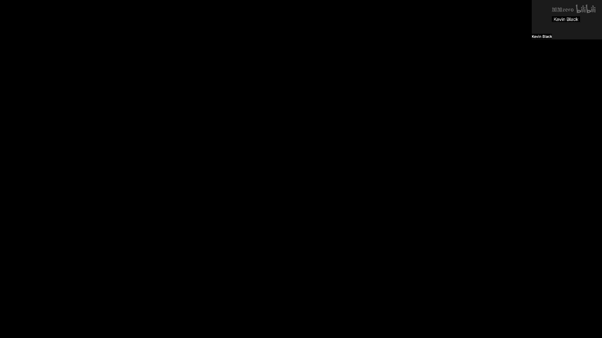
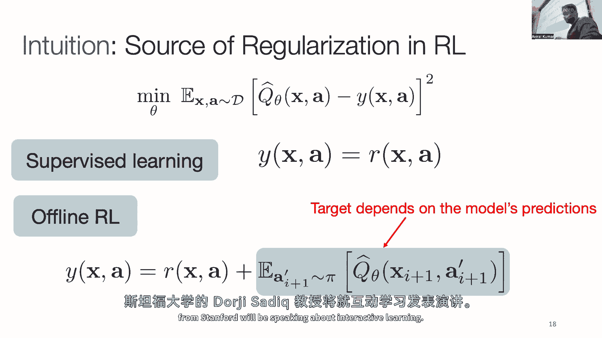

# P98：p98 CS 285： Guest Lecture： Aviral Kumar - 加加zero - BV1NjH4eYEyZ

他在来到我们这里在加州大学伯克利之前，实际上，我们离线讨论过的很多材料，"Rl的讲座是由一部分由l完成的工作。"，"而且，我们现实生活的所有材料也差不多。"，"理论课程只是我从已经制作的讲座中复制的"。

所以他对这门课做出了很大的贡献，"今天他将告诉我们关于预训练和大型模型离线利用的知识"，"Rl"在中文中通常被翻译为"日"或"里"，具体含义取决于上下文。谢谢，嗯，是的。

所以今天我要和你们谈谈欺骗强化学习，预训练学习和利用大型模型的学习，这些都是大型模型，不是在NLP或语言的上下文中，但是嗯，对于机器人，许多决策问题在未来的线中，所以嗯，所以你知道你。

你们所有人都学过离线强化学习，我认为现在有两堂关于这门课程的讲座，"关于离线模式的想法是简单的"，"你想要不想要"，"你不想通过在线试错和与环境的互动来学习"，"但是。

不如利用现有的交互数据来学习可以最大化奖励的政策"，"所以这就是标准范式"，"你研究了许多用于做这种模型基算法的方法"，"Q学习等等"，"但我不会去那些算法这里"。

"但这是所有那些算法现在试图遵循的通用范式"，"嗯，这种让我想起了什么"，"嗯，当我想到这个的时候"，"是否是使用一些训练数据来构建标准机器学习管道？"，在这种情况下。

是通过离线数据训练模型在这个数据上的。"然后，将此模型部署到实际任务中"，"所以这就是这种离线模式的范例"，我向标准或典型的机器学习方法发表讲话，"管道数据模型"，"用一些目标和部署一个来训练它"。

但是如果你仔细观察，嗯，我们现在在机器学习中做些什么，嗯，越来越流行，越来越被广泛利用的是，存在一个稍微不同的范式，这里的情况变化很大，不再直接从数据中，数据到，嗯，而是使用数据来训练模型。

然后部署模型，你现在想要执行一个被称为预训练的任务，这将需要大量的数据，这可能与你的下游任务关系不大，但你想在所有这些数据中训练一个通用模型，然后当涉及到使用此模型时，我们希望运行此模型。

而不是直接在现实世界中，也不是直接在你的实际问题中，但我们想要微调此模型到我们关心的下游任务，所以我们想要学习通用模型，所以每次训练，然后利用这些通用模型，为什么在下游任务上进行某种微调。

你知道这个经典的例子就是大型语言模型，你知道所有的基础模型，所以今天我想讨论的是，嗯，你知道如何可以移动到一个类似的范式，当你考虑离线，或者当你考虑决策问题，如何让离线报告和学习。

给你一种实现这种决策范式的方式，并控制任务类型，所以现在我想要做的，不是离开从现有数据中提取并产生最大化奖励的政策的模式，而是考虑离线，作为这种其他范式，它应该接受，不仅你被给的任务数据。

而且还所有可能与你问题相关的数据，所以这可能包括你知道的，任何种类的 uh，存在于那里的机器人数据，存在于那里的任何一种游戏玩法，来自医院的任何一种数据，用于医院决策问题，等等。

所以现在把所有的数据放在一起，你现在不再只是产生能够最大化奖励的好政策，而是好的，预训练的初始化，好的特征，好的表示，好，你想到的任何东西，对于现在来说有用的，下游的微调，你关心的。

所以我想在这次演讲中谈论的是，你怎么能实现这样的管道，你怎么能思考离线艺术方法，以及如何扩展你在这门课上学到的所有食谱，要在我的图片上启用类似的功能，而不是那个关于什么的图片，所以更具体地说，那就是。

你知道我们可以，嗯，对这个进行分解，这种高层次的，分成三个不同的部分，嗯，为了激励这三个不同的部分，我们查看什么，嗯，嗯，这张图中的不同组件看起来像什么，如果我想要从这个数据采集的图片转移到第二个图片。

在这个数据上训练模型，然后产生流向第二个图片的下游策略，我的第一个组件像什么，嗯，能够从任意数据源中学习，如果我想要实现这个图片，我不仅想要针对我的任务的数据，还要任意的数据源，我会尝试。

我们今天讨论的一个具体实例是使用人类视频数据进行机器人学的设置，如果我想要杀死一个机器人，但我不想仅仅使用机器人数据，但是大量的基于互联网的视频数据，我怎么能用它来学习好的策略，我会谈论这个。

我还会谈到扩展，你知道，当有数据越来越多时，我们想要更大的模型，那么如何能使这些离线强化学习方法保持活力，能够训练大型模型，所以我会讨论一些东西，沿着这个轴线，我还会谈到，嗯一些，嗯。

最初的一些你做的工作，嗯，嗯，在建立微调算法方面，即允许我们使用一般初始化的算法，然后嗯，你知道，用有限的数据对你的下游问题进行训练，嗯，使你的初始化在这个你关心的任务上越来越好，所以数据。

关于缩放和算法，我们今天讨论的三个主题是这些，所以让我们开始，嗯我是，我决定稍微改变一下顺序，所以我首先从缩放开始，然后我们将讨论数据并找到一种缩放方式，对，嗯，所以嗯，如果你看强化学习的缩放，嗯。

这里有我从同一篇论文中复制的大量内容，到这一点已经超级超级老了，这些都是所有这些，所有这些点上的点，这些在当时是存在的，是当时强化学习社区的前沿技术，当辛西娅的论文发布时，当时的状态是这样的。

如果你看强化学习社区的大部分工作，嗯，他们通常训练的模型都非常小，他们训练的模型，都位于这个灰色小盒子中，在这个图上的上方，这个特定的盒子，我今天要讨论的是嗯，你知道，显然不是革命性的，它不，你知道。

不能把这个盒子从这里移动到掌握模型的那里，但它确实允许我们从，嗯，我们当时在RL社区拥有的任何东西，到更大的模型，模型的大小是原来的两倍，记住，这一切都是在，没有太多计算资源的情况下完成的。

所以我们显然没有电脑来训练，非常非常大的模型，但这比当时存在的任何方法都要好，嗯，当我们在做这项工作时，所以嗯，在进入技术内容之前，我会快速设置一些符号，然后我们将讨论，技术内容，所以记住，在这里。

我们正在处理这个离线数据集，这个交互数据的集合已经存在，嗯，我们假设数据由四元组组成，所以，在这里，四个元素是你学习算法可见的观察或状态，AI是行为政策采取的行动，在你的FX Idea数据集中。

数据连接政策是你的即时奖励值，所以，这在你的数据集中代表特定过渡的奖励值，并且x i + 1是下一个观察或下一个状态，嗯，这是在你执行这个动作的特定状态下获得的，X次。

所以这就是在典型的回放缓冲器中存在的过渡期，而在基于策略的Q学习算法中不存在的，所以我们有一个以这些过渡工具组织形式的数据集，Xi，A，I，R，和Xi，好的，所以回到扩大规模，所以开始激励。

为什么或者你知道，甚至什么，嗯，在扩大规模中应该做的事情是，我应该只是添加更多的数据，并使用更大的模型和方法，这种方法将能够理解，如果这么简单就能工作，我们做的就是，我们尝试运行一个简单的实验，嗯。

我们说，好的，而不是做标准的AR游戏领域，我相信你们肯定在作业中做过，而是，训练，嗯，一个单一目标游戏的策略，如果我们尝试仅仅使问题更加复杂，以至于需要更大的模型才能有效地执行。

我们现在已经使问题变得更加复杂，而不是在一个游戏中训练一个单一的策略，我们今天携带一个单一的策略来玩多个游戏，所以这只是一个简单的，就像，你知道，婴儿步，对问题规模的扩大的即时实例，嗯。

仅仅试图将一种政策应用于一起玩多种游戏，实际上会给你带来，嗯，现在这种感觉实际上会给你，你嗯，带来相当程度的复杂性，所以你现在需要一个可以处理，或者可以训练在大约200亿数据点上的方法。

因为你可以拼接所有存在于每个游戏数据集中的数据集，并且你很容易得到200亿数据点，而且所有这些数据都非常不完美，所以你想要能够将这个数据转化为一个好的政策和一个更好的政策。

希望你能从这个数据中看到比任何你看到的都好的结果，所以这是一个具有挑战性的问题，结果如果你处理这个问题，嗯并且比较一些非常基础的强化学习和控制方法。

你会发现当你简单地进行模仿学习或过滤后的模仿学习侧方法时，实际上你获得的好处相当大，当你扩大你的模型时，所以这张图在绘制，当你从一个较小的模型切换到一个更大的模型时发生的性能提升，对于学习算法和蓝色。

嗯，在这里你看到的蓝色条是一个基于模仿的超级学习风格，但是嗯，你看当你从一个小的模型过渡到一个大模型时，性能有巨大的提升，嗯，在这个特定的方法中，模仿学习风格的方法，但如果你从货架上取下离线。

或者在这种情况下它是Q学习，嗯，我没有在这里放方程式，但是嗯，因为我我知道你们已经在课堂上覆盖了这个，实际上，使用离线方法时，由于扩大模型容量的结果，性能增加的量相当低，实际上，如果你这样做很多。

当你使用更大的模型时，你的性能可能会开始下降，对于对细节感兴趣的你们来说，这里的模型细节基本上从较小的resnet变为较大的resnet，因为嗯，这些游戏需要你识别像素图像并转换为离散动作。

所以你可以使用resnet架构，在这种情况下，这一点非常清楚，嗯，你知道的，在这里可见的是训练算法的性能，或者你获得的策略的性能开始下降，当你为离线rl方法扩大模型容量时。

而仅使用模仿学习方法并不像你看到的那样，所以所以嗯，这是一种反直觉的发现，我们并不知道该怎么做，嗯，所以我们尝试问一些基本的问题，可以帮助我们理解，为什么监督学习方法可以很好地扩展，但其他方法可能无法。

所以特别是，嗯，你知道，而不是考虑像绝对原因一样，离线或离线方法与大型模型一起工作可能很困难，我们试图理解监督学习方法为何可以扩展，但离线方法可能在扩展方面表现不佳，因此，我们试图提供竞争性答案，希望。

好的，如果你能理解这个差异的存在，我们可能，在某种程度上补偿我们学习算法中的差异，当我们，运行这些离线算法，所以如果你看到，嗯一个理论机器学习的行，嗯，嗯，数据内在维度的参数数量，那就是。

他们提出了一个解释为什么，使用非常庞大的模型，具有非常庞大或非常过度，参数化的模型可能具有许多，许多更多的参数，"即使在这样的情况下，为什么"，"监督学习方法可以工作得非常好"，"这就是啊"。

"这个被称为隐式正则化的理论"，所以嗯，这个想法就像是如果你正在使用监督学习来训练一个模型，那么这个模型的名字叫做，"让我们假设模型有参数theta"，"并且你在最小化一些损失函数l theta"。

"并且这里最大的假设是theta非常非常大"，所以你有许多许多更多的参数，意思是你有一个非常大的模式，并且你使用自己的数据来训练这个模式结果发现如果你这样做，嗯，在监督学习中，特别是随机梯度下降。

你会发现你最终找到的不仅仅是损失的最小化，和 theta，而是这个损失的规范化版本的最小化，所以你最终找到的是使 l theta 加这个 r theta 最小化的解决方案。

而这个 r theta 不是你在训练时添加的，但它只是，嗯，嗯，被称为隐含正则化的是什么，所以，因为这个学习过程，出现的正则化是，随机梯度下降最终倾向于某些解决方案，嗯，在你的参数景观中，所以。

你可以这样想，有许多可能的解决方案，你的学习可以收敛到，但你最终找到的最小化这个正则化的解决方案，因为在这个情况下，你的优化器SGD最终找到那些比其他可能解决方案更好的解决方案，嗯，一种像样的，你知道。

隐含正则化项的直观描述是，嗯，嗯，嗯，它是一种对简单句子的偏好，所以，如果你有一个极其巨大的，嗯，极其超参数化的线性回归问题，让我们假设它是一个监督学习问题，会发生什么，通常。

你会找到参数值低的解决方案，不是参数值的范数低，你训练的线性回归参数，这就是隐含正则化现象的一个例子，你找到的解决方案在某种程度上是简单的，这些简单的解决方案往往泛化得很好。

尽管你的训练中有很多很多参数，嗯，你知道，你知道，在你的模型中，所以，这就是为什么你可以在监督学习中仍然找到好解决方案的原因，即使你有一个非常大的模式，而没有过拟合，没有遇到任何其他偶然的问题。

因为隐含正则化最终找到了一个好的解决方案，嗯，我意识到这可能不是这门课程覆盖的内容，所以，任何解决方案和问题在这里实际上，好的，嗯，太好了，嗯，所以，是的，所以，有一个答案解释了为什么，嗯，你知道。

监督学习方法可以与大型模型一起工作得很好，这是因为隐含正则化现象，嗯，最终倾向于性能良好的解决方案，我们在这个领域的工作中尝试做的，是现在回溯一下，并且看看这个案例对于离线强化学习的案例意味着什么。

所以，我希望我之前所说的是，如果你能找出离线随机和实际执行之间的差异，监督学习，我们可以希望解决这个问题，嗯嗯，通过离线rl景观设计，嗯，通过从使大型模型工作得很好的监督学习中获取见解，所以嗯。

我们做的是，我们嗯，尝试理论上推导出这个隐含正则化器看起来像什么，对于离线向上的情况，特别是在考虑这些方法，嗯，在这个情况下训练q函数，所以，你有一个产生几个函数作为输出的网络，输入为，状态和动作，嗯。

一个标记，我将定义，嗯，在这里，我将考虑这个网络的倒数第二个特征，但是这个网络的倒数第二个层激活，嗯，作为x k的phi beta，所以，它们是你不需要的特征，这有点像，也许有些。

我希望你也可以以不同的方式定义特征，但是，为了今天的讨论的简单理解，让我们专注于这个定义，让我们坚持这个定义，就像我们将要称呼的那样，因此，我们发现在强化学习的情况下，存在一个，存在一个。

在监督目标和q学习目标之间存在一个重大差异，这导致了这种正则化的差异非常大，稳定性效果的差异也非常大，嗯，在强化学习和监督学习中表现出不同的形式，并试图理解这来自哪里，嗯，差异的来源。

我在这里写几个数学方程式，你将网络的几个函数带到那里，并试图将其回归到一些目标值，为什么这些是你的对手的目标值在监督学习中，这，嗯，你知道这个，这些目标值只是常数对吧。

它们就像想象一个回归问题只是回归到一些常数值一样，让我们说，在这个情况下它就是给定问题的奖励，但对于q学习或者离线，Rl，这些值实际上是用你之前的一个q函数的副本计算的，那就是你在那里训练的，那个。

在等式左边的，嗯，或者是在那个目标中关于那个的，所以从某种程度上说，你的目标值也取决于你正在训练的q函数，而你正在训练的q函数会影响后续的目标值，创建一个循环，这将，这将。

使事情与监督学习的学习动态大相径庭，因为在那里你试图请求固定的目标，由于这种差异，实际上，一，如果你写下来，如果你计算出我提到的正则化项，它在Q学习或在线学习中的结果会非常不同，而且只是标准的监督学习。

所以对于标准的监督学习，一个例子，嗯，你知道，在特定的建模假设下，你可以证明正则化器最终会倾向于具有低范数的解决方案，具有低特征范数，所以，你的正则化器是，嗯，是一种函数，惩罚的。

未来向量的范数是y theta的那个，嗯，这实际上是好的，因为如果你考虑像权重衰减这样的东西，嗯，你知道它们非常相似在动机上，这有点像权重衰减，但不是在权重上，而是在未来上，另一方面对于离线。

我不知道你有一个更复杂的正则化器，嗯，特别是有像两个术语，稍后会出现，但合成器并不等同于监督学习，而且原因是因为这个回归到目标值，所以第一个术语，嗯，对于这个正则化的一部分，实际上是相同的。

这是一个试图惩罚特征规范的术语，你所说的，所以，在某些方面，这是个好术语，因为你知道你在尝试以低特征学习，你不试图过拟合并使你的基础变得奇怪，到你的数据，但现在这个第二个术语，嗯，实际上是一个术语，嗯。

嗯，如果你，如果你仔细看一下，它看起来像是phi theta和x i的点积，这是你当前步骤的状态，你为什么在x i加上一，这是你下一个步骤的状态，所以它是一种 kind of，嗯。

Uh 组合了给定状态动作x，逗号x'的特征，或者下一个状态，在这个情况下，x的i+1，如果你想一想，Uh，通过推导并不在这里，如果你想一想，这就是为什么，Uh，这就是你从目标值如东西中可以得到的东西。

因为目标值在你的q函数下有x i加权一，而那里的q theta x a，并且你当前的状态和批次的目标很好，所以这就是为什么这个术语来自这种归纳的，但现在如果你看看这个术语做什么，它实际上是一个术语，嗯。

看起来像一个向量点积，五英尺的x i向量点积，I，并且x的phi，我加上一个再加上这个再加上你有一个负号在前面的嗯，记住如果你，嗯，如果你记得之前的方程，嗯在这里你试图最小化正则化项当你写。

当你对这个损失运行svd，所以这里你将试图最小化正则化项，用那个正则化项最小化，嗯，这对第二个术语意味着什么，基本上意味着我将最大化第二个术语，因为第二个术语前面有一个负号，这意味着什么。

这基本上意味着我将最大化特征在x i处的点积，我加上x i加上一加上一，这意味着我将实际上尝试增加这些向量的长度，因为增加两个向量的长度是容易最大化点积的方法，如果向量没有边界，所以从某种意义上说。

第二个术语在某种程度上与第一步相冲突，在第一步中，试图减少特征的 magnitude，在第二步中，试图增加那些特征的 magnitude，在这种情况下，你知道，因为x i比x i长五英尺，出现在什么中。

在这种情况下的术语中，所以，有这个无规整化器，会发生一些明显的差异，与监督学习正则化器相比，你看到的上面，嗯，这里有问题吗，我想我已经口头做了很多推导，有任何问题吗，是的。

这是否等于隐含正则化大约等于什么，还是这实际上是被授予的，那是一个好问题，你应该阅读论文，嗯，它实际上比嗯，所以，它，记住，我们这里处理的是一个随机的粒度，有一种感觉，但这不是，你不能写下精确的。

但你可以说，总体的声明化效果是一个围绕，嗯，您将得到的解决方案，如果您去最小化那个，如果那个银行依赖于，嗯，但是，你知道，那个，那个银行的体积取决于学习率，以及像颜色这样的东西，嗯，那决定了，但是，不。

谢谢，是的，好的，嗯，太好了，所以，嗯，这个想法的基本上是你知道的，这个岛上有两个术语，其中一个术语与通过监督学习获得的学习相冲突，如果只有一个术语是这样的，好的，如果这就是正在发生的事情，嗯，你知道。

而且我们有明确的理由看到，好的，监督学习实际上，并不是那么有害，因为监督学习方法确实看到，而在我们发现这些方法时，至少是医疗的，它们确定这些方法没有扩展，那么我们能做什么。

所以我们采取了一种非常实证的方法在这里，而且这不是这个部分，实际上我不能可能展示，但是实证方法非常简单，它说，但如果第二个术语是ADL中唯一的其他术语，不在监督学习中。

并且以某种方式与RL看不到的事实相关，至少到目前为止，监督学习会做什么，如果你只是尝试取消这个，如果你只是尝试通过在训练算法中添加显式的损失来删除这个术语，这将取消这个第二个术语。

所以如果我只是简单地添加这个术语回来，使得我的正则化，总正则化在监督学习和强化学习中看起来相同，我们确实这样做了，所以我们做了什么，我们只是简单地取了一个Q学习算法，在这个情况下，任何离线算法。

并添加了第二个术语作为正则化项到我的训练方法中，在这个情况下，发现仅仅这样做对这个特定的例子有帮助，嗯，例子你正在谈论的，提高了我们模型的可扩展性，你知道为什么这些方法，当这些离线方法最初时，你知道。

随着模型容量的增加，性能正在降低，如果你在训练中添加了这个正则化项，并运行相同的离线算法，你可以实际上受益于，嗯，模型容量的增加，所以这是性能的提高，所以，随着模型容量的增加，性能的百分比提高。

你可以清楚地看到，现在看起来与监督学习的性能在这个情况下如何缩放非常相似，而且不仅仅如此，但是嗯，如果你看嗯，不同方法的绝对性能，嗯所以这些方法包括模仿学习，你知道基于决策变换器的最佳先验方法。

这是一种某种过滤或复杂的模仿，嗯，以及类似于直接从数据中重新播放轨迹的方式，所以像行为政策的平均性能，与所有这些相比，我们发现将这种想法与保守的q学习结合，这是一种离线方法。

基于它确实在特定基准上的性能得到了显著提高，实际上，这是一种基于q学习的第一种离线方法，它基于q学习超越了行为政策的性能，嗯，使用足够大的模式在这个方式上在这个类中，所以这种高级机构的概述是。

即使是看起来如此简单的任务，如atari游戏，在rl中是如此标准的，即使当你考虑规模时，它们可能会非常困难，如果你将它们结合起来，对我们来说非常惊讶的是，没有任何现有的方法能够训练足够大的模式。

即使我们已经在这个领域中发现了所有最好的调整，而且在单游戏设置中，嗯，使用离线，但是，只有使用这个正则化和相同的其他设置，我们在这个设置中就能够使用足够大的模式获得更好的性能，好的，这里有任何问题吗。

是的，嗯，添加第三个，无论是小瓶子还是大瓶子，这是一个好问题，嗯，所以我们尝试了一些小模型，嗯，我想我会说，嗯嗯它它，所以这取决于你打算多小，如果你只取一个游戏，并且有一个常规网络，我认为它有帮助。

但是，如果你取许多游戏和一个常规网络，它并不 quite 帮助，所以，像常规的意思，一个足够小的模型，基本上，所以我认为很难确切地说，嗯，但是嗯，而且原因在于它很难精确地量化。

当一个模型的容量大于数据的内在容量时，嗯，所以我认为这更可靠地帮助，当你有一个足够大的模式时，但是难以量化，或者如果我要像，做反事实，我认为对我来说很难划定模型容量超过，数据还是数据不，这就是事情。

是的，这是一个好问题，所以我不认为我们发现它对性能有害过，而且我还有一个细节没有覆盖在这里，是哪个，但是如果你添加了这个术语，你可能有一个超参数等待期，它是正则化器对吧，你也可以这样做。

你也可以实现它以一种方式，在那里你在你的模式中使用它作为归一化，这是我没有覆盖在这里的，我们将在后续讨论，嗯，在这种情况下你没有超参数，它不会帮助，嗯，它不会对你的性能产生影响，所以它就像是全新的。

像什么也没有发生，或者只有所改善，或者事情变得更好，好的，听起来不错，所以好，好的，让我们继续前进，所以这一节的要点是，你知道大型模型，如果你只是离线实例化，不是活跃的，实际上可能会造成伤害。

但是然后你知道这些简单的正则化方案或等效方案，可以取消这些坏的部分，在这种情况下，隐含正则化，或者我更一般地认为，像任何解释监督学习和离线风格目标之间的差异的东西，我正在做坏的部分，你知道。

来自这种分析的结果项可以帮助我们获得可以很好地扩展的方法，嗯嗯，在很大程度上，好的，这就是这部分的结束，嗯，我们现在开始下一部分，是关于，嗯，到目前为止，我们谈论了如何扩展。

所以我们在一个考虑雅达利游戏的环境中，我们还有看起来像转换、动作和奖励的所有数据，一切都被给了我们，但是现在我们要讨论一个不同的问题，当你有，嗯，任意数据，所以如果你，如果你要是一个学习算法。

不仅仅看到以转换形式组织的数据，而是其他的，我会谈论一个特殊的情况，嗯，使用人类视频的一种方式，嗯，对于机器人，那么，你怎么能用人类来训练机器人呢，所以在我开始之前，嗯，你知道人类视频，嗯。

让我们来看看，一个基于离线强化学习的预训练是什么，或者，你知道机器人的预训练方案，如何如何，他们怎么能看起来如此相似，如果你只有那个说机器人数据的权利，对于离线rl和机器人，你会做什么。

当简单的方法是收集大量的机器人数据时，嗯，你可以收集数据，这些数据已经在各种实验室中存在，你可以，而且这个数据可能只来自人类告诉你的操作者收集，嗯，你知道，为您连接道路，您可以使用这个数据，嗯，您可以。

简单地，嗯，将每个规则的每个轨迹的最后状态注释为具有加一奖励的状态，因为记住，这些是演示，人类实际上展示了如何解决一个任务，你可以简单地不取这个数据并离线运行它，所以这就是巨大的多任务数据。

你可以将其放入重放缓冲器，执行任务ID条件化，因此，你可以为每个特定的转换定义它来自哪个任务，然后运行另一个，一旦你有这个，嗯，你知道你有一个通用的网络，可能通用的政策，这样，当给你一个特定的。

给定一些数据，目标领域的，对于你关心的目标任务，所以这些可能不是你关心的任务，这些是存在于你数据集中的任务，当你对你的任务有有限的数据时，你现在可以混合一些预训练的批次和这新的数据，并简单地微调，嗯。

这，这个模型，所以这是一个非常简单的基于离线的预训练机器人政策的食谱，取一些广泛的机器人数据，由离线Lambda数据训练，并简单地继续运行相同的离线RL算法或输入，你也可以进行在线微调，如果你愿意。

尽管这不太适用于这个部分的谈话，你可以，嗯，将这个离线方法应用于你的任务特定数据在测试时间，当你应该利用预训练的初始化时，所以这是一个非常通用的预训练食谱，通过离线，这目前仅使用机器人数据。

它包含显示行动的数据，它包含显示奖励的数据，它以目标的形式组织，但对于这一部分，嗯，我们想要要做的是，我们想要取这些食谱并扩展其使用于人类视频，为什么我们要使用人类视频呢，嗯，如果你考虑所有存在的数据。

嗯，即使包括多任务机器人数据或其他机器人的数据，它比人类视频数据在外面存在的数据要小得多，它非常小，与人类在YouTube上存在的视频数据或精心策划的数据集如Ego Forty相比，因此。

使用人类视频数据是有意义的，因为它显示了人类如何与现实世界互动，这对机器人控制将有用，因为那将帮助我们理解人类的行为，这将有助于我们设计出更有效的机器人，但是现在出现的挑战是大多数存在的奇怪数据。

其中并没有动作，而且，而且人类并不是机器人对吧，人类有啊或者机器人并不是人类，人类有五根手指，典型的机器人主要操作在并行地理学家上，所以存在那种巨大的能力和身体体现的差异，那么我们能做什么，如果我。

如果我被给予这样的数据，我还能否继续运行离线算法，关于数据的答案并不太清楚，但在这一行业中我们做了什么，我们证明了你可以仍然运行离线方法，但在这个阶段我们不学习策略，而是学习有用的表示或特征，因此。

实际上相同的Q学习值，学习我们到目前为止谈论过的算法种类，它们仍然可以给你提供有用的特征或表示，目前正在进行机器人控制，如果你愿意在视频中预训练，然后使用相同的方案在机器人数据上进行运行。

那么这个看起来像什么，所以这里是一个，你知道一个你可以遵循的一般流程，你可以首先开始使用所有存在的视频数据，在数据上训练某种价值函数，我会谈谈价值函数可以是什么，这个价值函数会给你一个有用的编码器，嗯。

将图像或视频帧转换为表示，所以你将这个压缩器，将信息和图像转换为有用的向量，你现在可以取这个，嗯，然后取这个编码器和使用它来初始化一个现成的，离线算法以偏好世界，所以你可以取这个。

你可以说你可以在这个编码器上添加q值和策略，所以，你现在批准的政策，通过在机器人数据上进行训练，然后可以在你的设计上进行微调，所以记住我们训练的食谱，我向你展示了如何在广泛的机器人数据上进行训练。

然后针对目标数据进行微调，你可以在之前添加一个新的，现在，这个视觉输入和网络中的一部分通过视频进行训练，在这里的最后一个函数只是简单地训练一个价值函数，它不需要动作。

因为价值函数只是一个状态或观察的功能，而不是动作，这不是这个中的q函数，好的，所以嗯，现在问题是好的，为什么这会给你好的特征，为什么这会给你有用的编码，嗯，答案是这样的，如果你训练你的嗯。

如果你处于一个视觉编码器与价值函数之间的状态，你实际上在考虑世界的钻石，当你用贝尔曼反向方程训练它们时，价值函数，它们正在考虑世界的动态结构和序列结构，这可能是有用的，因为你正在训练类似的对象。

在第二和第三个案例中，q函数或策略，这就是为什么我们期望使用价值函数训练可以获得有用的表示，对于下游策略学习的有用特性，尽管你没有在数据中执行任何动作，好的，嗯，所以在我开始之前，嗯。

你怎么训练这些价值函数，我想暂停，看看是否有任何问题，是的，是的，它，它以，没有时间，那是一个，那是一个好点，嗯，我会在片刻后覆盖那个，是的，好的，所以嗯，所以现在，嗯，要点是，嗯，好的。

你知道我谈论了所有关于价值学习的直觉，但像什么你可以做，什么样的价值函数甚至可以训练在正确的地方，一个简单的价值函数实际上看起来像一个状态的函数，它告诉你执行给定策略时将获得的累积奖励。

这就是我们追求的，嗯，对于给定的奖励函数，价值函数，将累积的奖励相加，对于给定的一个，累积了奖励，现在，在这种情况下，我可以选择定义一种可能的奖励函数，那我只能说。

我的奖励函数是当人类的手接近特定的物体时，一些一些特定的东西像这样，但这在这里并不是很好，因为它还会给我策略，或者它还会给我很多非常特定的函数，你知道我找到什么功能，我可以在这里定义任意的奖励函数。

但他们将会非常特定于一个特定的能力，而在下游，机器人将被要求做许多其他事情，嗯，机器人没有完全教学的许多任务，所以我想 somehow 远离这种定义值的特定方式，我想要完全没有奖励函数在外面。

为了做到这一点，我可以做的一件事是，我可以尝试采用价值函数的一般形式，例如，目标达到价值，我可以说，我想要训练一个价值函数，用于处理视频数据，以便，嗯，告诉我总价值，如果我执行了达到任意目标的政策π。

我将获得什么，在视频中达到任意目标的帧，我也将获得这些帧，这是一个非常一般的奖励函数，因为它是一个目标达到奖励函数，我可以将目标定义为我在视频中看到的任何任意帧，甚至在帧之间。

甚至在完全不同的视频剪辑中，嗯，但这最终也成为了一种特殊性，并且这是因为它只考虑一个政策，我只是在训练一个策略的价值函数，这意味着我正在学习只能为一个特定策略代表的特征，尽管在这种情况下。

它们可能是函数，所以做得很好，我也不想这样做，因为这太具体了，所以下一个明显的步骤是我可以说，好的，如果我训练价值函数，这些目标达到的价值函数可以很好地适用于所有策略。

所以我想要训练一个可以工作的价值函数，嗯，我想要训练一个网络，它能够代表价值函数，对于所有可能的策略和所有可能的目标，嗯，在这个空间中，所以对于所有可能的目标，达到哪些函数，这最终变得过于广泛。

并且原因是因为你考虑机器人，它们不会操作，也不会在外面执行任意的随机动作序列，他们所要做的就是，他们将执行一些非常特定的行动，这些行动将完成，在外面的任务，不是任意的随机行动。

这就是这个特定形式的仍然会考虑的，因为它是在训练所有可能政策的价值函数，所以我们在这种情况下最终做的，是一个稍微不同的公式，我们现在，嗯，模型价值函数，嗯，那是只有一当是达到特定目标的价值时。

你也会得到奖励，嗯，当你的政策是最优政策时，对于你关心的一些任务的子集，最优政策，所以想象如果你只有达到目标的最优政策，意味着，给定一个目标，这些政策可以最有效地达到那个目标。

你只模型这些特定政策的价值函数，对于所有可能的目标链奖励函数，所以在这种情况下奖励函数的选择是所有可能达到目标的奖励函数，和选择只是最优政策的政策，这对某些有用，而不是只是任意的随机政策。

所以这达到了正确的平衡，或者至少从经验上看，这达到了宽度和深度之间的良好平衡，或者更好和价值函数的特定性，我们正在训练，我鼓励你去查看一些更多的工作，所以这实际上是从这项工作中启发的，嗯，这里的第一个。

实际上想要这个作为意图条件，价值函数，嗯，但你应该去查看那个以获取更多细节，而且外面还有很多相关的工作，但是高级想法是你想要选择一系列的奖励函数，和一系列政策，你对其建模，以便你可以得到好，嗯，特征。

这对于一系列的下游任务都有用，但然后他们不是太广泛，以至于他们不是任意的宽，而且不是非常有用，这回答你的问题吗，是的，好的，所以嗯，所以我们做的，我们简单地使用这价值函数，嗯，你知道。

我们将其重新放入管道中，所以，你的价值函数现在是船上的这个价值函数，达到某些最优策略的任务，你将获得你的可视编码器，将其投入离线强化学习训练场景，所以现在，你用这个视觉编码器初始化你的下线艺术。

你购买了一个Q函数和一个策略，在这种情况下，它是保守的Q学习，现在，你可以，现在，你准备接受这个初始化，在你的目标任务中找到你，你将在那里衡量性能，好的，所以嗯，是的。

所以在我开始看一些机器人视频和定量评估之前，结果发现这个团队实际上给你有用的功能，所以如果你要绘制，嗯，如果你在你的数据集中取轨迹，并且这些喷射器，嗯，在你的数据集中分布不均。

所以如果你有一个机器人数据集，你可以从它中提取一些轨迹，并从不在它中的轨迹，如果你将学习到的值作为时间步长的函数绘制出来，一个特定状态在投影中出现，所以可以认为这实际上是一个特定状态在的时间步长。

你在你的数据和你的机器人数据中出去，y轴绘制出该状态的价值函数，并且对于那个函数来说，他们说，你会，嗯，在这种情况下，我们找到的值要更好，那么你怎么读这些，在这种情况下，嗯，这些q值，所以。

实际的地面真值应该随着版本深入而增加，所以他们应该总是有一个增加的趋势，随着x轴在时间步长上的增加而日益增加，在这种情况下，嗯，我们发现的是，嗯，你知道，我处理这些视频，这是vpdr的第一列，最终，嗯。

学习了价值函数，这些价值函数非常一致于这种更持续的增强趋势，即使在贫困数据或离群数据上，这里有些这里那里的尖峰，但比你知道的要好得多，完全没有训练视频数据，这是用于在这里训练的其他方法和这种方法。

这是其中的一部分，所以你在这里看到，随着x轴值的增加，值具有非单调状态，但在这种情况下，仅使用我们的方法增加，所以它确实学习了有用的特征，这些特征对于在机器人数据中代表下游值是有益的。

你也可以定量地测量这一点，所以你可以实际测量地面真实值函数和您学习的值之间的某种均方误差，再次，您会发现使用这样的方法与视频，实际上有效，并提供最小的均方误差，与在这种情况下的其他方法相比，所以总体上。

这些特征对于学习下游值函数非常有用，当我们实际上在真实机器人上运行它时，当我们应用它到这个策略时，你会发现这些策略是泛化的，但去了嗯，你知道在物体和抓握的变异性方面，它表现得相当好。

但我认为我需要播放这些视频，哦，好的，我认为我可能需要从这里开始播放，嗯，是的，好的，我认为我可能需要从这里开始播放，嗯，是的，所以，我的意思是，这些策略最终表现更好，更加 robustly。

比之前的方式，嗯，好的，我认为，我，嗯，是的，是的，所以，嗯，是的，所以，这里的其他方法，嗯，前三个基本上是不同的视频运行方式，Pdr只是不使用视频，只使用数据，这是我们的方法，它使用视频和机器人。

你可以看到，这些是，这种方法一般来说比坚固得多，嗯，与视频训练的其他一些方法相比，或者是完全不使用数据，对于干扰物体也是一样的，当你场景中有其他干扰物体时，嗯，在这种情况下也是一样的，嗯，你知道。

从数量上看你可以，嗯，我们做了一次全面的评估，并且我们发现实际上使用嗯，视频，嗯，以我们的方法，设计训练的功能，实际上比不使用视频更好，这是这一列，或者使用视频的其他方式。

这些之前的工作中都有哪些不同的方法，嗯，你知道，这些不同的方法像是用于视频上的自主监督学习，所以你像是这样训练的，你知道，通过一个简单的主自编码器来获取一些有用的表示，你知道。

通过压缩并尝试重构回视频帧中的形象，或者你可以做一些对比学习，所有这些实际上都变得比比什么还要糟糕，我，嗯，好的，这里有问题吗，太好了嗯，好的，所以我想我有九分钟，嗯。

让我们看看能在这个第三部分覆盖多少，这是关于微调或利用这些离线预训练初始化的，Rl，嗯，这将会更加算法化，所以我很高兴可以简单地谈论一些高层次的事情，然后我可以在六点后回答问题。

因为我认为我们需要在六点离开房间，但是，但是，这一部分基于名为'calcul'的论文，这将会被呈现，将在欧洲的哪里呈现，嗯，这，嗯，是的，下个月，好的，所以这里的设置，我们关心的是在线改善离线。

我们的政策所以如果我给你一些数据，你可以在离线上运行它，这是巨大的预训练数据，所以你现在可以获取到一个预先训练的政策初始化，我想要通过与给定任务感兴趣的有限在线交互来改进这个政策。

我想要以有限的在线主动收集交互来专门化这个政策，所以，在这种情况下，如果你要采取第一步，嗯，假设说，捕捉设置一个简单的方法是简单地使用相同的离线方法，我正在运行并继续运行它，使用新的或在线或政策数据。

进入回放缓冲区，如果我这样做，你会发现大多数方法类在外面，会在他们的结果中显示两种不同的趋势，所以这将，我理解这个块的含义，并且我采取了一些行动，我在x轴上切割，并绘制在线结合期间收集的环境样本数量。

所以和真实的训练已经完成，现在我们只是连接新的在线数据或谷歌来找到你的政策，y轴根据性能，在这种情况下，它是得分或返回，它们全都是一样的，并且，嗯并且零启动时的性能相当高，因为你已经进行了离线重训练。

并且你的策略获得了一定的成功，所以一个可以获得大约五十的普查率，我有两个算法，嗯我使用了Q学习，保守的Q学习，我认为这两种算法都已经在这里被覆盖了，这些算法只是在被运行，嗯，伴随着嗯。

当你开始收集在线数据时，在线数据被放入重放缓冲器或离线算法中，所以它是一种特定的数据，然后你的训练，所以你可以清楚地看到，那里有两种种，嗯，首先在那里发生的事情是cql或保守q学习，你看。

性能出现了大幅下降，最终，你发现你的模型最初得到了0。5的分数，嗯，大概嗯，它最终遭受了一些影响，然后恢复到获得总体改进的水平，最终，嗯，与iq m相比，嗯，你发现改进是一致的，但它的速度要慢得多。

它要慢得多，所以它的斜率不高，它的斜率低于sql，最终，所以嗯，显然有些事情似乎不太对，嗯，这里不太对，因为我理想中我希望有一个术语能够超越，这两种鸟的改进都非常快，能够尽快达到一种鸟的最佳性能，但是。

嗯，它也不慢，也没有任何，因此，基于这个观察，我们 said well，这里有些问题，我们想要更深入地理解为什么这种行为发生在其他情况下，并找出我们可以做些什么来构建更好的发现，所以嗯。

特别是在限制自己到sql的情况下，嗯，嗯，我们做的是，我们试图理解和学习这种现象，我们试图理解为什么这种性能发生在中间，为此，我们得到了一堆指标，嗯，其中包括嗯，许多许多，许多，许多指标。

不是所有的指标都在这里，但是一个数据分析师发现了一个与性能深度高度相关的指标，那就是平均队列长度，所以，如果你有你的数据集，嗯，包括离线和在线数据，你绘制队列网络q的平均q值，在数据上。

你会发现这个q值有一个尖锐的连接阶段，在哪里它的大小精确地与同一时间改变，当返回出现这种凹陷并且返回的是一种，所以这算是一种初步的信号，表明有些事情，嗯。

关于这个和学习与船只和大小的这两个银行之间的关系，至少，嗯，这是非常精确的，这基本上就像是一种调整和比例，所以，你的值是负四十，而现在你的值变成了负十，随着你在线训练的进行，所以嗯，我们做的是。

我们现在试图理解这是为什么会发生，我想首先给你一些直觉，这有点不准确，但它嗯完成了直觉的工作，然后我会给你看一些，嗯，一些具体的证据，所以，如果你思考ql做什么，嗯，你知道，所以，我想解释为什么这个。

为什么这些q值超级低，并且它们以这样的方式调整在第一个问题中，为什么这些值超级，如果你看sql做什么，它基本上训练你的q函数来适应目标q值，这是哪种时间差异错误，贝尔曼错误，并且它将高值推下。

嗯 高q值，嗯 在分布外的动作上，关键术语，嗯，在这种情况下 它是一个相对损失，它只是说你的q值必须符合目标q值，这些q值来自同一函数的前一个快照，然而，这，嗯，并且。

这个特定的期望仅在你的数据集上计算，它不是在所有可能的状态动作对中计算的，这样，最小化那个损失会给你一个唯一最优的功能，只在有限的样本集中出现，所以，如果你要绘制。

让我们假设在某个状态下的q值作为动作函数的函数，假设一个动作现在，嗯，并且假设这是真实值函数，最终你会发现许多不同的q函数，许多不同的学习到的q函数用红色标记可以达到相同的，它们都达到了类似的相对损失。

因为你知道它们针对自己的目标值，它们有相似的差异，但在这种情况下，由于这个绝对术语，哪个最小化q值管理者不能找到这个，它将找到可能最小的q值，可能最小q值的q函数，它们对抗相同的基因。

这是因为你添加的正则化是一个绝对的必须，所以现在只需要简单地最小化这个时间，所以这里高层次的总结是，为什么这些q值超级低，是因为有许多解决方案，所有这些解决方案都可以是你所知道的相似形状。

这意味着q值横跨动作看起来相似，SQL，或者任何悲观的算法在这个情况下都会找到绝对值最小的一个，所以在你有可能最小的时候，这里是最小的一个，嗯，现在的q值，假设我们做在线数据收集，所以你将。

假设查询一个新动作并运行这个，嗯，在现实世界中的动作，你现在，当你有数据时，你将看到对这个特定动作的实际奖励，然后，你将根据这个数据更新你的q函数，结果是你将诱导错误的峰值，在您的q函数下看起来超级高。

我想这是因为当你执行这个动作进行探索时，你看，它是实际的地面，真实值，是你在离线数据集中未曾见过的，因为离线数据集没有显示任何那个动作，所以，有了这个q函数现在，嗯，你的坏动作，嗯。

据说在您的q函数下看起来很好，以至于如果你现在运行你的政策优化，找到这个关键函数的峰值，你将找到一个错误的动作，一个坏动作，实际上并不是很好，嗯，政策性能的详细信息。

所以早期的政策在这个红色曲线中找到了峰值，这个蓝色曲线的峰值在哪里，这是基础根q函数，现在您的政策将在这个向量中找到峰值，这不是错误中的峰值，这是基础的，所以显然发生了某种形式的遗忘，您现在已经很好了。

您不会，是的，嗯，这是因为你看到了错误，嗯，我认为我的时间非常短，好的，再来一个，是的，嗯，好的，有任何问题吗，顺便问一下这里有任何问题吗，嗯，好的，嗯，太好了，所以是的，所以基本上嗯，我们做了什么。

嗯，我们的方法非常简单，它说，你知道如果我们可以，某种方式，嗯防止这样的山峰发生，只要确保我的培训程序，我的离线训练程序永远不会找到如此低的q值函数，所以永远不会找到这样的功能，它取最小值。

我看到的那样，如果我找到一个函数看起来像这样特定的，这个第一个记录，那么这些都不会发生，因为我的qi不是那么小的子集，如果我们想要这样做，会更新我的功能，这就是我命令的，我们说嗯，我正在训练与q n。

我们可以填充一些东西以防止它变得如此低，嗯，我们做的就是说，我们，我们使用了相同的tl算法，并且有一个约束说，但是你学习的q值不应该低于某个参考，一个你可以精确指定的Q函数，所以你只需要限制，你知道。

除了始终关于橙色线的两个值外，那就是在什么情况下，现在没有这个问题发生，因为即使你更新那些动作上的两个值，你也会有一个小小的凹陷，然后回来那里，但是那仍然会比更多的，我们在训练中的最高点在这个Q函数。

在这里显示为红色，所以不良的行动不再像早期部分那样看起来最优，并且对于这个Q函数有一个非常简单的选择，这个参考Q函数仅仅是行为政策的Q函数，所以是你数据集或数据生成政策的Q函数，并且你可以很容易地计算。

无需任何机器学习或一起，它仅仅是计算机返回到去估计，并用它们来降低那个图中的功能，这工作得很好，嗯，好的，我想我刚刚在这里得到了结果，嗯，是的，所以显然结果表明这个，你知道，有点受限制。

所以现在你得到曲线在这里，然后随着训练的进行改善，这些曲线没有太多的凹陷，更好，更快于其他方法，包括与这些方法相比的i，Q，我第一次理解，嗯，是的，然后您可以在这里利用更多的梯度步骤，嗯。

我想我会跳过细节，但这将进一步提高效率，实际上，嗯，这给你最小的后悔，训练过程中的最小累积后悔，这是一个衡量不同算法样本效率的标准测量，如果您也感兴趣，您应该检查一些最近从斯坦福出来的其他工作。

采取了这个方法，并用它与vlms和其他工具一起使用，以在真实机器人上进行实际操作，你知道，我们实际上也在真实机器人上做了一些事情，我们采取了，这个微波炉门打开任务，嗯，我们采取了这个。

你知道我们在线工作得很好，所以离线政策有点，可以，达到了抓取器，但然后无法打开它，如果你现在用cl做事情，在这种情况下，你可以逐渐获得你现在知道的行为，正确地触摸门，然后最终在20。

000步左右完全打开门，所以这是完全在线的，政策正在在线运行，收集自己的数据并不断改进，但你从离线初始化开始，所以这里忘记很重要，因为如果你忘记，那么你就知道你处于二十步以内。

你不能恢复并得到好解决方案，但现在你可以，你知道没有人在学习因为你一直在改进，嗯，这种显示这种方法被设计的目的，嗯，设计来解决，是的，嗯，好的，所以这基本上是结束，所以你知道。

在微调中通常面临的挑战来自政策改进的缓慢，或者是这个最初的遗忘，嗯，你知道一种简单的方法来解决这个问题，并且，要得到一条不像慢速或我学到的那样的曲线，就需要校准，而是像这样的蓝色曲线，就需要校准，嗯。

将这些q值的尺度仅仅通过说它们不应该像嗯那样低来调整，你知道你可以从，Sql，嗯，这样你就可以得到最好的算法种类，嗯，就像这里的蓝色曲线一样，是的，基本上就是这样，嗯，我觉得我可能有点太快。

但是很高兴回答任何问题，嗯，接下来，是的，看起来还没有真正选出来，这意味着提供问题，是的，嗯，对于讲座的第一部分，我们正在使用，你们这群人需要某种隐式的正则化，这是否适用，嗯，一般来说对于气体优化器。

同样，是否有任何针对远出优化器的特定优化器，那必须变得更好并变得常规，那是一个很好的问题，所以我不完全确定，所以它普遍适用于随机优化器，是的，我个人对随机优化器在rl中的具体工作并不确定。

但我认为这可能是一个伟大的研究方向，是的，嗯，我认为我会有个人的问题，会有的，嗯，首先，我想你可能需要明确哪些术语重要，我认为我是第一个使用这些术语的人，可能，这些术语描述了类似的东西，在任何环境中。

因为它还在一个更简单的环境中，有一些假设被做出，但我认为你需要这些才能，然后正确，正确的，嗯，优化器，但是，是的，我认为现在正在研究如何分类隐含的，所以你可以先开始构建优化器部分，是的，还有其他问题吗。

是的，隐含的两个部分只是巧合吗，正则化项被赋予相同的权重，这是个好问题，所以嗯，是的，我想我可能在那里被强调了一些，所以有一个伽马，有这种东西，这可能现在听起来有道理，我想，是的，所以你知道。

那里存在一个，我没有把它放在这里，因为我根本不需要使用伽马符号，所以那里存在一个伽马，但基本上发生的事情是，嗯，你知道，如果你有一个枪在下面，嗯，那会是那个同样的，其他问题，下一个，让我们再给你一轮。

然后看看大家为我们的最后一位嘉宾讲座星期三见，嗯。

