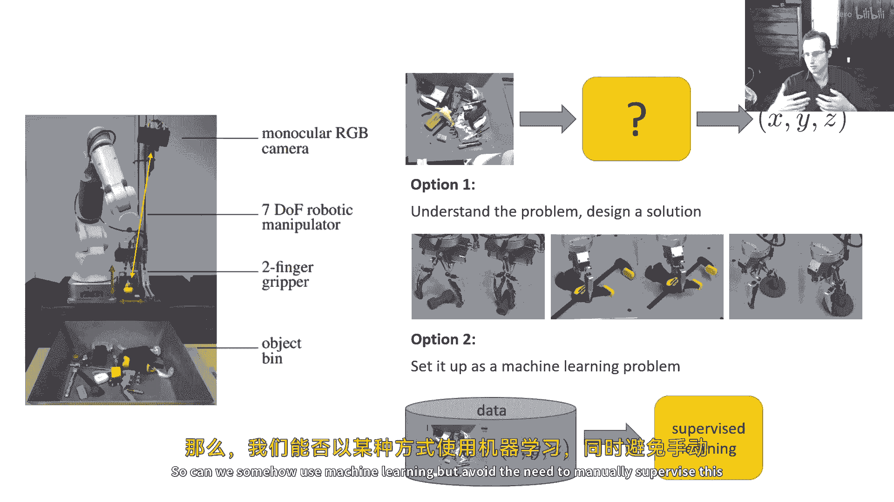
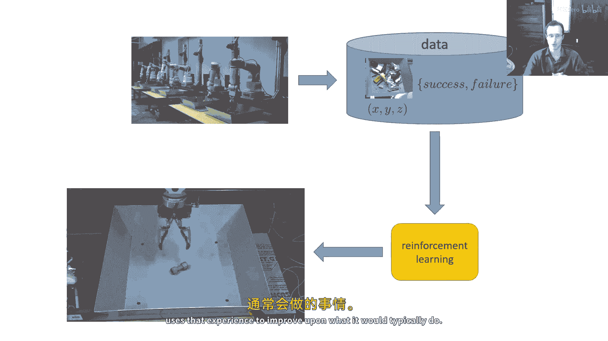
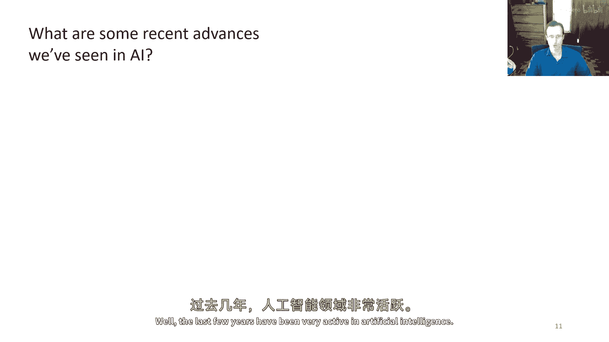
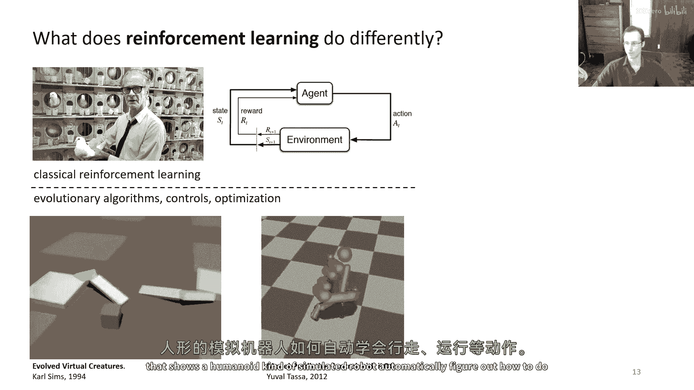
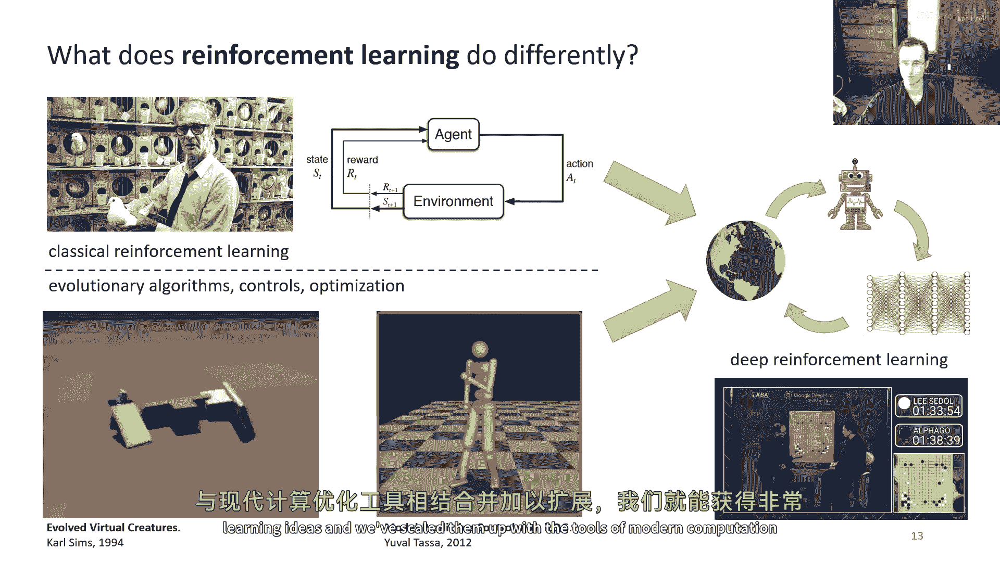
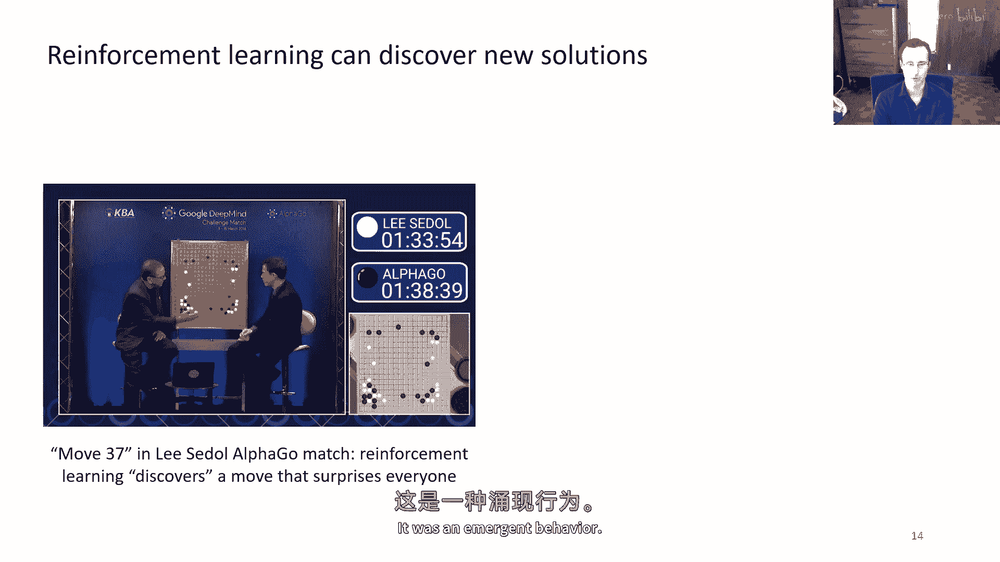
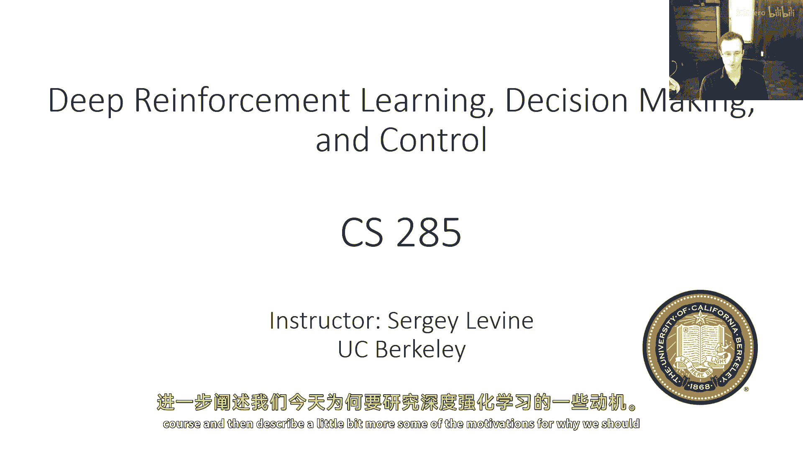

# 1：引言（第一部分）🤖

在本节课中，我们将要学习强化学习的基本概念及其动机。我们将探讨为何在某些复杂问题中，强化学习比传统的监督学习更具优势，并了解其历史渊源和现代应用。

---

让我们假设你想要构建一个系统，使用机器人拾取物体。机器人从相机中看到图像，目标是输出空间中的坐标。这将允许它成功拾取物体。

这是一个相当棘手的问题。虽然你可能认为只需要在图中定位物体并输出位置，但正确拾取物体的方法实际上有很多特殊情况和例外需要考虑。

如果你想手动设计解决方案，刚性物体的拾取相对直接，只需要将手指放在两侧。但如果物体形状怪异、质心分布复杂，你需要确保更接近质心来拾取它，以防它从抓握器中掉出。

如果物体柔软可变形，那么可能需要一套完全不同的策略，例如夹住它。每当遇到有许多特殊情况、例外和小细节的场景，使用机器学习就变得非常吸引人。因此，将其设置为一个机器学习问题会更好。

与其手动处理所有小例外，你可以运行一种通用的机器学习程序，也许使用卷积神经网络自动从图像中提取适合的抓握位置。问题在于，我们在监督学习中的标准工具并不容易实现这一点。

因为它们需要我们在某种程度上获取一个数据集，该数据集由图像和适合的抓握位置组成的配对。问题是，甚至人类也不能必然确定最佳的抓握位置，因为抓握是机器人与其环境之间的物理交互属性，并非完全由人类的直觉所决定。

我们没有很多使用机器人手指拾取东西的经验。我们能否以某种方式使用机器学习，同时避免需要手动监督这个过程？

如果我们让机器人自己收集大量的尝试，尝试不同的抓握并观察哪些成功、哪些失败，这实质上是强化学习的主要思想。在本课程中，我们将讨论解决这个问题的不同方法。

在强化学习设置中，我们不会尝试手动指定机器人应该如何抓取物体。相反，机器本身将收集一个不一定由好例子组成、但由结果标记的数据集。

数据集将包含机器人行为的图像，以及该行为导致失败或成功的结果。更一般地，我们将此称为**奖励函数**：机器人将为成功获得奖励，为失败受到惩罚。

强化学习算法与监督学习算法有很大的不同。它不仅仅是试图复制数据中的所有内容，而是试图使用这些成功/失败标签（即奖励标签），以找出它应该做什么来最大化成功的数量或最大化奖励。

这样，我们或许可以得到一个比机器人在收集数据时实际执行的平均行为更好的策略。这个策略能够利用经验来改进它通常的行为。

---

上一节我们介绍了强化学习解决机器人抓取问题的基本思路。现在，让我们将其放在近期人工智能发展的背景下，看看我们在人工智能方面看到了哪些最近的进步。

过去几年在人工智能领域非常活跃。我们看到了相当显著的进步，例如，在AI系统能够根据文本提示生成图片的能力上。

你可以获取一个扩散模型，让它根据提示（如“请提供一个充满活力的萨尔瓦多·达利的肖像画，面部一半是机器人”）生成一幅可能的图片。

我们还可以获取能够进行对话的语言模型。这些模型可以告诉你关于“牛去哈佛学习牛科学专业”的笑话，或者作为助手解释甚至回答复杂的编码提示。

在标准的生成模型应用之外，我们也看到了许多有趣的结果。例如，在生物科学中，你可以使用生成模型来设计能够与特定病毒结合的蛋白质。

数据驱动的AI已经取得了巨大的进步。我们从图像生成到文本处理等方面都看到了许多进步。许多这些在过去几年中取得的、被广泛报道的进步，在某种意义上都基于与监督学习方法非常相似的思想。

在我讨论机器人示例时提到的图像生成模型、语言模型等，其原理本质上是一种**密度估计**：估计变量 `x` 的概率分布 `p(x)`，或在给定 `x` 的条件下估计 `y` 的条件概率分布 `p(y|x)`。

对于语言模型，通常是估计自然语言句子的分布。对于图像生成模型，可能是基于提示生成图像的条件分布。但这是一种非常相似的思想，并且在两种情况下，这些实际上只是我们在统计课程中学到的那种密度估计的大规模扩展版本。

当你在进行密度估计时，一个非常重要的事情是要记住，你本质上在进行监督学习，学习的是关于数据分布的知识。这使你非常重视考虑数据实际上来自哪里。

如果数据由从网络上挖掘的大量图像组成，并且这些图像被标记为文本提示，那么你实际上学习的是关于人们在网上上传的图像种类。在文本情况下，你学习的是人们通常输入的内容。

如果你的目标是生成与人类生成的内容相似的内容（例如人类可能会画的画作、可能会写的文本），那么从这些数据中学习可以给你非常强大的能力。

当然，生成与人类相似的内容并不是我们想要自动化系统做的唯一事情。在我们深入讨论这一点之前，让我们先看看强化学习如何能做得更好，以及它来自哪里。

---

现代强化学习可以追溯到两个主要学科。第一个是心理学，特别是在动物行为的研究上。

这是斯金纳的照片，他是一位著名的研究者，研究了动物对各种奖励反应的行为。从那条研究路线产生的工作，构成了我们今天在计算机科学中所做的强化学习的基础。它模型化了智能体与其环境的交互，并使其响应奖励来适应环境。

但是，有一个不同的渊源也对现代强化学习产生了重大影响，那就是**控制理论**和**优化**领域，其根源包括进化算法等。

这是一段1994年由卡尔·辛姆斯制作的视频。它展示了一种优化程序（他称之为“进化”，但具有类似的原则），被用来优化这些虚拟生物的形式和行为。这些虚拟生物会做像走路、跑步甚至互相战斗这样的事情，它们的行为会被优化并不断演进。

这与我们今天常想到的、以复制人类行为为目标的机器学习有很大的不同。在这里，目标是产生不需要由人类设计就能实现的行为。

如果我们快进几十年，可以看到更复杂的算法。例如，这个结果是展示一个类人型的模拟机器人，自动找出如何做像走路和跑步这样的事情。

这两门学科实际上共同影响了现代深度强化学习的研究。现代深度强化学习可以被视为大规模优化与古典强化学习算法思想的结合。一旦我们接受了那些古典强化学习的想法，然后用现代计算和优化工具来放大它们，我们就可以得到非常强大的涌现行为。

你们中许多人可能听说过阿尔法狗。在阿尔法狗的一场冠军赛中，有一个被称为“第37步”的著名时刻。阿尔法狗系统执行了一步让观赛专家非常惊讶的移动，因为这不是人类玩家可能会做出的移动类型。这就是**涌现行为**。

我们近年来看到的生成式人工智能结果非常令人印象深刻，正是因为它们看起来像是一个人可能会产生的东西（如图片或文本）。而强化学习最令人印象深刻的结果，其令人印象深刻之处恰恰在于**没有人想过它**。

我们之所以对阿尔法狗的结果感兴趣，是因为其出现的新现象——一个自动化算法能够发现超越人类所做出的解决方案。如果我们要严肃对待AI的研究，那么这一点非常重要。

因为如果我们仅仅复制人类，那么我们可能无法获得与人类相关联的那种灵活的智能。我们必须找出如何让算法发现**完成任务的最佳解决方案**的方法，而不仅仅是一个人可能会采取的解决方案。这样，当面对新颖的情况时，它们才能够智能地反应。

这就是我们要讨论强化学习的动机。在本讲座的剩余部分，我将带你了解课程的结构，并稍微描述一些更多的动机。

---

本节课中，我们一起学习了强化学习的基本动机。我们了解到，对于存在许多特殊情况和物理交互的复杂任务（如机器人抓取），强化学习通过让智能体从自身尝试的成功与失败（奖励）中学习，比需要大量精确标注数据的监督学习更具优势。我们还回顾了强化学习与心理学、控制优化等领域的渊源，并认识到其追求超越人类已有解决方案、产生智能涌现行为的核心价值。在接下来的课程中，我们将深入探讨强化学习的具体算法和实现。