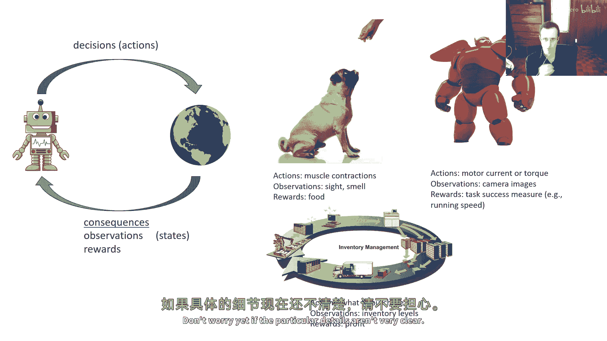
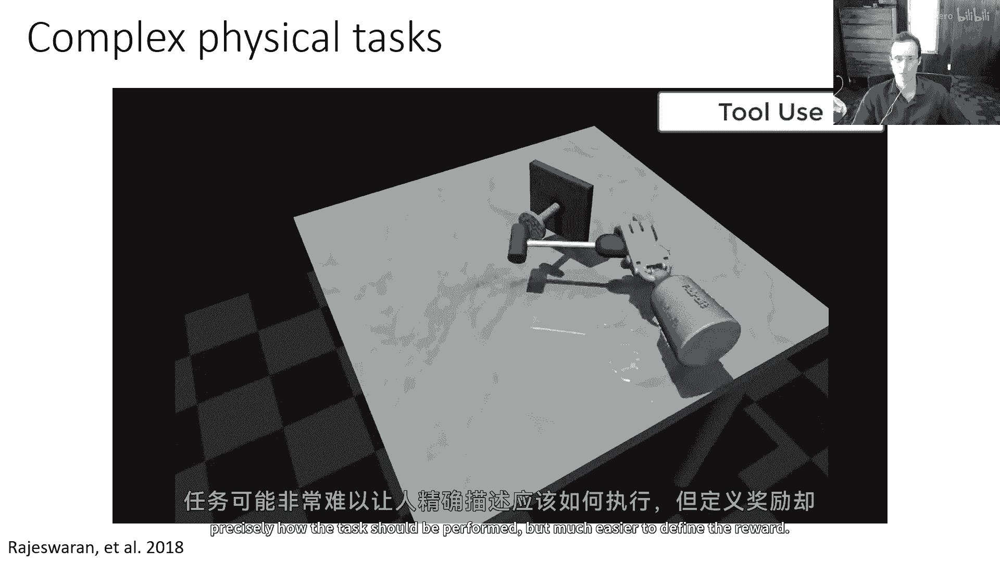
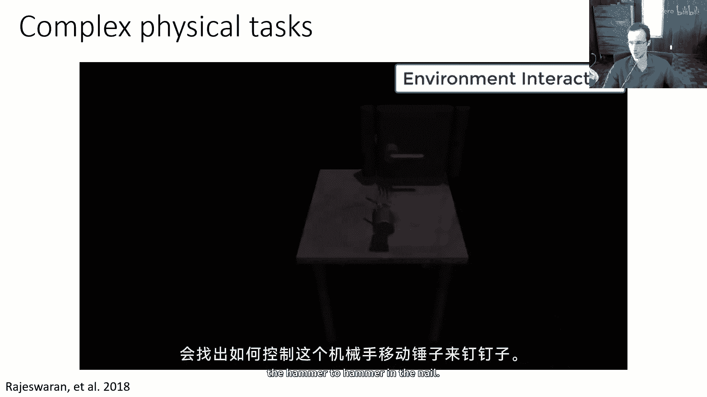
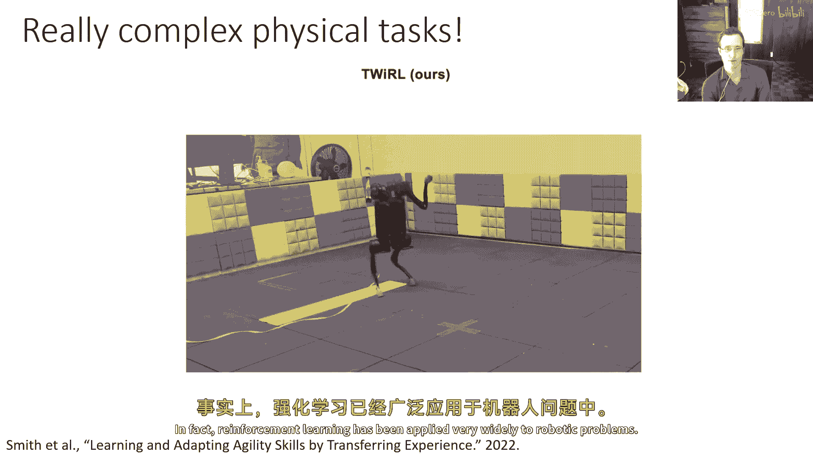
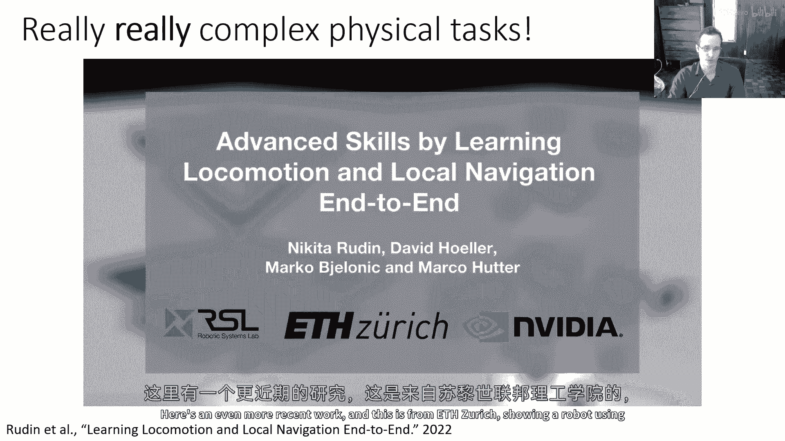
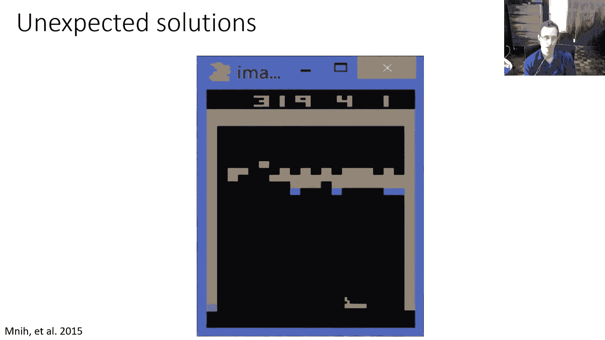
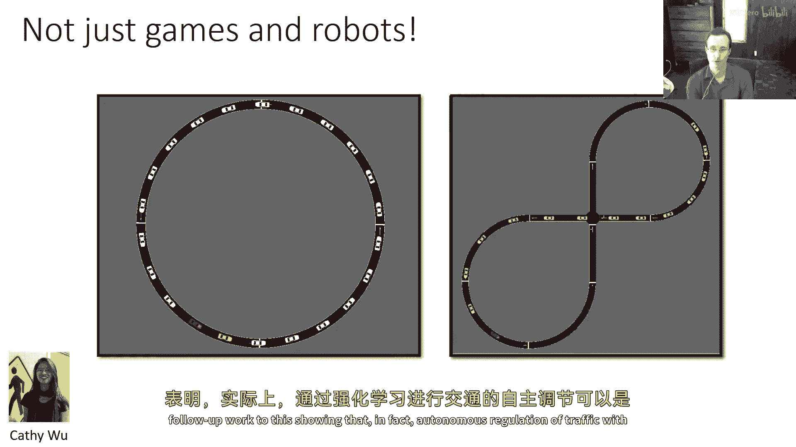
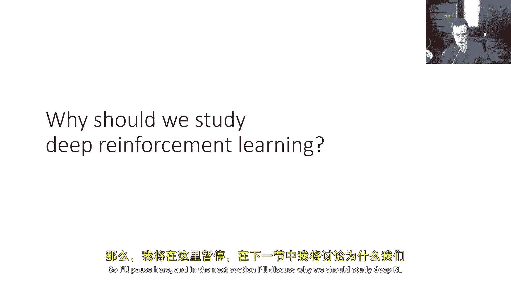

# 2：什么是强化学习？ 🧠

在本节课中，我们将要学习强化学习的基本概念、它与监督学习的区别，以及它在现实世界中的广泛应用。我们将从定义开始，逐步深入到强化学习问题的核心挑战和魅力所在。

---

## 📚 课程内容概览

这门课程将广泛介绍各种深度强化学习方法。我们将从基础开始，讨论如何从监督学习过渡到决策方法，并提供一些定义，以帮助大家理解强化学习问题。

接下来，我们将进入关于无模型强化学习算法的单元，覆盖**Q学习**、**策略梯度**和**演员-批评者方法**。你们将有一些作业需要实现这些算法。

然后，我们将有一个关于基于模型算法的单元，讨论**最优控制规划**、**序列模型**以及图像处理等相关内容。

之后，我们将探讨一系列更先进的主题，包括**探索算法**、**离线强化学习算法**、**逆强化学习**，以及强化学习方法与**概率推断**之间的关系。

最后，我们将涉及一些高级主题，如**元学习**、**迁移学习**，可能还包括**层次强化学习**，并安排一系列的研究演讲和邀请讲座。

---

## 📝 课程作业与项目

你们将有五个作业，内容涵盖模仿学习、策略梯度、Q学习、演员-批评者算法、基于模型的强化学习以及离线强化学习。最后一个作业将是关于离线强化学习的。

此外，课程将包含一个最终项目。这是一个研究级别的项目，你们可以组成一个由2到3名学生的小组。我们非常鼓励大家提前开始思考项目。

每年，学生都会询问我们对项目范围的期望。大致来说，项目的水平应相当于一篇可能提交到研讨会的论文。如果你们对项目范围不确定，请务必在办公时间与我或助教们讨论。

我们将为你们的项目提供多轮反馈。因此，我们设定了项目提案截止日期和项目里程碑报告。这些环节主要是为你们设计的，旨在鼓励你们制定计划、描述潜在关注点。提案和里程碑的评分并不严格，它们更多的是为了让你们获取关于项目计划的反馈。

在学期末，最终报告的评分将占课程总成绩的50%，项目占40%，测验占10%。

---

## ⏰ 课程政策与测验

你们有五个作业的“迟到日”。只要总共不超过这五个迟到日，作业就不会被扣分。如果超过了，我们将无法为你们的作业给予学分。

请确保你们已经注册了edX平台上的UC Berkeley CS 285课程。所有正式注册了本课程的同学，无论是否收到了邀请，我们都强烈建议你们开始组建项目小组（除非你们打算单独工作），并参加第一节课的测验。

第一节课的测验已经发布在Gradescope上。这是一个练习测验，主要目的是让大家熟悉Gradescope的界面，其中并没有真正的测验内容。

---

## 🤔 为什么学习强化学习？

今天讨论的主要焦点是：我们为什么应该学习强化学习？它是什么？以及我个人为什么喜欢教这门课的一些背景。

让我们从一些基础开始。

### 什么是强化学习？

强化学习实际上是两件事的结合：
1.  它是**基于决策学习的数学公式**。
2.  它也是一种**通过实验学习决策和控制的方法**。

重要的是要记住，这两者在一定程度上是分离的。因为我们可以先应用形式化的数学框架，然后再对其应用各种各样的解决方法。因此，不要将强化学习问题本身与解决它的具体方法混淆，这一点很重要。

---

## 🔄 强化学习 vs. 监督学习

你们可能最熟悉的机器学习类型是监督学习。监督学习的定义相当直接：你有一个包含输入`x`和输出`y`的数据集`D`。你想要学习一个函数`f`，它接受`x`并预测出接近数据集中`y`标签的值。

例如，`f`可能由一个深度神经网络表示，你将通过分类或回归来训练它，以匹配标签`y`。

**监督学习公式**：
`D = {(x_i, y_i)}`，目标是学习 `f_θ(x) ≈ y`。

虽然监督机器学习的基本公式非常直接，但它做出了一系列假设。这些假设对我们来说往往如此自然，以至于我们甚至没有明确想过它们。但是，如果我们要讨论这与强化学习的不同之处，这些假设就值得提及。

监督学习通常假设数据是**独立同分布**的。在某种程度上，这种假设显而易见，尤其是对于学习机器学习的人来说，我们往往没有明确表达出来。它的意思是：
*   **独立**：数据集中的所有`(x, y)`对是相互独立的。一个`x`的标签不会影响另一个`x`的标签。
*   **同分布**：产生`y`标签的真实函数对于所有样本都是相同的。

监督学习还假设我们的数据集是**已标记**的。从意义上说，我们在`D`中看到的每个`x`都有一个伴随的`y`，并且`y`是`x`的真实标签。如果你在做像图像分类这样的任务，标签来自人类，那么这是非常自然的。

但是，请回想我们在抓握例子中讨论的：如果你想让机器人学习如何抓握物体，假设你被给予一组带有最佳抓握位置“地面真实”标签的图像，这可能实际上是一个非常强的、不自然的假设。

---

## 🎯 强化学习的核心挑战

强化学习**不假设**数据是独立同分布的。从意义上说，之前的输出会影响未来的输入，事物被安排在时间序列中，过去影响未来。

通常，真实答案并不清楚，我们只知道一个特定结果的好坏——它是否成功或失败，或者更一般地说，它的奖励价值是多少。

在强化学习中，你可能收集数据，但你不能简单地复制那些实际上不导致成功的数据。数据可能告诉你哪些事情成功了，哪些事情失败了。然而，即使这些标签也很难正确解释，因为如果你有一个导致失败的事件序列，你不知道是序列中的哪个特定选择导致了失败。

这与人类决策类似。也许你在课程的末尾得到了一个糟糕的成绩。不是你在查看成绩这个动作导致了不及格，而是你在课堂上早期的某个行为（比如考试表现不好）导致的，但你可能没有意识到这会导致你课程失败。

这就是强化学习中面临的**信用分配**问题：导致好结果或坏结果的决策，其本身可能不会被立即标记为高奖励或低奖励。奖励可能只会在很久之后才发生。

因此，我们需要处理的数据可能没有标记为“最佳输出”，并且可能涉及这些延迟的奖励。我们的目标是在数据上运行强化学习算法，并希望得到比之前看到的行为更好的行为。这确实是强化学习中的一个核心挑战。

---

## 📊 强化学习问题形式化

让我们尝试使这个更精确一些。

在监督学习中，你有一个输入`x`和一个输出`y`。你的数据集由`(x, y)`对组成。目标是学习一个带有参数`θ`的函数`f_θ`，它接受`x`并近似`y`。

**监督学习流程**：
`数据D -> 学习函数 f_θ(x) -> 预测 y`

在强化学习中，我们有一种循环的在线学习过程：
1.  代理在时间`t`处于状态`s_t`（类似于输入`x`）。
2.  代理选择一个动作`a_t`（类似于输出`y`，但是由代理自己决定）。
3.  世界以新的状态`s_{t+1}`和一个标量奖励信号`r_t`作为响应。

这里的奖励信号`r_t`仅指示新状态`s_{t+1}`的好坏，但它并不总是告诉你刚刚采取的动作`a_t`是好是坏。也许你运气好，落在了一个好状态；或者你可能很早就做了一些很好的事情，导致你现在进入了一个好状态。

代理自身收集的数据经典上包括状态、动作和奖励的序列：`(s_t, a_t, r_t, s_{t+1}, ...)`。

而在监督学习中，数据`(x, y)`是被提供给你的。在强化学习中，你必须选择自己的行动并收集自己的数据。因此，你不仅要担心数据集中的行动可能不是最优的，还需要实际决定如何收集数据。

**强化学习流程**：
`状态s_t -> 策略 π_θ(s_t) -> 动作 a_t -> 环境 -> 新状态 s_{t+1} 和奖励 r_t`

你的目标是学习一个策略`π_θ`，它将状态映射到动作`a`。参数`θ`可能再次是神经网络的权重。

一个好的策略是使**累积总奖励**最大化的，而不仅仅是即时奖励。这涉及到战略推理：你可能现在会做一些看似无奖励的事情，为了在将来获得更高的奖励。

**目标**：最大化累积奖励 `R = Σ r_t`。

---

## 🌍 强化学习问题实例

让我们谈谈一些问题如何被纳入强化学习框架的例子。

**训练一只狗**：
*   **动作**：狗肌肉的收缩。
*   **观察**：狗通过视觉和嗅觉感知的事物。
*   **奖励**：它得到的食物。
*   **目标**：狗学习做任何事情（比如执行技巧），以最大化那个奖励。

**机器人移动**：
*   **动作**：发送给电机的电流或扭矩命令。
*   **观察**：来自传感器（如相机）的读数。
*   **奖励**：任务成功的度量（如运行速度，或到达目的地时+1，否则-1）。
*   **目标**：机器人学习控制策略以最快到达目的地。

**库存管理**：
*   **动作**：购买哪些库存。
*   **观察**：当前库存水平。
*   **奖励**：赚取的利润（长期存储会降低利润）。
*   **目标**：学习采购策略以最大化长期利润。

你可以看到，这种表述非常一般，许多不同的问题都可以被归类为强化学习的框架。当然，稍后我们会使所有这些都更加精确。这是一次非常高级别的介绍，如果特定的细节不是很清楚，请不要担心。

---

## ✨ 强化学习的应用与能力

强化学习在处理物理复杂任务方面非常擅长。这些任务可能很难让人精确描述应该怎么做，但定义奖励却更容易。

例如，让机器人手使用锤子敲钉子。定义“钉子被敲入”的奖励相对容易，而强化学习算法会自己找出如何控制机器人手的复杂动作序列来完成这个任务。

另一个例子是四足机器人学习跳跃并越过不同障碍。手动编写这样的跳跃技能代码非常困难，但强化学习可以学习出允许机器人在不同位置、以不同距离跳跃的动作策略。它甚至可以学习更复杂的技能，比如用后腿站立保持平衡。

强化学习另一个擅长的地方是产生**意想不到的、超越人类的解决方案**。以AlphaGo的著名“神之一手”为例。在打砖块游戏中，一个经典的强化学习解决方案是，智能体发现如果将球弹到砖块墙后面，球就会在顶部弹来弹去并获得大量分数，这是一种人类玩家不太会首先尝试的策略。

强化学习也可以在现实世界中大规模应用。例如，有项目训练机器人学习如何分类垃圾（区分可回收物、堆肥等）。机器人先在受控的教室环境中练习，然后部署到真实的办公大楼中执行任务。

强化学习也被广泛应用于**语言模型**。像ChatGPT这样的系统使用来自人类反馈的强化学习来训练模型，使其回应查询的方式更符合人类的偏好，而不仅仅是生成互联网上最可能出现的文本。

在**图像生成**领域，强化学习可以用于优化模型。例如，给定一个提示“海豚骑自行车”，初始生成的图像可能不准确。通过使用一个标题模型（如LAION）评估生成图像与提示的相似度作为奖励，并用RL优化图像生成模型，可以逐步使生成的图像越来越符合提示。

强化学习还可以应用于**芯片设计**。动作对应于芯片部件在布局中的放置，奖励与芯片的成本、拥堵、延迟等设计参数有关。强化学习可以自动优化这些布局。

---

## 🎓 本节课总结

在本节课中，我们一起学习了强化学习的基本轮廓：
*   强化学习是**学习决策**的数学框架和**通过交互学习**的方法。
*   它与**监督学习**的关键区别在于：处理**序列决策**、面临**信用分配**挑战，并且需要**自主收集数据**。
*   强化学习问题形式化为：智能体根据状态选择动作，环境返回新状态和奖励，目标是学习一个最大化累积奖励的策略。
*   强化学习在**机器人控制**、**游戏**、**交通管理**、**大语言模型对齐**、**图像生成**和**芯片设计**等广泛领域展现出强大能力。

通过这门课程，你们将逐步深入这些概念，并亲手实现各种强化学习算法。下一节课，我们将开始更具体地探讨强化学习的数学基础。