# 3：深度强化学习导论（第三部分）🚀

在本节课中，我们将探讨为何要学习深度强化学习。我们将分析数据驱动AI的局限性，理解强化学习在优化决策中的核心作用，并展望深度强化学习在构建通用智能系统方面的潜力。

---

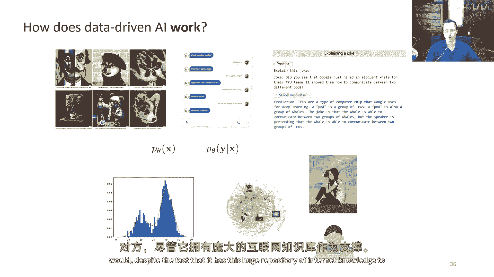

## 为什么需要深度强化学习？🤔

上一节我们介绍了强化学习的基本概念。本节中，我们来看看为何需要将深度学习与强化学习结合。

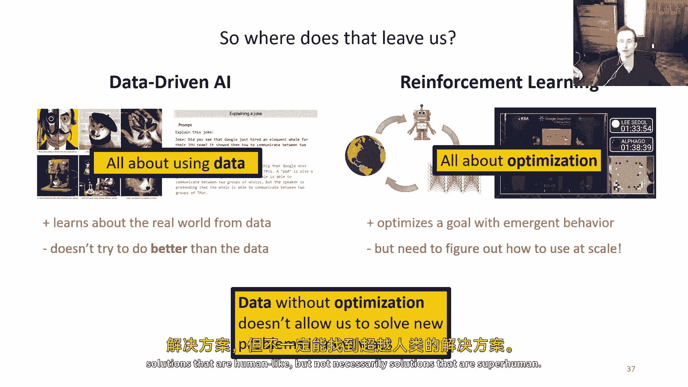

大数据驱动的大型人工智能系统取得了令人瞩目的成果。然而，这些主要基于复制人类数据的方法，其成果之所以令人印象深刻，是因为它们能产生类似人类的结果。但在许多情况下，我们需要的算法性能应超越人类数据本身。

人类数据可能不理想、难以获取，或者我们追求的是最高性能（例如AlphaGo）。我们希望算法能自主发现更好的解决方案，或在没有人类提供训练数据的情况下找到解决方案。

许多成功的基于数据的方法依赖于**密度估计**。这意味着它们倾向于生成人类可能产生的数据类型，但这也限制了它们超越人类行为的能力。它们可能在索引人类数据方面表现出色（如大语言模型），但不一定擅长利用这些知识解决具体问题。

例如，让一个大语言模型说服某人去看医生，它可能无法比人类更有效地完成，尽管它拥有庞大的互联网知识库。

---

## 数据驱动AI与强化学习的结合 🔗

那么，我们面临什么情况？一方面，我们有数据驱动的AI系统，它们从海量数据中学习世界知识，但并未真正尝试在本质上超越数据。另一方面，我们有强化学习系统，它们可以优化目标以产生行为。

这似乎能解决数据驱动AI方法的主要缺点。但我们需要找出如何大规模应用这些强化学习方法，并将其与大规模模型和数据集结合。这正是深度学习在深度强化学习中发挥作用的地方。

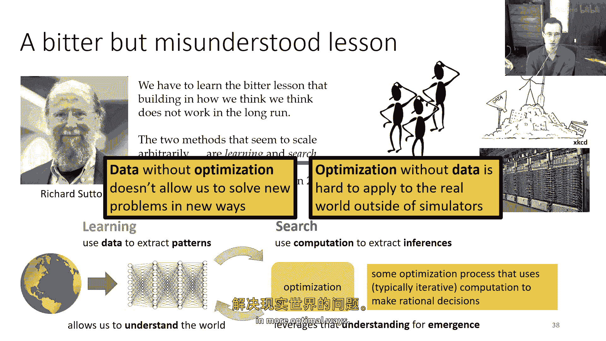

*   **数据驱动AI**：关于使用数据。
*   **强化学习**：关于优化。
*   **深度强化学习**：关于大规模优化。

没有优化的数据，我们无法以新的方式解决新问题。它可能让我们擅长在大数据集中索引并找出类似人类的解决方案，但不一定是超越人类的解决方案。

---

## “苦涩的教训”与学习-搜索范式 📚

在这个讨论背景下，强化学习先驱理查德·萨顿在2019年发表的论文《苦涩的教训》极具启发性。他提出，在构建强大学习机器的漫长道路上，我们必须吸取的教训是：我们自认为的思考方式并不重要，因为从长远看它行不通。

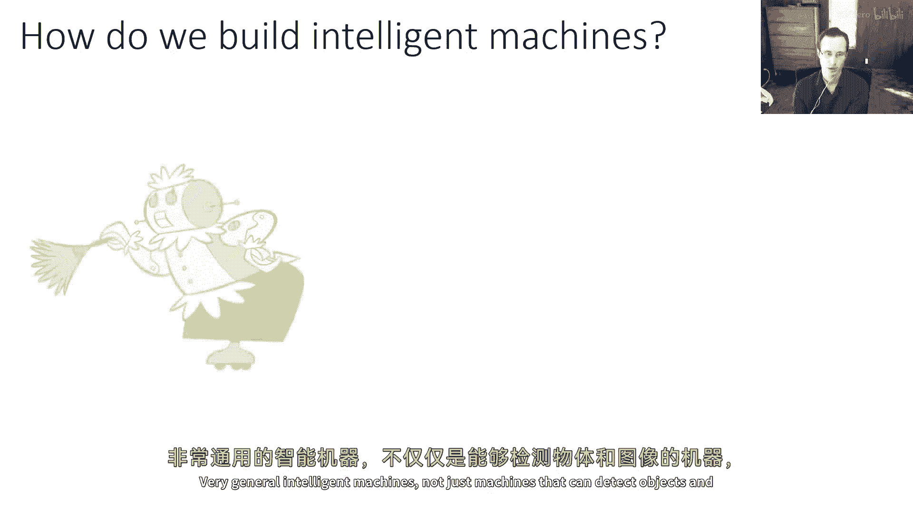

真正能够无限扩展的两种方法是**学习**和**搜索**。他的核心论点是，如果我们想要强大的学习机器，就应该构建擅长利用数据且可大规模扩展的系统，而不是过度设计使其模仿人类解决问题的方式。

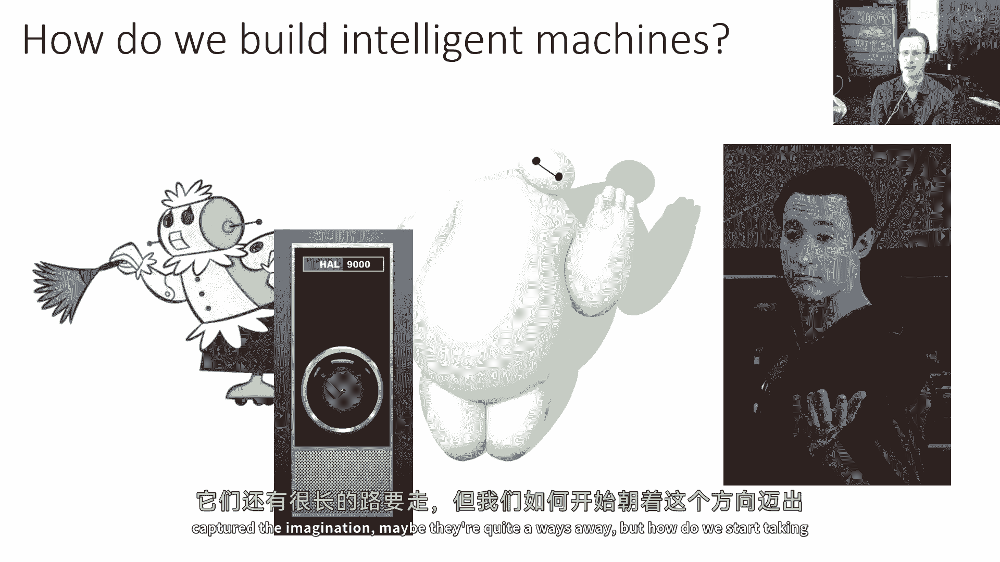

例如，早期的计算机视觉系统可能被编程为检测“四个轮子和前后车灯”来识别汽车。而现在，我们更倾向于提供大量带标签的汽车图片，让计算机自己学习。

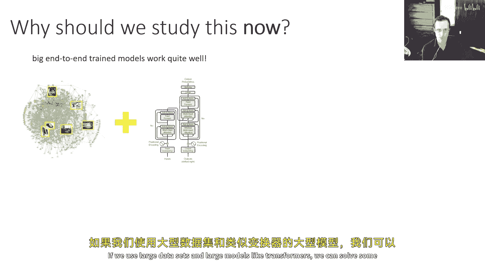

需要注意的是，萨顿强调的是“学习与搜索”，而非“学习与GPU”或“学习与大数据集”。这里有重要原因：
*   **学习**：关于从数据中提取模式。
*   **搜索**：在强化学习的语境中，指利用计算进行推断和优化，本质上是使用迭代计算做出理性决策的过程。

两者缺一不可。学习让你理解世界，搜索让你利用这种理解产生有趣的涌现行为。要想在现实世界中做出灵活、理性、最优的决策，你需要理解世界如何运作，并利用这种理解找到比已有方案更好的解决方案。这就是深度强化学习的目标。

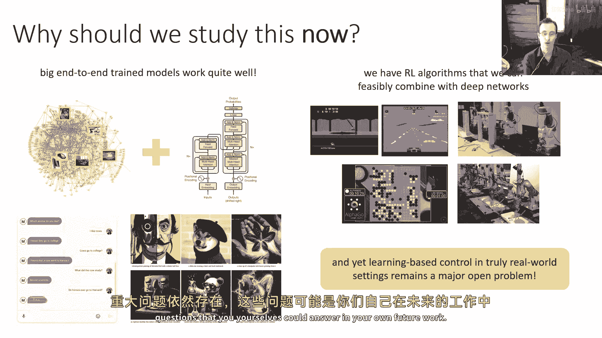

*   没有优化的数据，无法以新方式解决新问题。
*   没有数据或经验的优化，在现实世界（而非可编写运动方程的模拟器）中难以应用。
*   结合两者，才能开始更有效地解决现实世界问题。

---

## 机器学习即决策：一个更广阔的视角 🧠

这种观点不仅适用于机器人控制或玩视频游戏。我们可以从一个更根本的问题切入：为什么需要机器学习？甚至，为什么需要大脑？

神经科学家丹尼尔·沃尔珀认为，我们拥有大脑的唯一原因，是为了产生**适应性强且复杂的运动**，因为运动是我们影响周围世界的唯一方式。我们可以将这种直觉应用于机器学习，形成一个假设：我们可能只需要机器学习来做一件事，那就是产生**适应性强且复杂的决策**。

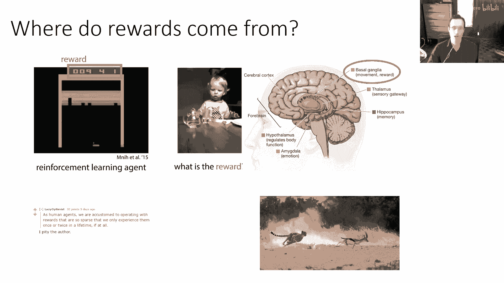

从这个角度看，所有机器学习问题都可以视为决策问题，而不仅仅是预测问题。
*   控制机器人：决定如何移动关节。
*   驾驶汽车：决定如何操控。
*   计算机视觉系统：决定图像标签，而这个标签的下游应用（如交通路由、安全警报）会产生实际影响。

如果将机器学习的所有结果都视为决策，那么所有机器学习问题实际上都是**伪装下的强化学习问题**，只是我们有时有幸能使用监督标签数据来辅助解决。这个视角虽然有些简化，但它提醒我们，**学习**和**搜索**不仅仅是用于机器人或游戏的专用工具，它们是构建人工智能系统的通用基础模块。

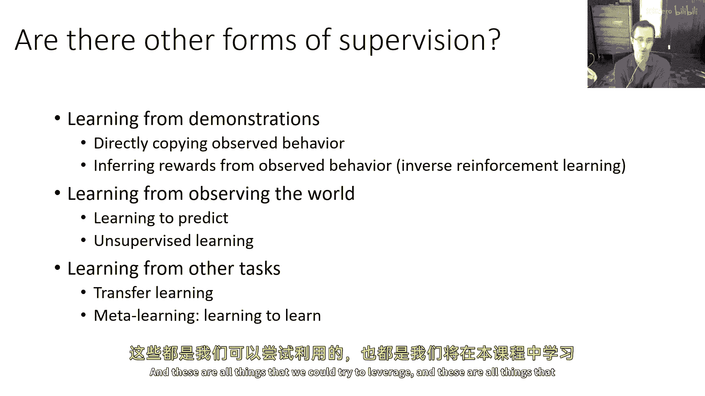

这引向了一些宏大问题，例如如何构建通用的智能机器。深度强化学习是迈向这个方向的重要组成部分。

---

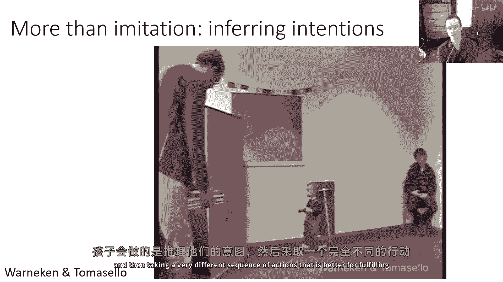

## 深度强化学习的现状与潜力 ⚡

我们为何现在要研究深度强化学习？
1.  大规模端到端训练模型（使用Transformer等大型模型和数据集）已能解决许多令人印象深刻的问题。
2.  我们已经掌握了许多可与深度神经网络结合的强化学习算法，并能用它们训练大型模型。

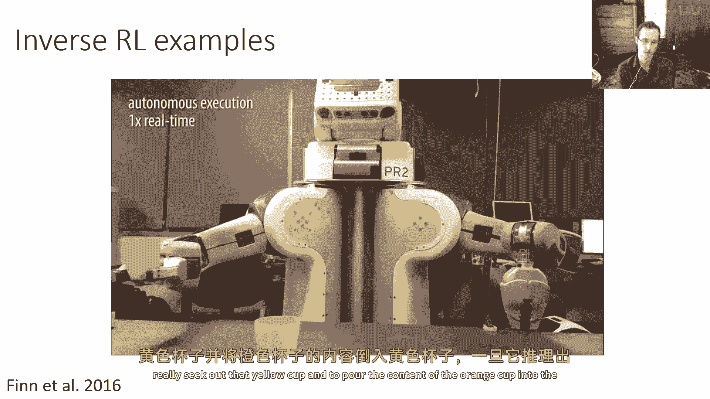

然而，在基于学习的控制和真正的开放世界设置中，这仍然是一个主要的开放挑战。虽然已有初步成果（包括机器人领域），但许多潜力尚未实现。现在是一个令人兴奋的研究时刻，许多拼图正在拼接，但主要问题依然存在，这可能是未来工作的方向。

---

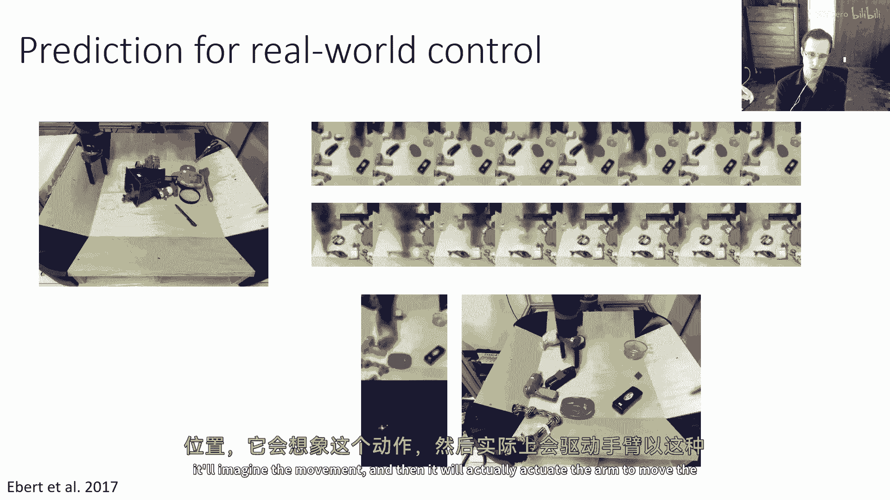

## 超越奖励最大化：序列决策中的其他问题 🎯

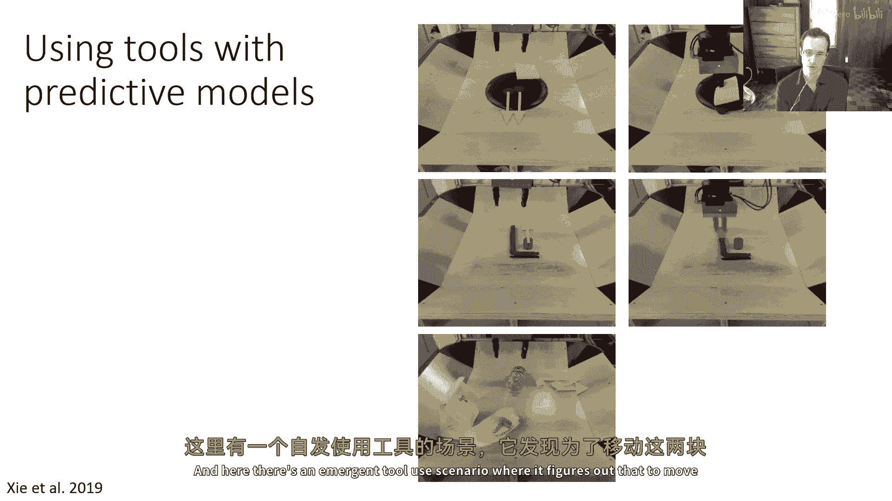

在深入之前，我们需要了解，现实世界的序列决策不仅涉及奖励最大化。本课程也将涵盖决策制定中出现的其他问题。

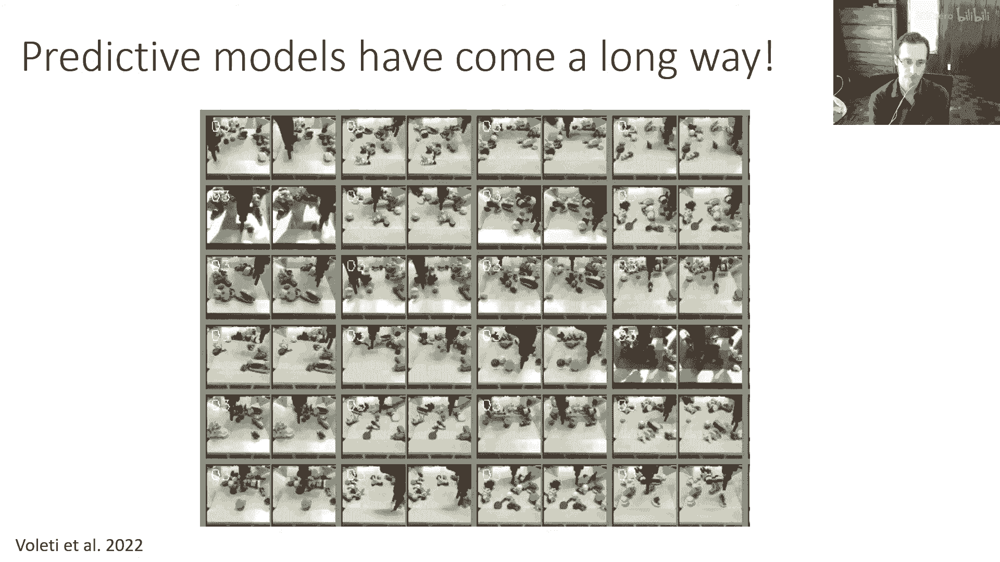

一个核心问题是：**奖励从何而来？**
*   在视频游戏中，奖励（分数）很明确。
*   但在现实任务中（如让机器人倒水），定义奖励函数本身可能就是一个复杂的感知问题。

人类的许多行为并非通过稀疏的终极奖励（如获得博士学位后的成就感）试错学来的。生物（如猎豹）也并非只从最终捕获猎物的奖励中学习。它们可能通过观察、模仿、从其他信号中学习。

因此，我们可以利用其他形式的监督信息：

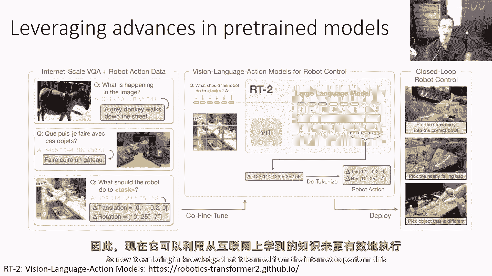

以下是几种重要的学习范式：

*   **模仿学习**：直接从观察到的行为中学习。
*   **逆强化学习**：从观察到的行为中推断出背后的奖励函数。
*   **预测模型学习**：学习预测世界接下来会发生什么，即使不确定该做什么，之后可利用此知识。
*   **无监督学习/特征提取**。
*   **迁移学习/元学习**：从其他任务中转移知识，或学习如何更快地适应新任务。

本课程将涵盖这些主题。

---

### 实例展示

**模仿学习示例**：约八年前，NVIDIA展示了完全基于模仿的自动驾驶方法，试图直接复制人类驾驶员的动作。但人类模仿的往往是更深层的意图，而非具体动作。心理学实验表明，孩子会推断实验者的意图，并采取不同的、更有效的行动来实现该意图。

**逆强化学习示例**：机器人通过观察人类的倒水演示，推断出意图是“将橙色杯中的水倒入黄色杯”，从而能在不同设置下执行该任务。

**预测模型示例**：机器人通过与物体互动收集数据，学习预测其动作对未来感官输入（如图像）的影响。这种模型可用于控制，例如命令机器人将红色物体移到绿色位置，它会先“想象”运动过程，再执行。预测模型还能促进行为涌现，如发现使用工具来完成移动物体的任务。近年来，随着生成模型（如扩散模型）的进步，视频预测质量大幅提升。

**利用预训练模型**：现代方法常利用在互联网数据上预训练的大型模型（如视觉-语言模型），然后对其进行微调以输出机器人动作。例如，RT-2模型能将互联网上学到的知识（如识别物体、理解“不同”、“正确”等概念）用于执行具体的机器人指令。

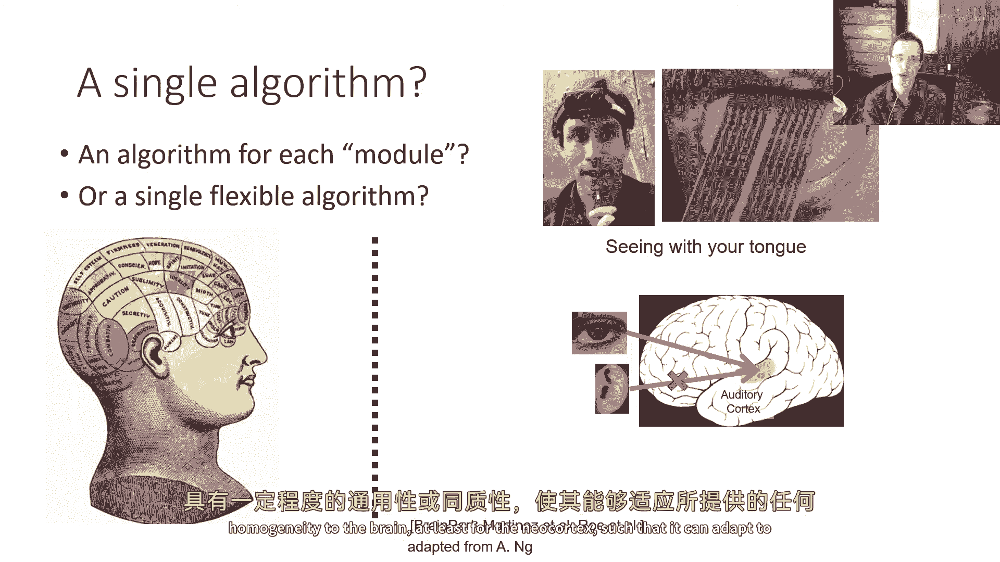

---

## 总结与宏大展望 🌌

让我们以更宏大的视角结束：如何构建智能机器？深度强化学习的基本构建块可能是解答这个问题的优秀候选。

传统思路可能是理解大脑的各个部分并编程模拟，但这极其复杂。如果学习是智能的基础，并且存在一种通用的学习程序，能 underlie 所有智能行为，那么问题可能变得更易处理。有间接证据支持这种可能性，例如大脑皮层表现出可塑性，能够适应不同的感官输入。

如果存在这样一个通用算法，它需要能够：
1.  解释丰富的感官输入。
2.  选择复杂的动作。
3.  同时完成这两件事。

**深度学习**为我们提供了从大型复杂数据集中进行可扩展学习的能力（处理丰富输入）。**强化学习**为我们提供了优化和采取行动的数学框架（进行搜索）。两者的结合——**深度强化学习**——恰好对应了“学习与搜索”的范式。

神经科学中也有一些证据支持这两方面与大脑功能的联系。当然，问题远未解决：
*   如何将深度学习的强大数据利用能力与强化学习的优化能力更无缝地结合？
*   人类学习速度快、能复用知识，而深度强化学习通常需要大量数据，迁移学习仍是挑战。
*   奖励函数设计、预测模型的作用、与无模型方法的融合等问题依然开放。

这些疑问为该领域的进一步研究留下了充足空间。最终，我们或许可以不再将智能系统视为一堆模块的集合，而是看作一个由通用学习算法驱动的、优雅简单的框架。正如艾伦·图灵曾暗示过的思想：与其模拟成人思维，不如模拟儿童的心智，再对其施以适当的教育。

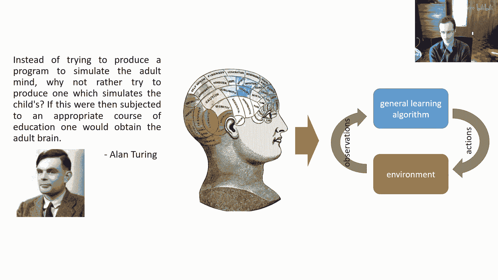

本节课中，我们一起学习了深度强化学习的动机、其核心的“学习-搜索”范式、从决策视角理解机器学习的广阔图景，以及当前面临的挑战和未来潜力。深度强化学习不仅是解决特定任务的工具，更是探索通用人工智能的一条重要路径。