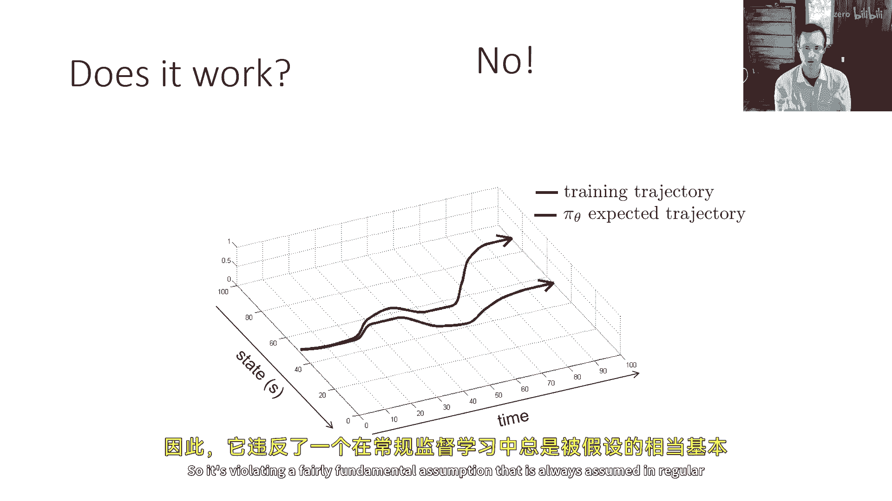
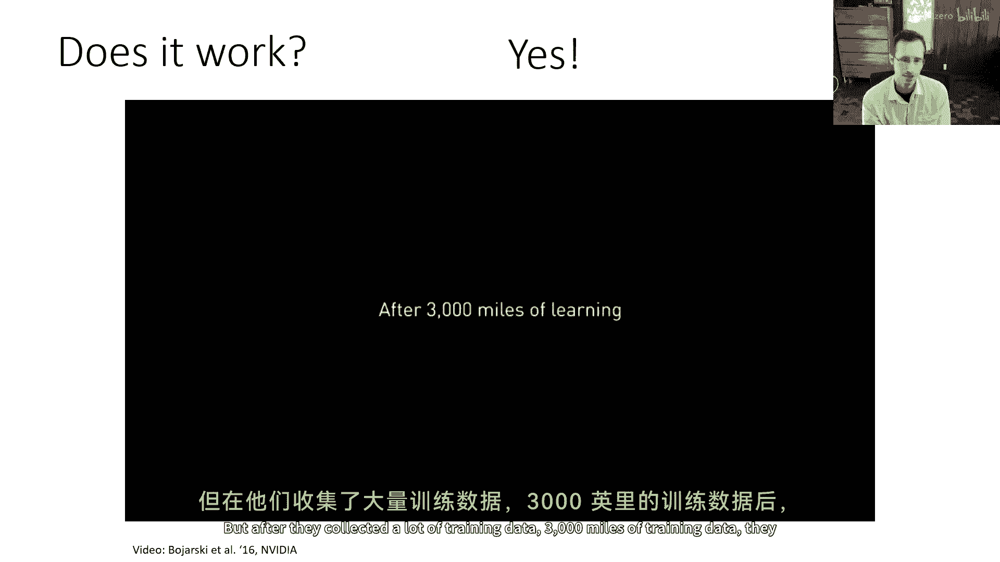
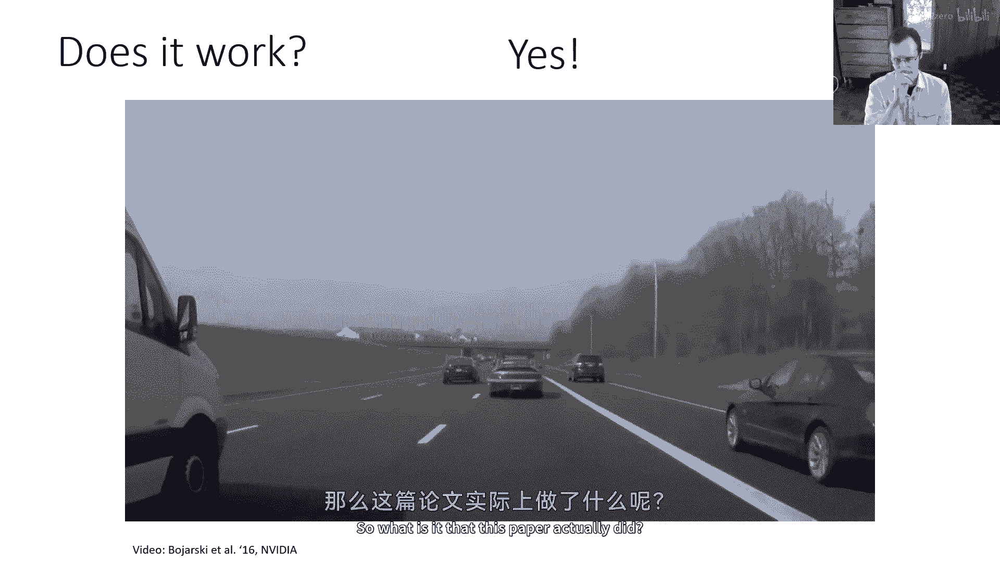
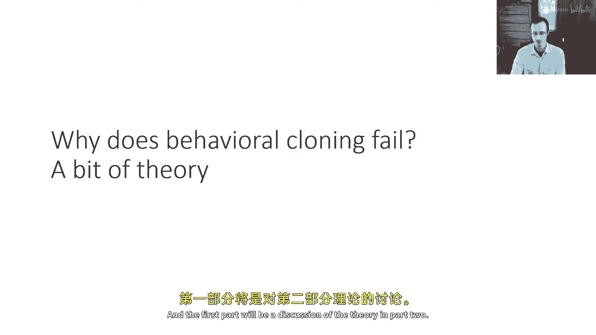

# 4：模仿学习（第一部分）📚

在本节课中，我们将学习模仿学习的基础知识。模仿学习是一种通过观察专家（例如人类）的行为来训练智能体（Agent）执行任务的方法。我们将从定义核心概念和术语开始，然后探讨一种最简单的方法——行为克隆，并分析其优缺点。

## 术语与符号 📝

上一节我们介绍了课程的主题，本节中我们来看看模仿学习中使用的基本术语和符号。

我们使用 **策略（Policy）** 来表示智能体的行为。策略是一个从**观察（Observation）** 到**动作（Action）** 的映射。这与监督学习中的分类器类似：分类器从输入 `x` 映射到输出标签 `y`，而策略从观察 `o` 映射到动作 `a`。

我们用字母 **π** 表示策略，用下标 **θ** 表示其参数（例如神经网络的权重），记作 **π_θ**。

在序列决策问题中，时间是一个重要因素。我们用下标 **t** 表示时间步。因此，在时间 `t` 的观察记作 **o_t**，动作记作 **a_t**。

策略的输出通常是一个**分布**。这意味着对于给定的观察，策略为所有可能的动作分配一个概率。一个**确定性策略**是随机策略的一个特例，它为某个动作分配概率1，为其他动作分配概率0。将策略表示为分布通常更方便训练。

我们还需要区分**状态（State）** 和**观察（Observation）**。
*   **状态 s_t**：是对世界完整、简洁的描述，包含了预测未来所需的所有信息。
*   **观察 o_t**：是智能体实际感知到的信息（例如相机像素），可能只是状态的一部分。

状态满足**马尔可夫性质（Markov Property）**：给定当前状态 `s_t`，未来状态 `s_{t+1}` 与过去状态 `s_{t-1}` 条件独立。这意味着当前状态已包含预测未来的全部必要信息。

状态转移由**动态模型（Dynamics）** 或**转移概率**描述，公式为：
**P(s_{t+1} | s_t, a_t)**
它表示在状态 `s_t` 下采取动作 `a_t` 后，转移到状态 `s_{t+1}` 的概率。

## 行为克隆：基础方法 🚗

在理解了基本概念后，我们来看一种最直接的模仿学习方法——行为克隆。

行为克隆的核心思想是使用监督学习来克隆专家的行为。我们收集专家在任务中产生的**观察-动作对 (o_t, a_t)** 数据，然后像训练分类器或回归模型一样，训练一个策略网络来拟合这些数据。

以下是行为克隆的基本步骤：
1.  **数据收集**：记录专家（如人类驾驶员）执行任务时的观察（如相机图像）和对应的动作（如方向盘角度）。
2.  **构建数据集**：将每个时间步的 `(o_t, a_t)` 视为一个独立的训练样本。
3.  **监督学习**：训练一个模型（如神经网络）`π_θ`，其目标是给定输入 `o_t` 时，输出与专家动作 `a_t` 尽可能接近的动作。

一个著名的早期例子是1989年的ALVINN系统，它使用神经网络和人类驾驶数据来实现车道跟随。

## 行为克隆的问题与挑战 ⚠️

上一节我们介绍了行为克隆如何工作，本节中我们来看看这种方法存在的主要问题。

从理论上讲，行为克隆并不保证能学到一个鲁棒的策略。核心问题在于它违反了监督学习的一个基本假设：**独立同分布（i.i.d）** 假设。

在标准监督学习中，每个数据点是独立的，模型的预测错误不会影响下一个输入。但在序列决策中，策略在时间 `t` 犯的一个小错误，会导致智能体在时间 `t+1` 进入一个**未曾见过的新状态**。在这个陌生状态下，策略更容易犯更大的错误，从而陷入错误不断累积、状态越来越偏离专家轨迹的恶性循环。这种现象被称为**分布漂移（Distributional Shift）** 或**协变量漂移（Covariate Shift）**。

## 实践中的改进与解决方案 🛠️

尽管存在理论缺陷，但通过一些技巧，行为克隆在实践中可以表现得相当好。例如，NVIDIA的一项自动驾驶研究表明，使用海量数据（3万英里驾驶记录）和精心设计的数据增强方法，可以训练出有效的策略。

以下是几种改进行为克隆或解决其问题的方法：

**1. 精心设计的数据收集与增强**
通过增加训练数据的多样性和覆盖范围，可以让策略在面对陌生状态时更有鲁棒性。例如，NVIDIA的工作不仅使用前向摄像头图像，还使用了左、右摄像头的图像，并人为地为其生成“纠正性”的动作标签（如左摄像头图像对应向右转的动作），这相当于合成了错误恢复的样本。

**2. 使用更强大的模型**
减少策略的初始错误率是缓解错误累积的关键。使用容量更大、表达能力更强的模型（如更深的神经网络）可以帮助减少在已知状态下的错误。

**3. 算法改进：DAgger**
一种更根本的解决方案是改变学习过程本身。**DAgger（Dataset Aggregation）** 算法通过迭代地运行当前策略，请专家对策略访问到的状态进行标注，并将新数据加入训练集，从而让策略直接学习在自身分布下的正确行为。这能有效解决分布漂移问题。

**4. 多任务学习**
有时，让策略同时学习多个相关任务，可以提高其泛化能力和鲁棒性，从而间接改善模仿学习的效果。

## 总结 📖

本节课中我们一起学习了模仿学习的第一部分内容。

我们首先定义了策略、观察、动作、状态等核心概念，并理解了状态与观察的区别以及马尔可夫性质。接着，我们介绍了最基础的模仿学习方法——**行为克隆**，它本质上是一种将序列决策问题转化为监督学习的技术。然而，由于违反了i.i.d假设，行为克隆会面临**错误累积**和**分布漂移**的挑战。最后，我们探讨了在实践中使行为克隆更有效的一些技巧，例如数据增强，并提到了更高级的算法如**DAgger**作为更原则性的解决方案。

在接下来的课程中，我们将深入探讨DAgger等更先进的模仿学习算法。