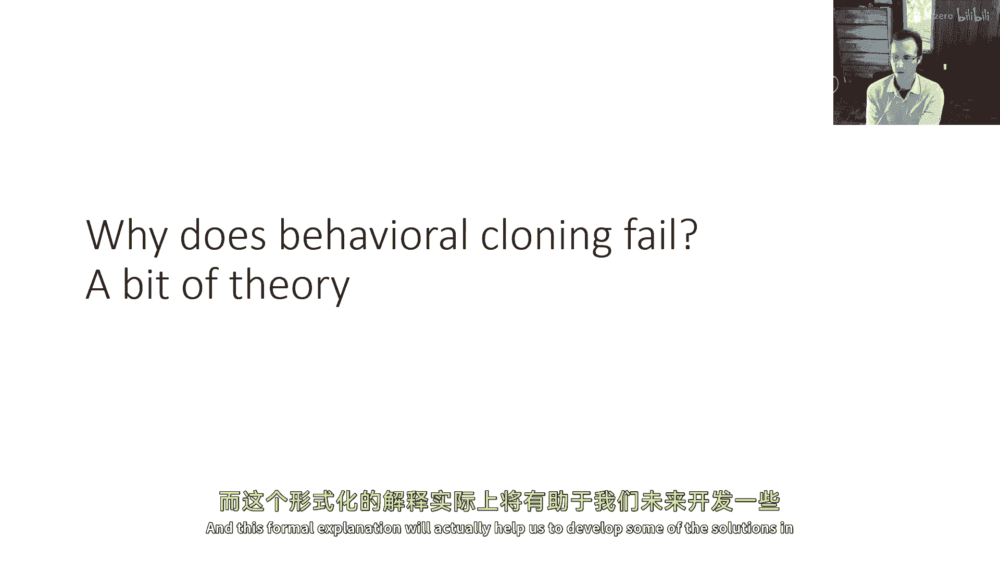
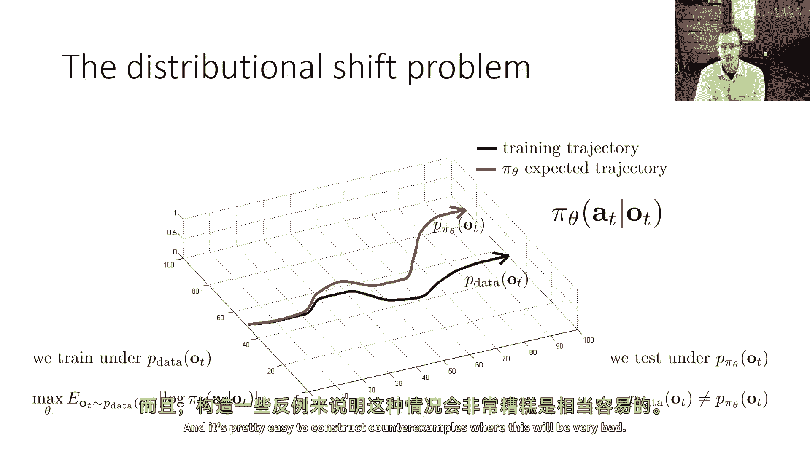
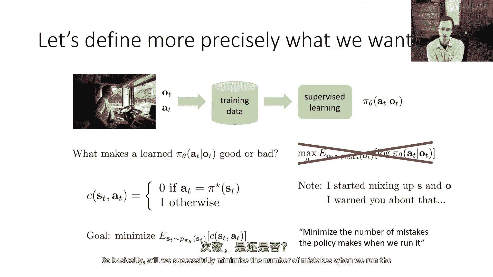
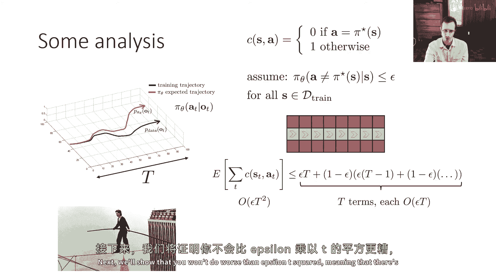
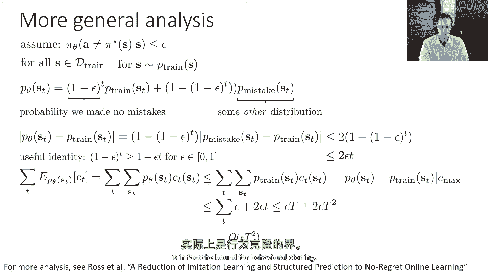
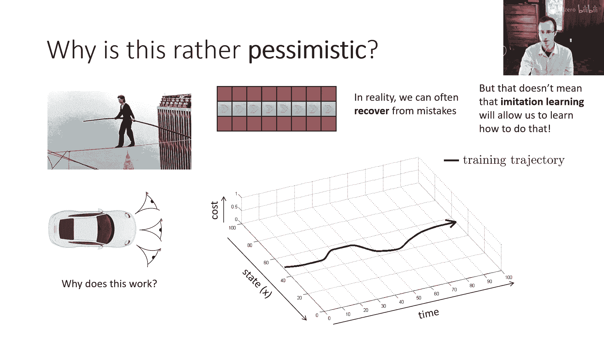
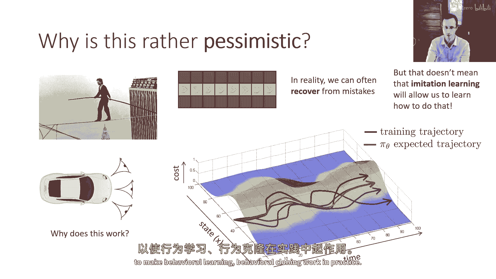
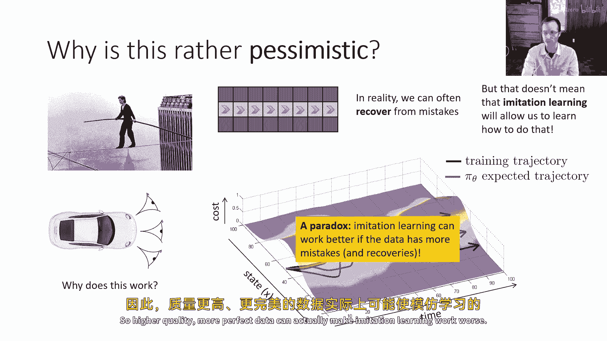
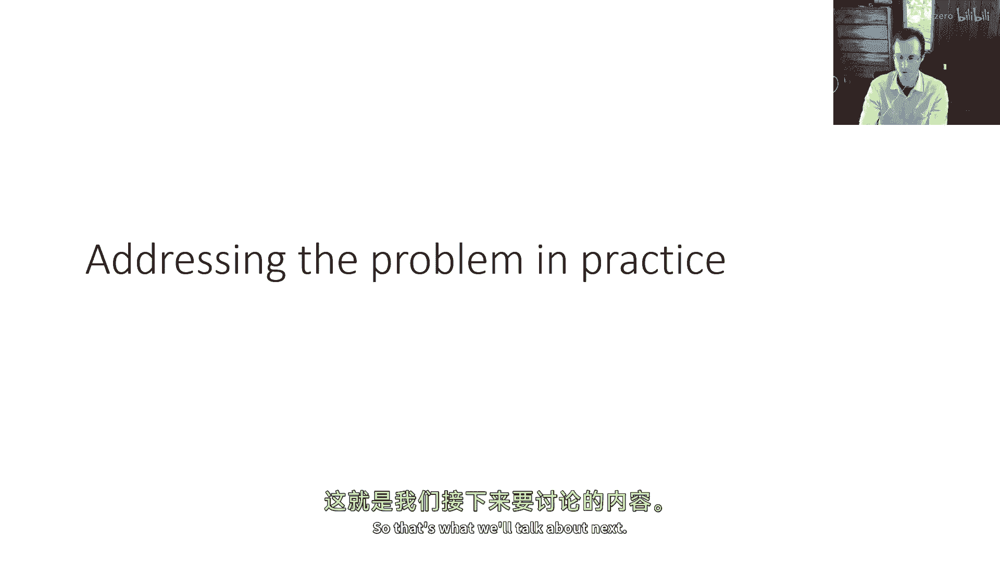

# 5：模仿学习（第二部分）🤖

在本节课中，我们将深入探讨行为克隆（Imitation Learning）效果不佳的正式数学解释。我们将通过分析“分布漂移”问题，理解为什么即使策略在训练数据上表现良好，在实际应用中也可能累积错误。最后，我们将简要介绍解决此问题的一种思路。

---

## 行为克隆的挑战：分布漂移 📉

上一节我们介绍了行为克隆的基本概念。本节中，我们来看看为什么行为克隆在实践中常常效果不佳。核心问题在于“分布漂移”。

我们有一个策略 **π_θ(a_t | o_t)**，它使用人类演示数据（分布 **p_data(o_t)**）进行训练。然而，当策略实际运行时，它观察到的状态分布是 **p_π_θ(o_t)**。由于策略的行为与人类不完全相同，这两个分布并不相等，即 **p_data(o_t) ≠ p_π_θ(o_t)**。

在监督学习中，我们训练策略以最大化在 **p_data(o_t)** 分布下人类行动的对数概率。但策略的真实性能，取决于它在自身运行时的分布 **p_π_θ(o_t)** 下的表现。这种训练分布与测试分布之间的不匹配，就是**分布漂移**。正是策略自身犯下的错误，导致了这种偏移。

---

## 定义策略的“好坏” 🎯

为了分析行为克隆，我们需要一个更合适的度量标准来衡量策略的好坏，而不仅仅是训练数据的似然度。

我们可以定义一个成本函数 **c(s, a)**：
*   如果行动 **a** 与专家（人类）策略 **π\*(s)** 的行动一致，则成本为 **0**。
*   否则，成本为 **1**。

这样，总成本就近似等于策略犯错的次数。我们的目标是最小化策略在**自身产生的状态分布 p_π_θ(s_t)** 下的期望成本，而不是在专家数据分布 **p_data(s_t)** 下的成本。这是分析中的关键区别。

---

## 一个反例：走钢丝的人 🧗

为了直观理解问题有多严重，我们构造一个简单的反例。

假设一个“走钢丝”问题：在每个状态，只有一个正确的动作（保持在钢丝上）。如果犯任何错误，就会“掉下钢丝”，进入一个专家演示中从未出现过的状态。因此，一旦犯错，后续所有步骤都可能继续犯错，因为策略不知道在新状态下该怎么做。

我们假设策略在训练见过的状态上，犯错的概率 **≤ ε**（ε 是一个很小的数）。

以下是分析错误累积的过程：

1.  **第一步**：犯错概率为 **ε**。如果犯错，则剩余 **T-1** 步都会犯错。
2.  **第二步**：以 **1-ε** 的概率第一步未犯错。此时第二步犯错概率为 **ε**，如果犯错，则剩余 **T-2** 步都会犯错。
3.  以此类推...

将所有这些可能情况下的期望错误数相加，我们会得到总期望错误数约为 **O(ε T²)**。这意味着错误数量随轨迹长度 **T** 呈**二次方**增长，这是非常糟糕的。我们期望的是一个**线性**增长 **O(ε T)**，这样策略才能长期运行。

这个例子表明，在最坏情况下，行为克隆的错误累积是灾难性的。

---

## 一般性分析：推导错误上界 📈

接下来，我们进行更一般化的分析，证明 **O(ε T²)** 不仅是特例，而且是一个上界。

我们假设：对于从训练分布 **p_train(s)** 中采样的**任何**状态，策略犯错的**期望成本 ≤ ε**。

我们关心在时间步 **t**，策略自身分布 **p_π_θ(s_t)** 与训练分布 **p_train(s_t)** 的差异。我们可以将 **p_π_θ(s_t)** 分解为两部分：
*   一部分是策略在前 **t** 步都未犯错的概率 **(1-ε)^t**，此时状态仍服从 **p_train(s_t)**。
*   另一部分是犯过错的概率 **1 - (1-ε)^t**，此时状态服从某个复杂分布 **p_mistake(s_t)**。

利用分布之间的**总变分距离**（Total Variation Distance）作为差异度量，经过推导（详细步骤见课程），我们可以得到不等式：

**|p_π_θ(s_t) - p_train(s_t)| ≤ 2εt**

这个不等式表明，随着时间步 **t** 增加，策略看到的状态分布会越来越偏离训练数据分布。

基于此，我们可以推导总期望成本的上界。总成本是每个时间步成本期望值的总和。通过将每个时间步的分布差异（≤ 2εt）和训练分布下的期望成本（≤ ε）代入，并对所有时间步求和，我们得到：

**总期望成本 ≤ εT + Σ(2εt) = O(ε T²)**

这正式证明了：在最坏情况下，行为克隆的累计错误数量将以 **时间步长 T 的二次方** 增长。

---

## 实践的启示与解决方案思路 💡

上述分析虽然悲观，但解释了行为克隆的固有缺陷。它也为我们指明了改进的方向。

关键在于，走钢丝的例子是“病态”的：一个小错误就导致无法恢复。在实际问题中（如驾驶），策略通常有机会从错误中恢复。

那么，如何让行为克隆更好地工作呢？核心思路是：**让训练数据覆盖策略可能犯错误并恢复的情况**，从而减小分布漂移。

例如，之前提到的“左右摄像头”技巧之所以有效，可能就是因为它隐式地教会了策略如何纠正偏离车道的错误（即如何从错误中恢复）。

一个更系统化的方法是 **DAgger**（Dataset Aggregation）算法：
1.  使用初始专家数据训练一个策略。
2.  运行这个策略，收集它产生的（可能包含错误的）轨迹。
3.  请专家为这些新状态提供正确的行动标签。
4.  将新标注的数据加入训练集，重新训练策略。
5.  重复步骤2-4。

**DAgger** 的核心思想是主动让训练分布 **p_train** 逼近策略分布 **p_π_θ**。当 **p_train ≈ p_π_θ** 时，我们之前分析中的分布差异项将大大减小，总期望成本可以降至 **O(ε T)**，即线性增长。

---

## 总结 🎓

本节课我们一起学习了行为克隆的局限性及其数学根源。
*   **核心问题**：**分布漂移**。策略在自身运行时的状态分布，会偏离其训练时的专家数据分布。
*   **数学后果**：在最坏情况下，累计错误数以轨迹长度 **T** 的**二次方** **O(ε T²)** 增长，这通过“走钢丝”反例和一般性上界推导得到了证明。
*   **关键洞察**：纯粹依赖完美专家数据的“行为克隆”是脆弱的。要提高模仿学习的鲁棒性，需要让策略**学习如何从错误中恢复**。
*   **解决方向**：通过像 **DAgger** 这样的算法，主动收集策略在运行中遇到的状态并重新标注，可以迫使训练分布覆盖策略的实际分布，从而将错误增长控制在线性范围 **O(ε T)**，显著提升性能。

理解这一分析框架，不仅有助于我们认识模仿学习的挑战，也为后续学习更高级的强化学习算法奠定了基础。